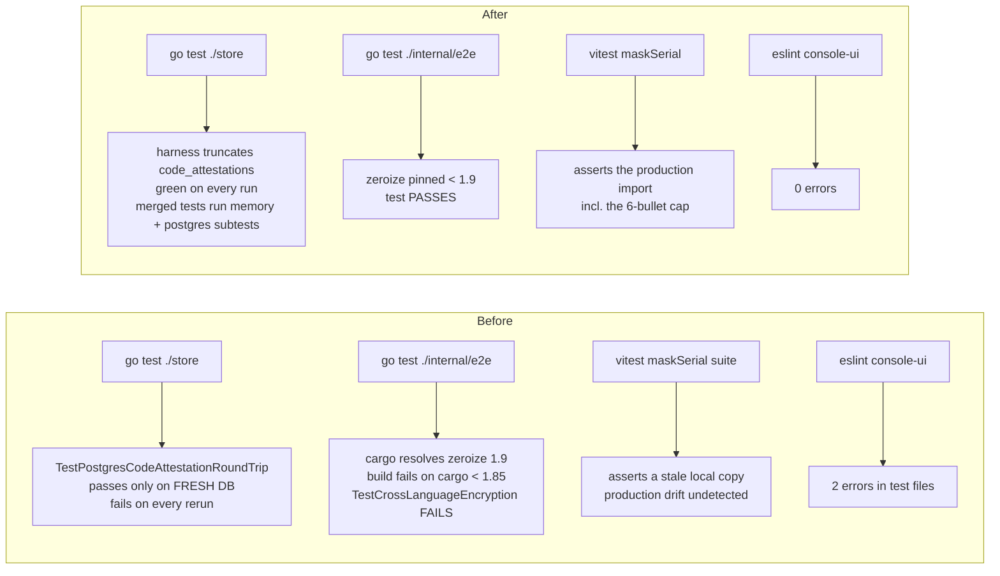
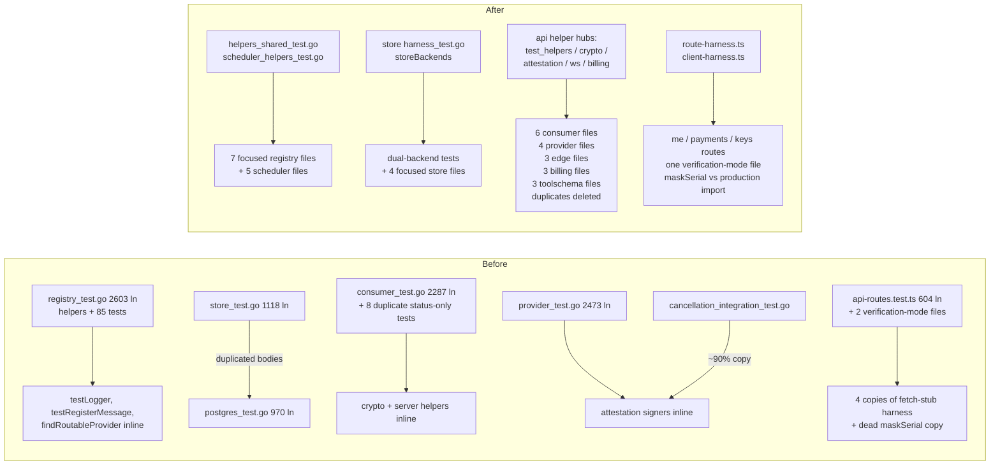

## Summary

Behavior-preserving refactor of the Go and TypeScript test suites, plus a final pass that deletes logically redundant tests: shared helpers are consolidated into single-definition harness files, seven monolithic test files (1,100–2,600 lines each) are split by concern, copy-pasted memory/postgres test pairs are collapsed into dual-backend tests, and two latent test-infrastructure bugs are fixed.

### Bug fixes surfaced by the refactor

- **`coordinator/store` harness leak:** `code_attestations` was missing from the Postgres truncate list, so `TestPostgresCodeAttestationRoundTrip` only passed against a fresh database and failed on every re-run.
- **`TestCrossLanguageEncryption` broken on cargo < 1.85:** the Rust decrypt fixture resolved `zeroize` 1.9.0 (needs `edition2024`). Pinned `zeroize >=1.6, <1.9`; the cross-compat test passes again.
- **console-ui `maskSerial` suite tested dead code:** `__tests__/verification-mode.test.tsx` asserted against a *local copy* of `maskSerial` defined inside the test file — zero production code exercised — and the copy had drifted from the real `src/lib/format/text.ts` implementation (production caps the mask at 6 bullets; the copy did not). The cap behavior is now asserted against the production import in `provider-dashboard-format.test.ts`.
- **console-ui lint errors (2 → 0):** `module`-variable assignment in `cert-verify.test.ts`, unused import in `provider-dashboard-format.test.ts`.

### Logically redundant tests deleted

- `coordinator/api` (778 → 770): `TestChatCompletionsNoAuth`/`InvalidKey` (subsumed by `TestOpenAI_AuthRequired`, which also asserts the OpenAI error body), `TestChatCompletionsInvalidJSON`/`MissingModel`/`MissingMessages` (subsumed by the `TestEdge_*` table/byte-identical versions), `TestHealthNoAuthRequired` (strictly weaker than `TestHealthEndpoint`), `TestListModelsWithAuth`/`NoAuth` (folded into `TestEdge_ModelsEndpointNoProviders` — which now asserts the list envelope — and `TestOpenAI_AuthRequired/list_models_no_auth`).
- `coordinator/store`: 13 `TestX`/`TestPostgresX` copy-paste pairs merged into dual-backend tests (`storeBackends`); runtime interface tests replaced by compile-time `var _ Store` checks.
- console-ui (423 → 415): duplicated `VerificationModeProvider` coverage merged into the colocated hydration-determinism file (its two unique behaviors — toggle-back round trip, invalid persisted value — moved there); dead `maskSerial` suite removed.
- `protocol`: hand-rolled `contains()` deleted in favor of `strings.Contains`.

Kept deliberately: registry's self-signed pair (fail-closed vs. selection-preference — different guarantees), store `ValidateKey` vs `AuthenticateKey` (different APIs), and the OpenAI-compat validation suite (asserts wire shape, not just status).

### Deduplicated helpers

| Area | After |
|---|---|
| `store/` | `harness_test.go` (`testPostgresStore`, `storeBackends`, `uniqueID`, interface checks) |
| `registry/` | `helpers_shared_test.go` + `scheduler_helpers_test.go` (incl. `gemmaBuild`/`qwenBuild` constants that were hiding in `dedicated_models_test.go`) |
| `api/` | `test_helpers_test.go`, `helpers_crypto_test.go`, `helpers_attestation_test.go` (one `buildTestAttestationJSON` core replacing a ~90% copy), `helpers_ws_test.go`, `billing_helpers_test.go` |
| console-ui | `__tests__/helpers/route-harness.ts` + `client-harness.ts` (replacing 4 copies of the fetch-stub lifecycle and 2 of `jsonResponse`) |

### Monolith splits

`registry_test.go` (2,603), `scheduler_test.go` (2,015), `messages_test.go` (1,531), `consumer_test.go` (2,287), `provider_test.go` (2,473), `edge_case_test.go` (1,376), `billing_integration_test.go` (1,311), `toolschema_test.go` (1,118), `store_test.go` (1,118), console-ui `api-routes.test.ts` (604) and `self-route.test.tsx` — each split into single-concern files.

### Explicitly out of scope

`provider-swift/Tests/` is untouched: its monoliths need macOS + MLX + Metal to compile, which the Linux agent VM cannot do, and restructuring 40k lines of Swift tests without a green `swift test` would violate the behavior-preserving rule. The Linux-buildable targets are already small, single-concern files. `e2e/` is structurally untouched (its `testbed/` harness is already modular).

## Verification

- `go test -race ./...` (repo-root CI command) against a real Postgres 16 — all packages pass; store suite green across consecutive runs (isolation fix verified).
- `go test -list` inventories diffed against `master` — identical through the refactor commits (registry 508, protocol 53, api 778, console-ui 423); the final commit's deletions are itemized above.
- `gofmt` clean; pre-commit and pre-push hooks green on every commit.
- console-ui: vitest 415/415, eslint 0 errors, `next build` green, no new `tsc` errors vs master. admin-ui: vitest 10/10.

## Before / after

### Behavior (what a test run does)

### Code (where test logic lives)

