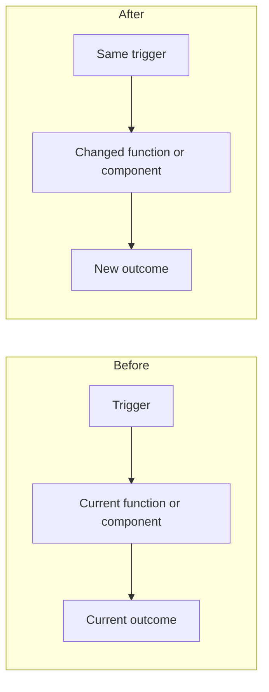

<!--
Thanks for contributing to d-inference. A few quick notes:

- Link an issue with `Closes #123` so the issue auto-closes on merge.
- Set a milestone if the change targets a specific release.
- Add `area:*` labels for the components you touched.
- Don't include external IPs, internal hostnames, or secrets in code, comments, or screenshots.
-->

## Summary

<!-- 1–3 sentences. What changed and why. -->

## Linked issue

Closes #

## Before and after

<!-- Replace these placeholders with the behavior and code paths changed by this PR. -->

## Test plan

<!--
A bulleted checklist of how you verified this. Include the specific commands you ran.
For UI changes, include a screenshot or short video.
-->

- [ ]
- [ ]

## Components touched

<!-- Tick all that apply so reviewers know what to look at. -->

- [ ] coordinator (Go)
- [ ] prompt sidecar (Rust)
- [ ] provider-swift (Swift CLI, app, and helpers)
- [ ] console-ui (Next.js)
- [ ] admin-ui (Next.js)
- [ ] landing
- [ ] e2e harness
- [ ] infra / CI / release
- [ ] docs

## Protocol / interface changes

<!--
If you changed a WebSocket message, an HTTP endpoint, a config key, or a CLI flag:
- Did you update the matching side? (provider-swift/Sources/ProviderCore/Protocol/ ↔ coordinator/protocol/messages.go)
- Are release artifacts (`release-swift.yml`, `scripts/install.sh`, `LatestProviderVersion`) still consistent?
- Does this need a version bump or a migration note?
-->

- [ ] No protocol/interface changes
- [ ] Yes — described above and matching side updated

## Notes for reviewers

<!-- Anything non-obvious: tradeoffs taken, edge cases not covered, follow-ups planned. -->
