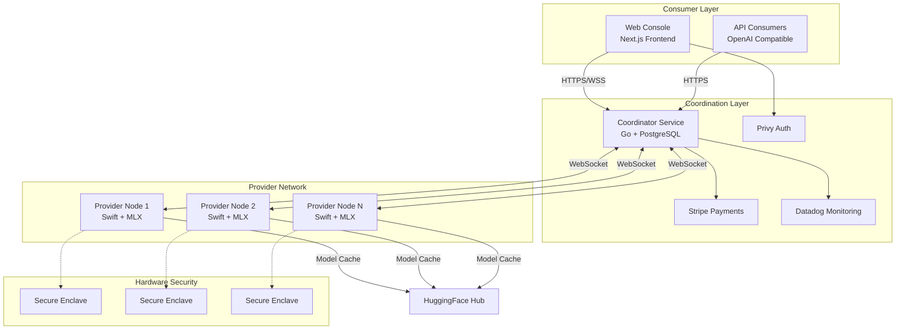
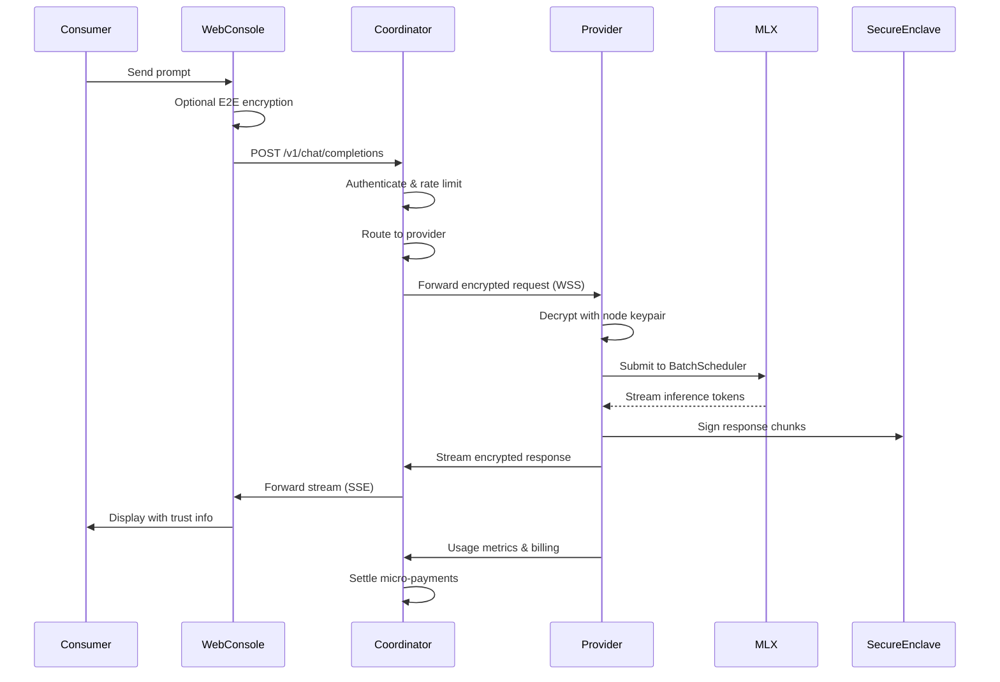
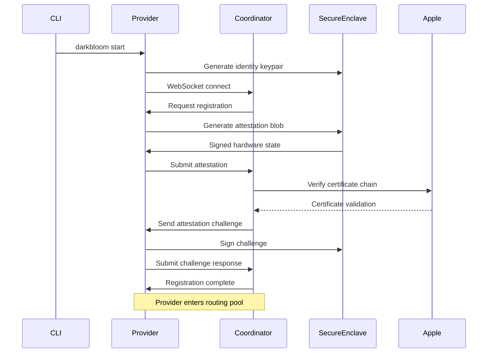

# Darkbloom Architecture

## Overview

The Darkbloom platform is a **decentralized AI inference network** that enables secure, trustless access to distributed GPU compute resources on Apple Silicon devices. The system implements a novel architecture combining hardware attestation, end-to-end encryption, and economic incentives to create a marketplace where consumers can access AI models while hardware providers earn revenue by contributing their compute capacity.

## System Architecture Overview

The Darkbloom platform follows a **hub-and-spoke architecture** with the coordinator service acting as the central orchestrator for a network of distributed provider nodes. The system implements three primary architectural patterns:

1. **Trust-Minimized Coordination**: Central coordination with cryptographic verification rather than trust
2. **Edge Inference Distribution**: AI models run on consumer hardware at the network edge
3. **Hardware-Attested Security**: Apple Secure Enclave provides tamper-evident trust anchors



## Core Services

### 1. Coordinator Service (Go)
**Location**: `coordinator/`  
**Role**: Central control plane and trust anchor for the distributed network

The coordinator implements a comprehensive **API gateway pattern** with integrated billing, authentication, and provider management. Key responsibilities include:

- **Request Routing**: Intelligent routing of inference requests to optimal providers based on model availability, trust level, and load balancing
- **Billing & Payments**: Micro-USD precision accounting with Stripe integration for deposits/withdrawals and referral revenue sharing
- **Provider Registry**: Real-time fleet management tracking 40+ provider states including hardware specs, model availability, and operational status
- **Hardware Attestation**: Verification of Apple Secure Enclave attestations to establish provider trust levels
- **Rate Limiting**: Multi-tier token bucket implementation with per-account request and token limits

**Architecture Pattern**: Layered hexagonal architecture with clear separation between API handlers, business logic, and external integrations.

### 2. Web Console (Next.js + TypeScript)
**Location**: `console-ui/`  
**Role**: Primary user interface for both consumers and providers

Modern React application implementing a **layered client-server pattern** with sophisticated state management:

- **Chat Interface**: Real-time conversational AI with streaming responses, thinking processes, and trust verification
- **Provider Dashboard**: Comprehensive interface for hardware providers to monitor devices, earnings, and attestation status
- **End-to-End Encryption**: Optional X25519 NaCl Box encryption between client and coordinator
- **Payment Integration**: Complete Stripe checkout and payout flows with balance management
- **Authentication**: Privy-based Web3-native authentication with automatic API key management

**Security**: All coordinator communication proxied through Next.js API routes with CSP headers and request sanitization.

### 3. Provider Core (Swift)
**Location**: `provider-swift/Sources/ProviderCore/`  
**Role**: Distributed inference engine and coordinator client

Actor-based architecture implementing **continuous batching** for efficient GPU utilization:

- **ProviderLoop**: Central orchestrator managing WebSocket connections, encrypted requests, and model lifecycle
- **BatchScheduler**: MLX-integrated inference engine with admission control and KV cache budgeting
- **CoordinatorClient**: Resilient WebSocket client with exponential backoff and connection management  
- **Security Subsystem**: Secure Enclave identity management, attestation generation, and anti-debugging protection
- **Telemetry Pipeline**: Async event collection with batching and coordinator upload

**Hardware Integration**: Deep integration with Apple Silicon through MLX framework, Metal GPU acceleration, and Secure Enclave security.

### 4. Darkbloom CLI (Swift)
**Location**: `provider-swift/Sources/darkbloom/`  
**Role**: Command-line interface for provider operations

**Command pattern architecture** built on Swift ArgumentParser with 16 subcommands:

- **Service Lifecycle**: Interactive model selection, daemon installation, and macOS launchd integration
- **Model Management**: Catalog browsing, local caching, and HuggingFace Hub integration
- **Authentication**: RFC 8628 device code flow for account linking and provider registration
- **Diagnostics**: Comprehensive system validation including hardware, security, and network checks
- **Updates**: Automated version checking and self-updating capabilities


## Data Flow Architecture

### Inference Request Flow



### Provider Registration Flow



## Security Architecture

### Trust Model

The Darkbloom platform implements a **hardware-attested trust model** that eliminates traditional infrastructure trust assumptions:

1. **Hardware Root of Trust**: Apple Secure Enclave provides tamper-evident identity anchors
2. **Attestation-Based Verification**: Continuous verification of provider security posture
3. **End-to-End Encryption**: Optional consumer-to-provider encryption with forward secrecy
4. **Zero-Knowledge Coordination**: Coordinator routes encrypted requests without accessing plaintext

### Security Measures

**Provider Security**:
- Secure Enclave identity with hardware-bound private keys
- Anti-debugging and environment scrubbing protections  
- Binary integrity verification and system security checks
- SIP, Secure Boot, and authenticated root volume validation

**Network Security**:
- TLS 1.3 for all transport layer communication
- WebSocket Secure (WSS) for real-time provider connections
- X25519 key exchange with ChaCha20-Poly1305 AEAD encryption
- Certificate pinning and attestation chain verification

**Application Security**:
- Comprehensive CSP headers and XSS protection
- API request sanitization and rate limiting
- JWT-based authentication with automatic key rotation
- Secure session management with httpOnly cookies

## Technology Stack

### Core Technologies

| Component | Language | Framework | Database | Key Libraries |
|-----------|----------|-----------|----------|---------------|
| Coordinator | Go | net/http, WebSocket | PostgreSQL | jwt, pgx, datadog-go |
| Web Console | TypeScript | Next.js 14 | - | React 19, Zustand, Privy |
| Provider Core | Swift | Actors, async/await | - | MLX, ArgumentParser |
| CLI Tools | Swift | ArgumentParser | - | Foundation, Security |
| Enclave Library | Swift | Foundation | - | Security, CryptoKit |

### External Integrations

**Cloud Services**:
- **Stripe**: Payment processing with Checkout and Connect Express
- **Datadog**: APM tracing, metrics collection, and log aggregation
- **Privy**: Web3-native authentication and account management
- **Cloudflare R2**: CDN for provider binaries and model distribution
- **PostgreSQL**: Primary database for accounts, billing, and analytics

**Apple Platform Services**:
- **Secure Enclave**: Hardware security module for attestation
- **MLX Framework**: GPU-accelerated machine learning inference
- **Metal**: Low-level GPU compute and memory management
- **launchd**: macOS service management for background operation
- **Unified Logging**: System-integrated logging via os.log

**AI/ML Infrastructure**:
- **HuggingFace Hub**: Model repository and caching infrastructure
- **MLX Models**: Apple Silicon optimized model weights and architectures
- **OpenAI API**: Compatibility layer for standard inference interfaces

## Deployment Architecture

### Coordinator Deployment
- **Platform**: Google Cloud Platform Confidential VMs
- **Database**: Managed PostgreSQL with connection pooling
- **Monitoring**: Datadog APM with custom metrics and alerting
- **Load Balancing**: Cloud Load Balancer with health checks
- **Security**: VPC isolation with IAM-based access control

### Provider Distribution
- **Target Platform**: Apple Silicon Macs (M1/M2/M3 series)
- **Installation**: Self-contained Swift binary with automatic updates
- **Service Management**: macOS launchd for persistent background operation
- **Model Storage**: Local HuggingFace cache with LRU eviction
- **Security Context**: User-space daemon with Secure Enclave access

### Web Console Deployment
- **Platform**: Vercel Edge Runtime with global CDN
- **Build System**: Next.js with TypeScript and Tailwind CSS
- **Analytics**: Vercel Analytics and Google Analytics integration
- **Security**: CSP headers, HTTPS enforcement, and XSS protection

## Performance & Scalability

### Coordinator Scalability
- **Request Handling**: 10,000+ concurrent WebSocket connections per instance
- **Database**: Read replicas for analytics queries, write clustering for billing
- **Rate Limiting**: Distributed token buckets with Redis backend
- **Caching**: In-memory provider registry with PostgreSQL persistence

### Provider Performance
- **Inference Throughput**: 100+ tokens/second on Apple Silicon with continuous batching
- **Model Loading**: LRU cache with memory-aware eviction policies
- **Concurrent Requests**: Multiple batch schedulers per provider with admission control
- **Memory Efficiency**: MLX framework optimization for Apple Silicon architecture

### Network Optimization
- **Request Routing**: Sub-100ms provider selection with capacity-aware algorithms
- **Streaming Responses**: Server-sent events with chunked transfer encoding
- **Connection Pooling**: Persistent WebSocket connections with heartbeat management
- **CDN Distribution**: Global edge caching for static assets and model manifests

## Monitoring & Observability

### Metrics Collection
- **Application Metrics**: Request latency, error rates, and throughput via Datadog
- **Infrastructure Metrics**: CPU, memory, and network utilization monitoring
- **Business Metrics**: Inference volume, provider earnings, and user engagement
- **Security Metrics**: Attestation failures, connection anomalies, and auth events

### Logging Strategy
- **Structured Logging**: JSON-formatted logs with correlation IDs
- **Centralized Aggregation**: Datadog Logs API with real-time indexing
- **Privacy Preservation**: PII scrubbing and differential privacy techniques
- **Retention Policies**: 30-day retention for debug logs, 1-year for audit trails

### Error Handling
- **Circuit Breakers**: Automatic failure detection with exponential backoff
- **Graceful Degradation**: Fallback providers and cached responses
- **Error Propagation**: Structured error responses with actionable information
- **Alerting**: PagerDuty integration for critical system failures

## Development Workflow

### Repository Structure
```
d-inference/
├── coordinator/           # Go service (central control plane)
├── console-ui/           # Next.js frontend application
├── provider-swift/       # Swift provider implementation
│   ├── Sources/
│   │   ├── ProviderCore/     # Core inference engine
│   │   ├── darkbloom/        # CLI application
│   │   └── ProviderCoreFoundation/  # Utilities
├── enclave/              # Secure Enclave attestation library
├── provider/             # Legacy Rust provider (deprecated)
└── e2e/                  # End-to-end testing framework
```