# Architecture

> Last updated: 2026-09-03 · commit `5d400cf75`

This directory is the source of truth for how Darkbloom works. The code in `coordinator/`, `provider-swift/`, `console-ui/`, and `e2e/` is canonical; these docs describe and cite it.

## Start here

| Doc | What it covers |
|---|---|
| [overview.md](overview.md) | High-level system architecture, components, and trust model |
| [data-flow.md](data-flow.md) | End-to-end request lifecycle from consumer to provider and back |

## Components

| Doc | Component |
|---|---|
| [components/coordinator.md](components/coordinator.md) | Go control plane (HTTP API, WebSocket, registry, billing) |
| [components/provider.md](components/provider.md) | Swift `darkbloom` provider CLI and inference engine |
| [components/console-ui.md](components/console-ui.md) | Next.js 16 / React 19 consumer console: 13 pages, 33 `/api/*` relay handlers, Privy + console-key credential paths, SSE chat, optional browser-side sealing; plus the static `landing/` site |
| [components/admin-ui.md](components/admin-ui.md) | Internal read-only operator dashboard: HTTP Basic gate, single `pg.Pool` on the read-only replica, SELECT-only RSC pages, no API routes |
| [components/mlx-swift.md](components/mlx-swift.md) | MLX-Swift inference backend and model execution |
| [components/consumer.md](components/consumer.md) | Consumer surface: OpenAI-compatible API, SDKs, and console |

## Security

| Doc | Concern |
|---|---|
| [security/encryption.md](security/encryption.md) | NaCl Box encryption between consumer, coordinator, and provider |
| [security/attestation.md](security/attestation.md) | Secure Enclave, MDM/MDA, APNs code identity, and trust levels |
| [security/enrollment.md](security/enrollment.md) | Device enrollment: MDM, SCEP, and profile generation |
| [security/identity-binding.md](security/identity-binding.md) | How APNs, X25519, SE P-256, and MDA identities bind together |

## Operations inside the architecture

| Doc | Concern |
|---|---|
| [routing.md](routing.md) | How a request becomes a provider choice: eligibility gates, cost model, selection, hedged dispatch, servability, breakers |
| [scheduling.md](scheduling.md) | Per-model queue, slot states, token-budget admission, concurrency caps, model swaps, warm pool, heartbeat and eviction |
| [operations/billing.md](billing.md) | Pricing, reservations, ledger, Stripe deposits and Connect payouts, referral, base rewards |
| [operations/model-registry.md](model-registry.md) | Model manifests, aliases, and provider downloads |
| [operations/telemetry.md](telemetry.md) | Telemetry schema, symmetry, and ingestion |

## Cross-cutting topics

| Doc | Topic |
|---|---|
| [inference.md](inference.md) | How inference requests are decoded, batched, and served |
| [cache-aware-routing.md](cache-aware-routing.md) | Provider-confirmed exact prefix-cache routing: proof, holders, cost discount, `EIGENINFERENCE_CACHE_ROUTING_MODE` (default `off`) |
| [prompt-contract-sidecar.md](prompt-contract-sidecar.md) | Local prompt planning, artifact identity, binary block hashing, and failure isolation |
| [request-outcome-observability.md](request-outcome-observability.md) | Request outcome taxonomy across client, provider, and billing paths |
| [system-profiler.md](system-profiler.md) | Per-attempt request profiles and fleet snapshots: schema, clocks, validation, query recipes |
| [telemetry-inventory.md](../reference/telemetry-inventory.md) | Inventory of every telemetry datum collected today, its producer, sink, cadence, and gaps |
| [storage.md](storage.md) | KV cache, prefix cache, and on-disk model storage |
| [hardware-support.md](hardware-support.md) | Supported Apple Silicon tiers and capability mapping |

## Design decisions (ADRs)

| Doc | Decision |
|---|---|
| [decisions/apns-code-attestation.md](../design/apns-code-attestation.md) | APNs-based code-identity attestation for genuine-binary proof |
| [decisions/ssd-kv-cache.md](../design/ssd-kv-cache.md) | SSD-backed prefix cache architecture |
| [decisions/kv-cache-lookup-shadowing.md](../design/kv-cache-lookup-shadowing.md) | RAM-first lookup shadowing on hybrid sliding-window models |

## Rules

- Claims must cite canonical code paths.
- The privacy model is hop-by-hop encryption: the coordinator decrypts consumer bodies in Confidential VM memory for routing and billing, but does not log or retain prompt content.
- If code and docs disagree, the code wins; open a PR to fix the docs.
