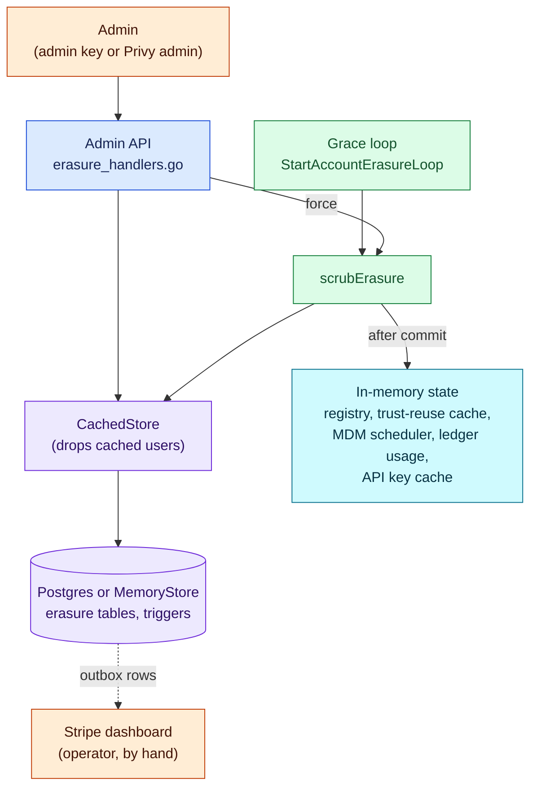
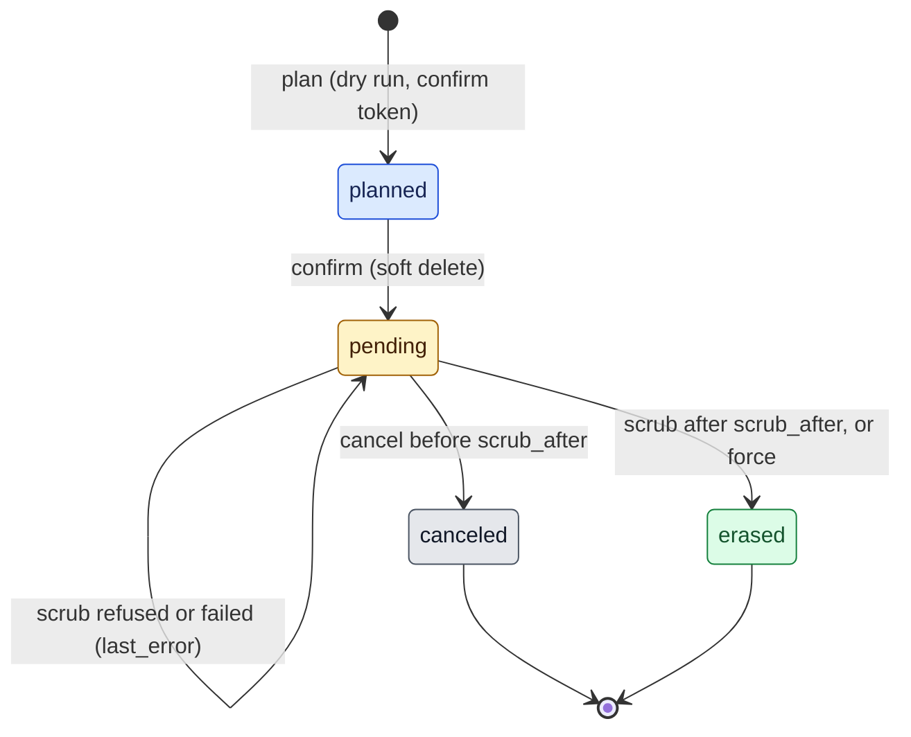
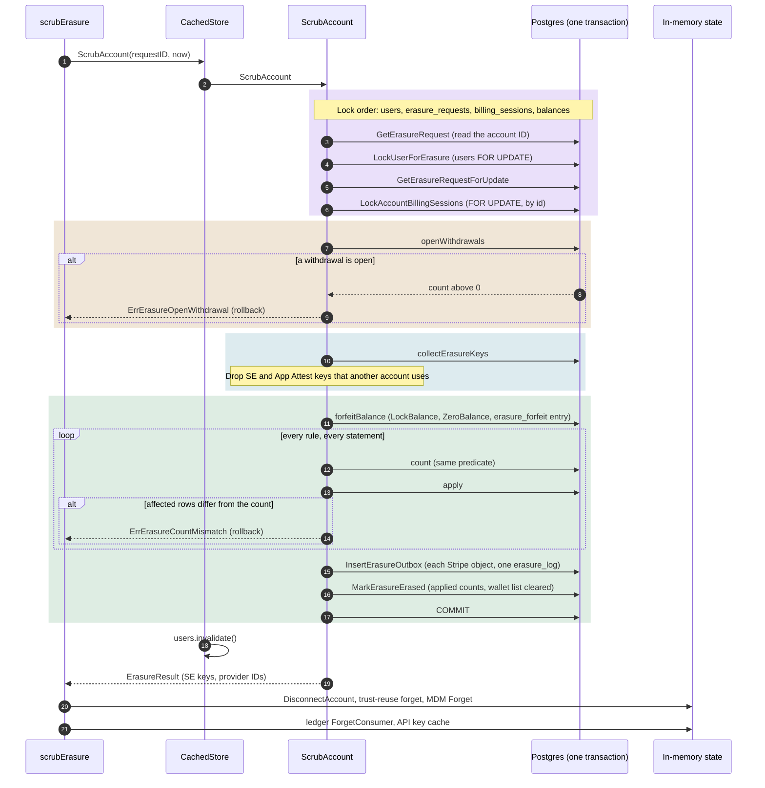

# Account erasure

> Last updated: 2026-10-04

This page explains how the coordinator erases the personal data of one
consumer or provider account (GDPR Article 17): the request states, the scrub
transaction, the hooks that keep an erasure from being undone, and what stays.
Read it before you change a table that holds personal data. The procedure is
the [account erasure runbook](../operations/account-erasure.md); the per-column
rules are in [personal-data rules](../reference/personal-data-rules.md); the
HTTP shapes are in [API contracts](../reference/api-contracts.md#account-erasure).

## Context

A person can ask Darkbloom to erase their personal data. The coordinator holds
that data in Postgres rows (email, Stripe IDs, host names, serial numbers,
locations, App Attest proofs, referrer codes, wallet addresses), in in-memory
caches, and at Stripe. Erasure here means: remove or replace every value that
identifies the person, keep the financial records the platform must keep, and
make sure no later write brings the data back.

IDs stay. An account ID, provider ID, machine ID, request ID, key ID or public
key is a random or derived identifier. Alone it does not identify a person, and
the ledger, earnings and audit rows need it to stay consistent
(`coordinator/store/erasure_rules.go`, file comment). After the scrub, nothing
links those IDs to a person.

Erasure is irreversible, so it runs in steps: an admin plans it (a dry run),
confirms it (a soft delete that starts a grace period), and only after the
grace period does the scrub remove the data. During the grace period an admin
can cancel.

## Mechanism

### Components

Blue: HTTP handlers. Green: background work. Purple: the store and its
tables. Cyan: in-process state that the database transaction cannot reach.
Orange: people and services outside the coordinator. After a confirm the
admin API also disconnects the account's providers and clears the API key
cache.

| Component | Role | Code |
|---|---|---|
| Admin API | Four admin routes under `/v1/admin/accounts/{account_id}/erasure` | `coordinator/api/erasure_handlers.go` |
| Grace loop | Leases due `pending` requests and scrubs them | `coordinator/api/erasure_loop.go` (`StartAccountErasureLoop`, `runDueErasures`) |
| Store | Plan, confirm, cancel, scrub, status; one interface, two backends | `coordinator/store/erasure.go` (`AccountErasureStore`), `coordinator/store/erasure_postgres.go`, `coordinator/store/erasure_memory.go` |
| Rule table | One rule per personal column or row kind | `coordinator/store/erasure_rules.go` (`erasureRules`) |
| `CachedStore` | Drops the cached users after each erasure write | `coordinator/store/cached.go` (`RequestAccountErasure`, `CancelAccountErasure`, `ScrubAccount`) |
| Post-commit clears | Registry, trust-reuse cache, MDM scheduler, ledger usage, API key cache | `coordinator/api/erasure_loop.go` (`scrubErasure`) |
| Outbox | One row per Stripe object and one `erasure_log` row, written by the scrub | `coordinator/store/erasure_keys.go` (`outboxRows`) |

No worker delivers the outbox rows in this version. Each row stays `pending`,
and an operator deletes the Stripe objects by hand
([runbook](../operations/account-erasure.md#steps)).

### Request states

| State | Meaning | Set by |
|---|---|---|
| `planned` | A dry run is stored with row counts and the hashes of a confirm token and the wallet list. The account is live. | `SaveErasurePlan` (`InsertErasurePlan`, `UpdateErasurePlan`) |
| `pending` | The account is soft deleted and waits for `scrub_after`. | `RequestAccountErasure` (`MarkErasurePending`) |
| `erased` | The scrub committed. | `ScrubAccount` (`MarkErasureErased`) |
| `canceled` | An admin ended the request during the grace period. | `CancelAccountErasure` (`MarkErasureCanceled`) |

An account has at most one `planned` or `pending` request: the partial unique
index `erasure_requests_open` enforces it
(`coordinator/store/schema/migrations/00018_erasure_tables.sql`). A new plan
replaces the token of a `planned` request. A plan while a request is `pending`,
or after the scrub, answers 409 `erasure_conflict`, because the user row is no
longer live.

### Plan

`PlanAccountErasure` runs in a read-only `REPEATABLE READ` transaction. It
collects the account's keys (the same `collectErasureKeys` the scrub uses),
runs every rule's count query, counts open withdrawals, and reads the balance.
It writes nothing. The handler then makes a 32-byte random confirm token and
stores only its SHA-256 hash (`erasureTokenHash`), the hash of the normalized
wallet list (`erasureWalletHash`), and the row counts (`ErasureCounts`). The
email and Stripe IDs go to the admin in the response and are not stored.

### Confirm: the soft delete

`RequestAccountErasure` locks the `users` row, then the open request. It
checks, in order: the request is `planned` and the user is live; the token is
valid and not expired (`erasureTokenValid`, constant-time compare); the email
matches, ignoring case and outer spaces (`normalizeErasureEmail`); the wallet
list hash matches; and no withdrawal is open (`openWithdrawals`). Then, in the
same transaction, it sets `deleted_at` on the user and its providers, sets
`active = false` and `deleted_at` on its API keys and provider tokens, and
moves the request to `pending` with `scrub_after` = now + grace.

After the commit the handler clears the API key cache and disconnects the
account's live providers (`registry.DisconnectAccount`). The tokens are already
revoked, so a provider that reconnects comes back unlinked. While the request
is `pending`, every read of a live user, key, provider or token skips the row
([soft-deleted rows](storage.md#soft-deleted-rows)).

### Grace loop

`StartAccountErasureLoop` runs once at start and then every
`erasureScrubInterval`. Each pass leases up to `erasureScrubBatch` due
`pending` requests for `erasureScrubLease` (`LeaseDueErasureRequests`,
`FOR UPDATE SKIP LOCKED`) and scrubs each one. A failed scrub stores its error
in `last_error` (`RecordAccountErasureFailure`) and runs again when the lease
ends. `force: true` on the confirm call runs the same `scrubErasure` at once.
Values: [configuration and constants](../reference/personal-data-rules.md#configuration-and-constants).

### The scrub transaction

1. **Lock.** `ScrubAccount` reads the request to learn the account, then locks
   `users`, the request, the account's `billing_sessions` (ordered by `id`),
   and later `balances`. Every erasure step locks `users` before
   `erasure_requests`, and the scrub takes `billing_sessions` before
   `balances`, the same order as `CompleteStripeCheckout`, so the two cannot
   deadlock (`TestScrubLocksBillingSessionsBeforeBalances`,
   `TestRequestAccountErasureLocksUserFirst`).
2. **Refuse while money moves.** `openWithdrawals` runs again inside the
   transaction. An open withdrawal aborts with `ErrErasureOpenWithdrawal`.
3. **Collect keys.** `collectErasureKeys` reads every key of the account
   before anything changes: provider IDs, Secure Enclave keys, serial numbers
   (from providers, sessions and log reports), App Attest key IDs, the
   referrer code, Checkout Session IDs, every Express account and Global
   Payouts recipient in the user row and its withdrawals, `mda_serial` alias
   digests, and the wallet addresses stored at confirm. It also draws the
   random replacements (`erased:<uuid>` for the Privy ID, `erased-<uuid>` for
   the referrer code and for each wallet address).
4. **Forfeit.** `forfeitBalance` locks `balances`, sets both columns to 0, and
   writes one `erasure_forfeit` ledger entry of minus the balance with
   reference `erasure:<request_id>`. The ledger still sums to the balance.
5. **Apply the rules.** `applyRules` runs each statement of each rule in
   `erasureRules` order. Each statement has a count query with the same
   predicate; the count runs first, then the update or delete. If the affected
   rows differ from the count, the scrub returns `ErrErasureCountMismatch` and
   nothing commits. A rule whose keys are empty runs no statement (`whenAny`).
6. **Write the outbox.** One `erasure_outbox` row per Express account, per
   Global Payouts recipient, per batch of up to `ErasureCheckoutBatch`
   Checkout Session IDs, and one `erasure_log` row (`outboxRows`).
7. **Mark erased.** `MarkErasureErased` stores the planned and applied counts,
   clears `wallet_addresses`, `lease_until` and `last_error`, and the
   transaction commits.
8. **Clear in-memory copies.** `CachedStore` drops its cached users. Then
   `scrubErasure` disconnects the account's providers, removes the erased
   Secure Enclave keys from the trust-reuse cache (`trustReuseCache.forget`)
   and the MDM scheduler (`mdmVerificationScheduler.Forget`, which also cancels
   running attempts and drops UDID routes), drops the ledger's in-memory usage
   history (`Ledger.ForgetConsumer`), and clears the API key cache. Shared
   keys are not in `ErasureResult.SEKeys`, so their cache entries stay.

`MemoryStore.ScrubAccount` applies the same rules to its maps through
`memoryErasureRules`, under one store lock.

### Refused credits after the scrub

A payout can bounce, a Global Payout can come back, or a settlement or
referral reward can land after the scrub. Each would refill a forfeited
account. Migration 21
(`coordinator/store/schema/migrations/00021_erasure_refuse_credits.sql`)
adds three triggers that fire only when the account has an `erased` request
(`erasure_account_erased`):

| Trigger | Table, event | Effect |
|---|---|---|
| `erasure_keep_balance_insert` | `balances`, `BEFORE INSERT` | A positive new balance is set to 0 |
| `erasure_keep_balance_update` | `balances`, `BEFORE UPDATE` | An increase is capped at the old value; decreases apply |
| `erasure_refuse_ledger_credit` | `ledger_entries`, `BEFORE INSERT` when `amount_micro_usd > 0` | The row is dropped (`RETURN NULL`) and an `erasure_refused_credits` row records type, amount and a cleaned reference |

The caller's statement succeeds, so a webhook or settlement acknowledges and
is not redelivered. The ledger and the balance both stay at zero. Credits
during the grace period still apply, because the erasure can be canceled.
`MemoryStore` does the same in `refuseErasedCreditLocked`, called from
`creditLocked`, `globalPayoutLedgerLocked` and `MigrateAccountBalance`. Schema:
[`erasure_refused_credits`](../reference/personal-data-rules.md#erasure_refused_credits).

### Protections against undoing an erasure

| Path that could bring data back | Guard | Code |
|---|---|---|
| A late heartbeat persist rewrites a provider row | The upsert skips a soft-deleted row | `coordinator/store/postgres.go` (`upsertProviderRecord`, `WHERE providers.deleted_at IS NULL`); `MemoryStore.upsertProviderRecordLocked` |
| A reconnect restores provider state from the store | The restore read filters `deleted_at IS NULL` | `coordinator/store/provider_restore.go` (`GetProviderForRestore`) |
| A provider reconnects with its old token | Tokens are revoked in the confirm commit, before the disconnect | `RequestAccountErasure` (`SoftDeleteProviderTokens`); `registry.DisconnectAccount` |
| An open provider session backfills a serial | The scrub closes open sessions | `ScrubProviderSessionsRows` (`disconnected_at = COALESCE(disconnected_at, NOW())`) |
| An API key keeps working from the cache | Keys are revoked, and the handler clears the key cache | `SoftDeleteAPIKeys`; `invalidateAllAPIKeyCache` |
| A Privy login during the grace period creates a second account | 403 `account_pending_deletion` | `coordinator/auth/privy.go` (`GetOrCreateUser`, `ErrAccountPendingDeletion`); `writePrivyUserError` |
| A Privy login after the scrub finds the old account | The stored Privy ID is random, so the login makes a new, empty account | `ScrubUsersRow` |
| A cached user keeps authenticating | `CachedStore` overrides the three writers | `coordinator/store/cached.go` |
| A Checkout Session completes after the scrub | `ErrCheckoutErased`: the webhook answers 200 and credits nothing | `coordinator/store/stripe_settlement_postgres.go` (`CompleteStripeCheckout`); `coordinator/api/stripe_checkout_webhook.go` |
| A late credit refills the balance | The refused-credit triggers | `00021_erasure_refuse_credits.sql` |

### Shared machines and shared keys

One Mac can move between accounts, so some rows belong to more than one
account. The scrub never deletes another account's data:

- **Secure Enclave keys.** `ListSharedSEKeys` finds keys that a provider of
  another account also has. They leave `SEKeys`, so their
  `provider_trust_reuse`, `provider_verification_jobs`, `code_attestations`
  and `code_attest_push_budgets` rows stay, and so do their trust-reuse cache
  entries and MDM jobs.
- **App Attest keys.** `ListSharedAppAttestKeys` finds key IDs that another
  session also used. Their receipts, receipt blobs and receipt jobs stay.
- **`mda_serial` aliases.** These digests have no account scope.
  `ListMDASerialAliasesForErasure` marks an alias shared when another account
  has a session on its machine; a shared alias stays, the others are deleted.

The plan and the applied summary report each kept group under `retained`
with its reason (`erasureKeys.retained`). `TestErasureMarkerPostgres` seeds a
second account that shares a machine and a key, and fails if any of its data
changes.

### What is kept, and why

The scrub keeps IDs, public keys, financial records, machine sessions, the
App Attest replay fences, shared rows, the erasure record itself and the
outbox's Stripe IDs. The full list with each reason is in
[personal-data rules](../reference/personal-data-rules.md#retained-data).

Outside the live database:

- **Backups and point-in-time recovery** keep the erased data until their
  retention ends. A restore can bring an erased account back; the runbook
  says how to [replay erasures after a restore](../operations/account-erasure.md#after-a-database-restore).
- **Datadog logs** written before the erasure keep what they hold until the
  Datadog retention ends. The coordinator does not delete log events. The
  rule that log lines hold no personal data is
  [PR #1327](https://github.com/Layr-Labs/d-inference/pull/1327) (pending).
- **Stripe** keeps its own copy until an operator deletes or redacts it.

## Invariants

1. **A scrub changes exactly the rows it counted, or nothing.** Every
   statement runs after a count with the same predicate in one transaction; a
   difference rolls back (`applyRules`, `ErrErasureCountMismatch`;
   `TestErasureCountMismatchAborts`).
2. **Every scrub statement is bounded by a key collected first.** Rules take
   their predicates from `erasureKeys`; a rule with no keys runs nothing
   (`whenAny`, `walletStatements`).
3. **No erasure step runs while money moves.** Confirm and scrub both refuse
   with `ErrErasureOpenWithdrawal` (`openWithdrawals`;
   `TestAccountErasureRefusesOpenWithdrawal`).
4. **An account has at most one open request.** Unique index
   `erasure_requests_open`.
5. **Locks are taken in one order.** `users`, `erasure_requests`,
   `billing_sessions`, `balances` (`ScrubAccount`;
   `TestScrubLocksBillingSessionsBeforeBalances`).
6. **An erased account's balance stays zero.** The migration 21 triggers and
   `refuseErasedCreditLocked` (`TestErasedAccountRefusesCredits`).
7. **The erasure record holds no personal data after the scrub.** The token
   and wallet list are stored as hashes; `wallet_addresses` is cleared by
   `MarkErasureErased` and `MarkErasureCanceled`; the email is never stored.
8. **Another account's rows survive.** Shared keys and aliases are removed
   from the key sets before any statement runs (`withoutKeys`;
   `TestErasureMarkerPostgres`).
9. **Both backends know every rule.** `TestMemoryErasureRulesCoverRuleTable`
   fails when a rule has no memory form.
10. **Two coordinators never scrub one request at once.**
    `LeaseDueErasureRequests` uses `FOR UPDATE SKIP LOCKED` and a lease.

## Failure modes

| Symptom | Cause | Where to look |
|---|---|---|
| Request stays `pending` after `scrub_after`; `last_error` is `erasure: account has a withdrawal that is not in a terminal state` | A withdrawal is in flight or was paid within the bounce window | `GET /v1/admin/accounts/{account_id}/erasure`; the loop retries after each lease |
| `last_error` starts with `erasure: affected rows differ from the count:` and names a rule | A row changed between count and statement, or a trigger skips the write (`TestErasureCountMismatchAborts`) | Retried by the loop; a repeat needs a code check of the named rule and its table's triggers |
| Confirm answers 403 `invalid_confirm_token` | Token expired (`erasureConfirmTTL`) or a newer plan replaced it | Plan again |
| Confirm answers 400 `wallet_mismatch` | The wallet list differs from the plan's list | Plan again with the list you will confirm |
| `force: true` answers 409 or 500 with `scrub_error` | The scrub failed after the soft delete committed | The request is `pending`; the loop retries |
| `refused_credits` grows after the scrub | Money arrived for an erased account | [Runbook](../operations/account-erasure.md#refused-credits) |
| The webhook log says `stripe Checkout completed for an erased account; refund it in Stripe` | A Checkout Session paid after the scrub | Refund it in the Stripe dashboard |
| Outbox rows stay `pending` | No worker in this version | Delete the Stripe objects by hand ([runbook](../operations/account-erasure.md#steps)) |

## Code map

| Concern | File, symbol |
|---|---|
| Types, states, errors, interface | `coordinator/store/erasure.go` (`ErasureState`, `ErasureTarget`, `AccountErasureStore`, `ErrErasure*`) |
| Rule table | `coordinator/store/erasure_rules.go` (`erasureRules`, `piiAction`, `erasureRetained*` reasons) |
| Key collection, outbox rows | `coordinator/store/erasure_keys.go` (`collectErasureKeys`, `outboxRows`, `retained`) |
| Postgres steps | `coordinator/store/erasure_postgres.go` (`PlanAccountErasure`, `RequestAccountErasure`, `ScrubAccount`, `applyRules`, `forfeitBalance`) |
| SQL | `coordinator/store/queries/erasure.sql` (sqlc input), `coordinator/store/storedb/erasure.sql.go` (generated) |
| Memory steps | `coordinator/store/erasure_memory.go` (`memoryErasureRules`, `refuseErasedCreditLocked`) |
| Schema | `coordinator/store/schema/migrations/00018_erasure_tables.sql`, `coordinator/store/schema/migrations/00021_erasure_refuse_credits.sql`, `coordinator/store/postgres_migration_indexes.go` (versions 19, 20) |
| Cache invalidation | `coordinator/store/cached.go` |
| HTTP | `coordinator/api/erasure_handlers.go` |
| Loop, post-commit clears | `coordinator/api/erasure_loop.go` (`StartAccountErasureLoop`, `scrubErasure`) |
| In-memory forgets | `coordinator/registry/provider_lifecycle.go` (`DisconnectAccount`), `coordinator/api/trust_reuse.go` (`forget`), `coordinator/api/mdm_scheduler_queue.go` (`Forget`), `coordinator/payments/payments.go` (`ForgetConsumer`) |
| Login block | `coordinator/auth/privy.go` (`GetOrCreateUser`), `coordinator/api/server.go` (`writePrivyUserError`) |
| Late Checkout | `coordinator/store/stripe_settlement.go` (`ErrCheckoutErased`), `coordinator/api/stripe_checkout_webhook.go` |
| Tests | `coordinator/store/erasure_test.go`, `coordinator/store/erasure_marker_test.go`, `coordinator/store/erasure_marker_memory_test.go`, `coordinator/store/erasure_credits_test.go`, `coordinator/store/erasure_lock_order_test.go`, `coordinator/api/erasure_handlers_test.go`, `coordinator/api/erasure_loop_test.go` |

## Related

- [Account erasure runbook](../operations/account-erasure.md): plan, confirm, verify, cancel, restore replay
- [Personal-data rules](../reference/personal-data-rules.md): rule table, retained data, schemas, constants
- [API contracts: account erasure](../reference/api-contracts.md#account-erasure): routes, bodies, errors
- [Add personal data safely](../developer/personal-data.md): what a new column or writer must do
- [Storage](storage.md): soft-deleted rows and the store interface
- [Billing](billing.md): the `erasure_forfeit` ledger type
