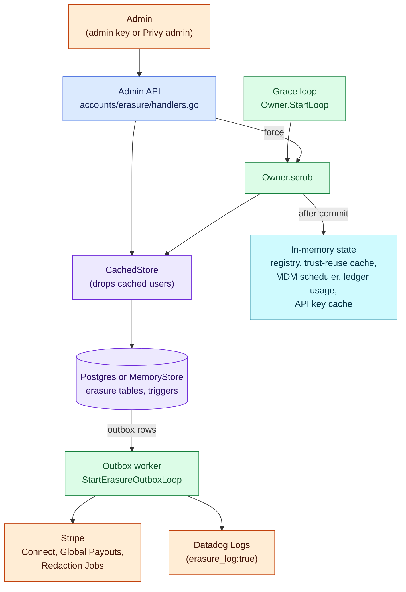
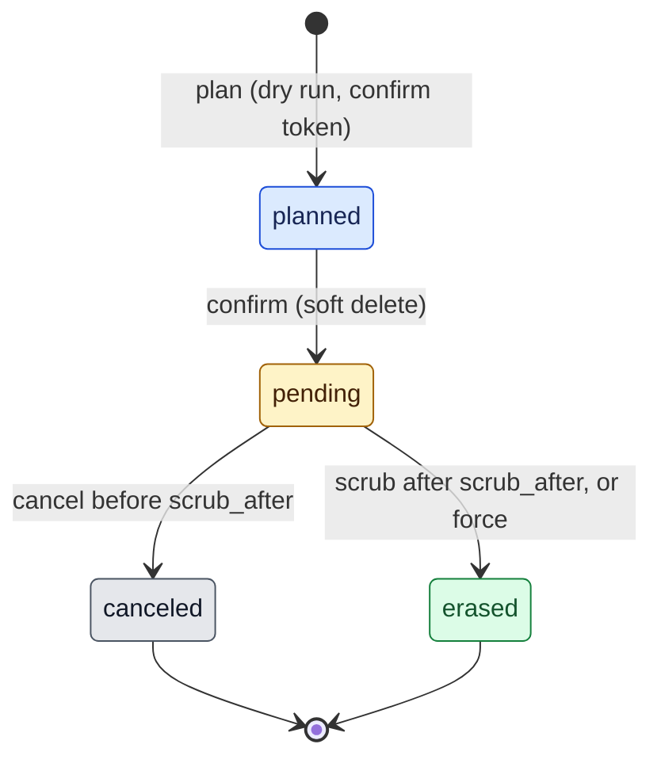
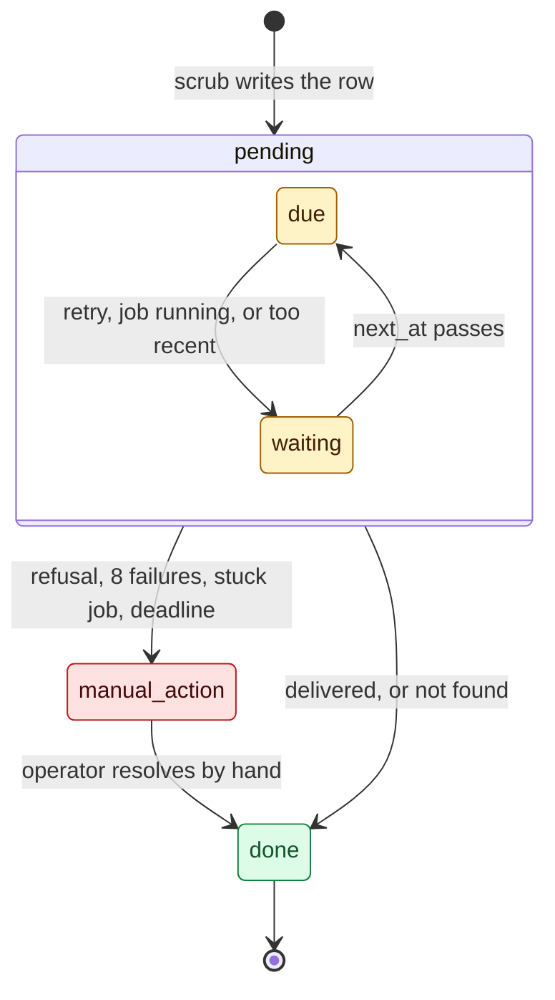

# Account erasure

> Last updated: 2026-10-06

This page explains how the coordinator erases the personal data of one
consumer or provider account (GDPR Article 17): the request states, the scrub
transaction, the hooks that keep an erasure from being undone, and what stays.
Read it before you change a table that holds personal data. The procedure is
the [account erasure runbook](../operations/account-erasure.md); the per-column
rules are in [personal-data rules](../reference/personal-data-rules.md); the
HTTP shapes are in [API contracts](../reference/api-contracts.md#account-erasure).

## Context

A person can ask Darkbloom to erase their personal data. The coordinator holds
that data in Postgres rows (email, Stripe IDs, host names, serial numbers,
locations, App Attest proofs, referrer codes, wallet addresses), in in-memory
caches, and at Stripe. Erasure here means: remove or replace every value that
identifies the person, keep the financial records the platform must keep, and
make sure no later write brings the data back.

Account, provider, machine, request and key identifiers stay so financial and
audit records remain consistent. They remain pseudonymous identifiers, not a
guarantee of anonymity: backups, shared-device records and external financial
records can retain links. The retained audit also includes actor identifiers and
the operator-supplied reason. Operators must keep names, emails and other
personal details out of that free text
(`coordinator/internal/store/erasure/rules.go`, `coordinator/store/erasure_types.go`).

Erasure is irreversible, so it runs in steps: an admin plans it (a dry run),
confirms it (a soft delete that starts a grace period), and only after the
grace period does the scrub remove the data. During the grace period an admin
can cancel.

## Mechanism

### Components



Blue: HTTP handlers. Green: background work. Purple: the store and its
tables. Cyan: in-process state that the database transaction cannot reach.
Orange: people and services outside the coordinator. After a confirm the
admin API also disconnects the account's providers and clears the API key
cache.

| Component | Role | Code |
|---|---|---|
| Admin API | Four admin routes under `/v1/admin/accounts/{account_id}/erasure` | `coordinator/api/accounts/erasure/handlers.go` (`HandlePlan`, `HandleRequest`, `HandleStatus`, `HandleCancel`); routes in `coordinator/api/routes.go` |
| Grace loop | Leases due `pending` requests and scrubs them | `coordinator/api/accounts/erasure/loop.go` (`Owner.StartLoop`, `runDue`); started by `Server.StartAccountErasureLoop` (`coordinator/api/accounts_lifecycle.go`) |
| Store | Plan, confirm, cancel, scrub, status; one interface, two backends | `coordinator/store/erasure_types.go` (`AccountErasureStore`), `coordinator/store/postgres/erasure.go`, `coordinator/store/memory/erasure.go`, `coordinator/store/memory/erasure_rules.go` |
| Rule table | One rule per personal column or row kind; each backend maps every rule name to its own statements | `coordinator/internal/store/erasure/rules.go` (`Rules`); `coordinator/store/postgres/erasure_rules.go` (`erasureStatements`); `coordinator/store/memory/erasure_rules.go` (`memoryErasureRules`) |
| `CachedStore` | Drops the cached users after each erasure write | `coordinator/store/cached.go` (`RequestAccountErasure`, `CancelAccountErasure`, `ScrubAccount`) |
| Post-commit clears | Registry, trust-reuse cache, MDM scheduler, ledger usage, API key cache | `coordinator/api/accounts/erasure/loop.go` (`scrub`), through `Hooks` (`coordinator/api/accounts/erasure/owner.go`) |
| Outbox | One row per Stripe object and one `erasure_log` row, written by the scrub | `coordinator/internal/store/erasure/keys.go` (`Keys.OutboxRows`) |
| Outbox worker | Delivers each outbox row to Stripe or Datadog, with retries and `manual_action` | `coordinator/api/accounts/erasure/outbox.go` (`Owner.StartOutboxLoop`, `deliverOutbox`, `outboxResult`), `coordinator/api/accounts/erasure/outbox_redaction.go` |

### Request states



| State | Meaning | Set by |
|---|---|---|
| `planned` | A dry run is stored with row counts and the hashes of a confirm token and the wallet list. The account is live. | `SaveErasurePlan` (`InsertErasurePlan`, `UpdateErasurePlan`) |
| `pending` | The account is soft deleted and waits for `scrub_after`. A refused or failed scrub leaves it here with `last_error`, and the loop tries again. | `RequestAccountErasure` (`MarkErasurePending`) |
| `erased` | The scrub committed. | `ScrubAccount` (`MarkErasureErased`) |
| `canceled` | An admin ended the request during the grace period. | `CancelAccountErasure` (`MarkErasureCanceled`) |

An account has at most one `planned` or `pending` request: the partial unique
index `erasure_requests_open` enforces it
(`coordinator/store/postgres/schema/migrations/00022_erasure_tables.sql`). A new plan
replaces the token of a `planned` request. A plan while a request is `pending`,
or after the scrub, answers 409 `erasure_conflict`, because the user row is no
longer live.

### Plan

`PlanAccountErasure` runs in a read-only `REPEATABLE READ` transaction. It
collects the account's keys (the same `collectErasureKeys` the scrub uses),
runs every rule's count query, counts open withdrawals, and reads the balance.
It writes nothing. The handler then makes a 32-byte random confirm token and
stores only its SHA-256 hash (`erasure.TokenHash`), the hash of the normalized
wallet list (`erasure.WalletHash`), and the row counts (`ErasureCounts`). The
email and Stripe IDs go to the admin in the response and are not stored.

### Confirm: the soft delete

`RequestAccountErasure` locks the `users` row, then the open request. It
checks, in order: the request is `planned` and the user is live; the token is
valid and not expired (`erasure.TokenValid`, constant-time compare); the email
matches, ignoring case and outer spaces (`erasure.NormalizeEmail`); the wallet
list hash matches; and no withdrawal is open (`openWithdrawals`). Then, in the
same transaction, it sets `deleted_at` on the user and its providers, sets
`active = false` and `deleted_at` on its API keys and provider tokens, and
moves the request to `pending` with `scrub_after` = now + grace.

After the commit the handler clears the API key cache and disconnects the
account's live providers (`registry.DisconnectAccount`). The tokens are already
revoked, so a provider that reconnects comes back unlinked. While the request
is `pending`, every read of a live user, key, provider or token skips the row
([soft-deleted rows](storage.md#soft-deleted-rows)).

### Grace loop

`Owner.StartLoop` runs once at start and then every
`erasureScrubInterval`. Each pass leases up to `erasureScrubBatch` due
`pending` requests for `erasureScrubLease` (`LeaseDueErasureRequests`,
`FOR UPDATE SKIP LOCKED`) and scrubs each one. A failed scrub stores its error
in `last_error` (`RecordAccountErasureFailure`) and runs again when the lease
ends. `force: true` on the confirm call runs the same `scrub` at once.
Values: [configuration and constants](../reference/personal-data-rules.md#configuration-and-constants).

### The scrub transaction

```mermaid
sequenceDiagram
  autonumber
  participant X as Owner.scrub
  participant C as CachedStore
  participant S as ScrubAccount
  participant DB as Postgres (one transaction)
  participant M as In-memory state

  X->>C: ScrubAccount(requestID, now)
  C->>S: ScrubAccount
  rect rgba(109, 40, 217, 0.14)
    Note over S,DB: Lock order: scrub fence, user, request, billing, withdrawals, recipient, balance
    S->>DB: GetErasureRequest (read the account ID)
    S->>DB: LockUserForErasure (users FOR UPDATE)
    S->>DB: GetErasureRequestForUpdate
    S->>DB: LockAccountBillingSessions (FOR UPDATE, by id)
  end
  rect rgba(161, 98, 7, 0.16)
    S->>DB: openWithdrawals
    alt a withdrawal is open
      DB-->>S: count above 0
      S-->>X: ErrErasureOpenWithdrawal (rollback)
    end
  end
  rect rgba(14, 116, 144, 0.14)
    S->>DB: LockErasureObservations (exclusive; drain personal writers)
    S->>DB: collectErasureKeys
    Note over S: Drop SE and App Attest keys that another account uses
  end
  rect rgba(21, 128, 61, 0.14)
    S->>DB: forfeitBalance (LockBalance, ZeroBalance, erasure_forfeit entry)
    loop every rule, every statement
      S->>DB: count (same predicate)
      S->>DB: apply
      alt affected rows differ from the count
        S-->>X: ErrErasureCountMismatch (rollback)
      end
    end
    S->>DB: InsertErasureOutbox (each Stripe object, one erasure_log)
    S->>DB: MarkErasureErased (applied counts, wallet list cleared)
    S->>DB: COMMIT
  end
  C->>C: users.Invalidate()
  S-->>X: ErasureResult (SE keys, provider IDs)
  X->>M: DisconnectAccount, trust-reuse forget, MDM Forget
  X->>M: ledger ForgetConsumer, API key cache
```

1. **Lock.** `ScrubAccount` reads the request to learn the account, then locks
   `users`, the request, the account's `billing_sessions` (ordered by `id`),
   and later `balances`. Every erasure step locks `users` before
   `erasure_requests`, and the scrub takes `billing_sessions` before
   `balances`, the same order as `CompleteStripeCheckout`, so the two cannot
   deadlock (`TestScrubLocksBillingSessionsBeforeBalances`,
   `TestRequestAccountErasureLocksUserFirst`).
2. **Refuse while money moves.** `openWithdrawals` runs again inside the
   transaction. An open withdrawal aborts with `ErrErasureOpenWithdrawal`.
3. **Collect keys.** `collectErasureKeys` reads every key of the account
   before anything changes: provider IDs, Secure Enclave keys, serial numbers
   (from providers, sessions and log reports), App Attest key IDs, the
   referrer code, Checkout Session IDs, every Express account and Global
   Payouts recipient in the user row and its withdrawals, `mda_serial` alias
   digests, and the wallet addresses stored at confirm. It also draws the
   random replacements (`erased:<uuid>` for the Privy ID, `erased-<uuid>` for
   the referrer code and for each wallet address).
4. **Forfeit.** `forfeitBalance` locks `balances`, sets both columns to 0, and
   writes one `erasure_forfeit` ledger entry of minus the balance with
   reference `erasure:<request_id>`. The ledger still sums to the balance.
5. **Apply the rules.** `applyRules` runs each statement of each rule in
   `erasure.Rules` order. Each statement has a count query with the same
   predicate; the count runs first, then the update or delete. If the affected
   rows differ from the count, the scrub returns `ErrErasureCountMismatch` and
   nothing commits. A rule whose keys are empty runs no statement (`byKeys`).
6. **Write the outbox.** One `erasure_outbox` row per Express account, per
   Global Payouts recipient, per batch of up to `ErasureCheckoutBatch`
   Checkout Session IDs, and one `erasure_log` row (`Keys.OutboxRows`).
7. **Mark erased.** `MarkErasureErased` stores the planned and applied counts,
   clears `wallet_addresses`, `lease_until` and `last_error`, and the
   transaction commits.
8. **Clear in-memory copies.** `CachedStore` drops its cached users. Then
   `scrub` calls the `Hooks`: it disconnects the account's providers
   (`DisconnectAccount`), removes the erased Secure Enclave keys from the
   trust-reuse cache (`Cache.Forget`) and the MDM scheduler
   (`Scheduler.Forget`, which also cancels running attempts and drops UDID
   routes) through `ForgetSEKeys`, and drops the ledger's in-memory usage
   history (`Ledger.ForgetConsumer`). Then it clears the API key cache. Shared
   keys are not in `ErasureResult.SEKeys`, so their cache entries stay. The
   separate account-scoped `ForgetAccountTrust` hook removes the erased
   membership and serial from the frozen legacy-MDM policy while retaining
   another account on the same device (`legacymdm.Policy.ForgetAccount`).

`MemoryStore.ScrubAccount` applies the same rules to its maps through
`memoryErasureRules`, under one store lock.

### Outbox delivery

The scrub cannot call Stripe inside its transaction, so it writes the
external deletions to `erasure_outbox`, and a worker delivers them later.
`StartErasureOutboxLoop` runs once at start and then every
`erasureOutboxInterval`. Each pass handles up to `erasureOutboxBatch` rows
of erased requests that were due at the pass's start. Staged rows of pending
or canceled requests stay quarantined, so external deletion cannot run during
the cancelable grace period. It claims one row immediately before
`deliverOutbox`, for `erasureOutboxLease`, using `LeaseDueErasureOutbox`
(`FOR UPDATE SKIP LOCKED`). Waiting behind earlier Stripe requests therefore
does not consume a row's lease. The fixed due cutoff leaves a newly
rescheduled row for the next pass.

Each claim increments `lease_generation`, independently of the Stripe job's
idempotency generation. `SaveErasureOutboxResult` locks the row, then checks
that the generation still matches and the lease has not expired, using the
current database clock after any lock wait. A valid result ends the lease;
a stale, expired or already completed claim returns `ErrErasureConflict`
without changing the row or creating a split. External delivery remains
at least once: an expired worker's response cannot overwrite newer progress,
and Stripe creates retain the same job idempotency key across lease retries.



Inside `pending` a row is either due (`next_at` has passed) or waiting for
`next_at`. An operator can also move a `manual_action` row back to `pending`
([re-queue](../operations/account-erasure.md#resolve-manual_action-rows)).

| Outcome (`outboxKind`) | Row after `outboxResult` | Counts an attempt |
|---|---|---|
| `outboxDone` | `done`; `done_at` set; `external_id`, `stripe_job_id` and `last_error` cleared | no |
| `outboxRetry` | `pending`; `next_at` = now + `erasureOutboxBaseBackoff << (attempts - 1)`, capped at `erasureOutboxMaxBackoff`; the eighth failure (`erasureOutboxMaxAttempts`) moves the row to `manual_action` with `retries exhausted after 8 attempts: <error>` | yes |
| `outboxManual` | `manual_action`, error in `last_error` | yes |
| `outboxProgress` | `pending`; `next_at` = the next poll | no |
| `outboxReschedule` | `pending`; `next_at` = now + `erasureRedactionWait`; the job ID is cleared and the next job gets a new idempotency key | no |

With 8 attempts the retry delays are 1, 2, 4, 8, 16, 32 and 64 minutes, so
the 6-hour cap is not reached. A Stripe 4xx is definitive except 409, 429 and
`idempotency_key_in_use` (`stripeDefinitive`, `billing.IsDefinitiveAPIErr`);
a Global Payouts error is definitive for 400, 401, 403, 404 and 422 unless it
is an idempotency error (`globalpayouts.Error.Definitive`). Network errors and
5xx answers are retried. In billing mock mode every Stripe row ends `done`
without a call.

| `target` | Stripe or Datadog call | `done` when | `manual_action` when |
|---|---|---|---|
| `stripe_account` | `DELETE /v1/accounts/{id}` with the Connect key (`StripeConnect.DeleteAccount`) | Deleted; or the account is gone (`IsAccountGoneErr`, 404, `resource_missing`) | A definitive refusal, for example a live account whose balances are not zero |
| `global_recipient` | `POST /v2/core/accounts/{id}/close` with `{"applied_configurations": ["recipient"]}` and the Global Payouts key (`globalpayouts.Client.CloseRecipient`) | Closed; or 404 or `not_found` | A definitive refusal, for example `cannot_delete_account_with_balance` |
| `checkout_sessions` | A Stripe Redaction Job with the Checkout key (`coordinator/billing/stripe_redaction.go`) | The job reaches `succeeded` | Feature not enabled, other validation errors, a canceled job, a failed job without validation errors, a stuck job, the 105-day deadline, or sessions Stripe cannot find |
| `erasure_log` | One Datadog Logs API event (`datadog.Client.SendLog`); without `DD_API_KEY` a `slog` line | Datadog accepted it, or no Datadog is configured | Never directly; 8 failed sends exhaust the retries |

A redaction job moves through these steps, one per worker pass
(`redactCheckoutSessions`):

1. **Create.** `POST /v1/privacy/redaction_jobs` with
   `validation_behavior=fix`, the row's session IDs, and the idempotency key
   `erasure-redaction-<row id>-<generation>`. The job ID and status are kept
   on the row (`stripe_job_id`, `stripe_job_status`,
   `stripe_job_status_since`).
2. **Poll.** Every `erasureRedactionPoll`, `GET` the job. In `ready`, run it
   (`POST …/run`). In `succeeded`, the row is done.
3. **Too recent.** Stripe redacts most transactions only 90 days after they
   were created. When a `failed` job's validation errors are all
   `invalid_state` with a "too recent" message (`redactionTooRecent`), the row
   waits `erasureRedactionWait` and a new job is made, without counting an
   attempt. After `erasureRedactionDeadline` from the row's creation the row
   moves to `manual_action`.
4. **Stuck.** A job that keeps one non-terminal status for more than
   `erasureRedactionStuck` moves to `manual_action`. The status clock
   restarts when the job or its status changes. A failed Stripe call keeps
   the last known status (`redactionAPIOutcome`), so retried errors do not
   restart the clock.
5. **Gone.** When the job is not found, the generation goes up, so the next
   create does not get the dead job back from Stripe's idempotency cache.

A create that Stripe refuses as not found cannot say which session is
missing. The worker then reads each session (`CheckoutSessionExists`): found
sessions stay on the row for a new job (new generation), and missing ones
move to a new `manual_action` row in the same transaction
(`ErasureOutboxResult.Split`). They may belong to the earlier Stripe account,
which the current key cannot reach. A one-session batch, or one where no
session is found, goes to `manual_action` as a whole.

The `erasure_log` record is the durable list of completed erasures: message
`account erased`, kind `erasure_log`, tags
`kind:erasure_log,severity:info,erasure_log:true`, and the attributes
`request_id`, `account_id` and `erased_at` only
([telemetry inventory](../reference/telemetry-inventory.md#account-erasure-log)).
It survives a database restore when a Datadog log archive keeps it.

### Refused credits after the scrub

A payout can bounce, a Global Payout can come back, or a settlement or
referral reward can land after the scrub. Each would refill a forfeited
account. Migration 25
(`coordinator/store/postgres/schema/migrations/00025_erasure_refuse_credits.sql`)
adds three triggers that fire only when the account has an `erased` request
(`erasure_account_erased`):

| Trigger | Table, event | Effect |
|---|---|---|
| `erasure_keep_balance_insert` | `balances`, `BEFORE INSERT` | A positive new balance is set to 0 |
| `erasure_keep_balance_update` | `balances`, `BEFORE UPDATE` | An increase is capped at the old value; decreases apply |
| `erasure_refuse_ledger_credit` | `ledger_entries`, `BEFORE INSERT` when `amount_micro_usd > 0` | The row is dropped (`RETURN NULL`) and an `erasure_refused_credits` row records type, amount and a cleaned reference |

The caller's statement succeeds, so a webhook or settlement acknowledges and
is not redelivered. The ledger and the balance both stay at zero. Credits
during the grace period still apply, because the erasure can be canceled.
`MemoryStore` does the same in `refuseErasedCreditLocked`, called from
`creditLocked`, `globalPayoutLedgerLocked` and `MigrateAccountBalance`. Schema:
[`erasure_refused_credits`](../reference/personal-data-rules.md#erasure_refused_credits).

### Protections against undoing an erasure

| Path that could bring data back | Guard | Code |
|---|---|---|
| A late heartbeat persist rewrites a provider row | The upsert skips a soft-deleted row | `coordinator/store/postgres/providers.go` (`upsertProviderRecord`, `WHERE providers.deleted_at IS NULL`); `coordinator/store/memory/providers.go` (`upsertProviderRecordLocked`) |
| A reconnect restores provider state from the store | The restore read filters `deleted_at IS NULL` | `coordinator/store/postgres/provider_restore.go` (`GetProviderForRestore`) |
| A provider reconnects with its old token | Tokens are revoked in the confirm commit, before the disconnect | `RequestAccountErasure` (`SoftDeleteProviderTokens`); `registry.DisconnectAccount` |
| A delayed provider session opens or backfills a serial | Open and touch serialize with scrub and reject erased account/session ownership, including blank rows | `coordinator/store/postgres/provider_sessions.go` (`OpenProviderSession`, `TouchProviderSession`); memory mirrors the checks |
| An API key keeps working from the cache | Keys are revoked, and the handler clears the key cache | `SoftDeleteAPIKeys`; `InvalidateAllAPIKeyCache` |
| A Privy login during the grace period creates a second account | 403 `account_pending_deletion` | `coordinator/auth/privy.go` (`GetOrCreateUser`, `ErrAccountPendingDeletion`); `coordinator/api/access/auth.go` (`writePrivyUserError`) |
| A Privy login after the scrub finds the old account | The stored Privy ID is random, so the login makes a new, empty account | `ScrubUsersRow` |
| A cached user keeps authenticating | `CachedStore` overrides the three writers | `coordinator/store/cached.go` |
| A Checkout Session completes after the scrub | `ErrCheckoutErased`: the webhook answers 200 and credits nothing | `coordinator/store/postgres/stripe_settlement.go` (`CompleteStripeCheckout`); `coordinator/api/billing/stripe_checkout_webhook.go` (`HandleStripeWebhook`) |
| A late credit refills the balance | The refused-credit triggers | `00025_erasure_refuse_credits.sql` |

### Shared machines and shared keys

One Mac can move between accounts, so some rows belong to more than one
account. The scrub never deletes another account's data:

- **Secure Enclave keys.** `ListSharedSEKeys` finds keys that a provider of
  another account also has. They leave `SEKeys`, so their
  `provider_trust_reuse`, `provider_verification_jobs`, `code_attestations`
  and `code_attest_push_budgets` rows stay, and so do their trust-reuse cache
  entries and MDM jobs.
- **App Attest keys.** `ListSharedAppAttestKeys` finds key IDs that another
  session also used. Their receipts, receipt blobs and receipt jobs stay.
- **`mda_serial` aliases.** These digests have no account scope.
  `ListMDASerialAliasesForErasure` marks an alias shared when another account
  has a session on its machine; a shared alias stays, the others are deleted.

The plan and the applied summary report each kept group under `retained`
with its reason (`Keys.Retained`). `TestErasureMarkerPostgres` seeds a
second account that shares a machine and a key, and fails if any of its data
changes.

### What is kept, and why

The scrub keeps IDs, public keys, financial records, machine sessions, the
App Attest replay fences, shared rows, the erasure record itself and the
outbox's Stripe IDs. The full list with each reason is in
[personal-data rules](../reference/personal-data-rules.md#retained-data).

Outside the live database:

- **Backups and point-in-time recovery** keep the erased data until their
  retention ends. A restore can bring an erased account back; the runbook
  says how to [replay erasures after a restore](../operations/account-erasure.md#after-a-database-restore).
- **Datadog logs** written before the erasure keep what they hold until the
  Datadog retention ends. The coordinator does not delete log events. The
  rule that log lines hold no personal data is
  [PR #1327](https://github.com/Layr-Labs/d-inference/pull/1327) (pending).
- **Datadog** keeps the `erasure_log` record; it is the list to
  [replay after a restore](../operations/account-erasure.md#after-a-database-restore).
- **Stripe** keeps its own copy until the outbox worker deletes or redacts
  it. A redacted Checkout transaction can no longer be refunded or disputed.
  Checkout Sessions made on the earlier Stripe account are not reachable with
  the current key and end in `manual_action`.

## Invariants

1. **A scrub changes exactly the rows it counted, or nothing.** Every
   statement runs after a count with the same predicate in one transaction; a
   difference rolls back (`applyRules`, `ErrErasureCountMismatch`;
   `TestErasureCountMismatchAborts`).
2. **Every scrub statement is bounded by a key collected first.** Rules take
   their predicates from `erasure.Keys`; a rule with no keys runs nothing
   (`byKeys`, `walletStatements`).
3. **No erasure step runs while money moves.** Confirm and scrub both refuse
   with `ErrErasureOpenWithdrawal` (`openWithdrawals`;
   `TestAccountErasureRefusesOpenWithdrawal`).
4. **An account has at most one open request.** Unique index
   `erasure_requests_open`.
5. **Locks are taken in one order.** `users`, `erasure_requests`,
   `billing_sessions`, `balances` (`ScrubAccount`;
   `TestScrubLocksBillingSessionsBeforeBalances`).
6. **An erased account's balance stays zero.** The migration 25 triggers and
   `refuseErasedCreditLocked` (`TestErasedAccountRefusesCredits`).
7. **Confirmation data has a bounded lifetime.** The plan token and wallet
   list are hashed. The confirmed raw `wallet_addresses` are cleared by
   `MarkErasureErased` and `MarkErasureCanceled`; the confirmed email is not
   stored in the request. Lifecycle/audit identifiers and the freeform reason
   remain, so the reason must not contain personal details.
8. **Another account's rows survive.** Shared keys and aliases are removed
   from the key sets before any statement runs (`erasure.WithoutKeys`;
   `TestErasureMarkerPostgres`).
9. **Both backends run every rule, in one order.** A backend with no
   statements for a rule fails the plan with `store: no postgres erasure rule`
   or `store: no memory erasure rule` (`ruleStatements`,
   `runMemoryRulesLocked`). `TestErasurePlanRunsEveryRuleInOrder` checks that
   each backend's plan returns one row per rule in `erasure.Rules` order.
10. **Two coordinators never scrub one request at once.**
    `LeaseDueErasureRequests` uses `FOR UPDATE SKIP LOCKED` and a lease.
11. **A `done` outbox row holds no Stripe ID.** `SaveErasureOutboxResult`
    clears `external_id` and `stripe_job_id` when the state is `done`, and
    changes only a `pending` row (`TestErasureOutboxLeaseAndResult`).
12. **Only the current, unexpired outbox claim may commit a result.**
    `LeaseDueErasureOutbox` increments `lease_generation` under its row lock.
    `SaveErasureOutboxResult` checks the generation and expiry after taking
    the row lock, before changing state or inserting a split. Rejected
    results leave both untouched (`TestErasureOutboxRejectsStaleResults`,
    `TestErasureOutboxRechecksExpiryAfterRowLock`).
13. **A missing Checkout Session never blocks the rest of its batch.** The
    split row and the shortened batch commit together
    (`TestErasureOutboxRedactionSplitsMissingSessions`).

## Failure modes

| Symptom | Cause | Where to look |
|---|---|---|
| Request stays `pending` after `scrub_after`; `last_error` is `erasure: account has a withdrawal that is not in a terminal state` | A withdrawal is in flight or was paid within the bounce window | `GET /v1/admin/accounts/{account_id}/erasure`; the loop retries after each lease |
| `last_error` starts with `erasure: affected rows differ from the count:` and names a rule | A row changed between count and statement, or a trigger skips the write (`TestErasureCountMismatchAborts`) | Retried by the loop; a repeat needs a code check of the named rule and its table's triggers |
| Confirm answers 403 `invalid_confirm_token` | Token expired (`erasureConfirmTTL`) or a newer plan replaced it | Plan again |
| Confirm answers 400 `wallet_mismatch` | The wallet list differs from the plan's list | Plan again with the list you will confirm |
| `force: true` answers 409 or 500 with `scrub_error` | The scrub failed after the soft delete committed | The request is `pending`; the loop retries |
| `refused_credits` grows after the scrub | Money arrived for an erased account | [Runbook](../operations/account-erasure.md#refused-credits) |
| The webhook log says `stripe Checkout completed for an erased account; refund it in Stripe` | A Checkout Session paid after the scrub | Refund it in the Stripe dashboard |
| An outbox row is `manual_action` | A definitive Stripe refusal, 8 failed attempts, a stuck or failed redaction job, the 105-day deadline, or a session Stripe cannot find | `last_error` in `GET …/erasure`; [manual_action decisions](../operations/account-erasure.md#resolve-manual_action-rows) |
| A `checkout_sessions` row stays `pending` for weeks | The sessions are under 90 days old; the row waits 7 days between jobs | Expected; `last_error` holds the validation message |
| The worker logs `erasure outbox: manual action required` | The same as `manual_action` | The log names `outbox_id`, `request_id`, `target` and the error |

## Code map

| Concern | File, symbol |
|---|---|
| Types, states, errors, interface | `coordinator/store/erasure_types.go` (`ErasureState`, `ErasureTarget`, `AccountErasureStore`, `ErrErasure*`) |
| Rule table | `coordinator/internal/store/erasure/rules.go` (`Rules`, `Rule`, `Action`, `retainedShared*` reasons) |
| Keys, outbox rows, hashes | `coordinator/internal/store/erasure/keys.go` (`Keys`, `NewKeys`, `Keys.OutboxRows`, `Keys.Retained`, `WithoutKeys`); `coordinator/internal/store/erasure/confirm.go` (`TokenHash`, `WalletHash`, `TokenValid`, `NormalizeEmail`) |
| Postgres steps | `coordinator/store/postgres/erasure.go` (`PlanAccountErasure`, `RequestAccountErasure`, `ScrubAccount`, `forfeitBalance`); `coordinator/store/postgres/erasure_rules.go` (`erasureStatements`, `applyRules`); `coordinator/store/postgres/erasure_keys.go` (`collectErasureKeys`); `coordinator/store/postgres/erasure_outbox.go` (`LeaseDueErasureOutbox`, `SaveErasureOutboxResult`) |
| SQL | `coordinator/store/postgres/queries/erasure.sql` (sqlc input), `coordinator/store/postgres/storedb/erasure.sql.go` (generated) |
| Memory steps | `coordinator/store/memory/erasure.go` (`PlanAccountErasure`, `ScrubAccount`, `refuseErasedCreditLocked`), `coordinator/store/memory/erasure_keys.go` (`collectErasureKeysLocked`), `coordinator/store/memory/erasure_rules.go` (`memoryErasureRules`, `runMemoryRulesLocked`), `coordinator/store/memory/erasure_outbox.go` |
| Schema | `coordinator/store/postgres/schema/migrations/00022_erasure_tables.sql`, `coordinator/store/postgres/schema/migrations/00025_erasure_refuse_credits.sql`, `coordinator/store/postgres/schema/migrations/00026_erasure_outbox_stripe_job.sql`, `coordinator/store/postgres/migration_indexes.go` (versions 23, 24) |
| Cache invalidation | `coordinator/store/cached.go` |
| HTTP | `coordinator/api/accounts/erasure/handlers.go`; owner built in `coordinator/api/server.go` (`NewRuntime`); routes in `coordinator/api/routes.go` |
| Loop, post-commit clears | `coordinator/api/accounts/erasure/loop.go` (`Owner.StartLoop`, `scrub`); `coordinator/api/accounts/erasure/owner.go` (`Hooks`); `coordinator/api/accounts_lifecycle.go` (`StartAccountErasureLoop`), called from `coordinator/app/lifecycle.go` |
| Outbox worker | `coordinator/api/accounts/erasure/outbox.go` (`Owner.StartOutboxLoop`, `runOutbox`, `outboxResult`, `deliverOutbox`, `writeErasureLog`); `coordinator/api/accounts/erasure/outbox_redaction.go` (`redactCheckoutSessions`, `splitMissingSessions`, `failedRedactionJob`, `redactionAPIOutcome`); `coordinator/api/accounts_lifecycle.go` (`StartErasureOutboxLoop`), called from `coordinator/app/lifecycle.go`; store `LeaseDueErasureOutbox`, `SaveErasureOutboxResult` |
| Stripe and Datadog clients | `coordinator/billing/stripe_connect.go` (`DeleteAccount`), `coordinator/billing/globalpayouts/client.go` (`CloseRecipient`), `coordinator/billing/stripe_redaction.go`, `coordinator/datadog/logs_send.go` (`SendLog`) |
| In-memory forgets | `coordinator/registry/provider_lifecycle.go` (`DisconnectAccount`); `coordinator/api/provider/trust/erasure.go` (`ForgetErasedKeys`), which calls `coordinator/internal/provider/authority/trust_reuse_state.go` (`ForgetTrustReuse`), `coordinator/internal/provider/reuse/trust_reuse_records.go` (`Cache.Forget`) and `coordinator/internal/provider/verification/queue.go` (`Scheduler.Forget`); `coordinator/payments/payments.go` (`ForgetConsumer`) |
| Login block | `coordinator/auth/privy.go` (`GetOrCreateUser`), `coordinator/api/access/auth.go` (`writePrivyUserError`) |
| Late Checkout | `coordinator/store/stripe_settlement.go` (`ErrCheckoutErased`), `coordinator/api/billing/stripe_checkout_webhook.go` (`HandleStripeWebhook`) |
| Tests | `coordinator/tests/store/contracts/erasure_test.go`, `coordinator/tests/store/contracts/erasure_credits_test.go`, `coordinator/tests/store/contracts/erasure_soft_delete_reads_test.go`, `coordinator/tests/store/contracts/erasure_outbox_test.go`, `coordinator/tests/store/contracts/erasure_outbox_staging_test.go`, `coordinator/tests/store/postgres/erasure_marker_test.go`, `coordinator/tests/store/postgres/erasure_lock_order_test.go`, `coordinator/tests/store/memory/erasure_marker_test.go`, `coordinator/tests/api/accounts/contracts/erasure_test.go`, `coordinator/tests/api/accounts/contracts/erasure_outbox_test.go` (fake Stripe and Datadog intake in `erasure_outbox_fixture_test.go`), `coordinator/tests/api/billing/contracts/stripe_checkout_erased_test.go`, `coordinator/tests/api/provider/trust/reuse_forget_test.go`, `coordinator/tests/api/provider/trust/verification/forget_test.go`, `coordinator/tests/auth/privy_test.go`, `coordinator/tests/datadog/logs_send_test.go`; seed helpers `coordinator/tests/internal/erasurefixture/account.go` |

### Concurrent writes and late external results

`lockAccountAdmission` (`coordinator/store/postgres/erasure_fences.go`)
takes the user row `FOR SHARE` before creating credentials, provider rows,
hardware interest, payout quotes, or a withdrawal. Confirmation and scrub
hold that row `FOR UPDATE`. A request authenticated before deletion therefore
cannot create new usable credentials or move money after deletion. Existing
settlement callbacks still finish: erasure locks billing sessions, Stripe
withdrawals, Global Payouts and the recipient before it checks open withdrawals
and locks the balance. Each table is locked in stable ID order.

Only scrub takes the identity-cleanup advisory lock `(714320, 1)`, before the
user row. Shared-key ownership excludes irrevocably erased accounts; serializing
scrubs prevents two accounts from each retaining the other's shared identity.
Provider IDs come from the mutable provider row and retained provider/machine
session history, so removing an offline provider cannot hide its App Attest
proofs from erasure (`collectErasureKeys`, `coordinator/store/postgres/erasure_keys.go`).

Personal-data writers hold the shared advisory transaction lock `(714320, 2)`;
scrub holds it exclusively **before** collecting keys. It therefore includes an
already-admitted write that finishes while scrub waits. Subsequent erased-state reads
see any scrub that completed while writers waited. Late usage retains token and
cost accounting but omits the request location; single and batch route writes
omit erased consumer and provider regions. The memory backend applies the same
policy under its store mutex (`coordinator/store/postgres/erasure_observations.go`,
`coordinator/store/memory/erasure_ownership.go`).

App Attest evidence admission binds the server-supplied account to durable
provider-session ownership before storing proof bytes; completion checks that
original session again. Shared App Attest keys do not permit an erased account's
transcript to return. Receipt renewal and queued APNs proof persistence instead
check the key's owners and remain valid while another owner is live. Both reject
writes after the last owner is erased. Delayed log uploads return 409
`account_deleted` after scrub, even if authentication ran before reading the body
(`coordinator/store/postgres/erasure_personal_writes.go`,
`coordinator/store/postgres/app_attest_archive.go`,
`coordinator/store/postgres/app_attest_receipts.go`,
`coordinator/api/operations/log_reports.go`).

A live payer's Checkout may wait on Stripe while its referrer is erased.
`fenceBillingSession` revalidates the captured referrer account under the shared
privacy fence and clears the code if that account was scrubbed, preserving the
payer's session. New Checkout metadata omits personal referral codes; the webhook
uses the stored session's canonical attribution instead of historical metadata.
Old Stripe sessions belonging to another live payer can still contain historical
referral metadata; this local scrub does not erase that payer's external payment
(`coordinator/store/postgres/billing_erasure.go`,
`coordinator/api/billing/stripe_checkout_webhook.go`).

Stripe responses can arrive after local deletion. `fenceErasureExternalObject`
(`coordinator/store/postgres/erasure_external.go`) reacquires the user fence,
stages the external identifier in `erasure_outbox`, and refuses to restore it
in the account, Checkout or recipient row. The Checkout endpoint returns 409
without the URL. Outbox work is eligible only after the request is `erased`.
A canceled request retains staged identifiers without delivering them; any
later scrub collects those identifiers before replacing staging with the
complete cleanup set for the new request. This preserves both original and
late-created resources.

`erasureTx` passes its bounded context to every query and commit; rollback
uses a separate five-second cleanup context, even if the caller canceled.
The refused-credit audit retains a SHA-256 reference hash. `CreditWithdrawableOnce`
checks that hash under its existing reference advisory lock, so a repeated
callback creates one review record even when its public reference is scrubbed.
Ordinary repeated credits remain separate audit records.

## Related

- [Account erasure runbook](../operations/account-erasure.md): plan, confirm, verify, cancel, restore replay
- [Personal-data rules](../reference/personal-data-rules.md): rule table, retained data, schemas, constants
- [API contracts: account erasure](../reference/api-contracts.md#account-erasure): routes, bodies, errors
- [Add personal data safely](../developer/personal-data.md): what a new column or writer must do
- [Storage](storage.md): soft-deleted rows and the store interface
- [Billing](billing.md): the `erasure_forfeit` ledger type
