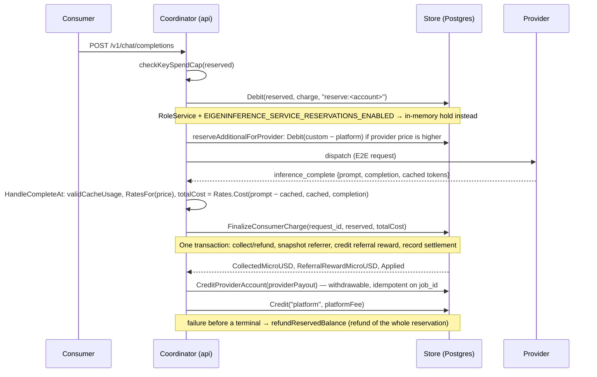

# Billing: pricing, reservations, ledger, and payouts

> Last updated: 2026-10-06

Darkbloom is prepaid. A consumer account holds an integer micro-USD balance;
the coordinator reserves the worst-case cost of a request before dispatch,
settles the provider-reported cost after the terminal message, and credits the
provider a withdrawable share that it withdraws through Stripe. Connect and the Global Payouts adapter share the earned-balance ledger. This
page explains the money path and what it guarantees. Constants, formulas,
routes, and env vars are tabulated in
[`reference/pricing-model.md`](../reference/pricing-model.md); the consumer
how-to is [`consumer/billing.md`](../consumer/billing.md).

Base rewards require macOS 27 or later and current qualified App Attest authorization for every provider, old or new, through the [canonical machine settlement contract](../reference/provider-authorization.md#machine-identity-and-base-rewards), whether or not the machine also has legacy MDM. `coordinator/payments/baserewards/machine_candidates.go` (`rewardSnapshotEligible`) checks this when building candidates and immediately before credit. Grandfathered legacy-MDM-only machines may still serve and earn completed-inference work payments, but cannot receive new base rewards. Expired, revoked or unqualified App Attest authorization cannot use legacy serving eligibility as a reward fallback. Historical balances, finalized base rewards, reserved withdrawals and organic-earning keys remain unchanged; neither a fresh connection nor a credential rotation creates another same-epoch floor.

The remaining epoch allocation commits as one transaction in `coordinator/payments/baserewards/settlement_plan.go` (`settleCandidatePlan`) and `coordinator/store/floor_draw_batch.go` (`FloorDrawBatchStore`). If authorization or canonical identity changes before commit, the pending plan rolls back and the engine reallocates its unspent budget. This includes partial and zero-value waitlisted rows, so a rejected provider cannot permanently reduce another provider's payment. Previously finalized rows remain unchanged.

## Context

- **Prepaid, reservation-first.** There is no post-paid billing. A request is
  admitted only after its worst-case cost is debited (or held), so a provider
  can never be owed money the consumer does not have. The reservation bound is
  what makes the `max_tokens` ceiling mandatory
  (`coordinator/api/inference/consumer.go`, `defaultMaxOutputTokens` comment).
- **One unit.** Every balance, price, reservation, and ledger row is an
  `int64` in micro-USD (1 USD = 1,000,000 µUSD). Prices are µUSD per
  1,000,000 tokens. Stripe is the only boundary where amounts become integer
  cents (`coordinator/api/billing/stripe_checkout_webhook.go` `HandleStripeWebhook`
  multiplies `AmountTotal` by `10_000`; `coordinator/api/billing/payouts/`
  `microUSDToCents`).
- **Accounts.** A consumer is an API-key account or a Privy user
  (`coordinator/api/access/request.go` `ResolveAccountID`). A provider
  machine earns only when linked to an account (`registry.Provider.AccountID`).
  The literal account `platform` holds platform prices and platform-fee
  credits. `users.role = "service"` (`coordinator/store/interface.go`
  `RoleService`) marks wholesale partners.
- **Two balance columns.** `balances.balance_micro_usd` is spendable;
  `balances.withdrawable_micro_usd` is the earned subset that Stripe
  may pay out (`coordinator/store/postgres/` DDL).

## Mechanism

### Prices

| Concern | How |
|---|---|
| Storage | `model_prices(account_id, model, input_price, output_price, cache_read_price NULL)`, primary key `(account_id, model)`. Platform prices use `account_id = 'platform'`; a provider's custom prices use its own account id (`coordinator/store/postgres/`; `store.ModelPrice`). `cache_read_price` is the rate for prompt tokens a provider served from its prefix cache; `NULL` means unset. |
| Platform price writers | `PUT /v1/admin/pricing` (`coordinator/api/billing/` `HandleAdminPricing`) and model registration, which requires positive `input_price`/`output_price` and writes them as the platform row (`coordinator/api/catalog/` `HandleRegisterModel` → `SetModelPrice`). Both accept an optional `cache_read_price` in `[0, input_price]` (`coordinator/api/modelprice/price.go` `modelprice.Input.Validate`); a cache read priced above the uncached rate is rejected, not clamped. |
| Provider custom price | `PUT /v1/pricing` / `DELETE /v1/pricing` for the caller's own account; Privy users only (`coordinator/api/billing/pricing.go` `HandleSetPricing`, `HandleDeletePricing`). Validation is `> 0` plus the `cache_read_price` bound; there is no floor or ceiling relative to the platform price. |
| Resolution at settlement | provider custom → platform → `DefaultInputPricePerMillion` / `DefaultOutputPricePerMillion` (`coordinator/api/inference/provider_inference.go` `HandleCompleteAt`). Service consumers skip the first step. `payments.RatesFor` turns the winning row into `Rates{Input, Output, CacheRead}`; an unset `cache_read_price` derives as `DefaultCacheReadPrice(input)` = input less `DefaultCacheReadDiscountPercent` (50%). The reservation uses the same order with the provider chosen at dispatch (`coordinator/api/inference/consumer.go` `providerReservationCost`, `reservationCost`). |
| Cost | `Rates.Cost` bills `(promptTokens − cachedTokens) × in / 1M + cachedTokens × cacheRead / 1M + completionTokens × out / 1M`, flooring non-zero usage at 1 µUSD (service traffic); `Rates.CostWithMinimum` applies `minimumChargeMicroUSD` instead (`coordinator/payments/pricing.go`). Cached tokens: invariant 5. |
| Public read | `GET /v1/pricing` returns the `platform` rows plus the fallback defaults, each with its effective `cache_read_price` (`HandleGetPricing`, `ModelPriceQuote`; shape `types.PricingResponse`); the OpenRouter model feed renders the same `Rates` as USD-per-token strings — `prompt`, `completion`, `input_cache_read` — via `coordinator/payments/pricing.go` `FormatPerTokenUSD` (`coordinator/api/catalog/openrouter_models.go` `buildModelPricing`). |

### Request lifecycle


```mermaid
sequenceDiagram
  participant C as Consumer
  participant A as Coordinator (api)
  participant S as Store (Postgres)
  participant P as Provider
  C->>A: POST /v1/chat/completions
  A->>A: checkKeySpendCap(reserved)
  A->>S: Debit(reserved, charge, "reserve:<account>")
  Note over A,S: RoleService + EIGENINFERENCE_SERVICE_RESERVATIONS_ENABLED → in-memory hold instead
  A->>S: reserveAdditionalForProvider: Debit(custom − platform) if provider price is higher
  A->>P: dispatch (E2E request)
  P-->>A: inference_complete {prompt, completion, cached tokens}
  A->>A: HandleCompleteAt: validCacheUsage, RatesFor(price), totalCost = Rates.Cost(prompt − cached, cached, completion)
  A->>S: FinalizeConsumerCharge(request_id, reserved, totalCost)
  Note over A,S: One transaction: collect/refund, snapshot referrer, credit referral reward, record settlement
  S-->>A: CollectedMicroUSD, ReferralRewardMicroUSD, Applied
  A->>S: CreditProviderAccount(providerPayout) — withdrawable, idempotent on job_id
  A->>S: Credit("platform", platformFee)
  Note over A,S: failure before a terminal → refundReservedBalance (refund of the whole reservation)
```

| Step | Function | What happens |
|---|---|---|
| 1. Reserve | `coordinator/api/inference/inference_balance.go` `reserveInferenceBalance` | `reserved = reservationCost(model, max(BillingPromptTokens, estimatedPromptTokens), requestedMaxTokens)` at the platform price. The output bound follows the precedence in [pricing-model.md → Formulas](../reference/pricing-model.md#formulas) (`coordinator/api/inference/consumer.go` `ensureMaxTokensBound`; an explicit value is never clamped). The per-key spend cap is checked first (`checkKeySpendCap`), then `reserveInitialBalance` debits the ledger (`LedgerCharge`, reference `reserve:<account>`) or, for a service account with holds enabled, adds to an in-memory hold (`coordinator/api/inference/reservations.go` `serviceReservationManager`). Self-route and a nil billing backend skip the step entirely. |
| 2. Media top-up | `topUpReservationForInlinedMedia` | After remote media is fetched and inlined, the byte-bound prompt estimate is recomputed; if it exceeds the reservation the delta is reserved with the same cap check and mode. |
| 3. Provider top-up | `coordinator/api/inference/consumer.go` `reserveAdditionalForProvider` | If the chosen provider has a custom price above the platform price, the delta is debited after a second spend-cap check against the new total. `ErrInsufficientBalance` excludes that provider and dispatch tries another; when none fits the request fails with 402 (`coordinator/api/inference/dispatch.go` `dispatchPrimary`, `run`). Service consumers and free self-route skip it. If dispatch to that provider then fails, `refundExtra` credits the delta back (metric `billing.reservation_extra_refunds`). |
| 4. Settle | `coordinator/api/inference/provider_inference.go` `HandleCompleteAt` → `store.FinalizeConsumerCharge` | Validate the provider's cache report (`validCacheUsage`; a malformed one is cleared so it cannot lower the bill), resolve the price, and compute `totalCost` with cached prompt tokens at the cache-read rate (`billableUsage`, `Rates.Cost` / `CostWithMinimum`); an owned machine serving its owner's request settles free. The reservation finalization gate selects settlement or refund. `FinalizeConsumerCharge` atomically adjusts the consumer balance, records the collected amount, and credits any referral reward. Overage is capped at the reservation amount and falls back to the reservation if funds cannot cover it. Underage refunds the excess. Service holds and direct charges pass no already-debited reservation; insufficient funds collect zero. A duplicate job returns its saved result; conflicting inputs fail. |
| 5. Record usage | `coordinator/api/inference/completion_accounting.go` `completionAccounting` (called from `HandleCompleteAt`) | In-memory `payments.Ledger.RecordUsage` always (bounded recent history, lazily allocated to the [usage history limit](../reference/pricing-model.md#constants)); a persistent `usage` row (`store.RecordUsage`) unless the request was free self-route. Both carry `cached_tokens` so a cache hit's cost can be reconciled against the published rates; a model-token promotion records `0`, because that path bills cached tokens at the input rate. |
| 6. Pay out | `HandleCompleteAt` | Normally use the collected amount returned by settlement for fee and provider-payout arithmetic. If an unreserved, non-service request not marked free self-route is uncollected, retain the quoted cost and platform-covered payout (`coordinator/api/inference/consumer_settlement.go`, `settleCompletedConsumer`, `platformCovered` / `settledCost`). Uncollected service requests and requests that lose free-self-route eligibility instead have zero cost and payout; no uncollected charge earns a referral reward. `feePercent` is the consumer override, else the global default (invariant 4). `CreditProviderAccount` credits `totalCost − platformFee` to a linked provider account as withdrawable earnings; `Credit("platform", …)` credits the full platform fee. The referral reward is already credited by settlement and reduces neither amount. |
| 7. Abort / disconnect | `coordinator/api/inference/consumer.go` `refundReservedBalance`; `coordinator/api/inference/settlement.go` `settlementHolder` | A request that fails before any provider terminal refunds the whole reservation (`LedgerRefund`, reference `reservation_refund:<request_id>`). If the consumer disconnects first, the billing record is parked for `defaultTerminalSettleGrace = 30 * time.Second` so a late terminal settles it; otherwise it is refunded. |

### Rejected Stripe withdrawal refunds

`RefundRejectedStripeWithdrawal` in `coordinator/store/postgres/stripe_settlement.go`
locks the withdrawal and shares the refund advisory lock with
`CreditWithdrawableOnce`. It sums debit and refund rows for the account and
`stripe_withdraw:<id>` reference without comparing coordinator and database
timestamps. The net debit must equal the negative gross withdrawal amount; the net
refund must be zero or equal that amount. A legacy full refund only repairs the flag;
otherwise the credit, ledger row and flag commit together. Repeated recovery does
not pay again. The [storage contract](storage.md#stripe-migration-settlement)
describes the concurrent account/reference index that bounds this lookup.

### PostgreSQL debit cancellation

`PostgresStore.Debit` runs the balance update and ledger insert inside an
explicit transaction. It sends `COMMIT` only after receiving a successful
statement result and checking the five-second operation context. If the
statement times out while waiting for an account row lock, a late server-side
completion remains uncommitted and is rolled back. Cleanup uses a fresh,
bounded context because the operation context may already have expired.

This adds `BEGIN` and `COMMIT` round trips and holds the account row lock until
commit; it is a correctness boundary, not a contention or throughput improvement.
The shared `debitBalance` helper remains transaction-neutral for callers that
already own a transaction. A timeout or lost acknowledgement **after `COMMIT`
has been sent** still leaves the result uncertain. Callers must not blindly
retry or refund an arbitrary debit error; this change does not add an idempotent
reservation identifier or change the ordinary-account funds check.

### Ledger

Tables use idempotent DDL in `coordinator/store/postgres/`, including
`coordinator/store/postgres/consumer_settlement.go` (`consumerSettlementSchema`):
`balances`, `ledger_entries(account_id, entry_type, amount_micro_usd,
balance_after, reference, created_at)`, `model_prices`, `billing_sessions`,
`referrers`, `referrals`, `consumer_charge_settlements`, `invite_codes`, `invite_redemptions`,
`provider_earnings` (unique partial index `idx_provider_earnings_job` on
`job_id`), `provider_payouts` (legacy; no longer read or written), `stripe_withdrawals`,
`provider_floor_draws` (`UNIQUE (provider_key, epoch_id)`), and the
`users.role` / `users.platform_fee_percent` / `users.stripe_*` columns.

Which path writes each `LedgerEntryType` (`coordinator/store/interface.go`),
and which balance column moves:

| Entry type | Written by | Column(s) |
|---|---|---|
| `charge` | reservation, overage, and direct debits — `payments.Ledger.Charge` → `store.Debit` | both (withdrawable capped, invariant 8) |
| `refund` | reservation refund, settlement refund, withdrawal refunds (`refundReservedBalance`, `HandleCompleteAt`, `CreditWithdrawableOnce` in `coordinator/api/billing/payouts/stripe_payouts_webhooks.go`) | `balance` for reservation/settlement refunds; both for withdrawal refunds |
| `payout` | `provider_earnings` credit path (`CreditProviderAccount` ledger CTE) | both |
| `platform_fee` | `HandleCompleteAt` → `store.Credit("platform", …)` | `balance` |
| `referral_reward` | `coordinator/store/postgres/consumer_settlement.go` `FinalizeConsumerCharge` → `creditWithdrawableBalance` (same transaction as consumer settlement); `SettleModelTokenReservation` for the paid portion of promotions | both |
| `stripe_deposit` | `HandleStripeWebhook` → `CompleteStripeCheckout` (atomic credit and session completion) | `balance` |
| `stripe_payout` | `coordinator/api/billing/payouts/stripe_withdraw.go` `HandleStripeWithdraw` → `CreateStripeWithdrawalWithDebit` | both (guarded by `withdrawable_micro_usd >= amount`) |
| `invite_credit` | `coordinator/api/accounts/invite_handlers.go` `HandleRedeemInviteCode` → `store.Credit` | `balance` |
| `admin_credit` | `HandleAdminCredit` → `handleAdminBalanceAdjustment` → `store.Credit` | `balance` |
| `admin_reward` | `HandleAdminReward` → `handleAdminBalanceAdjustment` → `CreditWithdrawable` | both |
| `provider_floor_draw` | `coordinator/store/postgres/floor_draw_batch.go` `SettleProviderFloorDrawBatch` → `settleProviderFloorDraw` (`coordinator/store/postgres/base_rewards.go`) | both |
| `migration` | `coordinator/store/postgres/` `MigrateAccountBalance` (balance moved between account identities) | both |
| `erasure_forfeit` | `ScrubAccount` → `forfeitBalance` (`coordinator/store/postgres/erasure.go`); one entry for the whole balance, see [account erasure](account-erasure.md#the-scrub-transaction) | both set to 0 |
| `deposit`, `withdrawal` | declared for legacy (pre-Stripe) deposit and on-chain withdrawal paths; no current handler writes them | — |

`RewardLedgerTypes = {referral_reward, admin_reward}` is the set the
leaderboard and `GET /v1/me/summary` count as "reward" rather than "work"
earnings (`coordinator/store/interface.go` `IsRewardLedgerType`;
`coordinator/api/accounts/summary.go` `HandleMySummary`).

Credit and settlement primitives:

| Primitive | Effect | Used for |
|---|---|---|
| `Credit` (`creditTx`) | raises `balance_micro_usd` only; not reference-idempotent | deposits, invite/admin credits, reservation and settlement refunds, platform fee |
| `CreditWithdrawable` (`creditWithdrawableTx`) | raises both columns; not reference-idempotent | admin rewards |
| `FinalizeConsumerCharge` (`coordinator/store/postgres/consumer_settlement.go`) | consumer adjustment, referral reward and durable settlement record in one transaction; idempotent on job ID | inference settlement and referral rewards |
| `CreditWithdrawableOnce` | `CreditWithdrawable` guarded by a `pg_advisory_xact_lock` on `entry_type:reference` and an existence check on `(account_id, entry_type, reference)`; returns whether it applied | withdrawal principal and fee refunds |

`CreditProviderAccount` and `settleProviderFloorDraw` are single-statement
CTEs whose first `INSERT … ON CONFLICT DO NOTHING` gates every downstream
credit (invariants 7 and 15).

### Service accounts

`RoleService` is granted by `PUT /v1/admin/users/role` with
`{"role": "service"}` (`""` clears it) (`HandleAdminSetUserRole`,
`SetUserRole`). Effects: cost via `Rates.Cost` (no per-request minimum);
billed at the platform price with no provider-custom-price top-up
(`isServiceConsumer`); when
`EIGENINFERENCE_SERVICE_RESERVATIONS_ENABLED=true` (default `false`,
`coordinator/api/server_config.go` `ReadServerConfig`) reservations are
in-memory holds (`mode:service_hold`) and the actual cost is debited at
settlement; requests use the dedicated service rate limiter
(`Service`; values under [pricing-model constants](../reference/pricing-model.md#constants)).
The platform fee follows the same per-user override as everyone else.

### Deposits (Stripe Checkout)

1. `POST /v1/billing/stripe/create-session` (`HandleStripeCreateSession`;
   auth + financial limiter) requires `amount_usd` at or above the [Stripe deposit minimum](../reference/pricing-model.md#constants), validates an
   optional `referral_code`, creates a Checkout Session whose metadata carries
   `billing_session_id` and `consumer_key`; the personal referral code stays
   in the local session
   (`coordinator/billing/stripe.go` `CreateCheckoutSession`), stores a
   `billing_sessions` row with `status = pending`, and returns
   `{session_id, stripe_session, url, amount_usd, amount_micro_usd}`.
2. Stripe calls `POST /v1/billing/stripe/webhook` (`HandleStripeWebhook`; no
   auth, `Stripe-Signature` verified by `VerifyWebhookSignature`). Only
   `checkout.session.completed` is processed; every other event type is
   acknowledged with 200 and ignored.
3. The handler verifies a paid USD session against the stored account, amount,
   payment method and external ID. `CompleteStripeCheckout` atomically credits
   non-withdrawable funds and completes the session under a row lock. Duplicate
   events from either the current or retained legacy signing secret cannot credit
   twice. A pre-existing matching ledger credit is recognized without adding it
   again. Referral attribution reads the canonical local session, not historical
   Stripe metadata, and retries independently; the same normalized code is idempotent, and inapplicable codes (different pre-existing attribution, self-referral or a missing code) are acknowledged without retrying the settled payment. Database failures remain retryable.
4. `GET /v1/billing/stripe/session?id=<session_id>` polls the row;
   `GET /v1/billing/methods` (public) lists configured methods — Stripe only
   (`coordinator/billing/billing.go` `SupportedMethods`).

Deposits are **not withdrawable**. New Checkout sessions use the current payments key; retained legacy webhook verification does not create new payments.

### Legacy provider payouts (Stripe Connect Express)

New Connect onboarding and transfers are disabled by `EIGENINFERENCE_STRIPE_GLOBAL_PAYOUTS_ONLY=true`. These paths remain for pre-cutover operation and historical reconciliation.

| Stage | Function | Behaviour |
|---|---|---|
| Onboard | `coordinator/api/billing/payouts/connect_onboarding.go` `HandleStripeOnboard` (Privy only) | Creates or reuses an Express account (`coordinator/billing/stripe_connect.go` `CreateExpressAccount`) with the service agreement chosen by `coordinator/billing/stripe_regions.go` `RequiredServiceAgreement` (`full` or `recipient`), returns a hosted onboarding link (`CreateAccountLink`). Local status ∈ {`""`, `pending`, `ready`, `restricted`, `rejected`} is mirrored from `account.updated`. |
| Status | `HandleStripeStatus` | Returns `status`, `destination_type`, `destination_last4`, `instant_eligible`, `min_withdraw_micro_usd`, `instant_fee_bps`, `instant_fee_min_usd`; `?refresh=1` re-syncs from Stripe. |
| Withdraw | `coordinator/api/billing/payouts/stripe_withdraw.go` `HandleStripeWithdraw` (Privy only, status `ready`) | Body `{amount_usd, method: standard \| instant}`. Pre-validates the account with Stripe (gone → unlink + 409 `stripe_account_gone`; agreement mismatch → 409 `stripe_account_recreate_required`; payouts disabled → 403 `not_onboarded`; a `manual` payout schedule is healed to automatic). `gross ≥ MinWithdrawMicroUSD`; `fee = FeeForMethodMicroUSD` (`0` for standard; the instant fee is the [withdrawal-fee formula](../reference/pricing-model.md#formulas) over `InstantFeeBps` / `InstantFeeMinMicroUSD`, values under [Constants](../reference/pricing-model.md#constants)); `net = gross − fee` must round to ≥ 1 cent. One store transaction debits both columns (`stripe_payout`, reference `stripe_withdraw:<id>`) and inserts the `pending` row **before** any Stripe call. Then `transfers.create` for `net` cents with idempotency key `wd-tr-<id>` (`retryAmbiguousStripe`). First-attempt definitive failure → persist `StripeConfirmedRejectionPrefix`, then atomically refund gross and set the refund flag with `RefundRejectedStripeWithdrawal`. Failed refund transactions remain recoverable. A later rejection after an ambiguous attempt does not authorize a refund. Ambiguous (no answer) → row stays `pending`, **no refund**, 502. Success → `transferred`. |
| Deliver | `HandleStripeWithdraw`, Stripe schedule | Standard: nothing more; Stripe's automatic daily payout sweeps the connected balance to the bank in local currency. Instant: `payouts.create` (`wd-po-<id>`) to the debit card; a definitive failure refunds only the instant fee (`stripe_withdraw_fee:<id>`) and the sweep delivers via the standard rail; an ambiguous failure refunds nothing (202). |
| Webhooks | `coordinator/api/billing/payouts/stripe_payouts_webhooks.go` `HandleStripeConnectWebhook` (no auth, `VerifyConnectWebhookSignature`) | See the Connect webhook table under Failure modes. |
| Reconcile | `coordinator/api/billing/payouts/stripe_reconcile.go` `StartStripePayoutReconciler` | Every `stripeReconcileInterval` (first pass 1 min after boot), inspects up to `stripeReconcileBatch` rows, heals `manual` payout schedules, and alerts on rows non-terminal for more than `stripeStuckThreshold` (values under [Constants](../reference/pricing-model.md#constants)). A separate minute ticker retries confirmed rejected-transfer refunds atomically; unverified historical failures require operator review. |
| Self-service | `HandleStripeDashboardLink` (`POST /v1/billing/stripe/dashboard`, Privy + financial limiter), `HandleStripeUnlink` (`DELETE /v1/billing/stripe/account`), `HandleStripeWithdrawals` (`GET /v1/billing/stripe/withdrawals`) | Express dashboard login link; unlink; withdrawal history. |

Withdrawal row state machine: `pending → transferred → paid | failed`
(`HandleStripeWithdraw` comment block). There is no coordinator-side payout
schedule or threshold beyond `MinWithdrawMicroUSD`.

### International bank withdrawals

When `EIGENINFERENCE_STRIPE_GLOBAL_PAYOUTS_ONLY=true`, all countries in
`coordinator/billing/globalpayouts/countries.go` (`Countries`) use Global Payouts.
US recipients request the `local` capability. Existing Connect users receive
`migration_required=true` until they complete their own bank setup. Status reads
never create recipients or move funds (`coordinator/api/billing/payouts/global_payouts_status.go`,
`maybeGlobalStatus`). With the cutover off, the original country split remains
for users who have never started Global Payouts.

A recipient row is a durable routing fence. Resetting bank setup retains a new,
empty generation instead of deleting the row; stale onboarding writes and old
quotes cannot restore the previous destination. Pausing admissions or rolling
back the country split never sends a fenced user back to Connect. Legacy
`users.stripe_account_id` remains intact for historical payout processing
(`coordinator/store/postgres/global_payouts_recipients.go`, `RemoveGlobalRecipient`).

The existing UI sends the user to Stripe to enter their own details and preserves
their login, earnings, and combined withdrawal history. The operator does not
complete recipient forms (`console-ui/src/components/payouts/StripePayoutsCard.tsx`).

`HandleGlobalPayoutQuote` (`coordinator/api/billing/payouts/global_payouts_withdraw.go`) verifies recipient and bank eligibility and stores an immutable request plus local-currency estimate without moving earnings. Confirming first reads `AvailableUSD` from the exact financial account and checks principal plus rounded-up USD fee estimates (`coordinator/billing/globalpayouts/funding.go`, `RequiredFundingCents`). Insufficient or unreadable funding returns before debit. This check does not reserve Stripe funds; a later send rejection still follows the atomic refund path. Confirming the quote then calls `BeginGlobalPayout` (`coordinator/store/postgres/global_payouts.go`), which locks the payout and recipient, guards both balance columns, and records the debit in one transaction. Connect withdrawals contend on the same balance row.

`syncGlobalPayout` (`coordinator/api/billing/payouts/global_payouts_reconcile.go`) uses a persistent idempotency key and reconciles current Stripe state after webhook notifications. Leases bound concurrent sends. Ambiguous results retain the debit; repeated confirmations retain the original identity even after unlinking. A definitive rejection of the first send is recorded with `RecordGlobalPayoutRejection` before the refund transaction; subsequent workers apply that saved rejection without another send if the refund write fails. A bank return refunds once in the same transaction as its state change. Known external payments continue to reconcile against their immutable source even when the configured funding account changes. Old unsubmitted quotes are invalidated before debit; a confirmed intent with no previous dispatch is refunded if its funding source changed. Ambiguous attempts retain their debit. After twelve hours without an external ID, `GlobalPayout.RequiresManualReconciliation` excludes the marked payout from automatic scans and claims while retaining its debit and history. The UI labels `posted` as sent, not paid. The [rollout runbook](../operations/global-payouts.md) defines live validation and rollback obligations.

`useStripeWithdrawal` (`console-ui/src/components/payouts/useStripeWithdrawal.ts`) saves the confirmation identity in account-scoped browser storage before sending it. Global Payouts status loading restores that identity before enabling another withdrawal; Connect status and submission do not read this storage. Recovery remains available after remounts, zero remaining balance, or paused admissions. Storage failures stop Global Payouts submission; credentials and full bank details are not stored.

Recipient limits are stored in API minor units and shown before review. USD destination bounds are checked before requesting a quote; foreign-currency bounds are checked against Stripe's credited quote amount and its amount-limit errors. A USD input is never compared directly with a foreign-currency floor (`coordinator/billing/globalpayouts/recipient_limits.go`, `Country.Limits`).

### Consumer referral

`coordinator/billing/referral.go` (`Register`, `Apply`) manages one code per
referrer account and one immutable referrer per consumer account. Registration
returns an existing account code; applying the same referrer again succeeds.
Self-referral and reassignment fail. Both mutation routes require Privy auth
and the financial rate limiter. Info returns an empty code before registration; stats returns 404 until the
account registers a code. Their account-scoped payloads are in the
[API contract](../reference/api-contracts.md#open-sales-program-payloads).

The reward's fixed rate and exact integer arithmetic live in
[pricing formulas](../reference/pricing-model.md#formulas). Its basis is the
collected token charge after clamps and failed-debit handling, independent of
the consumer's platform-fee override. Darkbloom funds it as an additive
withdrawable `referral_reward`; consumer prices, provider payouts and the full
platform-fee credit stay unchanged. No reward is generated by a deposit,
reservation, free request or uncollected charge. Inference paid from invite or
admin credits can qualify once the shared spendable balance is debited; the
ledger does not track a cash-only funding source. Attribution has no expiry.

Execution on the consumer's own machine, explicit self-routing, owner-preferred
routing (including paid fleet fallback), and routing restricted to selected
machines are excluded from both referral rewards and eligible-spend totals.
Eligibility checks both actual ownership and the requested routing mode; paid
fallback does not undo a routing exclusion. The exact conditions are listed in
[pricing formulas](../reference/pricing-model.md#formulas).
This exclusion changes neither consumer charges nor provider payouts or
promotion grant use.

`HandleCompleteAt` computes `referralEnabled` from the serving provider's
locked account snapshot and the request's routing flags before either settlement
path (`coordinator/api/inference/provider_inference.go`). Ordinary settlement
captures it in `ConsumerChargeSettlement.ReferralEnabled`; promotion settlement
passes it through `Engine.Settle` to `SettleModelTokenReservation` and captures
it for retries (`coordinator/internal/inference/promotions/model_token_settlement.go`).
Retries retain that decision. The ordinary settlement record and the promotion's
terminal reservation state prevent replay from adding a reward later.

`FinalizeConsumerCharge` snapshots the consumer's current referrer and stores
that attribution, the collected amount and reward with the request ID in
`consumer_charge_settlements`. Consumer adjustment, reward credit and this
record commit in one Postgres transaction or one memory-store lock. Replaying a
settled request returns the existing result and cannot add a referrer or reward
retroactively. Existing referral relationships apply to future settlements;
there is no historical backfill. See [Storage](storage.md#consumer-referral-settlement).

`SettleModelTokenReservation` preserves the same referral contract for token
promotions: only eligible `ConsumerCostMicroUSD` earns a reward, never sponsored
token value. The same routing exclusions apply to this paid portion. Consumer
adjustment, provider payout, referral credit and the terminal
reservation state commit together. `coordinator/internal/store/consumersettlement/settlement.go`
(`PromotionRecord`) records these settlements under
`promotion:<reservation_id>`; the reservation state prevents duplicate rewards
and retroactive attribution. PostgreSQL locks consumer, provider and referrer
balances in account order, including when the provider is also the referrer.

The console's **Open Sales Program** page provides registration, share links, attribution
and earnings. A first-touch `?ref=CODE` survives sign-in and the invite gate;
[the consumer how-to](../consumer/referrals.md) explains checking attribution
before paid use and withdrawing rewards. The separately proposed
[provider referral program](../design/provider-referral-growth-program.md)
is not part of this consumer program.

### Invite codes and admin credits

Admins create (`POST /v1/admin/invite-codes`: `amount_usd`, optional `code`,
`max_uses` default `1`, `expires_at` RFC 3339), list, and deactivate codes
(`coordinator/api/accounts/invite_handlers.go`, `RequireAdminKey`). Any authenticated
account redeems with `POST /v1/invite/redeem`; `RedeemInviteCode` locks the
code row and checks active, unexpired, under `max_uses`, then inserts into
`invite_redemptions` whose primary key `(code, account_id)` blocks a second
redemption by the same account; the credit is a non-withdrawable
`invite_credit`. `POST /v1/admin/credit` (`admin_credit`, non-withdrawable)
and `POST /v1/admin/reward` (`admin_reward`, withdrawable) credit by user
email. These, plus free self-route, are the only free-credit paths — there is
no sign-up credit or trial in code. Admin authorization for these routes is
`IsAdminAuthorized` / `RequireAdminKey`: an `EIGENINFERENCE_ADMIN_KEY` bearer
token or a Privy user whose email is in `EIGENINFERENCE_ADMIN_EMAILS`
(`coordinator/api/releases/release_handlers.go`, `coordinator/api/accounts/invite_handlers.go`).

### Per-key spend caps

`POST /v1/keys` and `PATCH /v1/keys/{id}` accept `limit_usd` and
`limit_reset ∈ {none, daily, weekly, monthly}`
(`coordinator/api/access/keys/request.go` `validateKeyLimitInputs`), stored as
`APIKey.LimitMicroUSD` / `LimitReset`. `checkKeySpendCap` compares
`KeySpendSince(key, window start) + additional` against the cap before the
platform-price reservation, before a media top-up, and again before a
provider top-up. Spend is the sum of settled `usage.cost_micro_usd` for the
key (`coordinator/store/postgres/` `KeySpendSince`) — see invariant 11.

### Base rewards (implemented, disabled by default)

`coordinator/payments/baserewards/` pays eligible provider machines a
per-epoch base income on top of organic earnings. It is wired in
`coordinator/app/services.go` only when `EIGENINFERENCE_BASE_REWARDS=true`
(default `false`, `coordinator/api/server_config.go`); the engine loop is
`Engine.Run`. Per closed `SettlementPeriod = 5 * time.Minute` epoch
(`epoch.go`), for each machine that passes every gate in
`machine_candidates.go` `buildCandidates` — current complete public serving
authorization through qualified App Attest with a macOS 27-or-later OS claim
bound to that same authorization (legacy verification alone is insufficient); online with the
model loaded; `MemoryPressure < 0.8` and thermal state not `critical`; a
provider key; uptime from `provider_sessions` ≥ `MinUptimeFrac` (`0.90`, open
sessions accrue to `last_seen + defaultGraceSeconds = 90`); hardware model in
the memory catalog (`hardware.ModelMaxMemoryGB` caps self-reported memory
downward; unknown models are skipped, including newly released Macs until
their identifiers and ceilings are catalogued); and a linked payout account:

```
avail  = clamp((uptime − 0.90) / 0.10, 0, 1)                          floor.go Avail
floor  = TierFloor(memGB) × period/month × avail                        floor.go PeriodFloor
draw   = max(0, floor − k × organicEarnings),  k = DefaultReductionK = 0.0   floor.go Draw
```

`AllocateDraws` (`alloc.go`) caps the epoch's total at
`PeriodBudget(FloorPoolBudgetMicroUSD)` minus
what earlier runs already settled for the epoch, funds the
`workhorseMinGB`–`workhorseMaxGB` band first from a `WorkhorseReserveFrac` sub-pool, then
water-fills by `valuePerFloorDollar`; `PerAccountCapFrac = 0` disables the
per-account cap. `SettleProviderFloorDrawBatch` commits the remaining allocation
plan atomically, using the idempotent draw primitive to write one
`provider_floor_draws` row per `(provider_key, epoch_id)`, credits the
account as withdrawable `provider_floor_draw`, and mirrors a
`provider_earnings` row with `model = 'base_reward'` and
`job_id = floor:<epoch>:<provider_key>` so it shows in earnings history while
`SumProviderEarningsByKey` excludes it from organic earnings. A late rejection
rolls back every pending row and recalculates the unspent allocation; no partial
or zero-value row from that rejected plan is frozen. Settlement is serialized
by a per-epoch lock (an advisory lock in PostgreSQL).
`GET /v1/admin/base-rewards` returns
`{"enabled": false}` when the engine is not wired
(`coordinator/api/billing/base_rewards_handlers.go`). The tier table is in
[`reference/pricing-model.md`](../reference/pricing-model.md#base-rewards);
the design record is [`design/base-rewards.md`](../design/base-rewards.md).

The base-reward model memory ceiling lives in `coordinator/hardware/mac_models.go`
(`ModelMaxMemoryGB`). The current App Attest authorization binds the model and
memory inputs used by `coordinator/registry/provider_snapshot.go`
(`providerRewardSnapshotLocked`); the static catalog still caps those inputs.
The reward OS claim also comes from that current authorization, carried in
`ProviderSnapshot.AppAttestOSVersion`; an unsigned registration or inventory
version cannot replace it. Missing, malformed or below-27 versions fail the
reward gate. The App Attest assertion and qualified executable authenticate this
claim; it is not an independently Apple-certified OS measurement. This
reward-only gate does not change temporary frozen legacy serving eligibility.
The current catalog includes the 2026 M6 and M5 Pro Mac minis and M5 Max Mac
Studio. The M5 Ultra Studio identifier remains excluded because Apple's model
pages also assign it to the lower-memory M5 Pro mini; see the
[identifier table](../provider/hardware-requirements.md#new-2026-desktop-identifiers).

## Invariants

1. **Integer money.** All internal amounts are integer µUSD; Stripe amounts
   are integer cents. Sub-cent dust on a withdrawal is absorbed by the gross
   debit and never refunded (`coordinator/api/billing/payouts/stripe_withdraw.go`
   `HandleStripeWithdraw`; `coordinator/api/billing/payouts/stripe_withdraw.go`
   `microUSDToCents`).
2. **The reservation is the worst case and the cap.** The reservation is
   computed at the platform price for the estimated prompt plus the bounded
   output; settlement charges more only through the overage debit, and never
   more than `2 × reserved` (`coordinator/api/inference/provider_inference.go` `HandleCompleteAt`;
   `coordinator/api/inference/consumer.go` `reservationCost`, `ensureMaxTokensBound`).
3. **Price resolution order** is provider custom → platform → hardcoded
   default, and service consumers never pay a provider custom price
   (`HandleCompleteAt`; `coordinator/api/inference/consumer.go` `providerReservationCost`,
   `isServiceConsumer`).
4. **The global platform fee is `platformFeePercent = 0`**
   (`coordinator/payments/pricing.go`). `resolveFeePercent` uses a per-user
   `users.platform_fee_percent` override clamped to `[0, 100]` when one is set
   (`PUT /v1/admin/users/platform-fee`, `HandleAdminSetUserPlatformFee`),
   otherwise this constant. `platformFee = totalCost × fee / 100` and
   `providerPayout = totalCost − platformFee` (`PlatformFeeWithPercent`,
   `ProviderPayoutWithPercent`), so at the default every provider receives
   the full `totalCost`. Referral rewards are independently funded and can be
   non-zero even when the platform fee is zero (invariant 14).
5. **Cached prompt tokens bill at the cache-read rate, and the bill matches
   the advertised price.** `Usage.CachedTokens` from the provider's terminal
   message — after `validCacheUsage`, which clears a malformed report so a
   provider's cache claim can only lower the bill when it is well-formed — is
   the same count the consumer receives as
   `prompt_tokens_details.cached_tokens` and the count `Rates.Cost` prices at
   `Rates.CacheRead` instead of `Rates.Input`. `buildModelPricing` renders
   that same `CacheRead` as the OpenRouter feed's `input_cache_read`, so what
   OpenRouter computes from the usage and the feed equals the service-account
   debit. A public alias is advertised at its primary build's rates while
   settlement prices the build that served the request, so for an alias the
   parity holds when the builds behind it share their price rows
   (`scripts/preposition-rollback-build.sh` copies `cache_read_price` for
   that reason). A cache hit never raises a bill: `CachedTokens` is clamped to
   `PromptTokens` and `cache_read_price ≤ input_price` is enforced at every
   writer. Caching is provider-initiated, so there is no cache-write SKU.
   Exception: a request settled against a model-token grant is priced by
   `priceModelTokens` at `Rates.Input` for every prompt token (no cache-read
   discount) and records `cached_tokens = 0`; service consumers never enter
   that path, so the feed parity above is unaffected
   (`coordinator/internal/inference/promotions/model_token_pricing.go` `PriceTokens`).
   `PrefillTokensSaved` still feeds only the `routing.cache_*` metrics
   (`coordinator/payments/pricing.go` `Rates.Cost`, `RatesFor`;
   `coordinator/internal/inference/cacheusage/cache_usage.go` `billableUsage`, `validCacheUsage`;
   `coordinator/api/inference/provider_inference.go` `HandleCompleteAt`).
6. **A reservation is settled or refunded at most once.**
   `PendingRequest.FinalizeReservation` / `MarkReservationFinalized` (`coordinator/registry/pending_request.go`) gate every overage debit, settlement
   refund, whole-reservation refund, and service-hold release; a terminal that
   arrives after another path finalized the reservation is logged and skipped
   without writing a usage row (`coordinator/api/inference/provider_inference.go`
   `HandleCompleteAt`; `coordinator/api/inference/consumer.go`
   `refundReservedBalance`; `coordinator/api/inference/settlement.go` `holdForSettlement`).
7. **Provider earnings are idempotent on `job_id`.** `CreditProviderAccount`
   inserts the `provider_earnings` row under the unique partial index
   `idx_provider_earnings_job` (`job_id <> ''`) in the same transaction as the
   withdrawable credit, so a re-settled job is a no-op instead of a second
   payout (`coordinator/store/postgres/`).
8. **`withdrawable_micro_usd ≤ balance_micro_usd`.** `Debit` lowers
   withdrawable to `LEAST(withdrawable, balance − amount)`; `Credit` raises
   only `balance`; `CreditWithdrawable`, `CreditWithdrawableOnce`, and
   `CreditProviderAccount` raise both by the same amount;
   `CreateStripeWithdrawalWithDebit` debits both and fails unless
   `withdrawable ≥ amount` (`coordinator/store/postgres/`).
9. **Only earned money is withdrawable.** `stripe_deposit`, `invite_credit`,
   `admin_credit`, and reservation or settlement `refund` entries go through
   `Credit`; `payout`, `referral_reward`, `admin_reward`,
   `provider_floor_draw`, and withdrawal refunds go through the withdrawable
   primitives (`coordinator/api/billing/stripe_checkout_webhook.go` `HandleStripeWebhook`;
   `coordinator/api/billing/admin_balance_adjustment.go` `HandleAdminCredit`, `HandleAdminReward`; `coordinator/api/accounts/invite_handlers.go`
   `HandleRedeemInviteCode`; `coordinator/store/postgres/consumer_settlement.go`
   `FinalizeConsumerCharge`; `coordinator/store/postgres/base_rewards.go`
   `settleProviderFloorDraw`).
10. **Withdrawal refunds are reference-idempotent.** Principal
    (`stripe_withdraw:<id>`) and instant-fee (`stripe_withdraw_fee:<id>`)
    refunds use `CreditWithdrawableOnce`, keyed on
    `(account_id, entry_type, reference)` under `pg_advisory_xact_lock`, so a
    redelivered webhook or a reconciler pass cannot refund twice
    (`coordinator/api/billing/payouts/stripe_withdraw.go` `creditRefundOnceWithRetry`;
    `coordinator/api/billing/payouts/stripe_payouts_webhooks.go` `handlePayoutTerminal`,
    `handleTransferFailed`; `coordinator/store/postgres/`
    `CreditWithdrawableOnce`).
11. **A capped key never debits.** `checkKeySpendCap` runs before the `Debit`
    in `reserveInferenceBalance`, `topUpReservationForInlinedMedia`, and
    `reserveAdditionalForProvider`, so a rejected request leaves no ledger
    row. The cap is soft (settled usage, so concurrent requests can overshoot
    by their reservations); the ledger balance is the hard ceiling
    (`coordinator/api/access/keys/handlers.go`; `coordinator/api/inference/inference_balance.go`;
    `coordinator/api/inference/consumer.go`).
12. **Service accounts pay the platform price with no minimum.**
    `isServiceConsumer` selects `Rates.Cost` (no minimum), skips
    the provider's `GetModelPrice` row and `reserveAdditionalForProvider`, and
    a service hold whose settlement definitively cannot collect the charge
    zeros both `totalCost` and `providerPayout` (`billing.uncollected_zeroed`) rather than paying a
    provider from uncollected money (`coordinator/api/inference/provider_inference.go`
    `HandleCompleteAt`; `coordinator/api/inference/reservations.go`).
13. **Self-route is free only when the owner's machine served it.**
    `HandleCompleteAt` sets `totalCost = providerPayout = 0` iff the serving
    provider's `AccountID` equals the consumer key; a `FreeSelfRoute` request
    served by another provider settles as paid, and if that charge fails
    nothing is paid out (`coordinator/api/inference/provider_inference.go`).
14. **Referral rewards use collected spend and commit with settlement.**
    `FinalizeConsumerCharge` credits the fixed reward on the collected amount
    as additional withdrawable earnings, without reducing provider or platform
    credits. The settlement record's unique `job_id` prevents duplicate
    charges, refunds and rewards; replay with changed input is an error
    (`coordinator/internal/store/consumersettlement/settlement.go`, `Replay`;
    `coordinator/store/postgres/consumer_settlement.go`, `consumerSettlementSchema`).
15. **Base-reward draws are idempotent and never count as organic earnings.**
    `settleProviderFloorDraw` inserts into `provider_floor_draws`
    (`UNIQUE (provider_key, epoch_id)`), credits withdrawable, and mirrors a
    `provider_earnings` row with `model = 'base_reward'` that
    `SumProviderEarningsByKey` excludes from the next epoch's `earned`
    (`coordinator/store/postgres/base_rewards.go`). The engine commits remaining
    draws as an atomic batch and retries late eligibility/identity rejections
    without changing finalized old draws (`coordinator/payments/baserewards/settlement_plan.go`).

## Failure modes

### Uncertain consumer settlement

`coordinator/api/inference/consumer_settlement.go` (`settleCompletedConsumer`)
delegates to `coordinator/internal/inference/consumercharge/settlement.go`
(`Engine.Settle`): up to three immediate attempts use the same durable job key.
If the result remains uncertain, the reservation is sealed against a later
generic refund and any service hold remains reserved until settlement is
confirmed. This prevents another request from spending those funds while the
first charge is unresolved. `Engine.Maintain` retries
pending settlements every 30 seconds while application maintenance is running.
Once settlement is confirmed, including a replay after a lost acknowledgement,
the retained callback resumes provider credit, usage accounting, and platform
credit once in that process (`coordinator/api/inference/completion_financials.go`,
`completionFinancials`).

After graceful request/provider drain, `Owner.CloseResources`
(`coordinator/api/inference/owner.go`) retries pending settlements with bounded
backoff until they clear or a fresh shutdown deadline expires, then waits for
outstanding usage writes within that deadline. Unresolved work
or expiration of the shutdown deadline is logged for operator reconciliation.

Pending callbacks are in memory, not a durable outbox. A crash or exhausted
shutdown deadline can lose pending downstream work; provider, usage, and platform writes are not one atomic
transaction with consumer settlement. Downstream write errors are logged, not
automatically replayed, because not every write is idempotent. Provider credits
deduplicate by job ID, but platform credits and usage are not safe for arbitrary
historical replay after callback ownership has been lost. The
`billing.consumer_settlement_failed` metric and error logs identify requests
requiring reconciliation against `consumer_charge_settlements` and the ledger.
Do not issue a blind refund: the transaction may already have committed.

### Payment-required responses

Bodies are `{"error": {"type", "message", "code"}}` (`coordinator/api/httpx/json.go`
`errorResponse`); `code` is `insufficient_quota` for every 402 below except
the last row.

| Condition | HTTP | `error.type` | `error.code` | Where |
|---|---|---|---|---|
| Per-key spend cap would be exceeded by the platform-price reservation | 402 | `insufficient_quota` | `insufficient_quota` | `reserveInferenceBalance` |
| Ledger balance below the reservation (`ErrInsufficientBalance`) | 402 | `insufficient_funds` | `insufficient_quota` | `reserveInferenceBalance` |
| Media top-up exceeds the spend cap | 402 | `insufficient_quota` | `insufficient_quota` | `topUpReservationForInlinedMedia` |
| Media top-up exceeds the balance | 402 | `insufficient_funds` | `insufficient_quota` | `topUpReservationForInlinedMedia` |
| Provider custom-price top-up fails and no other provider fits | 402 | `provider_error` | `provider_error` | message ends `insufficient funds for provider price`; `coordinator/api/inference/dispatch.go` `dispatchPrimary`, `run` |

There is no minimum-balance requirement beyond the reservation; a zero
balance still serves free self-route.

### Other billing errors

| Condition | HTTP | `error.type` | Where |
|---|---|---|---|
| Deposit below the [Stripe deposit minimum](../reference/pricing-model.md#constants) | 400 | `invalid_request_error` | `HandleStripeCreateSession` |
| Unknown `referral_code` on deposit | 400 | `invalid_request_error` | `HandleStripeCreateSession` |
| Withdrawal below [`MinWithdrawMicroUSD`](../reference/pricing-model.md#constants), non-positive, or net < 1 cent | 400 | `invalid_request_error` | `HandleStripeWithdraw` |
| Withdrawal exceeds `withdrawable_micro_usd` | 400 | `insufficient_withdrawable` | `HandleStripeWithdraw` |
| Instant requested without a debit-card destination | 400 | `instant_unavailable` | `HandleStripeWithdraw` |
| Not onboarded / payouts disabled | 403 | `not_onboarded` | `HandleStripeWithdraw` |
| Stripe account deleted | 409 | `stripe_account_gone` | `HandleStripeWithdraw`, `HandleStripeDashboardLink` |
| Service agreement cannot receive transfers | 409 | `stripe_account_recreate_required` | `HandleStripeWithdraw` |
| Transfer or instant payout outcome unconfirmed | 502 / 202 | `stripe_error` / status `transferred` | `HandleStripeWithdraw` — on hold, nothing refunded |
| Stripe / Connect / referral not configured | 503 | `billing_error` | `HandleStripeCreateSession`, `HandleStripeWithdraw`, `HandleReferralRegister` |
| Admin route without admin credentials | 403 | `forbidden` | `IsAdminAuthorized`, `RequireAdminKey` |
| Privy-only route called with an API key | 401 | `auth_error` | `RequirePrivyUser` |

### Stripe Checkout migration

`coordinator/api/billing/stripe_checkout_webhook.go` (`HandleStripeWebhook`) accepts
current and retained legacy signing secrets. It rejects mismatched session
identity, amount, currency, and non-paid events. Settlement and session completion
share one transaction (`coordinator/store/postgres/stripe_settlement.go`,
`CompleteStripeCheckout`). Unknown local sessions return a retryable error for
operator reconciliation; metadata alone cannot authorize a credit.

### Stripe Connect webhook semantics

`HandleStripeConnectWebhook` acks malformed payloads and business no-ops with
`200` so Stripe stops retrying, and returns non-2xx only when a retry can
help (`coordinator/api/billing/payouts/stripe_payouts_webhooks.go`).

| Event | Handling |
|---|---|
| `account.updated` | `handleAccountUpdated` mirrors Stripe's view into `users.stripe_*` (`stripeStatusForAccount`: `pending`, `ready`, `restricted`, or `rejected`). Best-effort; the status endpoint re-syncs on page load. |
| `payout.paid` | `handlePayoutTerminal(success=true)`: matched by payout id → `MarkStripeWithdrawalPaid` (no-op on an already `paid` row; a refunded/terminal row is logged for manual review, never overwritten). Unmatched → `reconcileUnmatchedPayout`: only automatic sweep payouts reconcile; they mark every `transferred` row of that connected account whose funds had become available (`stripeRecipientTransferDelay = 24 * time.Hour` for `recipient` accounts, immediate for `full`) and that has no in-flight payout of its own as `paid`. Amounts are ignored (FX-converted) in the pre-cutover legacy path. During global-only cutover, `reconcileProvenPayout` requires an expanded, unrefunded source charge with the exact `source_transfer` in Stripe balance transactions filtered by that automatic payout. No age-based paid inference is used in that mode (`coordinator/billing/stripe_payout_evidence.go`, `PayoutTransfers`). |
| `payout.failed`, `payout.canceled` | `handlePayoutTerminal(success=false)`: refund the instant fee via `CreditWithdrawableOnce(stripe_withdraw_fee:<id>)`, detach the payout id, reopen the row as `transferred` so the sweep retries. A refunded+paid row is logged for manual review. |
| `transfer.reversed` | `handleTransferFailed`: refund the net principal (`stripe_withdraw:<id>`) and the fee (`stripe_withdraw_fee:<id>`) once each via `CreditWithdrawableOnce`, mark the row `failed`. |
| anything else | acknowledged, ignored |

### Settlement anomalies

| Situation | Behaviour | Signal |
|---|---|---|
| Settled cost above the reservation | Overage debited as `charge` `overage:<request_id>`, clamped to `reserved` (a provider can never bill more than `2 × reserved`); a failed overage debit settles at `totalCost = reserved` | `billing.cost_clamped`, `billing.overage_charged`, `billing.overage_micro_usd` |
| Completion reports zero completion tokens | Direct consumers still settle at `minimumChargeMicroUSD`; service accounts settle at `0`; the warning text "billed $0" is accurate only for the latter | `billing.zero_usage_complete` |
| Consumer disconnects after the first streamed chunk | `holdForSettlement` parks the billing record for `defaultTerminalSettleGrace = 30 * time.Second`; a provider terminal inside the grace settles the delivered tokens, otherwise `refundReservedBalance("no_terminal_after_cancel:<id>")` | `routing.client_gone` |
| Provider error, timeout, or dispatch failure before a terminal | `refundReservedBalance` refunds the whole reservation (`reservation_refund:<id>`) or releases the service hold | `billing.reservation_refunds`, `billing.reservation_releases` |
| Failover after a provider-price top-up | `refundProviderExtra` refunds only the surcharge (`reservation_extra_refund:<id>`) and resets `ReservedMicroUSD` to the base so it cannot refund twice | `billing.reservation_extra_refunds` |
| Late terminal after finalization | Skipped: no debit, refund, payout, or usage row | log `skipping completion billing for already-finalized reservation` |
| Provider, platform, or refund credit fails | Logged and counted; there is no retry queue, so the provider payout or platform fee for that job is lost | `billing.credit_failed{op}` |

### Datadog billing metrics

Names are written without the Datadog namespace prefix, which is owned by [telemetry-inventory](../reference/telemetry-inventory.md#coordinator-derived-datadog-metrics).

| Metric | Kind | Tags | Emitter |
|---|---|---|---|
| `billing.reservations` | incr | `model`, `mode:ledger\|service_hold`, `outcome:reserved\|rejected` | `coordinator/api/inference/reservations.go` |
| `billing.reserved_micro_usd` | histogram | `model`, `mode` | `coordinator/api/inference/reservations.go`; `coordinator/api/inference/consumer.go` `reserveAdditionalForProvider` |
| `billing.media_reservation_topup` | incr | `model`, `outcome:rejected` | `coordinator/api/inference/inference_balance.go` `topUpReservationForInlinedMedia` |
| `billing.reservation_refunds` | incr | `model`, `mode` | `coordinator/api/inference/consumer.go` `refundReservedBalance`; `coordinator/api/inference/reservations.go` |
| `billing.reservation_releases` | incr | `model`, `mode`, `reason:refund\|early` | same |
| `billing.reservation_extra_refunds` | incr | `model` | `coordinator/api/inference/consumer.go` `refundProviderExtra` |
| `billing.reservation_finalize` | incr | `model`, `mode:service_hold`, `outcome:charged` | `coordinator/api/inference/provider_inference.go` `HandleCompleteAt` |
| `billing.service_settlement_micro_usd` | histogram | `model` | `HandleCompleteAt` |
| `billing.uncollected_zeroed` | incr | `model`, optional `mode:service_hold` | `HandleCompleteAt` |
| `billing.cost_clamped` | incr | `model` | `HandleCompleteAt` |
| `billing.overage_charged` | incr | `model` | `HandleCompleteAt` |
| `billing.overage_micro_usd` | histogram | `model` | `HandleCompleteAt` |
| `billing.settlement_refund_micro_usd` | histogram | `model` | `HandleCompleteAt` |
| `billing.zero_usage_complete` | incr | `model` | `HandleCompleteAt` |
| `billing.cache_read_discount_micro_usd` | count | `model` | `HandleCompleteAt` — µUSD the settled bill was below the same request priced with every prompt token at the input rate, through the same settle function (`payments.CacheReadDiscount` over `Rates.CostWithMinimum`, or `Rates.Cost` for service accounts), so a request at the per-request minimum either way reports nothing; emitted only when a cache hit settled at its computed price — not free, not zeroed as uncollected, not capped by the overage clamp or a failed overage charge, and not against a model-token grant. The token count itself is `cache_model_cached_tokens` |
| `billing.provider_credits_micro_usd` | count | `model`, `type:account` | `HandleCompleteAt` |
| `billing.platform_fees_micro_usd` | count | `model` | `HandleCompleteAt` |
| `billing.credit_failed` | incr | `op:settlement_refund\|platform_fee` | `HandleCompleteAt` |
| `billing.session_complete_failed` | incr | — | `coordinator/api/billing/stripe_checkout_webhook.go` `HandleStripeWebhook` |
| `billing.referral_apply_failed` | incr | — | `HandleStripeWebhook` |
| `store.debit.latency_ms`, `store.credit.latency_ms` | histogram | `op:reserve\|charge\|settlement_refund\|reservation_refund\|provider_account_credit\|platform_fee` | `coordinator/api/inference/reservations.go`; `HandleCompleteAt` |

## Code map

| Concern | Files and symbols | Routes |
|---|---|---|
| Prices and cost | `coordinator/payments/pricing.go` (`DefaultInputPricePerMillion`, `DefaultOutputPricePerMillion`, `DefaultCacheReadDiscountPercent`, `DefaultCacheReadPrice`, `minimumChargeMicroUSD`, `platformFeePercent`, `Rates`, `Usage`, `RatesFor`, `DefaultRates`, `Rates.Cost`, `Rates.CostWithMinimum`, `CacheReadDiscount`, `resolveFeePercent`, `PlatformFeeWithPercent`, `ProviderPayoutWithPercent`, `FormatPerTokenUSD`, `FormatPerMillionUSD`); `coordinator/api/modelprice/price.go`, `coordinator/api/modelprice/price.go`, `coordinator/api/types/types.go` (`modelprice.Input`, `ModelPriceQuote`, `RatesQuote`); `coordinator/internal/inference/cacheusage/cache_usage.go` (`billableUsage`); `coordinator/api/types/types.go` (`ModelPriceQuote`, `PricingResponse`, `PriceUpdateResponse`); `coordinator/store/postgres/` (`model_prices`, `GetModelPrice`, `SetModelPrice`) | `GET /v1/pricing`, `PUT /v1/pricing`, `DELETE /v1/pricing`, `PUT /v1/admin/pricing`, `POST /v1/admin/models/register` |
| Reservation | `coordinator/api/inference/inference_balance.go` (`reserveInferenceBalance`, `topUpReservationForInlinedMedia`); `coordinator/api/inference/consumer.go` (`reservationCost`, `providerReservationCost`, `reserveAdditionalForProvider`, `explicitMaxTokens`, `ensureMaxTokensBound`, `defaultMaxOutputTokens`); `coordinator/api/inference/reservations.go` (`serviceReservationManager`, `useServiceReservation`) | — |
| Settlement | `coordinator/api/inference/provider_inference.go` (`HandleCompleteAt`); `coordinator/api/inference/consumer.go` (`refundReservedBalance`, `refundProviderExtra`); `coordinator/api/inference/settlement.go` (`settlementHolder`, `holdForSettlement`, `defaultTerminalSettleGrace`); `coordinator/registry/pending_request.go` (`PendingRequest.FinalizeReservation`, `MarkReservationFinalized`); `coordinator/payments/payments.go` (`Ledger.Charge`, `Ledger.RecordUsage`) | `GET /v1/payments/balance`, `GET /v1/payments/usage` |
| Ledger and balances | `coordinator/store/interface.go` (`LedgerEntryType`, `RewardLedgerTypes`); `coordinator/store/postgres/` (`balances`, `ledger_entries`, `provider_earnings`, `creditTx`, `creditWithdrawableTx`, `CreditWithdrawableOnce`, `Debit`, `CreditProviderAccount`, `idx_provider_earnings_job`) | `GET /v1/provider/account-earnings`, `GET /v1/me/summary` |
| Deposits | `coordinator/billing/stripe.go` (`CreateCheckoutSession`, `VerifyWebhookSignature`, `ParseCheckoutSession`); `coordinator/billing/billing.go` (`CreditDeposit`); `coordinator/api/billing/checkout.go`, `coordinator/api/billing/methods.go`, `coordinator/api/billing/checkout.go`, `coordinator/api/billing/methods.go`, `coordinator/api/billing/wallet.go` (`HandleStripeCreateSession`, `HandleStripeSessionStatus`, `HandleWalletBalance`, `HandleBillingMethods`); `coordinator/api/billing/stripe_checkout_webhook.go` (`HandleStripeWebhook`) | `POST /v1/billing/stripe/create-session`, `POST /v1/billing/stripe/webhook`, `GET /v1/billing/stripe/session`, `GET /v1/billing/wallet/balance`, `GET /v1/billing/methods` |
| Stripe response projection | `coordinator/billing/stripe_connect.go` (`parsePayout`, `parseAccount`) | Payout creation and reconciliation share the same decoded fields and parse errors. Account responses select the first currency-default destination, falling back to the first destination. |
| Payouts | `coordinator/billing/stripe_connect.go` (`MinWithdrawMicroUSD`, `InstantFeeBps`, `InstantFeeMinMicroUSD`, `FeeForMethodMicroUSD`); `coordinator/billing/stripe_regions.go` (`RequiredServiceAgreement`); `coordinator/api/billing/payouts/connect_dashboard.go`, `coordinator/api/billing/payouts/connect_helpers.go`, `coordinator/api/billing/payouts/connect_onboarding.go`, `coordinator/api/billing/payouts/connect_status.go`, `coordinator/api/billing/payouts/connect_unlink.go`, `coordinator/api/billing/payouts/connect_dashboard.go`, `coordinator/api/billing/payouts/connect_helpers.go`, `coordinator/api/billing/payouts/connect_onboarding.go`, `coordinator/api/billing/payouts/connect_status.go`, `coordinator/api/billing/payouts/connect_unlink.go`, `coordinator/api/billing/payouts/history.go` (`HandleStripeOnboard`, `HandleStripeStatus`, `HandleStripeWithdrawals`, `HandleStripeDashboardLink`, `HandleStripeUnlink`, `microUSDToCents`); `coordinator/api/billing/payouts/stripe_withdraw.go` (`HandleStripeWithdraw`, `creditRefundOnceWithRetry`); `coordinator/api/billing/payouts/stripe_payouts_webhooks.go` (`HandleStripeConnectWebhook`, `stripeRecipientTransferDelay`); `coordinator/api/billing/payouts/stripe_reconcile.go` (`StartStripePayoutReconciler`); `coordinator/store/postgres/` (`CreateStripeWithdrawalWithDebit`) | `POST /v1/billing/stripe/onboard`, `GET /v1/billing/stripe/status`, `POST /v1/billing/withdraw/stripe`, `GET /v1/billing/stripe/withdrawals`, `POST /v1/billing/stripe/dashboard`, `DELETE /v1/billing/stripe/account`, `POST /v1/billing/stripe/connect/webhook` |
| Account erasure deletions | `coordinator/billing/stripe_connect.go` (`DeleteAccount`); `coordinator/billing/globalpayouts/client.go` (`CloseRecipient`); `coordinator/billing/stripe_redaction.go` (`CreateRedactionJob`, `GetRedactionJob`, `RunRedactionJob`, `RedactionValidationErrors`, `CheckoutSessionExists`, `IsNotFoundAPIErr`). The [erasure outbox worker](account-erasure.md#outbox-delivery) calls them after a scrub. | — (outbound only: `DELETE /v1/accounts/{id}`, `POST /v2/core/accounts/{id}/close`, `/v1/privacy/redaction_jobs`) |
| Referral | `coordinator/billing/referral.go` (`ReferralService`, `Register`, `Apply`, `validateReferralCode`); `coordinator/api/billing/referrals.go` (`HandleReferralRegister`, `HandleReferralApply`, `HandleReferralInfo`, `HandleReferralStats`); `coordinator/store/postgres/consumer_settlement.go` (`FinalizeConsumerCharge`) | `POST /v1/referral/register`, `POST /v1/referral/apply`, `GET /v1/referral/stats`, `GET /v1/referral/info` |
| Invite codes and admin credits | `coordinator/api/access/authorize.go`, `coordinator/api/access/authorize.go`, `coordinator/api/accounts/invite_handlers.go` (`HandleAdminCreateInviteCode`, `HandleAdminListInviteCodes`, `HandleAdminDeactivateInviteCode`, `HandleRedeemInviteCode`, `RequireAdminKey`); `coordinator/store/postgres/` (`RedeemInviteCode`); `coordinator/api/billing/admin_balance_adjustment.go` (`HandleAdminCredit`, `HandleAdminReward`) | `POST /v1/admin/invite-codes`, `GET /v1/admin/invite-codes`, `DELETE /v1/admin/invite-codes`, `POST /v1/invite/redeem`, `POST /v1/admin/credit`, `POST /v1/admin/reward` |
| Roles and fee overrides | `coordinator/api/accounts/admin_users.go` (`HandleAdminSetUserRole`, `HandleAdminSetUserPlatformFee`); `coordinator/store/postgres/` (`SetUserRole`, `SetUserPlatformFeePercent`) | `PUT /v1/admin/users/role`, `PUT /v1/admin/users/platform-fee` |
| Per-key spend caps | `coordinator/api/access/keys/handlers.go`, `coordinator/api/access/keys/request.go`, `coordinator/api/access/keys/handlers.go`, `coordinator/api/access/keys/request.go`, `coordinator/api/inference/key_policy.go` (`validateKeyLimitInputs`, `checkKeySpendCap`, `apiKeyToResponse`); `coordinator/store/apikey.go` (`KeySpendWindowStart`, `NormalizeResetWindow`); `coordinator/store/postgres/` (`KeySpendSince`) | `POST /v1/keys`, `PATCH /v1/keys/{id}`, `GET /v1/keys` |
| Base rewards | `coordinator/hardware/mac_models.go` (`ModelMaxMemoryGB`); `coordinator/payments/baserewards/` (`floor.go`, `alloc.go`, `epoch.go`, `engine.go`); `coordinator/store/postgres/floor_draw_batch.go` (`SettleProviderFloorDrawBatch`); `coordinator/store/postgres/base_rewards.go` (`settleProviderFloorDraw`, `SumProviderEarningsByKey`); `coordinator/api/billing/base_rewards_handlers.go` (`HandleAdminBaseRewards`); `coordinator/api/server_services.go` (`BaseRewards`) | `GET /v1/admin/base-rewards` |
| Admin auth | `coordinator/api/access/authorize.go` (`IsAdminAuthorized`); `coordinator/api/access/authorize.go` (`RequireAdminKey`); `coordinator/api/access/publishing.go` (`RequirePublishingAPIKey`) | — |
| Rate limits | `coordinator/ratelimit/config.go` (`Financial`, `Service`) | — |

### Account erasure during billing work

Checkout revalidates the captured referrer account after Stripe responds, under
the personal-data scrub fence. If that referrer was erased, the live payer's
session keeps its payment details and drops the obsolete code
(`coordinator/store/postgres/billing_erasure.go`, `fenceBillingSession`).

Account deletion fences new withdrawal admission before balances are changed.
Scrub locks existing payment rows before balances, allowing settlement callbacks
to finish without reversing their lock order. Late Stripe account, recipient
and Checkout creation results become durable cleanup work; they cannot restore
local personal fields or return a usable Checkout URL. Once-only credits retain
a hashed reference identity in the refused-credit audit, while ordinary repeatable
credits keep their existing semantics. Mechanism and code ownership:
[concurrent erasure writes](account-erasure.md#concurrent-writes-and-late-external-results).

## Related

- [`reference/pricing-model.md`](../reference/pricing-model.md) — every constant, formula, enum value, route, and environment variable in table form
- [`consumer/billing.md`](../consumer/billing.md) — how-to for API consumers: deposit, balance, 402s, spend caps
- [`provider/self-route.md`](../provider/self-route.md) — free settlement when your own machine serves the request
- [`design/base-rewards.md`](../design/base-rewards.md) — the base-rewards design record (status: implemented, disabled by default)
- [`architecture/request-outcome-observability.md`](request-outcome-observability.md) — how billing outcomes join the request outcome taxonomy
- [`reference/api-contracts.md`](../reference/api-contracts.md) — error envelope and status codes
- [`storage.md`](storage.md) — which store backend holds the ledger and what survives a restart

## Model token promotions

A model promotion gives each qualifying individual account one durable, non-expiring input-plus-output token grant. Users explicitly claim an offer; login only lists offers. A persisted account-signup cutoff, bounded claim window and atomic campaign claim cap restrict eligibility and allocation. Immutable grant terms prevent repeat claims or configuration retries from replenishing it. Model IDs can be configured before registration. The account, not an API key or browser, owns the grant. See the [promotion runbook](../operations/model-token-promotions.md).

`coordinator/internal/inference/promotions/model_token_admission.go` (`Engine.Reserve`) reserves free tokens and any required paid balance atomically through `store.ModelTokenPromotionStore`. Free tokens cover input before output; uncovered usage is paid. At completion, `coordinator/internal/inference/promotions/model_token_settlement.go` (`Engine.Settle`) atomically consumes actual free tokens, returns unused holds, settles paid credit and credits the provider. Durable reservation identities make completion/refund races and ambiguous-commit retries idempotent. Fully sponsored requests have zero consumer cost; sponsored provider earnings use exact platform token prices without a per-request payout minimum. `coordinator/internal/inference/promotions/model_token_pricing.go` (`PriceTokens`) separates paid tokens (ordinary request minimum) from sponsored tokens. Sponsored earnings retain fractional micro-dollars after the provider fee share; `coordinator/store/model_token_earnings.go` (`carryModelTokenEarning`) carries them per provider account, atomically with quota consumption, balance credit and the terminal reservation record. Dividing the same sponsored token usage among more requests cannot increase its aggregate payout. Whole-micro-dollar gross quotes round up only as reservation/validation bounds; they never fund the sponsored payout. An owned sponsored route refunds the grant and pays no provider earnings, preventing conversion of a free grant into the same account's withdrawable balance.

`coordinator/internal/inference/promotions/model_token_maintenance.go` (`Engine.Maintain`) renews active reservations, retries failed financial finalization/refunds, and reclaims orphan holds. Grants do not expire when the claim window closes. Money, quota, and referral settlement are transactional; usage telemetry remains on the existing recording path. After a transient failure or lost commit acknowledgement, reconciliation recovers the persisted consumer charge and invokes `coordinator/api/inference/completion_accounting.go` (`completionAccounting`) once for usage, per-key spend and platform fees. The callback snapshots accounting metadata and does not replay provider payouts or routing latency metrics. Invalid settlements and insufficient cash terminate settlement retries, stop lease renewal and release token/cash holds; a failed release enters the refund retry queue. Zero-token completions cannot carry a charge or provider payout; zero-cost owned requests may still return their holds.

The request owner delegates through `coordinator/api/inference/model_token_engine.go`
but retains terminal selection and usage-accounting authority. `promotions.Engine`
owns its private active/refund/settlement retry queues
(`coordinator/internal/inference/promotions/engine.go`). Monetary admission,
initial ledger-or-service holds and refunds belong to `reservations.Controller`
(`coordinator/internal/inference/reservations/controller.go`, `Bind`;
`coordinator/internal/inference/reservations/holds.go`, `ReserveInitial`, `ReleaseInitial`).
`inference.New` binds the same store, ledger, observation owner and promotions
engine used by the request lifecycle; `Owner.SetBilling` forwards startup billing
configuration to the retained reservation controller
(`coordinator/api/inference/owner.go`). These component boundaries do not introduce
another settlement owner or change the promotion contract.

Migration procedure: [Global Payouts cutover](../operations/stripe-migration.md).
