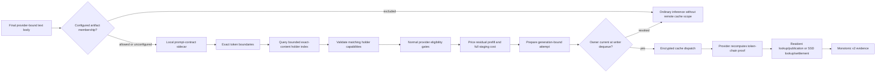

# Exact Prefix Cache Routing

> Last updated: 2026-10-06

Exact prefix cache routing lets the scheduler prefer a provider that has
*proven* it holds a reusable exact token prefix in an advertised resident
memory or encrypted SSD cache. This page explains the mechanism — proof, evidence lifecycle,
service cost — and the guarantees that bound it; it is for engineers changing the
scheduler, the receipt path or the prompt-contract sidecar. The operator
procedure for turning it on is
[`../operations/cache-routing-rollout.md`](../operations/cache-routing-rollout.md).

## Context

A provider that already holds a request's exact token prefix in its local
prefix cache ([`prefix-cache.md`](prefix-cache.md)) can skip that prefill,
but the scheduler's cost model ([`routing.md`](routing.md#cost-model)) knows
nothing about where a prefix lives. Cache-aware routing closes that gap by
pricing a *proven* cache hit at the provider's estimated residual prefill plus
restore cost — never as a hard affinity, and never on the strength of a
caller-supplied field. It is flag-gated:
[`EIGENINFERENCE_CACHE_ROUTING_MODE`](../reference/configuration.md#routing-admission-and-ttft)
defaults to `off` (`CacheRoutingOff`, `coordinator/registry/cache_routing.go`)
and can select `on` (`CacheRoutingOn`); `off` prevents new cache participation.
This coordinator switch is independent of the provider's default-enabled
`DARKBLOOM_PREFIX_CACHE` gate (`PrefixCachePolicy.isEnabled`,
`provider-swift/Sources/ProviderCore/Inference/PrefixCache/PrefixCachePolicy.swift`). Local
cache reuse and provider HTTP measurements do not imply that coordinator cache
routing is enabled or deployed. The cross-machine routing scenarios have Go
regression coverage; live two-machine cache-routing latency is unmeasured.

### Guarantee

Cache routing is an optimization, never an inference dependency. When routing is
`off`, new requests receive no reusable remote scope or cache adjustment, and
new receipts cannot create routing evidence. Queued attempts are revalidated at
writer dequeue; an already accepted write may complete after the switch.
When routing is `on`, only exact text-token prefix
proofs from protocol-v2 providers can affect selection. Unsupported providers,
multimodal requests, sidecar failures, contract mismatches, stale evidence, and
invalid receipts all use normal cold routing.

Resident routing has its own additive capability and short-lived evidence; SSD
routing retains its durable-settlement contract. No caller field, session identifier, JSON-body hash, probabilistic conversation
anchor, or coordinator heuristic establishes cache ownership.

## Mechanism

### Request flow



The coordinator calls the local prompt-contract sidecar
(`coordinator/promptcontract/`, see
[`prompt-contract-sidecar.md`](prompt-contract-sidecar.md)) only after alias
resolution, tool normalization, endpoint lowering, output-bound injection, and
construction of the final provider-bound body (`planPromptRoute`,
`coordinator/api/inference/prompt_work.go`, called through the request's
`routeplan.Memo` in `coordinator/api/inference/consumer.go`; planning itself is
`CachePlanner.PlanResult`, `coordinator/internal/inference/routeplan/cache_planning.go`). The sidecar returns the prompt contract
identity, exact token count, and complete block-chain boundaries. It never
returns or logs the normalized prompt, tokens, or hashes outside the local
response contract.

Sidecar timeout, crash, malformed output, unavailable artifacts, and dynamic-time
templates return a non-participating plan. Ordinary inference continues subject
to its existing admission and remaining request budget.
Requests carrying media (`HasMedia`) never produce a participating plan.

Planning uses a child context capped at the original request receipt time plus
the already-selected first-content budget. The request handlers derive it with
`promptwork.PlanningContext` (`coordinator/api/promptwork/planning.go`) each
time the request's `routeplan.Memo` computes a plan (`HandleChatCompletions` and
`handleGenericInference`, `coordinator/api/inference/consumer.go`). It does not
restart that clock after alias fallback, replace the inference context, or carry
the child's deferred cancellation into dispatch. Zero/exempt
budgets and a missing receipt timestamp add no artificial deadline.
`CachePlanner.PlanResult` (`coordinator/internal/inference/routeplan/cache_planning.go`)
can apply the same bound itself through `FirstTokenWriteContext`
(`coordinator/internal/inference/firstcontent/first_content_policy.go`) when
`CachePlanningInput.ReceivedAt` and `FirstContentBudget` are set;
`planPromptRoute` does not set them, so in production that step passes its
caller's context through. An earlier parent deadline, the
`promptcontract.DefaultRequestTimeout` prompt-accounting bound (`promptwork.Account`,
`coordinator/api/promptwork/accounting.go`) or the client's own timeout still
wins. An exhausted request
uses the existing dispatch deadline outcome; optional cache work grants no
extra service time.

Each planning decision is counted once, when the request's plan for a concrete
model and provider-bound body is first computed; for a request that takes the
public capacity preflight that is while admission builds its forecast. The count
includes dependency/artifact/preload refusals, and a generic-endpoint body that
cannot be lowered is counted as `lowering_unsupported` after admission
(`CachePlanner.EmitDecision`, called from `handleGenericInference`,
`coordinator/api/inference/consumer.go`). This broader metric
does not change legacy Registry outcomes, sampling/QPS precedence or public
status fields. It adds one legacy sample: a media request whose model is
verified and whose contract is preload-acknowledged now reaches the Registry's
existing `ineligible` decision, because the planner is consulted to record its
decision, and is counted once in `exact_cache_plan_total`; routing and billing
are unaffected. Artifact and preload checks are scoped to the resolved
model and its exact contract: unrelated pending or failed artifacts do not close
an acknowledged healthy member. Current catalog/child/verified-set identity
and actual runtime readiness still gate participation; see
[per-contract readiness](prompt-contract-sidecar.md#process-and-lifecycle).
See [the metric populations](../reference/telemetry-inventory.md#optional-cache-planning-decisions).

Current tokenizer acknowledgement and current routing participation are distinct.
The API uses the Registry's read-only canonical pre-activation classification
without consuming sampling, QPS or counters. It preserves existing `off` and
`ineligible` outcomes only after confirming native acknowledgement; stopped,
stale or never-acknowledged contracts remain `preload_not_ready`. A fresh check
before commitment handles policy drift conservatively, and the actual Registry
plan revalidates authority before consuming activation once
(`CachePlanRejection`, `coordinator/registry/cache_plan_preflight.go`;
`CachePlanner.commitCachePlanning`, `coordinator/internal/inference/routeplan/cache_preload_selection.go`).

An optional exact-artifact list runs before the cohort, QPS gate and sidecar
plan. `EIGENINFERENCE_CACHE_ROUTING_ALLOWED_ARTIFACTS` matches the resolved model
ID, verified aggregate and prompt-contract ID together; changing weights or the
template does not inherit an older tuple's rollout permission. Unconfigured
preserves existing eligibility, while `[]` declines every request. Excluded
requests return `ineligible` with no participating plan or reusable remote scope
(`coordinator/internal/registry/cachepolicy/artifacts.go`, `ArtifactAllowlist.Allows`;
`coordinator/registry/cache_route_keys.go`, `PlanCacheRouteWithResult`).
A revision therefore leaves its model listed under an artifact that is no
longer live. The status counts such models as `artifact_allowlist.stale_models`
and the coordinator log names each live tuple once, so the missing entry is
reported instead of appearing only as a model whose hits stopped
(`ArtifactAllowlist.StaleFor`; `coordinator/api/inference/exact_cache_allowlist_staleness.go`,
`missingAllowlistEntries`).

An authenticated eligible request can record bounded demand for its exact resolved
artifact tuple before tokenizer readiness, without waiting or changing its original
deadline. Overflow selection retains the full verified catalog and never raises the
sidecar's configured capacity. See the canonical
[tokenizer preload policy](prompt-contract-sidecar.md#bounded-tokenizer-preload-selection).
Advisory public provider availability is neither cache ownership nor authorization.

Without authenticated scope, `RemotePrefixCacheContext.cacheEnabled` is false
and the provider forwards `prefixCacheEnabled=false` to the engine. This gates
network cache use without a second provider allowlist. Local HTTP/standalone
policy remains independent, and a listed artifact must still satisfy the
provider's intrinsic backend/codec/identity gates
(`provider-swift/Sources/ProviderCore/Inference/PrefixCache/PrefixCacheReceipts.swift`,
`provider-swift/Sources/ProviderCore/Inference/Engine/Bridge/EngineV2Bridge+Translation.swift`).

Two operational controls sit between mode `on` and planning
(`cacheactivation.Gate`, `coordinator/internal/registry/cacheactivation/gate.go`): a
deterministic HMAC-sampled cohort over account, resolved model and
provider-bound body (`EIGENINFERENCE_CACHE_ROUTING_PERCENT`), and a
process-local token bucket bounding sidecar plan QPS
(`EIGENINFERENCE_CACHE_ROUTING_MAX_PLAN_QPS`). Both only decline cache
participation; they never reject, delay, or otherwise change ordinary
inference.

### Identity and isolation

After those unchanged rollout gates, planning admission waits within its
existing deadline instead of oversubscribing the sidecar's worker pool.
Count/byte bounds and explicit server-connection headroom for independent
health/control pools are enforced by `NewClient`,
`PlanAdmission` and `Client.Plan` (`coordinator/internal/promptcontract/sidecar/plan_admission.go`,
`coordinator/internal/promptcontract/sidecar/client.go`); see
[the sidecar mechanism](prompt-contract-sidecar.md#process-and-lifecycle).
Successful planning is an opportunity for reuse, not proof that a provider
actually adopted an SSD checkpoint.

One cache plan contains:

- the verified model aggregate hash;
- the prompt contract identity;
- an opaque account/build scope;
- the exact prompt token count;
- ordered complete block-chain boundaries.

The provider-visible scope is a domain-separated HMAC over authenticated account,
concrete model build, aggregate hash, prompt contract, and block-hash contract
(`coordinator/registry/cache_route_keys.go`). The provider does not infer
remote scope from `prompt_cache_key`, `user`, or any other caller-controlled
body field. The only `prompt_cache_key` the coordinator ever writes is a
coordinator-authored cache-bust key inserted into the sealed body for
protocol-0 providers (`BodyForCacheAttempt`, `coordinator/internal/inference/providerwire/body.go`;
`LegacyCacheBustKeyLength`, `coordinator/registry/cache_receipts.go`).

Coordinator boundary keys are domain-separated HMACs under the route key over
the opaque scope, aggregate hash, prompt contract, boundary token count, and
provider-confirmed chain hash. Provider epochs remain mandatory holder metadata, rather than part
of the content key: independent machines holding the same exact prefix share
one bounded bucket per tier. Route and scope keys (the HMAC key material
derived from the master key), account identifiers, raw boundaries, and
prompts are not persisted or attached to telemetry; the durable cache
routing copy stores the keyed boundary and demand identifiers (HMAC outputs
under those keys, meaningful only to a coordinator holding the same master
key) with token counts and costs.

### Configuration and dispatch ownership

Planning captures one configuration generation with its keys and artifact policy.
After sidecar I/O, the coordinator discards a plan if that generation has changed.
The holder index rejects unbound or retired plans; each returned hint carries
that generation through scan and reservation checks. Prepare requires the same
generation and verifies the selected connection and capability again before
publishing the nonce. Reconfiguration, including an
unchanged-key update, revokes the old generation and clears its tracker maps
(`PlanCacheRouteWithResult`, `PreparePrefixCacheV2Attempt`, `ConfigureCacheRouting`).

A queued frame retains one immutable attempt owner. At writer dequeue,
`CacheAttemptSnapshot.ApplyTo` (the `cacheattempt.Snapshot` alias in
`coordinator/registry/cache_attempt_ownership.go`, implemented in
`coordinator/internal/registry/cacheattempt/owner.go`) checks revocation without registry or tracker
locks. A revoked attempt sends the ordinary encrypted request with its remaining
deadline budget and no scope, nonce or cache negotiation. That check is the
cutoff: an accepted write may finish after reconfiguration. Cancellation,
timeout and failed dispatch clean up the original owner and tracker; a late
cleanup cannot modify a replacement attempt. A stale proof mismatch likewise
cannot quarantine a replacement configuration or capability.

Cache participation is an atomic per-attempt observation. Revocation before the
first accepted dequeue restores ordinary calibration eligibility; an already
accepted cache write remains excluded. Terminal requests retain the existing
bounded grace period for authenticated durable-ready receipts while revoking
queued dispatch (`coordinator/registry/cache_attempt_ownership.go`,
`coordinator/internal/inference/providerwire/provider_wire.go`).

### Protocol v2 proof

Each supported tier advertises a connection-scoped capability containing:

- concrete model ID and actual post-load aggregate hash;
- prompt contract ID;
- block hash version and block size;
- tier-specific cache epoch;
- enabled and ready state.

The coordinator accepts the capability only when it matches the provider's
registered model inventory and supported block contract. A cache attempt binds
the live provider connection, request, model, plan, capability, nonce, and
expiry. `prefix_cache_v2_models` describes durable SSD slots;
`prefix_cache_memory_models` separately describes resident slots using the same
`PrefixCacheV2Capability` shape. Both match the registered model inventory and
256-token block contract. Older coordinators ignore the new snapshot and do not
learn resident holders. An omitted heartbeat snapshot preserves that tier; an
explicit empty array clears it. Protocol downgrade clears resident capabilities
(`UpdatePrefixCacheSnapshot`, `coordinator/registry/cache_snapshot.go`).

The provider recomputes the token-chain anchor from the body it actually
tokenizes. Lookup evidence carries the prompt anchor and optional matched anchor.
Legacy SSD-ready evidence carries the input-prompt anchor plus, when available,
the final generated-continuation anchor. A durable capability with
`ready_boundary_mode=checkpoint` instead proves at most 16 explicitly committed
input checkpoints, with zero recompute and positive SSD stage cost. The provider
requires the coordinator's `cache_receipt_boundary_mode=checkpoint` request echo
before emitting those receipts. Old coordinators ignore the optional capability
field and omit the echo: registration continues, local reuse can work, and this
format teaches no coordinator holder. A granted scope also carries
`cache_repeated_prefix_tokens`, an integer count: the coordinator's observed
fleet-wide repeat demand. The provider uses it to gate
complete-checkpoint donations
([observed demand](#observed-demand-and-soft-prefix-affinity)). Under
[first sight](#first-sight) a new prompt's own deepest 1,024-stride boundary
travels in a second integer count, `cache_first_sight_tokens`, never in the
repeat count. None
of these fields changes the signed
attestation or status canonical payload (`coordinator/protocol/messages.go`,
`coordinator/internal/inference/providerwire/provider_wire.go`; `coordinator/attestation/attestation.go`,
`StatusCanonicalInput`).

Resident-ready evidence also carries at most 16 actually published input
checkpoints. Each explicit checkpoint is independently matched against the
coordinator's prompt plan. It cannot claim an unverified generated continuation.
Sequence numbers increase strictly for each provider/model/tier/epoch. Lookup
and publication state are separate per tier, even if epoch UUIDs coincide
(`coordinator/registry/cache_receipts_v2.go`, `cache_tiers.go`).

The provider hashes the tokenized prompt with the shared 256-token chain. A
physical 16-token page hash is not a routing anchor. Hybrid recurrent state can
be reused only at an actual captured checkpoint endpoint: any 256-token-aligned
range end the donor's schedule produced, not every 256-token hash boundary.
For example, a 4,353-token input has a 4,352-token proof floor, while its
reusable checkpoint is the deepest boundary the donor actually captured:
4,096 under the solo stripe or under 512-token plain chunks, and 4,352 only
when a budget-clamped range happened to end there. A resident or checkpoint-mode
SSD receipt may publish that earlier boundary; it does not invent state the
donor never captured (`ResidentPrefixCachePromptProof`,
`provider-swift/Sources/ProviderCore/Inference/PrefixCache/ResidentPrefixCacheEvidence.swift`).

These identities are prefix-based, not turn-based. If machine A publishes the
original 4,096 checkpoint and machine B later publishes only a longer checkpoint,
only A receives the original-prefix bonus. If B publishes both checkpoints, B
can receive that bonus after A disconnects. Normal capacity and load selection
still applies (`TestMemoryRoutingOriginalAcrossProvidersUsesPublishedCheckpoint`,
`coordinator/tests/registry/cache_memory_test.go`).

A proof mismatch fences that exact capability for a bounded window: 60 s,
doubled for each consecutive mismatch on the same provider/model/tier
capability, capped at 10 min (`ProofFenceBase = 60 * time.Second`,
`ProofFenceMax = 10 * time.Minute`, `ProofFenceDuration`,
`coordinator/internal/registry/cachetracker/proofs.go`; registry adapters in
`coordinator/registry/cache_proof_fence.go`). Receipts inside the window are
rejected as `capability_fenced` and never extend it (`capabilityRejected`;
`CacheReceiptCapabilityFenced`, `coordinator/registry/cache_receipt_result.go`).
The fence lifts when the window expires, or when the provider advertises a
different capability (`reconcileFences`,
`coordinator/registry/cache_model_changes.go`, at the heartbeat). Strikes are
forgotten by an accepted proof after the window lifted
(`resetProofStrikesLocked`), by a capability change, or once the record has
stayed idle for `cacheProofFenceRetention` (= `cacheProofFenceMax`) past the
window's end. The request continues without preference.

### Holder lifecycle

An SSD holder is created only by a valid SSD hit or durable-ready callback after
the provider has established actual readable durable state. The attention-block
path reopens and authenticates its published blocks. Complete checkpoints use
a fully authenticated matching read or a successful streamed encrypted commit,
with donor/export aliases retired before the ready callback; same-request
deduplication also checks that its authenticated file identity is unchanged. A resident holder instead requires a valid memory lookup or
publication from a separately advertised resident slot. Its lifetime is bounded
by `min(configured TTL, cacheRoutingMemoryTTL = 30 * time.Second)`; repeated or
replayed publication cannot extend the lifetime. The holder key includes a
separate tier domain, preventing resident evidence from replacing SSD evidence
(`cacheTierBoundaryKey`, `receiptTTL`, `coordinator/registry/cache_tiers.go`). It records the live provider connection, model, aggregate
hash, prompt contract, cache epoch, exact anchor, recompute requirement, expected
saved tokens, measured staging cost, and bounded expiry.

Evidence is removed or made unreachable on:

- provider disconnect or live-connection replacement;
- capability, contract, aggregate hash, or epoch change;
- proof mismatch — an anchor mismatch drops only that provider's holders at
  the mismatched plan's boundaries, in both tiers, keeping its sequence
  watermark (`invalidateProviderPlan`,
  `coordinator/registry/cache_proof_fence.go`); an identity mismatch drops
  that provider's whole model (`invalidateProviderModel`,
  `coordinator/registry/cache_receipts.go`; both are chosen by
  `CacheQuarantineCommit.Apply`, `coordinator/registry/cache_quarantine.go`);
- verified miss or corruption for the attempted boundaries;
- a valid hit at a shorter boundary than one recorded for that provider: its
  deeper holders for that prompt, in that tier;
- holder expiry, or cap eviction of the holder that expires first;
- routing transition to `off`.

A capability mode change invalidates that model's existing holders and attempts even if its epoch string
is unchanged. Unchanged models retain their evidence and proof fences. The heartbeat
caller in `coordinator/api/provider/session.go` uses `UpdatePrefixCacheSnapshot`;
`CacheSnapshotUpdater.Apply` publishes capabilities and invalidates evidence while
holding registry/provider ownership (`coordinator/registry/cache_snapshot.go`).
It binds one chunk of parked rows before releasing those locks. Its
`CacheSnapshotResult` then carries abandoned epoch/model buckets and any remaining
binding work to `SettleDrop` and `BindRemaining`
(`coordinator/registry/cache_snapshot_result.go`). Each deferred chunk rechecks
the original connection's ownership and current capability, so an old publication
cannot erase a replacement connection's evidence or settle an epoch that a later
heartbeat restored.
The checkpoint routing milestone is covered by local Go protocol, registry,
simulated multi-provider, and API wire tests; it is not a live two-machine
measurement ([source and test evidence](../reports/evidence/2026-09-05-ssd-checkpoint-cache/coordinator-evidence-manifest.json)).

Holder removals are counted under one of eight reasons
(`coordinator/registry/cache_routing.go`): `ttl`, `disconnect`,
`epoch_change`, `capability_change`, `proof_mismatch`, `miss_invalidation`,
`shorter_hit`, `capacity_eviction`. Neither tier rotates its epoch on eviction. SSD budget
eviction, TTL expiry and corrupt-file removal are per-file: the provider keeps
its epoch and capability, its remaining checkpoints stay routable, and a stale
holder is removed by the next exact miss on that provider (`miss_invalidation`)
or by TTL. The SSD epoch changes only when the provider rebuilds the whole
model root at initialization (weight hash, prompt contract, block-hash version,
block size, layout epoch or key fingerprint drift), so `epoch_change` means a
whole-root rebuild, not capacity pressure. Providers older than this change
still rotate on eviction.

Because a provider that removes one file keeps its epoch, the coordinator
learns of the removal from the next lookup: a miss at the attempted boundaries
(`miss_invalidation`), or a valid hit below a boundary recorded for that
provider (`shorter_hit`, `SupersedeDeeperHoldersLocked`,
`coordinator/internal/registry/cachetracker/cache_receipts_v2_lookup_kernel.go`), which drops that
provider's deeper holders for that prompt in the receipt's tier. Without the
second rule a provider that evicted its deeper checkpoint would keep attracting
the prefix and answer with a partial hit each time. The provider may still
store the deeper file and have skipped it under a stage-size or stage-time cap;
the receipt cannot distinguish the two, holders are advisory, and a later ready
or hit re-teaches them. Neither path fences the provider or moves its sequence
watermark. Slot unload,
replacement, shutdown, and connection changes invalidate resident evidence.
There is no targeted resident-eviction wire message in this extension.

The file and its in-memory index commit are coordinated through
`SSDCheckpointFileCoordinator` in
`provider-swift/Sources/ProviderCore/KVCacheSSD/SSDCheckpointFileCoordinator.swift`.
Complete-checkpoint `performWrite` and attention `SSDWriteBehind.consume` hold
cancellable per-file access through durable rename (or duplicate authentication)
and index insertion. They release it before whole-root/disk-budget maintenance,
so a committed new file can still be evicted under pressure. Startup scans use
the same file-access boundary for index insertion. Under its epoch barrier,
`SSDOwnedEntryRetirement.remove` uses nonblocking `tryAcquire` and skips busy
files rather than waiting for a writer that may need the epoch lock. Unrelated
victims remain eligible. Complete-checkpoint donation and `publishReady` also
require a regular no-follow file before announcing a new anchor
(`provider-swift/Sources/ProviderCore/KVCacheSSD/SSDHybridCheckpointStore+Write.swift`,
`provider-swift/Sources/ProviderCore/KVCacheSSD/SSDHybridCheckpointStore+Maintenance.swift`,
`provider-swift/Sources/ProviderCore/KVCacheSSD/SSDWriteBehind.swift`,
`provider-swift/Sources/ProviderCore/KVCacheSSD/SSDOwnedEntryRetirement.swift`).
This prevents owned retirement from deleting a renamed-but-not-yet-indexed
checkpoint without reintroducing generation-wide invalidation for routine LRU.

Attempts remain briefly after inference terminal state because encrypted SSD
write-behind can finish later. Routing uses in-memory attempt and holder maps;
SSD holders also have a [write-behind copy](#persistence-across-restarts). Each
exact-content/tier bucket retains at most 16 machines by default, across all
provider epochs ([`EIGENINFERENCE_CACHE_ROUTING_MAX_HOLDERS`](../reference/configuration.md#routing-admission-and-ttft),
`defaultCacheRoutingMaxHolders = 16`). Holder entries also have a bounded
lifetime, 30 minutes by default to match how long a provider keeps a saved
prefix ([`EIGENINFERENCE_CACHE_ROUTING_TTL`](../reference/configuration.md#routing-admission-and-ttft),
`defaultCacheRoutingTTL`, an alias of `cachedemand.DefaultTTL = 30 * time.Minute`,
`coordinator/internal/registry/cachedemand/tracker.go`). The production release
defaults seed the same two values; a host whose env file pins older ones keeps
them until it is edited
([holder lifetime and holders per prefix](../operations/cache-routing-rollout.md#holder-lifetime-and-holders-per-prefix)).
The holder index has a global cap of `cacheRoutingMaxEntries = 250_000`, sized for 30 holder
creations per second over 30 minutes (54,000) with more than 4× headroom. A
holder measures 1,020 to 1,164 B, so a full index is about 280 MiB. Holders and
attempts are each kept in a min-heap ordered by expiry. The sweep runs at most
every 30 seconds under the tracker lock, pops expired heads, and removes at most
`cacheRoutingMaxSweepRemovals = 1_024` holders and 1,024 attempts per pass; a
pass that leaves expired entries behind continues on the next tracker operation
(`coordinator/registry/cache_sweep.go`, `sweepIfDueLocked`, delegates to
`cachetracker.Tracker.SweepIfDueLocked` in
`coordinator/internal/registry/cachetracker/cache_sweep_kernel.go`). An expired holder that has not been
swept is never returned (`activeHolderLocked`). At the global cap the holder
that expires first is evicted; at the per-bucket limit the oldest update is.
Either eviction counts as `ttl` when its victim had already expired, so
`capacity_eviction` counts only live evidence. Disconnects and capability or
model changes visit only that provider's holders and attempts
(`coordinator/internal/registry/cachetracker/lifecycle.go`,
`InvalidateProviderEvidence`, `InvalidateProviderModels`).
`CacheMaintenance` (`coordinator/registry/cache_maintenance.go`) serializes those
operations with receipts under the same generation's tracker mutex. Its
`StateCounts` performs bounded expiry passes, releasing that mutex between
passes; `CacheRoutingStateCounts` reaches it through `stateCounts` in
`coordinator/registry/cache_sweep.go`. A configured TTL above 30
minutes is accepted and logged as a warning at startup, because providers keep
their files for at most 30 minutes and the indexes are sized for that window. V1 receipt
frames remain decodable for mixed-version safety but cannot mutate routing
evidence (`coordinator/registry/cache_receipts.go`).

### Attempt-record memory accounting

The tracker admits at most `cacheRoutingMaxAttemptBytes` (67,108,864) logical
bytes of attempt records in addition to its unchanged 50,000-record count cap.
`CacheAttemptCharge` in `coordinator/internal/registry/cachetracker/attempt_budget.go` charges
`2048 + 96*N + sum(boundary hash byte lengths) + 128 + scalar byte lengths`;
the `AttemptBudget` ledger in that file holds the admitted total and its limit.
`N` counts input boundaries. The boundary slice and the frozen boundary claims
share one detached immutable hash string per boundary. Scalars include nonce,
request/provider/model identities, every plan string, expected-prompt hash and
all string fields of both tier capabilities. The 128-byte allowance prepays both
future READY hashes.

`StoreAttemptLocked` (`coordinator/internal/registry/cachetracker/cache_receipts_kernel.go`)
validates the charge, clones retained strings and the boundary slice and derives
its own boundary claims before reclaiming any terminal record. Checked
replacement accounting subtracts the incumbent's stored charge; reclaiming never
selects the nonce being replaced, and a refusal preserves the incumbent.
On byte pressure, a separate terminal-only expiry order (`TerminalOrder`, built
for each generation in `coordinator/registry/cache_tracker_controller.go`)
offers at most 64 of its earliest-expiring records
(`terminalBudgetVictimsLocked` in
`coordinator/internal/registry/cachetracker/attempt_pressure.go`, walking
`Order.Earliest` in `coordinator/internal/registry/cacheindex/order.go` without
mutating it). Only completed attempts' optional late-receipt grace is eligible;
live attempt authority is not reclaimed by this byte-pressure policy. Records
are removed only when their complete refund admits the candidate; otherwise no
grace evidence is discarded and the attempt is refused. A record larger than
the whole budget is refused without reclaiming anything. The existing count-cap
policy still evicts the record that expires first, which can be a live record;
this change does not claim otherwise. Every removal refunds the stored charge
exactly once and removes the record from both expiry orders.

`PreparePrefixCacheV2Attempt` publishes an owner only after successful insertion
and uses the admitted detached scope. Refusal returns ordinary cold inference,
without receipt metadata, cache participation or discarded TTFT calibration.
A reclaimed nonce cannot later recreate a holder through READY. The existing
count/expiry race can remove a successfully inserted record before owner
publication; publication is not a promise of continuing map retention.

The in-flight lifetime remains two hours. The first terminal marking
(`MarkAttemptTerminal`, `coordinator/internal/registry/cachetracker/lifecycle.go`)
starts a maximum two-minute late-receipt grace; repeated terminal callbacks do
not extend it, and byte pressure may shorten it. Terminal records retain their
full charge until removal. Generation retirement revokes the tracker before
clearing both expiry orders and the counter. Validated READY updates clone only
their prepaid retained hash (`ApplyReadyV2`,
`coordinator/internal/registry/cachetracker/receipt_ready.go`).

The aggregate status and metric gauges expose `attempt_bytes`,
`attempt_budget_refused`, and `attempt_grace_reclaimed` (Prometheus prefix
`exact_cache_`; Datadog prefix `exact_cache.`), read through
`Tracker.AttemptLifecycle` into `CacheRoutingLifecycleStatus`
(`coordinator/registry/cache_routing.go`). The latter two are monotonic within
the current tracker generation and reset on reconfiguration. They contain no
account, prompt, nonce or provider labels. Refusal is an admission outcome, not
a cache hit-rate denominator.

This is a logical bound on tracked records, not a process RSS or OOM guarantee.
Request plans, published owners/snapshots, provider and holder state, map capacity,
temporary candidate/replacement allocations and garbage-collection timing have
separate lifetimes. All-live occupancy can still exhaust the global budget;
terminal reclamation is not per-tenant fairness or a production sizing result.
The budget neither changes encrypted SSD retention nor grants cache credit
without the existing authenticated receipt and owner checks.

### Persistence across restarts

Routing reads stay in memory. With `EIGENINFERENCE_CACHE_ROUTING_PERSIST`
enabled and a supporting store, the coordinator keeps a write-behind copy of
SSD holders and observed demand. Attempts and memory-tier holders are never
persisted (`coordinator/registry/cache_persistence_registry.go`,
`StartCacheRoutingPersistence`; `coordinator/internal/registry/cachetracker/holder.go`,
`Holder.Persistable`). `coordinator/registry/cachepersist/persister.go` provides
the registry-facing constructor and aliases; the persister implementation lives
in `coordinator/internal/registry/cachepersist/`, with its pending state and
bounded write snapshots in `coordinator/internal/registry/cachequeue/`.

#### Restore and binding

Boot and flush-tick retries both call `restoreCacheRoutingState`, which runs
`CacheRestoration.Run` (`coordinator/registry/cache_restoration.go`) with the
selected persister and tracker. It bounds the durable load, merges restored
demand into the live demand index, seeds only accepted demand as persisted, and
then binds parked holders for connected providers. Boot establishes the
cache-key generation before writing mutations. A failed
restore leaves mutations pending and retries every flush tick. The generation
fingerprint covers the master key, derivation versions and block contract;
a mismatch resets the durable copy instead of restoring unreachable keys.
Loads apply the current TTL before the index caps. Timestamps up to one minute
ahead of the clock are clamped; later rows are excluded and pruned. A retry
merges with already parked holders and live demand by evidence time; only
accepted demand entries seed write deduplication
(`coordinator/internal/registry/cachepersist/restore.go`, `Restore`, `SeedDemandPersisted`;
`coordinator/internal/registry/cachedemand/tracker.go`, `Tracker.Restore`).

Restored and disconnected holders park by cache epoch and model. They bind only
to a live provider with matching epoch, model, artifact, contract, block-hash
version and ready-boundary mode. Binding rechecks session ownership and
capabilities in chunks of 1,000 rows; changed identities or abandoned epochs
settle their durable rows rather than reload forever. A surviving lookup-stage
measurement keeps its own deadline. TTL expiry leaves durable rows to pruning
(`CacheMaintenance.BindChunk`, `coordinator/registry/cache_maintenance.go`;
`BindPendingLocked`, `BindRowsLocked` in
`coordinator/internal/registry/cachetracker/cache_persistence_kernel.go`;
`SettleParkedChunk` in `coordinator/internal/registry/cachetracker/lifecycle.go`).
The registry adapters in `coordinator/registry/cache_persistence.go` retain the
provider identity; `bindChunksWhileOwned` and `dropParkedWhileStale` in
`coordinator/registry/cache_persistence_registry.go` revalidate ownership and
capabilities around each chunk.

A validated miss or shorter hit uses the attempt's epoch and boundary keys to
invalidate durable evidence even before any live holder is restored
(`InvalidateBoundaryLocked`,
`coordinator/internal/registry/cachetracker/cache_receipts_v2_lookup_kernel.go`,
called by `Tracker.ApplyLookupV2` in
`coordinator/internal/registry/cachetracker/receipt_lookup.go`).
Overlapping sessions can share one durable row. After losing evidence, only a
strictly newer live survivor can retain that row. If only older or equal
evidence survives, the coordinator deletes the durable copy rather than trying
to replace newer stored evidence with a monotonic upsert of an older record.
Those older live holders remain usable until expiry or ordinary invalidation
(`PersistRowAfterLossLocked`,
`coordinator/internal/registry/cachetracker/cache_persistence_kernel.go`).

#### Pending mutations and overflow

One serialized writer serves periodic and shutdown flushes. Holder upserts,
deletes and demand marks carry revisions and remain pending until database
acknowledgement. A bounded snapshot copies work without draining it; each
successful store chunk clears only matching revisions, so an acknowledgement
cannot erase a newer mutation. Failure simply leaves unwritten changes pending
(`coordinator/internal/registry/cachequeue/mutations.go`, `Queue.Snapshot`;
`coordinator/internal/registry/cachepersist/mutations.go`,
`acknowledgeHolders`, `acknowledgeDemand`; `coordinator/internal/registry/cachepersist/flush.go`,
`Flush`). Pending deletes fence older or equal evidence; acknowledged or
superseded decisions remain fenced for one TTL, subject to the retention cap
(`coordinator/internal/registry/cachepersist/delete_fences.go`, `Tombstoned`).

Each pending-write kind is capped at four times the holder budget. At the cap,
new upsert or demand marks may be dropped. Delete overflow instead replaces the
holder backlog in O(1), requests a durable reset and wakes the writer. It retains
the latest invalidation timestamp at overflow as a conservative cutoff for the
rest of the process, including after reset and pruning. Delayed receipt upserts,
restored rows and parked rows at or before that cutoff cannot repopulate the
durable copy or bind. A later overflow can only advance the cutoff
(`coordinator/internal/registry/cachepersist/reset.go`, `requireResetLocked`;
`coordinator/internal/registry/cachepersist/delete_fences.go`, `tombstonedLocked`).

A pending reset blocks snapshots and interrupts the current batch before its
next store call; an in-flight call may finish, then the reset removes its rows.
The store writes an in-progress marker, clears both tables, and records the
complete generation last. The reset clears demand-write deduplication, not
new pending observations. The next boot completes an interrupted marked reset
(`resetDurableCopy`, `coordinator/internal/registry/cachepersist/reset.go`;
`ResetCacheRoutingState`, `coordinator/store/postgres/cacheroutingstate.go`).
A crash before the marker lands can still leave invalidated rows restorable.
Serialization is process-local: concurrent coordinator writers can repopulate
rows during a reset; no cross-process fencing is provided.

Shutdown closes and joins provider sockets and the periodic persistence loop
before the final bounded flush. If the socket join times out, a further bounded
wait and flush retry run; remaining loss is logged. See
`drainAndStop` in `coordinator/app/lifecycle.go`,
`CloseProviderConnections` in `coordinator/api/provider/provider.go` and
`FlushCacheRoutingState` in `coordinator/registry/cache_persistence_registry.go`.
The [status reference](../reference/api-contracts.md#exact-cache-status) defines
the persistence counters; the [rollout runbook](../operations/cache-routing-rollout.md#persistence-during-restarts)
covers restart and reset precautions.

### Prepared assistant replacement

A prepared Gemma QAT assistant upgrade temporarily advertises only that model's
slot as `reloading`. Normal eligibility gates exclude the slot even when it has
valid cache-holder evidence; racing provider admissions receive a transient 503
`rejection_reason: slot_state` refusal. Other model slots continue serving. Accepted work finishes
on the original engine before publication. The network provider's configured
rollout jitter occurs before admission closes and only spreads independent
upgrades; it provides no fleet-wide availability guarantee
(`provider-swift/Sources/ProviderCore/ProviderLoop+Capacity.swift`,
`updateAggregateCapacity`; `provider-swift/Sources/ProviderCore/ProviderLoop+MTPDrain.swift`,
`rejectIfDrainingForMTP`). The drain, timeout fallback and standalone
behavior are defined in [inference → Multi-token prediction](inference.md#multi-token-prediction).

Replacement keeps the complete checkpoint's assistant and runtime identity
checks. A target-only checkpoint can miss after MTP activates; old holder evidence
does not authorize reuse under the replacement's cache capability or epoch.
Unchanged models retain their evidence under the normal
[holder lifecycle](#holder-lifecycle).

### Scheduler

`cacheRoutingHints` (`coordinator/registry/cache_routing_hints.go`) derives one
keyed content digest per request boundary and queries both tier buckets before
inspecting provider capabilities. It snapshots only matching machines, outside
the tracker lock. With `B` boundaries and at most `H` holders per bucket, the
lookup hashes `B` times and visits at most `2 × B × H` holder records; this work
does not grow with unrelated fleet members. The normal eligibility scan still
visits its ordinary candidate pool once. Epoch, connection pointer, capability
and proof quarantine remain required; capability revisions are rechecked at
selection and reservation. A miss, a shorter hit or an epoch rotation removes only that
provider's evidence from the common bucket.

All ordinary trust, model, trait, memory, token-budget, queue, cooldown, health,
and time-to-first-token gates remain mandatory
([`routing.md`](routing.md#eligibility-gates-and-the-gatereason-vocabulary)).
`applyCacheRoutingCost` (`coordinator/registry/scheduler.go`) passes the longest verified
executable endpoint to `applyCacheHintLocked`
(`coordinator/registry/cache_service_cost.go`). `PriceForProviderLocked` rechecks
the hint's currency and expiry under the provider lock, then
`cachepolicy.ApplyServiceCost` (`coordinator/internal/registry/cachepolicy/service_cost.go`)
prices detached values using the same `performance.Rates.Prefill` policy as
`resolvePrefillTPS` and the candidate's baseline prefill cost.
The provider chooses its longest locally usable endpoint at lookup; no request
field steers a shorter checkpoint, even if its recorded stage cost is lower.
`cache_repeated_prefix_tokens` instead steers which endpoints a historical
donor creates (the 1,024-aligned boundary at or below it, beside the first and
the deepest). A ready receipt carries every durable boundary a donor published,
up to 16 anchors, keeping the deepest sixteen when there are more; a donor on a
slot whose staged windows are at the cap may prove fewer anchors, or only its
latest.
Complete-checkpoint SSD takes precedence over resident memory. A complete SSD
capability without a matching durable proof receives no memory fallback credit.
Other dual-tier advertisements have no negotiated selector and receive no credit;
single-tier SSD and explicit resident-only deployments remain eligible. These
are advisory estimates of the longest verified local holder, not an execution
command: unpublished checkpoints, eviction, admission and stage policy can
change the actual outcome. The provider authenticates and revalidates reuse.

For SSD, a validated hit records the measured external stage time for that exact
holder and endpoint. A later Ready refresh keeps the measurement while it is
fresh, with the same connection, capability and recompute count. Ready renews
holder availability but never extends the original lookup measurement's expiry.
The routing query resolves the cost at its captured timestamp, so scan and
reservation share one observation. Once the measurement expires, a live holder
uses the latest Ready estimate; a newer hit supplies a new measurement.
`cachetracker.Measurement` and `Holder.StageCostAt`
(`coordinator/internal/registry/cachetracker/holder.go`) retain this provenance;
`PreserveStageMeasurementLocked` in
`coordinator/internal/registry/cachetracker/cache_stage_measurement_kernel.go`
preserves it on refresh. Existing
configuration, connection, epoch and holder invalidation also discard it.

Ready still has one stage-cost field for all its anchors. Complete SSD publishes
the largest committed file's estimate, conservatively pricing shorter unmeasured
endpoints at that same cost (`SSDHybridCheckpointStore.publishReady` in
`provider-swift/Sources/ProviderCore/KVCacheSSD/SSDHybridCheckpointStore+Maintenance.swift`).
Measured endpoint costs do not propagate to a different checkpoint. This does
not add a per-endpoint wire field or turn the fixed-rate estimate into an
observed throughput measurement.

```text
freshness = clamp((expiry - query_time) / (expiry - receipt_time), 0, 1)
matched = min(proven_saved_tokens, prompt_tokens_charged_by_base_score)
saved_ms = freshness * matched / provider_prefill_tps * 1000
net_ms = saved_ms - full_external_stage_ms
delta = -min(1, net_ms / cold_prefill_ms) * priced_prefill_component
credit = optional_caps(max(0, -delta))
restore_penalty = max(0, delta)
adjusted_cost = baseline_cost + restore_penalty - credit
```

`cachepolicy.EvidenceWeight` captures the age weight once at query time. This linear
policy is conservative, not a measured hit probability; expired evidence makes
no adjustment. `cachepolicy.ApplyServiceCost` bounds the benefit by the prefill work actually
charged for this request. When restore costs exceed that benefit, the excess
increases `ThisReqMs`; the provider still attempts its longest eligible SSD
checkpoint and has no prefill-time comparison that bypasses an expensive hit
(`SSDHybridCheckpointStore.stage`,
`provider-swift/Sources/ProviderCore/KVCacheSSD/SSDHybridCheckpointStore+Read.swift`;
`provider-swift/Sources/ProviderCore/Inference/Engine/Bridge/EngineV2Bridge+Submission.swift`).
The priced component applies the existing long-prompt prefill multiplier to
both savings and overhead, with stage cost counted once. Model load and its multiplier, decode, queue, pending, backlog,
health and capacity diagnostics remain intact. The full memory/token admission
estimates are unchanged. First-content forecasting consumes validated cache
work before deadline classification, then revalidates it at atomic reservation. Nonfinite or unusable costs
leave ordinary cold scoring.

The optional
[`EIGENINFERENCE_CACHE_ROUTING_MAX_DISCOUNT_MS`](../reference/configuration.md#routing-admission-and-ttft)
and [`EIGENINFERENCE_CACHE_ROUTING_MAX_COST_FRACTION`](../reference/configuration.md#routing-admission-and-ttft)
limits clip this credit further when explicitly set. Absent/blank limits add no
clipping; explicit zero grants no credit. These limits never erase restore
overhead. The fraction limit retains its
historical meaning as a fraction of total baseline cost, in addition to the
prefill-work bound. `CacheDiscountMs` records the final score credit;
`CacheEstimatedTTFTSavedMs` records age-weighted prefill savings minus the full
stage cost, before optional clipping and long-prompt weighting. A negative
saving and its `CacheTier` appear on `RoutingDecision` and in the debug
`routing_decision` fields `cache_estimated_ttft_saved_ms` and `cache_tier`; the same
record carries `selection_path`, so a `cache_credit` win is readable from the
debug log as well as from the profiler. `selection.LogDecision` consumes the
detached `ServiceBreakdown` and projects log fields only after checking that
debug logging is enabled.
No-hint requests have an empty tier and zero estimated saving. The existing
`exact_cache_estimated_ttft_saved_ms` histogram remains **positive benefit
only**: `PendingRequest.CacheSelectionSelected` and its savings fields are set
only when the chosen candidate has a positive `CacheDiscountMs`
(`coordinator/registry/scheduler.go`; `EmitExactCacheEstimatedTTFTSaved`,
`coordinator/api/observation/exact_cache_telemetry.go`). It is not a histogram of signed net
performance. Neither observation is measured request latency.

SSD requires a positive external stage cost; memory can report zero external
staging, without claiming engine restoration is free. Endpoint credits never
stack. `applyCacheRoutingCostPLocked` validates the holder before
`estimateFirstContent` computes uncached prompt work and charges full restoration
once. Cached tokens are bounded by the current prompt and expire with the proof.
The historical score caps apply to `CacheDiscountMs`; they do not falsify the
separate work forecast. Neither field establishes actual reuse or billing credit.

`selectRoutingCandidateWithAffinity` applies the
[first-content selection policy](first-content-routing.md) to both cached and
uncached providers. A useful holder can enter the fast band because reuse lowers
its expected first-content time; inside the band, whole-Mac service work takes
precedence over cache affinity. Restore overhead remains in the forecast even
when it exceeds the saved prefill. Reservation and every retained retry refresh
proof, capacity and the original remaining deadline. Cache isolation and
receipt-confirmed billing remain unchanged.

Cache-participating attempts (`PendingRequest.CacheRoutingParticipates`) are
excluded from TTFT calibration (`Reporter.ObserveTTFTCalibration`,
`coordinator/internal/inference/metrics/calibration.go`, called by
`observeTTFTCalibration` in `coordinator/api/inference/settlement.go`) and from
the first-content reputation sample (`ShouldRecordReputationLatency`,
`coordinator/internal/inference/profile/reputation_latency.go`, called from
`coordinator/api/inference/dispatch.go`). Terminal cache metrics use bounded categorical
tags only.

`GET /v1/cache/status` (`HandleExactCacheStatus`,
`coordinator/api/inference/exact_cache_status.go`) exposes only aggregate rollout state:
activation and lifecycle counters (including `fences_applied`,
`fences_expired`, `fenced_capabilities`, `attempt_bytes`,
`attempt_budget_refused` and `attempt_grace_reclaimed`); sidecar enabled/running/ready, child
generation, categorical restart reason, failure streak, timeouts/overloads/RSS,
cold/warm contract loads, and planner outcomes; preload generation/counts;
prompt artifact ready/pending/failed counts; protocol 0/1/2 provider counts;
and bounded holder/attempt counts. The separate `providers.memory_ready_models` aggregate counts advertised resident
provider/model capabilities; `providers.v2_ready_models` and the optional
state/reason aggregates retain their SSD meaning. Current providers also report
one bounded SSD status for each concrete loaded model slot. The coordinator publishes only
counts by `state`, `reason`, `backend`, and `replay_strategy`, plus
reported/unreported loaded totals. The vocabularies
(`coordinator/registry/cache_eligibility.go`):

- state: `ready`, `pending`, `disabled`, or `error`;
- reasons: `ready`, `config_disabled`, `weight_hash_unavailable`,
  `runtime_identity_unavailable`, `unsupported_layout`,
  `unsupported_backend`, `paged_hybrid_unsupported`, `scan_pending`,
  `scan_failed`, `disk_unavailable`, or `cache_init_failed`.
  `paged_hybrid_unsupported` is still decoded for older providers; the current
  provider maps the engine's unsupported-reason enum in
  `provider-swift/Sources/ProviderCore/Inference/PrefixCache/PrefixCacheEligibilityStatus.swift`,
  and the engine (`libs/mlx-swift-lm/Libraries/MLXLMCommon/ContinuousBatchingV2/PrefixReusePlan.swift`)
  no longer produces the dual-cursor case, so such slots report
  `unsupported_layout` instead;
- backend: `contiguous`, `paged`, or `unknown`;
- replay strategy: `direct`, `frozen_full`, `tail_replay`, `none`, or
  `unknown`.

Old providers omit the field and contribute only to
`unreported_loaded_models`; omission is never interpreted as a reason.
These fields are optional observability, never provider-admission policy.
Status model IDs are checked only against that provider's advertised inventory;
owner-local/off-catalog models are valid. Unknown future enum values, invalid
state/reason tuples, unadvertised status models, unknown donation outcomes, and
invalid counts drop only the affected entry while known entries still
aggregate. To keep processing bounded and ambiguity-free, an array beyond its
fixed cap (`MaxStatuses = 16` statuses or
`MaxDonationOutcomeEntries = 32` raw outcome entries in
`coordinator/internal/registry/cachepolicy/eligibility.go`), duplicate
model/outcome keys, or a blank/non-canonical status model ID drops that whole
optional snapshot (`SanitizeStatuses`, `SanitizeDonationOutcomes`). Donation aggregation has
exactly 24 known buckets (`PrefixCacheDonationOutcomes`, including
`skipped_novel` and `write_speculative_limited`); the raw cap reserves
8 entries for future outcomes, which are filtered individually.
A dropped/present status snapshot becomes authoritative empty and clears stale
status; a dropped donation snapshot preserves the prior monotonic counter
baseline. Field omission preserves the prior mixed-version behavior.
Authoritative `prefix_cache_v2_models` validation remains strict and can still
reject registration or quarantine malformed routing evidence.
Because statuses describe loaded slots, there is no unloaded-slot reason. A
`ready/ready` status is retained only when the same resulting snapshot has a
v2 capability for that concrete model, a concrete backend
(`contiguous|paged`), and a supported replay strategy
(`direct|frozen_full|tail_replay`). Conversely, once a provider has supplied
the optional status field, every v2 capability must have exactly one matching
ready status. Registration, heartbeat capability/status replacement, and model
updates reconcile these views under one provider lock
(`coordinator/registry/cache_snapshot.go`). Contradictory optional status
becomes unreported; routing capability is never weakened. Providers that omit
the optional field retain backward-compatible v2 capability behavior.
The response never includes model IDs, provider IDs, accounts, scopes, paths,
hashes, epochs, prompts, token IDs, request IDs, or cache keys.

The response and gauge projection are implemented in
`coordinator/api/inference/exact_cache_status.go` and
`coordinator/api/inference/exact_cache_metrics.go`; bounded artifact aggregation lives in
`coordinator/promptcontract/provisioner.go` (`Counts`), protocol/eligibility
aggregation in `coordinator/registry/cache_status.go`
(`PrefixCacheProtocolStatus`), and holder/attempt lifecycle counts in
`coordinator/registry/cache_routing.go` (`CacheRoutingLifecycleStatus`).

For each selected hint, terminal correlation stays on the in-memory
`PendingRequest` and emits bounded tags:
`selected`, `lookup_outcome`, `cache_read`, `tier`, and `result`. This measures
selected-holder precision and actual cached-read success without using an
identifier as a metric tag (`PendingRequest` in
`coordinator/registry/pending_request.go`; `cachemetrics.TerminalTags` in
`coordinator/internal/observation/cachemetrics/cache_terminal_policy.go`, called by
`EmitCacheSelectionTerminal` in `coordinator/api/observation/cache_terminal.go`).

### Reuse loss funnel

The counters above each describe a different population (plans, attempt
terminals, receipts, provider usage), so they cannot be subtracted from each
other to say where reuse was lost. The `funnel` object in
`GET /v1/cache/status` answers that for one population, one request at a time
(`coordinator/internal/observation/cachefunnel/`).

**Population.** A request enters when it is a text request (no image, audio or
video part) for a catalog model while cache routing is `on`
(`Owner.enterCacheFunnel` in `coordinator/api/inference/cache_funnel.go`,
`Registry.CacheRoutingCoversModel` in `coordinator/registry/cache_funnel.go`).
Membership is decided once, before planning, on the model resolved before
admission, and is never revised. The artifact allowlist is not part of the
test: an excluded model's requests enter and end as `not_eligible`. Requests
rejected before the planning seam (validation, authentication, balance) never
enter.

**Terminal reason.** Every request ends in exactly one reason, charged to the
first lifecycle stage that ruled reuse out. A provider-reported hit overrides
every loss reason, including a missing plan: a completed hit always ends as
`hit` or `hit_without_selection`. Cancellation and failure claim only requests
that no earlier stage had already ruled out.

The planning stage is read once, from the request's memoized prompt-work
result for the model and body it is dispatched with
(`noteDispatchedCachePlanning`). Decisions made for other candidate models or
rewritten bodies during admission never reach the funnel, and the prompt token
count always belongs to that same decision. A request that ends before a body
is chosen for dispatch (admission rejection, client gone during planning) has
no such result and is charged to the dispatch stage, whatever planning
concluded for its candidates. The one path that records a planning stage
without a memoized result is a generic endpoint body that could not be lowered
(`not_eligible`).

| Stage | Reason | Counts requests that |
|---|---|---|
| Planning | `not_eligible` | were refused by policy: mode switched off mid-request, artifact not allowed or catalog hash mismatch, unsupported endpoint shape, dynamic prompt contract |
| Planning | `planner_unavailable` | found the tokenizer resources missing, pending, failed or not preloaded |
| Planning | `gate_refused` | were turned away by the 16-slot prompt-work gate and served without a plan; no other cache counter sees these |
| Planning | `sampled_out` | fell outside the activation sample |
| Planning | `rate_limited` | exceeded the plan rate limit |
| Planning | `plan_failed` | got a tokenizer-service error or an invalid plan |
| Planning | `plan_empty` | were too short to carry a boundary |
| Planning | `planning_unobserved` | were dispatched with no plan and no recorded planning decision (planning clock already spent, or body over the planner limit) |
| Dispatch | `cancelled_before_dispatch` | the client abandoned before any provider received them |
| Dispatch | `errored_before_dispatch` | ended without any provider receiving them (no capacity, deadline, rejection) |
| Routing | `routing_unobserved` | were dispatched without a cache opportunity evaluation |
| Routing | `no_repeat_observed` | carried a prefix no recent plan shared |
| Routing | `repeat_without_holder` | repeated a prefix that no provider is recorded as holding |
| Routing | `holder_unusable_or_unavailable` | had a holder whose evidence was unusable, which was not a usable candidate, or which earned no positive credit |
| Routing | `holder_not_selected` | had a credited holder that lost selection |
| Provider | `selected_without_scope` | were sent to a selected holder that received no cache scope |
| Provider | `cancelled_after_dispatch` | the client abandoned after a selected holder received them, before completion |
| Provider | `errored_after_dispatch` | failed on a selected holder with no completing attempt |
| Provider | `selected_outcome_unknown` | completed on a selected holder with no valid cache usage reported |
| Provider | `selected_skip` | completed on a selected holder that skipped the lookup |
| Provider | `selected_miss` | completed on a selected holder that missed |
| Provider | `hit_without_selection` | reused a cached prefix although routing had not selected a holder |
| Provider | `hit` | reused a cached prefix on the selected holder |

**Attempts.** Retries, hedges and queued handoffs add to the request's
`attempts` annotation, counted where a frame is committed to a provider
(`providerwire.WriteDeferred`). The request is classified by the attempt that
completed (`HandleCompleteAt`); when none completed, by the attempt dispatched
last. A recorded completion is itself proof of dispatch: the attempt is counted
after its frame is on the wire, on another goroutine, so a request whose
completion was recorded first is still a dispatched request with at least one
attempt. `planned` and `dispatched` count requests, not attempts. `planned` is
a request whose dispatch body had a cache plan; it may still have ended before
any provider was handed it, so `planned` is not a subset of `dispatched`. It
is also not the activation gate's `planned`, which counts plan calls,
including those for candidate models a request was never served on.
`dispatched` is a request handed to a provider at least once, so
`attempts - dispatched` is the attempts beyond each request's first (a retry,
a hedge, or a queued handoff that followed an earlier attempt).

**Late evidence.** Evidence that arrives too late to be part of its request's
record changes no reason and no total. It is counted in `funnel.late` instead:

- `completions`: a provider completion that classified no request, because
  the handler had closed it (the client had left) or a hedged twin had
  completed first. It is still billed and still feeds the per-completion
  usage counters. `memory_hit_completions` and `ssd_hit_completions` are the
  ones that reported a hit, by tier, and their reuse is summed by tier on the
  admin metrics (`exact_cache_funnel_late_{reused,prefill_saved}_tokens_total{tier}`).
- `attempt_dispatches`: frames handed to a provider that `attempts` missed.

For traffic that is all inside the funnel population, once no request is in
flight: `exact_cache_usage_total{outcome=hit,tier=T}` equals the funnel's
tier-T hit requests plus the late tier-T hit completions;
`exact_cache_cached_tokens_total{tier=T}` equals the funnel's reused tokens
plus the late reused tokens for that tier; and
`attempts + late.attempt_dispatches` is every frame handed to a provider. A
request outside the population feeds the per-completion counters and neither
side of the funnel. Two limits: a late dispatch note that was its request's
first leaves that request out of `dispatched` and under a before-dispatch
reason, so `dispatched` can be short by up to `late.attempt_dispatches`; and
while a request is still open, a scrape can show its late evidence before its
record. The admin token sums are added after the public counts, one counter at
a time, so a live admin scrape can trail the public status by one record.

**Tier.** A reported hit carries the tier it was restored from.
`memory_hit_requests` and `ssd_hit_requests` split the requests under `hit`
and `hit_without_selection`. They sum to them because usage validation rejects
a hit that names no tier before the funnel sees it (`cacheusage.Valid`); the
ledger itself does not enforce it. `ssd_hit_requests` counts requests since
the process started; `lifecycle.ssd_hits` counts accepted SSD lookup receipts,
one per attempt, since the last routing reconfiguration. The two agree only
when no attempt was retried, abandoned after its lookup, completed late, or
had its receipt rejected.

**Tokens.** Each closed record carries six token quantities from three sources:

| Quantity | Source | Known when |
|---|---|---|
| prompt tokens | the planner's count for the dispatched body | the tokenizer counted the prompt |
| repeated-prefix tokens (demand evidence) | the dispatched plan | the request was planned |
| predicted tokens | routing: the credited holder's anchor depth, from the same provider hint that priced the discount | the classifying attempt was routed to a selected holder. For every other request routing made no prediction, so `predicted_tokens_unknown` means "no prediction was made", not an observation gap |
| reused tokens | the completing provider's `cached_tokens`: the prompt tokens billed at the cache-read rate | a provider completed with valid cache usage |
| prefill saved tokens | the completing provider's `prefill_tokens_saved`: the prefill actually skipped, never more than reused | same as reused |
| provider prompt tokens | the completing provider's `prompt_tokens` | a provider completed and reported a count above zero; a completion that reports none is unknown, not a prompt of zero tokens |

A quantity that was not observed, or a negative count, is unknown: it adds
nothing to any sum and increments the matching `*_unknown` request count; it
is never reported as zero. `funnel.unobserved` lists the stages the
coordinator does not feed at all: today the provider's lookup receipt message,
so the lookup outcome comes from the completing usage report only.

**Shares.** Each ratio below is a different statement. Quote the numerator and
denominator with it. All sums are the admin counters, over closed requests.

| Share | Numerator | Denominator |
|---|---|---|
| Reused-token share (single source) | `reused_tokens`, all reasons | `provider_prompt_tokens`, all reasons. Both provider-reported. Completed requests whose cache usage was absent or rejected are in the denominator with unknown reuse; there are `reused_tokens_unknown - provider_prompt_tokens_unknown` of them |
| Work skipped | `prefill_saved_tokens` | `provider_prompt_tokens` |
| Recomputed tokens (a count, not a share) | `provider_prompt_tokens - prefill_saved_tokens` | none |
| Depth on hits | `reused_tokens` under `hit` and `hit_without_selection` | `provider_prompt_tokens` under the same two reasons |
| Prediction kept | `reused_tokens` under `hit` | `predicted_tokens` under `hit` |
| Customer-bill share (not a funnel quantity) | `usage.prompt_tokens_details.cached_tokens` summed over the response rows of all traffic | `usage.prompt_tokens` over the same rows, including requests outside the funnel population |

`reused_tokens / prompt_tokens` mixes the provider's count with the planner's
and drops every request the tokenizer never counted from the denominator; do
not quote it. The share a customer's bill reflects is over all traffic,
including requests outside the funnel population, and comes from the response
`usage` rows, not from the funnel.

**What the public status shows.** `GET /v1/cache/status` is unauthenticated,
so its `funnel` object holds counts of requests and attempts only
(`cachefunnel.PublicStatus`): `entered`, `closed`, `in_flight`, the
`late` object (`completions`, `memory_hit_completions`, `ssd_hit_completions`,
`attempt_dispatches`), and per reason `requests`, `planned`, `dispatched`,
`attempts`, `dispatched_without_scope`, `lookup_outcome_reported`,
`memory_hit_requests`, `ssd_hit_requests` and the six `*_unknown` request
counts. It carries no token sum,
because the difference between two snapshots around a single closing request
would be that request's exact prompt-derived token counts. The token sums are
exported per reason to the admin-authenticated `GET /v1/admin/metrics`
registry as
`exact_cache_funnel_{prompt,repeated_prefix,predicted,provider_prompt}_tokens_total{reason}`
and `exact_cache_funnel_{reused,prefill_saved}_tokens_total{reason,tier}`
(`observation.Owner.ObserveCacheFunnelRecord`), and the reuse of late
completions as `exact_cache_funnel_late_{reused,prefill_saved}_tokens_total{tier}`
(`ObserveLateCacheFunnelCompletion`), next to the existing per-model
cache token counters. `tier` is `memory` or `ssd` for a hit and `none` for
every other request. They are not sent to Datadog.

**Conservation.** `entered = closed + in_flight`, and `closed` equals the sum
of `requests` over `reasons`. The ledger keeps aggregates only. The
`cachefunnel.Sink` bound when the ledger is built (the observation owner in
production) receives each closed record, holding counts and no prompt text,
hash, scope, account, model or provider identifier; summing those records
reproduces every aggregate exactly
(`coordinator/tests/api/observation/cachefunnel/reconciliation_test.go`).
The request-path hooks are exercised with real HTTP requests in
`coordinator/tests/api/inference/cache_funnel_request_path_test.go`, and the
two outcomes that need routing to select a holder (`hit` and
`cancelled_after_dispatch`) in
`coordinator/tests/api/inference/cache_funnel_selected_holder_test.go`. The
real-model test `e2e/exact_cache_routing_test.go` ends by reconciling the
funnel with the lifecycle counters, the activation gate and the usage rows its
clients received (`e2e/cache_funnel_reconciliation_test.go`).

### Observed demand and soft prefix affinity

After a successful exact plan, `coordinator/registry/cache_demand.go` connects
the plan to `cachedemand.Tracker`, which remembers keyed,
tenant/build/contract-scoped demand at the boundaries a plan observes
(`cacheDemandAnchors`): its deepest 64 boundaries on the 1,024-token stride
(`cacheDemandStrideTokens`, `cacheDemandMaxStrideBoundaries`), its final
boundary wherever it falls, and, for a plan longer than that 64-stride window,
the power-of-two multiples of 1,024 below the window (1,024, 2,048, 4,096 …, at
most `cacheDemandMaxLadderBoundaries = 10`). The stride matches the two
provider consumers of the reported repeat: the engine keeps the 1,024-aligned
checkpoint at or below its target (`CBv2Request.prefixCheckpointTargetTokens`,
which the provider bridge sets to the larger of the repeat count and the
[first-sight](#first-sight) count,
`SSDCheckpointDonationDemand.checkpointTargetTokens`; retention is in
[`prefix-cache.md`](prefix-cache.md#streamed-complete-checkpoints)), and
`SSDCheckpointDemand.writeClass` classes the write by whether the repeat
reaches `minEffectiveTokens` (1,024). Two prompts sharing 7,000 tokens report 6,144; two
100,000-token prompts sharing an 8,192-token system prompt report 8,192 through
the ladder. A plan reads and records at most `cacheDemandMaxPlanBoundaries = 75`
boundaries whatever its length (65 up to 65,536 tokens, 71 under 131,072). A
plan that extends an earlier one reports that plan's final boundary when it lies
on the stride and the stride boundary below it otherwise; a prefix shorter than
1,024 tokens repeats only between plans that end on the same boundary.

`RepeatedPrefixTokens` is the deepest boundary another plan shared. The
affinity key is instead the deepest shared boundary that is a power-of-two
multiple of 1,024 tokens, falling back to the deepest shared boundary when none
is, so a growing conversation keeps one affinity winner until its shared prefix
doubles (`cacheDemandAffinityRung`).

The volatile index is capped at `cacheDemandMaxEntries = 1_000_000` entries
with the routing TTL (`coordinator/registry/cache_routing.go`). Distinct prompts
at production lengths record 7.11 entries per plan for gpt-oss-20b and 3.85 for
gemma (`TestCacheDemandCapCoversMeasuredPlanMix`), so 60 plans/s over the 30
minutes the indexes are sized for (`cacheRoutingSizingTTL`) is about 768,000
entries; the cap leaves 1.3× headroom and is about 191 MiB when full, at 200 B
per entry. It is separate from the 250,000-entry holder cap
(`cacheRoutingMaxEntries`). `/v1/cache/status` reports the index under
`lifecycle.demand_entries` and `lifecycle.demand_cap_evictions` (gauges
`exact_cache_demand_entries`, `exact_cache_demand_cap_evictions`; Datadog
`exact_cache.demand_entries`, `exact_cache.demand_cap_evictions`); cap evictions
count entries removed inside their TTL, and a growing count means repeated
prefixes are being reported as novel. TTL expiry is
bounded to `MaxExpiryPerObserve = 1_024` head entries per observation
(`cachedemand.Tracker.Observe`, `coordinator/internal/registry/cachedemand/tracker.go`), so a stale index cannot stall
planning; a still-present stale entry is validated against its own timestamp
and cannot match. It stores
no prompt text or token IDs and grants no cache credit. `RepeatedPrefixTokens`
means that an earlier plan shared a sampled boundary; it is not a hit, proof of
ownership, or a complete census of repeated traffic. Expiry, sampling, planning
limits, and bounded eviction can all hide repeats. The prepared v2 frame
forwards `Plan.RepeatedPrefixTokens`
(`coordinator/internal/registry/cacheplan/value.go`) to the provider as
`cache_repeated_prefix_tokens` (`CacheAttemptSnapshot.ApplyTo`,
`coordinator/registry/cache_attempt_ownership.go`): 0 means fleet-novel,
absent means no granted scope. A plan that [first sight](#first-sight)
prepared keeps that count at 0 and sends `Plan.FirstSightTokens` beside it as
`cache_first_sight_tokens`. Both rows are in
[`../reference/protocol-messages.md`](../reference/protocol-messages.md#inference_request).

When candidates tie within the first-content band and whole-Mac service work, `selectRoutingCandidateWithAffinity` uses a stable
keyed ranking to seed an observed repeated prefix on a cache-capable candidate.
`cacheAffinityEligibleLocked` checks each matching SSD or resident capability
against the tracker's proof quarantine while holding the current provider
snapshot. Re-advertising the same rejected capability cannot restore its
affinity preference before the fence window lifts; a changed capability is
checked against its own identity.
Reservation repeats the same check under the provider lock and rescans if
affinity eligibility changed since selection, even when service cost is equal.
If no candidate has an unfenced matching capability, ordinary routing continues.
Useful verified reuse breaks equal-work choices before soft prefix affinity;
a holder beyond the first-content band cannot displace its faster alternatives. All admission/identity/proof checks are unchanged. No extra
request or replica is generated. Providers may still miss;
affinity alone never produces cached-token usage or a cache discount.

#### First sight

A prompt that no earlier plan shared has `RepeatedPrefixTokens = 0` and no
affinity key. Its provider skips every complete checkpoint as `skipped_novel`
unless it has seen the tag itself, and the scheduler places the request without
affinity. The follow-up is then the first request to report a repeat and the
first to be written, so the third request of a new conversation is the first
that can hit. First sight prepares the first request for its own follow-up
instead: it is steered by its own affinity key and asks its provider to keep its
deepest 1,024-stride boundary, so the second request can hit.

It is on by default.
[`EIGENINFERENCE_CACHE_ROUTING_FIRST_SIGHT_MIN_TOKENS`](../reference/configuration.md#routing-admission-and-ttft)
sets the shortest prompt it applies to (`CacheRoutingConfig.FirstSightMinTokens`,
`coordinator/registry/config.go`): unset, the environment loader uses
`defaultCacheRoutingFirstSightMinTokens`, one 1,024-token stride
(`coordinator/registry/cache_routing.go`), and `0` turns first sight off. The
default belongs to the loader only: a `CacheRoutingConfig` literal that leaves
the field zero has first sight off. With a minimum set, a novel plan (one that
observed no repeat) whose `PromptTokenCount` is at least that minimum takes two
values from its own demand boundaries (`Plan.ObserveRouteDemand`,
`coordinator/internal/registry/cacheplan/demand.go`; `cachedemand.FirstSight`,
`coordinator/internal/registry/cachedemand/first_sight.go`):

| Value | Source | Use |
|---|---|---|
| `Plan.FirstSightTokens` | The plan's deepest boundary on the 1,024-token stride; a 7,000-token prompt gets 6,144 | Sent to the provider as `cache_first_sight_tokens`, beside a `cache_repeated_prefix_tokens` of 0 (`Snapshot.MetadataMessage`, `coordinator/internal/registry/cacheattempt/owner.go`). It names the 1,024-aligned boundary to keep for the follow-up ([retention](prefix-cache.md#streamed-complete-checkpoints)). The count is speculative: nothing was observed twice, so the provider may decline the write |
| Affinity key | The key of the plan's deepest boundary that is a power-of-two multiple of 1,024 tokens | The key a follow-up that extends this prompt derives from its matched boundaries (`Tracker.Observe`), so both requests rank equivalent candidates the same way. The equality relies on every plan with a stride boundary containing the 1,024 rung. A plan without a rung falls back to its deepest stride boundary, while the tracker falls back to the deepest matched boundary of any kind, so those two keys can differ |

A plan shorter than the minimum, or with no boundary on the stride, takes
neither and is handled as it is with first sight off. A prompt therefore needs
more than 1,024 tokens: the sidecar emits a boundary only for a complete block
below the prompt length, so a prompt of exactly 1,024 tokens ends at the 768
boundary and has no stride boundary to keep.

The wire keeps the two counts apart. `cache_repeated_prefix_tokens` carries an
observed repeat and nothing else, so on a first-sight request it is 0 and
`cache_first_sight_tokens` carries the boundary; a request with any observed
repeat carries the repeat and no first-sight count
(`Plan.ObserveDemand`, `prepareFirstSight`). Both are token counts that carry
no content-derived value, and a revoked or retired attempt sends neither
(`Owner.ApplyTo`). The provider can therefore tell a speculative request from
a proven repeat and give speculative writes a lower claim on its write budget.
`Plan.RepeatedPrefixTokens` stays 0, so `opportunity_repeated_prefix_tokens`
adds nothing for the request and the opportunity funnel below still reports it
as `no_repeat_observed`. The first-sight count appears on no status, metric or
consumer-visible surface; only the plan count `activation.first_sight` does.

A provider that does not understand `cache_first_sight_tokens` ignores it. One
that has the demand gate reads a repeat count of 0 and settles the request's
checkpoints as `skipped_novel`, unless its own tag history has seen the tag,
exactly as with first sight off. The affinity key is coordinator-side and
still applies, so the follow-up prefers the same provider among equivalent
candidates, reports the repeat and is written there; the third request is then
the first that can hit. First sight changes what is written only on a provider
release that understands the field. The other version pairs (a provider older
than the demand gate, a coordinator that sends the first-sight depth in the
repeat count) are in the
[`cache_first_sight_tokens` row](../reference/protocol-messages.md#inference_request).

On a provider that understands the field, a first-sight request's checkpoints
form a third write class, `speculative`, beside the two proven ones
(`repeated`, a tag the store saw within the cache TTL, and `novel`, everything
else that passed the demand gate). An offered checkpoint is speculative only
when the store has not seen its tag within the TTL, the request's repeat count
is below the 1,024-token floor, its first-sight count reaches the floor and
the request did not restore a checkpoint from that store
(`SSDCheckpointDemand.writeClass`); a first-sight request's offer of a tag the
store saw, or after a restore from the store, gets a proven class. A
speculative write is admitted only while it leaves both write buckets (the
whole daily cap and the 90% novel share) within the headroom H of full, only
while no other checkpoint write is registered on that store, and only while
its complete stored file fits the free disk budget and no file is already at
its path.
H is what the whole-cap bucket refills in one cache lifetime
(`cap x TTL / 86,400`, 2.08% of the daily cap at the 30-minute TTL and never
more than the novel share). The novel share refills at 90% of that rate, so it
needs `TTL / 0.9`, 33 minutes 20 seconds at the defaults, to refill H. Any of
these refuses the write before a byte is written, charges nothing and settles
`write_speculative_limited`
([SSD write policy](../reference/ssd-kv-cache.md#size-and-eviction-rules)).

The disk condition is a reservation, held from before the write's first byte
until its file is indexed or gone. Its purpose: an admitted first-sight write
must not force the eviction of an existing checkpoint, either through the
bytes the file format adds to the plaintext or through another writer taking
the same room. The rule, with its constants, is in the
[SSD write policy](../reference/ssd-kv-cache.md#size-and-eviction-rules)
(speculative disk admission); the mechanism is:

- **The size is the stored file's.** The file is longer than its plaintext by
  a 92-byte header, the metadata JSON and 20 bytes of framing per chunk.
  `SSDBlockStore.streamedFileBytes` computes that exact length before any
  I/O, and a first-sight write is held to it. The daily write cap is still
  charged in plaintext bytes.
- **The room is reserved across writers.** `SSDDiskBudget` keeps a
  process-wide ledger. Every fresh write on the budget, of any class and in
  any model's store, holds an `SSDDiskReservation` for its complete stored
  size from before its first byte until its file is indexed or gone. A
  block-tier donation is recorded whole: when its job starts, before it
  leaves the queue's bound, one record takes the exact stored bytes of all
  its blocks. Each block is moved out of that record into one of its own
  after that block's write-budget charge and file lease, a skipped block is
  dropped from it, and what is left is released when the job ends
  (`SSDWriteBehind.consume`, `claimBlock`, `dropBlock`). The
  ledger also keeps, per whole cache root, the bytes on disk that no
  registered store's index counts: files of unloaded or closed models, temp
  files that belong to no in-flight write, files published and never indexed.
  A first-sight write is granted room on the writer, before its write-budget
  charge and before a byte is written, only while the occupancy of its cache
  root is known (limit 10) and only if the indexed bytes of every
  registered store, those unowned bytes, every other reservation, the proven
  work every registered store has accepted and not yet recorded, and its own
  stored bytes fit the budget as it will be once the reserved and queued
  bytes and its own are on the volume (`reserveSpeculative`,
  `SSDDiskBudgetBasis`). Queued work is counted box-wide at an estimate meant
  as an upper bound
  (`SSDEvictableStore.queuedWriteBytes`): a fresh proven checkpoint write at
  its plaintext plus 1 MiB, a queued block-tier donation at its bytes plus
  1 MiB per block. The code does not check that the header, metadata and
  chunk framing stay within that 1 MiB; a job whose overhead is larger is
  under-counted until it records its exact size. A re-offer of a checkpoint that is already indexed writes
  nothing and is not counted. The
  default budget is half of free disk and so falls by half of every byte
  written; an operator override (`DARKBLOOM_PREFIX_CACHE_DISK_GB`) or the
  fallback does not move. A write that does not fit is declined with nothing
  written and nothing charged and settles `write_speculative_limited`.
- **It does not replace a file.** A first-sight write is declined in the same
  way when a regular file is already at its path. Its store's index does not
  have that file, but another instance on the same model root may, and a
  first-sight write that lost its room would delete it. A proven write still
  replaces such a file.
- **A proven write is never refused room by the ledger and never waits for
  room.** The low-disk write stop, unchanged, still refuses any fresh write.
  A proven checkpoint write
  records its stored bytes in the same ledger after its write-budget charge
  (`registerProven`), and each block of the block tier is tested as it takes
  its own record (`claimBlock`), against the
  same projected budget. If the sum then no longer fits, the room in-flight
  first-sight writes were granted is what gives: their reservations are
  revoked. A first-sight write granted between the proven write's look for
  one in flight and its registration is not revoked then; the proven record
  counts against it from then on, and it gives way at its publish or index
  check if the room no longer holds both. A proven file is indexed in one step with the
  release of its record (`commitProven`); if its store deregistered
  meanwhile, the file's bytes are counted as unowned. What a proven write
  does wait for is the budget lock, before its first byte and again at its
  index step (the file is published but not yet indexed while it waits); a
  block-tier job takes it for each block. An eviction loop, a whole-root
  retirement or a reconcile in another store can hold that lock. The
  registration asks the volume for its free bytes only while a first-sight
  write is in flight; the low-disk check before the write reads the volume
  as before. The pass after the write now reads it inside the pass, and the
  enforcement after that reads it once, or again (up to three readings) when
  a first-sight write was withdrawn since the reading.
- **A first-sight write gives way instead of evicting.** One whose
  reservation is revoked stops at its next chunk (it finishes the chunk in
  hand; a chunk is at most 4 MiB) and its temp file is removed. One that is
  revoked, or whose room is gone, when its finished file is still a temp
  file does not publish it (`checkSpeculativePublish`). One that has
  published is indexed only while it is not revoked, its room still holds
  and its store is still open on the same epoch, in one step with the
  release of its reservation under the budget lock (`commitSpeculative`);
  otherwise it removes its own published file (if that unlink fails, the
  file stays on disk unindexed and its bytes are counted as unowned). Both
  checks read the volume outside the budget lock and take off that reading
  the bytes other writers settled on disk before the lock was taken, so a
  proven write that lands and is indexed in between cannot make them pass. At the
  last two points, as at the grant, the room must also hold the proven work
  queued in every store on the budget, which has no reservation yet. Each of
  the three settles `write_speculative_limited`, except that a published
  file already gone at the index step settles `cache_entry_evicted`. I/O
  happened and the daily write cap, charged
  before the first byte, is not refunded; the store counts them in the stat
  `speculativeWritesYielded` (`SSDHybridCheckpointStats`), which is
  process-local and not on the heartbeat. A store that is closed or has
  changed epoch at that point settles `cache_closed` or `cache_epoch_changed`
  as for any write, and a first-sight file published in that window is
  removed instead of being left unindexed on disk.
- **No enforcement evicts for it.** `SSDWholeRootMaintainer.maintain` keeps
  the temp file and the published, not yet indexed file of an in-flight
  first-sight write out of its total and never picks them as TTL or budget
  victims (the one-hour crash-temp cleanup still applies to a temp file). If
  the rest of what it counts plus those bytes exceeds its limit, the
  pass revokes every in-flight first-sight write on the budget, whatever
  its root. Under the default budget,
  half of free disk, those bytes have also lowered the limit for as long as
  they are on the volume, so both enforcers take the limit without them
  (`SSDDiskBudgetBasis.bytes(afterRemoving:)`). The pass resolves its budget
  inside the pass, once it holds the maintenance lock and has opened the
  window that records the reservations outstanding during its walk, so a
  first-sight write whose bytes are in that reading of the volume is known
  to it even if the write is gone before the walk reaches its directory. It
  adds back the larger of the first-sight bytes the walk found and the bytes
  the first-sight writes of that window reported as landed, leaving out the
  writes indexed in the window. The enforcement after a checkpoint write
  (`SSDDiskBudget.enforce(basis:)`) adds back the bytes in-flight first-sight
  writes report as landed. It reads the volume outside the budget lock; if a
  first-sight write ended without an entry between that reading and the
  lock, it reads the volume again, and after three such readings it evicts
  nothing in that call and leaves the root to the next pass. Under an
  override or the fallback the limit does not
  move. A pass started by another store, by the block tier or by the
  60-second timer therefore does not evict a committed entry on account of
  an in-flight first-sight write's bytes, within the assumptions of limit 10.

The reservation is provider-local write admission. It adds no frame field and
no outcome, and the coordinator does not take part in it:
`write_speculative_limited` now also covers a write that gave way after its
I/O began. The defaults (first sight on, the disk budget, the daily write cap,
H, the TTL, the low-disk floor) are as they were without it, and so are the
outcomes, order of side effects and charges of proven writes. Their evictions
are not: the enforcement that follows a proven write no longer evicts on
account of another store's in-flight first-sight bytes. For the same reading
of the volume it evicts the same entries or fewer, never more (the reading
itself is now taken inside the pass and can be repeated). What the reservation does not cover is limit
10 below.

The scheduler treats a first-sight key as it treats a repeat's key: a tie-break
among candidates equal in the first-content band and in whole-Mac service work,
with the same protocol-v2 and unfenced-capability checks
(`cacheAffinityEligibleLocked`). A holder with verified credit still wins before
affinity. First sight grants no cache credit, creates no holder and proves no
ownership; the follow-up earns credit only from the receipt the first request's
provider sends after its durable write.

`GET /v1/cache/status` counts each plan that took `FirstSightTokens` once in
`activation.first_sight`. `Gate.RecordPlanned`
(`coordinator/internal/registry/cacheactivation/gate.go`) adds to it and to
`activation.planned` in one critical section, so it is a subset of
`activation.planned` in every reading. The gauges are `exact_cache_activation`
labelled `outcome="first_sight"` and Datadog `exact_cache.activation.total`
tagged `outcome:first_sight` (`coordinator/api/inference/exact_cache_metrics.go`).

Limits:

1. **The count is requests asked, not prefixes written.**
   `activation.first_sight` counts plans that asked their provider to keep a
   prefix. Whether the provider wrote it is in `lifecycle.donation_outcomes`,
   and a provider whose own minimum checkpoint depth is above the kept boundary
   skips the write.
2. **Only a prompt with no earlier shared boundary qualifies.** A new
   conversation that begins with an already-seen opening of at least 1,024
   tokens is a repeat, not a first sight. Its provider still writes its deepest
   stride boundary, because the repeat count it is sent is at least 1,024, but
   its affinity key is the shared opening's, not its own, and its frame carries
   no first-sight count.
3. **A novel request's scan now takes the per-candidate locks.** A plan without
   an affinity key and without holder hints skips them
   (`applyCacheRoutingCost`, `coordinator/registry/scheduler.go`). A first-sight
   plan has a key, so each candidate takes its provider lock and the tracker
   mutex for the affinity eligibility check (`cacheAffinityEligibleLocked`).
   The reserve path costs for a novel request what it already costs for a
   repeat.
4. **Output with first sight off is not byte-identical to a coordinator
   without it.** The status JSON, Prometheus and Datadog carry a `first_sight`
   series at 0, and the startup line `provider-confirmed cache routing
   configured` carries the key `first_sight_min_tokens`.
5. **An invalid minimum stops startup whatever the routing mode.**
   `CacheRoutingConfig.Check` validates the value before it looks at the mode,
   so a malformed or out-of-range
   `EIGENINFERENCE_CACHE_ROUTING_FIRST_SIGHT_MIN_TOKENS` exits the coordinator
   even with `EIGENINFERENCE_CACHE_ROUTING_MODE=off`.

6. **The headroom bounds balances, not refused bytes or volume.** With the
   same proven writes accepted, each bucket holds at most H less than it would
   with no speculative write, and a refused speculative write charges nothing
   (`SSDWriteRateLimiter.decision`). The limiter admits or refuses a write
   whole, so the cost to proven writes is not "at most H bytes refused": each
   time a bucket runs from full to empty, the extra proven bytes refused are
   less than the speculative bytes accepted in that run (at most H) plus one
   proven file, which can be larger than H, and the cost can recur in every
   such cycle. `speculationCostsOneProvenFilePerRefillCycle` and
   `independentHistoryCostIsBoundedPerRefillCycle`
   (`provider-swift/Tests/ProviderCoreTests/KVCacheSSD/SSDSpeculativeWriteBudgetTests.swift`)
   pin that bound for proven offers of one class with no refill inside the
   cycle. Nor does H cap what speculation writes per day: a store with little
   proven traffic can spend its spare refill on files that are never read.
7. **The write queue.** The idle-writer rule tests the store's set of
   registered writes (`writing`, `SSDHybridCheckpointStore.prepareWriteJob`),
   not the writer task, and one write runs while one waits
   (`BoundedSingleConsumerPipeline`, one buffered slot). A proven offer can
   therefore lose where, without the speculative job, it would have been
   queued:
   - **In flight.** While a speculative file is being written one proven
     write can queue behind it; a second proven arrival in that window finds
     two writes registered and settles `write_queue_full`.
   - **Buffered.** `writing` can be empty while the writer task is not yet
     waiting for work: before the task first runs, and while it is still
     finishing the previous job, because `settle` removes the finished tag
     from `writing` before that job's completion callback runs. A speculative
     offer accepted in such a span waits in the buffered slot, and a proven
     offer that arrives before the writer has picked it up is dropped by
     `pipeline.submit` as `write_queue_full`.
   - **Absorbed.** The duplicate check runs before the class check, so a
     proven offer for a checkpoint whose speculative write is registered
     settles `already_queued`. If that speculative job then refuses itself
     (no disk room, a file already at its path, low disk space, an epoch
     change), gives way after its I/O began (limit 10) or fails, no
     checkpoint is indexed for either offer.
   - **Already durable.** A first-sight offer classed speculative for a
     checkpoint that is already durable on the store is held to the same
     rule. With another write registered it settles
     `write_speculative_limited`, not `already_durable`, and returns no
     position, so the request's ready receipt does not name that checkpoint.
     With none registered it revalidates the file, spends no write budget and
     settles `already_durable`.
8. **Speculative capacity is first come, first served** across accounts on a
   store, and an account that repeats a shared 1,024-token opening is a proven
   repeat for every checkpoint, exactly as with first sight off.
9. **Per store, forgotten at restart.** The buckets start full when a store is
   built, so a restart or rebuild grants a fresh headroom. A shorter TTL
   shrinks H in proportion and a write cap of 0 leaves only the idle-writer,
   disk and path conditions. Under any other cap a checkpoint larger than H is
   never admitted as speculative: below a cap of
   `checkpoint size x 86,400 / TTL` (48 times its size at the 30-minute TTL)
   no first-sight write of that size is admitted, and first sight then only
   chooses the provider
   ([rollout runbook](../operations/cache-routing-rollout.md#first-sight-minimum)).
10. **Disk room is protected while a first-sight write is in flight, not
    after it commits, and only inside the provider process.**
    - **Committed files are ordinary entries.** The index does not record the
      write class. A proven write that arrives later and needs room evicts
      the least recently used entry whatever its class
      (`SSDDiskBudget.enforce`), which can be an older proven checkpoint while
      the newer first-sight file stays. Only proven work already accepted,
      in any store on the budget, when the first-sight write reaches publish
      or commit is counted.
    - **Bounded transient overshoot.** While first-sight writes are being
      told to stop, the root can be over the disk budget it would have
      without their bytes by at most the sum of those bytes on disk; against
      the half-of-free figure read while they are on the volume, that is up
      to one and a half times their bytes. The bytes are at most one file
      per loaded complete-checkpoint
      store, each at most the stage cap of plaintext (1 GiB by default) plus
      its header, metadata and chunk framing. It lasts until each writer
      reaches its next chunk or its publish check. The chunk in hand is
      finished first, which is one segment read of at most 4 MiB, and with
      strict fsync on the file is synced first; then comes the unlink. None
      of these has a time bound.
    - **No refund.** A first-sight write that gives way after its I/O began
      was charged to the daily write cap, and the charge stays. The charge
      was admitted under the headroom rule like any other first-sight charge
      (limit 6); no entry is kept for it.
    - **What an in-process ledger cannot see.** Another process writing under
      the same cache root; a temp file whose unlink failed; and a crash
      leftover, which is counted as unowned from the next whole-root pass
      until its one-hour temp TTL.
    - **A budget is a reading, taken before the work that uses it.** A fall
      in free disk caused by other disk users after a first-sight write's
      commit check and before the enforcement that follows the commit can
      still evict an older entry while the new first-sight file stays. That
      span is the wait for the maintenance lock plus a whole-root pass, which
      walks the cache tree and reads a header per file: not microseconds, and
      not measured. The discount of a first-sight write's bytes can also be
      larger than what the reading held: a write's landed bytes stay in the
      discount after its file is unlinked, until its reservation is
      released, and the pass also discounts a write that started after its
      reading. That limit is too high by half of those bytes, so entries can
      stay over the budget by that much until the next pass, and nothing is
      evicted on that account. An `enforce` call whose three readings were
      each overtaken by a withdrawal evicts nothing in that call.
    - **Unowned bytes are as fresh as the last whole-root pass** (after a
      checkpoint write that was indexed or was already durable, after a
      block-tier job, when a complete-checkpoint store is built, when the
      60-second task first starts and every 60 seconds after), plus what a deregistering store adds. A pass that walked
      while bytes changed sides between an index and the unowned figure, or
      that could not list a directory, may
      raise the figure and not lower it. The figure errs high after a store
      registers or a pass is disturbed, which declines a first-sight write
      that would have fitted. Where the ledger cannot tell that the figure
      is complete it admits nothing: a cache root's occupancy is unknown
      until a whole, undisturbed pass has published it; after a pass that
      could not list a directory, read an entry's attributes or size, or
      open a block file's header (a file that is there and could not be
      read, as opposed to one whose header was read and is not ours, or
      that went away since it was listed); after a start-up scan that could
      not finish; and after an index entry was dropped whose file its store
      did not remove in the same step (a file found missing by a reader or
      by the reconcile that follows a pass, a corrupt file that was already
      gone or could not be removed). While it is unknown every first-sight write under that root
      is declined before I/O (`write_speculative_limited`), and one in
      flight is told to stop and is not published or indexed; proven writes
      are not affected. The next whole, undisturbed pass counts the files as
      unowned and restores it; a whole pass that ends disturbed with the
      root still unknown walks again, at most three times in one pass. The
      provider logs each change between known and unknown. A known figure
      can still miss files that arrived from outside the provider since the
      last pass, and block files whose header was read and is not ours,
      which neither enforcer counts.
    - **The half-of-free arithmetic trusts the volume's free figure.** It
      assumes the figure falls by the bytes written as they are written and
      rises again when they are removed. That was measured once, on one
      machine and two volumes, at the first reading after a write and not
      during one, through a probe that drops cached values before each
      reading as the provider's reader does not, and not elsewhere
      ([SSD write policy](../reference/ssd-kv-cache.md#size-and-eviction-rules),
      limit 7). Where the figure lags, a first-sight write can be admitted or
      committed against a budget that is too high, and a later pass can
      evict.

    `provider-swift/Tests/ProviderCoreTests/KVCacheSSD/SSDSpeculativeDiskAdmissionTests.swift`
    and
    `provider-swift/Tests/ProviderCoreTests/KVCacheSSD/SSDDiskBudgetReservationTests.swift`
    are the tests of the reservation, with block-tier cases in
    `provider-swift/Tests/ProviderCoreTests/KVCacheSSD/SSDPrefixCacheTests.swift`
    and the basis wiring in
    `provider-swift/Tests/ProviderCoreTests/KVCacheSSD/SSDPrefixCacheFactoryTests.swift`.
    They run on fixture checkpoints with injected disk budgets; only the
    factory test resolves a budget from its volume's free bytes. The
    complete-checkpoint fixture writes still pass the real low-disk stop;
    the block-tier cases inject no volume probe and skip it.

`activation.first_sight` keeps its meaning, requests asked to keep a prefix.
`lifecycle.donation_outcomes.write_speculative_limited` counts the speculative
offers that yielded to pressure, before I/O or after it began, one per offered
checkpoint (a donor retains at most three,
`CBv2CheckpointRetention.maximumRetained`).
`write_priority_limited`, `write_rate_limited` and `write_queue_full` are not
reported for an offer classed speculative, so together they show refused
writes of the two proven classes. Those include a first-sight request's
offers that are not speculative: a tag the store saw within the TTL, a request
that restored from the store, and an offer whose demand hint is gone when it
arrives, which is classed `novel` like a request without a hint
(`SSDCheckpointDemandHints`).

The cost is provider writes, on providers that understand the field. The
complete checkpoints a first-sight request's donor retains can be written
where a novel request's were skipped; per-model file sizes are in
[`prefix-cache.md`](prefix-cache.md#streamed-complete-checkpoints). The bytes are
charged to the provider's existing daily write budget
([SSD write policy](../reference/ssd-kv-cache.md#size-and-eviction-rules)). A
first-sight write is speculative, so a provider under write-budget, writer or
disk pressure declines it before spending bytes or budget and reports donation
outcome `write_speculative_limited`. The same outcome is reported for a
first-sight write that was admitted and then gave way because its disk room
was needed by a proven write or was gone: that one did I/O and was charged to
the daily write cap with no refund, and no entry is kept. The outcome
therefore means "no bytes and no write budget were spent" only for a write
declined before I/O (write budget below H, another write registered, no free
disk budget for the complete stored file, or a file already at its path),
not for one that gave way at a chunk, before publish or at the index step.
The counter does not separate the causes or the two kinds; the
provider's process-local stat `speculativeWritesYielded` counts the second
kind and is not reported to the coordinator. Its growth shows first-sight
checkpoints going unwritten. It does not show a refused proven write, and it
shows write-cap spend only for the writes that gave way, which the counter
alone cannot size.
Raising the minimum token count lowers the number of first-sight requests; the
prompts it keeps are longer, and their larger checkpoints need more of H. How
to read the outcome and change the minimum is in the
[rollout runbook](../operations/cache-routing-rollout.md#first-sight-minimum).

The existing once-only cache terminal event now emits per-model
`routing.cache_model.opportunity` counters. This is an attempt-terminal
population, including parked completions, not a unique-client success rate.

| Reason | Meaning |
|---|---|
| `no_repeat_observed` | No usable holder matched, and bounded demand history did not observe this sampled prefix previously. A request prepared by [first sight](#first-sight) stays in this row. |
| `repeat_without_holder` | Repeat demand was observed, but there is no current matching holder proof. This does not distinguish never-written from evicted data. |
| `holder_evidence_unusable` | Matching records exist, but capability, epoch, connection, tier selection or quarantine prevents using them. |
| `holder_unavailable` | Valid hints exist, but none survives the request's candidate gates/preferences with executable cache pricing. |
| `holder_no_positive_credit` | Executable cache candidates exist, but none has positive allowed cache-cost credit. Staging may cost more than recomputing. |
| `holder_not_selected` | At least one executable cache candidate survived; it was beyond the near-tie band, lost among credited near-ties, a retained retry or commit-time revalidation selected otherwise. |
| `selected` | Reservation selected a provider with positive validated cache credit at the pool minimum. Actual reuse is still reported independently. |
| `selected_near_tie` | Reservation selected a provider with positive validated cache credit that was not the minimum first-content candidate; the equal-work cache preference chose it (`CacheOpportunity.CreditWonNearTie`, `coordinator/registry/cache_opportunity.go`). Actual reuse is still reported independently. |

A selected-rate query must sum `reason:selected` and `reason:selected_near_tie`.
A plan-based retry (`ReserveNextFromPlan`,
`coordinator/registry/dispatch_plan.go`) reserves a cold alternate and clears
the scan's selection fields (`CacheSelectionTier`, `CacheSelectionDiscountMs`,
`CacheSelectionEstimatedTTFTSavedMs`, `CacheSelectionSelected`) and
`CacheOpportunity.CreditWonNearTie`; participation (`CacheSelectionMode`) and
the opportunity counts remain. A terminal whose primary scan counted a credited
candidate therefore reports `holder_not_selected`; one without a credited
candidate keeps the earlier reason its counts select
(`PendingRequest.CacheOpportunityReason`).

Companion `opportunity_repeated_prefix_tokens`, `opportunity_matching_holders`,
`opportunity_valid_holders`, `opportunity_usable_candidates`, and
`opportunity_credited_candidates` counters sum
numeric observations in the same population. `opportunity_affinity` counts
terminals whose latest reservation scan used the soft affinity tie breaker,
whether the key came from a repeat or from first sight.
Combine these with existing receipt rejection, donation outcome, hit/miss,
saved-token, and measured TTFT data. No scope, prefix digest, request identifier,
or provider identifier is exported by these new metrics
(`coordinator/api/observation/cache_opportunity_telemetry.go`).

### Configuration and rollback

All variables are read once at startup by `ReadConfig`
(`coordinator/registry/config.go`) and applied through
`ConfigureCacheRouting` (`coordinator/registry/cache_routing.go`). The
`EIGENINFERENCE_CACHE_ROUTING_*` variables and `EIGENINFERENCE_CACHE_MASTER_KEY`,
with their types, ranges and defaults, are listed once in
[configuration.md → Routing, admission and TTFT](../reference/configuration.md#routing-admission-and-ttft).

`CacheRoutingConfig.Check` fails startup when the mode is `on` and the master
key is missing or malformed. A malformed artifact list also refuses startup;
`off` requires no key but still validates supplied configuration. `ConfigureCacheRouting`
installs a fresh, empty holder/attempt tracker on every application, so
applying `off` or replacing the artifact list clears all in-memory evidence.
The membership map is immutable after publication and configuration snapshots
preserve absent versus empty lists without exposing mutable backing. The product mode remains
strictly binary: percentage and QPS are operational caps inside `on`, not extra
modes. Sampling is a keyed, deterministic cohort over account, resolved model,
and provider-bound request body. Repeating the same exact request therefore
stays in the same cohort, allowing a sampled cold miss to donate and later hit,
without logging or exporting the cohort input. The QPS cap only declines cache
planning; ordinary inference continues cold.

Provider caching has one global local kill switch,
[`DARKBLOOM_PREFIX_CACHE`](../reference/configuration.md#ssd-prefix-cache)
(`PrefixCachePolicy.environmentFlag`,
`provider-swift/Sources/ProviderCore/Inference/PrefixCache/PrefixCachePolicy.swift`).
Resident payload retention additionally requires `DARKBLOOM_PREFIX_CACHE_MEMORY=1`;
SSD caching defaults on for eligible slots, independently of the coordinator
routing switch, whose default remains `off`.
Providers advertise SSD capability only after scan readiness under the
`cbv2-frozen-full-3|native-fp|…` disk contract (`SSDPrefixCache`,
`provider-swift/Sources/ProviderCore/KVCacheSSD/SSDPrefixCache.swift`) or the
complete-checkpoint contract (`SSDHybridCheckpointStore+Maintenance.swift`,
`ready_boundary_mode="checkpoint"`). Actual checkpoint anchors are emitted only
after durable commit and donor/export retirement, and only when the coordinator
echoes that mode. Resident
capability is advertised only for an actually constructed hybrid checkpoint
bank with verified model identity and prompt contract; local paged L1 currently
has no publication callback and does not advertise resident routing evidence.
The two gates are independent: a resident-only slot can use protocol v2 without
claiming SSD readiness (`EngineV2Bridge`,
`provider-swift/Sources/ProviderCore/Inference/Engine/Bridge/EngineV2Bridge.swift`;
`prefixCacheV2Advertisement`,
`provider-swift/Sources/ProviderCore/Coordinator/CoordinatorClientState.swift`).
The provider correlates complete SSD and resident publication by a submission-unique
`prefixCacheReceiptID`; sampling IDs may repeat for seeded requests and are not
publication identities. Model artifact identity is computed at slot construction;
per-request work hashes only the tokenized prompt and authenticated scope.
Registration and every current-provider heartbeat carry an optional
`prefix_cache_statuses` replacement snapshot and cumulative
`prefix_cache_donation_outcomes`. An explicit empty status array clears the
connection's prior snapshot; absence preserves mixed-version compatibility.
Unsupported future observability is sanitized under the non-fatal rules above;
it never closes registration. Model removal, unload heartbeats, capability
changes, and disconnects remove connection-scoped status/evidence so stale
slots cannot remain in aggregates.

Turning routing on in production, widening the activation bounds and rolling
back are operator procedures, kept in the runbook
[`../operations/cache-routing-rollout.md`](../operations/cache-routing-rollout.md).

## Invariants

1. **Routing `off` prevents cache planning, new cache participation and
   cache-based selection; API planning-decision telemetry and count-only prompt
   accounting remain active.** With routing `off` the Registry declines without
   calling the sidecar: `off`, or `ineligible` for a request its eligibility
   guard rejects first, such as media. A text request whose model's artifacts
   are verified and whose contract is preload-acknowledged is still tokenized
   through a count-only `POST /v1/plan` call, inside the prompt-accounting
   bound; its boundaries are discarded and it creates no cache participation
   (`promptwork.Plan`, `coordinator/api/promptwork/planner.go`).
   Applying `off` clears in-memory routing evidence: `ConfigureCacheRouting` installs a fresh, empty
   holder/attempt tracker on every application
   (`coordinator/registry/cache_routing.go`). With routing and persistence
   enabled, restarts can restore SSD holders and demand under the
   [persistence rules](#persistence-across-restarts); attempts and resident-tier
   holders are never restored (`StartCacheRoutingPersistence`,
   `coordinator/registry/cache_persistence_registry.go`).
2. **Cache planning is optional and cannot extend the original service budget.**
   Planning can consume bounded pre-dispatch time. The activation cohort and the plan-QPS bucket only decline
   participation (`cacheactivation.Gate`,
   `coordinator/internal/registry/cacheactivation/gate.go`); a sidecar failure or a media
   request yields a non-participating plan; ordinary admission and the remaining
   original deadline still decide whether dispatch is possible
   (`CachePlanner.PlanResult`, `coordinator/internal/inference/routeplan/cache_planning.go`;
   the budget bound is `promptwork.PlanningContext`, `coordinator/api/promptwork/planning.go`).
3. **Only exact text-token prefix proofs from protocol-v2 providers affect
   selection**; V1 receipt frames stay decodable but cannot mutate routing
   evidence (`coordinator/registry/cache_receipts.go`).
4. **Cache ownership is never derived from a caller-controlled field.** The
   provider-visible scope and the boundary keys are domain-separated HMACs
   under the route and scope keys over authenticated account, concrete build,
   aggregate hash and prompt contract
   (`coordinator/registry/cache_route_keys.go`).
5. **Ordinary gates remain mandatory and credit removes only avoidable prefill**:
   optional numeric limits may reduce that credit, but no credit removes load,
   queue, decode or other work. Excess restore cost increases `ThisReqMs`,
   regardless of benefit caps, and endpoints never stack
   (`cachepolicy.ApplyServiceCost`, `coordinator/internal/registry/cachepolicy/service_cost.go`).
6. **A proof mismatch fences that exact capability for a bounded, escalating
   window** (60 s, doubling per consecutive mismatch, capped at 10 min);
   participation resumes when the window lifts or the capability changes, and
   evidence sequence numbers increase strictly per provider/model/tier/epoch
   (`rejectCapability`, `capabilityRejected`,
   `coordinator/registry/cache_proof_fence.go`; `acceptV2SequenceLocked`,
   `coordinator/registry/cache_receipts_v2.go`).
7. **Route and scope keys (the HMAC key material), account identifiers, raw
   boundaries and prompts are never persisted or attached to telemetry**;
   what the durable cache routing copy stores is the keyed boundary and
   demand identifiers, the HMAC outputs under those keys, which name a
   boundary only to a coordinator holding the same master key: a holder row
   carries that identifier and the token count, never the provider-confirmed
   chain hash (`cachetracker.HolderRecordFor`, `coordinator/internal/registry/cachetracker/cache_persistence_kernel.go`), and a restored holder matches its plan
   boundary through the identifier (`anchorMatches`); `GET /v1/cache/status` and the
   terminal tags carry bounded categorical values only
   (`HandleExactCacheStatus`, `coordinator/api/inference/exact_cache_status.go`;
   `cachemetrics.TerminalTags`, `coordinator/internal/observation/cachemetrics/cache_terminal_policy.go`).
8. **Cache-participating attempts never train TTFT calibration or
   first-content reputation** (`Reporter.ObserveTTFTCalibration`,
   `coordinator/internal/inference/metrics/calibration.go`;
   `ShouldRecordReputationLatency`, `coordinator/internal/inference/profile/reputation_latency.go`).
9. **Mode `on` without a valid master key does not start**
   (`CacheRoutingConfig.Check`, `coordinator/registry/config.go`).

## Failure modes

| Symptom | Cause | What the code does |
|---|---|---|
| Coordinator exits at startup with `cache routing configuration rejected` | Mode `on` with a missing or malformed `EIGENINFERENCE_CACHE_MASTER_KEY`, or an out-of-range bound | `CacheRoutingConfig.Check` refuses the configuration; `coordinator/cmd/coordinator/main.go` exits |
| Requests dispatch but no plan participates (`plan_failed`, `plan_empty` counters climb) | Sidecar timeout, crash, malformed output, unavailable artifacts or dynamic-time templates | Non-participating plan; cold routing; sidecar supervision in [`prompt-contract-sidecar.md`](prompt-contract-sidecar.md) |
| Media requests never earn a discount | `HasMedia` requests are excluded by design | No participating plan is produced |
| A capability stops participating after a hit | Prompt-proof mismatch fenced that exact capability for a bounded, escalating window (60 s, doubling per consecutive mismatch, capped at 10 min) | Request continues without preference; participation resumes when the window lifts or the capability changes (`coordinator/registry/cache_proof_fence.go`) |
| One provider loses all holders for a model | The model root was rebuilt at load (binding drift) and its cache epoch changed, the model was unloaded (`capability_change`), or the provider predates the per-file eviction change and still rotates on eviction | Invalidates that provider/model evidence; other machines holding the same prefix remain eligible |
| Holders vanish for one provider | Disconnect or live-connection replacement, capability/contract/aggregate-hash change, verified miss or corruption, a hit below a recorded boundary, TTL, cap eviction | Removal counted under one of the eight `CacheRoutingLifecycleStatus` reasons (`coordinator/registry/cache_routing.go`) |
| `/v1/cache/status` shows a provider's models as `unreported` | Status array beyond `MaxStatuses`, duplicate keys, a blank model ID, or a status contradicting the v2 capability | `cachepolicy.SanitizeStatuses` and `ReconcileStatuses` sanitize optional status (`coordinator/internal/registry/cachepolicy/eligibility.go`); `CacheSnapshotUpdater.Apply` publishes it without weakening routing capability (`coordinator/registry/cache_snapshot.go`) |
| A cached provider loses to a cold one | Residual prefill, full staging, age, queue or hardware costs outweigh its benefit; or an explicit limit clips it | First-content band and whole-Mac service work decide; there is no hard affinity |
| A new conversation's second request misses | [First sight](#first-sight) is set to `0`, the first prompt was shorter than the configured minimum or had no more than 1,024 tokens, the conversation opened with an already-seen prefix of at least 1,024 tokens (a repeat, routed by the shared opening's key), the provider release does not understand `cache_first_sight_tokens`, the provider refused the write or an admitted first-sight write gave way (`write_speculative_limited`, `write_priority_limited`, `write_rate_limited`), or the follow-up ran on another machine because affinity only breaks ties | The second request runs cold, reports the repeat and is written; the third can hit |
| `donation_outcomes.write_speculative_limited` grows with first sight on | Speculative offers found the store more than H below full, another checkpoint write registered, no free disk budget for the complete stored file, or a file already at the write's path; or an admitted first-sight write gave way after its I/O began because its disk room was needed by a proven write, including one queued in any store on the budget, or was gone. The counter does not say which. On a store with a non-zero write cap whose H is smaller than the checkpoint every such offer is refused ([first sight](#first-sight), limit 9) | Requests complete normally; a conversation none of whose first-sight checkpoints was kept has its second request run cold, as with first sight off. A write declined before I/O spent no bytes and no write budget. One that gave way was charged to the daily write cap with no refund and left no entry; only the provider's process-local stat `speculativeWritesYielded` counts those ([first sight](#first-sight), limit 10). Growth shows no refused proven write |

Receipt rejection telemetry distinguishes invalid shape, missing/expired attempt,
request/connection/capability changes, prior rejection fencing, duplicate or stale
sequence, missing accepted lookup, and identity/prompt/ready-anchor disagreement.
The closed reasons come from `coordinator/registry/cache_receipt_result.go`;
`exact_cache.receipt` and `exact_cache_receipt_total` label type, outcome and reason.
Provider-reported usage remains separate from accepted proof-backed lookup hits.
No nonce, scope, prompt or prefix hash is emitted by these counters.

Per-model internal metrics use `routing.cache_model.*` / `cache_model_*`.
They keep provider-reported reuse, accepted V2 proofs and cache-selected
terminals separate. `selected=true` is an expected routing benefit, not proof
of reuse; the terminal must also report `result=hit`. Missing/invalid usage is
not a miss, and cache usage is not a consumer-success verdict. See the
[metric inventory](../reference/telemetry-inventory.md#cache-results-by-model-internal)
and `coordinator/api/observation/cache_model_telemetry.go`.

## Code map

| Concern | File / symbol |
|---|---|
| Mode, TTL, holder cap, discount bounds, removal reasons | `coordinator/registry/cache_routing.go` — `CacheRoutingOff`, `CacheRoutingOn`, `CacheRoutingLifecycleStatus`; `coordinator/registry/cache_routing_sizing.go` — `warnCacheRoutingTTL` |
| Evidence ownership and maintenance | `coordinator/registry/cache_tracker_controller.go` (`newCacheRoutingTracker`, `cacheRoutingTracker`); `coordinator/registry/cache_maintenance.go` (`CacheMaintenance`, `BindChunk`, `StateCounts`); `coordinator/internal/registry/cachetracker/tracker.go` (`Tracker`, `ContinueSweep`); `coordinator/internal/registry/cachetracker/lifecycle.go` (`InvalidateProviderEvidence`, `InvalidateProviderModels`) |
| Holder/attempt indexes and expiry | `coordinator/internal/registry/cacheindex/records.go` (`Holders`, `Records`), `coordinator/internal/registry/cacheindex/order.go` (`Order`), `coordinator/internal/registry/cacheindex/provider.go` (`ProviderIndex`); `coordinator/internal/registry/cachetracker/cache_sweep_kernel.go` (`SweepIfDueLocked`, `SweepLocked`); registry adapter in `coordinator/registry/cache_sweep.go` |
| Persistence lifecycle and restoration | `coordinator/registry/cache_persistence_registry.go` (`StartCacheRoutingPersistence`, `restoreCacheRoutingState`, `runCacheRoutingPersistence`, `FlushCacheRoutingState`); `coordinator/registry/cache_restoration.go` (`CacheRestoration.Run`) |
| Live binding and durable evidence loss | `coordinator/registry/cache_persistence_registry.go` (`bindChunksWhileOwned`, `dropParkedWhileStale`); adapters in `coordinator/registry/cache_persistence.go`; `coordinator/internal/registry/cachetracker/cache_persistence_kernel.go` (`BindPendingLocked`, `BindRowsLocked`, `PersistRowAfterLossLocked`); `coordinator/internal/registry/cachetracker/lifecycle.go` (`SettleParkedChunk`); `coordinator/internal/registry/cachetracker/cache_receipts_v2_lookup_kernel.go` (`InvalidateBoundaryLocked`) |
| Persister construction and mutation intake | `coordinator/registry/cachepersist/persister.go` (`New`, `Persister` alias); `coordinator/internal/registry/cachepersist/persister.go` (`Persister`); `coordinator/internal/registry/cachepersist/marks.go` (`MarkHolderUpsert`, `MarkHolderDelete`, `MarkDemand`); `coordinator/internal/registry/cachequeue/queue.go` (`Queue`) |
| Snapshot, acknowledgement and serialized writes | `coordinator/internal/registry/cachequeue/mutations.go` (`Snapshot`); `coordinator/internal/registry/cachepersist/mutations.go` (`acknowledgeHolders`, `acknowledgeDemand`); `coordinator/internal/registry/cachepersist/flush.go` (`Flush`, `FlushAll`) |
| Overflow reset and restore | `coordinator/internal/registry/cachepersist/reset.go` (`requireResetLocked`, `resetDurableCopy`); `coordinator/internal/registry/cachepersist/restore.go` (`Restore`) |
| Parked rows, fences and durable pruning | `coordinator/internal/registry/cachepersist/pending.go` (`Park`, `Take`); `coordinator/internal/registry/cachepersist/delete_fences.go` (`Tombstoned`); `coordinator/internal/registry/cachequeue/time_order.go` (`TimeOrder`); `coordinator/internal/registry/cachepersist/maintenance.go` (`Prune`) |
| Persistence counters | `coordinator/internal/registry/cachepersist/status.go` (`Status`) |
| Configuration and validation | `coordinator/registry/config.go` — `CacheRoutingConfig`, `Check`; `coordinator/registry/cache_routing.go` — `ConfigureCacheRouting` |
| Optional artifact membership | `coordinator/internal/registry/cachepolicy/artifacts.go` (`ArtifactAllowlist.Allows`, `ArtifactAllowlist.StaleFor`, exact tuple parsing, validation and immutable membership); aliases, construction and `MissingCacheRoutingAllowlistEntries` in `coordinator/registry/cache_artifact_allowlist.go`; stale count and one-time warning in `coordinator/api/inference/exact_cache_allowlist_staleness.go`; unset unrestricted, `[]` denied |
| Activation cohort and plan QPS | `coordinator/internal/registry/cacheactivation/gate.go` (`Gate`, `Allow`); `coordinator/registry/cache_activation_view.go` (`CacheRoutingActivationStatus`) |
| Resident proof/publication and unique receipt correlation | `provider-swift/Sources/ProviderCore/Inference/PrefixCache/ResidentPrefixCacheEvidence.swift` — `ResidentPrefixCacheEvidence`, `ResidentPrefixCachePromptProof`; `PrefixCacheEvidenceSequencer.swift` |
| Per-tier holders, lifetime and lookup | `coordinator/registry/cache_tiers.go` (`cacheTierBoundaryKey`, `receiptTTL`); `coordinator/registry/cache_routing_hints.go` (`CacheHintQuery.Query`, `MatchBoundaries`, `CacheHintsForMatches`); `coordinator/internal/registry/cachetracker/matching.go` (`Tracker.MatchBoundaries`) |
| Observed demand | `coordinator/registry/cache_demand.go` (`observeCacheDemand`); `coordinator/internal/registry/cachedemand/tracker.go` (`Tracker.Observe`, `Tracker.Restore`); `coordinator/internal/registry/cachedemand/anchors.go` (`Anchors`, `AffinityRung`); `coordinator/internal/registry/cachehistory/index.go` (`Index`) |
| First sight | `coordinator/registry/config.go` (`CacheRoutingConfig.FirstSightMinTokens`, `cacheRoutingFirstSightMinTokensFromEnv`, `Check`); `coordinator/registry/cache_routing.go` (`defaultCacheRoutingFirstSightMinTokens`); `coordinator/internal/registry/cachedemand/first_sight.go` (`FirstSight`); `coordinator/internal/registry/cacheplan/demand.go` (`ObserveRouteDemand`); `coordinator/internal/registry/cacheplan/value.go` (`FirstSightTokens`); `coordinator/internal/registry/cacheattempt/owner.go` (`Metadata.FirstSightTokens`, `Snapshot.MetadataMessage`, `Owner.ApplyTo`); `coordinator/protocol/messages.go` (`InferenceRequestMessage.CacheFirstSightTokens`); `coordinator/internal/registry/cacheactivation/gate.go` (`RecordPlanned`) |
| First-sight write class, write budget and disk room (provider) | `provider-swift/Sources/ProviderCore/KVCacheSSD/SSDCheckpointDemand.swift` (`SSDCheckpointDemand.writeClass`); `provider-swift/Sources/ProviderCore/KVCacheSSD/SSDWriteRateLimiter.swift` (`decision`); `provider-swift/Sources/ProviderCore/KVCacheSSD/SSDBlockIndex.swift` (`SSDDiskBudget.reserveSpeculative`, `registerProven`, `claimBlock`, `dropBlock`, `commitProven`, `mayPublishSpeculative`, `commitSpeculative`, `enforce`, `publishWholeRoot`, `SSDDiskBudgetBasis`, `SSDDiskReservation`, `SSDEvictableStore.queuedWriteBytes`); `provider-swift/Sources/ProviderCore/KVCacheSSD/SSDBlockStore+Streaming.swift` (`streamedFileBytes`); `provider-swift/Sources/ProviderCore/KVCacheSSD/SSDHybridCheckpointStore+Write.swift` (`prepareWriteJob`, `performWrite`, `checkSpeculativePublish`, `abandonPublishedFile`); `provider-swift/Sources/ProviderCore/KVCacheSSD/SSDHybridCheckpointStore+DemandAdmission.swift` (`hasDiskRoomForSpeculativeWrite`, `diskBudgetBasis`); `provider-swift/Sources/ProviderCore/KVCacheSSD/SSDHybridCheckpointStore+Maintenance.swift` (`queuedWriteBytes`); `provider-swift/Sources/ProviderCore/KVCacheSSD/SSDWholeRootMaintainer.swift` (`maintain`); `provider-swift/Sources/ProviderCore/KVCacheSSD/SSDPrefixCacheFactory.swift` (`maintainWholeRoot`); `provider-swift/Sources/ProviderCore/KVCacheSSD/SSDWriteBehind.swift` (`consume`); `provider-swift/Sources/ProviderCore/KVCacheSSD/SSDHybridCheckpointStats.swift` (`speculativeWritesYielded`) |
| Route keys and scopes | `coordinator/registry/cache_route_keys.go` |
| Receipts, v2 proof acceptance, legacy cache-bust key | `coordinator/registry/cache_receipts.go` (`PrepareCacheAttempt`); `coordinator/registry/cache_receipts_v2.go` (`ApplyPrefixCacheLookupV2`, `ApplyPrefixCacheReadyV2`); `coordinator/registry/cache_quarantine.go` (`CacheQuarantine.Apply`, `CacheQuarantineCommit.Apply`); `coordinator/internal/registry/cachetracker/receipt_lookup.go` (`ApplyLookupV2`), `coordinator/internal/registry/cachetracker/receipt_ready.go` (`ApplyReadyV2`) |
| Bounded proof fence and plan-scoped invalidation | `coordinator/registry/cache_proof_fence.go` (`capabilityRejected`, `rejectCapability`, `invalidateProviderPlan`); `coordinator/registry/cache_model_changes.go` (`reconcileFences`); `coordinator/internal/registry/cachetracker/proofs.go` (`Proofs`); `coordinator/internal/registry/cachetracker/lifecycle.go` (`InvalidateProviderPlan`) |
| Status vocabularies and sanitization | `coordinator/internal/registry/cachepolicy/eligibility.go` (`SanitizeStatuses`, `ReconcileStatuses`, `SanitizeDonationOutcomes`); adapters in `coordinator/registry/cache_eligibility.go`; `coordinator/registry/cache_status.go` (`PrefixCacheProtocolStatus`) |
| Capability publication and deferred binding | `coordinator/registry/cache_snapshot.go` (`UpdatePrefixCacheSnapshot`, `CacheSnapshotUpdater.Apply`); `coordinator/registry/cache_snapshot_result.go` (`CacheSnapshotResult`, `SettleDrop`, `BindRemaining`); heartbeat caller in `coordinator/api/provider/session.go` |
| Discount in the cost model and near-tie credit preference | `coordinator/registry/scheduler.go` (`applyCacheRoutingCost`); `coordinator/registry/cache_service_cost.go` (`PriceForProviderLocked`); `coordinator/internal/registry/cachepolicy/service_cost.go` (`ApplyServiceCost`); `coordinator/registry/candidate_selection.go` (`selectRoutingCandidate`); `coordinator/registry/first_content_selection.go` (`selectFirstContentCandidate`); `coordinator/registry/gate_reason.go` (`SelectionCacheCredit`) |
| Plan construction and sealed body | `coordinator/internal/inference/routeplan/cache_planning.go` (`CachePlanner.PlanResult`), bound by `coordinator/api/inference/cache_planner.go` (`NewCachePlanner`) and called from `coordinator/api/inference/prompt_work.go` (`planPromptRoute`); `coordinator/internal/inference/routeplan/cache_plan_memo.go` (`Memo.ForBody`, `Memo.ForModel`); `coordinator/internal/inference/providerwire/body.go` (`BodyForCacheAttempt`) |
| Status endpoint and gauges | `coordinator/api/inference/exact_cache_status.go`, `coordinator/api/inference/exact_cache_metrics.go` |
| Reuse loss funnel | `coordinator/internal/observation/cachefunnel/` (`Ledger`, `Request`, `Reason`, `Sink`, `PublicStatus`); entry, dispatched planning and close in `coordinator/api/inference/cache_funnel.go`; planning stage mapping in `coordinator/internal/inference/routeplan/cache_planning_funnel.go` (`FunnelPlanning`); attempt evidence in `coordinator/registry/cache_funnel.go` (`CacheFunnelAttempt`); admin token counters in `coordinator/api/observation/cache_funnel_telemetry.go` |
| Terminal tags, calibration/reputation exclusion | `coordinator/internal/observation/cachemetrics/cache_terminal_policy.go` (`TerminalTags`), emitted by `coordinator/api/observation/cache_terminal.go` (`EmitCacheSelectionTerminal`); `coordinator/internal/inference/metrics/calibration.go` (`Reporter.ObserveTTFTCalibration`); `coordinator/internal/inference/profile/reputation_latency.go` (`ShouldRecordReputationLatency`) |
| Sidecar | `coordinator/promptcontract/` — `provisioner.go` (`Counts`) |
| Provider-side cache | `provider-swift/Sources/ProviderCore/KVCacheSSD/`, `provider-swift/Sources/ProviderCore/Inference/PrefixCache/PrefixCachePolicy.swift` |

## Related

- [`routing.md`](routing.md) — the cost model this feature discounts and the selection tiebreak.
- [`prompt-contract-sidecar.md`](prompt-contract-sidecar.md) — the local planner that produces exact token boundaries.
- [`prefix-cache.md`](prefix-cache.md) — the provider side: when a request is a hit, hashing, gates and tiers.
- [`../reference/ssd-kv-cache.md`](../reference/ssd-kv-cache.md) — on-disk layout and cryptography of the SSD cache.
- [`../reference/configuration.md`](../reference/configuration.md#routing-admission-and-ttft) — the `EIGENINFERENCE_CACHE_ROUTING_*` variables and `EIGENINFERENCE_CACHE_MASTER_KEY`.
- [`../operations/cache-routing-rollout.md`](../operations/cache-routing-rollout.md) — turning routing on in production, widening the activation bounds, rolling back.
- [`../design/prefix-cache-and-cached-routing.md`](../design/prefix-cache-and-cached-routing.md), [`../reports/2026-07-19-frozen-full-prefix-cache-proof.md`](../reports/2026-07-19-frozen-full-prefix-cache-proof.md) — the analyses that led to this design.
