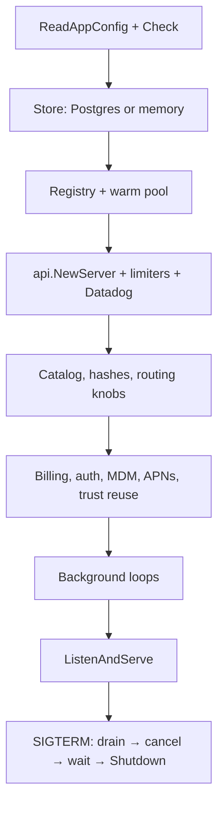

# Coordinator

> Last updated: 2026-09-14 · commit `d1a831900`

The coordinator is Darkbloom's control plane: one Go HTTP/WebSocket service
(binary `coordinator/cmd/coordinator`) that authenticates consumers, picks a
provider for each request, verifies provider attestations, keeps the ledger,
relays the request and its streamed response, and emits telemetry. Production
runs it in a GCP Confidential VM. It is a trust boundary, not a blind relay: it
holds the plaintext of a request in hardware-encrypted memory for the duration
of that request — decrypting a sender-sealed body, fetching remote media,
rendering prompt templates, then re-sealing hop-by-hop to the chosen provider —
and it must not log or persist prompt or response content. The privacy model is
in [`../security/encryption.md`](../security/encryption.md).

## Context

Providers are consumer-owned Macs behind NAT that dial out over WebSocket;
consumers speak the OpenAI-compatible HTTP API. Something has to sit in the
middle to know which machines are online, trusted and warm for a model, to
charge the right account, and to enforce fleet-wide policy. The coordinator is
that single process. Its registry of connected providers lives in memory and
is rebuilt from reconnects after every restart; everything else durable lives
in Postgres ([`../storage.md`](../storage.md)).

## Responsibilities

| Responsibility | What the coordinator does | Detail lives in |
|---|---|---|
| Authentication and accounts | Privy JWTs, API keys, the admin key, provider device-code login; per-key limits and roles. | [`../../reference/api-contracts.md`](../../reference/api-contracts.md), [`../security/identity-binding.md`](../security/identity-binding.md) |
| Routing and admission | Candidate selection, TTFT and decode-floor estimates, queueing, cold dispatch, warm-pool control, health ejection, cache-aware routing. | [`../routing.md`](../routing.md), [`../scheduling.md`](../scheduling.md), [`../cache-aware-routing.md`](../cache-aware-routing.md) |
| Attestation and trust | Secure Enclave challenges, MDM/MDA verification, APNs code-identity, trust reuse, release-policy evidence. | [`../security/attestation.md`](../security/attestation.md), [`../security/enrollment.md`](../security/enrollment.md) |
| Billing | Reservation, settlement, provider earnings, Stripe deposits and Connect payouts, referrals, base rewards. Prices and the platform fee are stated once in [`../billing.md#invariants`](../billing.md#invariants). | [`../billing.md`](../billing.md) |
| Relay | Decrypts sender-sealed bodies, inlines remote media, renders the prompt contract, seals per request to the provider's X25519 key, streams SSE back. | [`../data-flow.md`](../data-flow.md), [`../prompt-contract-sidecar.md`](../prompt-contract-sidecar.md) |
| Model registry and releases | Catalog, aliases, publishing, provider binary releases and known hashes. | [`../model-registry.md`](../model-registry.md), [`../../operations/release-policy-rollout.md`](../../operations/release-policy-rollout.md) |
| Telemetry | Route and rejection records, the system profiler, Datadog metrics and logs. | [`../telemetry.md`](../telemetry.md), [`../system-profiler.md`](../system-profiler.md) |
| Admin and operations | `/v1/admin/*`, invite codes, state export, MDM webhook, drain/readiness. | [`../../reference/api-contracts.md`](../../reference/api-contracts.md), [`../../operations/state-export.md`](../../operations/state-export.md) |

## Code map

Every directory under `coordinator/` and what it owns.

| Package | Owns |
|---|---|
| `coordinator/cmd/coordinator` | `main.go` (`main`): configuration, resource lifetimes and shutdown; named setup functions in subsystem files bind the owners before serving. |
| `coordinator/config` | `AppConfig` — composes every package's `ReadConfig` and runs their `Check` methods. |
| `coordinator/env` | `EnvPrefix` (`EIGENINFERENCE`) and the `EnvOr`/`EnvInt`/`EnvFloat`/`EnvBool` helpers. |
| `coordinator/api` | The HTTP router (`routes.go`, `routes`), global middleware (`http_middleware.go`, `Handler`), request logging (`http_logging.go`, `loggingMiddleware`), account/key rate limits (`request_rate_limits.go`, `rateLimitWithTier`), token limiter configuration (`token_admission.go`, `SetTokenLimiters`), consumer owner bindings (`inference_ingress.go`, `inferenceIngress`), the provider WebSocket upgrade (`provider.go`), inference-frame bindings (`provider_frames.go`), dispatch bindings (`inference_dispatch.go`), sender encryption, account, admin, release, billing and catalog dependency wiring, runtime catalog publication, drain, profiler wiring. |
| `coordinator/api/billing` | Billing, pricing, referrals, earnings, Stripe Connect and Global Payouts HTTP controllers and payout reconciliation (`Controller`); `billing_controller.go` in the parent API package binds shared services, store, cache, metrics and authorization. |
| `coordinator/api/catalog` | Model publishing, manifests, aliases, consumer/marketplace/install projections and cache invalidation (`Controller`); `catalog_controller.go` in the parent API package binds current store and credentials, fleet views, the shared cache and runtime publication callback. |
| `coordinator/api/accounts` | `Controller`: legacy/named API keys, key policy, device code/approval/token exchange and invites. Store operations remain behind narrow key/device/invite interfaces; the router supplies the existing auth cache and live store/console/admin bindings through `account_controller.go`. |
| `coordinator/api/httprequest` | `DecodeJSON` enforces the supplied request-body cap and preserves the common 400/413 envelope; `ControlPlaneBodyLimit` is 64 KiB. |
| `coordinator/api/requestauth` | Credential middleware, shared API-key cache (`Authenticator`) and linked-user identity resolution (`ResolveAccountID`, `RequirePrivyUser`); current configuration and accounting hooks bind through `coordinator/api/authentication.go`. |
| `coordinator/api/requestcontext` | Private context keys and typed account, API-key and request-ID access shared by middleware and endpoint packages (`WithAccountID`, `WithAPIKey`, `WithRequestID`); `coordinator/api/requestcontext/key_limits.go` projects key spending and token limits for dispatch. |
| `coordinator/api/statearchive` | Feature/auth/output gates and streaming HTTP response (`Controller.Download`); `coordinator/api/state_archive.go` (`newStateArchiveAPI`) binds current admin credentials/logger, while `stateexport` retains staging and encryption. |
| `coordinator/api/releases/controller.go` (`Controller`) | Release registration, metadata/origin/bundle verification, deactivation and cached discovery. `coordinator/api/releases.go` (`newReleaseAPI`) binds current store/cache/policy and existing authorization; `coordinator/api/admin_auth.go` (`isAdminAuthorized`) owns admin authorization. |
| `coordinator/api/operations` | Read-only operator telemetry queries, JSON/CSV/NDJSON exports, metrics and utilization (`Controller`); current store, authorization and observation readers are wired in `coordinator/api/operations.go` (`newOperations`). |
| `coordinator/api/httpresponse` | JSON response writing and the common OpenAI-compatible error envelope (`WriteJSON`, `ErrorBody`); `WriteCachedJSON` and `EncodeCachedJSON` preserve cached response encoding; `MarshalBody` preserves non-HTML-escaped inference-body encoding without a trailing newline; `StatusWriter` observes the first explicit status and delegates transport capabilities. |
| `coordinator/api/readcache` | Cached response bytes and immutable values, expiry, generation-fenced catalog fills and per-entry refresh coalescing (`Cache`, `Refresher`). Endpoint packages retain cache keys, TTLs and schedules. |
| `coordinator/api/network` | Public stats, independent request geography, bounded traffic series, earnings totals and pseudonymous leaderboards (`Controller`). Owns refresh flights and the shared totals query mutex; uses the router’s current store, fleet view and response cache through narrow dependencies. |
| `coordinator/api/accountfleet` | Account provider dashboard (`Controller`): live/persisted identity reconciliation, reputation batching, earnings summaries and offline-machine removal. Owns account earnings flights; the API supplies current store, fleet, cache, authenticated user and version policy. |
| `coordinator/inference/ingress` | Consumer request preparation, media, token quotas, balance and capacity admission (`Controller.ChatCompletions`, `Controller.Completions`, `Controller.Messages`); `coordinator/api/inference_ingress.go` (`inferenceIngress`) supplies current dependencies and shared lifecycle services. [Request stages and code map](consumer.md#the-request-pipeline) |
| `coordinator/inference/response` | Endpoint formatting and egress evidence in `coordinator/inference/response/writer.go` (`Writer`); channel arbitration in `coordinator/inference/response/provider_stream.go` (`relayProviderStream`); endpoint completion policy in `coordinator/inference/response/endpoint_stream.go` (`Writer.finishEndpointStream`). `coordinator/api/response_writer.go` (`responseWriter`) binds settlement, feedback, metrics and accepted-write owners. |
| `coordinator/inference/dispatch/request.go` (`Controller.Run`) | Provider preparation/encryption, plan consumption, queue handoff, first-content/hedge/failover and commit (`Controller.Run`); private per-request execution and per-controller scan/governor/EWMA state. API binds current services and observation sinks; see [dispatch ownership](../routing.md#dispatch-controller). |
| `coordinator/inference/attempt` | Cancellation tracking and delivery, terminal/rejection policy and provider-health feedback (`Tracker`, `Service`); API binds current services in `inference_attempt.go`, and response relays use the same feedback owner. |
| `coordinator/inference/settlement` | Reservation pricing, service holds, refunds, parked billing records and completion accounting (`Service`, `ServiceHolds`, `Holder`); `providerframe.Service` retains provider-terminal ownership and consumer-channel signaling; API binds the shared outcome observations. |
| `coordinator/inference/providerframe` | Accepted/chunk/complete/error handling (`Service`), private per-request shared-key memoization and the cumulative unknown-frame counter; calls the shared attempt and settlement owners. `coordinator/api/provider_frames.go` (`inferenceFrames`) binds current resources and observation callbacks. |
| `coordinator/inference/toolpolicy` | Tool-schema normalization, tool-choice and history validation (`NormalizeParsed`, `ValidateParsed`); HTTP error mapping and resolved-model compatibility remain in `coordinator/inference/ingress/tools.go`. |
| `coordinator/registry` | Shared `Registry` and `Provider` records; live fleet identity, heartbeat acceptance, evidence publication, routing and atomic reservation. `coordinator/registry/provider_registration.go` (`Register`), `coordinator/registry/provider_disconnect.go` (`disconnectProvider`), `coordinator/registry/provider_eviction.go` (`evictStale`), `coordinator/registry/heartbeat.go` (`Heartbeat`), `coordinator/registry/application_evidence.go` (`GrantApplicationEvidenceIfNotUntrusted`) and `coordinator/registry/application_policy.go` (`SetReleasePolicyGeneration`) retain the shared transactions; private subsystem state lives in the owners below. |
| `coordinator/registry/requestqueue` | Per-model FIFO, expiration, reservation handoff acknowledgment and drain-pass coalescing (`Queue`, `Assignment`, `DrainCoalescer`). |
| `coordinator/registry/admission` | Immutable capacity snapshots, pooled slot/KV accounting and measured cold-load budgets (`Policy`, `Snapshot`, `Pool`); live reservation locks stay in the registry. |
| `coordinator/registry/cachedirectory` | One private receipt/holder transaction lock, connection identity, sequence/rejection fences, indexed eviction, stage provenance and copied lifecycle status (`Directory`); provider callbacks and live locks stay in the registry. |
| `coordinator/registry/cacheattempt` | Per-request preparation, terminal closure, immutable queued-frame identity and atomic generation revocation (`State`, `Snapshot`, `Generation`); live provider validation remains in the registry. |
| `coordinator/registry/providerversion` | Exact dotted-version interpretation and bounded memo state shared by capability, slot-layout and memory-floor gates (`Policy`). |
| `coordinator/registry/throughput` | Observed throughput samples and medians, decode expectations and batch quality policy (`Observations`, `Policy`, `QualityConcurrency`). |
| `coordinator/registry/routingcost/policy.go` (`Policy`) | Shared startup latency tuning and private TTFT calibration joins/windows; `coordinator/registry/routingcost/snapshot.go` (`Snapshot`) carries the original provider values. `coordinator/registry/routing_policy.go` (`routingPolicy`) binds the one process-wide policy; live reservation and provider rechecks remain in the registry. |
| `coordinator/registry/dispatchplan/plan.go` (`Plan`), `coordinator/registry/dispatchplan/quotes.go` (`Probes`) | Private bounded alternates, quote ranking, attempted IDs and one-refresh claim; quote correlation, expiry and settlement-before-outcome publication. The registry retains exact provider identity, admission, heartbeat and transport bindings. |
| `coordinator/registry/modelloads` | Private session command deadlines/start times and fleet plan coalescing (`Commands`, `PlanGate`); live eligibility, provider publication and command I/O remain in the registry. |
| `coordinator/registry/warmpool` | Controller runner, coalesced triggers, private queue/pressure/observation state and target arithmetic (`Controller`, `State`, `Snapshot`, `Target`, `ServiceTime`); live fleet and command bindings stay in the registry. |
| `coordinator/registry/providerwriter` | Private two-lane WebSocket transport, dequeue acknowledgment, cancellation/completion arbitration, fragmentation and watchdog (`Writer`); registry `Provider` methods bind the current connection. |
| `coordinator/store` | Compatible constructors and type aliases; [persistence code map](../storage.md#code-map). |
| `coordinator/store/contracts` | Domain records and interfaces (`Store`, composed `BillingStore` and `ProviderStore`). |
| `coordinator/store/memory`, `coordinator/store/postgres` | Backend-owned locks, pool, transactions and domain operations; `postgres/schema` assembles ordered startup DDL. |
| `coordinator/store/cache` | Bounded user/model caches (`Store`, `Unwrap`) with domain invalidation and generation fences. |
| `coordinator/protocol/doc.go` | Wire records grouped by registration, heartbeat, inference, models, cache and attestation; `coordinator/protocol/provider_message.go` (`DecodeProviderMessage`) owns the envelope. [Protocol source map](../../reference/protocol-messages.md#source-files). |
| `coordinator/internal/e2e` | NaCl Box (X25519 + XSalsa20-Poly1305) for coordinator↔provider and sender↔coordinator sealing. |
| `coordinator/attestation` | Secure Enclave attestation verification and Apple MDA certificate chains. |
| `coordinator/apns` | APNs push attestor for code identity. |
| `coordinator/mdm/client.go` (`Client`) | MicroMDM transport and late-response hooks; `coordinator/mdm/security_info.go` (`VerifyProviderWithUDIDObserver`), `coordinator/mdm/device_attestation.go` (`RequestDeviceAttestation`) and `coordinator/mdm/webhook.go` (`HandleWebhook`) own the exchange. `coordinator/mdm/doc.go` maps commands, correlation, waiters and parsers. |
| `coordinator/auth` | Privy JWT verification. |
| `coordinator/providercontrol/session` | Connection-local frame dispatch, registration/capability publication, heartbeat and ordered teardown (`Session`); API adapters bind the existing verification, release-policy, scheduler and inference owners. |
| `coordinator/providercontrol/trustreuse` | Durable device-evidence cache, trust-reuse admission, journal authority/replay and continuity tracking (`Manager`); API adapters supply verified release facts and keep the ordered shutdown boundary. |
| `coordinator/providercontrol/challenge` | Per-connection nonce tracking, challenge transport, ordered signature/posture/integrity checks and success/failure transitions (`Session`, `Verifier`); API lifecycle and live policy/trust dependencies stay explicit. |
| `coordinator/providercontrol/mdmscheduler` | Durable MDM/MDA queue, claims, worker budget, connection generations and exact late-command ownership (`Scheduler`); API adapters keep live resources and trust-grant policy. |
| `coordinator/providercontrol/verification` | Signed registration, identity-scoped reconnect recovery, SecurityInfo outcomes and cached/fresh MDA checks (`Verifier`); each scheduled `Attempt` shares its observations with API callbacks. Connection publication belongs to `session`; scheduler claims belong to `mdmscheduler`. |
| `coordinator/providercontrol/codeidentity` | Per-device code-identity proof, APNs budget admission, encrypted resume, nonce verification and code continuity (`Manager`); the API supplies an immutable release-policy view and retains lifecycle ordering. |
| `coordinator/providercontrol/releasepolicy` | Private release generations, binary allowlist and runtime manifest (`Manager`); `Snapshot` supplies immutable code-identity and evidence decisions. Inventory recovery, challenge runtime policy and live fleet revalidation live here; `api/release_policy.go` supplies current dependencies. |
| `coordinator/profilesign` | CMS signing of the enrollment profile. |
| `coordinator/billing` | Billing service, Stripe Checkout and Connect, referrals. |
| `coordinator/payments` | Ledger and pricing. |
| `coordinator/ratelimit` | Per-account, financial and service-tier limiters; expected-output admission. |
| `coordinator/modelpolicy` | Exact-model first-content deadline policy. |
| `coordinator/mediafetch` | SSRF-guarded remote media resolution. |
| `coordinator/promptcontract` | Supervisor, client and artifact provisioner for the prompt-contract sidecar. |
| `coordinator/promptsidecar` | The Rust sidecar itself. |
| `coordinator/stateexport` | Snapshot, zip and age encryption for the admin state export. |
| `coordinator/datadog` | Metrics (HTTP API and DogStatsD), Logs API forwarding, trace handler. |
| `coordinator/telemetry` | Structured telemetry emitter. |
| `coordinator/telemetry/metrics` | In-process counters, histograms, computed gauges and JSON/Prometheus snapshots (`Registry`, `Histogram`, `Snapshot`). |
| `coordinator/telemetry/routequeue` | Bounded FIFO routing-telemetry persistence, grouping, failure handling and shutdown (`Sink`, `SubmitRoute`, `SubmitOutcome`, `CloseAndWait`). |
| `coordinator/telemetry/profiler` | Profiler configuration, allowlisted row construction and deterministic sampling; composes the profile queue (`ConfigFromEnv`, `Builder.Build`, `Profiler`). |
| `coordinator/telemetry/profilequeue` | Worker-side profile construction and batched persistence, private buffer/drop counters and signal-only close (`Sink`, `Submit`, `Close`). |
| `coordinator/telemetry/outcomequeue` | Independent unsampled outcome snapshot buffer, process counters and bounded close-time drain (`Sink`, `Submit`, `Stats`, `Close`). |
| `coordinator/saferun` | Panic-safe goroutine launcher used by every background loop. |
| `coordinator/deploy` | `start.sh` container entrypoint (persistent disk, MicroMDM). |

## Provider connection lifecycle

`coordinator/api/provider.go` (`handleProviderWS`) keeps the HTTP upgrade,
connection ID and read limit. Its adapter in `coordinator/api/provider_session.go`
(`providerReadLoop`, `providerSessionDependencies`) creates one
`Session` (`coordinator/providercontrol/session/session.go`) for that accepted socket. The session retains
the original provider pointer, challenge tracker and scheduler generation until
teardown; the registry and shared verification owners retain their own state.

| Concern | Owner |
|---|---|
| Frame decode, registration guards and dispatch | `coordinator/providercontrol/session/read.go` (`Session.Run`) |
| Registry publication, registration verification, account linkage, runtime policy and loop startup | `coordinator/providercontrol/session/registration.go` (`register`, `VerificationPriority`) |
| Accepted capacity snapshots and existing metric callbacks | `coordinator/providercontrol/session/heartbeat.go` (`heartbeat`, `ApplyHeartbeat`) |
| Cache receipt delivery and existing metric callbacks | `coordinator/providercontrol/session/cache_receipts.go` (`cacheLookup`, `cacheReady`, `cacheLookupV2`, `cacheReadyV2`) |
| Owned load replies and catalog-validated model updates | `coordinator/providercontrol/session/model_status.go` (`loadModelStatus`, `modelsUpdate`) |
| Read-failure classification, durable reason and teardown | `coordinator/providercontrol/session/disconnect.go` (`readFailed`, `closeSessionWithReason`, `disconnect`) |
| Current resources and typed inference callbacks | `coordinator/providercontrol/session/dependencies.go` (`Dependencies`, `InferenceFrames`); `coordinator/api/provider_session.go` (`providerSessionDependencies`) |

Accepted, chunk and error callbacks run in the read loop. Completion records its
ingress timestamp first, then invokes `providerframe.Service.CompleteAt` in a
panic-safe goroutine. `coordinator/api/provider_session.go` binds the four methods
of the shared frame service through `InferenceFrames`; see
[provider inference frames](#provider-inference-frames). The session retains no
second pending-request, accounting or cancellation state.

Teardown cancels the connection context, unbinds its exact scheduler key and
generation, clears code-resume state, stops device then code coverage, calls
`Registry.DisconnectWithReason`, and closes the socket, in that order
(`Session.Run`, `disconnect`). Before that deferred teardown, `readFailed` marks
a registered provider still in the registry offline (preserving untrusted status)
and attempts the specific durable close reason with a `3 * time.Second` timeout.
It skips both steps during coordinator shutdown; startup reconciliation owns
the existing restart reason.

Resource getters preserve current API store, registry, logger and policy reads.
The MDM scheduler keeps its separately configured startup claim store; Session
calls the existing release-policy manager instead of copying its inventory or
runtime manifest. Trust and routing gates are unchanged; see
[attestation](../security/attestation.md) and [scheduling](../scheduling.md).

## Provider inference frames

`coordinator/inference/providerframe/service.go` (`Service`, `New`) owns the
accepted/chunk/complete/error operations and their private chunk-key cache and
unknown-frame counter. `coordinator/api/provider_frames.go` (`inferenceFrames`)
binds one service to the Server. Registry, logger, cancellation, settlement,
profile and output-admission dependencies retain their current-resource reads;
request and provider pointers, reservation ownership and shared observation
sinks remain the same.

| Operation | Owner and ordering |
|---|---|
| Acceptance | `coordinator/inference/providerframe/accepted.go` (`Service.Accepted`): find the pending request, stamp acceptance, then notify its accepted channel without blocking. |
| Chunk ingress | `coordinator/inference/providerframe/chunk.go` (`Service.Chunk`), `coordinator/inference/providerframe/encryption.go` (`decryptTextResponseChunk`), `coordinator/inference/providerframe/chunk_buffer.go` (`sendChunkWithGrace`): validate and decrypt, apply first-content arbitration, then deliver through the existing bounded channel and overflow grace. |
| Successful terminal | `coordinator/inference/providerframe/complete.go` (`Service.CompleteAt`): claim the terminal and retain pending usage/profile evidence before deadline or race decisions; remove pending/parked ownership, validate cache usage and reconcile output admission, then call `settlement.Service.Complete`. Outcome observations remain between usage and waited credit operations; consumer channels are signaled after settlement returns. |
| Error terminal | `coordinator/inference/providerframe/error.go` (`Service.Error`, `errorOwned`): sanitize and classify, claim the terminal, apply the existing drain transition before releasing pending capacity, then refund, observe and signal according to the existing ownership gates. |
| Shared observations | `coordinator/api/cache_selection_telemetry.go` (`emitCacheSelectionTerminal`, `emitCacheSelectionTTFT`) and `coordinator/api/route_outcome.go` keep the same terminal arbitration and sinks for frame and consumer paths. |

The frame owner starts no workers and creates no second registry, cancellation
tracker, ledger or parked-record map. Its terminal profile completion stays
after the financial and consumer-channel operations. Accounting details are in
[billing](../billing.md#inference-accounting-ownership); key eviction and the
abandoned-request fallback are in [encryption](../security/encryption.md).

## Startup sequence

`main` (`coordinator/cmd/coordinator/main.go`) runs these steps in order; a
failure in any step marked *fatal* exits before the public HTTP listener starts.
The command stays one Go package. `main` retains context cancellation and the
store, warm-pool, API server, Datadog, sidecar and HTTP cleanup order; setup
functions below bind each subsystem without introducing another lifecycle owner.

1. **Logging.** JSON `slog`; a Datadog trace handler is layered on when
   `DD_API_KEY` or `DD_AGENT_HOST` is set.
2. **Configuration** (*fatal*). `config.ReadAppConfig` reads every package's
   environment, then `Check` rejects invalid combinations (no DSN without the
   memory-store opt-in, mock billing with a live Stripe key, malformed media
   fetch or cache-routing values, an unknown trust level). Every variable is
   listed in [`../../reference/configuration.md`](../../reference/configuration.md).
3. **Store** (*fatal*). Postgres when a DSN is set — connect, ping, run the
   idempotent migration slice, seed the admin key — otherwise the memory store
   with its 15 minute pruner. The store is wrapped by the configured read-through
   cache. Provider sessions orphaned by the previous process are closed,
   best-effort, with a 10 second budget (`coordinator/cmd/coordinator/storage.go`: `startMemoryStorePruner`,
   `withStoreCache`, `reconcileProviderSessions`).
4. **Registry.** `registry.New`, trust floor, dedicated models, quality
   concurrency cap, cache routing (*fatal* on an invalid mode or key), then the
   warm-pool controller starts (`coordinator/cmd/coordinator/registry.go`: `configureRegistry`).
5. **Server.** `api.NewServer` with the live TTFT deadline base, media fetch
   config and durable trust reuse; the prompt-sidecar provisioner if enabled;
   rate limiters (each with its own pruner); telemetry emitter; Datadog tracer
   and client (`coordinator/cmd/coordinator/serving.go`: `serverConfig`; `coordinator/cmd/coordinator/prompt_contract.go`: `configurePromptArtifacts`; `coordinator/cmd/coordinator/rate_limits.go`: `configureRateLimits`).
6. **Catalog and policy** (*fatal* for the release inventory). Model catalog
   sync, binary-hash and runtime-manifest sync from the store, then the
   routing knobs read directly from the environment (release policy mode,
   TTFT admission, reject list, decode floor, servability gate, prompt
   calibration), then the exact-model deadline overrides and optional pprof
   listener (`coordinator/cmd/coordinator/release_policy.go`: `configureReleasePolicy`,
   `configureRuntimeManifest`; `coordinator/cmd/coordinator/routing_admission.go`: `configureAdmission`;
   `coordinator/cmd/coordinator/routing_deadlines.go`: `configureModelDeadlines`; `coordinator/cmd/coordinator/profiling.go`: `configureProfiling`).
7. **Money and identity.** Ledger and billing service, base rewards, the
   sender-encryption key from the mnemonic, admin emails, Privy, MDM client
   and verification scheduler, profile signer, APNs attestor and the
   code-attestation cache, the trust-reuse cache (*fatal* if its revocation
   journal is unusable). `coordinator/cmd/coordinator/accounts.go` (`configureAccounts`) binds billing/auth;
   `coordinator/cmd/coordinator/provider_trust.go` (`configureProviderTrust`) binds MDM, profile signing and
   APNs, then seeds trust reuse.
8. **Background loops.** Provider eviction sweep (`StartEvictionLoop`, cadence and timeout in [scheduling.md](../scheduling.md#heartbeat-cadence-and-eviction)); DogStatsD gauge loop;
   profiler fleet sampler and retention sweep; read-cache janitor; throughput
   anomaly detector; base-rewards settlement (when enabled); Stripe payout
   reconciler (`coordinator/cmd/coordinator/background.go`: `startBackgroundLoops`). After constructing the
   public HTTP server, the prompt sidecar supervisor and preloader start
   (`coordinator/cmd/coordinator/prompt_contract.go`: `startPromptSidecar`).
9. **Listen.** `http.Server` on `:EIGENINFERENCE_PORT` with a 5 s header
   timeout, 10 s read timeout, no write timeout (SSE), 120 s idle timeout and
   a 64 KiB header cap (`coordinator/cmd/coordinator/serving.go`: `newHTTPServer`). The optional private
   pprof listener starts earlier in step 6.
10. **Shutdown.** On SIGINT/SIGTERM: mark draining (`/readyz` turns 503),
    cancel eviction, stop the sidecar, then wait up to
    `EIGENINFERENCE_DRAIN_GRACE` for in-flight requests,
    then `Shutdown` with a 15 s backstop; deferred closes stop Datadog and the
    Postgres pool (`coordinator/cmd/coordinator/main.go`: `main`).

The setup files below are all under `coordinator/cmd/coordinator/`:

| Setup | Source and entrypoints |
|---|---|
| Persistence and fleet setup | `coordinator/cmd/coordinator/storage.go` (`startMemoryStorePruner`, `withStoreCache`, `reconcileProviderSessions`); `coordinator/cmd/coordinator/registry.go` (`configureRegistry`) |
| HTTP configuration and rate limits | `coordinator/cmd/coordinator/serving.go` (`serverConfig`, `newHTTPServer`); `coordinator/cmd/coordinator/rate_limits.go` (`configureRateLimits`) |
| Release inventory and runtime policy | `coordinator/cmd/coordinator/release_policy.go` (`configureReleasePolicy`, `configureRuntimeManifest`) |
| Admission and model deadlines | `coordinator/cmd/coordinator/routing_admission.go` (`configureAdmission`); `coordinator/cmd/coordinator/routing_deadlines.go` (`configureModelDeadlines`, `validateTTFTDeadlineBaseMs`, `validateTTFTOccupancyAlpha`) |
| Billing, encryption and accounts | `coordinator/cmd/coordinator/accounts.go` (`configureAccounts`) |
| MDM, profile signing, APNs and trust reuse | `coordinator/cmd/coordinator/provider_trust.go` (`configureProviderTrust`, `loadAPNsAttestor`, `parseAPNsEnforceAfter`) |
| Profiling, sidecar and background loops | `coordinator/cmd/coordinator/profiling.go` (`configureProfiling`, `startPprofListener`); `coordinator/cmd/coordinator/prompt_contract.go` (`configurePromptArtifacts`, `startPromptSidecar`); `coordinator/cmd/coordinator/background.go` (`startBackgroundLoops`) |

The routes and public API shutdown methods share one `readiness.Controller`
(`coordinator/api/drain.go`, `readinessController`). It increments before checking
the drain flag or trust-safety latch, backs out rejected requests, and decrements
admitted requests when their handlers return. `/health` remains a liveness probe
while `/readyz` reports drain and trust-safety readiness.

## Invariants

1. **Plaintext lives only in memory, only for the request.** Bodies are
   decrypted inside the CVM, re-sealed per request to the provider's attested
   key, and never written to the store or logs; provider error strings are
   reduced to a closed vocabulary before logging
   (`coordinator/inference/ingress/chat.go`, `coordinator/inference/attempt/error_sanitize.go`,
   `coordinator/internal/e2e/e2e.go`).
2. **A misconfigured coordinator does not serve.** `AppConfig.Check` and the
   fatal startup steps above exit 1 before the public HTTP listener opens
   (`coordinator/config/app_config.go`, `coordinator/cmd/coordinator/main.go`).
3. **Every background loop is panic-safe.** Loops start through
   `saferun.Go`, which logs and recovers instead of taking the process down
   (`coordinator/saferun/saferun.go`).
4. **Only trusted, current providers receive traffic.** Routing passes
   through one chokepoint that checks trust level, version floor, health
   ejection and release-policy evidence (`coordinator/registry/attestation_policy.go`,
   `providerSupportsPrivateTextLocked`).
5. **Shutdown drains before it disconnects.** New requests get 429 with
   `Retry-After` while in-flight streams finish, bounded by the drain grace
   (`coordinator/api/readiness/gate.go`, `Controller.Gate`;
   `coordinator/api/readiness/shutdown.go`, `Controller.WaitForInflightZero`).

## Failure modes

| Symptom | Likely cause | Where to look |
|---|---|---|
| Process exits before binding the port | A `Check` failure, store connect/migration error, missing release inventory, or an unusable trust-reuse journal | The first `Error` log line; [`../storage.md#failure-modes`](../storage.md#failure-modes) |
| Fleet 429s for minutes after a deploy | Empty registry until providers reconnect and re-attest; release-policy enforcement bites only after its boot grace ([`EIGENINFERENCE_RELEASE_POLICY_ENFORCE_GRACE`](../../reference/configuration.md#release-policy-version-floor-and-binary-hashes)) | [`../../operations/release-policy-rollout.md`](../../operations/release-policy-rollout.md) |
| CPU saturation under retry storms | Routing scans per dispatch attempt; bounded by `EIGENINFERENCE_ROUTING_CONCURRENCY` | [`../scheduling.md`](../scheduling.md) |
| Streams cut during a restart | Drain grace shorter than the longest generation | `EIGENINFERENCE_DRAIN_GRACE` in [`../../reference/configuration.md`](../../reference/configuration.md) |
| Requests with remote images fail | Media fetch disabled or SSRF guard rejected the host | [`../data-flow.md`](../data-flow.md) |

## Configuration

Every environment variable, its default and where it is read:
[`../../reference/configuration.md`](../../reference/configuration.md). This
page deliberately carries no variable table.

## Deployment

Image build, the environment file, blue-green swap and rollback:
[`../../operations/coordinator-deploy.md`](../../operations/coordinator-deploy.md).
The dev VM: [`../../operations/dev-environment.md`](../../operations/dev-environment.md).

## Related

- [`../overview.md`](../overview.md) — where the coordinator sits between consumers and providers
- [`../data-flow.md`](../data-flow.md) — a request end to end
- [`../routing.md`](../routing.md), [`../scheduling.md`](../scheduling.md) — how a provider is chosen
- [`../security/encryption.md`](../security/encryption.md), [`../security/attestation.md`](../security/attestation.md), [`../security/enrollment.md`](../security/enrollment.md) — the trust boundary
- [`../billing.md`](../billing.md) — prices, fee, ledger
- [`../storage.md`](../storage.md) — what it persists
- [`../telemetry.md`](../telemetry.md) — what it emits
- [`../../reference/api-contracts.md`](../../reference/api-contracts.md), [`../../reference/protocol-messages.md`](../../reference/protocol-messages.md) — the HTTP and WebSocket surfaces
- [`provider.md`](provider.md) — the other end of the WebSocket
