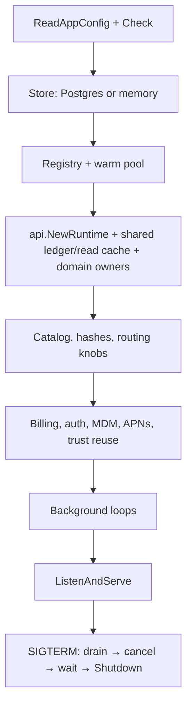

# Coordinator

> Last updated: 2026-10-04

The coordinator is Darkbloom's control plane: one Go HTTP/WebSocket service
(binary `coordinator/cmd/coordinator`) that authenticates consumers, picks a
provider for each request, verifies provider attestations, keeps the ledger,
relays the request and its streamed response, and emits telemetry. Production
runs it in a GCP Confidential VM. It is a trust boundary, not a blind relay: it
holds the plaintext of a request in hardware-encrypted memory for the duration
of that request — decrypting a sender-sealed body, fetching remote media,
rendering prompt templates, then re-sealing hop-by-hop to the chosen provider —
and it must not log or persist prompt or response content. The privacy model is
in [`../security/encryption.md`](../security/encryption.md).

## Context

Providers are consumer-owned Macs behind NAT that dial out over WebSocket;
consumers speak the OpenAI-compatible HTTP API. Something has to sit in the
middle to know which machines are online, trusted and warm for a model, to
charge the right account, and to enforce fleet-wide policy. The coordinator is
that single process. Its registry of connected providers lives in memory and
is rebuilt from reconnects after every restart; everything else durable lives
in Postgres ([`../storage.md`](../storage.md)).

## Responsibilities

| Responsibility | What the coordinator does | Detail lives in |
|---|---|---|
| Authentication and accounts | Privy JWTs, API keys, the admin key, provider device-code login; per-key limits and roles. | [`../../reference/api-contracts.md`](../../reference/api-contracts.md), [`../security/identity-binding.md`](../security/identity-binding.md) |
| Routing and admission | Candidate selection, TTFT and decode-floor estimates, queueing, cold dispatch, warm-pool control, health ejection, cache-aware routing. | [`../routing.md`](../routing.md), [`../scheduling.md`](../scheduling.md), [`../cache-aware-routing.md`](../cache-aware-routing.md) |
| Attestation and trust | Secure Enclave challenges, MDM/MDA verification, APNs code-identity, trust reuse, release-policy evidence. | [`../security/attestation.md`](../security/attestation.md), [`../security/enrollment.md`](../security/enrollment.md) |
| Billing | Reservation, settlement, provider earnings, Stripe deposits and Connect payouts, referrals, base rewards. Prices and the platform fee are stated once in [`../billing.md#invariants`](../billing.md#invariants). | [`../billing.md`](../billing.md) |
| Relay | Decrypts sender-sealed bodies, inlines remote media, renders the prompt contract, seals per request to the provider's X25519 key, streams SSE back. | [`../data-flow.md`](../data-flow.md), [`../prompt-contract-sidecar.md`](../prompt-contract-sidecar.md) |
| Model registry and releases | Catalog, aliases, publishing, provider binary releases and known hashes. | [`../model-registry.md`](../model-registry.md), [`../../operations/release-policy-rollout.md`](../../operations/release-policy-rollout.md) |
| Telemetry | Route and rejection records, the system profiler, Datadog metrics and logs. | [`../telemetry.md`](../telemetry.md), [`../system-profiler.md`](../system-profiler.md) |
| Admin and operations | `/v1/admin/*`, invite codes, state export, MDM webhook, drain/readiness. | [`../../reference/api-contracts.md`](../../reference/api-contracts.md), [`../../operations/state-export.md`](../../operations/state-export.md) |

## Code map

The application, transport and service owners under `coordinator/`:

| Package | Owns |
|---|---|
| `coordinator/cmd/coordinator` | Command selection, logging and configuration validation before entering the application. |
| `coordinator/app` | Service graph construction, backend selection, configuration, background-loop startup and ordered drain/shutdown. |
| `coordinator/config` | `AppConfig` — composes every package's `ReadConfig` and runs their `Check` methods. |
| `coordinator/env` | `EnvPrefix` (`EIGENINFERENCE`) and the `EnvOr`/`EnvInt`/`EnvFloat`/`EnvBool` helpers. |
| `coordinator/api` | Transport composition, route/auth binding and global middleware; domain owners hold their own mutable state. |
| `coordinator/api/access` | Credential policy/cache, principal context and rate middleware; key and device handlers live in child packages. |
| `coordinator/api/inference` | Shared admission, dispatch, cancellation and settlement; request lowering and response encoding are separate leaves. |
| `coordinator/api/provider` | WebSocket sessions and typed inference-event handoff; `provider/trust` owns legacy verification and revocation state. |
| `coordinator/api/catalog`, `coordinator/api/releases` | Ordered catalog publication and generation-fenced release policy, respectively. |
| `coordinator/api/accounts`, `coordinator/api/billing` | Account projections and billing HTTP; the payouts child owns provider payout workflows, not a second ledger. |
| `coordinator/api/reporting`, `coordinator/api/operations` | Public projections and operational liveness/readiness/drain handlers. |
| `coordinator/api/observation` | Metrics, request profiles, route records and compact outcomes; their queues and flush/loss policies remain distinct. |
| `coordinator/internal/api` | Production-consumed middleware, account projections, catalog validation and reporting calculations; HTTP binding stays with API owners. |
| `coordinator/internal/inference` | Cohesive request components: media preparation, provider-body sealing/memoization, first-content and scan/backoff policy, relay, non-streaming response limits, cancellation, promotions, monetary reservations, settlement and outcome recording. Each retains its own dependencies and private state; the inference owner coordinates them. |
| `coordinator/internal/provider` | Challenge verification, session/inventory/heartbeat components, identity budget/push/coverage, MDM scheduling, trust authority, reuse cache and revocation journal. Trust adapters bind these to live provider sessions. |
| `coordinator/internal/observation` | Independent route, profile and compact-outcome pipelines; queues, backpressure, flush cadence and shutdown remain pipeline-specific. |
| `coordinator/registry` | Live fleet state, atomic admission/reservation transitions, queues and controllers. Pure detached calculations live in `registry/admission` and `registry/selection`. |
| `coordinator/internal/registry` | Provider-write transport/lanes/watchdog, connection drain authority, immutable connection age/order, eviction grace, identity-gate directory and retained fault evidence, bounded demand windows, detached residency/capacity/forecast policies, reviewed deadline catalog/posture, Autopilot state/control/ledger, cache activation and persistence. Registry/provider critical sections remain authoritative; owned directory and identity-state locks are private to `identitygate`. |
| `coordinator/store` | Contracts, domain records, errors, configuration, read-through decorator and capability unwrapping. |
| `coordinator/store/memory`, `coordinator/store/postgres` | Backend owners with domain-focused operations; PostgreSQL owns its migrations. |
| `coordinator/internal/store` | Shared record normalization, read-cache domain generations, bounded memory history and focused PostgreSQL query/schema helpers; backends retain storage ownership. |
| `coordinator/protocol` | Wire types for the provider WebSocket: register, heartbeat, capacity, inference frames, telemetry, profiles. |
| `coordinator/internal/wire` | Production frame scanning/decoding used by protocol entrypoints; wire types stay in `coordinator/protocol`. |
| `coordinator/internal/e2e` | NaCl Box (X25519 + XSalsa20-Poly1305) for coordinator↔provider and sender↔coordinator sealing. |
| `coordinator/attestation` | Secure Enclave attestation verification and Apple MDA certificate chains. |
| `coordinator/apns` | APNs push attestor for code identity. |
| `coordinator/mdm` | MicroMDM client and verification scheduler. |
| `coordinator/auth` | Privy JWT verification. |
| `coordinator/profilesign` | CMS signing of the enrollment profile. |
| `coordinator/billing` | Billing service, Stripe Checkout and Connect, referrals. |
| `coordinator/payments` | Ledger and pricing. |
| `coordinator/ratelimit` | Per-account, financial and service-tier limiters; expected-output admission. |
| `coordinator/modelpolicy` | Exact-model first-content deadline policy. |
| `coordinator/mediafetch` | SSRF-guarded remote media resolution. |
| `coordinator/promptcontract` | Supervisor, client and artifact provisioner for the prompt-contract sidecar. |
| `coordinator/internal/promptcontract` | Contract identity, sidecar protocol, secure artifacts, catalog/preload, endpoint lowering and process utilities behind the public prompt-contract API. |
| `coordinator/internal/mediafetch` | Fetch policy, aggregate read-budget accounting and URL-reference grouping; the public resolver owns network fetches. |
| `coordinator/appattest`, `coordinator/appattest/service` | Apple proof verification and the App Attest session/service lifecycle, composed with focused `coordinator/internal/appattest` components. |
| `coordinator/internal/appattest` | Proof parsing and eligibility; immutable transcript binding; bounded input, exchange/evidence/storage pipelines; inventory and receipt work; recovery generations; qualification and authorization/identity controllers with a bounded notification outbox. `appattest/service` binds real stores, registry, release-policy callbacks and its constructor lifetime through `Dependencies` (`coordinator/appattest/service/service.go`, `New`, `Start`, `StartSession`), without exposing mutable session state. |
| `coordinator/promptsidecar` | The Rust sidecar itself. |
| `coordinator/stateexport` | Snapshot, zip and age encryption for the admin state export. |
| `coordinator/datadog` | Metrics (HTTP API and DogStatsD), Logs API forwarding, trace handler. |
| `coordinator/telemetry` | Structured telemetry emitter. |
| `coordinator/saferun` | Panic-safe goroutine launcher used by every background loop. |
| `coordinator/deploy` | `start.sh` container entrypoint (persistent disk, MicroMDM). |

All coordinator Go tests belong under `coordinator/tests/`, mirrored by production
owner. Public HTTP/WebSocket contracts use the composed router under
`coordinator/tests/api/<domain>/contracts/`; composition and global middleware
tests live under `coordinator/tests/api/`. Backend conformance lives under
`coordinator/tests/store/contracts/`, with backend-specific suites under
`coordinator/tests/store/memory/` and `coordinator/tests/store/postgres/`.
Shared testkit and disposable PostgreSQL fixtures live under
`coordinator/tests/internal/`; production packages never import them.
Moving an invariant test across a Go package boundary is not a reason to export
mutable implementation state: tests retain real collaborators or exercise a
cohesive production-consumed internal component. The
[test-boundary map](../../developer/test.md#2-coordinator-go) defines recursive
selectors, production coverage and database isolation.

## Startup sequence

`main` (`coordinator/cmd/coordinator/main.go`) validates the command/configuration
and enters `app.Run` (`coordinator/app/app.go`). They run these steps in order; a
failure in any step marked *fatal* exits the process before it listens.

1. **Logging.** JSON `slog`; a Datadog trace handler is layered on when
   `DD_API_KEY` or `DD_AGENT_HOST` is set.
2. **Configuration** (*fatal*). `config.ReadAppConfig` reads every package's
   environment, then `Check` rejects invalid combinations (no DSN without the
   memory-store opt-in, mock billing with a live Stripe key, malformed media
   fetch or cache-routing values, an unknown trust level). Every variable is
   listed in [`../../reference/configuration.md`](../../reference/configuration.md).
3. **Store** (*fatal*). Postgres when a DSN is set — connect, ping, run the
   idempotent migration slice, seed the admin key — otherwise the memory store
   with its 15 minute pruner. Provider sessions orphaned by the previous
   process are closed, best-effort, with a 10 second budget.
4. **Registry.** `registry.New`, trust floor, dedicated models, quality
   concurrency cap, cache routing (*fatal* on an invalid mode or key), then the
   warm-pool controller starts.
5. **Server.** `api.NewRuntime` with the live TTFT deadline base, media fetch
   config and durable trust reuse; the prompt-sidecar provisioner if enabled;
   rate limiters (each with its own pruner); telemetry emitter; Datadog tracer
   and client.
6. **Catalog and policy** (*fatal* for the release inventory). Model catalog
   sync, binary-hash and runtime-manifest sync from the store, then the
   routing knobs read directly from the environment (release policy mode,
   TTFT admission, reject list, decode floor, servability gate, prompt
   calibration, pprof listener).
7. **Money and identity.** Ledger and billing service, base rewards, the
   sender-encryption key from the mnemonic, admin emails, Privy, MDM client
   and verification scheduler, profile signer, APNs attestor and the
   code-attestation cache, the trust-reuse cache (*fatal* if its revocation
   journal is unusable).
8. **Background loops.** Provider eviction sweep (`StartEvictionLoop`, cadence and timeout in [scheduling.md](../scheduling.md#heartbeat-cadence-and-eviction)); DogStatsD gauge loop;
   profiler fleet sampler and retention sweep; read-cache janitor; throughput
   anomaly detector; base-rewards settlement (when enabled); Stripe payout
   reconciler; the prompt sidecar supervisor and preloader.
9. **Listen.** `http.Server` on `:EIGENINFERENCE_PORT` with a 5 s header
   timeout, 10 s read timeout, no write timeout (SSE), 120 s idle timeout and
   a 64 KiB header cap; an optional private pprof listener.
10. **Shutdown.** On SIGINT/SIGTERM: mark draining (`/readyz` turns 503 and
    providers are told to reconnect elsewhere), cancel the loops, stop the
    sidecar, wait up to `EIGENINFERENCE_DRAIN_GRACE` for in-flight requests,
    then `Shutdown` with a 15 s backstop; deferred closes stop Datadog and the
    Postgres pool.

The dependency direction is `cmd -> app -> api composition -> domain owners ->
focused internal components`.
HTTP owners depend on registry, store and accounting services; those services
never import HTTP owners. Store implementations import root store contracts,
not the reverse. Registry policies take detached values and return decisions;
the live registry retains locks and commit-time revalidation.

Application assembly creates the registry, store, ledger and read cache and passes
them in `api.RuntimeDependencies` (`coordinator/app/app.go`, `app.Run`;
`coordinator/api/server.go`, `NewRuntime`). `Runtime` retains the composed server
and its observation owner for startup configuration. `NewServer` is the convenience
constructor that creates the ledger/read cache before calling the same composition
path. `RuntimeDependencies` also accepts retained cancellation, late-settlement,
promotion and monetary-reservation components (`InferenceCancellation`,
`InferenceSettlement`, `InferencePromotions`, `InferenceReservations`), a scan gate
(`InferenceScanGate`), retry-backoff policy (`InferenceBackoff`) and shared-key
memo (`InferenceChunkKeys`). Omission creates owner-managed defaults, not a
second request lifecycle. `inference.New` (`coordinator/api/inference/owner.go`)
binds supplied promotion/reservation components to the owner's actual store,
ledger, observation and callbacks before serving; `Owner.SetBilling` forwards
later startup configuration to the retained reservation controller. The inference
owner retains terminal selection and usage-accounting authority.

`registry.NewWithDependencies` (`coordinator/registry/dependencies.go`) retains
the same registry-owned production components for identity gates, provider drains,
Autopilot state/control/demand/events and planning. Factories bind adapters to the
actual component on that registry rather than a copied state implementation.
For example, `identitygate.Directory` owns binding/index/state mutation while the
registry retains live-provider projection; `ModelLoadPreparation` holds the fleet
read lease and evaluates providers under their existing locks
(`coordinator/registry/model_load_preparation.go`). Autopilot ports bind real
snapshot/reservation/transport/store operations
(`coordinator/registry/autopilot_control.go`, `newAutopilotControl`). These boundaries
do not create independent admission, drain or command authority on the same session.

Reservation preparation retains the scan's registry read lease in
`PreparedReservation` (`coordinator/registry/reservation_preparation.go`). `Finish`
releases that lease and returns a `ReservationSelection`; its `Commit` enters the
existing lock-scoped revalidation and debit algorithm in
`coordinator/registry/scheduler.go` (`ReservationSelection.commit`). An abandoned
preparation must `Close`. Quote evidence stays separate from admission in the
embedded `QuotePlan` (`coordinator/registry/quote_plan.go`); its immutable
`CandidateBinding` never bypasses commit-time session checks.

Live membership has one `ProviderDirectory`
(`coordinator/registry/provider_directory.go`, `Load`, `Store`, `Delete`), bound
to `Registry.mu` at construction. Existing locked registry readers alias that
same map; membership operations alone do not perform teardown or publish model
state. Registration and disconnect retain their surrounding transactions.
`modelindex.Counts` (`coordinator/internal/registry/modelindex/counts.go`, `Add`,
`Remove`, `Count`) retains the separate live-advertisement counts under its leaf
lock, not a second catalog-filtered fleet projection.

Connection maintenance uses `ConnectionLifecycle`
(`coordinator/registry/connection_lifecycle.go`): teardown in
`connection_disconnect.go`, reversible trust transitions in `connection_trust.go`,
and stale scans in `provider_lifecycle.go`, all under the existing registry/provider
locks. The retained `eviction.Grace` component stages strikes during the read scan
and installs them under the registry write lock
(`coordinator/internal/registry/eviction/grace.go`, `Begin`, `ObserveStale`, `Commit`).
`Dependencies.ConnectionOrigin` supplies an immutable `connectiontime.Origin`
(`coordinator/internal/registry/connectiontime/origin.go`, `Age`, `NewerThan`), not a
second mutable connection timestamp. `ProviderPersistence`
(`coordinator/registry/provider_persistence.go`, `CanPublishLocked`) keeps incomplete
restoration unpublished and serializes durable snapshots. `ServiceReservations`
(`coordinator/registry/service_reservations.go`, `Add`, `ReleasePending`;
`coordinator/registry/whole_mac_service.go`, `HasHeadroom`) mutates the same provider's
pending service charges under its lock, separate from monetary reservations.

Cache component factories in `coordinator/registry/cache_dependencies.go`
(`CacheDependencies`) bind the actual tracker and registry. `CacheRestoration.Run`
(`coordinator/registry/cache_restoration.go`) restores persisted routing evidence;
`CacheMaintenance` (`coordinator/registry/cache_maintenance.go`) owns bounded binding
and invalidation; `CacheSnapshotUpdater.Apply`
(`coordinator/registry/cache_snapshot.go`) publishes capabilities while retaining
connection ownership. Deferred persistence work revalidates that connection through
`CacheSnapshotResult` (`coordinator/registry/cache_snapshot_result.go`). The detailed
evidence and generation fences are in [cache-aware routing](../cache-aware-routing.md).

Provider and consumer paths converge on that lifecycle. Component extraction
does not add another terminal claim or settlement owner. Shared resources are
passed as the same instances, and cross-owner callbacks are invoked after their
targets exist; startup setters update the owners used by the routes. Global
middleware remains ordered by `Server.Handler` (`coordinator/api/server_handler.go`)
and delegates to `coordinator/internal/api/middleware/middleware.go`.

Before first content, `Owner.NewFirstWaitFailure` constructs the request-bound
`FirstWaitFailure` (`coordinator/api/inference/first_wait_failure.go`, `Run`). It
releases a failed attempt through the same owner's effects, retains terminal
evidence and request identity for deferred accounting, and returns the retry
decision to `first_wait.go`; it does not create a second settlement owner.

```mermaid
flowchart TD
  A[ReadAppConfig + Check] --> B[Store: Postgres or memory]
  B --> C[Registry + warm pool]
  C --> D[api.NewRuntime + shared ledger/read cache + domain owners]
  D --> E[Catalog, hashes, routing knobs]
  E --> F[Billing, auth, MDM, APNs, trust reuse]
  F --> G[Background loops]
  G --> H[ListenAndServe]
  H --> I[SIGTERM: drain → cancel → wait → Shutdown]
```

## Invariants

1. **Plaintext lives only in memory, only for the request.** Bodies are
   decrypted inside the CVM, re-sealed per request to the provider's attested
   key, and never written to the store or logs; provider error strings are
   reduced to a closed vocabulary before logging
   (`coordinator/api/inference/consumer.go`, `coordinator/internal/inference/failure/inference_error_sanitize.go`,
   `coordinator/internal/e2e/e2e.go`).
2. **A misconfigured coordinator does not serve.** `AppConfig.Check` and the
   fatal startup steps above exit 1 before the listener opens
   (`coordinator/config/app_config.go`, `coordinator/cmd/coordinator/main.go`).
3. **Every background loop is panic-safe.** Loops start through
   `saferun.Go`, which logs and recovers instead of taking the process down
   (`coordinator/saferun/saferun.go`).
4. **Only trusted, current providers receive traffic.** Routing passes
   through one chokepoint that checks trust level, version floor, health
   ejection and release-policy evidence (`coordinator/registry/attestation_policy.go`,
   `providerSupportsPrivateTextLocked`).
5. **Shutdown drains before it disconnects.** New requests get 429 with
   `Retry-After` while in-flight streams finish, bounded by the drain grace
   (`coordinator/api/operations/drain.go`).

## Failure modes

| Symptom | Likely cause | Where to look |
|---|---|---|
| Process exits before binding the port | A `Check` failure, store connect/migration error, missing release inventory, or an unusable trust-reuse journal | The first `Error` log line; [`../storage.md#failure-modes`](../storage.md#failure-modes) |
| Fleet 429s for minutes after a deploy | Empty registry until providers reconnect and re-attest; release-policy enforcement bites only after its boot grace ([`EIGENINFERENCE_RELEASE_POLICY_ENFORCE_GRACE`](../../reference/configuration.md#release-policy-version-floor-and-binary-hashes)) | [`../../operations/release-policy-rollout.md`](../../operations/release-policy-rollout.md) |
| CPU saturation under retry storms | Routing scans per dispatch attempt; bounded by `EIGENINFERENCE_ROUTING_CONCURRENCY` | [`../scheduling.md`](../scheduling.md) |
| Streams cut during a restart | Drain grace shorter than the longest generation | `EIGENINFERENCE_DRAIN_GRACE` in [`../../reference/configuration.md`](../../reference/configuration.md) |
| Requests with remote images fail | Media fetch disabled or SSRF guard rejected the host | [`../data-flow.md`](../data-flow.md) |

## Configuration

Every environment variable, its default and where it is read:
[`../../reference/configuration.md`](../../reference/configuration.md). This
page deliberately carries no variable table.

## Deployment

Image build, the environment file, blue-green swap and rollback:
[`../../operations/coordinator-deploy.md`](../../operations/coordinator-deploy.md).
The dev VM: [`../../operations/dev-environment.md`](../../operations/dev-environment.md).

## Related

- [`../overview.md`](../overview.md) — where the coordinator sits between consumers and providers
- [`../data-flow.md`](../data-flow.md) — a request end to end
- [`../routing.md`](../routing.md), [`../scheduling.md`](../scheduling.md) — how a provider is chosen
- [`../security/encryption.md`](../security/encryption.md), [`../security/attestation.md`](../security/attestation.md), [`../security/enrollment.md`](../security/enrollment.md) — the trust boundary
- [`../billing.md`](../billing.md) — prices, fee, ledger
- [`../storage.md`](../storage.md) — what it persists
- [`../telemetry.md`](../telemetry.md) — what it emits
- [`../../reference/api-contracts.md`](../../reference/api-contracts.md), [`../../reference/protocol-messages.md`](../../reference/protocol-messages.md) — the HTTP and WebSocket surfaces
- [`provider.md`](provider.md) — the other end of the WebSocket
