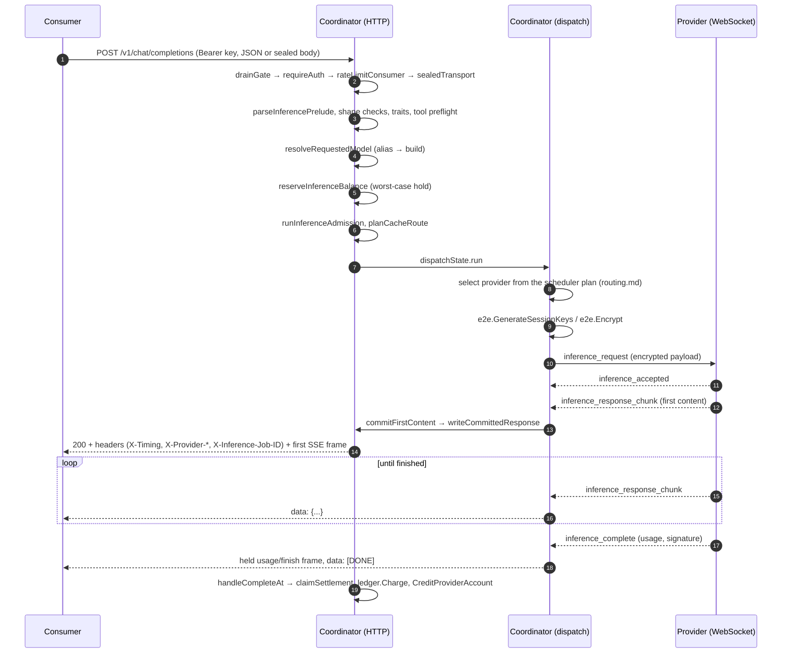

# Data flow: one request end to end

> Last updated: 2026-09-03 · commit `5d400cf75`

A consumer request travels consumer → coordinator → provider → coordinator → consumer. The coordinator never executes a model; it authenticates, admits, reserves funds, chooses a provider, encrypts the job, relays the provider's chunks, and settles. This page shows that journey once, as a sequence diagram and a stage table naming the code that owns each step. Provider selection and provider-side execution each get one row and a link — [`routing.md`](routing.md) and [`inference.md`](inference.md) hold the detail. Profiler stamps along the path are described in [`system-profiler.md`](system-profiler.md).

## Sequence

Two things the diagram makes visible. First, the consumer receives no bytes until step 14: every failure before the commit in step 13 is an ordinary HTTP error with a real status (a first-content deadline miss is a 429 with `Retry-After`), and the coordinator may have tried several providers in the meantime. Second, the provider never talks to the consumer; both legs terminate at the coordinator, which is what lets the coordinator hold the money, the identity, and the encryption boundary.

## Stages and owning code

| # | Stage | What happens | Owning symbol |
|---|---|---|---|
| 1 | Ingress | HTTP request hits the mux; `X-Request-ID` is honoured or minted; body ceiling 64 MiB | `loggingMiddleware`, `bodyLimitMiddleware` (`coordinator/api/server.go`) |
| 2 | Drain gate | While draining, new inference is refused with 429 `rate_limit_exceeded`, `Retry-After: 3` | `drainGate` (`coordinator/api/drain.go`) |
| 3 | Authenticate | Bearer resolved to an API key, Privy user, or admin; key lookups cached 60 s (`apiKeyCacheTTL`) | `requireAuth`, `extractBearerToken` (`coordinator/api/server.go`) |
| 4 | Rate limit | Per-key `rpm_limit`, then the account limiter; 429 with `Retry-After` | `rateLimitConsumer`, `applyKeyRPMLimit` (`coordinator/api/server.go`) |
| 5 | Unseal (optional) | `application/eigeninference-sealed+json` bodies are decrypted; the response will be sealed per event | `sealedTransport` (`coordinator/api/sender_encryption.go`); [`security/encryption.md`](security/encryption.md) |
| 6 | Parse and validate | 16 MiB inference cap, tool-schema normalisation, `model` required, key allow-list, `n == 1`, tool-choice and vision rules | `parseInferencePrelude` (`coordinator/api/inference_preprocess.go`), `validateToolConstraintPolicy` (`coordinator/api/tool_constraints.go`), `visionToolsFailFast` |
| 7 | Resolve model | Alias → concrete build; the response will still echo the alias | `resolveRequestedModel` (`coordinator/api/consumer.go`); [`model-registry.md`](model-registry.md) |
| 8 | Deadline and shedding | First-content deadline computed from the prompt size; rejecting models shed with 429 | `FirstContentDeadline`, `shedIfModelRejected` (`coordinator/api/consumer.go`) |
| 9 | Token-rate admission | Input/output tokens per minute | `applyTokenRateLimitWithAdmission` (`coordinator/api/server.go`) |
| 10 | Reserve funds | Worst-case cost held on the account ledger; 402 when it cannot be | `reserveInferenceBalance` (`coordinator/api/inference_admission.go`); [`billing.md`](billing.md) |
| 11 | Fetch media | Remote `image_url` parts fetched and inlined; billed as media | `resolveRemoteMedia` (`coordinator/api/media_resolve.go`) |
| 12 | Capacity admission | Is there an eligible provider that can accept this prompt now? 429/503/413 otherwise | `runInferenceAdmission` (`coordinator/api/inference_admission.go`) |
| 13 | Plan | Cache-aware route plan for the prompt prefix | `planCacheRoute` (`coordinator/api/prompt_artifacts.go`); [`cache-aware-routing.md`](cache-aware-routing.md) |
| 14 | **Select provider** | Lowest-estimated-cost candidate from the request-local plan, with bounded alternatives for failover | `dispatchPrimary` → `registry.Queue` (`coordinator/api/dispatch.go`); scoring in [`routing.md`](routing.md) |
| 15 | Encrypt | Fresh session keys; the job body is sealed to the provider's public key | `e2e.GenerateSessionKeys`, `e2e.Encrypt` (`coordinator/internal/e2e/e2e.go`), called from `dispatchPrimary` |
| 16 | Send | `inference_request` over the provider WebSocket | `coordinator/api/dispatch.go`, message types in `coordinator/protocol/messages.go` |
| 17 | **Provider executes** | Decrypts, loads or reuses the model, streams `inference_response_chunk`, ends with `inference_complete` or `inference_error` | [`inference.md`](inference.md), [`components/provider.md`](components/provider.md) |
| 18 | Wait for first content | Chunks buffered (`chunkBufferSize` = 256); a speculative backup may race; failover on error or deadline | `waitFirstChunk`, `runSpeculative`, `runRace`, `shouldStopFailover` (`coordinator/api/dispatch.go`) |
| 19 | Commit | Status, headers and the first frame are written; from here the status cannot change | `commitFirstContent`, `writeCommittedResponse` (`coordinator/api/dispatch.go`), `writeSSEResponseHeader` (`coordinator/api/sse_response.go`), `writeCommittedProviderHeaders` (`coordinator/api/response_metadata.go`) |
| 20 | Relay | Each chunk normalised and forwarded as one SSE event; usage/finish frames held to the end; single `[DONE]` | `handleStreamingResponseWithFirstChunk`, `normalizeSSEChunk`, `stripSSEDoneEvents` (`coordinator/api/consumer.go`) |
| 21 | Settle | Charge the account from provider-reported usage, record usage against the alias, credit the provider | `handleCompleteAt` → `claimSettlement`, `ledger.Charge`, `store.RecordUsageFullWithPublicModel`, `store.CreditProviderAccount` (`coordinator/api/provider.go`); [`billing.md`](billing.md) |
| 22 | Client gone | Disconnect before commit records 499 and sends `cancel` to the provider | `emitClientGone` (`coordinator/api/dispatch.go`), `sendProviderCancel` (`coordinator/api/consumer.go`) |

The platform fee applied at stage 21 is stated once, in [`billing.md#invariants`](billing.md#invariants).

## What the consumer can observe

- **Timing.** `X-Timing` is a JSON object of microsecond segments (`parse_us`, `reserve_us`, `media_fetch_us`, `route_us`, `queue_us`, `encrypt_us`, `dispatch_us`, `provider_us`, …) computed from the stamps taken at stages 6, 10, 11, 14, 16 and 19 (`requestTimingDetails`, `coordinator/api/response_metadata.go`). With metadata details enabled the same object appears as `metadata.timing`.
- **Provenance.** `X-Provider-*` headers and `metadata` name the provider, its attestation status and hardware; `se_signature` / `response_hash` in the body let the client verify the response — see [`../consumer/verification.md`](../consumer/verification.md).
- **Correlation.** `X-Request-ID` identifies the HTTP request; `X-Inference-Job-ID` identifies the coordinator job, which can differ across retries.

## Related pages

- [`components/consumer.md`](components/consumer.md) — why the pipeline is shaped this way, invariants and failure modes.
- [`../reference/api-contracts.md`](../reference/api-contracts.md) — routes, headers, JSON shapes, error table.
- [`routing.md`](routing.md), [`scheduling.md`](scheduling.md) — how stage 14 chooses.
- [`inference.md`](inference.md) — what the provider does in stage 17.
- [`security/encryption.md`](security/encryption.md) — the encryption boundaries at stages 5 and 15.
- [`system-profiler.md`](system-profiler.md) — profiler stamps and the admin export endpoints.
