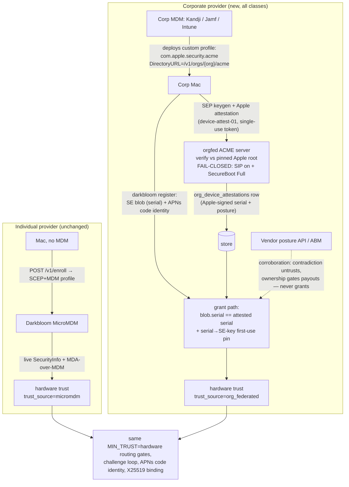

# Corporate fleets: federated hardware attestation without a second MDM

**Status:** Proposed (design; nothing in this document is implemented yet)

## Context

macOS allows **exactly one MDM enrollment per device**. There is no dual-enrollment,
no nesting, no side-channel: a Mac enrolled in Kandji, Jamf, Mosyle, or Intune can
never also enroll in Darkbloom's MicroMDM. The provider CLI already treats this as a
hard stop — `EnrollmentService.enroll` throws `managedByOtherMDM`
(`provider-swift/Sources/ProviderCore/Auth/Enrollment.swift`, detection in
`provider-swift/Sources/ProviderCore/Security/MDMEnrollment.swift`).

Today the *only* grant path for `hardware` trust is a live MicroMDM `SecurityInfo`
round-trip (`coordinator/api/provider.go` `verifyProviderViaMDM` →
`coordinator/mdm/mdm.go` `VerifyProvider`), and `MIN_TRUST=hardware` in prod. Net
effect: **every corporate-managed Mac on earth is structurally locked out of the
fleet**, which is exactly the hardware pool with the best uptime, the newest Apple
silicon, and idle nights/weekends.

Three classes of corporate fleet we want to admit:

| Class | Description | What we can rely on |
|---|---|---|
| **A — direct partners** | Companies we have a relationship with; willing to share information and integrate | Their cooperation + their MDM vendor |
| **B — arm's-length companies** | Companies we do *not* fully trust, but whose MDM vendor (Kandji, Jamf, …) is reputable | The MDM vendor's cloud, *not* the company's IT admins |
| **C — mega-fleets** | Google/Microsoft-scale orgs running their own MDM stack; will enforce policy themselves and will not hand us tenant credentials | Contract + whatever we can verify from outside |

The question this ADR answers: **how does a Mac we cannot MDM-enroll prove genuine
hardware and SIP/Secure-Boot posture to us, per class, without lowering the trust
bar?**

## What Apple actually allows (verified constraints)

These are the platform facts the design is built on, checked against current Apple
documentation (July 2026). Fact 4 is the one deliberate *assumption* — it is
documented by Apple but not yet confirmed by our own device fixture, and the design
is explicitly contingent on it (see §Verification plan).

| # | Fact | Consequence | Source |
|---|---|---|---|
| 1 | One MDM enrollment profile per device, period. | We can never be the MDM for a corporate Mac. | [Apple deployment guide][apple-enroll] |
| 2 | `SecurityInfo`, `DeviceInformation`/`DevicePropertiesAttestation`, and DDM status reports flow **only to the enrolled MDM server**. | Layers 2–3 of the current stack (`coordinator/mdm/`, `attestation/mda.go` via MicroMDM) are unreachable for corporate Macs. | [MDM protocol][apple-mda-deploy] |
| 3 | **ACME `device-attest-01` attestation does NOT require us to be the MDM.** The `com.apple.security.acme` payload can be delivered by *any* MDM as a custom profile, and the device attests **directly to whatever ACME server the payload's `DirectoryURL` points at**. macOS 14+, Apple silicon; `Attest=true` requires `HardwareBound=true` (`ECSECPrimeRandom` P-256/P-384). The payload spec also permits manual install, but our corporate targets are ABM/ADE-supervised machines; unsupervised/manual-install attestation behavior is not relied on and must be fixture-checked if ever wanted. | A corporate MDM can deliver *our* attestation payload. The Apple-signed evidence comes to *us*, bypassing the company's infrastructure entirely. | [ACMECertificate payload][apple-acme-payload], [MDA security guide][apple-mda-sec] |
| 4 | **(Assumption, fixture-gated.)** Per Apple's security guide, since macOS 14 the Apple-signed attestation leaf can carry — in addition to identity OIDs (serial `…100.8.9.1`, UDID `…9.2`, OS/SepOS/LLB `…10.*`, freshness `…11.1`) — **SIP status (`…100.8.13.1`), Secure Boot configuration (`…13.2`), and third-party-kext status (`…13.3`)**. The #511 postmortem note (`docs/provider-trust-reliability.md` §3) asserts the same OIDs for a future fail-closed leg; however, `enrollment.md`'s currently-documented MDA leaf list shows `…13.2` but not `…13.1`, so the presence and encoding of the SIP OID in real attestations **must be confirmed on a physical macOS 14+ device before anything relies on it**. If SIP turns out to be absent from ACME attestations, this design degrades to Apple-signed Secure-Boot-only posture (see Residual risk) and needs an explicit re-decision. | If confirmed: Apple — not the company, not the MDM vendor, not the device OS — signs the SIP + Secure Boot posture we gate on. `attestation/mda.go` already defines these OID constants (presence in real certs is exactly what the fixture check settles). | [MDA security guide][apple-mda-sec] (macOS 14 column) |
| 5 | Apple's attestation servers validate against the Secure Enclave manufacturing record (SIK → `scrt`/`ucrt`) and **refuse to attest VMs** or non-genuine hardware. | A corporate admin cannot farm trust from virtual machines. | [Attestation process security][apple-attest-proc], [VM analysis][khronokernel-vm] |
| 6 | Fresh attestations are **rate-limited (~7-day cache)** per device; the freshness code for ACME is `SHA-256(device-attest-01 token)` — it binds the attestation to *our challenge*, not to any key we can later observe. | Attestation is issuance-time evidence, not a live probe; and the SE-key binding used by today's MDA path (nonce = `SHA256(SE pubkey)`) is **not** expressible here. Both gaps get explicit handling below. | [DeviceInformation spec][apple-devinfo-yaml] |
| 7 | MDM vendors expose **read-only device posture APIs**: Jamf Pro `/api/v1/computers-inventory?section=SECURITY` (`sipStatus`, `secureBootLevel`, `externalBootLevel`, `gatekeeperStatus`, `firewallEnabled`, …) behind granular OAuth API roles; Kandji `GET /api/v1/devices/{id}/details` + Prism (FileVault, Startup Settings incl. SIP/SSV) behind scoped tokens; Intune Graph `macOSCompliancePolicy`/`managedDevice` behind `DeviceManagement*.Read.All`. | A company (or vendor) can grant us posture *read* access scoped to the provider device group. **Caveat: these fields are populated by vendor agents (`jamf recon`, Kandji agent) that run as root-tamperable binaries outside SIP-protected paths — vendor-API posture is corroboration, never an anchor, and provides no assurance at all against a root adversary.** | [Jamf inventory API][jamf-inv], [Kandji Prism][kandji-prism], [Intune Graph][intune-graph] |
| 8 | The **Apple Business Manager API** (OAuth, ES256 client assertion) exposes `/v1/orgDevices`, `/v1/mdmServers/{id}/relationships/devices`, `/v1/orgDevices/{id}/relationships/assignedServer`. | An org can prove — with credentials only the org controls — that a serial is org-owned and assigned to *their* MDM server. | [ABM API][abm-api] |
| 9 | Jamf (and peers) transmit **Shared Signals Framework / CAEP** `device-compliance-change` events today (Okta ITP is the flagship receiver). | A standards-track push channel exists for real-time compliance revocation once we want it; we can be an SSF receiver. | [Okta SSF][okta-ssf] |
| 10 | App Attest was **announced** for macOS 27 at WWDC26 — its keys are policy-bound to *full security mode + SIP* — but per current betas it is restricted to full apps in a user context; daemons and CLIs cannot use it. | Not usable as a leg today; tracked as a possible future replacement for the enrollment-time attestation, nothing more. | [WWDC26 session 201][wwdc26-appattest] |

**What is definitively impossible** (so nobody re-litigates it): being a second MDM;
querying another MDM's `SecurityInfo`; receiving DDM status reports from a foreign
enrollment; using User Enrollment as a side door (it omits serial/UDID from
attestations by design); App Attest from our daemon.

## Adversary model addition

Everything below is designed against a new adversary, to be added to
`docs/threat-model.yaml` at implementation time:

> **ADV-00x `malicious_org_admin`** — an IT administrator of a corporate fleet who
> controls: the corporate MDM tenant (can enroll arbitrary devices including VMs,
> deploy/withhold profiles, read vendor inventory), root on every fleet Mac, and the
> org's Darkbloom account. Wants to: earn on fake/insecure hardware, exfiltrate
> prompts, misbind posture of a secure machine to an insecure one, or farm rewards
> on capacity that isn't theirs. Cannot: break the Secure Enclave, forge Apple
> attestation signatures, bypass SIP on a machine where SIP is on, or receive APNs
> pushes for `io.darkbloom.provider` with a re-signed binary.

Class B is precisely "assume `malicious_org_admin`, trust the MDM vendor's cloud."
Class C is "assume competent-but-unverified org." The design below holds against
`malicious_org_admin` for **all** classes, which is what makes the classes collapse
into one cryptographic bar.

## Decision

**One cryptographic bar for every class.** The anchor — Apple-signed device
attestation — is identical for all orgs; class-specific corroboration (vendor APIs,
ABM, contract) can *tighten* outcomes (posture-contradiction untrust, payout
attribution) but never substitutes for the anchor. Trust and money are gated
separately: **Apple attestation gates trust; ownership corroboration gates payout
attribution** (D2/D4).

The single load-bearing new leg is an **org-blind, Apple-rooted device attestation**
obtained through a coordinator-hosted ACME `device-attest-01` server. Everything the
company or vendor touches is corroboration and operations, because (fact 7) anything
agent-collected is root-tamperable and `malicious_org_admin` has root.



### D1 — Federated device attestation leg (`orgfed` ACME)

The coordinator hosts a minimal ACME directory implementing only what
`com.apple.security.acmeclient` needs (RFC 8555 subset + [draft-ietf-acme-device-attest][acme-da]):

```text
GET  /v1/orgs/{org_token}/acme/directory
HEAD /v1/orgs/{org_token}/acme/new-nonce
POST /v1/orgs/{org_token}/acme/new-account | new-order
POST /v1/orgs/{org_token}/acme/authz/{id} | challenge/{id} | finalize/{id} | cert/{id}
```

Flow:

1. Org IT uploads a Darkbloom-generated `.mobileconfig` to their MDM (Kandji Library
   custom profile / Jamf config profile / Intune custom template) scoped to the Macs
   they want to monetize. The payload is a single `com.apple.security.acme`:
   `DirectoryURL = https://api.darkbloom.dev/v1/orgs/{org_token}/acme`,
   `Attest = true`, `HardwareBound = true`, `KeyType = ECSECPrimeRandom`,
   `KeySize = 384`, short-lived cert (~30 days). The issued cert is unused by
   anything — issuing it is a protocol necessity so `acmeclient` completes the
   profile install (and so a *failed* attestation surfaces as a failed install in
   the org's MDM console). The issuing key is therefore a throwaway-grade signer,
   but it still gets normal key management (KMS-held, rotatable) because its
   signatures appear in org MDM consoles.
2. On profile install, the device generates an SEP-bound key, obtains an
   **Apple-signed attestation certificate** whose freshness code is `SHA-256` of our
   `device-attest-01` challenge token, and presents it to our ACME server inside the
   WebAuthn `apple`-format attestation statement.
3. Our verifier: parse CBOR attestation object → extract `x5c` chain → verify
   against the **already-embedded Apple Enterprise Attestation Root CA**
   (`coordinator/attestation/mda.go`, same pinned root) → check the freshness code
   equals `SHA-256` of the token we issued for *this* order → **fail closed on
   posture**: refuse issuance unless SIP OID (`…13.1`) is affirmatively *enabled*
   and Secure Boot OID (`…13.2`) is affirmatively *Full*. Missing OID = refusal
   (Apple omits OIDs it cannot verify).
4. On success — and only then — persist an `org_device_attestations` row keyed by
   the **attested** serial: `{serial, udid, org_id, sip, secure_boot, os_version,
   sepos_version, cert_chain, order_token_hash, attested_at}`, and issue the
   certificate.

Later, when the `darkbloom` provider on that Mac connects and registers with its
SE-signed blob (unchanged Layer 1), the grant path requires
`blob.SerialNumber == org_device_attestations.serial` **and** enforces a
**serial→SE-key first-use pin**: the first successful org grant for a serial records
the provider's operational SE public key against it (`org_serial_key_pins`); every
later registration under that serial must present the *same* SE key or the grant is
refused (transient, surfaced to the org dashboard with an explicit
admin-initiated "reset device identity" path for legitimate re-images). The stored
Apple chain is re-verified against the pinned root at grant time.

**Binding honesty — this is weaker than the MDA path's key binding, and here is
exactly how.** Today's MDA leg binds Apple evidence to the operational SE key
cryptographically: the coordinator sets `DeviceAttestationNonce = SHA256(SE pubkey)`
and Apple echoes it in the FreshnessCode OID; `attachCachedMDAProof`
(`coordinator/api/provider.go`) *deliberately refuses* a serial-only match when
reusing a cached chain. That binding is **structurally unavailable** in the org
leg: at profile-install time the provider process (and its SE key) may not exist
yet, the ACME freshness code is fixed by spec to the challenge token, and the
ACME-generated hardware key lands in a restricted system keychain access group our
process cannot use (see `identity-binding.md` §"Why an ACME SE P-384 key was never
the signing/decryption endpoint"). So the join between Apple evidence and provider
identity is: **attested serial (Apple-signed, unforgeable) ↔ self-reported serial
(read by our APNs-code-attested genuine binary under SIP + Hardened Runtime) ↔
pinned SE key (first-use)**. The residual — a root admin coercing the *genuine*
binary to misreport its serial on first registration — is the same
Layer-1/Layer-5 residual already accepted for `ADV-001 malicious_provider` on the
public fleet; the pin prevents the cheaper ongoing attack (rotating machines or
keys behind one attested serial).

**Relationship to the leg removed in #511 (2026-07-03).** That leg (see
`docs/architecture/security/enrollment.md` §"ACME device-attest-01 (removed
2026-07-03)" and `docs/provider-trust-reliability.md` §3) died because verification
lived in never-wired nginx mTLS headers, it inspected the step-ca-issued leaf (which
carries no posture OIDs) instead of the Apple attestation certificate, the provider
never presented anything, and it ran a step-ca sidecar with persistent CA state.
This design keeps the two elements the postmortem prescribed — **in-band
verification at our own endpoint** (no ingress mTLS, no sidecar; evidence arrives at
profile-install time at an endpoint we own) and **fail-closed on the
`…100.8.13.*` posture OIDs of the Apple attestation certificate** — and knowingly
**diverges** from its third element, "short-lived / per-connection re-attested
certs": per-connection re-attestation is impossible without being the MDM, and
Apple caches attestations ~7 days regardless. The org leg is issuance-time
evidence with a bounded lifetime (`maxOrgAttestationAge`), and the Residual-risk
section prices that delta honestly instead of hiding it. State is rows in
Postgres, not a CA database. The only new dependency is a CBOR decoder (e.g.
`fxamacker/cbor/v2`) for the WebAuthn envelope.

Implementation notes that are load-bearing:

- **Strict OID decoding.** `parseBoolOID`'s permissive fallback (`mda.go`) is fine
  for today's informational use but NOT for a fail-closed gate: `…13.2` encodes a
  secure-boot *configuration* (Full/Reduced/Permissive), and a lenient
  "last-byte-nonzero" parse would accept `Reduced`. The orgfed verifier gets its own
  strict decoder: exact ASN.1 type match, exact value allowlist (`SIP == true`,
  `SecureBoot == Full`), decode failure = refusal. Validate encodings against a real
  macOS 14+ device before rollout and pin fixtures (§Verification plan).
- **`ClientIdentifier` is bookkeeping, not binding.** Binding is exclusively the
  *attested* serial. Where the vendor supports profile variables (Kandji
  `$SERIAL_NUMBER`, Jamf `$SERIALNUMBER`, Intune `{{serialnumber}}`-style tokens —
  the latter case-sensitive and unvalidated, so a typo silently yields the literal
  string) we set `ClientIdentifier` to the serial for nicer ACME order logs;
  nothing may depend on it.
- **Renewal.** `com.apple.security.acmeclient` doesn't renew — every (re)install is
  a fresh order/key/attestation. Orgs re-attest by redistributing the profile:
  API-triggered redistribution is the reliable mechanism on all three vendors
  (Kandji's built-in auto-redistribution checkbox is documented for its SCEP
  library item; whether it applies to custom profiles is a design-partner
  confirmation item). Coordinator policy: attestation rows expire after
  `maxOrgAttestationAge`; expired rows drop the provider to `self_signed` at next
  connection, and the org dashboard + `darkbloom doctor` say "redistribute the
  Darkbloom profile." **`maxOrgAttestationAge` is a security parameter, not an
  ergonomics knob** — it directly bounds the post-grant posture-drift window
  (Residual risk, row 1). Default **14 days**; Apple's ~7-day attestation cache
  (fact 6) means even weekly redistribution always yields a fresh attestation.
- **Anti-replay + state discipline.** `device-attest-01` tokens are per-order,
  high-entropy, single-use, short-TTL; the persisted row is bound to the exact
  order token (`order_token_hash`), so a captured attestation statement cannot be
  replayed to mint rows — including across orgs. ACME nonces are ephemeral with
  TTL; pending orders are capped per org; nothing is persisted until the Apple
  chain verifies (no pre-attestation storage growth).
- **Abuse control.** Per-org rate limits on ACME orders; org tokens are revocable
  (`org_enroll_tokens.revoked_at`); CBOR/ASN.1 parsing is fuzzed and runs only
  after a valid org token is presented (this is a new
  reachable-with-a-leaked-token parse surface, gate it accordingly).

### D2 — Org registry, delivery rails, account linkage, and payout gating

New first-class entity: **organization** (`organizations` table: id, name, class
`partner|standard|enterprise`, status incl. kill switch, `account_id` for payout
roll-up, connector + ABM config). Devices attach to orgs two ways:

- **Attestation-time:** the per-org `DirectoryURL` token binds every attestation row
  to the org that deployed the profile.
- **Runtime:** the corp MDM pushes a managed-preferences payload for
  `io.darkbloom.provider` containing `{coordinator_url, org_token}`; the CLI reads
  managed prefs and registers into the org's account (device-auth machine flow,
  `coordinator/api/device_auth.go`, unchanged wire — the org token resolves to the
  org's `account_id`). Zero-touch: MDM ships (1) the ACME profile, (2) the managed
  prefs, (3) the signed `darkbloom` pkg. Nobody logs in on 500 Macs.

**Org token leakage: no trust hole, but a real money hole unless payouts are
gated.** A leaked profile/token on a non-org Mac still has to pass Apple
attestation with SIP-on/SecureBoot-Full, so it can only add *genuine, secure*
capacity — trust holds. But payouts do not automatically follow: base rewards are
minted from a shared pool per online device (`coordinator/payments/baserewards/`,
`PeriodFloor`), so a leaked token would let stranger hardware draw floor rewards
into (and dilute the network on behalf of) the victim org's account. Therefore:
**a serial accrues payouts (base rewards and earnings roll-up) only when ownership
is corroborated** — the serial appears in the org's ABM device list (D4) or the
org's vendor-connector inventory (D3). Un-corroborated org serials may serve
traffic (the trust anchor is Apple's, not the org's) but accrue nothing and are
flagged on the org dashboard. Tokens stay revocable; revocation stops new
attestations and new account linkage immediately.

`registry.Provider` gains `OrgID` and `TrustSource` (`micromdm` | `org_federated`),
persisted on `providers`, surfaced (with the attestation chain, which is an
Apple-Enterprise-rooted chain exactly like today's MDA proof) in
`GET /v1/providers/attestation` so consumers can independently verify corporate
providers the same way they verify individuals. Fleet-vs-fleet transparency, not a
hidden second class.

Orgs choose exposure per device group: public fleet (earn) or `PrivateOnly`
(existing `registry.Provider.PrivateOnly` — org-internal capacity that serves only
the org's own traffic). That flag already exists and needs no new routing semantics.

### D3 — Vendor posture connectors (corroboration, drift detection, payout ownership — never grant)

`coordinator/orgfed/connector` interface with three implementations:

| Vendor | Pull | Auth | Fields used |
|---|---|---|---|
| Kandji | `GET /api/v1/devices`, `/devices/{id}/details`, Prism Startup Settings/FileVault | scoped API token, org-issued | SIP, SSV, FileVault, OS version |
| Jamf Pro | `GET /api/v1/computers-inventory?section=SECURITY&section=OPERATING_SYSTEM` | OAuth API client, `Read Computers` role only | `sipStatus`, `secureBootLevel`, `externalBootLevel`, `firewallEnabled`, `recoveryLockEnabled`, OS |
| Intune | Graph `managedDevices` + compliance state | Entra app, `DeviceManagementManagedDevices.Read.All` | compliance, encryption, OS |

Be clear about what a connector is for. Against `malicious_org_admin` it provides
**zero assurance** — the admin has root on the reporting agent and can forge or
decline it. Its real value: (a) **benign-drift detection** for the honest 99% (a
Mac that genuinely fell out of posture gets caught within a poll interval instead
of at attestation expiry), (b) **ownership corroboration for payout gating** (D2),
and (c) org-facing fleet dashboards. Rules:

- Native inventory fields only — **never extension attributes** (org-writable via
  API, trivially forgeable).
- Snapshots land in `org_posture_snapshots` keyed `(org_id, serial)`; poll ~30 min.
- **Connector state never gates the hardware grant.** Absence or staleness of a
  snapshot blocks nothing (Class C typically has no connector at all). Making a
  root-forgeable, optional signal a grant precondition would add a forge-to-deny
  churn vector while adding no assurance.
- A *received* snapshot that contradicts good posture (`SIP off`,
  `secureBootLevel != "full"`) **is** acted on: posture mismatch →
  `MarkUntrusted`, mirroring the received-`SecurityInfo`-mismatch semantics of
  `mdm.Client.VerifyProvider` (transient fetch failures never downgrade — the same
  transient-vs-terminal split as `verifyProviderViaMDM`). This is credible
  negative evidence: an org admin can only use it to deny *their own* devices.
- Connectors are per-org config, encrypted at rest.
- Future (Phase 3): accept SSF/CAEP `device-compliance-change` events (fact 9) as a
  push-based revocation channel from vendors we partner with directly — this is the
  "trust Kandji, not the company" endgame: vendor-signed signals, no org-scoped
  tenant tokens at all.

### D4 — Org ownership corroboration (ABM)

For orgs that grant it (expected: Class A voluntarily, Class C contractually), a
read-only ABM API credential lets the coordinator verify per serial: device ∈ org's
ABM **and** `assignedServer` = the org's declared MDM (fact 8). This is the
strongest ownership proof (credentials only the org controls), it kills
leaked-profile payout leakage (D2), and it proves "this really is Google's Mac,
managed by Google's MDM" without any tenant access to the MDM itself. Stored as
periodic snapshots. Absence of ABM affects payout gating and the org's *class* —
never the device's trust anchor.

### D5 — Trust computation (the bar does not move)

`hardware` trust for an org device requires **all** of:

1. Valid SE-signed attestation blob + X25519 binding (Layer 1 — unchanged,
   `coordinator/attestation/attestation.go`).
2. Unexpired `org_device_attestations` row (age ≤ `maxOrgAttestationAge`) whose
   Apple-signed serial matches the blob serial, `SIP=on`, `SecureBoot=Full`, chain
   re-verified against the pinned Apple root at grant time.
3. Serial→SE-key pin satisfied: first grant pins the SE key; later grants require
   the same key (reset only via explicit org-admin action).
4. Org active (kill switch clear), token unrevoked.
5. No un-refuted contradicting posture evidence (a received connector snapshot or
   any other received evidence showing bad posture has untrusted the provider —
   D3; absence/staleness of such evidence blocks nothing).
6. Everything the public fleet already requires, unchanged: APNs code identity,
   5-minute SE challenge loop with `ChallengeVerifiedSIP`, X25519 key presence,
   runtime manifest — i.e. the full `providerSupportsPrivateTextLocked` +
   `providerLivenessGateLocked` gate set (`coordinator/registry/registry.go`,
   `coordinator/registry/routing_eligibility.go`).

`MIN_TRUST` stays `hardware`. No new trust level, no relaxation for partners — a
Class A partner gets faster onboarding and richer dashboards, not a weaker gate.
Grant plumbing reuses `GrantHardwareIfNotUntrusted` and the same
transient/terminal outcome discipline as `verifyProviderViaMDM`; the org path slots
in as an alternative evidence source inside `mdmVerificationLoop` (checked first by
serial→org membership, so corporate devices never burn MicroMDM/APNs lookups that
can only return `device-not-found`).

Restore semantics mirror today's: reconnect caps at `self_signed`
(`coordinator/registry/persistence.go`) and hardware is re-earned from stored
evidence per-connection.

### Class → mechanism map

| | A — partner | B — arm's-length | C — mega-fleet |
|---|---|---|---|
| Apple attestation leg (D1) + key pin | **required** | **required** | **required** |
| Delivery rail | their MDM, we assist | their MDM, self-serve docs | their MDM/tooling, contractual |
| Vendor connector (D3) | yes (org-scoped creds) | yes — org-scoped creds now; vendor-direct/SSF when partnered | usually no |
| ABM ownership (D4) | encouraged | optional | **contractual** |
| Payout attribution requires (D2) | connector or ABM lists serial | connector or ABM lists serial | ABM lists serial |
| Compliance assertion | n/a | n/a | signed periodic assertion (SOC2-style) + audit rights |
| Extra monitoring | standard | standard | fleet-drift alerting on challenge-loop vs attested posture; org kill switch rehearsed |

The user-visible answer per class: **A** shares posture through vendor APIs and gets
white-glove onboarding; **B** we *don't* trust — Apple's signature carries the
posture, Kandji's cloud corroborates it and anchors payout ownership, and the org's
admins can't forge either; **C** we never verify "their MDM runs correctly" for
security at all — each device proves itself to Apple directly through our profile,
their MDM is merely the delivery rail, and ABM + contract cover ownership and
operations.

## Residual risk (honest accounting)

| Risk | Org path | Current MicroMDM path | Verdict |
|---|---|---|---|
| SIP disabled *after* grant | Reconnect re-grants from the stored row for up to `maxOrgAttestationAge` — the coordinator cannot force re-attestation (it is not the MDM), and the fresher legs don't save it against root: connector posture is agent-forgeable (fact 7) and `ChallengeVerifiedSIP` is self-report the SE will happily sign for a tampered process. **The drift window is calendar-bounded by `maxOrgAttestationAge` (default 14d), not reconnection-bounded.** | Reconnect re-runs a **live** `SecurityInfo` probe. Against root-after-SIP-off it is not tamper-*proof* (`mdmclient` and its channel are patchable once SIP is off — and on Apple silicon disabling SIP itself requires dropping Secure Boot below Full), but it forces active, per-connection forgery rather than mere reconnection. | **Org path is strictly weaker post-grant; the gap is priced by `maxOrgAttestationAge`.** Mitigations: 14-day default (7-day floor per Apple's cache), org-level fleet-drift alerting, connector contradiction untrust. Not claimed as parity. |
| Posture freshness at benign grant | Attestation ≤14d + challenge-loop live self-report | `SecurityInfo` live at connection | MicroMDM fresher; acceptable, bounded delta. |
| Fake device farm (VMs) | Apple refuses VM attestation (fact 5) | Same (MDA) | Parity |
| Org admin misbinds serials / rotates keys behind a serial | First registration: needs the genuine (APNs-attested) binary to misreport its serial under SIP — the accepted `ADV-001`-class residual. Ongoing: blocked by the serial→SE-key pin (D1/D5.3). | Serial cross-check + MDA FreshnessCode = `SHA256(SE pubkey)` binding (`attachCachedMDAProof` refuses serial-only reuse) | Org path lacks the cryptographic key binding (structurally unavailable, fact 6); the pin narrows the gap to first-registration only. Stated, not hidden. |
| Leaked org token | Trust: unaffected (Apple attestation still required). Money: blocked by ownership-gated payouts (D2) | n/a | Contained by design; without payout gating this would be a real base-rewards drain — hence D2 makes gating mandatory, not optional. |
| Evidence-source outage | Our ACME endpoint (our SLO); connector outages block nothing (D3) | Apple APNs push budget (the failure mode that stranded ~11% of the fleet, `docs/provider-trust-reliability.md` §1) | Org path more reliable in the grant loop: no APNs push involved. |
| New parse surface | CBOR/WebAuthn/ASN.1 behind org tokens; single-use order tokens (no replay, incl. cross-org); no pre-attestation persistence; fuzzed; per-org rate limits | n/a | New, bounded. |
| Fact-4 assumption fails (no SIP OID in real ACME attestations) | Design degrades to Apple-signed Secure-Boot-only posture + (root-forgeable) self-report/connector SIP | n/a | Explicit contingency: fixture check is a Phase-1 entry gate; if SIP is absent, this ADR must be re-decided, not silently weakened. |

## Code change inventory

| Area | Change |
|---|---|
| `coordinator/orgfed/` (new pkg) | `acme.go` (RFC 8555 subset + device-attest-01, single-use tokens, nonce TTLs, per-org order caps), `attest_verify.go` (CBOR → x5c → pinned-root verify → strict posture OIDs; reuses `attestation` pkg root + OID constants), `orgs.go` (org/token CRUD), `connector/` (`kandji.go`, `jamf.go`, `intune.go`, `abm.go`), `grant.go` (evidence evaluation incl. serial→SE-key pin → outcome enum mirroring `mdmVerifyOutcome`) |
| `coordinator/attestation/` | export strict OID decoders alongside the permissive legacy ones; no behavior change to existing MDA path |
| `coordinator/api/` | route wiring for `/v1/orgs/{org_token}/acme/*` + org admin endpoints; `mdmVerificationLoop` branches to the org evidence path when serial ∈ org fleet; `/v1/providers/attestation` gains `trust_source` + org attestation chain |
| `coordinator/store/` | `organizations`, `org_enroll_tokens`, `org_device_attestations` (incl. `order_token_hash`), `org_serial_key_pins`, `org_posture_snapshots`, `org_connectors`; `providers` + `org_id`, `trust_source` (memory + postgres impls, both tested) |
| `coordinator/payments/` | payout/base-rewards eligibility hook: org serials accrue only when ownership-corroborated (D2) |
| `coordinator/config/`, `env/` | `EIGENINFERENCE_ORGFED_*` (enable flag, `maxOrgAttestationAge`, connector poll interval) |
| `provider-swift` | `Enrollment.swift`: foreign-MDM + org managed-pref present → corp path status instead of `managedByOtherMDM` hard error; managed-preferences reader (`CFPreferences` for `io.darkbloom.provider`); `doctor` section querying org enrollment status |
| `console-ui` / `admin-ui` | org fleet dashboard (attestation freshness, posture, payout-corroboration state, pin resets); admin org CRUD |
| `docs/` | promote this ADR's mechanics into `architecture/security/` as implemented docs; threat-model entries (`malicious_org_admin`, ACME parse surface, leaked org token, stale attestation, pin reset abuse) |

## Phasing

1. **Phase 0 — settle fact 4 (entry gate):** capture a real macOS 14+ ACME
   attestation on a corporate-style (supervised) Mac; confirm presence + encoding of
   `…13.1`/`…13.2` and pin fixtures. If SIP is absent, stop and re-decide.
2. **Phase 1 — the anchor (unlocks all three classes):** `orgfed` ACME server +
   verifier + org registry + serial→SE-key pin + grant path + payout gating +
   provider CLI corp UX + transparency surfacing. Ship behind
   `EIGENINFERENCE_ORGFED_ENABLED`, onboard one design-partner org (Class A behaves
   like Class B cryptographically, so the partner exercises the real path).
3. **Phase 2 — corroboration:** Kandji connector first (design partner), then Jamf,
   Intune, ABM. Drift-untrust + payout gating per D2/D3/D4.
4. **Phase 3 — scale ops:** SSF/CAEP receiver for vendor-direct signals, org
   dashboards, Class-C compliance-assertion tooling, fleet-drift alerting
   (Datadog `orgfed.*` metrics mirroring `mdm.verification` outcome tags).

## Verification plan

- **Fixtures first (Phase 0 gate):** capture a real macOS 14+ ACME attestation
  exchange and pin the CBOR envelope + cert chain + OID encodings as test fixtures;
  unit-test the strict decoders against them, including the `Reduced`/`Permissive`
  secure-boot encodings that MUST refuse, and settle the fact-4 SIP-OID question.
- **Chain tests** reuse the `OverrideRootCAForTest` pattern
  (`coordinator/attestation/mda.go`) to exercise verify/refuse paths with a
  test-controlled root.
- **HTTP-path tests** drive the ACME endpoints through `httptest.NewServer` with a
  simulated `acmeclient` (order → challenge → attestation → finalize): posture-pass,
  posture-fail (profile-install-fails behavior), token replay (must refuse),
  cross-org replay (must refuse), and pending-order caps.
- **Grant tests:** serial match, pin first-use, pin mismatch (refuse + reason),
  expired row → `self_signed`, connector-contradiction → untrust, connector
  absence/staleness → no effect.
- **E2E:** extend `e2e/testbed` with an "org provider" mode: coordinator with orgfed
  enabled + fixture attestation row + provider registering with matching serial →
  asserts `hardware` grant via `trust_source=org_federated` and full request flow.
- **Real-device checklist before GA:** one Kandji-managed and one Jamf-managed Mac
  installing the profile end-to-end; confirm OID encodings, freshness binding,
  redistribution renewal (incl. whether Kandji auto-redistribution covers custom
  profiles), and that a SIP-off machine's profile install *fails* in the MDM
  console.
- Fuzz the CBOR/ASN.1 surface (native Go fuzzing) before exposing the endpoint.

## Open questions

1. **Payout split / pricing for org fleets** — org account roll-up exists via
   `account_id`, but revenue-share terms per class are a business decision.
2. **Fleet-scale admission** — 500 Macs appearing at once interacts with warm-pool
   targets and base rewards (`coordinator/payments/baserewards/`); needs a capacity
   ramp policy on top of the D2 payout gating.
3. **`maxOrgAttestationAge` operations** — 14 days default (7-day floor per Apple's
   attestation cache); confirm redistribution ergonomics per vendor with the design
   partner. Tightening it is a pure security win if orgs tolerate the churn.
4. **Pin-reset abuse** — the org-admin "reset device identity" path (legitimate
   re-images) weakens the pin if it becomes routine; decide rate limits/telemetry
   for resets.
5. **Vendor partnerships** — pursue Kandji/Jamf marketplace listings so Class B orgs
   get a one-click "Darkbloom" library item instead of a pasted custom profile
   (also the on-ramp to vendor-signed SSF signals).

## References

Code: `coordinator/attestation/mda.go`, `coordinator/attestation/attestation.go`,
`coordinator/mdm/mdm.go`, `coordinator/api/provider.go` (`verifyProviderViaMDM`,
`mdmVerificationLoop`, `verifyAppleDeviceAttestation`, `attachCachedMDAProof`),
`coordinator/api/enroll.go`, `coordinator/registry/registry.go` (trust levels,
`providerSupportsPrivateTextLocked`), `coordinator/registry/routing_eligibility.go`,
`coordinator/registry/persistence.go`, `coordinator/payments/baserewards/`,
`provider-swift/Sources/ProviderCore/Auth/Enrollment.swift`,
`provider-swift/Sources/ProviderCore/Security/MDMEnrollment.swift`.

Docs: [attestation](../security/attestation.md) ·
[enrollment](../security/enrollment.md) ·
[identity binding](../security/identity-binding.md) ·
[APNs code attestation ADR](./apns-code-attestation.md) ·
[trust reliability](../../provider-trust-reliability.md).

[apple-enroll]: https://support.apple.com/guide/deployment/intro-to-device-management-profiles-depc0aadd3fe/web
[apple-mda-sec]: https://support.apple.com/guide/security/sec8a37b4cb2/web
[apple-mda-deploy]: https://support.apple.com/guide/deployment/dep54e5ac1fd/web
[apple-acme-payload]: https://developer.apple.com/documentation/devicemanagement/acmecertificate
[apple-attest-proc]: https://support.apple.com/guide/security/sec97eb9e2f2/web
[apple-devinfo-yaml]: https://github.com/apple/device-management/blob/release/mdm/commands/information.device.yaml
[acme-da]: https://datatracker.ietf.org/doc/draft-ietf-acme-device-attest/
[khronokernel-vm]: https://khronokernel.com/macos/2023/08/18/AS-VM-SERIAL.html
[jamf-inv]: https://developer.jamf.com/jamf-pro/reference/get_v1-computers-inventory
[kandji-prism]: https://support.kandji.io/kb/prism
[intune-graph]: https://learn.microsoft.com/en-us/graph/api/resources/intune-deviceconfig-macoscompliancepolicy
[abm-api]: https://support.apple.com/guide/business/axm33189f66a/web
[okta-ssf]: https://help.okta.com/oie/en-us/content/topics/itp/shared-signals.htm
[wwdc26-appattest]: https://developer.apple.com/videos/play/wwdc2026/201/
