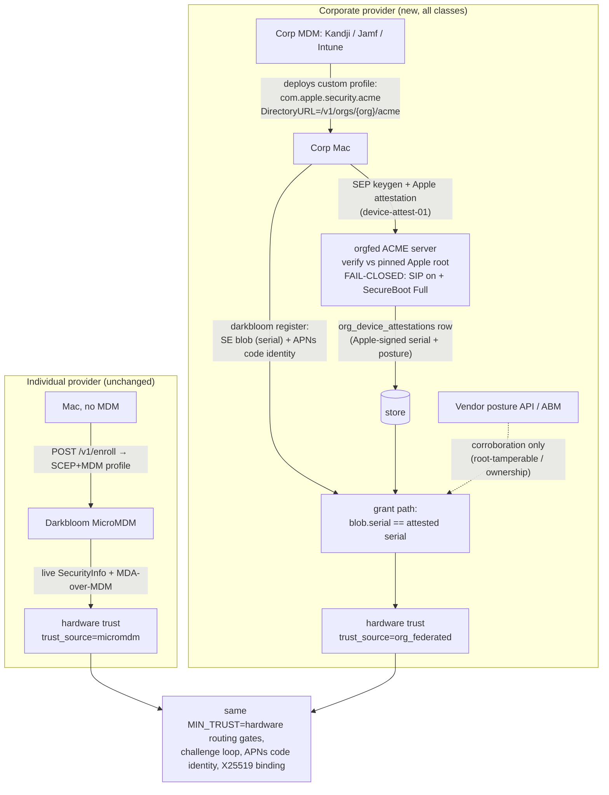

# Corporate fleets: federated hardware attestation without a second MDM

**Status:** Proposed (design; nothing in this document is implemented yet)

## Context

macOS allows **exactly one MDM enrollment per device**. There is no dual-enrollment,
no nesting, no side-channel: a Mac enrolled in Kandji, Jamf, Mosyle, or Intune can
never also enroll in Darkbloom's MicroMDM. The provider CLI already treats this as a
hard stop — `EnrollmentService.enroll` throws `managedByOtherMDM`
(`provider-swift/Sources/ProviderCore/Auth/Enrollment.swift`, detection in
`provider-swift/Sources/ProviderCore/Security/MDMEnrollment.swift`).

Today the *only* grant path for `hardware` trust is a live MicroMDM `SecurityInfo`
round-trip (`coordinator/api/provider.go` `verifyProviderViaMDM` →
`coordinator/mdm/mdm.go` `VerifyProvider`), and `MIN_TRUST=hardware` in prod. Net
effect: **every corporate-managed Mac on earth is structurally locked out of the
fleet**, which is exactly the hardware pool with the best uptime, the newest Apple
silicon, and idle nights/weekends.

Three classes of corporate fleet we want to admit:

| Class | Description | What we can rely on |
|---|---|---|
| **A — direct partners** | Companies we have a relationship with; willing to share information and integrate | Their cooperation + their MDM vendor |
| **B — arm's-length companies** | Companies we do *not* fully trust, but whose MDM vendor (Kandji, Jamf, …) is reputable | The MDM vendor's cloud, *not* the company's IT admins |
| **C — mega-fleets** | Google/Microsoft-scale orgs running their own MDM stack; will enforce policy themselves and will not hand us tenant credentials | Contract + whatever we can verify from outside |

The question this ADR answers: **how does a Mac we cannot MDM-enroll prove genuine
hardware and SIP/Secure-Boot posture to us, per class, without lowering the trust
bar?**

## What Apple actually allows (verified constraints)

These are the platform facts the design is built on. Each was re-verified against
current Apple documentation (July 2026).

| # | Fact | Consequence | Source |
|---|---|---|---|
| 1 | One MDM enrollment profile per device, period. | We can never be the MDM for a corporate Mac. | [Apple deployment guide][apple-enroll], vendor migration docs |
| 2 | `SecurityInfo`, `DeviceInformation`/`DevicePropertiesAttestation`, and DDM status reports flow **only to the enrolled MDM server**. | Layers 2–3 of the current stack (`coordinator/mdm/`, `attestation/mda.go` via MicroMDM) are unreachable for corporate Macs. | [MDM protocol][apple-mda-deploy] |
| 3 | **ACME `device-attest-01` attestation does NOT require us to be the MDM.** The `com.apple.security.acme` payload can be delivered by *any* MDM (Kandji/Jamf/Intune custom profile) — or even installed manually — and the device attests **directly to whatever ACME server the payload's `DirectoryURL` points at**. macOS 14+, Apple silicon, `Attest=true` requires `HardwareBound=true` (`ECSECPrimeRandom` P-256/P-384). | A corporate MDM can deliver *our* attestation payload. The Apple-signed evidence comes to *us*, bypassing the company's infrastructure entirely. | [ACMECertificate payload][apple-acme-payload], [MDA security guide][apple-mda-sec] |
| 4 | Since macOS 14 the Apple-signed attestation leaf carries, in addition to identity OIDs (serial `…100.8.9.1`, UDID `…9.2`, OS/SepOS/LLB `…10.*`, freshness `…11.1`): **SIP status (`…100.8.13.1`), Secure Boot configuration (`…13.2`), and third-party-kext status (`…13.3`)**. | Apple — not the company, not the MDM vendor, not the device OS — signs the SIP + Secure Boot posture we gate on. `attestation/mda.go` already defines and parses these OIDs. | [MDA security guide][apple-mda-sec] (macOS 14 column) |
| 5 | Apple's attestation servers validate against the Secure Enclave manufacturing record (SIK → `scrt`/`ucrt`) and **refuse to attest VMs** or non-genuine hardware. | A corporate admin cannot farm trust from virtual machines. | [Attestation process security][apple-attest-proc], [VM analysis][khronokernel-vm] |
| 6 | Fresh attestations are **rate-limited (~7-day cache)** per device; the freshness code for ACME is `SHA-256(device-attest-01 token)`. | Attestation is issuance-time evidence, not a live probe. Continuous posture needs other legs (see residual risk — the *current* MicroMDM path has the same bound). | [DeviceInformation spec][apple-devinfo-yaml] |
| 7 | MDM vendors expose **read-only device posture APIs**: Jamf Pro `/api/v1/computers-inventory?section=SECURITY` (`sipStatus`, `secureBootLevel`, `externalBootLevel`, `gatekeeperStatus`, `firewallEnabled`, …) behind granular OAuth API roles; Kandji `GET /api/v1/devices/{id}/details` + Prism (FileVault, Startup Settings incl. SIP/SSV) behind scoped tokens; Intune Graph `macOSCompliancePolicy`/`managedDevice` behind `DeviceManagement*.Read.All`. | A company (or vendor) can grant us posture *read* access scoped to the provider device group. **Caveat: these fields are populated by vendor agents (`jamf recon`, Kandji agent) that run as root-tamperable binaries outside SIP-protected paths — vendor-API posture is corroboration, never an anchor.** | [Jamf inventory API][jamf-inv], [Kandji Prism][kandji-prism], [Intune Graph][intune-graph] |
| 8 | The **Apple Business Manager API** (OAuth, ES256 client assertion) exposes `/v1/orgDevices`, `/v1/mdmServers/{id}/relationships/devices`, `/v1/orgDevices/{id}/relationships/assignedServer`. | An org can prove — with credentials only the org controls — that a serial is org-owned and assigned to *their* MDM server. | [ABM API][abm-api] |
| 9 | Jamf (and peers) transmit **Shared Signals Framework / CAEP** `device-compliance-change` events today (Okta ITP is the flagship receiver). | A standards-track push channel exists for real-time compliance revocation once we want it; we can be an SSF receiver. | [Okta SSF][okta-ssf] |
| 10 | App Attest reached macOS 27 (WWDC26) — its keys are policy-bound to *full security mode + SIP* — but it is **restricted to full apps in a user context**; daemons and CLIs cannot use it yet. | Not usable as a leg today; noted as a future replacement candidate for the enrollment-time attestation. | [WWDC26 session 201][wwdc26-appattest] |

**What is definitively impossible** (so nobody re-litigates it): being a second MDM;
querying another MDM's `SecurityInfo`; receiving DDM status reports from a foreign
enrollment; using User Enrollment as a side door (it omits serial/UDID from
attestations by design); App Attest from our daemon.

## Adversary model addition

Everything below is designed against a new adversary, to be added to
`docs/threat-model.yaml` at implementation time:

> **ADV-00x `malicious_org_admin`** — an IT administrator of a corporate fleet who
> controls: the corporate MDM tenant (can enroll arbitrary devices including VMs,
> deploy/withhold profiles, read vendor inventory), root on every fleet Mac, and the
> org's Darkbloom account. Wants to: earn on fake/insecure hardware, exfiltrate
> prompts, or misbind posture of a secure machine to an insecure one. Cannot: break
> the Secure Enclave, forge Apple attestation signatures, bypass SIP on a machine
> where SIP is on, or receive APNs pushes for `io.darkbloom.provider` with a
> re-signed binary.

Class B is precisely "assume `malicious_org_admin`, trust the MDM vendor's cloud."
Class C is "assume competent-but-unverified org." The design below holds against
`malicious_org_admin` for **all** classes, which is what makes the classes collapse
into one cryptographic bar.

## Decision

**One cryptographic bar for every class; the classes differ only in delivery rails,
corroboration, and contract — never in the trust math.**

The single load-bearing new leg is an **org-blind, Apple-rooted device attestation**
obtained through a coordinator-hosted ACME `device-attest-01` server. Everything the
company or vendor touches is corroboration and operations, because (fact 7) anything
agent-collected is root-tamperable and `malicious_org_admin` has root.



### D1 — Federated device attestation leg (`orgfed` ACME)

The coordinator hosts a minimal ACME directory implementing only what
`com.apple.security.acmeclient` needs (RFC 8555 subset + [draft-ietf-acme-device-attest][acme-da]):

```text
POST /v1/orgs/{org_token}/acme/new-nonce | new-account | new-order
                          /acme/authz/{id} | challenge/{id} | finalize/{id} | cert/{id}
```

Flow:

1. Org IT uploads a Darkbloom-generated `.mobileconfig` to their MDM (Kandji Library
   custom profile / Jamf config profile / Intune custom template) scoped to the Macs
   they want to monetize. The payload is a single `com.apple.security.acme`:
   `DirectoryURL = https://api.darkbloom.dev/v1/orgs/{org_token}/acme`,
   `Attest = true`, `HardwareBound = true`, `KeyType = ECSECPrimeRandom`,
   `KeySize = 384`, short-lived cert (~30 days; the issued cert is deliberately
   unused — see below).
2. On profile install, the device generates an SEP-bound key, obtains an
   **Apple-signed attestation certificate** (freshness = `SHA-256` of our challenge
   token), and presents it to our ACME server inside the WebAuthn `apple`-format
   attestation statement.
3. Our verifier: parse CBOR attestation object → extract `x5c` chain → verify
   against the **already-embedded Apple Enterprise Attestation Root CA**
   (`coordinator/attestation/mda.go`, same pinned root, same OID parser) → check
   freshness-code binding to our token → **fail closed on posture**: refuse issuance
   unless SIP OID (`…13.1`) is affirmatively *enabled* and Secure Boot OID (`…13.2`)
   is affirmatively *Full*. Missing OID = refusal (Apple omits OIDs it cannot
   verify).
4. On success, persist an `org_device_attestations` row keyed by the **attested**
   serial: `{serial, udid, org_id, sip, secure_boot, os_version, sepos_version,
   cert_chain, attested_at}` — and issue the (unused) certificate so the profile
   install completes. A failed attestation fails the profile install, which surfaces
   directly in the org's MDM console: the MDM becomes our error-reporting UI for
   free.

Later, when the `darkbloom` provider on that Mac connects and registers with its
SE-signed blob (unchanged Layer 1), the grant path matches
`blob.SerialNumber == org_device_attestations.serial` and re-verifies the stored
chain against the pinned Apple root at grant time — the same
verify-cached-evidence-at-grant pattern as `attachCachedMDAProof`
(`coordinator/api/provider.go`).

**Why the serial match is sound against `malicious_org_admin`:** the serial inside
the attestation row is Apple-signed (unforgeable, fact 5); the serial inside the
registration blob is read by *our* binary, whose genuineness is proven per-connection
by APNs code identity (Layer 5, `docs/architecture/decisions/apns-code-attestation.md`)
and whose memory/integrity is protected by SIP + Hardened Runtime — the same residual
that already applies to `ADV-001 malicious_provider` on the public fleet. Relaying
posture from secure box A to insecure box B requires making the genuine binary on B
lie about its own serial, which is the existing, accepted Layer-1/Layer-5 threat
boundary, not a new one.

**This is not the leg removed in #511.** That leg (see
`docs/architecture/security/enrollment.md` §"ACME device-attest-01 (removed
2026-07-03)" and `docs/provider-trust-reliability.md` §3) died because verification
lived in never-wired nginx mTLS headers, it inspected the step-ca-issued leaf (which
carries no posture OIDs) instead of the Apple attestation certificate, the provider
never presented anything, and it ran a step-ca sidecar with persistent CA state.
The new leg is the shape #511's postmortem prescribed: **in-band verification of the
Apple attestation chain at our own endpoint, fail-closed on the `…100.8.13.*`
posture OIDs, no sidecar, no ingress mTLS, no provider presentation at all** — the
evidence arrives at profile-install time, before the provider process is even
involved. State is rows in Postgres, not a CA database. The only new dependency is a
CBOR decoder (e.g. `fxamacker/cbor/v2`) for the WebAuthn envelope.

Implementation notes that are load-bearing:

- **Strict OID decoding.** `parseBoolOID`'s permissive fallback (`mda.go`) is fine
  for today's informational use but NOT for a fail-closed gate: `…13.2` encodes a
  secure-boot *configuration* (Full/Reduced/Permissive), and a lenient
  "last-byte-nonzero" parse would accept `Reduced`. The orgfed verifier gets its own
  strict decoder: exact ASN.1 type match, exact value allowlist (`SIP == true`,
  `SecureBoot == Full`), decode failure = refusal. Validate encodings against a real
  macOS 14+ device before rollout and pin fixtures (§Verification plan).
- **`ClientIdentifier` is bookkeeping, not binding.** Binding is exclusively the
  *attested* serial. Where the vendor supports profile variables (Kandji
  `$SERIAL_NUMBER`, Jamf `$SERIALNUMBER`) we set `ClientIdentifier` to the serial for
  nicer ACME order logs; Intune custom profiles do no substitution, so nothing may
  depend on it.
- **Renewal.** `com.apple.security.acmeclient` doesn't renew — every (re)install is
  a fresh order/key/attestation. Orgs configure periodic profile redistribution
  (Kandji has this as a checkbox; Jamf/Intune re-push on scope update). Coordinator
  policy: attestation rows expire (`maxOrgAttestationAge`, default 45 days);
  providers whose row expired fall back to `self_signed` at next connection and the
  org dashboard + `darkbloom doctor` say "redistribute the Darkbloom profile."
  Apple's ~7-day attestation cache (fact 6) makes monthly redistribution cheap.
- **Abuse control.** Per-org rate limits on ACME orders; org tokens are revocable
  (`org_enroll_tokens.revoked_at`); CBOR/ASN.1 parsing is fuzzed (this is a new
  unauthenticated parse surface, gate it accordingly).

### D2 — Org registry, delivery rails, and account linkage

New first-class entity: **organization** (`organizations` table: id, name, class
`partner|standard|enterprise`, status incl. kill switch, `account_id` for payout
roll-up, connector + ABM config). Devices attach to orgs two ways:

- **Attestation-time:** the per-org `DirectoryURL` token binds every attestation row
  to the org that deployed the profile.
- **Runtime:** the corp MDM pushes a managed-preferences payload for
  `io.darkbloom.provider` containing `{coordinator_url, org_token}`; the CLI reads
  managed prefs and registers into the org's account (device-auth machine flow,
  `coordinator/api/device_auth.go`, unchanged wire — the org token resolves to the
  org's `account_id`). Zero-touch: MDM ships (1) the ACME profile, (2) the managed
  prefs, (3) the signed `darkbloom` pkg. Nobody logs in on 500 Macs.

Org token leakage is attribution noise, not a trust hole: a leaked profile on a
non-org Mac still has to pass Apple attestation with SIP-on/SecureBoot-Full, so it
can only add *genuine, secure* capacity misattributed to the org — bounded further by
ABM cross-check (D4) and revocable tokens.

`registry.Provider` gains `OrgID` and `TrustSource` (`micromdm` | `org_federated`),
persisted on `providers`, surfaced (with the attestation chain, which is an
Apple-Enterprise-rooted chain exactly like today's MDA proof) in
`GET /v1/providers/attestation` so consumers can independently verify corporate
providers the same way they verify individuals. Fleet-vs-fleet transparency, not a
hidden second class.

Orgs choose exposure per device group: public fleet (earn) or `PrivateOnly`
(existing `registry.Provider.PrivateOnly` — org-internal capacity that serves only
the org's own traffic). That flag already exists and needs no new routing semantics.

### D3 — Vendor posture connectors (corroboration + freshness, never anchor)

`coordinator/orgfed/connector` interface with three implementations:

| Vendor | Pull | Auth | Fields used |
|---|---|---|---|
| Kandji | `GET /api/v1/devices`, `/devices/{id}/details`, Prism Startup Settings/FileVault | scoped API token, org-issued | SIP, SSV, FileVault, OS version |
| Jamf Pro | `GET /api/v1/computers-inventory?section=SECURITY&section=OPERATING_SYSTEM` | OAuth API client, `Read Computers` role only | `sipStatus`, `secureBootLevel`, `externalBootLevel`, `firewallEnabled`, `recoveryLockEnabled`, OS |
| Intune | Graph `managedDevices` + compliance state | Entra app, `DeviceManagementManagedDevices.Read.All` | compliance, encryption, OS |

Rules:

- Native inventory fields only — **never extension attributes** (org-writable via
  API, trivially forgeable).
- Snapshots land in `org_posture_snapshots` keyed `(org_id, serial)`; poll ~30 min.
- Where configured, grant requires the latest snapshot to be `<24h` old and to agree
  with both the Apple attestation row and the SE blob (`SIP on`, `secureBootLevel ==
  "full"`); a *received* snapshot that contradicts them is a posture mismatch →
  `MarkUntrusted`, mirroring `mdm.Client.VerifyProvider` semantics (transient
  fetch failures never downgrade — same transient-vs-terminal split as
  `verifyProviderViaMDM`).
- Connectors are per-org config, encrypted at rest; absence of a connector is legal
  (Class C) — it removes corroboration, not the anchor.
- Future (Phase 3): accept SSF/CAEP `device-compliance-change` events (fact 9) as a
  push-based revocation channel from vendors we partner with directly — this is the
  "trust Kandji, not the company" endgame: vendor-signed signals, no org-scoped
  tenant tokens at all.

### D4 — Org ownership corroboration (ABM)

For orgs that grant it (expected: Class A voluntarily, Class C contractually), a
read-only ABM API credential lets the coordinator verify per serial: device ∈ org's
ABM **and** `assignedServer` = the org's declared MDM (fact 8). This kills leaked-
profile misattribution and proves "this really is Google's Mac, managed by Google's
MDM" without any tenant access to the MDM itself. Stored as periodic snapshots;
absence lowers the org's *class*, not the device's trust.

### D5 — Trust computation (the bar does not move)

`hardware` trust for an org device requires **all** of:

1. Valid SE-signed attestation blob + X25519 binding (Layer 1 — unchanged,
   `coordinator/attestation/attestation.go`).
2. Unexpired `org_device_attestations` row whose Apple-signed serial matches the
   blob serial, `SIP=on`, `SecureBoot=Full`, chain re-verified against the pinned
   Apple root at grant time.
3. Org active (kill switch clear), token unrevoked.
4. If a connector is configured: fresh, agreeing posture snapshot (D3).
5. Everything the public fleet already requires, unchanged: APNs code identity,
   5-minute SE challenge loop with `ChallengeVerifiedSIP`, X25519 key presence,
   runtime manifest — i.e. the full `providerSupportsPrivateTextLocked` +
   `providerLivenessGateLocked` gate set (`coordinator/registry/registry.go`,
   `coordinator/registry/routing_eligibility.go`).

`MIN_TRUST` stays `hardware`. No new trust level, no relaxation for partners — a
Class A partner gets faster onboarding and richer dashboards, not a weaker gate.
Grant plumbing reuses `GrantHardwareIfNotUntrusted` and the same
transient/terminal outcome discipline as `verifyProviderViaMDM`; the org path slots
in as an alternative evidence source inside `mdmVerificationLoop` (checked first by
serial→org membership, so corporate devices never burn MicroMDM/APNs lookups that
can only return `device-not-found`).

Restore semantics mirror today's: reconnect caps at `self_signed`
(`coordinator/registry/persistence.go`) and hardware is re-earned from stored
evidence per-connection; the reboot-drops-WebSocket invariant
(`docs/provider-trust-reliability.md` §2) applies identically.

### Class → mechanism map

| | A — partner | B — arm's-length | C — mega-fleet |
|---|---|---|---|
| Apple attestation leg (D1) | **required** | **required** | **required** |
| Delivery rail | their MDM, we assist | their MDM, self-serve docs | their MDM/tooling, contractual |
| Vendor connector (D3) | yes (org-scoped creds) | yes — org-scoped creds now; vendor-direct/SSF when partnered | usually no |
| ABM ownership (D4) | encouraged | optional | **contractual** |
| Compliance assertion | n/a | n/a | signed periodic assertion (SOC2-style) + audit rights |
| Extra monitoring | standard | standard | fleet-drift alerting on challenge-loop vs attested posture; org kill switch rehearsed |

The user-visible answer per class: **A** shares posture through vendor APIs and gets
white-glove onboarding; **B** we *don't* trust — Apple's signature carries the
posture, Kandji's cloud corroborates it, and the org's admins can't forge either;
**C** we never verify "their MDM runs correctly" for security at all — each device
proves itself to Apple directly through our profile, their MDM is merely the
delivery rail, and ABM + contract cover ownership and operations.

## Residual risk (honest parity analysis)

| Risk | Org path | Current MicroMDM path | Verdict |
|---|---|---|---|
| SIP disabled *after* grant, root then forges reports | Reboot drops WS → re-grant needs stored Apple attestation (≤45d) + challenge-loop SIP + connector snapshot; with SIP off, root can tamper the agent/binary reports but **not** mint a fresh Apple attestation with SIP=on | Reboot → reconnect → live `SecurityInfo`; but with SIP off, root can tamper `mdmclient` responses too; the tamper-proof signal is likewise Apple's (rate-limited) attestation, and cached-MDA reuse has the same issuance-time character | **Parity.** Both paths bottom out at Apple-signed, ~7-day-cached attestation; neither has a live root-tamper-proof posture probe. Corp path adds an *independent* reporting channel (vendor cloud) an on-device root doesn't control. |
| Posture freshness at grant | Attestation ≤45d + connector ≤24h + challenge-loop live | `SecurityInfo` live at connection | MicroMDM is fresher in the benign case; the 45d/24h windows are policy knobs. SIP/Secure Boot only change via Recovery reboot, and reboots force full re-verification — the drift window is bounded by reconnection, not by the calendar. |
| Fake device farm (VMs) | Apple refuses VM attestation (fact 5) | Same (MDA) | Parity |
| Org admin misbinds serials | Needs the genuine (APNs-attested) binary to lie about its own serial under SIP | Same threat class as `ADV-001` today | Parity |
| Evidence-source outage | Our ACME endpoint (our SLO) + vendor API (retry, never-downgrade) | Apple APNs push budget (the exact failure mode that stranded 11% of the fleet, `docs/provider-trust-reliability.md` §1) | Org path is arguably *more* reliable: no APNs push in the grant loop at all. |
| New parse surface | CBOR/WebAuthn/ASN.1 on an unauthenticated endpoint | n/a | New risk — fuzzed, rate-limited, per-org tokens required before any parsing. |

## Code change inventory

| Area | Change |
|---|---|
| `coordinator/orgfed/` (new pkg) | `acme.go` (RFC 8555 subset + device-attest-01), `attest_verify.go` (CBOR → x5c → pinned-root verify → strict posture OIDs; reuses `attestation` pkg root + OID constants), `orgs.go` (org/token CRUD), `connector/` (`kandji.go`, `jamf.go`, `intune.go`, `abm.go`), `grant.go` (evidence evaluation → outcome enum mirroring `mdmVerifyOutcome`) |
| `coordinator/attestation/` | export strict OID decoders alongside the permissive legacy ones; no behavior change to existing MDA path |
| `coordinator/api/` | route wiring for `/v1/orgs/{org_token}/acme/*` + org admin endpoints; `mdmVerificationLoop` branches to the org evidence path when serial ∈ org fleet; `/v1/providers/attestation` gains `trust_source` + org attestation chain |
| `coordinator/store/` | `organizations`, `org_enroll_tokens`, `org_device_attestations`, `org_posture_snapshots`, `org_connectors`; `providers` + `org_id`, `trust_source` (memory + postgres impls, both tested) |
| `coordinator/config/`, `env/` | `EIGENINFERENCE_ORGFED_*` (enable flag, max attestation age, connector poll interval) |
| `provider-swift` | `Enrollment.swift`: foreign-MDM + org managed-pref present → corp path status instead of `managedByOtherMDM` hard error; managed-preferences reader (`CFPreferences` for `io.darkbloom.provider`); `doctor` section querying org enrollment status |
| `console-ui` / `admin-ui` | org fleet dashboard (attestation freshness, posture, earnings roll-up); admin org CRUD |
| `docs/` | promote this ADR's mechanics into `architecture/security/` as implemented docs; threat-model entries (`malicious_org_admin`, ACME parse surface, leaked org token, stale attestation) |

## Phasing

1. **Phase 1 — the anchor (unlocks all three classes):** `orgfed` ACME server +
   verifier + org registry + grant path + provider CLI corp UX + transparency
   surfacing. Ship behind `EIGENINFERENCE_ORGFED_ENABLED`, onboard one design-partner
   org (Class A behaves like Class B cryptographically, so the partner exercises the
   real path).
2. **Phase 2 — corroboration:** Kandji connector first (design partner), then Jamf,
   Intune, ABM. Freshness gating per D3/D4.
3. **Phase 3 — scale ops:** SSF/CAEP receiver for vendor-direct signals, org
   dashboards, Class-C compliance-assertion tooling, fleet-drift alerting
   (Datadog `orgfed.*` metrics mirroring `mdm.verification` outcome tags).

## Verification plan

- **Fixtures first:** capture a real macOS 14+ ACME attestation exchange (device →
  step-ca lab or raw endpoint) and pin the CBOR envelope + cert chain + OID
  encodings as test fixtures; unit-test the strict decoders against them, including
  the `Reduced`/`Permissive` secure-boot encodings that MUST refuse.
- **Chain tests** reuse the `OverrideRootCAForTest` pattern
  (`coordinator/attestation/mda.go`) to exercise verify/refuse paths with a
  test-controlled root.
- **HTTP-path tests** drive the ACME endpoints through `httptest.NewServer` with a
  simulated `acmeclient` (order → challenge → attestation → finalize), both
  posture-pass and posture-fail (profile-install-fails behavior).
- **E2E:** extend `e2e/testbed` with an "org provider" mode: coordinator with orgfed
  enabled + fixture attestation row + provider registering with matching serial →
  asserts `hardware` grant via `trust_source=org_federated` and full request flow.
- **Real-device checklist before GA:** one Kandji-managed and one Jamf-managed Mac
  installing the profile end-to-end; confirm OID encodings, freshness binding,
  redistribution renewal, and that a SIP-off machine's profile install *fails* in
  the MDM console.
- Fuzz the CBOR/ASN.1 surface (`go-fuzz`/native fuzzing) before exposing the
  endpoint unauthenticated-beyond-org-token.

## Open questions

1. **Payout split / pricing for org fleets** — org account roll-up exists via
   `account_id`, but revenue-share terms per class are a business decision.
2. **Fleet-scale admission** — 500 Macs appearing at once interacts with warm-pool
   targets and base rewards (`coordinator/payments/baserewards/`); needs a capacity
   ramp policy.
3. **`maxOrgAttestationAge`** — 45 days is a placeholder; tune against vendor
   redistribution ergonomics (Kandji auto-redistribution granularity) after the
   design partner.
4. **Vendor partnerships** — pursue Kandji/Jamf marketplace listings so Class B orgs
   get a one-click "Darkbloom" library item instead of a pasted custom profile
   (also the on-ramp to vendor-signed SSF signals).

## References

Code: `coordinator/attestation/mda.go`, `coordinator/attestation/attestation.go`,
`coordinator/mdm/mdm.go`, `coordinator/api/provider.go` (`verifyProviderViaMDM`,
`mdmVerificationLoop`, `verifyAppleDeviceAttestation`), `coordinator/api/enroll.go`,
`coordinator/registry/registry.go` (trust levels, `providerSupportsPrivateTextLocked`),
`coordinator/registry/routing_eligibility.go`, `coordinator/registry/persistence.go`,
`provider-swift/Sources/ProviderCore/Auth/Enrollment.swift`,
`provider-swift/Sources/ProviderCore/Security/MDMEnrollment.swift`.

Docs: [attestation](../security/attestation.md) ·
[enrollment](../security/enrollment.md) ·
[identity binding](../security/identity-binding.md) ·
[APNs code attestation ADR](./apns-code-attestation.md) ·
[trust reliability](../../provider-trust-reliability.md).

[apple-enroll]: https://support.apple.com/guide/deployment/intro-to-device-management-profiles-depc0aadd3fe/web
[apple-mda-sec]: https://support.apple.com/guide/security/sec8a37b4cb2/web
[apple-mda-deploy]: https://support.apple.com/guide/deployment/dep54e5ac1fd/web
[apple-acme-payload]: https://developer.apple.com/documentation/devicemanagement/acmecertificate
[apple-attest-proc]: https://support.apple.com/guide/security/sec97eb9e2f2/web
[apple-devinfo-yaml]: https://github.com/apple/device-management/blob/release/mdm/commands/information.device.yaml
[acme-da]: https://datatracker.ietf.org/doc/draft-ietf-acme-device-attest/
[khronokernel-vm]: https://khronokernel.com/macos/2023/08/18/AS-VM-SERIAL.html
[jamf-inv]: https://developer.jamf.com/jamf-pro/reference/get_v1-computers-inventory
[kandji-prism]: https://support.kandji.io/kb/prism
[intune-graph]: https://learn.microsoft.com/en-us/graph/api/resources/intune-deviceconfig-macoscompliancepolicy
[abm-api]: https://support.apple.com/guide/business/axm33189f66a/web
[okta-ssf]: https://help.okta.com/oie/en-us/content/topics/itp/shared-signals.htm
[wwdc26-appattest]: https://developer.apple.com/videos/play/wwdc2026/201/
