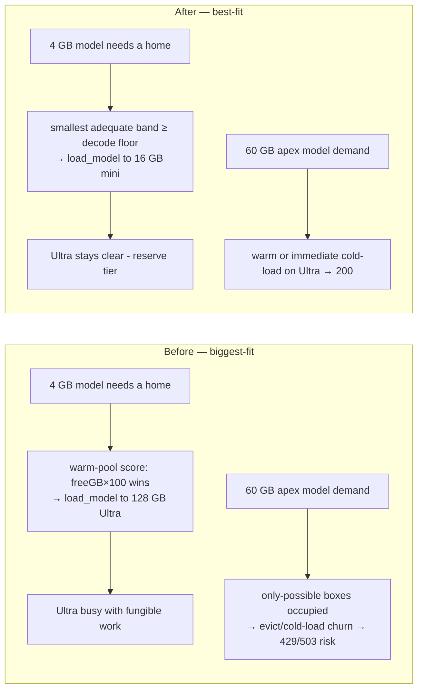
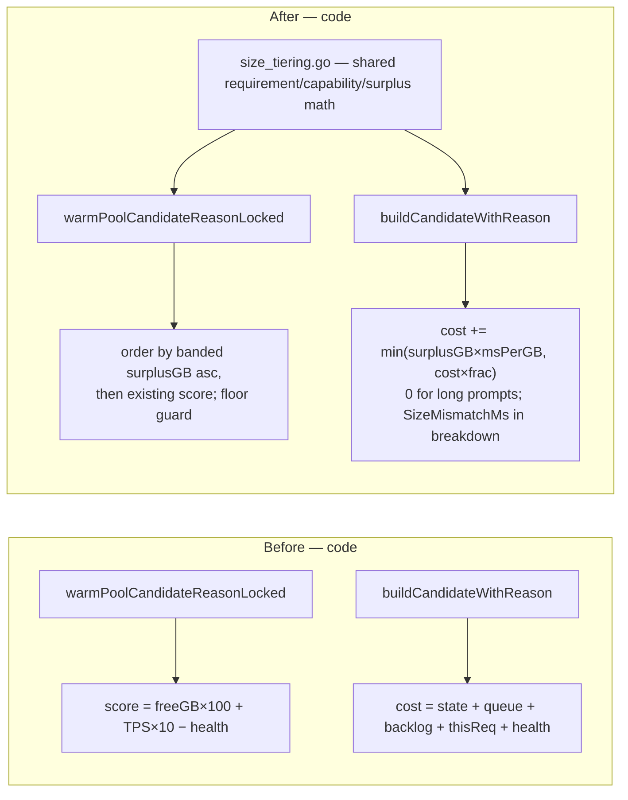

# Size-tiered placement — send smaller models to less powerful machines

Status: **proposed** (design; no code in this PR)

## 1. Problem

The fleet mixes machines from 16 GB M-series Mac minis to 128 GB+ Ultra
studios, and models from ~4 GB quants to ~60 GB+ (gpt-oss-120b class). Only
the big-memory machines can ever serve the biggest models — that capacity is
**structurally scarce**. Small models are **fungible**: nearly every box can
serve them.

Today both placement decision points spend the scarce resource first:

- **Warm-pool placement** (`warm_pool_controller.go`,
  `warmPoolCandidateReasonLocked`): when the controller picks a cold box to
  `load_model`, the candidate score is

  ```go
  score := freeGB*100 + resolvedDecodeTPS(p)*10 - memPressure*500 - cpu*100 - thermalPenalty
  ```

  `freeGB*100` dominates, so **every** model — a 4 GB quant included — is
  warmed onto the machine with the most free memory and the fastest chip.
  Small models colonize the Ultra boxes first.

- **Request routing** (`scheduler.go`, `buildCandidateWithReason`): candidates
  are ranked by estimated completion cost in ms. A bigger, faster box has
  higher TPS → lower `thisReqMs`/`backlogMs` → it wins warm-traffic ties for
  small models too, keeping small-model weights and KV resident exactly where
  large models need the room.

The fit gates are one-sided: `modelFitsHardware` rejects a model too **large**
for a box, but nothing anywhere prefers the smallest **adequate** box. The
result: when demand for a large model arrives, the only machines that can
hold it are busy serving traffic any 16 GB mini could have served, and the
large model waits on eviction/cold-load churn (or sheds 429/503) while small
boxes idle.

## 2. Objective

**Best-fit, not biggest-fit**: place each model on the least-capable machine
that still serves it above the quality floor, preserving big-memory machines
as the reserve for models only they can run.

Non-goals:

- No hard partitioning of the fleet (the dedicated-models mechanism
  `dedicated_models.go` already exists for that and stays as-is).
- No forced migration of already-resident models (idle eviction +
  `freeForLoadGB` treating idle residents as evictable already converges
  placement once new loads land correctly).
- No change to what "eligible" means — this is a **preference reorder among
  already-eligible candidates**, never a new rejection path.

## 3. Design principles

1. **Soft bias, fail-open.** A request must never be shed because policy
   prefers a smaller box. If the only eligible candidate is an Ultra, the
   Ultra serves. Missing catalog/hardware data ⇒ zero bias (same fail-open
   contract as `servability.go`).
2. **The binding axis is unified memory.** Speed differences are already
   priced by the cost model (TPS terms) and floored by the decode-quality
   floor. What the cost model cannot see is *scarcity*: which boxes are the
   only possible home for the apex models. Memory is that axis, and it is the
   fit-gate axis (`MinRAMGB`/`SizeGB` vs `MemoryGB`), so the preference and
   the gate share one requirement function and cannot drift.
3. **Quality floor guard.** "Less powerful" must still mean "good enough":
   a placement target must clear the existing `DecodeFloorTPS` at B=1
   (projected via `resolvedSoloModelTPSLocked`). A Mac mini that would decode
   a mid-size model below the floor is not an adequate box — fall up to the
   next band. No degraded streams in exchange for tidier packing.
4. **Both decision points move together.** Fixing only the warm pool leaves
   the scheduler pulling warm small-model traffic back onto big boxes (and
   keeping them "busy" in the warm-pool's eyes); fixing only the scheduler
   leaves placement colonizing big boxes. The two biases must be shipped as
   one policy.
5. **No protocol changes.** Every input already flows: `Hardware.MemoryGB`,
   `Hardware.ChipFamily/ChipTier/MemoryBandwidthGBs`,
   `BackendCapacity.TotalMemoryGB`, catalog `SizeGB`/`MinRAMGB`, and the
   per-(provider, model) TPS resolvers. No provider release, no heartbeat
   field, no console-ui change.

## 4. Mechanism

### 4.1 Shared surplus math (new `registry/size_tiering.go`, pure)

```text
requirement(model)  = MinRAMGB                          (catalog, preferred)
                    | SizeGB × modelMemoryHeadroomFactor (fallback — same as modelFitsHardware)
                    | unknown ⇒ no bias

capability(p)       = BackendCapacity.TotalMemoryGB | Hardware.MemoryGB
                      (same precedence warmPoolCandidateReasonLocked uses today)

surplusGB(p, model) = max(0, capability(p) − requirement(model))
```

Surplus is **banded** to the real Apple RAM SKU ladder (16 / 24 / 32 / 48 /
64 / 96 / 128 / 192) before ranking, so two boxes in the same memory class
never dither on a fractional-GB difference and the secondary keys (health,
speed) decide within a band.

### 4.2 Warm-pool placement: best-fit (`warm_pool_controller.go`)

`warmPoolCandidateReasonLocked` keeps every existing gate (trust, freshness,
pending-load, idle, thermal, `modelFitsHardware`, `reportedFreeForLoadAdmits`)
and adds the floor guard, then re-orders the eligible set:

- **Primary key:** smallest banded `surplusGB` first.
- **Secondary key:** the existing health/speed score (free headroom, TPS,
  memory pressure, CPU, thermal) — unchanged within a band.
- **New gate (floor guard):** skip a candidate whose projected solo decode for
  this model is below `DecodeFloorTPS` (data already sampled by
  `warmPoolFleetSnapshot` via `resolvedSoloModelTPSLocked`).

This one reorder flips fleet convergence: new small-model loads land on the
smallest adequate boxes; big boxes stop accumulating small residents and
drain naturally via the existing 1-hour idle eviction.

### 4.3 Request-routing bias (`scheduler.go`)

`buildCandidateWithReason` gains one additive cost term:

```text
sizeMismatchMs = min(surplusGB × msPerGB, costMs × maxCostFraction)
```

- Capped as a **fraction of the candidate's own cost** — the exact pattern the
  cache-routing discount already uses (`cacheRoutingMaxDiscountMs` /
  `cacheRoutingMaxCostFraction`) — so it decides near-ties and can never
  outvote a real load/health/backlog signal. A busy 32 GB box still loses to
  an idle Ultra.
- **Zeroed for long prompts** (`reqPrompt ≥ longPromptThresholdTokens`): the
  long-prompt fastest-tier preference (`longPromptPenalty`) stays untouched.
  Net behavior: small request + small model → smallest adequate box; long
  prompt → fastest box, exactly as today.
- Surfaced as a new `SizeMismatchMs` field in `costBreakdown` /
  `RoutingDecision` so the Total invariant (sum of terms == `costMs`) holds
  and Datadog/logs can attribute it.

### 4.4 Reserve guard (phase 3, planner-only)

Define the fleet's **apex requirement** = the largest `requirement(model)`
across catalog-allowed models with recent demand. A provider is
**reserve-tier** when its capability clears the apex requirement. The
warm-pool planner then skips reserve-tier boxes when placing a non-apex model
**iff at least one non-reserve eligible candidate exists** for it. Preference
order only — when reserve boxes are the sole eligible candidates they still
serve (fail-open), and the request hot path is untouched.

This closes the residual hole where all small boxes are momentarily busy and
the planner would otherwise still spend an Ultra on a 4 GB model.

## 5. Configuration and rollout

| Knob | Default | Meaning |
|---|---|---|
| `EIGENINFERENCE_SIZE_TIER_MODE` | `observe` | `off` / `observe` (log + metrics, no behavior change) / `enforce` |
| `EIGENINFERENCE_SIZE_TIER_MS_PER_GB` | `40` | scheduler bias slope |
| `EIGENINFERENCE_SIZE_TIER_MAX_COST_FRACTION` | `0.25` | scheduler bias cap |

Rollout: ship in `observe` (the warm-pool controller already has the
`ObserveOnly` precedent), validate the would-have-changed decisions and the
placement-surplus histogram in Datadog, then flip `enforce` on dev, then prod.
Kill switch is `off` (byte-for-byte current behavior — the bias term returns
0 and the warm-pool ordering falls back to the current score).

New metrics (DogStatsD, follows existing `registry` metric shapes):

- `warmpool.placement_surplus_gb` — surplus of each issued `load_model`
  (distribution; falling median = policy working).
- `routing.size_bias_applied_ms` — scheduler bias magnitude on winners.
- `warmpool.reserve_free_gb` — free capability on reserve-tier boxes (the
  gauge that says "the fleet can absorb a gpt-oss-120b burst right now").
- `size_tier.would_change` — observe-mode counter: decisions the policy would
  have altered.

## 6. Testing

- **Pure math** (`size_tiering_test.go`): requirement/capability precedence,
  banding, fail-open on missing catalog or hardware data (zero bias).
- **Warm-pool ordering**: mixed 16/64/128 GB fleet — small model warms the
  16 GB box first; floor-failing small box falls up a band; reserve guard
  skips the 128 GB box only while a smaller candidate exists.
- **Scheduler**: near-tie flips to the smaller box; a real load gap does not
  flip; long prompts unaffected byte-for-byte; `costBreakdown.Total`
  invariant holds; `off` mode is behavior-preserving.
- **Scenario** (`algorithm_scenarios_test.go` style): sustained mixed
  small+apex demand — assert the apex model always finds a warm or
  immediately-loadable home and small-model p50 latency does not regress past
  the floor.
- **Trace replay**: `registry/routingsim` before/after comparison on a prod
  trace — the decisive pre-prod evidence for the `enforce` flip.
- Existing `go test ./...` and e2e integration suite stay green (default
  `observe` is behavior-neutral for routing outcomes).

## 7. Phases

1. **Phase 1 — placement:** `size_tiering.go` helpers + warm-pool best-fit
   reorder + floor guard + observe mode + metrics + unit tests.
   Files: `registry/size_tiering.go` (new), `registry/warm_pool_controller.go`,
   `registry/config.go`, `cmd/coordinator/main.go`, `env/`.
2. **Phase 2 — routing:** scheduler `sizeMismatchMs` term + breakdown field +
   long-prompt exemption + tests + routingsim comparison.
   Files: `registry/scheduler.go`, `registry/size_tiering.go`.
3. **Phase 3 — reserve guard:** apex-requirement tracking + planner skip rule
   + scenario tests. Files: `registry/warm_pool_controller.go`,
   `registry/size_tiering.go`.

Each phase is independently shippable, `observe`-gated, and reviewed per the
quality gate before the next begins.

## 8. Before / after




