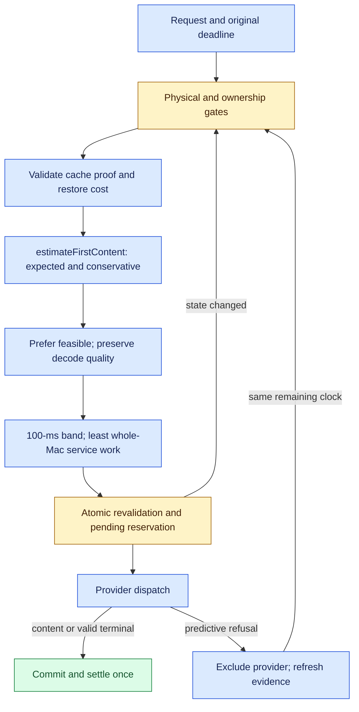

# First-content routing

> Last updated: 2026-10-01

The coordinator selects providers by expected time to delivered content, with a
separate conservative forecast for deadline feasibility. The selection policy applies by
default across the catalog. Qualified calibration additionally requires a
compatible provider release, matching reviewed profiles and fresh evidence.
The [design record](../design/first-content-performance.md) separates this
coordinator delivery from subsequent provider and fleet qualification.

## Context

A memory reservation describes the maximum work that can fit, not the time a
request must wait. `max_tokens` remains the completion limit and part of physical
KV admission, but it does not set the first-content selection band. Internal
GPU first token, role-only preamble, delivered content and valid empty completion
remain distinct events.

Existing trust, authorization, model capability, memory, concurrency and owner
gates remain in [routing](routing.md) and [scheduling](scheduling.md). The provider
retains the final atomic admission decision against its current engine state.

## Mechanism

### Prediction and freshness

`estimateFirstContent` (`coordinator/registry/first_content_forecast.go`) prices
handoff, cold load when needed, queued/competing prompt work, cache restoration,
uncached prompt work, and initial decode/delivery. `backlog_ms` remains a
historical commitment diagnostic and is never an elapsed waiting term.

`planPromptRoute` reuses the existing verified renderer/tokenizer contract for
numeric prompt work, including tools and history. It shares a successful cache
plan's count, including short prompts with no reusable boundaries. With cache
routing disabled it can obtain a count without enabling cache reuse. Planning
never waits for tokenizer preload, has bounded concurrency before serialization,
and spends the original request deadline. `api/promptwork` memoizes by concrete
model and complete provider body for this HTTP request only; rewritten fallback
bodies cannot inherit another count.

A cache-planning sampling or QPS denial also prevents a second count-only
sidecar call. Cache routing off still permits independently bounded count-only
work. A temporary miss of the planning concurrency gate is not memoized, so a
later attempt can recover exact counts and cache planning within the original
deadline (`api/promptwork/planner.go`, `Plan`; `api/promptwork/planning.go`).

`prompt_work` carries the count, upper bound and artifact/template identity to
preflight, selection and provider reconciliation. Exact and calibrated counts
require the candidate's advertised `prompt_work_identity` artifact and renderer
contract, including when an exact cache plan supplies the count. Loaded engines
publish this identity independently of prefix-cache enablement. Older providers
can establish the same pair through validated cache capabilities; missing or
conflicting identity retains heuristic counts (`providerPromptWorkIdentityLocked`
in `coordinator/registry/prompt_work_identity.go`). Calibrated template estimates
also require a reviewed measured domain
and independent held-out coverage. Unmeasured prompt-rendering controls also
withdraw fallback qualification; exact tokenizer planning remains available.
Unsupported shapes retain heuristic provenance
with unknown uncertainty. Billing and physical reservation inputs stay separate.
The provider checks its actual tokenized count and verified factory identity;
a mismatch withdraws calibrated prediction without extending the deadline.

The reviewed fallback catalog contains six Qwen3.8 text/tool shape groups from
9,000 actual template/tokenizer runs. Every record binds the exact artifact,
template and training domain; gaps between measured size groups remain
heuristic. Raw corpus receipts are archived separately; the
[qualification procedure](../developer/serving-performance-qualification.md#verify-local-evidence)
describes their optional replay checks.

Qualified prompt-count bounds also apply to ordinary rate forecasts when no
timing profile exists. An in-domain upper bound can exceed the historical
heuristic and classify a previously admitted tight-budget request as
`predicted_late`; `MaxTTFTMs` or `RequireFreshFeasible` can then exclude that
candidate. Exact tokenizer counts take precedence when available. Removing the
fixed throughput reduction does not remove these measured prompt-work bounds.

The expected and conservative handoff allowances are policy constants, not
measured transport latency.

Accepted capacity freshness comes from `CapacityAcceptedAt`; repeated/out-of-order
frames and liveness-only heartbeats cannot renew it. Performance freshness is
tracked separately for accepted isolated-prefill and observed-decode EWMAs. A
changed value establishes a conservative lower bound from the prior accepted
frame; the older of the two measurement ages controls confidence. Each first
observed value has unknown sample age. An unchanged EWMA never becomes
fresh merely because another heartbeat arrives. Provider sample-age/count and
workload profiles remain the separate provider delivery in the design.

The existing coordinator and provider validation envelopes both accept prefill
rates through `maxPrefillTPS = 20000.0` tokens/s. Invalid rates retain their
diagnostics and fallback behavior (`coordinator/registry/heartbeat.go`,
`resolvePrefillTPS` in `coordinator/registry/scheduler.go`).

| Forecast class | Interpretation | Selection |
|---|---|---|
| `feasible` | Fresh, sufficiently matched conservative evidence fits the original remaining budget | Preferred pool |
| `unknown` | Missing/stale measurement, unqualified competing or cold work, vision work, or no deadline | Nonzero expected forecast and bounded fallback; an idle provider whose only gap is performance evidence joins the preferred pool after the exploration bound |
| `predicted_late` | Credible conservative forecast exceeds the remaining budget | Lower preference; existing explicit hard rejection policy can exclude it |

Performance evidence requires serving work, so feasible-first selection can
indefinitely exclude a provider with missing or stale measurements. A loaded,
idle provider with a `performance_missing` or `performance_age_unknown_or_stale`
forecast can compete beside feasible peers after
`firstContentEvidenceExplorationAfter` (5 minutes). This threshold uses the older
paired measurement's age, or connection age when either measurement is undated;
it is not a continuous-idle timer or time since evidence expired. Unknown
connection age cannot qualify (`firstContentEvidenceGapAgeMs`,
`coordinator/registry/first_content_exploration.go`).

Outstanding service-retirement shadows, reported service usage or reservations,
load transitions, competing slot work and pending requests prevent the idle
exception (`fillFirstContentSnapshot`,
`coordinator/registry/first_content_snapshot.go`). Legacy providers may omit the
service fields and still qualify using their existing slot telemetry. Reservation
rechecks the exception under the provider lock and rescans if eligibility changed.
The candidate stays `unknown`, so hedge and fresh-feasible requests still exclude
it. Ordinary ranking need not select it, and a served request need not refresh
both measurements: cache reuse can leave isolated-prefill evidence unchanged, as
can an unchanged legacy EWMA. Exploration offers an opportunity, not guaranteed
selection or recovery.

### Provider recovery of expired text prefill evidence

Native engines with generation-bound retirement support can renew an expired
isolated-prefill estimate through one short text request. The evidence expires
after `EnginePerformanceMeasurements.freshness` (`.seconds(120)`). A recovery
request must have a live first-content deadline, no media, no reviewed deadline
profile, and at most `PrefillEvidenceRecovery.maximumPromptTokens` (`1_024`)
actual prepared tokens with a positive output limit. This is a bounded exploration policy, not a throughput
guarantee (`canRecoverPrefillEvidence`,
`provider-swift/Sources/ProviderCore/Inference/Engine/Bridge/EngineV2Bridge+PrefillRecovery.swift`).

The provider atomically acquires the entire `WholeMacServiceBudget` only when
there are no service owners or unbounded device activities. That exclusive
lease prevents another model or request from claiming inference service until
prompt completion. The final idle check and synchronous native registration
share the budget lock, so device activity cannot start between those operations.
Loading or device work after that admission boundary invalidates the evidence guard;
an interrupted receipt cannot train an isolated rate. Short recovery uses the
existing unmeasured-prefill submission path, with no invented service rate or
predicted duration. Original-clock expiry checks run before and after submission;
the coordinator's first-content timeout still bounds waiting for content.
Physical KV, memory, cache, trust and cancellation checks remain in force.

The SDK prompt-completion receipt reduces the full-Mac allowance to the ordinary
configured serving fraction, including cache-only or contended receipts. The same
service reservation, its lifetime and all memory/cache ownership remain held until
actual retirement. Long completions therefore retain ordinary concurrency instead
of monopolizing the Mac. If prefill never completes, exclusivity remains held
through retirement (`reduceExclusiveAllowance`,
`provider-swift/Sources/ProviderCore/Inference/Performance/WholeMacServiceBudget.swift`).

Outside this exclusive recovery path, native requests retain ordinary predictive
admission using their observed rates. Expiration alone does not remove a healthy
idle provider's ability to serve a larger prompt. Engines without generation-bound
retirement retain their legacy policy. A failed
or cache-only recovery waits `PrefillEvidenceRecovery.failureBackoff`
(`.seconds(120)`) after actual retirement before another recovery can start.
A successful cold isolated sample releases the recovery permission at retirement;
receipt publication alone never releases device ownership.
Refusals before engine admission commits do not start the recovery backoff.

The first new sample after an evidence gap reseeds its phase EWMA rather than
blending with the expired rate. Producer epoch and sample counts remain monotonic,
and heartbeats alone do not renew measurements. A cache hit, incomplete prefill,
contended sample or invalid timing cannot replace isolated-prefill evidence.
Coordinator exploration still controls whether an unknown provider gets a request;
provider recovery supplies a measurement opportunity once it is selected.

Even a feasible forecast is advisory. The ordinary forecast uses resolved
prefill and decode rates directly: it no longer multiplies either rate by 0.5.
The conservative prefill rate is still capped by a valid isolated-prefill
observation, while prompt-count upper bounds, queued work, cache restoration,
cross-model contention and delivery allowances remain explicit. A rate-based
estimate can still miss its deadline if subsequent execution slows down.

Optional reviewed `deadline_calibration` cells supply measured prediction-error
ratios and additive tail allowances only inside exact prompt/context, cache and
contention envelopes. Both compiled runtimes independently verify the stored
validation counts meet a one-sided 95% binomial confidence test at the claimed
tail target, even when the raw evidence archive is unavailable. Fresh live
evidence can make those rates slower; it cannot
make them faster than the reviewed values.

`DeadlinePerformanceProfile` binds those cells to the exact constructed
scheduler, model, template, MTP runtime and hardware. Its configured context is
runtime identity, while each cell bounds measured request and competing-work
contexts. The separate `deadline_profile` reference grants no authority over
concurrency, whole-Mac charges or mixed-prefill caps. Those serving policy
changes still require the complete `ServingPerformanceProfile` qualification
matrix; narrow first-content evidence cannot certify them. The deadline catalog
is currently empty, so that optional timing path remains disabled. The ordinary
forecast's removal of the fixed rate reduction is active without a catalog
entry. Enabling reviewed timing profiles requires independently qualified
evidence with continuous power observations. Concurrency, chunk and memory
defaults remain unchanged.

A compiled profile must match the qualifier's current scheduler and posture
domain: one partial prefill at a time, an absent mixed cap or exactly 128, 256
or 512 tokens, 20 seconds of whole-Mac quiescence, 5 seconds of stable nominal
posture, and Automatic power mode on AC. Every cell must fit the declared
scheduler width and carry the profile's qualification-report digest. This deadline-policy
revision cannot transfer AC measurements to Battery Automatic. The provider advertises the
reference only while these prerequisites hold. The coordinator requires
explicit nominal thermal state and `low_power_mode=false`, and invalidates
an old idle reference after locally tracked work, load transitions or reported
GPU activity (`coordinator/registry/deadline_applicability.go`). This does not
delay requests: ineligible work retains conservative admission. Provider
retirement and the final atomic evidence guard remain authoritative. Phase
rates from earlier posture epochs are omitted from profiled capacity snapshots,
so recovered power/thermal eligibility cannot revive old measured rates.

Busy work accounting requires fresh `deadline_work` envelopes correlated
with the whole-Mac reservation snapshot. The currently permitted cooled policy
withdraws calibration while the Mac is busy; a different applicability policy
needs separate qualification and a reviewed validator change. Existing owners retain conservative
prompt/output bounds through pre-submit and retirement. Missing owners, changed
epochs, unrepresented GPU work or unmatched competing profiles stay unknown.
A nonempty work envelope must retain positive original prompt work, including
cache-reused requests. Its aggregate token counts, owner count and maximum
context must also agree; an impossible report cannot certify existing work.
The provider takes the larger of actual scheduler work and existing same-model
lease bounds, adds qualified competing work, then prices only the incoming work
to first content. The cell's context bound includes the bounded incoming early
decode allowance. Its requested full output remains a memory commitment and is
not added to the incoming first-content projection. Overlapping scheduler and
lease work is bounded with a maximum rather than counted twice.
An unrelated `idle_shutdown` slot with no activity does not compete for work or
require active-engine telemetry. Positive activity and local reservations still
count; loading, crashed and unknown slot states remain conservative.

### Native media target observations

Native MiMo preparation expands media into its actual target-decoder prompt
before deadline admission. A short text sample is not a measured media rate.
`NativeMediaPrefillRates` retains at most 32 samples in each existing prompt
size band, using the slowest unexpired rate only within the smallest-to-largest
actually observed prompt range. Each sample expires after 120 seconds; new
observations do not refresh older samples. Engine replacement resets the table.
Only cold, unpacked, non-preempted target-prefill intervals with exclusive
whole-Mac ownership and an unchanged nominal AC/Automatic posture enter it.
Media encoder preparation and failed native drains invalidate isolated evidence.
Native online observations require five seconds of stable nominal posture and
actual retirement of earlier device work. They may start immediately after
successful media preparation; they carry no 20-second recovery proof and never
enter the reviewed text-calibration catalog. The text catalog retains its full
20-second quiescence requirement. A late prepared/request drain failure marks
the shared service budget unbounded at the failure transition, even when the
earlier preparation activity has already finished.

Submission captures one whole-Mac/posture snapshot shared by the prefill receipt
and `EngineV2Bridge+MiMoDeadline.swift`; a missing snapshot cannot be upgraded
between those consumers. The latter passes the incoming target's observation
to the SDK. The SDK prices any pre-existing
prefill at its original rate and any decode at its own rate. Missing, expired,
out-of-range or invalidated media evidence is not replaced by a text prediction.
These runtime observations do not populate the reviewed calibration catalog.

When that table has no applicable observation, one owned native request can
gather evidence under the same absolute first-content deadline. The SDK checks
physical capacity, exactly one scheduler row, no in-flight step, no decode or
mixed work, no adopted prefix, and the live whole-Mac guard. The provider allows
at most one such request until actual retirement. Failed or ineligible attempts
back off for 120 seconds per engine; an eligible target-prefill sample releases
that backoff only at its owner's retirement, including an eligible ordinary
request with no first-content deadline, so new shapes can build a fresh range.
Busy, unowned, stale-posture or cooldown cases keep a capacity refusal;
no deadline, memory, cancellation or trust check is disabled. The explicit SDK
`unmeasuredNativeMedia` result records bounded work with unknown service time,
not a zero-time prediction. Cancellation transfers retain the bootstrap owner
until the existing retirement path releases the service allowance.

### Selection and reservations

`selectRoutingCandidateWithAffinity`
(`coordinator/registry/candidate_selection.go`) uses the minimum health-adjusted expected
first-content time, retains the `firstContentFastBandMs` band, and chooses the
least committed whole-Mac service work within it. Existing health derating,
owner semantics and decode-quality preference remain. Valid cache affinity
breaks close choices; equivalent choices spread. The whole-Mac service estimate
is distinct from the physical prompt-plus-maximum-output reservation.

Cache proof is validated before forecasting and again at reservation. Reusable
tokens are bounded by the real prompt work, age weighted and expired normally;
restoration is charged once. See [cache-aware routing](cache-aware-routing.md).

`commitProviderReservation` (`coordinator/registry/scheduler.go`) rebuilds the
candidate while holding the provider lock and reserves capacity in the same
critical section. Pending prompt work immediately becomes visible to subsequent
routing. Changed state triggers a bounded rescan. The same request-absolute
clock covers lock waits, cache work, quotes, queues and provider writer handoff.
Preflight releases its CPU routing-scan permit during prompt-contract planning
and fallback body preparation, then reacquires it against the remaining clock
before another fleet walk (`admissionScanPermit`,
`coordinator/api/inference_admission_scan.go`).
Reservation cleanup follows the existing pending-request lifecycle on refusal,
disconnect, timeout, cancellation and terminal completion.

### Retries, quotes and hedges

Retained plans are reranked from current evidence before reservation; a quote
does not reserve capacity. Predictive refusals exclude the refusing provider for
the logical request without counting as permanent health faults. After two such
refusals from distinct providers, including speculative race losers, another
dispatch requires fresh feasible evidence. Quote fanout is
bounded to two providers and spends the original deadline. Existing provider
quote quantiles lack sample-age and workload provenance. A recent quote therefore
needs independently fresh, matching local evidence and cannot lower the local
forecast; busy, cold, vision or stale observations remain Unknown.

A logical request launches at most one hedge, on a distinct feasible provider
with spare service allowance, under the existing hedge governor. Exempt requests
use `FirstContentPlanningHorizon` to assess hedges and recovery after repeated
predictive refusals; this advisory horizon creates no first-content deadline or
timer. Ordinary exempt primary selection remains deadline-free. The loser is
cancelled and retired through the normal terminal/accounting arbitration.

Public deadline-bound requests wait for capacity only when evidence supports a
useful release within the remaining first-content budget. A configured queue
maximum is a limit, not a target. Explicit self/owner behavior, deadline-exempt
requests and structural-error semantics remain intact.

## Invariants

1. Physical admission still reserves prompt plus maximum output and all existing
   activation/KV allowances (`freeMemoryAdmits`, `coordinator/registry/scheduler.go`).
2. A new attempt cannot reset the first-content deadline (`RefreshFirstContentBudget`,
   `coordinator/registry/pending_request.go`).
3. Cache hints never replace endpoint identity, proof or current-capacity checks
   (`applyCacheRoutingCostPLocked`, `coordinator/registry/scheduler.go`).
4. Expected forecasts rank; only credible conservative evidence establishes
   feasibility (`estimateFirstContent`, `coordinator/registry/first_content_forecast.go`).
5. Provider concurrency limits, measured memory floors and warm-pool placement
   remain separately qualified policies; this coordinator change expands none.

## Failure modes and evidence

Missing observations reduce feasibility coverage, not physical safety. Unknown
fallbacks can still be refused by the provider. The retry ladder is bounded and
keeps the original overload, fault and timeout outcomes; it does not claim every
predicted refusal would actually miss in execution.

The profiler persists each candidate's `first_content` object with expected and
conservative times, class/reason, remaining budget, evidence ages, cache work and
service-work estimate (`decisionJSON`, `coordinator/api/profiler_record.go`). The
winner carries its commit-time evidence. Existing cost and calibrated TTFT
columns remain separate diagnostics; [profiler sampling](system-profiler.md)
does not represent a random sample of all outcomes.

## Code map

| Concern | Source |
|---|---|
| Forecast types and classification | `coordinator/registry/first_content_forecast.go` — `FirstContentEstimate`, `estimateFirstContent` |
| Prompt accounting and bounded planning | `coordinator/api/promptwork/` — `Memo`, `Plan`, `Calibration` |
| Qualified prediction arithmetic | `coordinator/registry/firstcontent/` — `Calibration`, `Predict` |
| Independent deadline profile identity | `coordinator/registry/deadline_profile.go` — `qualifiedDeadlineProfileLocked` |
| Existing work ownership | `coordinator/registry/first_content_calibrated_work.go` — `fillCalibratedWorkSnapshot` |
| Candidate selection | `coordinator/registry/candidate_selection.go` — `selectRoutingCandidateWithAffinity` |
| Physical reservation | `coordinator/registry/scheduler.go` — `commitProviderReservation` |
| Cache-aware preflight | `coordinator/registry/first_content_preflight.go` — `QuickFirstContentCapacityForRequest` |
| Retained alternatives | `coordinator/registry/dispatch_plan.go` — `ReserveNextFromPlan`, `RefreshDispatchPlan` |
| Quote correlation | `coordinator/registry/capacity_quotes.go` — `ProbePlanCandidates` |
| Request retry and terminal ownership | `coordinator/api/dispatch.go` — `dispatchState` |
| Persisted forecast evidence | `coordinator/api/profiler_record.go` — `decisionJSON` |
| Native text measurement recovery | `provider-swift/Sources/ProviderCore/Inference/Engine/Bridge/EngineV2Bridge+PrefillRecovery.swift` — `canRecoverPrefillEvidence`; `provider-swift/Sources/ProviderCore/Inference/Performance/PrefillEvidenceRecovery.swift` — `PrefillEvidenceRecovery` |

## Related

- [Routing](routing.md), [scheduling](scheduling.md), [configuration](../reference/configuration.md).
- [Production investigation](../reports/2026-09-28-first-content-performance.md).
- [Performance plan and qualification targets](../design/first-content-performance.md).
