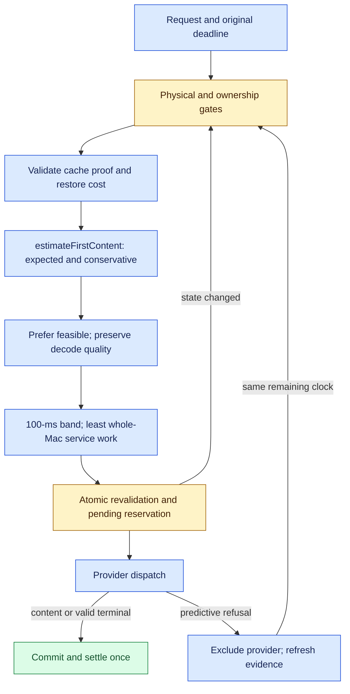

# First-content routing

> Last updated: 2026-09-28 · commit `1f664f507`

The coordinator selects providers by expected time to delivered content, with a
separate conservative forecast for deadline feasibility. The policy applies by
default across the catalog; it requires no provider upgrade or rollout mode.
The [design record](../design/first-content-performance.md) separates this
coordinator delivery from subsequent provider and fleet qualification.

## Context

A memory reservation describes the maximum work that can fit, not the time a
request must wait. `max_tokens` remains the completion limit and part of physical
KV admission, but it does not set the first-content selection band. Internal
GPU first token, role-only preamble, delivered content and valid empty completion
remain distinct events.

Existing trust, authorization, model capability, memory, concurrency and owner
gates remain in [routing](routing.md) and [scheduling](scheduling.md). The provider
retains the final atomic admission decision against its current engine state.

## Mechanism

### Prediction and freshness

`estimateFirstContent` (`coordinator/registry/first_content_forecast.go`) prices
handoff, cold load when needed, queued/competing prompt work, cache restoration,
uncached prompt work, and initial decode/delivery. `backlog_ms` remains a
historical commitment diagnostic and is never an elapsed waiting term.

Exact prompt-plan counts take precedence when the authenticated plan is still
valid. Otherwise the conservative forecast uses the API's model-family prompt
calibration (`calibratedContextPromptTokens`,
`coordinator/api/prompt_calibration.go`). It is an estimate, not tokenizer proof
or a learned template-specific bound. The expected and conservative handoff
allowances are policy constants, not measured transport latency.

Accepted capacity freshness comes from `CapacityAcceptedAt`; repeated/out-of-order
frames and liveness-only heartbeats cannot renew it. Performance freshness is
tracked separately for accepted isolated-prefill and observed-decode EWMAs. A
changed value establishes a conservative lower bound from the prior accepted
frame; the older of the two measurement ages controls confidence. Each first
observed value has unknown sample age. An unchanged EWMA never becomes
fresh merely because another heartbeat arrives. Provider sample-age/count and
workload profiles remain the separate provider delivery in the design.

The existing coordinator and provider validation envelopes both accept prefill
rates through `maxPrefillTPS = 20000.0` tokens/s. Invalid rates retain their
diagnostics and fallback behavior (`coordinator/registry/heartbeat.go`,
`resolvePrefillTPS` in `coordinator/registry/scheduler.go`).

| Forecast class | Interpretation | Selection |
|---|---|---|
| `feasible` | Fresh, sufficiently matched conservative evidence fits the original remaining budget | Preferred pool |
| `unknown` | Missing/stale measurement, unqualified competing or cold work, vision work, or no deadline | Nonzero expected forecast and bounded fallback |
| `predicted_late` | Credible conservative forecast exceeds the remaining budget | Lower preference; existing explicit hard rejection policy can exclude it |

Even a feasible forecast is advisory. Half-rate conservative pricing is not a
mathematical guarantee. Busy schedules are not reconstructed from maximum output
reservations. Overlapping reported queued-prefill work and local pending work
are reconciled without summing the same request twice.

### Selection and reservations

`selectRoutingCandidateWithAffinity`
(`coordinator/registry/candidate_selection.go`) uses the minimum health-adjusted expected
first-content time, retains the `firstContentFastBandMs` band, and chooses the
least committed whole-Mac service work within it. Existing health derating,
owner semantics and decode-quality preference remain. Valid cache affinity
breaks close choices; equivalent choices spread. The whole-Mac service estimate
is distinct from the physical prompt-plus-maximum-output reservation.

Cache proof is validated before forecasting and again at reservation. Reusable
tokens are bounded by the real prompt work, age weighted and expired normally;
restoration is charged once. See [cache-aware routing](cache-aware-routing.md).

`commitProviderReservation` (`coordinator/registry/scheduler.go`) rebuilds the
candidate while holding the provider lock and reserves capacity in the same
critical section. Pending prompt work immediately becomes visible to subsequent
routing. Changed state triggers a bounded rescan. The same request-absolute
clock covers lock waits, cache work, quotes, queues and provider writer handoff.
Reservation cleanup follows the existing pending-request lifecycle on refusal,
disconnect, timeout, cancellation and terminal completion.

### Retries, quotes and hedges

Retained plans are reranked from current evidence before reservation; a quote
does not reserve capacity. Predictive refusals exclude the refusing provider for
the logical request without counting as permanent health faults. After two such
refusals, another dispatch requires fresh feasible evidence. Quote fanout is
bounded to two providers and spends the original deadline. Existing provider
quote quantiles lack sample-age and workload provenance. A recent quote therefore
needs independently fresh, matching local evidence and cannot lower the local
forecast; busy, cold, vision or stale observations remain Unknown.

A logical request launches at most one hedge, on a distinct feasible provider
with spare service allowance, under the existing hedge governor. Exempt requests
use `FirstContentPlanningHorizon` to assess hedges and recovery after repeated
predictive refusals; this advisory horizon creates no first-content deadline or
timer. Ordinary exempt primary selection remains deadline-free. The loser is
cancelled and retired through the normal terminal/accounting arbitration.

Public deadline-bound requests wait for capacity only when evidence supports a
useful release within the remaining first-content budget. A configured queue
maximum is a limit, not a target. Explicit self/owner behavior, deadline-exempt
requests and structural-error semantics remain intact.

## Invariants

1. Physical admission still reserves prompt plus maximum output and all existing
   activation/KV allowances (`freeMemoryAdmits`, `coordinator/registry/scheduler.go`).
2. A new attempt cannot reset the first-content deadline (`RefreshFirstContentBudget`,
   `coordinator/registry/pending_request.go`).
3. Cache hints never replace endpoint identity, proof or current-capacity checks
   (`applyCacheRoutingCostPLocked`, `coordinator/registry/scheduler.go`).
4. Expected forecasts rank; only credible conservative evidence establishes
   feasibility (`estimateFirstContent`, `coordinator/registry/first_content_forecast.go`).
5. Provider concurrency limits, measured memory floors and warm-pool placement
   remain separately qualified policies; this coordinator change expands none.

## Failure modes and evidence

Missing observations reduce feasibility coverage, not physical safety. Unknown
fallbacks can still be refused by the provider. The retry ladder is bounded and
keeps the original overload, fault and timeout outcomes; it does not claim every
predicted refusal would actually miss in execution.

The profiler persists each candidate's `first_content` object with expected and
conservative times, class/reason, remaining budget, evidence ages, cache work and
service-work estimate (`decisionJSON`, `coordinator/api/profiler_record.go`). The
winner carries its commit-time evidence. Existing cost and calibrated TTFT
columns remain separate diagnostics; [profiler sampling](system-profiler.md)
does not represent a random sample of all outcomes.

## Code map

| Concern | Source |
|---|---|
| Forecast types and classification | `coordinator/registry/first_content_forecast.go` — `FirstContentEstimate`, `estimateFirstContent` |
| Candidate selection | `coordinator/registry/candidate_selection.go` — `selectRoutingCandidateWithAffinity` |
| Physical reservation | `coordinator/registry/scheduler.go` — `commitProviderReservation` |
| Cache-aware preflight | `coordinator/registry/first_content_preflight.go` — `QuickFirstContentCapacityForRequest` |
| Retained alternatives | `coordinator/registry/dispatch_plan.go` — `ReserveNextFromPlan`, `RefreshDispatchPlan` |
| Quote correlation | `coordinator/registry/capacity_quotes.go` — `ProbePlanCandidates` |
| Request retry and terminal ownership | `coordinator/api/dispatch.go` — `dispatchState` |
| Persisted forecast evidence | `coordinator/api/profiler_record.go` — `decisionJSON` |

## Related

- [Routing](routing.md), [scheduling](scheduling.md), [configuration](../reference/configuration.md).
- [Production investigation](../reports/2026-09-28-first-content-performance.md).
- [Performance plan and qualification targets](../design/first-content-performance.md).
