# Gemma 4 Frozen-KV MTP on Continuous Batching V2

**Status:** implemented and locally validated on parent `c77d38523` with
`libs/mlx-swift-lm` based at `9ec146e49`. Not pushed, released, registered, or
deployed.

This document is the implementation contract for production Gemma 4
multi-token prediction (MTP) in Darkbloom. It records the code-grounded local
findings, current upstream evidence, correctness invariants, ownership
boundaries, stable interfaces, validation gates, and rollout sequence.

Historical d-inference PR #306 is deliberately excluded. It targeted the
deleted legacy batching engine. The only current implementation target is
Continuous Batching V2 (CBv2).

## Implementation Result

The production branch now includes:

- Native CBv2 seed/draft/verify rounds with target-authoritative acceptance.
- Step-global eligibility and commit cadence for quantized MoE parity.
- Exact full, quantized, and staged-window KV rollback.
- Strict absolute-position assistant sliding masks.
- A depth-zero, batch-bucketed goodput controller with isolated target-only
  probes, conditional acceptance, bounded exploration, hysteresis, and exact
  seed-cost attribution.
- Safe hybrid prefix-cache policy: full replay whenever a storage-owning full
  layer follows sliding attention.
- Provider local/catalog resolution, mandatory immutable catalog anchors,
  bounded nonblocking prefetch, assistant-owned quantization, exact target
  binding, fail-open target-only fallback, memory accounting, slot lifetime,
  rebuild posture preservation, metrics, and kill switch.
- A production-backed cache-only validation and benchmark harness with process
  supervision, raw-token parity, release performance mode, bounded inventory,
  secure output handling, and explicit coverage labels.

Review-driven correctness defects found and fixed during implementation:

- Rejected draft emitted instead of the target correction (deliberate mutation
  proved the parity gate has teeth).
- Mixed terminal depths changed quantized MoE target batch cadence.
- Mixed eligible/ineligible rows split one target decode batch into different
  shapes.
- Hybrid prefix-cache partial replay permanently cached polluted activations.
- The oldest retained sliding key at `anchor-window` was incorrectly visible
  to the assistant.
- Depth-zero timing included chained neighbor work while MTP timing did not.
- Seed cost and exploration backoff could attach to work at another depth.
- Assistant-only memory pressure could unload an otherwise valid target.
- Rebuild could activate or reload unreserved assistant memory.
- Warm/local artifact mutation, coalesced cancellation, and shutdown races.
- Validation could accept inactive/error runs or report non-production timing.

### Final Local Verification

| Gate | Result |
|---|---|
| Engine focused MTP suites | 75/75 passed after modular split |
| Broader engine scheduler/KV/cache suites | 77/77 passed |
| Controller review-fix suites | 63/63 passed |
| Provider focused final suites | 72/72 passed; prior combined provider pass 173/173 |
| Full provider suite | Near-final run executed 1,393 tests; all MTP behavior tests passed. Under full-suite contention, the documented `reWedgeOutsideCooldownRecoversAgain` timing case and the catalog-prewarm wall-clock assertion failed; both 11-test suites passed in isolation. The final rotary-preflight and benchmark-sizing deltas then passed their focused tests |
| QAT target + QAT-4bit assistant raw matrix | 40/40 parity, B=1/2/4/8, fixed L=1...8 plus adaptive |
| QAT target + BF16 assistant raw matrix | 40/40 parity, same matrix |
| 8bit target + BF16 assistant raw matrix | 40/40 parity, same matrix |
| Real provider paths | load/bind, fail-open assistant failure, tool-templated VLM, and image-prefill paths passed |
| Products | `ProviderCore`, `ProviderBenchmark` debug/release, and `darkbloom` build passed |
| Diff checks | parent and nested diffs clean |

Schema-v4 raw-parity reports contain neither timing fields nor token IDs. The
exact-final QAT/QAT report is under `tmp/mtp-20260714T030020Z-...run/`, the
QAT/BF16 report under `tmp/mtp-20260714T030152Z-...run/`, and the 8bit/BF16
report under `tmp/mtp-20260714T030313Z-...run/`.

### Production-Target Drafter Comparison

Release sweeps used the production QAT-4bit target, production EOS handling,
32 output tokens, one warmup, three repetitions, real prompt categories, and
median aggregate decode TPS. Values are within-run comparisons; target-only
baselines varied across processes, so absolute TPS must not be compared across
the two assistant runs.

| Assistant | B=1 best | B=2 best | B=4 best | B=8 best |
|---|---:|---:|---:|---:|
| QAT-4bit, 236 MB | L3: +23% | L6: +6% | L6: +17% | k=0; best MTP -2% |
| BF16, 839 MB | L4: +10% | k=0; best positive-depth MTP -11% | L2: +18% | L2: +6% |

The QAT-4bit assistant is the production recommendation: it is 3.6 times
smaller and produces profitable regions at B=1, B=2, and B=4. The BF16
assistant improves B=1, B=4, and B=8 in this short sweep but is less
consistent, regresses B=2, and is more expensive. Both need depth zero at
unprofitable shapes.

The short adaptive cases begin with an untrained controller and mostly select
depth zero. They validate safe exploration and fallback, not convergence.
Production-duration traffic replay remains required before setting controller
seeds or enabling MTP by default.

The sanitized schema-v4 release reports are stored in the gitignored run
directories beginning `tmp/mtp-20260714T030432Z-` (QAT-4bit assistant) and
`tmp/mtp-20260714T031303Z-` (BF16 assistant).

Those short-context release sweeps predate the final benchmark-only correction
that charges assistant residency as model weight rather than an OS reserve.
The cases were far below the KV ceiling, so the measured decode path is
unchanged, but an exact post-fix performance rerun was interrupted and is not
claimed as complete. The schema-v4 raw parity matrices were rerun after the
final engine/config hardening.

Residual engineering risks are explicit: Swift cannot cancel synchronous MLX
construction inside the process, so live validation relies on the process-group
supervisor; same-user mutation after catalog verification remains a general
path/fd TOCTOU concern; official cross-runtime tensor fixtures, real
long-prefix validation, video, structured output, and production-duration
controller convergence remain unimplemented. These do not weaken the completed
target-authority matrices, but they block a default-on production rollout.

## Scope

Build the official Gemma 4 assistant path:

- A separate four-layer autoregressive Q-only assistant.
- Target input-embedding reuse.
- Target hidden-state conditioning.
- Frozen K/V from the last storage-owning full-attention and
  sliding-attention target layers.
- Constant assistant position within a draft round.
- Linear draft proposals followed by one rectangular target verification.
- Target-authoritative greedy acceptance.
- Exact per-row KV commit or rollback.
- Continuous batching with ordinary decode and chunked-prefill neighbors.
- Provider-side artifact resolution, loading, memory accounting, lifecycle,
  observability, fail-open fallback, and real-model validation.
- A measured, batch-aware speculation-depth controller with depth zero.

Explicitly out of scope for this release:

- EAGLE, EAGLE-2, or EAGLE-3.
- Medusa, Hydra, ReDrafter, or newly trained draft heads.
- Top-k or beam/tree verification.
- Relaxed acceptance.
- Stochastic speculative sampling.
- Paged-window speculative staging.
- Online drafter training.

## Why This Architecture

Gemma 4 calls the feature MTP, but the published assistant is not the
independent multi-head architecture described by Gloeckle et al. at ICML
2024. It is a sequential autoregressive drafter conditioned on target state.
Google documents the same four properties that the local model code exposes:
target embeddings, previous target hidden state, frozen target KV, and
constant positions.

Current production implementations independently converge on a dedicated
Gemma path:

| Runtime | Audited revision | Relevant design |
|---|---|---|
| vLLM | `8b8af2caf739a7537b9ca848b836733c6533bf20` | Dedicated `Gemma4Speculator`, paged provisional KV, batch-size depth schedule, generic acceptance and metrics |
| SGLang | `cfc3d0555e6d56a382ed6eb40e993cd2c10c9ef8` | Dedicated `FROZEN_KV_MTP`, direct typed-layer KV binding, temporary verification pages |
| Ollama MLX | `4f7786d0baa9085e568c5d48135b5347daaddd8f` | One target forward, one host sync, transactional cache handling, measured depth-zero controller |

Primary external sources:

- [Gemma 4 MTP overview](https://ai.google.dev/gemma/docs/mtp/overview)
- [Gemma 4 MTP usage](https://ai.google.dev/gemma/docs/mtp/mtp)
- [Gemma 4 technical report](https://arxiv.org/abs/2607.02770)
- [vLLM Gemma 4 MTP PR #41745](https://github.com/vllm-project/vllm/pull/41745)
- [SGLang Frozen-KV MTP PR #24436](https://github.com/sgl-project/sglang/pull/24436)
- [Ollama adaptive MLX speculation PR #16791](https://github.com/ollama/ollama/pull/16791)
- [TurboSpec/SmartSpec](https://arxiv.org/abs/2406.14066)
- [Speculative Decoding: Performance or Illusion?](https://arxiv.org/abs/2601.11580)

The local engine work already follows the correct model shape. The task is to
finish, harden, measure, and ship it rather than replace it.

## Current Local Inventory

The clean source implementation is split across five local commits in the
read-only source worktree `.worktrees/mtp-build`:

| Commit | Responsibility |
|---|---|
| engine `13a726e` | Scheduler `1+k` planning, speculative KV contracts, window staging, rectangular attention, Gemma model and drafter seams |
| engine `e11a108` | Seed/draft/verify step, finalize-time accept walk, lifecycle integration, metrics |
| parent `c228c257` | `spec_dec` R2 artifact resolver and store |
| parent `37f785b0` | Provider config, beta switch, assistant advertisement exclusion |
| parent `5040e86b` | Drafter memory-accounting and slot-lifetime scaffolding |

Those commits were based on older parent and engine revisions. They are
source material, not merge-ready output. The production branches must port
their behavior onto the exact bases named at the top of this document.

The source worktree also contains an intentional uncommitted parity mutation
that emits a rejected draft token. It must never be copied. Correct behavior
always emits the target correction at the first divergence.

## End-to-End Architecture

```mermaid
flowchart LR
  Catalog[Target catalog metadata] --> Resolver[SpecDecResolver]
  Resolver --> Store[Verified assistant store]
  Store --> Loader[Assistant loader]
  Target[Loaded Gemma target] --> Binder[Gemma4CBv2MTPDrafter]
  Loader --> Binder
  Binder --> Factory[EngineV2 factory]
  Factory --> Engine[CBv2 EngineV2]
  Engine --> Controller[Depth controller k >= 0]
  Controller --> Scheduler[SchedulerV2 plan]
  Scheduler --> Seed[Seed hidden and bonus]
  Seed --> Draft[Sequential frozen-KV drafts]
  Draft --> Verify[One rectangular target verify]
  Verify --> Accept[Target-authoritative accept walk]
  Accept --> Commit[KV commit or rollback]
  Commit --> Stream[Consumer token stream]
```

The coordinator performs no speculation. Existing free-form catalog metadata
provides an immutable pointer to an assistant artifact. Old providers ignore
that metadata and continue target-only serving.

## Stable Interfaces

Parallel work converges through these interfaces. Owners may extend them only
after notifying the other workstreams.

### Engine Construction

`EngineV2` accepts:

- `mtpDrafter: (any CBv2MTPDrafter)?`
- `mtpConfig: CBv2MTPConfig`

Nil drafter or disabled config is behaviorally identical to target-only
CBv2. Provider code must not reach into engine-loop state.

### Provider Engine Bundle

Production construction returns a bundle containing:

- The `EngineV2Bridge`.
- An opaque slot-owned assistant handle.
- Assistant resident-byte estimate used for admission and sizing.
- Activation status and a stable fallback reason.

The slot owns the assistant for exactly the same lifetime as the target. The
assistant must be released before the post-unload MLX cache purge and before
survivor KV grants regrow.

### Speculation Metrics

The engine exposes a lock-safe snapshot with at least:

- Seed row count.
- Proposed tokens.
- Accepted draft tokens.
- Committed emitted tokens.
- Acceptance count by draft position.
- Skip and fallback counts by stable reason.
- Selected depth.
- Planned decode rows.
- Round wall time or committed-token goodput inputs.

Provider observability consumes snapshots. It does not mutate controller or
engine state.

### Artifact Resolution

Resolution returns either a verified local assistant directory plus manifest
facts, or nil. It never throws into target model loading. Required metadata:

- Immutable R2 prefix.
- Manifest SHA-256.
- Expected total bytes.
- Maximum file count and allowed file types.
- Assistant configuration or family digest.

Failure is observable and falls back to target-only decode.

## Correctness Invariants

These invariants are release blockers.

### Target Authority

For greedy requests, every emitted token is a target argmax after all
supported target-side processing. A drafter token is emitted only when it
equals that target result. The first disagreement emits the target correction.
Full acceptance emits the target bonus token.

The assistant may affect performance and availability, but never accepted
content.

### One Finalize Boundary

Draft IDs, target argmaxes, and target hidden state remain device-resident
until the existing CBv2 finalize boundary. A round introduces no second host
synchronization.

### Frozen Assistant State

The assistant writes no KV. Each draft step in one round uses:

- The same frozen target KV views.
- The same absolute query position.
- The preceding draft token.
- The recurrent hidden returned by the preceding assistant step.

Target and assistant tensor semantics must match official Google/Hugging Face
fixtures. In particular, pre-final-norm versus post-final-norm hidden state is
not decided by comments or inherited code; tensor parity decides it.

### Speculative KV Transaction

Target verification may compute `1+k` provisional positions. After acceptance:

- Full and quantized contiguous KV roll back the rejected suffix exactly.
- Windowed rings stage writes so rejected tokens never destroy live history.
- Shared-KV views for the next round contain confirmed tokens only.
- Scheduler computed-token and pending-sample counts match confirmed KV.
- Admission refunds exactly the rejected token reservation.
- Paged-window rows remain target-only until a transactional implementation
  is proven.

Transient staged KV memory must be charged or bounded separately from the
steady retained-token estimate.

### Continuous Batching

One plan may contain MTP rows, seed rows, ordinary decode rows, logprob or
sampling rows, and chunked-prefill neighbors. MTP work must not:

- Preempt a request merely to reserve speculative slack.
- Block waiting admission through leaked pending samples.
- Change ordinary-row output or logprobs.
- Enter compiled decode with `L > 1`.
- Become a chained-step base.

The first release uses one uniform depth for all speculating rows in a
rectangular verification batch.

### Lifecycle

Carry, plan marks, provisional KV, and assistant ownership are cleared on:

- Normal completion.
- Stop token or stop string.
- Length completion.
- Cancellation or deadline.
- Preemption and capacity requeue.
- Request-ID reuse.
- Engine rebuild, slot unload, drain, and shutdown.

### Fail-Open Availability

Missing metadata, download failure, corrupt assistant, incompatible geometry,
assistant load failure, unsupported KV backend, unprofitable depth, or disabled
kill switch all select ordinary target decode. A drafter failure must not turn
a loadable target into a provider 503.

## Memory Accounting

Assistant memory exists outside the target snapshot. Its bytes must be added
before every decision that assumes resident model size:

- Cold-load admission.
- Pending-load reservation.
- `SlotSizingSnapshot.weightsBytes`.
- Fleet KV-budget derivation.
- Co-resident KV re-slicing.
- Heartbeat capacity clamps.
- Standalone-server mirrored budgets.
- Post-engine-build headroom guard.

Use manifest bytes and a measured/conservative resident multiplier before
load. Report measured resident deltas during validation. Loading order is:

1. Resolve and size assistant metadata.
2. Admit target plus assistant plus required headroom.
3. Load target.
4. Extract the exact serving text target.
5. Load and bind assistant.
6. Construct engine and bridge.
7. Run the measured post-build headroom guard.
8. Install the slot atomically.

Every failure unwinds assistant, bridge, target, pending reservation, and
re-slice state in reverse order.

## Depth Control

Static `k=2` is a bring-up value, not a fleet policy. Google warns that the
26B-A4B MoE can lose at batch one on Apple Silicon because broader target
verification activates more experts. External Apple measurements show that
the profitable region may begin at batch two and peak at batch four to eight.

Before default-on, the controller must choose a step-global depth from
`0...K` by expected committed tokens divided by measured round cost.

Controller state is keyed by:

- Model build and assistant revision.
- Chip class.
- Target and assistant quantization.
- Planned decode-row bucket.
- Verification-width or relevant context regime.

Required behavior:

- Depth zero is always available.
- Track conditional acceptance per draft position.
- Track outlier-clamped wall-cost EWMAs per tested depth.
- Explore one deeper depth at a bounded, backing-off cadence.
- Use hysteresis before changing the active depth.
- Persist safe warm estimates across requests.
- Clamp selection to numerically and operationally validated MLX shapes.

The first correctness milestone may use fixed `k=2`. The first production
default-on milestone may not.

## MLX Measurement Requirements

The pinned MLX already contains small-batch QMV, small-sequence SDPA, and
split-K quantized matmul improvements. Kernel absence must not be assumed.

Known evidence requires explicit shape testing:

- [MLX issue #3553](https://github.com/ml-explore/mlx/issues/3553) reports a
  quantized-matmul cost ramp around verification `M=3...9`.
- [MLX issue #3573](https://github.com/ml-explore/mlx/issues/3573) reports a
  causal SDPA numerical change across the query-length 8/9 dispatch boundary.

Benchmark and parity-test target verification widths `L=1...8` on every
supported chip and quantization. Record target verify time, assistant time,
total round time, committed tokens, acceptance by position, and logit-margin
drift versus serial target decode.

## Workstream Ownership

Parallel implementation uses disjoint file ownership.

### Engine Workstream

Owns only `libs/mlx-swift-lm` MTP engine/model/tests/docs. Responsibilities:

- Port clean engine commits onto `9ec146e49`.
- Reconcile current paged/cache lifecycle.
- Land parity and mixed-plan suites.
- Add a modular step-global depth controller and engine metrics.
- Preserve target-only behavior when inactive.

### Provider Workstream

Owns ProviderCore production source and ProviderCore unit tests, excluding
benchmark products. Responsibilities:

- Port resolver/config/capacity work onto `c77d38523`.
- Harden artifact verification.
- Load, bind, pass, retain, account, and unload the assistant.
- Unify production, local, and rebuild construction through one funnel.
- Add observable stable fallback reasons.

### Validation Workstream

Owns benchmark products, validation scripts, live/integration test files, and
cache discovery. It does not edit engine or provider production source.
Responsibilities:

- Locate and validate cached target and assistant artifacts.
- Build reproducible official-reference fixture and live parity runners.
- Wire production-factory performance sweeps.
- Produce B=1/2/4/8 and L=1...8 reports.

The root integrator owns this document, cross-layer interface reconciliation,
full-suite verification, independent review, and final refactor.

## Verification Matrix

### Deterministic Unit And Engine Tests

- No drafter/config off is behaviorally identical to current main.
- Perfect drafter accepts all positions and counters are exact.
- Adversarial drafter accepts none and cannot alter output.
- B=1, B=2, and B=4 ragged batches match target-only tokens.
- Mixed MTP, ordinary decode, top-logprobs, and chunked prefill remain exact.
- Window wrap, full rollback, quantized rollback, and unsupported paged-window
  fallback are exact.
- Tight speculative reservation falls back without preemption.
- Stop token, stop string, EOS, length, cancellation, deadline, preemption,
  ID reuse, resize, drain, and shutdown leave no pending state.
- Compiled ordinary decode remains usable beside eager MTP rounds.
- Prefix-cache adoption and donation observe confirmed state only.

### Provider Tests

- Config absent, present, invalid, beta toggle, and serialization.
- Local assistant path precedence.
- Catalog metadata resolution and shared-prefix reuse.
- Manifest digest, size, file-count, path, and hash rejection.
- Download failure and assistant incompatibility fall back to target-only.
- Assistant bytes affect every load and KV-budget consumer exactly once.
- Slot unload and rebuild release the assistant before cache purge/regrow.
- Non-Gemma targets never load an assistant.

### Real Cached-Model Tests

Use the exact cached Gemma 4 26B-A4B target and matching assistant after
recording their paths, revisions, configs, byte sizes, and hashes.

- Official tensor fixture parity for hidden state, typed K/V, first assistant
  logits, recurrent hidden, and draft IDs.
- Target-only versus MTP greedy token identity on real prompts.
- QAT-4bit and available 8bit target pairings.
- BF16 and available quantized assistant pairings.
- Text, tools, structured output, reasoning, and image/video-prefill cases.
- Short, sliding-window-crossing, and long-prefix-cache contexts.
- B=1/2/4/8 and verified widths L=1...8.

### Full Gates

- Full `mlx-swift-lm` test suite.
- Full provider Swift test suite.
- `darkbloom` product build.
- Targeted production-factory HTTP test.
- Independent correctness, lifecycle, memory, and security review.

## Rollout Gates

No push, registry write, release, or production mutation is part of the build
phase.

When implementation is review-ready:

1. Open the engine PR with before/after behavior and code diagrams.
2. Pin its exact commit in the parent provider PR.
3. Ship provider support default-off.
4. Publish one immutable verified assistant artifact.
5. Attach `spec_dec` metadata to existing target builds.
6. Run owned-box HTTP and routed canaries.
7. Verify activation, fallback, acceptance, depth, committed goodput, memory,
   energy, TTFT, and lifecycle telemetry.
8. Pass the emergency kill switch through launchd.
9. Default-on only where the controller selects profitable nonzero depth and
   workload-weighted goodput shows no regression.
10. Refresh routing solo-TPS seeds only from stable post-rollout measurements.

## Definition Of Done

The feature is done only when:

- The parent checkout reproducibly pins the reviewed engine implementation.
- Provider MTP configuration creates a bound, accounted, slot-owned assistant
  through the real production funnel.
- Every failure mode demonstrably falls back to target-only serving.
- Greedy output is target-authoritative across the full deterministic and
  real-model matrix.
- Continuous batching, cache lifecycle, and memory accounting invariants hold.
- Measured Apple Silicon results determine depth; no static assumption is
  promoted to policy.
- Full suites and independent review pass.
- No EAGLE/tree code was added.
