# Gemma 4 Frozen-KV MTP on Continuous Batching V2

**Status:** implemented and under review in d-inference PR
[#547](https://github.com/Layr-Labs/d-inference/pull/547), which pins the engine
implementation in mlx-swift-lm PR
[#74](https://github.com/Layr-Labs/mlx-swift-lm/pull/74). Default-off; not
released, registered, or deployed.

This document is the implementation contract for production Gemma 4
multi-token prediction (MTP) in Darkbloom. It records the code-grounded local
findings, current upstream evidence, correctness invariants, ownership
boundaries, stable interfaces, validation gates, and rollout sequence.

Historical d-inference PR #306 is deliberately excluded. It targeted the
deleted legacy batching engine. The only current implementation target is
Continuous Batching V2 (CBv2).

## Implementation Result

The production branch now includes:

- Native CBv2 seed/draft/verify rounds with target-authoritative acceptance.
- Step-global eligibility and commit cadence for quantized MoE parity.
- Exact full, quantized, and staged-window KV rollback.
- Strict absolute-position assistant sliding masks.
- A depth-zero, batch-bucketed goodput controller with isolated target-only
  probes, conditional acceptance, bounded exploration, hysteresis, and exact
  seed-cost attribution.
- Safe hybrid prefix-cache policy: full replay whenever a storage-owning full
  layer follows sliding attention.
- Provider local/catalog resolution, mandatory immutable catalog anchors,
  bounded nonblocking prefetch, assistant-owned quantization, exact target
  binding, fail-open target-only fallback, memory accounting, slot lifetime,
  rebuild posture preservation, metrics, and kill switch.
- A production-backed cache-only validation and benchmark harness with process
  supervision, raw-token parity, release performance mode, bounded inventory,
  secure output handling, and explicit coverage labels.

Review-driven correctness defects found and fixed during implementation:

- Rejected draft emitted instead of the target correction (deliberate mutation
  proved the parity gate has teeth).
- Mixed terminal depths changed quantized MoE target batch cadence.
- Mixed eligible/ineligible rows split one target decode batch into different
  shapes.
- Hybrid prefix-cache partial replay permanently cached polluted activations.
- The oldest retained sliding key at `anchor-window` was incorrectly visible
  to the assistant.
- Depth-zero timing included chained neighbor work while MTP timing did not.
- Seed cost and exploration backoff could attach to work at another depth.
- Assistant-only memory pressure could unload an otherwise valid target.
- Rebuild could activate or reload unreserved assistant memory.
- Warm/local artifact mutation, coalesced cancellation, and shutdown races.
- Validation could accept inactive/error runs or report non-production timing.

### Final Local Verification

| Gate | Result |
|---|---|
| Engine focused MTP suites | 75/75 passed after modular split |
| Broader engine scheduler/KV/cache suites | 77/77 passed |
| Controller review-fix suites | 63/63 passed |
| Provider focused final suites | 72/72 passed; prior combined provider pass 173/173 |
| Full provider suite | Near-final run executed 1,393 tests; all MTP behavior tests passed. Under full-suite contention, the documented `reWedgeOutsideCooldownRecoversAgain` timing case and the catalog-prewarm wall-clock assertion failed; both 11-test suites passed in isolation. The final rotary-preflight and benchmark-sizing deltas then passed their focused tests |
| QAT target + QAT-4bit assistant raw matrix | 40/40 parity, B=1/2/4/8, fixed L=1...8 plus adaptive |
| QAT target + BF16 assistant raw matrix | 40/40 parity, same matrix |
| 8bit target + BF16 assistant raw matrix | 40/40 parity, same matrix |
| Real provider paths | load/bind, fail-open assistant failure, tool-templated VLM, and image-prefill paths passed |
| Products | `ProviderCore`, `ProviderBenchmark` debug/release, and `darkbloom` build passed |
| Diff checks | parent and nested diffs clean |

Schema-v4 raw-parity reports contain neither timing fields nor token IDs. The
exact-final QAT/QAT report is under `tmp/mtp-20260714T030020Z-...run/`, the
QAT/BF16 report under `tmp/mtp-20260714T030152Z-...run/`, and the 8bit/BF16
report under `tmp/mtp-20260714T030313Z-...run/`.

### Production-Target Drafter Comparison

Release sweeps used the production QAT-4bit target, production EOS handling,
32 output tokens, one warmup, three repetitions, real prompt categories, and
median aggregate decode TPS. Values are within-run comparisons; target-only
baselines varied across processes, so absolute TPS must not be compared across
the two assistant runs.

| Assistant | B=1 best | B=2 best | B=4 best | B=8 best |
|---|---:|---:|---:|---:|
| QAT-4bit, 236 MB | L3: +23% | L6: +6% | L6: +17% | k=0; best MTP -2% |
| BF16, 839 MB | L4: +10% | k=0; best positive-depth MTP -11% | L2: +18% | L2: +6% |

The QAT-4bit assistant is the production recommendation: it is 3.6 times
smaller and produces profitable regions at B=1, B=2, and B=4. The BF16
assistant improves B=1, B=4, and B=8 in this short sweep but is less
consistent, regresses B=2, and is more expensive. Both need depth zero at
unprofitable shapes.

The short adaptive cases begin with an untrained controller and mostly select
depth zero. They validate safe exploration and fallback, not convergence.
Production-duration traffic replay remains required before setting controller
seeds or enabling MTP by default.

The sanitized schema-v4 release reports are stored in the gitignored run
directories beginning `tmp/mtp-20260714T030432Z-` (QAT-4bit assistant) and
`tmp/mtp-20260714T031303Z-` (BF16 assistant).

Those short-context release sweeps predate the final benchmark-only correction
that charges assistant residency as model weight rather than an OS reserve.
The cases were far below the KV ceiling, so the measured decode path is
unchanged, but an exact post-fix performance rerun was interrupted and is not
claimed as complete. The schema-v4 raw parity matrices were rerun after the
final engine/config hardening.

Residual engineering risks are explicit: Swift cannot cancel synchronous MLX
construction inside the process, so live validation relies on the process-group
supervisor; same-user mutation after catalog verification remains a general
path/fd TOCTOU concern; official cross-runtime tensor fixtures, real
long-prefix validation, video, structured output, and production-duration
controller convergence remain unimplemented. These do not weaken the completed
target-authority matrices, but they block a default-on production rollout.

## Scope

Build the official Gemma 4 assistant path:

- A separate four-layer autoregressive Q-only assistant.
- Target input-embedding reuse.
- Target hidden-state conditioning.
- Frozen K/V from the last storage-owning full-attention and
  sliding-attention target layers.
- Constant assistant position within a draft round.
- Linear draft proposals followed by one rectangular target verification.
- Target-authoritative greedy acceptance.
- Exact per-row KV commit or rollback.
- Continuous batching with ordinary decode and chunked-prefill neighbors.
- Provider-side artifact resolution, loading, memory accounting, lifecycle,
  observability, fail-open fallback, and real-model validation.
- A measured, batch-aware speculation-depth controller with depth zero.

Explicitly out of scope for this release:

- EAGLE, EAGLE-2, or EAGLE-3.
- Medusa, Hydra, ReDrafter, or newly trained draft heads.
- Top-k or beam/tree verification.
- Relaxed acceptance.
- Stochastic speculative sampling.
- Paged-window speculative staging.
- Online drafter training.

## Why This Architecture

Gemma 4 calls the feature MTP, but the published assistant is not the
independent multi-head architecture described by Gloeckle et al. at ICML
2024. It is a sequential autoregressive drafter conditioned on target state.
Google documents the same four properties that the local model code exposes:
target embeddings, previous target hidden state, frozen target KV, and
constant positions.

Current production implementations independently converge on a dedicated
Gemma path:

| Runtime | Audited revision | Relevant design |
|---|---|---|
| vLLM | `8b8af2caf739a7537b9ca848b836733c6533bf20` | Dedicated `Gemma4Speculator`, paged provisional KV, batch-size depth schedule, generic acceptance and metrics |
| SGLang | `cfc3d0555e6d56a382ed6eb40e993cd2c10c9ef8` | Dedicated `FROZEN_KV_MTP`, direct typed-layer KV binding, temporary verification pages |
| Ollama MLX | `4f7786d0baa9085e568c5d48135b5347daaddd8f` | One target forward, one host sync, transactional cache handling, measured depth-zero controller |

Primary external sources:

- [Gemma 4 MTP overview](https://ai.google.dev/gemma/docs/mtp/overview)
- [Gemma 4 MTP usage](https://ai.google.dev/gemma/docs/mtp/mtp)
- [Gemma 4 technical report](https://arxiv.org/abs/2607.02770)
- [vLLM Gemma 4 MTP PR #41745](https://github.com/vllm-project/vllm/pull/41745)
- [SGLang Frozen-KV MTP PR #24436](https://github.com/sgl-project/sglang/pull/24436)
- [Ollama adaptive MLX speculation PR #16791](https://github.com/ollama/ollama/pull/16791)
- [TurboSpec/SmartSpec](https://arxiv.org/abs/2406.14066)
- [Speculative Decoding: Performance or Illusion?](https://arxiv.org/abs/2601.11580)

The local engine work already follows the correct model shape. The task is to
finish, harden, measure, and ship it rather than replace it.

## Current Local Inventory

The clean source implementation is split across five local commits in the
read-only source worktree `.worktrees/mtp-build`:

| Commit | Responsibility |
|---|---|
| engine `13a726e` | Scheduler `1+k` planning, speculative KV contracts, window staging, rectangular attention, Gemma model and drafter seams |
| engine `e11a108` | Seed/draft/verify step, finalize-time accept walk, lifecycle integration, metrics |
| parent `c228c257` | `spec_dec` R2 artifact resolver and store |
| parent `37f785b0` | Provider config, beta switch, assistant advertisement exclusion |
| parent `5040e86b` | Drafter memory-accounting and slot-lifetime scaffolding |

Those commits were based on older parent and engine revisions. They are
source material, not merge-ready output. The production branches must port
their behavior onto the exact bases named at the top of this document.

The source worktree also contains an intentional uncommitted parity mutation
that emits a rejected draft token. It must never be copied. Correct behavior
always emits the target correction at the first divergence.

## End-to-End Architecture

```mermaid
flowchart LR
  Catalog[Target catalog metadata] --> Resolver[SpecDecResolver]
  Resolver --> Store[Verified assistant store]
  Store --> Loader[Assistant loader]
  Target[Loaded Gemma target] --> Binder[Gemma4CBv2MTPDrafter]
  Loader --> Binder
  Binder --> Factory[EngineV2 factory]
  Factory --> Engine[CBv2 EngineV2]
  Engine --> Controller[Depth controller k >= 0]
  Controller --> Scheduler[SchedulerV2 plan]
  Scheduler --> Seed[Seed hidden and bonus]
  Seed --> Draft[Sequential frozen-KV drafts]
  Draft --> Verify[One rectangular target verify]
  Verify --> Accept[Target-authoritative accept walk]
  Accept --> Commit[KV commit or rollback]
  Commit --> Stream[Consumer token stream]
```



The coordinator performs no speculation. Existing free-form catalog metadata
provides an immutable pointer to an assistant artifact. Old providers ignore
that metadata and continue target-only serving.

## Stable Interfaces

Parallel work converges through these interfaces. Owners may extend them only
after notifying the other workstreams.

### Engine Construction

`EngineV2` accepts:

- `mtpDrafter: (any CBv2MTPDrafter)?`
- `mtpConfig: CBv2MTPConfig`

Nil drafter or disabled config is behaviorally identical to target-only
CBv2. Provider code must not reach into engine-loop state.

### Provider Engine Bundle

Production construction returns a bundle containing:

- The `EngineV2Bridge`.
- An opaque slot-owned assistant handle.
- Assistant resident-byte estimate used for admission and sizing.
- Activation status and a stable fallback reason.

The slot owns the assistant for exactly the same lifetime as the target. The
assistant must be released before the post-unload MLX cache purge and before
survivor KV grants regrow.

### Speculation Metrics

The engine exposes a lock-safe snapshot with at least:

- Seed row count.
- Proposed tokens.
- Accepted draft tokens.
- Committed emitted tokens.
- Acceptance count by draft position.
- Skip and fallback counts by stable reason.
- Selected depth.
- Planned decode rows.
- Round wall time or committed-token goodput inputs.

Provider observability consumes snapshots. It does not mutate controller or
engine state.

### Artifact Resolution

Resolution returns either a verified local assistant directory plus manifest
facts, or nil. It never throws into target model loading. Required metadata:

- Immutable R2 prefix.
- Manifest SHA-256.
- Expected total bytes.
- Maximum file count and allowed file types.
- Assistant configuration or family digest.

Failure is observable and falls back to target-only decode.

## Correctness Invariants

These invariants are release blockers.

### Target Authority

For greedy requests, every emitted token is a target argmax after all
supported target-side processing. A drafter token is emitted only when it
equals that target result. The first disagreement emits the target correction.
Full acceptance emits the target bonus token.

The assistant may affect performance and availability, but never accepted
content.

### One Finalize Boundary

Draft IDs, target argmaxes, and target hidden state remain device-resident
until the existing CBv2 finalize boundary. A round introduces no second host
synchronization.

### Frozen Assistant State

The assistant writes no KV. Each draft step in one round uses:

- The same frozen target KV views.
- The same absolute query position.
- The preceding draft token.
- The recurrent hidden returned by the preceding assistant step.

Target and assistant tensor semantics must match official Google/Hugging Face
fixtures. In particular, pre-final-norm versus post-final-norm hidden state is
not decided by comments or inherited code; tensor parity decides it.

### Speculative KV Transaction

Target verification may compute `1+k` provisional positions. After acceptance:

- Full and quantized contiguous KV roll back the rejected suffix exactly.
- Windowed rings stage writes so rejected tokens never destroy live history.
- Shared-KV views for the next round contain confirmed tokens only.
- Scheduler computed-token and pending-sample counts match confirmed KV.
- Admission refunds exactly the rejected token reservation.
- Paged-window rows remain target-only until a transactional implementation
  is proven.

Transient staged KV memory must be charged or bounded separately from the
steady retained-token estimate.

### Continuous Batching

One plan may contain MTP rows, seed rows, ordinary decode rows, logprob or
sampling rows, and chunked-prefill neighbors. MTP work must not:

- Preempt a request merely to reserve speculative slack.
- Block waiting admission through leaked pending samples.
- Change ordinary-row output or logprobs.
- Enter compiled decode with `L > 1`.
- Become a chained-step base.

The first release uses one uniform depth for all speculating rows in a
rectangular verification batch.

### Lifecycle

Carry, plan marks, provisional KV, and assistant ownership are cleared on:

- Normal completion.
- Stop token or stop string.
- Length completion.
- Cancellation or deadline.
- Preemption and capacity requeue.
- Request-ID reuse.
- Engine rebuild, slot unload, drain, and shutdown.

### Fail-Open Availability

Missing metadata, download failure, corrupt assistant, incompatible geometry,
assistant load failure, unsupported KV backend, unprofitable depth, or disabled
kill switch all select ordinary target decode. A drafter failure must not turn
a loadable target into a provider 503.

## Memory Accounting

Assistant memory exists outside the target snapshot. Its bytes must be added
before every decision that assumes resident model size:

- Cold-load admission.
- Pending-load reservation.
- `SlotSizingSnapshot.weightsBytes`.
- Fleet KV-budget derivation.
- Co-resident KV re-slicing.
- Heartbeat capacity clamps.
- Standalone-server mirrored budgets.
- Post-engine-build headroom guard.

Use manifest bytes and a measured/conservative resident multiplier before
load. Report measured resident deltas during validation. Loading order is:

1. Resolve and size assistant metadata.
2. Admit target plus assistant plus required headroom.
3. Load target.
4. Extract the exact serving text target.
5. Load and bind assistant.
6. Construct engine and bridge.
7. Run the measured post-build headroom guard.
8. Install the slot atomically.

Every failure unwinds assistant, bridge, target, pending reservation, and
re-slice state in reverse order.

## Depth Control

Static `k=2` is a bring-up value, not a fleet policy. Google warns that the
26B-A4B MoE can lose at batch one on Apple Silicon because broader target
verification activates more experts. External Apple measurements show that
the profitable region may begin at batch two and peak at batch four to eight.

Before default-on, the controller must choose a step-global depth from
`0...K` by expected committed tokens divided by measured round cost.

Controller state is keyed by:

- Model build and assistant revision.
- Chip class.
- Target and assistant quantization.
- Planned decode-row bucket.
- Verification-width or relevant context regime.

Required behavior:

- Depth zero is always available.
- Track conditional acceptance per draft position.
- Track outlier-clamped wall-cost EWMAs per tested depth.
- Explore one deeper depth at a bounded, backing-off cadence.
- Use hysteresis before changing the active depth.
- Persist safe warm estimates across requests.
- Clamp selection to numerically and operationally validated MLX shapes.

The first correctness milestone may use fixed `k=2`. The first production
default-on milestone may not.

## MLX Measurement Requirements

The pinned MLX already contains small-batch QMV, small-sequence SDPA, and
split-K quantized matmul improvements. Kernel absence must not be assumed.

Known evidence requires explicit shape testing:

- [MLX issue #3553](https://github.com/ml-explore/mlx/issues/3553) reports a
  quantized-matmul cost ramp around verification `M=3...9`.
- [MLX issue #3573](https://github.com/ml-explore/mlx/issues/3573) reports a
  causal SDPA numerical change across the query-length 8/9 dispatch boundary.

Benchmark and parity-test target verification widths `L=1...8` on every
supported chip and quantization. Record target verify time, assistant time,
total round time, committed tokens, acceptance by position, and logit-margin
drift versus serial target decode.

## Workstream Ownership

Parallel implementation uses disjoint file ownership.

### Engine Workstream

Owns only `libs/mlx-swift-lm` MTP engine/model/tests/docs. Responsibilities:

- Port clean engine commits onto `9ec146e49`.
- Reconcile current paged/cache lifecycle.
- Land parity and mixed-plan suites.
- Add a modular step-global depth controller and engine metrics.
- Preserve target-only behavior when inactive.

### Provider Workstream

Owns ProviderCore production source and ProviderCore unit tests, excluding
benchmark products. Responsibilities:

- Port resolver/config/capacity work onto `c77d38523`.
- Harden artifact verification.
- Load, bind, pass, retain, account, and unload the assistant.
- Unify production, local, and rebuild construction through one funnel.
- Add observable stable fallback reasons.

### Validation Workstream

Owns benchmark products, validation scripts, live/integration test files, and
cache discovery. It does not edit engine or provider production source.
Responsibilities:

- Locate and validate cached target and assistant artifacts.
- Build reproducible official-reference fixture and live parity runners.
- Wire production-factory performance sweeps.
- Produce B=1/2/4/8 and L=1...8 reports.

The root integrator owns this document, cross-layer interface reconciliation,
full-suite verification, independent review, and final refactor.

## Verification Matrix

### Deterministic Unit And Engine Tests

- No drafter/config off is behaviorally identical to current main.
- Perfect drafter accepts all positions and counters are exact.
- Adversarial drafter accepts none and cannot alter output.
- B=1, B=2, and B=4 ragged batches match target-only tokens.
- Mixed MTP, ordinary decode, top-logprobs, and chunked prefill remain exact.
- Window wrap, full rollback, quantized rollback, and unsupported paged-window
  fallback are exact.
- Tight speculative reservation falls back without preemption.
- Stop token, stop string, EOS, length, cancellation, deadline, preemption,
  ID reuse, resize, drain, and shutdown leave no pending state.
- Compiled ordinary decode remains usable beside eager MTP rounds.
- Prefix-cache adoption and donation observe confirmed state only.

### Provider Tests

- Config absent, present, invalid, beta toggle, and serialization.
- Local assistant path precedence.
- Catalog metadata resolution and shared-prefix reuse.
- Manifest digest, size, file-count, path, and hash rejection.
- Download failure and assistant incompatibility fall back to target-only.
- Assistant bytes affect every load and KV-budget consumer exactly once.
- Slot unload and rebuild release the assistant before cache purge/regrow.
- Non-Gemma targets never load an assistant.

### Real Cached-Model Tests

Use the exact cached Gemma 4 26B-A4B target and matching assistant after
recording their paths, revisions, configs, byte sizes, and hashes.

- Official tensor fixture parity for hidden state, typed K/V, first assistant
  logits, recurrent hidden, and draft IDs.
- Target-only versus MTP greedy token identity on real prompts.
- QAT-4bit and available 8bit target pairings.
- BF16 and available quantized assistant pairings.
- Text, tools, structured output, reasoning, and image/video-prefill cases.
- Short, sliding-window-crossing, and long-prefix-cache contexts.
- B=1/2/4/8 and verified widths L=1...8.

### Full Gates

- Full `mlx-swift-lm` test suite.
- Full provider Swift test suite.
- `darkbloom` product build.
- Targeted production-factory HTTP test.
- Independent correctness, lifecycle, memory, and security review.

## Future Engine Design

This section is an implementation specification for work after the current
greedy release. Everything in it is **proposed** unless a paragraph begins
with **Current**. The implemented contracts remain [Correctness
Invariants](#correctness-invariants), [Memory Accounting](#memory-accounting),
[Depth Control](#depth-control), and [Verification Matrix](#verification-matrix).
The proposals below extend those contracts; they do not reinterpret completed
validation as evidence for functionality that does not exist yet.

The future design remains a linear Gemma 4 frozen-KV drafter. Stochastic
sampling, paged-window transactions, and hardware certification are independent
capabilities with independent fail-open gates. Enabling one must not imply that
the others are ready.

### Current Greedy-Only Boundary

**Current.** CBv2 MTP is not a generic sampler fast path. Its verifier takes
raw target argmaxes and bypasses `CBv2DefaultSampler`. The engine therefore
constructs an MTP driver only for `CBv2DefaultSampler` and
`CBv2GreedySampler`; an unknown sampler disables MTP for the entire engine
(`Libraries/MLXLMCommon/ContinuousBatchingV2/EngineV2.swift:247-281`). The
drafter returns only greedy token IDs, not its logits or proposal
probabilities (`Libraries/MLXLMCommon/ContinuousBatchingV2/MTP/
MTPContractsV2.swift:126-149` and `Libraries/MLXLLM/Models/
Gemma4CBv2MTPDrafter.swift:104-122`). Target verification similarly reduces
`[B, 1+k, vocab]` to argmax IDs before the one finalize readback
(`Libraries/MLXLMCommon/ContinuousBatchingV2/MTP/
EngineLoopV2+MTPExecution.swift:249-291`).

The exact per-row request gate is in `mtpBasicEligible`
(`Libraries/MLXLMCommon/ContinuousBatchingV2/MTP/
EngineLoopV2+MTPPlanning.swift:7-23`):

- `temperature` must equal zero.
- `topLogprobs` must be zero.
- `logitBias` must be empty.
- Repetition, frequency, and presence penalties must be at their no-op values.
- Stop strings must be absent. Stop-token IDs remain supported.
- The token being processed must not be inside a multimodal embedding span.

`topP`, `topK`, `minP`, and `seed` alone do not make a temperature-zero row
ineligible. The current logits pipeline deliberately treats those filters as
irrelevant for greedy rows, while bias and penalties can change the argmax
(`Libraries/MLXLMCommon/ContinuousBatchingV2/LogitsPipelineV2.swift:163-202,
265-313`).

**Exact fallback.** If a row is non-greedy or trips any request gate, it is not
partially speculated and it does not fail. The step-global planner selects
depth zero when the decode cohort cannot speculate together, invalidates stale
MTP carry for those rows, and leaves SchedulerV2 with ordinary one-token work
(`EngineLoopV2+MTPPlanning.swift:84-170`). `executeMixed` then calls the normal
`CBv2DefaultSampler`, which applies bias, penalties, temperature, top-k,
top-p, and min-p before keyed Gumbel-max sampling
(`DefaultSamplerV2.swift:49-97`; `LogitsPipelineV2.swift:1-28`;
`SamplerV2.swift:82-115`). Requested raw target logprobs are gathered and
materialized at the existing finalize boundary. The assistant may remain
resident, but it performs no work for that plan and the consumer sees the
same target-only behavior it would see with MTP disabled.

This distinction must remain visible in metrics. A request-level sampling
gate is an ordinary target-only selection, not an assistant load failure and
not a provider 503. Paged-window storage is a separate current fallback: its
destructive ring cannot roll back exactly, so it returns
`supportsSpeculativeWrites == false` and the same planner selects target-only
decode (`Paged/PagedSequenceKV.swift:107-135`).

### Distribution-Preserving Stochastic Linear MTP

#### Probability Contract

**Proposed.** For one row and draft position `i`, let `h_i` be the confirmed
output history followed by already proposed draft tokens for this round. Let
`F(raw, params, h_i, grammar_i)` be the one canonical logits-processing
function. Define:

```text
p_i(x) = softmax(F(target_logits_i, params, h_i, grammar_i))[x]
q_i(x) = softmax(F(draft_logits_i,  params, h_i, grammar_i))[x]
```

The assistant samples proposal `y_i ~ q_i`. With an independent uniform
`u_i`, accept it when:

```text
u_i < alpha_i, where alpha_i = min(1, p_i(y_i) / q_i(y_i)).
```

Because `y_i` was sampled from `q_i`, its probability is nonzero except for a
numerical or implementation fault. At the first rejection, emit exactly one
correction sampled from:

```text
r_i(x) = max(p_i(x) - q_i(x), 0)
         / sum_z max(p_i(z) - q_i(z), 0).
```

Then stop the round. If every one of the `k` proposals is accepted, emit one
target bonus sampled from `p_k`, the target distribution after the full draft
prefix. Thus a round still commits `accepted + 1` output tokens. At one
position, the accepted contribution and rejected residual contribution sum to
the target distribution because
`min(p(x), q(x)) + max(p(x) - q(x), 0) = p(x)`.

The zero residual-mass case is not an alternate algorithm. In exact arithmetic
it cannot coincide with a rejection when `p == q`, because acceptance is one.
The device implementation must count it as a numerical fault and sample from
`p_i` for availability, while the rollout gate requires the counter to remain
zero in certification and canaries. NaN, negative, or non-normalizable `p` or
`q` fails that row to an ordinary target sample before any output or KV commit;
it must never silently switch to greedy.

The single-stream helper `gemma4SpeculativeSampleRound` already demonstrates
the mathematical accept/residual/bonus rule
(`Libraries/MLXLLM/Models/Gemma4MTP.swift:796-875`), but it calls `.item()` for
each acceptance decision and sampled token. It is evidence for the formula,
not an implementation to reuse in CBv2. The CBv2 design below keeps the whole
batch on device until the existing finalize boundary.

#### Worked Example

Suppose one processed position has:

```text
token       A     B     C
p         0.4   0.4   0.2
q         0.5   0.3   0.2
```

The drafter samples `A`. Its acceptance probability is
`min(1, 0.4 / 0.5) = 0.8`. If the acceptance draw is `0.7`, `A` is accepted
and the round continues. If the draw is `0.9`, `A` is rejected. The positive
residual is `(p-q)+ = (0, 0.1, 0)`, its normalization is `0.1`, and the
correction distribution is `(0, 1, 0)`, so the engine emits `B` and ends the
round. If all draft positions are accepted, the extra emitted token is drawn
from the target distribution after the entire draft prefix, never from the
assistant.

#### One Processing Function For `p` And `q`

Correctness requires the same operation order, parameter values, history, and
constraint state on both raw-logit tensors. "Same processing" does not mean
the resulting values or support are equal; target and assistant raw logits are
different. It means both pass through the same implementation of:

1. Capture target raw logprobs for reporting, without changing the sampling
   tensor. Drafter logprobs are never reported to consumers.
2. Apply additive logit bias.
3. Apply repetition, frequency, and presence penalties using the same
   `confirmed history + earlier drafts` prefix.
4. Apply the same grammar/allowed-token mask for that prefix.
5. Divide by the same temperature.
6. Apply top-k, top-p, and min-p in the same canonical order.
7. Normalize in float32 and sample.

This is an extension of the current production order in
`LogitsPipelineV2.process` (`LogitsPipelineV2.swift:265-313`), not a second MTP
filter implementation. In particular, applying top-p to `p` but not `q`, or
advancing penalties/grammar with different prefixes, invalidates the ratio and
residual proof.

Current ProviderCore already translates temperature, top-p, top-k,
repetition/frequency/presence penalties, seed, bias, and logprobs into
`CBv2SamplingParams` (`provider-swift/Sources/ProviderCore/Inference/
EngineV2Bridge+Translation.swift:72-101`). It does not currently implement a
grammar engine: `response_format` is a pass-through request field
(`provider-swift/Sources/ProviderCore/Inference/ChatRequest.swift:21-26,
212-216`). Grammar rows therefore remain target-only until a constraint
implementation supplies a cloneable, device-resident automaton. A CPU grammar
that needs draft IDs before producing the next mask would add a mid-round
readback and is not eligible for stochastic MTP.

#### RNG, Logprobs, Batching, And State

The stochastic contract is distribution identity, not token-for-token identity
with MTP disabled. Greedy requests retain their stronger exact-token contract.
For stochastic requests:

- Every random draw is a pure key of `(seed, requestID, absolute output index,
  lane)`. Lanes are `draftProposal`, `acceptance`, `residual`, and
  `targetBonus`. No global engine-step number or batch row number participates.
- A fixed request, seed, engine build, MTP depth schedule, and logits sequence
  is replay-deterministic and invariant to batchmates, joins, and leaves.
  Turning MTP on can consume different logical lanes than target-only sampling,
  so identical seeded tokens across those two algorithms are not promised.
- Draws for truncated common-width suffixes do not advance mutable RNG state.
  Output-position keys make unused speculative work irrelevant to later output.
- Logprobs for an accepted proposal are the target logprobs at that position.
  A residual correction reports its target `p_i` logprob, not its `r_i`
  logprob. A bonus reports the target bonus-position logprob. Until the public
  contract changes, `topLogprobs` retains current raw, pre-transform semantics
  (`CBv2Contracts.swift:35-53`; `LogitsPipelineV2.swift:276-284`).
- The step keeps one uniform `k` for all speculating rows. Per-row sampling
  parameters may differ, but all decode rows in the synchronized target cohort
  must support the speculative processor; otherwise the entire cohort uses
  depth zero. Chunked-prefill neighbors remain separate `[1, chunk]` forwards.
- Rows may naturally accept different lengths. The first implementation keeps
  the existing common committed width used for quantized-MoE shape parity
  (`EngineLoopV2+MTPFinalize.swift:45-102`). Truncating a longer valid prefix is
  distribution-safe; its uncommitted KV, sampler state, logprobs, and RNG lanes
  are discarded.
- The canonical penalty and grammar state commits only consumer-visible
  tokens. It never commits an unaccepted proposal or a naturally accepted
  suffix truncated by the common width.
- Target KV still commits the verified input prefix, rolls back the rejected
  suffix, and stores the next carry from the target hidden column that predicts
  the newest emitted-but-unfed token. Sampling changes token selection, not the
  frozen-KV or carry geometry defined above.
- Stop token, stop string, EOS, max-token, cancellation, and deadline handling
  walk the emitted prefix in order. Any suffix beyond the first terminal is
  rolled back before stream completion.

#### Swift Interface Changes

The implementation should change the narrow MTP and sampler seams rather than
teach `EngineLoopV2` a parallel sampling stack:

1. In `MTPContractsV2.swift`, replace the drafter result `(tokens, hidden)`
   with `CBv2MTPDraftStep { rawLogits: MLXArray, hidden: MLXArray }`. Greedy
   token selection then belongs to the same transaction used for stochastic
   proposals. `Gemma4CBv2MTPDrafter.draftStep` returns its full logits and no
   longer calls `argMax`.
2. Extend `CBv2StepSampler` (`EngineLoopV2.swift:59-108`) with an explicit
   `mtpCapability` and `beginMTPTransaction(rows:draftDepth:rowContext:)`.
   Remove the concrete-type test in `EngineV2.init`; unknown/custom samplers
   advertise `.unsupported` and retain the current target-only fallback.
3. Add engine-thread-confined `CBv2MTPSamplingTransaction`. Its graph-only
   methods are `sampleDraft(rawLogits:position:)`,
   `buildAcceptance(targetRawLogits:drafts:)`, `commit(outcomes:)`, and
   `abort()`. The associated fixed-shape `CBv2MTPAcceptanceGraph` contains
   device arrays for natural emitted counts, emitted token IDs, accepted
   counts, target logprob gathers, and numerical-fallback flags.
4. Refactor `LogitsPipelineV2` so ordinary sampling and an MTP transaction
   call one pure transform function. A transaction owns two forks initialized
   from the same confirmed state. The `q` fork advances with each sampled
   proposal; after rectangular target inference, the `p` fork processes target
   positions sequentially and advances with those same proposal IDs. Add
   `commitMany` so canonical penalty state incorporates only finalized output.
5. Add `CBv2SpeculativeRNGKey` and a stable lane enum beside `SamplerV2.mix`
   (`SamplerV2.swift:117-155`). Preserve the current ordinary sampler keying;
   a versioned key derivation prevents a future lane reorder from changing
   existing seeded output.
6. Add `CBv2TokenConstraint` only when structured output is implemented. It
   must provide immutable device transition/mask tables, a forkable per-row
   state, graph-only `advance(token:)`, and finalize-time `commit`/`abort`.
   Until then `mtpCapability` returns an explicit `constraint_unsupported` for
   grammar rows.
7. Replace `CBv2MTPRoundInFlight.Verify.acceptancePacket` with the typed
   acceptance graph. `EngineLoopV2+MTPExecution` appends every result and
   logprob tensor to the same `asyncEval`; `EngineLoopV2+MTPFinalize` performs
   one readback, commits sampler/KV state, and emits the retained prefix.
8. Extend `CBv2MTPMetrics` and `ProviderMTPStatusSnapshot`
   (`MTPContractsV2.swift:240-291` and
   `provider-swift/Sources/ProviderCore/Inference/ProviderEngineBundle.swift:
   5-45`) with stochastic rounds, residual samples, target bonuses, processor
   fallbacks, and numerical faults. Metrics remain content-free.

Artifact resolution, assistant ownership, and memory sizing do not change.
The provider continues to pass the bound drafter and `CBv2MTPConfig` through
the single production factory (`EngineV2SlotFactory.swift:317-440` and
`EngineV2Factory+Production.swift:365-394`). A new stochastic mode flag belongs
in that config and defaults off independently of the existing MTP beta switch.

#### Device And Host-Sync Plan

Draft forwards remain sequential graph construction because each consumes the
previous proposal and recurrent hidden. No draft step evaluates or reads a
token on the host. Proposal sampling, both logits-pipeline forks, acceptance
coins, residual normalization, residual/bonus sampling, accepted-count
selection, and logprob gathers are MLX graph operations. The target still runs
once on `[B, 1+k]`.

The graph emits one fixed-size packet per row: natural count, accepted count,
`k+1` token slots, terminal/numerical flags, and logprob gather indices. It
rides the step's existing `asyncEval` list. Finalize performs the only
`asArray`, in the same place where current MTP reads draft/target argmaxes
(`EngineLoopV2+MTPFinalize.swift:10-34`). `CBv2CoreInstrumentation.hostSyncs`
and a new MTP packet-read counter must prove that stochastic `k > 0` adds no
host synchronization relative to greedy MTP. Device grammar tables are a hard
requirement for the same reason.

#### Stochastic Test Gates

Deterministic tests must include:

- The worked three-token example with forced proposal and uniform draws for
  accept, reject, and all-accepted bonus paths.
- `p == q`, disjoint/partial supports after filtering, `q(y) > p(y)`,
  `q(y) < p(y)`, top-k one, and the zero-residual numerical guard.
- A processor-symmetry spy proving both sides receive the same bias,
  penalties, temperature, top-k/top-p/min-p parameters, proposal prefix, and
  grammar state at every position.
- Repetition/frequency/presence state after rejection, common-width
  truncation, stop token/string, cancellation, preemption, and request-ID
  reuse.
- Seed replay and batch-composition invariance at B=1/2/4/8 with joins,
  leaves, chunked-prefill neighbors, mixed parameter values, and depth zero.
- Chosen and top logprobs gathered from target raw logits for every accepted,
  residual, and bonus token; no drafter or residual-distribution logprob leaks.
- Full, quantized, contiguous-window, and later paged-window KV equality with
  the direct target path after every accepted length `0...k`.
- Exactly one finalize packet read and zero `.item()`/blocking `eval` calls in
  graph construction.

Statistical tests must use fixed synthetic `p != q` distributions and enough
independent request keys for a chi-square goodness-of-fit test after merging
low-expected-count bins. Cover `k=1,3,7`, temperature `0.6` and `1.0`, top-k,
top-p, bias, each penalty family, and a small device grammar. Test both the
first marginal and a two-position conditional distribution; checking only
token validity or sequence diversity is insufficient. The CUDA-side vLLM test
at `tests/v1/spec_decode/test_rejection_sampler_utils.py` is a useful test
shape, but Darkbloom needs the same evidence on MLX and Apple Silicon.

Real-model gates compare stochastic MTP samples with direct target samples,
not individual token strings. For each certified target/assistant/chip tuple,
record a predeclared goodness-of-fit statistic over opaque token-count bins,
acceptance by position, residual/bonus counts, and zero numerical faults. The
same suite runs with MTP off, fixed depths, and adaptive depth. Greedy parity
matrices remain mandatory and separate.

Rollout is blocked until all deterministic and statistical tests pass in a
release build, no extra host sync is measured, MTP-off fallback handles every
unsupported processor, and the content-free counters are live. Ship behind a
new default-off stochastic kill switch, canary only on already-certified
pre-M5 tuples, and default-enable no tuple until target-distribution tests and
workload-weighted goodput both pass. Any distribution, NaN, RNG replay,
logprob, or state-leak failure turns stochastic MTP off without disabling
greedy MTP or target serving.

### Paged-Window Speculative Staging

#### Current Failure

**Current.** A paged full-attention row is rollback-safe: reads are bounded by
`absoluteOffset`, and pages beyond a rolled-back frontier can be freed. A
paged sliding-window row maps logical page `j` to
`table[j % ringPages]`. A multi-token verify can therefore overwrite the
physical page still holding the oldest committed in-window entries. Moving
the frontier backward cannot reconstruct those values. The implementation
documents that destructive alias and deliberately returns false from
`supportsSpeculativeWrites` for windowed rows
(`Paged/PagedSequenceKV.swift:10-16,107-135,187-203`).

The contiguous window backend solves the same problem by holding the entire
speculative K/V tile outside its ring until finalize
(`SequenceKV/WindowedSequenceKV.swift:43-53,182-263`). Reusing that tensor
strategy for paged storage would defeat paging and add a window-sized copy.
Paged staging instead needs page-level copy-on-write.

#### Transaction Model

**Proposed.** Each `PagedSequenceKV` exposes two views while a verify is in
flight:

- The **committed table** and `committedOffset`, which are the only state
  visible to donation, preemption, cancellation cleanup, and the next engine
  step.
- A **provisional table** and `provisionalOffset`, used only by the current
  target verify graph. It begins as a logical copy of the committed mapping
  and replaces every destructively touched ring page with a temporary physical
  page.

The engine first reserves the worst-case temporary pages for every
storage-owning layer and every participating row. Reservation is atomic by
`PagedKVGroupKey`: if any group lacks pages, release all temporary holds,
refund the speculative token reservation, clear round marks, and execute the
whole synchronized cohort at depth zero. No committed table or frontier may
change before all reservations succeed.

For each touched logical page:

1. A full-attention append that begins on a fresh page can write a new
   provisional page directly. An append into the unused suffix of the current
   full page may keep the committed page because it cannot destroy confirmed
   slots, but it remains hidden beyond `committedOffset`.
2. A sliding-window destination whose ring slot currently owns committed live
   history gets a temporary page. If the write is partial, copy the source
   page first, then overlay provisional slots. If it is a whole-page overwrite
   and every old slot is outside the post-commit window, the initial copy is
   unnecessary.
3. Verification attention receives the provisional tables and provisional
   frontier. Frozen assistant snapshots continue to use the committed
   pre-round tables; this preserves the current target-KV snapshot ordering.
4. Finalize computes the retained token count. A wholly accepted temporary
   page is remapped into the committed table in O(1), and the displaced page
   is released after its last read fence. At a partially accepted boundary,
   remap is legal only when rejected slots cannot represent still-live old
   history. Otherwise copy only accepted slots into the committed destination
   and keep its untouched slots. Rejected temporary pages are freed.
5. After every layer has a non-failing commit plan, publish table versions and
   the row's committed frontier together on the serial engine queue. Scheduler
   computed tokens and pending samples update only after this publication.

The commit path cannot allocate or throw. All pages, copy destinations, table
capacity, and copy descriptors are prepared during reservation. Copy/remap
kernels participate in the pool's existing write-fence chain
(`Paged/PagedKVPool.swift:484-552`). If a row is discarded after launch, its
transaction aborts after the step's host fence; the ordinary deferred-release
rule then returns committed and temporary pages safely.

#### Full-To-SWA Mapping

Gemma 4 full and sliding layers have different head dimensions and may live in
different `PagedKVGroupKey` pools (`LayerKindDerivation.swift:79-121`). Page
IDs are group-local and must never be assumed equal. The transaction therefore
uses one canonical logical token range but records a per-layer mapping:

```text
(layerIndex, logicalPage) -> (groupKey, committedSlot, provisionalPage)
```

If a future scheduler adopts a canonical full-attention token-location table,
it must also maintain an explicit `fullToSWA` mapping for every provisional,
remapped, copied, and freed page. Allocation, accepted-path compaction, abort,
and prefix donation update both mappings in one engine-queue transaction.
Inferring the SWA page from a full page number is forbidden. This is the same
class of requirement made explicit by SGLang's separate target pool and typed
physical-layer mapping, but the Swift representation remains per layer rather
than importing its global token-slot model.

KV-shared Gemma layers continue to own no pages. They borrow the source
layer's provisional table during target verification and the committed table
everywhere else, matching the current `sharesKVWithLayer` contract
(`Paged/PagedLayerCache.swift:79-107,156-178`).

#### Swift Interface Changes

Replace the implicit arm/rollback/commit sequence in `CBv2SequenceKV`
(`CBv2Contracts.swift:267-324`) with an explicit transaction contract:

```swift
public protocol CBv2SpeculativeKVTransaction: AnyObject {
    var reservedBytes: Int { get }
    func commit(keepingTokens: Int)
    func abort()
}

public protocol CBv2SequenceKV: AnyObject {
    // New requirement; existing update/snapshot/accounting requirements remain.
    func beginSpeculativeWrite(maxTokens: Int) throws
        -> any CBv2SpeculativeKVTransaction
}
```

`commit` transitions a pending transaction exactly once and asserts on a
second normal commit. `abort` transitions pending to aborted and is a no-op
after either terminal state so teardown can call it defensively. Full and
quantized contiguous rows return a zero-reservation transaction over their
existing offset rollback. Contiguous window rows wrap their current staged
tensors. Paged rows return
`PagedSpeculativeWrite`, containing `baseOffset`, provisional table entries,
temporary pages, partial-page copy plans, and the exact reserved-page charge.

Add `PagedKVPool.reserveTemporary`, `commitTemporary`, and `abortTemporary`.
`pagesReserved` and `bytesReserved` include both request-lifetime and temporary
holds, while new gauges expose temporary reserved/in-use pages separately.
The slabs are already physically resident, so temporary pages do not add slab
resident bytes; they consume allocatable pool capacity and must reduce
admission headroom. For contiguous staging, actual extra MLX arrays continue
to appear in `byteCount` as they do today
(`WindowedSequenceKV.swift:113-118`).

Add a row-level `CBv2SpeculativeKVBatch` coordinator. It reserves every
storage owner, aborts the prefix on any failure, supplies provisional cache
views to the target forward, and commits all layers with one per-row retained
count. `CBv2MTPRoundInFlight.VerifyRow` owns this coordinator rather than an
untyped `[CBv2SequenceKV]` list
(`MTP/CBv2MTPRoundDriver.swift:47-70`). `EngineLoopV2+MTPFinalize` no longer
calls `rollback` and `commitSpeculativeWrite` separately; it invokes exactly
one batch `commit(keepingTokens:)` or `abort()`.

`PagedLayerCache.deviceTables` must fingerprint which view it cached
(`committed` or a unique transaction serial) in addition to row serial and
table version (`Paged/PagedLayerCache.swift:48-57,281-305`). A committed-table
cache must never be returned to a verify graph, and a provisional device table
must die with its transaction.

#### Lifecycle And Prefix Rules

- Cancellation before launch aborts reservations immediately. Cancellation
  after launch marks the row discarded, waits for the existing in-flight
  fence, aborts provisional pages, then releases committed storage.
- Preemption first aborts or finalizes the transaction. Requeued state contains
  only a committed table/frontier; request-ID reuse cannot reach a transaction
  because the in-flight step owns it by object identity.
- Drain and shutdown abort every uncommitted transaction before pool teardown.
  Pool assertions require temporary reserved/in-use counts to reach zero.
- `snapshot()` and prefix donation expose committed state only. An early
  donation scheduled while a transaction exists is delayed behind finalize or
  cancelled; it never pins provisional page IDs. The current paged snapshot
  materialization requirement remains in force
  (`provider-swift/Sources/ProviderCore/Inference/
  EngineV2Factory+Production.swift:187-208` describes the paged production
  boundary; `PagedKVBackend.swift:201-208` owns the snapshot rule).
- Prefix adoption creates committed tables only. A fast-forwarded SWA row may
  begin a later transaction, but its partial ring and full-to-SWA mapping must
  pass the same boundary tests as a cold row.
- Rejected bytes may remain in a hidden full-page suffix, but no table/frontier
  combination may make them attendable, donatable, or visible to another row.
  A recycled temporary page is not read until its new owner writes every slot
  it exposes.

#### Exact Paged Test Matrix

Every row in this matrix runs both the paged transaction and the contiguous
window reference, then compares retained K/V values, attention output, emitted
tokens, tables, frontiers, and accounting:

| Axis | Required cases | Required assertion |
|---|---|---|
| Page geometry | production page size 16; test page size 4; frontier modulo page at `0`, `1`, `S-1` | Correct destination slots and no read of rejected suffix |
| Window geometry | below first wrap; exactly full; first wrap; multiple wraps; `window < page`, `window == page`, `window = page+1`; prefix fast-forward | Exact oldest-to-newest committed window |
| Draft geometry | `k=1,2,7`; keep `0...1+k`; full accept, first reject, middle reject, terminal truncation | Value-exact state for every retained width |
| Page outcome | fresh full page; existing partial page; whole SWA replacement; partial SWA replacement with live old slots | Legal remap when whole-safe, accepted-slot copy otherwise |
| Layer layout | full only; SWA only; Gemma mixed full/SWA; KV-shared borrowers; distinct group page IDs | Per-layer mapping correct; no full/SWA ID alias assumption |
| Batch | B=1/2/4/8; equal and mixed natural accept lengths; common-width truncation | Row isolation and synchronized committed width |
| Capacity | exact temporary-page fit; short by one page in each group; reservation race after planner preflight | All-or-nothing reserve and target-only demotion before mutation |
| Lifecycle | cancel before write, after write, after eval, and before finalize; deadline; preemption; ID reuse; drain; shutdown | No leak, double free, stale table, or provisional donation |
| Prefix cache | cold row; adopted partial page; adopted window tail; donation requested during verify | Only committed pages/offset are adopted or donated |
| Device-table cache | no page change; provisional remap; abort; commit; row serial reuse attempt | Correct table rebuild count and transaction-view fingerprint |
| Accounting | remap, copy, abort, capacity fallback, terminal release | `temporaryReserved == temporaryInUse == 0` at quiescence; pool totals conserved |
| Fences and reuse | immediate page reuse by another row after commit/abort | New owner cannot race the prior verify read or copy |

Add randomized state-machine tests over allocate, write, begin, keep/abort,
snapshot, preempt, donate, and release, with a simple host K/V model as the
oracle. Run at least 10,000 deterministic operations for page sizes 4 and 16.
Real-model gates must cross a Gemma sliding-window boundary at B=1/2/4/8 and
compare paged MTP tokens and target logits with contiguous MTP and paged
target-only. Paged-window activation remains separately default-off until the
matrix, randomized oracle, full engine suites, and release goodput measurement
pass with zero temporary-page leaks.

### M5 Rectangular Kernel Certification

#### Current Veto And Evidence

**Current.** Ordinary decode uses `[B,1]`; an MTP verification uses
`[B,1+k]`. Remote M5 Max testing found repeatable target-argmax drift between
those shapes in synthetic B1/B2 cases and in the real production QAT/QAT
matrix at B8/L6. The evidence and excluded scheduler/cache/order hypotheses
are recorded in the M5 follow-up on engine PR
[#74](https://github.com/Layr-Labs/mlx-swift-lm/pull/74#issuecomment-4974224001).
This is target-kernel evidence, not evidence against the accept-walk.

The engine now denies any chip name containing the token `M5` before it builds
the MTP driver (`Libraries/MLXLMCommon/MLXHardwareInfo.swift:31-60` and
`ContinuousBatchingV2/EngineV2.swift:247-287`). It exposes the stable inactive
reason and serves target-only. The gate test proves M5/M5 Max denial and M4
allowance (`Tests/MLXLMTests/CBv2MTPEngineParityTests.swift:365-417`). The
provider benchmark schema has an explicit expected-inactive M5 mode and rejects
unexpected work or reasons
(`provider-swift/Sources/ProviderBenchmark/MTPBenchmarkReport.swift:29-75`;
`provider-swift/Tests/ProviderCoreTests/MTPBenchmarkTests.swift:183-273`).

At parent commit `0b08e76d8`, the remote M5 Max expected-inactive QAT matrix
completed 40/40 target parity cases, 36/36 requested MTP cases inactive, 150
rows, zero speculative work, and the exact hardware reason. That proves the
veto and fallback, not rectangular correctness. The report SHA-256 is
`b197fc3aa4b27706024057ec201a9015f5dd8b392d196f6998880b5b2419391d`.

The current gate is a negative M5 denylist, not a certification database. At
the engine's pinned MLX Swift revision
`df1fdc5f7821a1fabe921fdefbc42ac74dcfb6bc`
(`Package.resolved:31-38`), the truthful capability table is:

| Chip family | Current code gate | Evidence recorded for this branch | Proposed certified state |
|---|---|---|---|
| M1 | allowed | No complete per-chip rectangular artifact recorded | Deny until exact tuple is certified |
| M2 | allowed | No complete per-chip rectangular artifact recorded | Deny until exact tuple is certified |
| M3 | allowed | No complete per-chip rectangular artifact recorded | Deny until exact tuple is certified |
| M4 | allowed | Local bounded MTP suites and production matrices passed | Allow only listed M4/MLX/model tuples |
| M5 | denied | Repeatable synthetic and real QAT argmax drift; fail-open matrix passed | Deny until kernel fix and full recertification |
| Unknown/future | currently allowed | None | Deny by default |

This table deliberately distinguishes "the code does not veto it" from
"certified". MTP remains default-off while the current coarse gate exists.

#### Investigation And Certification Plan

1. Build a release diagnostic that starts from byte-identical committed KV and
   feeds the same fixed token continuations through serial `[B,1]` target
   calls and one `[B,L]` call. Compare raw logits, argmax, pre-norm hidden,
   each storage-owning layer's committed K/V, and attention output before any
   sampler or accept logic.
2. Run B=1/2/4/8 and L=1...8 for production QAT-4bit, available 8bit, and BF16
   targets at short context, immediately before/after SWA wrap, and long
   context. Add L=9 diagnostic cases because the known MLX SDPA dispatch
   boundary sits at 8/9; keep L=9 outside the production capability range.
3. Bisect the first divergent layer and operation. Compare embedding, Q/K/V
   projection, RoPE, SDPA/composed attention, quantized dense matmul, MoE gate
   and expert output, residual, norm, and LM head. Force available reference
   versus optimized MLX paths one operator at a time. Record Metal kernel
   names and tensor shapes, not just final token IDs.
4. Repeat every case in fresh processes and with wide-margin as well as
   near-tie logits. Report max absolute/relative drift, argmax margin, first
   divergent tensor, selected kernel, macOS build, exact chip identifier/GPU
   cores, compiler, mlx-swift-lm SHA, and MLX Swift SHA.
5. When the root cause is in MLX/Metal, land or pin the upstream fix first.
   Re-run the complete matrix on every M5 variant intended for the fleet; an
   M5 Max result does not certify base M5, Pro, or a later stepping.
6. Re-run the real provider QAT/QAT raw-parity matrix, repeated rejection
   regressions, mixed continuous batching, KV rollback, and release performance
   on the exact fixed dependency. No synthetic-only certification is valid.

The load-time API becomes a positive capability lookup, for example
`CBv2MTPKernelCertification.lookup(key:)`, keyed at minimum by exact chip
identifier, macOS build range, MLX Swift revision, target model build/hash,
target quantization, batch ceiling, and verification-width range. The
provider passes the resulting immutable certificate ID through
`CBv2MTPConfig`; `EngineV2` constructs the driver only when the requested
`B,L` range is covered. Missing, unknown, expired, or mismatched entries select
target-only and surface a stable `kernel_uncertified` reason.

Normal model load must not self-certify by running unsafe rectangular work.
Certification is an offline/release process that produces a reviewed table;
load only verifies the exact tuple. The process kill switch remains a final
override.

The blanket M5 veto can be narrowed only when all of these are true:

- A first-divergence root cause is understood and fixed at a pinned dependency
  or an explicitly safe engine path.
- Every supported M5 chip variant passes the full deterministic tensor matrix
  repeatedly in clean release processes with zero argmax divergence.
- Real QAT, 8bit where offered, and BF16 matrices pass B=1/2/4/8 and L=1...8,
  including sliding boundaries and mixed batches.
- Greedy, stochastic if enabled, KV, cancellation, and provider fail-open
  suites pass at the exact parent and engine SHAs.
- The capability entry, reports, and dependency pin receive independent
  review, and a default-off owned-box canary shows no drift or kernel fault.

Passing those gates adds narrow positive entries. It does not delete hardware
certification or make unknown future chips eligible.

### Audited Runtime Comparison

This is a source audit, not a portability claim. vLLM and SGLang target CUDA/
ROCm-style paged runtimes; their algorithms inform contracts, while Swift/MLX
needs its own memory, synchronization, and kernel evidence.

| Capability | Darkbloom current PR | vLLM `8b8af2caf739a7537b9ca848b836733c6533bf20` | SGLang `cfc3d0555e6d56a382ed6eb40e993cd2c10c9ef8` |
|---|---|---|---|
| Gemma 4 drafter | Dedicated linear frozen-KV adapter; constant position; target embedding/hidden | Dedicated `Gemma4Speculator`; Q-only, constant position, typed target-layer sharing | Dedicated `FROZEN_KV_MTP`; target pool is read-only to the drafter with logical-to-physical layer mapping |
| Stochastic support | CBv2: no; exact target-only fallback. A separate single-stream helper has host-synced rejection sampling and is not production CBv2 | Generic probabilistic draft plus rejection/residual sampler supports target processing and distribution tests; Gemma-specific E2E in this revision is greedy, so Gemma stochastic remains less directly evidenced | Generic linear rejection kernel exists, but startup explicitly rejects it for `FROZEN_KV_MTP`; current Frozen-KV path is not stochastic-certified |
| Paged provisional KV | Paged full rows roll back; paged SWA rows are disabled because ring writes are destructive | Scheduler allocates new plus lookahead blocks; unverified drafts are included in allocation but excluded from cache publication, and rejected counts move the computed frontier back | Verify uses overallocated target slots/pages, moves the accepted tree path into committed target locations, and tracks allocated versus committed lengths |
| Tree/top-k | No; one proposal per position and one linear verify | Gemma 4 speculator is linear, one token per step; other speculators have separate tree/block modes | Frozen-KV reuses EAGLE tree machinery and tests top-k 1 and 3; top-k > 1 is backend-restricted |
| Sliding-window attention | Contiguous SWA staging is exact; paged SWA speculation disabled | KV manager accounts for sliding-window block removal against processed/in-flight tokens; Gemma shares the last non-shared layer of each attention type | Frozen draft resolves typed physical target layers and participates in SWA eviction/pool resolution; page/tree backend combinations are restricted |
| Adaptive depth | Online batch-bucketed measured-goodput controller including depth zero | Optional configured batch-size-to-k schedule; it is not online measured goodput and is disabled with data parallelism | Generic adaptive runtime exists, but `FrozenKVMTPWorkerV2` asserts that adaptive mode is unsupported |
| Tests and limits | Greedy token parity across real QAT/8bit pairings; no stochastic CBv2 or paged-SWA proof; M5 denied | Generic chi-square rejection tests, processor/constraint tests, dynamic-depth unit tests, and Gemma E4B correctness/acceptance E2E. Gemma E2E allows partial token agreement and does not directly certify Apple kernels | Frozen-KV E4B GSM8K/acceptance E2E for top-k 1/3 and SWA-pool resolver tests. No Frozen stochastic/adaptive test; mixed chunking is disabled for speculative mode |

Primary audited paths:

- vLLM Gemma binding:
  [`vllm/v1/worker/gpu/spec_decode/gemma4/speculator.py`](https://github.com/vllm-project/vllm/blob/8b8af2caf739a7537b9ca848b836733c6533bf20/vllm/v1/worker/gpu/spec_decode/gemma4/speculator.py)
  and the already referenced [vLLM PR
  #41745](https://github.com/vllm-project/vllm/pull/41745).
- vLLM stochastic verifier:
  [`rejection_sampler.py`](https://github.com/vllm-project/vllm/blob/8b8af2caf739a7537b9ca848b836733c6533bf20/vllm/v1/worker/gpu/spec_decode/rejection_sampler.py),
  [`rejection_sampler_utils.py`](https://github.com/vllm-project/vllm/blob/8b8af2caf739a7537b9ca848b836733c6533bf20/vllm/v1/worker/gpu/spec_decode/rejection_sampler_utils.py),
  and
  [`tests/v1/spec_decode/test_rejection_sampler_utils.py`](https://github.com/vllm-project/vllm/blob/8b8af2caf739a7537b9ca848b836733c6533bf20/tests/v1/spec_decode/test_rejection_sampler_utils.py).
- vLLM block lifecycle and depth schedule:
  [`vllm/v1/core/kv_cache_manager.py`](https://github.com/vllm-project/vllm/blob/8b8af2caf739a7537b9ca848b836733c6533bf20/vllm/v1/core/kv_cache_manager.py),
  [`vllm/v1/core/sched/scheduler.py`](https://github.com/vllm-project/vllm/blob/8b8af2caf739a7537b9ca848b836733c6533bf20/vllm/v1/core/sched/scheduler.py),
  and
  [`tests/v1/spec_decode/test_dynamic_sd.py`](https://github.com/vllm-project/vllm/blob/8b8af2caf739a7537b9ca848b836733c6533bf20/tests/v1/spec_decode/test_dynamic_sd.py).
- SGLang Frozen-KV worker and mapping:
  [`frozen_kv_mtp_worker_v2.py`](https://github.com/sgl-project/sglang/blob/cfc3d0555e6d56a382ed6eb40e993cd2c10c9ef8/python/sglang/srt/speculative/frozen_kv_mtp_worker_v2.py),
  [`frozen_kv_mtp_info.py`](https://github.com/sgl-project/sglang/blob/cfc3d0555e6d56a382ed6eb40e993cd2c10c9ef8/python/sglang/srt/speculative/frozen_kv_mtp_info.py),
  [`models/gemma4_mtp.py`](https://github.com/sgl-project/sglang/blob/cfc3d0555e6d56a382ed6eb40e993cd2c10c9ef8/python/sglang/srt/models/gemma4_mtp.py),
  and the already referenced [SGLang PR
  #24436](https://github.com/sgl-project/sglang/pull/24436).
- SGLang verify allocation/commit and stochastic exclusion:
  [`eagle_utils.py`](https://github.com/sgl-project/sglang/blob/cfc3d0555e6d56a382ed6eb40e993cd2c10c9ef8/python/sglang/srt/speculative/eagle_utils.py),
  [`spec_utils.py`](https://github.com/sgl-project/sglang/blob/cfc3d0555e6d56a382ed6eb40e993cd2c10c9ef8/python/sglang/srt/speculative/spec_utils.py),
  and
  [`arg_groups/speculative_hook.py`](https://github.com/sgl-project/sglang/blob/cfc3d0555e6d56a382ed6eb40e993cd2c10c9ef8/python/sglang/srt/arg_groups/speculative_hook.py).
- SGLang tests:
  [`test/registered/spec/test_frozen_kv_mtp.py`](https://github.com/sgl-project/sglang/blob/cfc3d0555e6d56a382ed6eb40e993cd2c10c9ef8/test/registered/spec/test_frozen_kv_mtp.py)
  and
  [`test/registered/unit/spec/test_resolve_swa_kv_pool.py`](https://github.com/sgl-project/sglang/blob/cfc3d0555e6d56a382ed6eb40e993cd2c10c9ef8/test/registered/unit/spec/test_resolve_swa_kv_pool.py).

### Prioritized Delivery Phases

These phases extend, rather than replace, the current [Rollout
Gates](#rollout-gates). A later phase cannot weaken an earlier target-only
fallback.

| Priority | Dependencies | Deliverable | Definition of done |
|---|---|---|---|
| F0: capability foundations | Current greedy PRs | Positive kernel-certificate type; sampler capability marker; explicit KV transaction protocol; no feature enabled | Current greedy matrices and full suites unchanged; every new capability defaults unsupported; no provider behavior change |
| F1: stochastic linear MTP on current safe storage | F0; pre-M5 certified rectangular tuple | Device-only `p/q` processing, rejection/residual/bonus packet, RNG lanes, target logprobs; contiguous full/quantized/window staging only | Deterministic and chi-square matrices pass; one finalize readback; all unsupported sampler/constraint rows fall back; release goodput non-regressing where enabled |
| F2: paged-window greedy staging | F0 | Temporary page reservation, committed/provisional tables, remap/copy commit, full-to-SWA mapping, lifecycle/accounting | Exact matrix and 10,000-operation state model pass; real Gemma boundary parity passes; zero page/accounting leaks; stochastic remains off on paged rows |
| F3: compose stochastic and paged staging | F1 and F2 | Same stochastic transaction over paged full/SWA rows | Cross-product sampling, KV, logprob, cancellation, prefix, and capacity tests pass; no extra sync or distribution drift |
| F4: per-chip certification and M5 recovery | F0; upstream/root-cause fix for M5 | Reviewed positive entries for exact chip/OS/MLX/model tuples | All removal criteria above pass; unknown tuples stay target-only; M5 canary remains default-off until separately approved |
| F5: controlled rollout | Relevant capability phases | Independent stochastic, paged-window, and chip allowlists plus kill switches and content-free telemetry | Owned-box canaries, production-duration replay, memory/energy/TTFT/goodput gates, rollback drill, and operator documentation complete |

The future engine work is complete only when every enabled tuple is positively
certified, stochastic output matches the target distribution, paged state is
value-exact after every lifecycle exit, no new host synchronization appears,
provider accounting includes all temporary work, and disabling any new
capability returns immediately to the already-validated greedy or target-only
path.

### Explicit Non-Goals

The exclusions in [Scope](#scope) continue to apply. In particular, these
phases do **not** add EAGLE/EAGLE-2/EAGLE-3, Medusa, tree verification,
top-k branching, relaxed/block acceptance, online assistant training, beam
search, or per-row variable verification depth. SGLang's tree implementation
is comparison evidence only. They also do not move speculation into the
coordinator, change assistant artifact trust/ownership, promise bitwise
stochastic equality between MTP-on and MTP-off, or default-enable MTP on an
uncertified chip. Those are separate designs and reviews.

## Rollout Gates

No push, registry write, release, or production mutation is part of the build
phase.

When implementation is review-ready:

1. Open the engine PR with before/after behavior and code diagrams.
2. Pin its exact commit in the parent provider PR.
3. Ship provider support default-off.
4. Publish one immutable verified assistant artifact.
5. Attach `spec_dec` metadata to existing target builds.
6. Run owned-box HTTP and routed canaries.
7. Verify activation, fallback, acceptance, depth, committed goodput, memory,
   energy, TTFT, and lifecycle telemetry.
8. Pass the emergency kill switch through launchd.
9. Default-on only where the controller selects profitable nonzero depth and
   workload-weighted goodput shows no regression.
10. Refresh routing solo-TPS seeds only from stable post-rollout measurements.

## Definition Of Done

The feature is done only when:

- The parent checkout reproducibly pins the reviewed engine implementation.
- Provider MTP configuration creates a bound, accounted, slot-owned assistant
  through the real production funnel.
- Every failure mode demonstrably falls back to target-only serving.
- Greedy output is target-authoritative across the full deterministic and
  real-model matrix.
- Continuous batching, cache lifecycle, and memory accounting invariants hold.
- Measured Apple Silicon results determine depth; no static assumption is
  promoted to policy.
- Full suites and independent review pass.
- No EAGLE/tree code was added.
