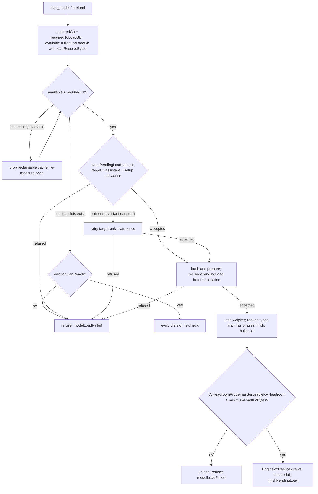

# Hardware support and the provider memory model

> Last updated: 2026-09-05 · commit `02f6af71a`

What hardware the provider runs on and how it decides, in bytes, whether a
model may load and how much KV cache each resident model may use. Read this to
understand why a box refuses a load that "should fit"; for the operator view
(RAM tiers → catalog models) see
[`../provider/hardware-requirements.md`](../provider/hardware-requirements.md).

## Context

The provider is Apple-Silicon-only: the SwiftPM platform floor is declared by
the packages described in
[`components/mlx-swift.md#what-providercore-links`](components/mlx-swift.md#what-providercore-links),
`coordinator/api/install.sh` refuses anything but Darwin on `arm64`, and
`darkbloom start` requires Metal
(`provider-swift/Sources/ProviderCore/Inference/GPUEnforcement.swift`,
`requireMetal`) and a minimum amount of RAM
(`provider-swift/Sources/darkbloom/StartCommand+Preflight.swift`,
`hardware.memoryGb`). There is no hard runtime macOS-version check:
`BootSecuritySnapshot.recommendedMacOSMajorVersion` only turns
`darkbloom doctor` yellow below that major version
(`provider-swift/Sources/ProviderCore/Security/BootSecurity.swift`). The three
values are in [Constants](#constants). Chip
identity is parsed from the brand string into `ChipFamily` ∈ {`M1`, `M2`,
`M3`, `M4`, `M5`, `Unknown`} and `ChipTier` ∈ {`Base`, `Pro`, `Max`, `Ultra`,
`Unknown`} (`provider-swift/Sources/ProviderCore/Hardware/HardwareDetector.swift`,
`parseChipIdentity`; `provider-swift/Sources/ProviderCore/Protocol/Enums.swift`).

Weights, KV cache and activations share unified memory, so the provider owns one
byte-level invariant: `Σ resident weights + KV + activations ≤ hardCapBytes`
(`provider-swift/Sources/ProviderCore/Inference/UnifiedMemoryCap.swift`).

## Mechanism

### Constants

| Symbol | Value | Code |
|---|---|---|
| `recommendedMacOSMajorVersion` | `26` — `darkbloom doctor` warning threshold only, never a gate | `provider-swift/Sources/ProviderCore/Security/BootSecurity.swift` (`BootSecuritySnapshot`) |
| RAM floor at start | `hardware.memoryGb < 8` refuses `darkbloom start` (8 GB) | `provider-swift/Sources/darkbloom/StartCommand+Preflight.swift` |
| `defaultCapFraction` | `0.90` | `UnifiedMemoryCap.swift` |
| `minimumReserveBytes` | `2 * 1024 * 1024 * 1024` (2 GiB OS floor) | `UnifiedMemoryCap.swift` |
| `defaultActivationReserveBytes` | `11 * 1024 * 1024 * 1024 / 2` = 5.5 GiB (since v0.8.0; basis gemma-4 qat-4bit B=8: 5.05 GiB eager / 5.34 compiled + slack) | `UnifiedMemoryCap.swift` |
| `measuredActivationFloorsBytes` | `["gpt-oss-20b": 7 * 1024 * 1024 * 1024 / 2]` = 3.5 GiB; exact catalog-id match only; per-model floors since v0.8.16 | `UnifiedMemoryCap.swift` |
| `minimumLoadKVBytes` | `1 * 1024 * 1024 * 1024` (1 GiB) | `UnifiedMemoryCap.swift` |
| `memoryOverheadFactor` | `1.2`; `estimatedMemoryGb = (sizeBytes / 2^30) * 1.2` | `provider-swift/Sources/ProviderCore/Models/ModelScanner+Discovery.swift` |
| `memory_reserve_gb` | operator config reserve (`memoryReserveGB`); default in [`../provider/cli-reference.md#providertoml-keys-read-by-the-cli`](../provider/cli-reference.md#providertoml-keys-read-by-the-cli) | `provider-swift/Sources/ProviderCore/Config/ProviderConfig.swift` |
| `MLXMemoryGuard.defaultReserveGB` / `defaultCacheLimitGB` | `6` / `8` (soft MLX limits; `cacheFraction = 0.75`, `minimumLimitBytes` 2 GiB) | `provider-swift/Sources/ProviderCore/Inference/MLXMemoryGuard.swift` |

`DARKBLOOM_MEM_CAP_FRACTION` overrides the cap fraction and
`DARKBLOOM_ACTIVATION_RESERVE_GB` raises (never lowers) the activation reserve;
`DARKBLOOM_MLX_MEMORY_RESERVE_GB` and `DARKBLOOM_MLX_CACHE_LIMIT_GB` feed
`MLXMemoryGuard`. Parsing rules and defaults:
[`../reference/configuration.md`](../reference/configuration.md).

### Cap and reserves (`UnifiedMemoryCap`)

```text
hardCapBytes(physical, fraction)
    = min( fraction × physical,
           physical > minimumReserveBytes ? physical − minimumReserveBytes : 0 )

activationFloorBytes(forModelIDs ids)
    = ids.isEmpty ? defaultActivationReserveBytes
                  : max over id of (measuredActivationFloorsBytes[id] ?? defaultActivationReserveBytes)

resolvedCapFraction
    = explicit (clamped to [0, 1])
    → DARKBLOOM_MEM_CAP_FRACTION if finite and > 0 (clamped to [0, 1])   -- ≤ 0 / non-finite ⇒ unset
    → defaultCapFraction

resolvedActivationReserveBytes(modelIDs)
    = explicit
    → floor = activationFloorBytes(modelIDs) (defaultActivationReserveBytes when nil)
      DARKBLOOM_ACTIVATION_RESERVE_GB if finite and > 0: max(gb × 2^30, floor)   -- raise-only
      else floor

loadHeadroomBytes = activations + minimumLoadKVBytes

kvBudgetBytes(physical, Σweights, activations, ramPrefix, configReserve)
    effectiveCap = min(hardCapBytes, physical − configReserve)
    claimed      = Σweights + activations + ramPrefix                       (saturating)
    = effectiveCap > claimed ? effectiveCap − claimed : 0

liveKVHeadroomBytes(physical, mlxUsed, systemAvailable, activations, configReserve)
    effectiveCap = min(hardCapBytes, physical − configReserve)
    realFree     = min(effectiveCap − mlxUsed (clamped ≥ 0), systemAvailable)
    = realFree > activations ? realFree − activations : 0

canAdmit(currentResident, candidate, minimumKV, activations, ramPrefix)
    = currentResident + candidate + activations + ramPrefix + minimumKV ≤ hardCapBytes

loadReserveBytes(configReserve) = max(configReserve, physical − hardCapBytes)

loadIsServeable(measuredLiveKVHeadroomBytes) = measuredLiveKVHeadroomBytes ≥ minimumLoadKVBytes
```

`ramPrefix` is always 0 in production — there is no RAM prefix-cache carve
([`prefix-cache.md`](prefix-cache.md)).

### Load gate (`ModelLoadAdmission`)

```text
defaultLoadHeadroomGb = loadHeadroomBytes() / 2^30
    -- defaultActivationReserveBytes + minimumLoadKVBytes by default;
    -- measuredActivationFloorsBytes["gpt-oss-20b"] + minimumLoadKVBytes for a gpt-oss-20b-only serving set

freeForLoadGb(total, systemAvailable, gpuActive, gpuCache, reserve, outstanding)
    mlxUsed   = gpuActive + gpuCache
    realFree  = min(total − mlxUsed, systemAvailable)
    committed = reserve + outstanding
    = max(0, realFree − committed) / 2^30                    -- no multiplicative discount

maxLoadableWeightGb(total, systemAvailable, mlxUsed, reserve, headroomGb, outstanding)
    reclaimable = min(total, systemAvailable + mlxUsed)
    usable      = reclaimable − (reserve + outstanding)
    = max(0, usable / 2^30 − max(0, headroomGb))

requiredToLoadGb(weightsGb, headroomGb) = max(0, weightsGb) + max(0, headroomGb)
evictionCanReach(available, reclaimable, required) = available + reclaimable ≥ required
fitsAtAllocation(availableNetOfLedger, ownReservation, required) = availableNetOfLedger + ownReservation / 2^30 ≥ required
canLoad(...) = requiredToLoadGb ≤ freeForLoadGb
```

`weightsGb` is the scanner's padded estimate (`sizeBytes / 2^30 ×
memoryOverheadFactor`), so a load needs `weights × memoryOverheadFactor +
activationReserve + minimumLoadKVBytes` of free-for-load memory. The worked
example in the source comment
(`provider-swift/Sources/ProviderCore/Inference/ModelLoadAdmission.swift`)
shows gpt-oss-20b's requirement falling by exactly `defaultActivationReserveBytes
− measuredActivationFloorsBytes["gpt-oss-20b"]` once its measured floor
applies. There is no `× 3.0` headroom rule anywhere in the load path.



(`provider-swift/Sources/ProviderCore/ProviderLoop+ModelLoading.swift`; the
standalone server runs the same sequence in
`provider-swift/Sources/ProviderCore/Server/StandaloneServer.swift`.)

### After the load

- `KVHeadroomProbe.measuredLiveKVHeadroomBytes` (after trimming the cold-load
  buffer cache) must satisfy `loadIsServeable` (≥ `minimumLoadKVBytes`) or the model is
  unloaded and the load rejected
  (`provider-swift/Sources/ProviderCore/Inference/KVHeadroomProbe.swift`).
- `EngineV2KVSizing` and `EngineV2Reslice` assign the admitted
  [KV slot grants](#kv-slot-grants). A paged build must also expose a backend
  ceiling at least `minimumLoadKVBytes`; empty segmented storage can satisfy
  this without allocating pages (`KVHeadroomProbe.postBuildServeable`).
- For contiguous slots, the bridge reserves `prompt + maxTokens` bytes in
  `GlobalKVCacheBudget` before submit ([`inference.md`](inference.md)).
- Reservation age is diagnostic only. `GlobalKVCacheBudget.recordCommitRejection`
  logs sustained rejection and keeps every owner's charge until the caller
  releases it after its resources retire. The asynchronous allocator-cache
  reclaimer remains separate; it cannot refund live request or load ownership.
- `MLXMemoryGuard.recommendedLimits`: `limit = max(minimumLimitBytes, physical −
  reserve)`, `cacheLimit = min(max(minimumLimitBytes / 2, min(limit × 0.75,
  cacheCap)), limit)` — soft MLX guidelines only; the cap above is what
  refuses work.

### KV slot grants

The fleet KV budget is the effective unified-memory cap minus all resident
`SlotSizingSnapshot.weightsBytes`, the resolved serving-set activation reserve,
and any explicit RAM prefix allowance. `weightsBytes` sums loaded target
parameter bytes and retained assistant weights; the scanner's disk-size padding
belongs to load admission, not this runtime grant. Default SSD streaming has no
resident prefix-bank carve (`UnifiedMemoryCap.kvBudgetBytes`,
`provider-swift/Sources/ProviderCore/Inference/SlotSizingSnapshot.swift`).

One model slot receives the full fleet KV budget. With multiple slots,
`EngineV2KVSizing.resliceGrants` divides it in proportion to each model's fp16
owning-full-attention marginal byte rate times context, capped by
`resliceContextCap = 131_072`. If any rate is unknown, all slots receive an equal split. Those fairness
weights do not choose KV precision: native admission separately accounts for the
observed per-layer dtype, window rings, recurrent state and configured MTP state
(`provider-swift/Sources/ProviderCore/Inference/EngineV2Reslice.swift`).

The production paged factory passes that admitted grant to empty segmented
storage. `makeSegmentedPagedBackend` retains the native dtype/owner map,
scheduler chunk geometry and context. Its `segmentSizeBytes = 64 << 20` is an
allocation target, not a slot-capacity ceiling. Native checks still bound each
Metal buffer, kernel page indices and arithmetic. The former provider eager-pool
limits do not cap this path
(`provider-swift/Sources/ProviderCore/Inference/EngineV2Factory+SegmentedBackend.swift`;
`libs/mlx-swift-lm/Libraries/MLXLMCommon/ContinuousBatchingV2/Paged/PagedKVPool.swift`).

A co-resident load shrinks existing grants before building the newcomer. Live
pages, request promises and staging owners remain charged until their real
retirement; shrink does not free them. Existing physical capacity can be reused,
but a slot already above its grant cannot increase its native charge. Unload or
rollback restores the surviving slots' shares, and segmented storage can grow
under the new grant without rebuilding the engine. New backing is reserved
through [process ownership](#process-ownership) before allocation. The bridge
forwards a resize when native `capacity.pagedStorage` is present; only explicit
fixed-reference native fixtures retain a construction-capacity clamp and
`pagedPoolResizeShortfall()`
(`provider-swift/Sources/ProviderCore/Inference/EngineV2Bridge+Resizing.swift`;
`libs/mlx-swift-lm/Libraries/MLXLMCommon/ContinuousBatchingV2/EngineV2.swift`,
`updateKVBytesCapacity`).

| Native capacity field | Meaning |
|---|---|
| `kvBytesCapacity` | Runtime admission ceiling, including target and auxiliary request state |
| `kvBytesBackendCapacity` | Mutable backend grant for segmented/contiguous storage; physical capacity only for a fixed-reference pool |
| `pagedStorage.committedBytes` | Allocator-backed segmented residency, which can temporarily exceed a shrunk grant |
| `pagedStorage.overGrantBytes` | Committed backing above the current grant; ownership still has to retire |

These fields are defined by
`libs/mlx-swift-lm/Libraries/MLXLMCommon/ContinuousBatchingV2/CBv2Contracts.swift`
(`CBv2CapacitySnapshot`) and `Paged/PagedKVGrant.swift`
(`PagedKVStorageSnapshot`). A logical grant does not waive the post-load
serviceability floor or later shared OS/activation headroom checks.

### Process ownership

`GlobalKVCacheBudget` keeps policy, request/load correlation and diagnostics.
`ProcessMemoryLedger` serializes byte admission; typed pending-load handles
prevent delayed cleanup from releasing a newer load with the same string ID.
A load retains its setup allowance through final slot installation. Completed
weight phases reduce their promise because the coherent allocator reading now
includes those weights; process-wide before/after differences never create
materialization credit.

For each native engine connected through `EngineProcessMemoryOwner`, Admission
publishes `C = max(P, N) + A + X`: native segment commitments, active target KV
promises, auxiliary state and temporary stages. New promises are accepted before
allocation or native metadata changes. Only evaluated backing with an explicit
owner earns materialized coverage `M`, with `0 ≤ M ≤ C`. The process projects
`U + Σ(C − M)`, where `U` is one coherent active-plus-cache reading, under the
existing cap, OS-availability and activation-reserve policy. It never subtracts
one engine's pages from another engine's promise.

A paged segment's shared backing carries one coverage handle through checkpoint
rebasing. Withdrawal precedes buffer/alias retirement and charge reduction;
retained raw aliases remain charged through `U`. Closing blocks new growth while
allowing already reserved allocations and mandatory cleanup. No destructor or
age threshold returns live byte promises. Allocator initialization runs before
the ledger lock and before a native Admission can call the provider adapter.

The production factory binds an empty segmented paged pool to this owner before
constructing EngineV2. Its bridge skips duplicate per-request reservations;
contiguous slots retain their existing provider reservation path. Recurrent and
MTP auxiliary state stays charged without materialization credit. Current load
and provider headroom readers use the same shared ledger.
Native segmented allocation reserves an allocator-owned upper bound for each
new backing before construction, including rounding and permitted cached-buffer
reuse. After evaluating and draining the captured allocation stream, the fresh
full-buffer owner records actual allocator bytes. Growth and staged adoption
settle their provisional charge downward to that footprint while preserving the
full request promise and rollback identity. Logical page counts, offsets and
usable slack remain separate from allocator padding. Metadata read through a
view never creates another materialization credit.

The bound covers one buffer. Complete checkpoint capture/import separately
prices zero-fill intermediates, retained recurrent backing, MTP state and
metadata. Shared SSD reads and writes claim bounded host buffers before I/O or
encoding; native destinations remain under Admission. Host buffers drain before
their permit returns. Native owners retain completion and retirement barriers;
allocator-active aliases remain visible in U after their coverage retires. Physical
backing is measured once per owned buffer, while logical page geometry remains distinct
from allocator padding. Exact-model capacity and latency remain separate from
[allocator foundation tests](../reports/2026-09-05-allocator-footprint.md).
Implementation: `libs/mlx-swift/Source/MLX/AllocationFootprint.swift`
(`allocationFootprintUpperBound`, `evaluatedBufferInfo`) and
`libs/mlx-swift-lm/Libraries/MLXLMCommon/ContinuousBatchingV2/Paged/PagedKVSegments.swift`
(`PagedKVSegmentLayout.allocationBytes`, `PagedKVSegmentBacking`).
Implementation: `provider-swift/Sources/ProviderCore/Inference/ProcessMemoryLedger.swift`
(`replaceCharge`, `recordMaterialization`, `withdrawCoverage`),
`GlobalKVCacheBudget+PendingLoads.swift` (`claimPendingLoad`, `recheckPendingLoad`),
`EngineProcessMemoryOwner.swift`, and
`libs/mlx-swift-lm/Libraries/MLXLMCommon/ContinuousBatchingV2/AdmissionV2.swift`.

### Coordinator mirror

The coordinator predicts servability with its own copy of the cap fraction,
activation floors and per-model table (`coordinator/registry/servability.go`:
`servabilityActivationFloorGB`, `servabilityLegacyActivationFloorGB`,
`servabilityActivationFloorMinVersion`, `servabilityPerModelFloorMinVersion`,
`servabilityModelActivationFloorsGB`, `servabilityMeasuredResidentGiB`;
`coordinator/registry/scheduler.go`, `coldLoadCatalogGBToMemGiB`). The doc
comment on `defaultActivationReserveBytes` requires the provider and
coordinator tables to move in the same commit. The coordinator's arithmetic and
its use in admission are described once, in
[`routing.md`](routing.md); this page does not restate them.

## Invariants

1. New KV charges must fit the current unified cap, OS availability and activation
   reserve. Existing owners survive later pressure until retirement; debt blocks
   new growth — `UnifiedMemoryCap.liveKVHeadroomBytes`, `ProcessMemoryLedger.replaceCharge`.
2. The cap never leaves the OS less than `minimumReserveBytes` — `hardCapBytes`
   takes `min(fraction × physical, physical − minimumReserveBytes)`.
3. The activation reserve is raise-only from the environment —
   `resolvedActivationReserveBytes` returns `max(env, floor)`.
4. A measured per-model floor applies only to an exact catalog id, and a mixed
   serving set takes the `max` over its models — `activationFloorBytes`.
5. A load passes only if `weights × memoryOverheadFactor + activations +
   minimumLoadKVBytes ≤ freeForLoadGb` and, after loading, measured live KV
   headroom is ≥ `minimumLoadKVBytes` — `canLoad`, `loadIsServeable`,
   `KVHeadroomProbe.hasServeableKVHeadroom`.
6. Load-time re-slicing refuses a newcomer if any resulting engine share falls
   below `minimumServiceableGrantBytes`; shrink preserves existing ownership —
   `EngineV2KVSizing.resliceMeetsServiceabilityFloor`, `AdmissionV2.updateBytesCapacity`.
7. `freeForLoadGb` applies no multiplicative discount; the only padding is the
   scanner's `memoryOverheadFactor` on weights — `ModelLoadAdmission.swift`,
   `ModelScanner+Discovery.swift`.

## Failure modes

| Symptom | Cause | Where |
|---|---|---|
| `darkbloom start` exits: "At least … GB is needed to serve any model" | `hardware.memoryGb` below the RAM floor in [Constants](#constants) | `StartCommand+Preflight.swift` |
| Start refused: Metal unavailable | `GPUEnforcement.requireMetal()` threw | `GPUEnforcement.swift` |
| Load refused: "… need N GB to serve — unloaded" | Post-load `hasServeableKVHeadroom` false (live KV headroom below `minimumLoadKVBytes`) | `ProviderLoop+ModelLoading.swift`, `KVHeadroomProbe.swift` |
| Load refused with `no_kv_headroom` | Slot KV sizing overflowed or no serviceable grant during construction | `EngineV2Config.swift` (`EngineV2RefusalReason.noKVHeadroom`), `EngineV2SlotFactory.swift` |
| Catalog says the tier fits, provider refuses | Static cap arithmetic passes but `freeForLoadGb` (real free minus `loadReserveBytes` and in-flight reservations) is below `requiredToLoadGb` | `ModelLoadAdmission.swift`, `ProviderLoop+ModelLoading.swift` |
| New request cannot fit | Its complete request promise exceeds the slot grant, or live ownership/OS pressure leaves no process headroom | `AdmissionV2.swift`, `ProcessMemoryLedger.swift` |
| Raising `DARKBLOOM_ACTIVATION_RESERVE_GB` shrinks KV, lowering it does nothing | Raise-only semantics | `UnifiedMemoryCap.swift` (`resolvedActivationReserveBytes`) |
| `darkbloom doctor` warns about macOS | Below `recommendedMacOSMajorVersion` ([Constants](#constants)); warning only | `BootSecurity.swift` |

## Code map

| Concern | File / symbol |
|---|---|
| Cap, reserves, floors | `provider-swift/Sources/ProviderCore/Inference/UnifiedMemoryCap.swift` |
| Load gate | `provider-swift/Sources/ProviderCore/Inference/ModelLoadAdmission.swift` |
| Post-load probe | `provider-swift/Sources/ProviderCore/Inference/KVHeadroomProbe.swift` |
| Slot KV sizing and re-slice | `provider-swift/Sources/ProviderCore/Inference/EngineV2KVSizing.swift`, `provider-swift/Sources/ProviderCore/Inference/EngineV2Reslice.swift` |
| Process-wide KV ledger | `provider-swift/Sources/ProviderCore/Inference/GlobalKVCacheBudget.swift` |
| MLX soft limits | `provider-swift/Sources/ProviderCore/Inference/MLXMemoryGuard.swift` |
| Padded weight estimate, quantization | `provider-swift/Sources/ProviderCore/Models/ModelScanner+Discovery.swift` |
| Platform and hardware gates | `provider-swift/Package.swift`, `provider-swift/Sources/darkbloom/StartCommand+Preflight.swift`, `provider-swift/Sources/ProviderCore/Inference/GPUEnforcement.swift`, `provider-swift/Sources/ProviderCore/Hardware/HardwareDetector.swift`, `provider-swift/Sources/ProviderCore/Security/BootSecurity.swift` |
| Coordinator mirror | `coordinator/registry/servability.go`, `coordinator/registry/scheduler.go` |
| Measurements behind the floors | `docs/reports/2026-08-30-activation-floor-measurements.md` |

## Related

- [`../provider/hardware-requirements.md`](../provider/hardware-requirements.md) — RAM tiers and catalog models, for operators
- [`inference.md`](inference.md) — per-request KV reservation
- [`prefix-cache.md`](prefix-cache.md) — KV layouts and the SSD tier's RAM staging
- [`routing.md`](routing.md) — coordinator servability predictor
- [`components/mlx-swift.md`](components/mlx-swift.md) — the pinned MLX stack and the SwiftPM platform floor
- [`../design/activation-reserve-overhaul-plan.md`](../design/activation-reserve-overhaul-plan.md) — the plan that introduced per-model floors
