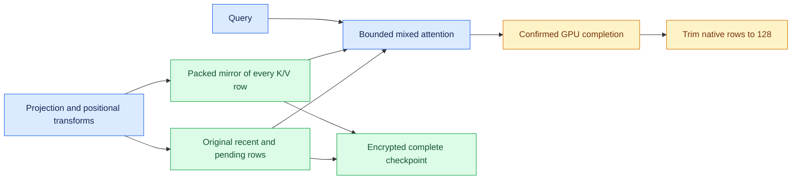

# Runtime KV cache quantization

> Last updated: 2026-10-09

The provider uses `balanced` attention-cache precision by default for supported
models except MiMo. This page explains its storage, inference and restore
contracts; the change is prepared for review and has not been released.
The [CLI reference](../provider/cli-reference.md) describes precision overrides.

## Context

Attention history consumes unified memory and encrypted SSD write capacity.
Weight quantization does not determine cache precision. The provider resolves
attention geometry and native FP16, BF16 or FP32 storage from the loaded model,
then selects one cache profile at load time. MiMo's SDK-owned path always uses
native cache precision.

## Mechanism

`balanced` uses four-bit keys and values, affine groups of 64, and FP32 scale
and offset metadata. Keys receive a deterministic normalized signed Hadamard
rotation after projection and positional transforms. Its block width is the
smaller of 128 and the largest power-of-two divisor of the key width. Queries
use that basis when reading packed history; values keep their original basis.
The newest 128 confirmed tokens and all current prefill/speculative tokens
retain their original native values. Attention combines both representations
within bounded online-softmax tiles, without expanding full history.

Windows of at most 128 tokens stay native. Longer windows use packed backing;
an oversized prefill preserves the bounded pre-write window before ring writes.
Shared layers borrow the owner's storage and do not allocate another cache.
Qwen4 compact sparse attention decodes only selected historical rows, inversely
rotates keys and overlays original recent rows; it keeps the existing sparse
selection and bounds the decoded output to that selection.
Recurrent, convolution and assistant state stay native. When Gemma's assistant
is active, its last owning full and sliding target rows also stay native because
the assistant reads those arrays directly. Remaining eligible Gemma rows use
the selected profile.

DiffusionGemma reads packed committed history alongside its native ephemeral
canvas. A denoising pass does not append canvas state; encoder commits occur
only after their actual evaluation completes. Ordinary quantized decode does
not chain a successor while its predecessor's native generation retires.
Adaptive MTP uses the measured isolated ordinary-decode baseline when that
backend cannot chain. Native targets retain their measured chained-commit
baseline (`CBv2MTPRoundDriver.build`, `PagedKVBackend.supportsOrdinaryDecodeChaining`).
Vision-capable DiffusionGemma pools quote the existing whole-visual-block bound
before allocation; the text chunk and canvas bounds remain independently
enforced (`DiffusionGemmaPrefillGeometry.maximumVisualBlockTokens`,
`DiffusionGemmaProviderBridge.makePagedConfiguration`).

## Invariants

1. **Actual storage owns admission.** Physical rows include codes and metadata
   for every stored token, plus the original native recent/pending band.
   Segment padding, poison pages, native generations and bounded workspace
   are charged before allocation and retained through completion. Existing
   weight, OS, activation and minimum serviceability safeguards remain in
   force (`PagedKVQuantizationAdmission.swift`, `PagedKVNativeRecent.swift`,
   `PagedQuantizedAttentionWorkspace.swift`). `EngineV2` derives packed rates
   and the original-band feasibility minimum at construction; an already
   derived provider configuration retains its independent caller allowance
   without adding that band twice.
2. **Committed history is not requantized on restore.** Both the packed mirror
   and the exact native recent band enter each complete checkpoint. Its two
   K/V byte streams contain all packed rows per head, then the native band.
   The mirror of that band is ready when its tokens age out; import invokes no
   second encoder (`QuantizedCheckpointLayout.swift`,
   `PagedCheckpointTensorSource.swift`, `PagedCheckpointStorage.swift`).
   Packed historical attention capture offers only a whole prefill step's
   frontier. Interior stride/hint cuts are omitted because cold inference
   still reads that step's original pending rows, whereas restored history
   retains the confirmed recent band
   ([`prepareHistorical`](../../libs/mlx-swift-lm/Libraries/MLXLMCommon/ContinuousBatchingV2/Prefix/EngineLoopV2+HistoricalCheckpoint.swift)).
3. **Private import inputs are not page credit.** Native-band DTOs stay charged
   as input scratch until the active row's separately charged copy completes.
   Only physical page destinations transfer into the pool floor
   (`CompleteCheckpointImportPlan.swift`, `PagedCheckpointFrame.swift`).
4. **Numerical identities describe resolved storage.** Original dtype, codec
   version, key/value bits, rotation, recent length and native-owner exemptions
   enter the checkpoint identity. Native and packed layouts occupy distinct
   namespaces (`CompleteCheckpointStorageIdentity.swift`,
   `PrefixCachePolicy+CheckpointIdentity.swift`).
5. **Native rollback stays available.** `native` retains existing backend
   selection. Quantized precision requires paged storage and refuses an
   unavailable or explicitly disabled backend. MiMo remains native regardless
   of a precision override (`EngineV2KVQuantizationPolicy.swift`).

The SDK symbols above live under
`libs/mlx-swift-lm/Libraries/MLXLMCommon/ContinuousBatchingV2/`; provider identity
and policy files live under `provider-swift/Sources/ProviderCore/Inference/`.

## Failure modes

Unsupported precision or geometry fails before serving. A reservation refusal
does not write uncharged cache bytes. Evaluation failures retain submitted
owners through a real stream drain; cleanup never evaluates failed graphs to
manufacture completion.

Untyped native tensor snapshots and the resident page index have no exact
native-band restoration contract, so quantized slots bypass those paths.
Eligible AR models retain encrypted complete packed checkpoint reuse.
DiffusionGemma's legacy resident/durable native snapshot cache returns
`unsupported_layout` for packed precision until its separate native-block
checkpoint contract supports packed state. Native overrides retain those
existing cache paths. This scope prevents lossy decoded state from being
presented as original recent values.
The SDK rejects the same unsupported Diffusion native-prefix pairing during
construction and before direct restoration, rather than partially allocating
or accumulating original tails. `PagedKVBackend.prefixReuseBackend` also
disables the generic legacy tensor cache when any owner is actually packed;
native exemptions and typed complete-checkpoint consumers retain their own
capability contracts.

Legacy native performance/deadline profiles do not qualify packed execution.
The paged kill switch and a same-version crash-loop guard also refuse packed
construction; set precision to `native` to use their existing contiguous
recovery path. Model startup probes selected native and packed kernel families
in a bounded child process before populating the parent's kernel cache and
publishing storage. This makes child compiler/driver failures catchable.
`darkbloom benchmark --runtime-generation` exercises the production AR slot
and records resolved precision, raw output, memory and timing. Ordinary scalar
AR benchmarks use a different cache path. Native-block Diffusion benchmarks
exercise their production engine directly. Host-observed cache samples do not
measure every transient; MLX peak measurements are reported separately.

Signed scheduler-prefill decision reports use schema `4` and bind
`resolvedKVQuantization` on every measured cell and in `reproducibility` to the
constructed engine's canonical `balanced`, `k8v4`, `k8v8` or `native` profile.
The runtime snapshot's global and per-model configuration reaches construction;
an explicit environment or CLI override takes precedence, and MiMo remains
native before override parsing. The existing decision matrix accepts only
`qwen3_5_moe`; this provenance does not extend its model-family qualification
scope. Simulation leaves precision absent. Missing, unknown, mixed or
backend-incompatible live precision yields insufficient evidence. Historical
reports remain readable but cannot clear the current signed decision gate,
which rechecks the measured cells and model/source/binary identity rather than
trusting an encoded success. Global release certification remains false
([`SchedulerPrefillDecisionReport`](../../provider-swift/Sources/ProviderBenchmark/SchedulerPrefillDecisionReport.swift),
[`SchedulerPrefillDecisionKVProvenance`](../../provider-swift/Sources/ProviderBenchmark/SchedulerPrefillDecisionKVProvenance.swift),
[`SchedulerPrefillDecisionExitStatus.value`](../../provider-swift/Sources/ProviderBenchmark/SchedulerPrefillDecisionEvaluator.swift)).

## Code map

| Concern | Owner |
|---|---|
| Default and load-time overrides | `EngineV2KVQuantizationPolicy.swift` (`resolve`) |
| Model/backend composition | `EngineV2Factory+BackendPreparation.swift` (`prepareProductionBackend`) |
| Token-local encoding | `PagedKVQuantization.swift`, `PagedQuantizedTransfers.swift` |
| Mixed inference and masks | `PagedQuantizedAttention.swift`, `PagedQuantizedLayerOperation.swift` |
| Compact Qwen4 selected rows | `PagedQuantizedSelectedGather.swift` |
| Bounded startup compilation | `PagedQuantizedKernelSmoke.swift`, `PagedKernelPreflight.swift` |
| Native-band lifecycle | `PagedKVNativeRecent.swift`, `PagedKVQuantizedStepRetirement.swift` |
| Exact checkpoint band capture | `QuantizedCheckpointRecent.swift` |
| Packed complete formats | `CompleteCheckpointContract.swift`, `QuantizedCheckpointLayout.swift` |
| Diffusion committed cache and canvas | `DiffusionGemmaRequestCache.swift`, `DiffusionGemmaBlocks.swift`, `NativeBlockPagedExecution.swift` |

## Related

- [Inference architecture](inference.md)
- [Prefix cache architecture](prefix-cache.md)
- [SSD format reference](../reference/ssd-kv-cache.md)
- [Initial numerical investigation](../design/runtime-kv-compression.md)
- [Real-model and encrypted-cache qualification](../reports/2026-10-09-runtime-kv-quantization.md)
