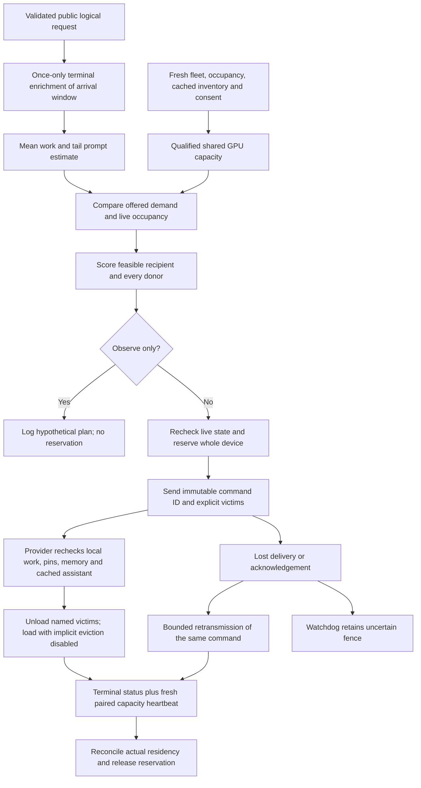

# Opt-in model autopilot

> Last updated: 2026-09-11 · commit `c7fda9228`

Model autopilot manages GPU residency on explicitly enrolled providers, using
cached models and measured network workload. It fills deficits in useful,
deadline-qualified capacity and names every model it may unload. Configuration
and consent are separate gates; the controller ships disabled and observation-only
by default ([configuration](../reference/configuration.md#model-autopilot)).

## Context

The [48-hour evidence](../reports/2026-09-11-autopilot-capacity-evidence.md) found
that exhausted first-content deadlines dominated 429s and that most sampled
attempts selected already resident weights. A count of machines, resident models
or retry attempts therefore does not measure capacity that can serve the offered
work. Autopilot complements routing and provider admission; it does not promise
a particular reduction in 429s.

Provider `--all` and an empty enabled-model list describe advertised local
inventory, not consent. `darkbloom autopilot enable` saves explicit consent for
the next provider restart. Private-only providers do not enroll. Once enrolled,
network requests use confirmed warm models and legacy cold-load commands are
blocked, even when the coordinator controller is disabled or observing. The
provider's ordinary idle-unload timer is paused. Shadow computation itself does
not change residency; provider enrollment changes who owns residency decisions.

Sources: `coordinator/registry/model_management_routing.go`
(`providerAutopilotRoutingBlockedLocked`, `providerLegacyModelChangesBlockedLocked`);
`provider-swift/Sources/darkbloom/AutopilotCommand.swift` (`Autopilot`);
`provider-swift/Sources/ProviderCore/ProviderLoop+IdleTimeout.swift`
(`startIdleMonitor`).

## Mechanism

### Work and capacity

`coordinator/api/autopilot_demand.go` gives each validated public logical request
one terminal sample, independent of retries and speculative attempts. Scoped
owner/serial traffic, account rejections and intrinsic invalid envelopes do not
become public placement pressure. Honest short requests remain eligible samples.
The registry groups samples by original `ReceivedAt`, handles out-of-order
completion and expires old arrivals. It retains bounded model and time buckets,
not identities or prompts (`coordinator/registry/autopilot_demand.go`).

`PromptTokens` is mean offered prompt work; `TailPromptTokens` is a conservative
p90 histogram bound used for deadline fit. Actual completed output and valid warm
service duration have independent sample counts, so a completed cold request can
teach output length without pretending to provide warm service timing. Terminal
enrichment is delayed: the controller covers unfinished work using the maximum
of offered work and live occupancy, never their sum.

`coordinator/registry/autopilot_snapshot.go` (`autopilotModelFitLocked`) combines
per-model/solo TPS, observed prefill, quality concurrency, reliability history,
thermal state, CPU and memory pressure, and first-content policy. Catalog/runtime,
trust, dedication, vision, tool-choice/grammar capabilities and memory gates still
apply. M5/NAX requirements come from
catalog capabilities, not a hardcoded generation ranking. Unknown load duration
uses the configured prior; a reported slot load duration can replace that prior.

`coordinator/registry/autopilot_planner.go` allocates at most one GPU's time across
co-resident workloads. Deadline-infeasible residents retain ownership and can
consume time, but earn no useful capacity credit. Pending operations are future
capacity, never protection for a donor needed now. Each model uses one fixed
reference value for recovered work; slower recipients cannot receive a higher
benefit simply because they take longer to execute an identical request.

### Placement and unloading

A candidate must be enrolled, idle across the device, fresh and outside pending
operations/backoff. The planner prefers a feasible placement with useful benefit
after load and displacement costs, preserving scarce capabilities for unmet
restricted models. It protects every affected donor, including retained
co-residents fenced during the transition. Warm-pool operator floors remain
inputs; a pending copy does not replace present donor coverage.

A load that already fits needs no victim. Otherwise the planner selects explicit
unpinned residents whose residence and idle dwell have elapsed. Incoming weight
estimates include load padding; reclaim credit uses actual resident ownership,
not scanner padding or an OS RSS measurement. The provider repeats total-victim
feasibility before its
first mutation, then calls `ensureModelLoaded` with `allowEviction: false`.
Required enabled MTP assistants must also be verified locally before victims are
removed. Autopilot commands neither download missing model/assistant artifacts
nor delete cached disk files.

Standalone idle unloading is separately disabled by default. When enabled, it
requires sustained quiet, the configured idle/dwell limits, device memory
pressure, zero live device work, no protected floor loss and no pinned victim.
The exact defaults and fixed thresholds are in the
[configuration reference](../reference/configuration.md#model-autopilot).

Desired-build release policy remains independent. Its prefetch/reconciliation is
deferred behind an active autopilot owner, then resumed. Explicitly superseded,
no-longer-advertised residents have a separate cleanup path so pausing the idle
timer does not retain obsolete builds forever. Cleanup preserves pins and live
request/local/MTP ownership and does not infer retirement merely from a missing
catalog entry (`provider-swift/Sources/ProviderCore/Autopilot/ProviderLoop+ReleaseCleanup.swift`,
`cleanupAutopilotSupersededModels`).

## Algorithm choice and advancement gates

The implemented policy is a bounded workload-weighted greedy search with
switching costs. This is a design choice under the measured telemetry limits,
not a claim of global optimality or a queue-stability theorem.

| Approach | Status | Fit for this network and next gate |
|---|---|---|
| Machine-count deficit | Baseline only | Simple to inspect, but treats unequal machines and shared resident slots as interchangeable. Retain as a replay control, not the production capacity objective. |
| Workload-weighted greedy with switching costs | **Implemented** | Choose a feasible move using deadline-qualified service, cached artifacts, fixed per-model work value, load cost, donor coverage and scarce capabilities. Recheck every move against current reservations; no long-range forecast is required. |
| Queue/backpressure or virtual deficit queues | Deferred | Could prioritize persistent unmet work and fairness across models. First establish unique logical backlog and starvation measurements; retry counts cannot be queue arrivals. [Neely's framework](https://link.springer.com/book/10.1007/978-3-031-79995-2) covers max-weight, virtual queues and cost/delay tradeoffs; its guarantees do not automatically apply to this controller. |
| Rolling-horizon optimization | Deferred | Repeated constrained optimization could coordinate several placements using forecasts of demand, load time and future availability. [Receding-horizon control](https://web.stanford.edu/~boyd/papers/code_gen_rhc.html) provides that formulation; first validate these forecasts and strict solver-time/fallback bounds on our workload. The current one-step search is not MPC. |
| Learned quality/load ranking | Deferred beyond current measured-rate estimates | Consider improving prediction calibration before learning a placement policy. Require timestamped exposure/outcome data, drift checks and held-out calibration; do not explore destructive placements on live providers to collect labels. |

Cache locality and startup cost are supported design considerations in
[ServerlessLLM](https://www.usenix.org/conference/osdi24/presentation/fu).
Its system and published speedups are not performance claims for Darkbloom.
Our first release keeps downloads outside autopilot and uses explicit load-time
priors where completed-load measurements are missing.

The retained hourly replay modestly favored its cost-aware simulator policy in aggregate
while weakening restricted-model coverage; aggressive surplus release increased
churn and reduced modeled coverage. Together with missing engine segments on
timed-out requests and sparse cold-load samples, that supports conservative
switching and explicit per-model gates, not tuning a more complex optimizer to
an assumed causal model. See the [measurement limits](../reports/2026-09-11-autopilot-capacity-evidence.md).

Advance a deferred method only after event-level, chronological replay preserves
actual arrivals, departures, drains, failure outcomes and paired capacity;
measured load distributions and prediction errors hold up on later windows;
and a shadow comparison improves per-model completion/deadline quality without
unacceptable churn, donor loss or restricted-hardware starvation. Promotion
still requires bounded canary validation and the same ownership/safety gates.

## Invariants

1. **Consent is explicit.** Missing state grants no control; the provider setting
   and operator active-controller setting are both required for new commands.
   `autopilot_config.go` (`DefaultAutopilotConfig`),
   `coordinator/registry/model_management_routing.go` and
   `provider-swift/Sources/ProviderCore/Autopilot/ModelAutopilotSettings.swift` enforce their
   respective sides.
2. **Reservation owns the whole device.** Current session, capacity sequence,
   resident set, donor coverage and operation limits are rechecked before
   `autopilotPending` is installed. Network admission and competing legacy model
   changes respect that ownership (`coordinator/registry/autopilot_commands.go`,
   `reserveAutopilotAction`; `coordinator/registry/model_management_routing.go`).
3. **Only named victims may be removed.** The provider validates all victims,
   pins, dwell, leases, cache presence and total memory feasibility, then refuses
   implicit eviction (`provider-swift/Sources/ProviderCore/Autopilot/ModelAutopilotPolicy.swift`,
   `rejection`; `provider-swift/Sources/ProviderCore/ProviderLoop+Autopilot.swift`,
   `runModelAutopilot`).
4. **Acknowledgement is not capacity.** Only a later accepted capacity sequence
   paired with the same terminal command ID and a matching resident set releases
   the reservation. Stale/mismatched status cannot manufacture warm capacity
   (`coordinator/registry/autopilot_provider_state.go`,
   `reconcileAutopilotHeartbeatLocked`).
5. **Retries preserve identity and expiry.** Bounded sends reuse the exact
   command. An unseen expired command fails; an active/completed identical
   command reports its known result. Watchdog expiry retains uncertainty rather
   than assuming rollback (`coordinator/registry/autopilot_retries.go`,
   `retryAutopilotCommands`; provider `handleModelAutopilot`).
6. **Shared work is not multiplied.** Logical demand excludes retry
   multiplication; occupancy overlaps offered work; co-resident capacities share
   GPU time; useful floors count qualified contributions
   (`coordinator/registry/autopilot_demand.go`, `autopilot_planner.go`).

## Failure modes and estimation limits

| Condition | Behavior and limit |
|---|---|
| Coordinator remains disabled/shadow after provider enrollment | No autopilot loads are issued; the enrolled provider still uses managed residency rules and warm-only network admission. Enrollment is not a no-op. |
| State, capacity sequence or resident set changes | Replan/reject; provider rechecks after suspension and before mutation. |
| Missing primary or required assistant cache | Reject before victim mutation; operator/release inventory preparation remains separate. |
| Load fails after some victims were removed | Report failure and reconcile actual remaining capacity. The operation is not an atomic rollback to the old resident set; disk files remain available. |
| Ambiguous write, lost status or watchdog expiry | Keep the fence; repeat only the bounded identical command. A first-send queue-full proof that nothing was enqueued is a distinct safe cleanup path. |
| Sparse, stale or missing measurements | Fall back conservatively or exclude the candidate; service and load priors are estimates, not measured distributions. |
| Deadline failures, invalid requests or external traffic changes | Additional residency may not help. Track logical completion, first-content failures and request shape separately from placements. |

The model uses aggregate recent workload and a mean/p90 shape approximation,
not a full queueing forecast or a simulation of every multimodal request. The
[retained 14-day replay](../reports/2026-09-11-autopilot-capacity-evidence.md#conditional-machine-quality-and-loading-uncertainty)
is a coarse counterfactual, not production uplift evidence.

A local, uncontended 1,000-provider × 8-build benchmark of the implementation
measured reservation around **3.2ms** (sample p95 around **3.6ms**) and a complete
tick around **10.97ms** (sample p95 around **11.55ms**). The reservation benchmark
includes snapshot/replanning under the registry write lock; the tick uses a fake
sender. These are local development measurements, not production lock-tail or
request-latency claims (`coordinator/registry/autopilot_controller_benchmark_test.go`,
`BenchmarkAutopilotControllerFleet1000`).

## Code map

| Concern | Source / symbols |
|---|---|
| Startup, settings and tick summaries | `coordinator/registry/autopilot_config.go`, `autopilot_controller.go`; `StartAutopilotController`, `tick`, `AutopilotSnapshot` |
| Logical request capture and observations | `coordinator/api/autopilot_demand.go`; `beginAutopilotDemand`, `finishAutopilotDemand`, `observeAutopilotCompletion` |
| Arrival windows and independent sample counts | `coordinator/registry/autopilot_demand.go`; `record`, `snapshot` |
| Fleet predicates and quality fit | `coordinator/registry/autopilot_snapshot.go`; `autopilotFleetSnapshotLocked`, `autopilotModelFitLocked` |
| Useful coverage, victim selection and benefit | `coordinator/registry/autopilot_planner.go`; `autopilotCoverage`, `autopilotVictims`, `planAutopilotAction` |
| Reservation, retries and heartbeat reconciliation | `coordinator/registry/autopilot_commands.go`, `autopilot_retries.go`, `autopilot_provider_state.go` |
| Provider command ownership and release cleanup | `provider-swift/Sources/ProviderCore/ProviderLoop+Autopilot.swift`; `provider-swift/Sources/ProviderCore/Autopilot/ProviderLoop+ReleaseCleanup.swift` |
| Consent and wire | `provider-swift/Sources/darkbloom/AutopilotCommand.swift`; `coordinator/protocol/model_autopilot.go`; `provider-swift/Sources/ProviderCore/Protocol/ModelAutopilot.swift` |

## Related

- [Operator rollout and rollback](../operations/model-autopilot.md)
- [CLI consent and pins](../provider/cli-reference.md#darkbloom-autopilot)
- [Wire contract](../reference/protocol-messages.md#model_autopilot)
- [Configuration and timing defaults](../reference/configuration.md#model-autopilot)
- [Measured capacity and 429 evidence](../reports/2026-09-11-autopilot-capacity-evidence.md)
