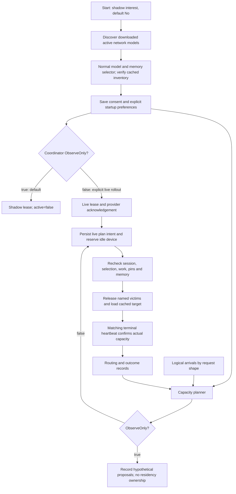

# Experimental model Autopilot

> Last updated: 2026-10-03

Autopilot observes demand for an explicitly approved cached model inventory and
can manage their memory residency during a separately enabled live rollout.
Provider enrollment defaults to off; startup opt-in records interest/consent for
the default shadow rollout, not active control. Files remain on disk.

## Context

Cached models are not necessarily loaded, and loaded models on one Mac share
its GPU and KV budget. Live Autopilot chooses among cached models to improve
utilization while preserving active requests, local reservations, pins and donor
coverage. It does not guarantee utilization gains or higher earnings. Downloads
remain separate operator actions, never part of Autopilot enrollment or refresh.

## Mechanism

```mermaid
flowchart TD
  A["Start: shadow interest, default No"] --> B["Discover downloaded active network models"]
  B --> C["Normal model and memory selector; verify cached inventory"]
  C --> D["Save consent and explicit startup preferences"]
  D --> E{"Coordinator ObserveOnly?"}
  D --> G["Capacity planner"]
  F["Logical arrivals by request shape"] --> G["Capacity planner"]
  E -->|"true: default"| S["Shadow lease; active=false"]
  E -->|"false: explicit live rollout"| V["Live lease and provider acknowledgement"]
  V --> H
  G --> R{"ObserveOnly?"}
  R -->|"true"| P["Record hypothetical proposals; no residency ownership"]
  R -->|"false"| H["Persist live plan intent and reserve idle device"]
  H --> I["Recheck session, selection, work, pins and memory"]
  I --> J["Release named victims and load cached target"]
  J --> K["Matching terminal heartbeat confirms actual capacity"]
  K --> L["Routing and outcome records"]
  L --> G
```

### Enrollment and ownership

`Start.resolveAutopilotChoice` asks once on the normal interactive start path.
Blank/EOF means No. Answering Yes records interest/consent for shadow observation;
it does not activate automatic residency changes. `--autopilot` records explicit
scripted consent for the same cached-inventory flow; `--all` is compatible but
cannot bypass network eligibility. `--model` still selects the initial hosted
models and is compatible with enrollment.

Every normal interactive start asks Yes/No again with the saved enrollment as
the default; the first default is No. Automatic restarts retain the saved choice.
Both answers retain the ordinary model picker and idle-policy prompt; explicit
`--model` and `--all` keep their normal selection behavior. The picker may download
models the operator explicitly selects. Autopilot then discovers already-cached
active network builds and verifies their manifest or matching registry weight
hash, without adding downloads itself. Arbitrary local/off-catalog, retired,
ineligible, malformed, stale or unverified builds are excluded. Empty inventory,
or failure to verify any selected startup model, fails before persistence or drain
(`Start.prepareModelSelection`, `Start.downloadedAutopilotInventory`).

`saveAutopilotEnrollment` records verified exact IDs after an existing provider
has drained. The ordinary selector separately saves the operator’s chosen
startup models and idle policy; enrollment itself does not rewrite those preferences.
An explicit `--idle-timeout` remains an operator-requested override, not an
enrollment side effect. Restarts retain the recorded choice and inventory.
Existing consent also retains `paused` through ordinary start, `enable` and
inventory refresh; only explicit `resume` resumes it. New/default-off enrollment
starts unpaused (`saveAutopilotEnrollment`).

`ModelAutopilotSettings.selectedModels` is an exact-build allowlist. An empty list
cannot enroll, and another model appearing on disk cannot expand permission.
The provider sends this verified network inventory separately in
`register.autopilot_inventory`. The ordinary `models` advertisement remains the
normal picker or explicit command-line selection. Waiting and shadow enrollment
therefore cannot expand routing, cold loads, prefetches, startup preloading or
the activation-memory reserve. Only an acknowledged, unexpired live lease permits an explicit placement
command to make its named target loadable. The target is published under the
reslice gate after survivor validation and a reserve raise; a lease or snapshot
alone never expands the loadable set. Expiry, disconnect, pause and opt-out restore
the ordinary selection. Accepted operations retain ownership until completion.
The coordinator stores observation-only metadata with a separate permission
marker: `providerOrdinaryModelAllowedLocked` fences public and owner routing,
capacity and legacy commands, while `providerPassesAutopilotGatesLocked` lets the
planner inspect candidates through the same remaining safety gates. Dedicated-model
checks project the permission set after activation; a mixed cached inventory can
therefore be excluded from a hypothetical plan while ordinary Gemma-only serving
remains available. See
`coordinator/registry/autopilot_inventory.go` and
`provider-swift/Sources/ProviderCore/Autopilot/ProviderLoop+AutopilotInventory.swift`.
Discovering another build alone does not expand consent. An explicit startup
selection may add its chosen IDs to the recorded set. Ordinary starts with saved
consent validate every recorded ID plus those chosen startup models or fail before persistence/drain if any is missing,
ineligible or unverified, including a transient manifest error. They never save
a partial subset. Explicit `--autopilot`, `autopilot enable` and
`autopilot models` re-inventory eligible downloaded builds after the normal
startup selector and may prune excluded builds. Verification adds no downloads. Inventory refresh uses the
existing safe drain/restart. Verification reports each model and refuses a busy
artifact writer lease instead of waiting behind an update’s rollout delay. It
continues to verify the selected bytes under exclusive ownership; a receipt is
not a substitute for integrity verification.

The daemon-state reader accepts the snapshot’s explicit wire keys after the
state decoder’s snake-case conversion, including residents and load history.
The 0.9.16 local file writes `autopilot_state` so a 0.9.15 watchdog can ignore
the optional detail while reading heartbeat health; new readers also accept old
`autopilot` files. WebSocket encoding and required-field validation remain unchanged.
Unrelated desired-build updates outside the recorded set are ignored. A declared
successor of an ordinary selected model retains the existing artifact-update
workflow even when its new build ID is absent from the Autopilot inventory;
this does not add that ID to cached-only Autopilot consent. When that extends
ordinary permission beyond cached consent, wire participation is suspended
(`enabled=false`) until explicit inventory refresh. Saved enrollment stays on;
`waiting_inventory` explains the required refresh. This prevents older
coordinators from applying their cached-selection routing fence to the new
ordinary successor and grants no additional Autopilot command permission. While enrolled,
`darkbloom switch` directs the operator to `darkbloom autopilot models` or opt-out
so a manual hosted-model transaction cannot bypass the approved selection.
Both operation owners reject overlap, including model-switch validation. Pause, resume, pins and
disable update a config revision consumed by the running daemon's capacity poll.

Protocol 3 separates `enabled` consent, `observe_only` shadow mode and `active`
live control. The coordinator defaults to `ObserveOnly=true`; operators explicitly
set `EIGENINFERENCE_AUTOPILOT_OBSERVE_ONLY=false` and restart to switch to live.
The startup enable switch and runtime admin pause remain independent controls;
resuming a paused shadow controller does not promote it to live.

The coordinator sends `model_autopilot_control` with its connection ID, the
approved configuration revision, `observe_only`, and an expiry of three controller
intervals plus ten seconds. A valid shadow lease reports `active=false` and
`observe_only=true` with the acknowledged session. It grants no residency
ownership. Only a matching acknowledged live lease transfers normal network
cold-load/idle ownership. Shadow planning uses eligible consent hypothetically,
without requiring a lease acknowledgement, and never reserves, fences or sends residency
commands (`autopilotFleetSnapshotLocked`, `modelAutopilotController.tick`).
Renewals enqueue without waiting on sockets through each connection's bounded
priority lane. A full queue does not extend that provider's coordinator lease;
slow connections cannot serialize renewal of healthy peers or the planning tick.
Each accepted renewal explicitly rebuilds capacity and sends an event heartbeat,
even when the slot contents are unchanged. With the default ten-second controller
interval, a longer normal provider heartbeat interval does not delay this report.
Actively controlled recipients retain the default thirty-second capacity budget.
A custom controller interval raises that budget only as needed to cover one
interval plus ten seconds of delivery grace (at most seventy seconds).
Providers outside active control contribute donor capacity through the normal
ninety-second serving heartbeat window, including ordinary, shadow, waiting and paused
providers. A fresh liveness-only frame never refreshes an old capacity sample.
Before coordinator activation, the ordinary startup preloader retains the saved
explicit or implicit model preference, including `preload_models`, within slot
and memory limits. Only models in the ordinary serving selection can preload;
observation-only inventory does not turn it into a preload-all request. Autopilot rejects commands while that
preloader is still running; it takes over only after the startup owner finishes.
Absent or expired control restores ordinary serving policy. Pins apply while live
control, explicit pause or an accepted operation owns residency.
Recorded consent alone does not block ordinary idle or load-driven eviction.
An explicitly paused provider retains its resident set and accepts network work
only on ready models in its ordinary serving selection. Protocol-2 coordinators
ignore the additional inventory field and issue no protocol-3 control leases;
selected models continue serving through ordinary routing.
An accepted operation retains ownership until it finishes even after opt-out,
pause, connection loss or lease expiry; newer commands cannot overlap it.

The local diagnostic phases are `off`, `waiting`, `shadow`, `active`, `paused`,
`transitioning`, and `recovering`. `darkbloom autopilot status` distinguishes
configured enrollment and live state. `shadow` explicitly means not activated;
`waiting` means no valid lease is acknowledged. The account provider endpoint includes the live
snapshot; the admin endpoint exposes controller status and recent operations.
CLI freshness allows four configured half-heartbeat writes, with a ten-second
minimum, matching the other daemon diagnostics.

### Demand and placement

`BeginAutopilotDemand` creates a request-owned observation after entering an
inference endpoint. Admission arms it only after public authentication, account
limits, balance and parsing checks. Retries and speculative attempts annotate
the same observation; terminal consumption occurs once. Owner/private traffic,
account rejections, invalid requests and coordinator lock saturation do not
create placement pressure. Structural provider memory/token refusals remain
supply demand; canonical context violations are intrinsically invalid.

`autopilot.ShapeKey` splits exact model builds by every hard routing requirement
(vision, tools, sampler constraints, native media tools, tool-choice mode and
minimum prefix-cache protocol), eight prompt-size bins, four output-limit bins
and the resolved first-content SLA class. Admission captures the requirements
for the final selected build, including alias fallback. The registry applies
its normal routing gates to each cohort before crediting provider capacity.
Deadline-exempt requests retain that policy. The bounded tracker retains no
prompts, tool names, soft retry preferences or consumer identities. Ordinary workload moves require at
least eight observations over three occupied ten-second buckets. Initial
bootstrap and protected-floor repairs may act sooner. Shape-specific eligibility
prevents a specialized request from excluding a provider from ordinary traffic.
Current public, unrestricted queued and in-flight requests are projected into
these same cohorts before placement. Queue entries retain remaining first-content
allowance; in-flight requests retain their original allowance from immutable
request-profile timestamps. Owner/prefer-owner, provider-restricted, cancelled,
completed and malformed entries are excluded. A transient request-ID set prevents
counting a queue-to-provider handoff twice; no IDs enter policy or history.
These live counts never add logical arrivals to the terminal tracker. They can
justify compatible placement before a terminal observation exists. Raw slot
activity is not demand: private, local or unattributed GPU work instead withholds
that device's public capacity contribution. The planner compares qualified live
work with offered work using `max`. Admin summaries expose `queued_requests` and
`public_inflight_requests` separately.

`autopilot.NodeContribution` divides one machine's execution capacity among its
resident workloads. The planner combines offered work and live occupancy with
`max`, avoiding double counting. It debits every retained and removed model on a
machine during a transition, and pending capacity never protects current donor
coverage. Configured warm floors remain protected when the legacy warm-pool
controller is disabled. Positive-benefit additions take precedence over replacements.

Replacement requires minimum residence and a separately reported idle duration.
The provider default is thirty minutes residence and sixty seconds inactivity;
these are conservative initial settings, not measured optimal timers. Standalone
unloading requires the configured quiet window, sufficient other coverage, no
pins and an idle device. A fresh empty enrollment can bootstrap one compatible
model. A model deliberately unloaded after a quiet period is not immediately
reloaded merely because its machine is empty.

### Execution, timing and records

`reserveAutopilotAction` replans under the registry lock against the same session,
capacity sequence and resident set. The command carries exact victims, expected
residents, session and consent revision. The provider checks all guards again,
rejects any target or unload victim outside `selectedModels`, uses the current
load admission path, and disables implicit eviction. This command permission
boundary does not remove the separate local superseded-resident cleanup path.
Complete load footprints, native offload allowances, activation reserves and minimum KV
remain authoritative. Optional MTP can fall back to the target alone and cannot
initiate an Autopilot download.

`ModelAutopilotHistory` retains bounded load measurements after unloading and
restart, keyed by exact model ID and the current verified weight hash published
by the load path. A hash refreshed after startup replaces the startup identity;
a missing live hash cannot create a timing measurement. The planner accepts
recent matching measurements and otherwise uses the configured prior. Provider
status records load, release and total operation duration; coordinator records
also include time until the authoritative terminal heartbeat. None is a promise
of an end-to-end latency percentile.

The `autopilot_events` ledger stores idempotent command phases, intended and
actual resident sets, predicted benefit and measured durations. Intent must be
persisted before dispatch. Ledger failure suspends new operations while pending
outcomes remain queued for retry. Existing request-outcome records provide the
completion and first-content evidence for comparisons by model/shape/window.
Shadow proposals deduplicate unchanged decisions rather than recording every tick;
the [storage contract](storage.md#autopilot-operation-ledger) defines identity,
first-write semantics and recent-window visibility.
Terminal reconciliation compares the operation with a bounded copy of the same
accepted heartbeat's raw resident slots. Catalog-filtered slots remain the sole
routing capacity. Catalog removal or capability revocation can therefore finish
an operation without restoring routing to the retired model. Reports without a
fresh sequence, oversized reports and unexpected resident IDs retain the fence.

A command proven not to have entered the writer queue records a failed terminal
phase with unchanged residency. A failed retry cannot erase uncertain delivery. Initial commands and retries
use the bounded priority enqueue path, so stalled sockets cannot block the
controller tick or delay another provider's control renewal. Enqueue acceptance
retains pending ownership; only terminal heartbeat reconciliation releases it.
No causal improvement is inferred from command success alone.

## Invariants

1. Consent is explicit, nonempty and revisioned: `ModelAutopilotSettings.hasConsent`.
2. Session and selection must match before mutation: `ModelAutopilotPolicy.rejection`.
3. Coordinator commands release only named, selected, idle and unpinned victims: `ModelAutopilotPolicy.rejection`, `runModelAutopilot` and `unloadModel`.
4. The provider owns final memory admission: `ensureModelLoaded` and `UnifiedMemoryCap`.
5. Status alone creates no capacity: `reconcileAutopilotHeartbeatLocked`.
6. Operator pause stops new reservations while keeping pending ownership: `SetAutopilotPaused`.
7. An uncertain send or watchdog expiry never implies rollback: `sendAutopilotCommand` and `markAutopilotWatchdogs`.
8. Shadow consent and leases never transfer residency ownership or create actual capacity: `refreshControlLeases`, `autopilotFleetSnapshotLocked` and `modelAutopilotController.tick`.

## Failure modes

A setup failure before drain publication preserves the running provider and its
prior consent. After acknowledgement, consent is persisted before stopping the
daemon. A failed write leaves a gracefully drained daemon alive and drained for
a corrected `start` retry; it does not install a replacement. A lost
controller lease restores ordinary policy after any accepted operation finishes.
Disconnect and expired-control revocation re-arm the saved idle monitor; its
ticks continue to defer to accepted commands and an explicit provider pause.
A disconnect with a pending operation queues an `uncertain` ledger record before
removing the provider. Persistence runs outside registry/provider locks; delivery
loss proves neither rollback nor actual terminal residency. See the
[ledger contract](storage.md#autopilot-operation-ledger).
A failed target load may leave fewer residents; the terminal heartbeat reports
that actual state. An ambiguous operation stays fenced until reconciled.
After a coordinator restart, provider registration and paired capacity rebuild
live ownership; historical incomplete ledger phases remain evidence of
uncertainty rather than proof of success. Explicitly superseded, unadvertised residents can be cleaned up under active
control or explicit pause. Pins, accepted commands, requests, local reservations
and ongoing model work still block that cleanup. Disk files are never deleted by
a residency decision.

## Code map

`coordinator/registry/autopilot/` is independent policy code: configuration, demand,
cohorts, placement, donor coverage, summaries and snapshot validation. The registry
adapter keeps live provider pointers and locks out of that package. It binds each
returned plan to the exact snapshotted session and revalidates it before mutation.
Production-consumed components separate that policy from operational ownership:
`autopilotstate.State` owns connection-local inventory, control lease and pending
command/retry authority under the registry's existing provider lock;
`autopilotcontrol.Controller` owns the bounded tick and reservation protocol over
retained snapshot/reservation/delivery ports; `autopilotledger.Events` owns
deduplicated pending operation phases and their durable flush. The registry
adapter binds those ports to its real session, queue, transport and store
collaborators (`coordinator/registry/autopilot_control.go`, `newAutopilotControl`;
`coordinator/registry/dependencies.go`, `NewWithDependencies`). It retains the
exclusive placement lease and final provider-local authority checks.

`autopilot.DemandTracker` still records one content-free logical request at its
original arrival time (`coordinator/registry/autopilot/demand.go`, `Record`). Its
bounded history uses `demandwindow.Window` (`coordinator/internal/registry/demandwindow/window.go`,
`Record`, `Snapshot`); live occupancy remains a separate lower bound, not another
arrival. These ownership boundaries do not change shadow/live consent, command
leases, donor protection, demand counting or uncertainty/reconciliation outcomes.
`coordinator/api/autopilot/` owns admin request validation and ledger/status
responses; its parent route adapter owns authentication and admin authorization.
Swift runtime, protocol, CLI and test files are grouped by feature; startup has
its own `Start/` folder.

| Concern | Source |
|---|---|
| Startup consent and verification | `provider-swift/Sources/darkbloom/Start/StartCommand+Autopilot.swift` |
| Cached inventory discovery and verification | `provider-swift/Sources/darkbloom/Start/StartCommand+Autopilot.swift`; `provider-swift/Sources/ProviderCore/Models/ModelDownloader+Selection.swift` (`verifySelectedModel`) |
| Live local controls | `provider-swift/Sources/darkbloom/Autopilot/AutopilotCommand.swift`; `provider-swift/Sources/ProviderCore/Autopilot/ProviderLoop+AutopilotControl.swift` |
| Protocol | `coordinator/protocol/model_autopilot.go`; `provider-swift/Sources/ProviderCore/Protocol/Autopilot/ModelAutopilot.swift` |
| Shapes and planning | `coordinator/registry/autopilot/shapes.go`; `coordinator/registry/autopilot/coverage.go`; `coordinator/registry/autopilot/planner.go` |
| Hard request eligibility | `coordinator/registry/autopilot/requirements.go`; `coordinator/registry/autopilot_traits.go` |
| Demand and policy defaults | `coordinator/registry/autopilot/demand.go` (`DemandTracker.Record`); `coordinator/internal/registry/demandwindow/window.go` (`Window.Record`, `Snapshot`); `coordinator/registry/autopilot/config.go` |
| Session consent, leases, inventory and command reconciliation | `coordinator/internal/registry/autopilotstate/state.go` (`State`, `Consented`, `AcceptControl`); `coordinator/internal/registry/autopilotstate/lease.go` (`Lease.Active`); `coordinator/internal/registry/autopilotstate/commands.go` (`Reserve`, `RollbackDelivery`, `Watchdog`); `coordinator/internal/registry/autopilotstate/reconcile.go` (`Reconcile`); `coordinator/internal/registry/autopilotstate/inventory.go` (`RegisterInventory`); adapters in `coordinator/registry/autopilot_provider_state.go` |
| Bounded control pass and atomic reservation | `coordinator/internal/registry/autopilotcontrol/controller.go` (`Controller.Tick`, `Ports`); `coordinator/internal/registry/autopilotcontrol/plan.go` (`Controller.Reserve`, `Reservation`); `coordinator/registry/autopilot_control.go` (`newAutopilotControl`), `coordinator/registry/autopilot_reservation.go` (`beginAutopilotReservation`) |
| Activation and execution | `coordinator/registry/autopilot_activation.go`; `coordinator/registry/autopilot_commands.go`; `provider-swift/Sources/ProviderCore/Autopilot/ProviderLoop+Autopilot.swift` |
| Durable records | `coordinator/internal/registry/autopilotledger/events.go` (`Events.Queue`, `Flush`); `coordinator/internal/registry/autopilotledger/proposal.go` (`ProposalID`); `coordinator/store/postgres/autopilot.go`; registry adapter `coordinator/registry/autopilot_events.go` |
| Operator view | `coordinator/api/autopilot/handler.go`; authenticated adapter `coordinator/api/autopilot_handlers.go` |

## Related

- [Operator procedures](../operations/model-autopilot.md)
- [Provider CLI](../provider/cli-reference.md#darkbloom-autopilot)
- [Configuration](../reference/configuration.md#model-autopilot)
- [Protocol](../reference/protocol-messages.md#model_autopilot)
