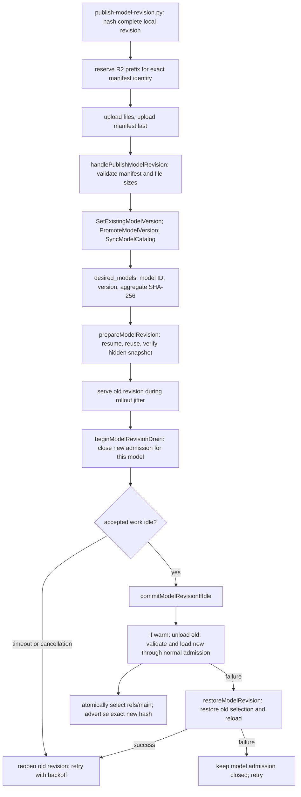

# Model artifact revisions

> Last updated: 2026-09-20 · commit `1451a4c89`

An existing model can acquire new weights without changing its model ID or
releasing another provider binary. Publishers upload an immutable revision and
promote it; providers that support `model_revisions_v1` prepare the new bytes
while the old revision serves, then switch at a model-scoped idle boundary.
The [revision runbook](../operations/model-revisions.md) covers operation and rollback.

## Context

The original prefetch shortcut treated an advertised or loaded model ID as
already available. `desired_models` identified builds by ID, so a new manifest
under the same ID did not invalidate that shortcut. Promotion also replaced
the coordinator's one expected hash, making still-running older weights fail
routing and attestation before their replacements were ready.

Gemma's external MTP assistant already used a useful lifecycle: prepare while
serving, fence new admissions, drain accepted requests, then install or reopen
the original engine. `ModelIdleUpgrade` is now the shared lifecycle primitive.
Target updates use it for every supported model; assistant resolution and
verification remain owned by `SpecDecArtifactFunnel`.

## Mechanism

The coordinator sends revision fields only to providers advertising the
`model_revisions_v1` protocol capability. It includes already-advertised concrete
models without aliases, and continues to use alias lineage for build-ID swaps.
Alias previous/retired members do not get a competing concrete-model target.
A new hash or version changes the desired-state deduplication key. Reconnects
receive the latest state, so a provider can skip revisions published offline.
Older providers keep the ID-only protocol and need one provider upgrade to gain
revision reconciliation.

`ModelDownloader` retains its foreground parallel scheduler and background
sequential scheduler. They share manifest validation, checksum/resume transport,
immutable publication, file reuse and a cancellable process-shared writer lease.
Files copied from the active snapshot are independently owned and reverified.
The implementation uses copies, not a deduplicating blob store; disk must fit
both retained and incoming revisions. A storage failure preserves the selection.

Completed snapshots live at `snapshots/.revision-<aggregate_sha256>`. Hidden
staging and completed-but-unselected snapshots are excluded from discovery.
`ModelScanner.findLatestSnapshot` honors `refs/main`; modification times cannot
undo a rollback. Legacy caches without a ref retain modification-time discovery.
The provider never deletes retained revisions automatically.

The monitor runs one revision attempt at a time and retries with jittered,
exponential backoff capped at 300 seconds. A new desired identity resets that
backoff and cancels the superseded attempt. Each attempt rechecks current desired
state before activation. The drain waits at most 120 half-second checks for
accepted work; loading and recovery occur afterward and are not included in
that wait bound. Other resident models remain available. Cold loads serialize
behind activation so another load cannot consume the space reserved by unloading
the old target. A warm replacement is loaded from its explicit snapshot path
before `refs/main` changes, so a crash during validation boots the old snapshot.

Normal memory admission, engine compatibility, template checks, hash identity
and prefix-cache rules still apply. The update path does not allocate two full
target models simultaneously. A single-provider model can have a loading gap;
random rollout jitter is not a fleet availability guarantee.

## Invariants

1. **A published version cannot change identity.** `SetModelVersion` rejects
   different hashes, prefixes, sizes, file counts or file manifests for an
   existing `(model_id, version)`. The publisher's conditional R2 reservation
   rejects competing different content before uploading. R2 supports the
   conditional `PutObject` used for that reservation ([Cloudflare API contract](https://developers.cloudflare.com/r2/api/s3/api/)).
2. **Selection follows verification.** `ModelArtifactRevision.publishRevision`
   records the manifest beside verified bytes. `activateRevision` atomically
   changes the ref; no in-place snapshot replacement is used for manifest models.
3. **Promoting a revision does not revoke previous approved bytes.**
   `ModelRegistryRecord.ServingVersions` contains previously promoted `ready`
   revisions. Routing, `models_update` and challenge validation accept only the
   desired or explicitly retained hashes for that same model. Unpromoted hashes
   are excluded. Existing legacy omission semantics are unchanged.
4. **Revocation is explicit.** `RetireModelVersion` removes an inactive revision
   from the accepted set. It refuses the active version and invalidates the
   store cache. Retirement is not automatic fleet cleanup.
5. **Accepted requests keep their engine until idle.**
   `beginModelRevisionDrain` uses the same admission fence as MTP upgrades.
   `commitModelRevisionIfIdle` checks coordinator requests, local reservations,
   engine work and load/unload ownership before changing the slot.
6. **A failed rollback is not reported as recovery.**
   `restoreModelRevision` returns failure on a ref or reload error;
   `finishModelRevisionDrain` leaves that model fenced until a later attempt
   can recover it. Shutdown cancels and joins revision work.

## Failure modes

| Condition | Result |
|---|---|
| Incomplete upload or invalid manifest | Publishing is rejected; desired revision stays unchanged |
| Network interruption or insufficient disk | Old revision serves; partial downloads can resume |
| Desired revision changes during preparation | Old attempt is cancelled; completed bytes may remain for reuse |
| Explicit external snapshot override | The provider respects the override and does not replace it through the cache |
| Busy accepted requests outlast drain wait | New admission reopens on old revision; retry later |
| New engine fails to load | Restore old ref and attempt to reload old engine |
| Ref restoration or old reload fails | Model remains fenced; other models continue |
| Provider has not received the supporting binary | Retained approved revision remains valid; no automatic same-ID update |
| Operator retires a still-used revision | Its hash is no longer accepted; those providers can lose routing/trust |

## Code map

| Concern | Implementation |
|---|---|
| Publisher and immutable R2 reservation | `scripts/publish-model-revision.py` (`reserve_revision`, `publish_files`) |
| Update and retirement API | `coordinator/api/model_revision_handlers.go` |
| Persistent acceptance and immutable versions | `coordinator/store/model_revision.go`, `postgres_model_revisions.go`, `postgres_model_registry.go`; `CachedStore` overrides |
| Desired state and routing hash admission | `coordinator/registry/model_commands.go`, `model_revisions.go`, `model_catalog.go` |
| Immutable files and atomic selection | `provider-swift/Sources/ProviderCore/Models/ModelArtifactRevision.swift`, `ModelArtifactWriteLease.swift` |
| Reconciliation and backoff | `provider-swift/Sources/ProviderCore/ProviderLoop+ModelRevisions.swift` |
| Activation and recovery | `provider-swift/Sources/ProviderCore/ProviderLoop+ModelRevisionActivation.swift`, `ProviderLoop+ModelRevisionRecovery.swift` |
| Shared target/assistant drain lifecycle | `provider-swift/Sources/ProviderCore/Models/ModelIdleUpgrade.swift` |

## Related

- [Model registry](model-registry.md)
- [Registry format](../reference/model-registry-format.md)
- [Protocol fields](../reference/protocol-messages.md#desired_models)
