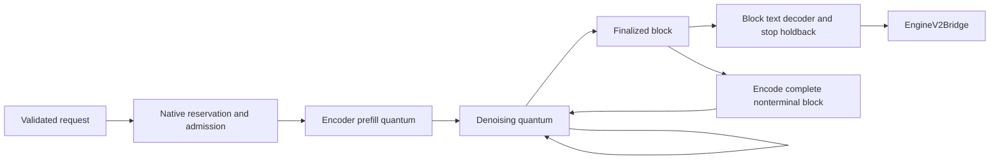

# Native block-generation adapter

> Last updated: 2026-09-20 · commit `76a8f03d9`

This page explains the native block engine and its provider bridge boundary.
DiffusionGemma uses explicit native-container ownership through ordinary slot
loading. Text and prepared image/video-frame requests use the shared HTTP
pipeline; unimplemented generation controls are rejected rather than discarded.

## Context

Diffusion generation refines a whole canvas before committing output. An
autoregressive iterator cannot represent that state transition: provisional
tokens must not reach text streams, tool parsers, usage or prefix consumers.
The SDK provides a separate native model context and block session while
retaining the provider's existing engine event protocol.

## Mechanism

`CBv2NativeBlockEngine` runs independent request sessions on one execution queue,
using the existing bounded pull-stream and provider event shapes. Round-robin
admission supports overlapping independent sessions but is not rectangular GPU
batching; each quantum advances one session. Model-specific validation rejects controls that do not yet have a native
implementation instead of ignoring them.

## Invariants

1. Only finalized blocks become output events. The native session owns its
   encoder cache, noise and self-conditioning; cancellation cannot expose a
   provisional canvas. Enforced by
   `libs/mlx-swift-lm/Libraries/MLXVLM/DiffusionGemmaGenerationSession.swift`
   (`advance`) and
   `libs/mlx-swift-lm/Libraries/MLXLMCommon/ContinuousBatchingV2/NativeBlockEngine.swift`
   (`consume`).
2. The shared process ledger uses the engine's own exact request estimator,
   preserving full/windowed allocation and auxiliary-state charges rather than
   substituting another architecture formula. Enforced by
   `provider-swift/Sources/ProviderCore/Inference/Engine/Bridge/EngineV2Bridge+Submission.swift`
   (`submitTokenized`) and `EngineV2Bridge+Admission.swift`
   (`reserveSharedRequestBytes`). Existing global memory safeguards remain intact.
3. Complete blocks are decoded together; trailing whitespace/incomplete UTF-8
   is held until stable. A rewrite of already published bytes is an error, not
   a string repair. Enforced by
   `libs/mlx-swift-lm/Libraries/MLXLMCommon/ContinuousBatchingV2/NativeBlockTextDecoder.swift`
   (`append`). Stop strings retain the existing `StopHoldback` contract.
   For explicit caller stops, stable text still streams while original token
   IDs wait for terminal reconciliation. This prevents a held suffix from
   requiring retraction of already published IDs. Usage ends at the original
   token completing the delimiter, not the rest of its canvas; tokens are
   never reconstructed by re-encoding displayed text. No-stop token delivery
   and native sampling/state advancement are unchanged.
4. Block throughput includes first-block generation work, using the native
   prompt-complete-to-finish interval. Prefill uses its own engine interval,
   not time to first block. Enforced by
   `provider-swift/Sources/ProviderCore/Inference/Engine/Bridge/EngineV2NativeBlockTiming.swift`
   (`generationRate`, `prefillSeconds`). Ordinary AR/MTP accounting is unchanged.

## Failure modes and capability boundaries

`EngineV2SupportedModels` admits the exact `diffusion_gemma` family for native
execution. `EngineV2VisionPrefill.prepareDiffusion` uses the existing inline-media
ingest/caps, scoped MLX error handling and per-frame tower allocation gate. The
processor preserves input order and expands actual resized-grid token counts.
Native prefill chunks stop at visual-block boundaries and use the same shared
process memory ledger as text; no media request falls through a text-only path.

The released model consumes video as timestamped image frames, not a Gemma4
video-feature payload. `DiffusionGemmaVideoFrames` samples one frame per second
for clips up to60seconds, preserving memory-backed asset ownership and processing
each decoded frame before retaining its resized pixels. This follows the
[documented image-frame modality](https://ai.google.dev/gemma/docs/diffusiongemma/model_card).

`ModelMediaPolicy.advertisesMedia` enables discovery and multimodal template
fixtures for the native `diffusion_gemma` wrapper with a `diffusion_gemma_text`
text configuration and `gemma4_vision` tower. Text-only overlays, bare text models
and incomplete or foreign components remain disabled. The separate native factory
still validates the checkpoint before inference. This capability is not catalog
activation or a claim that all release qualification has completed.
Fused multi-row GPU execution remains unimplemented. Page-backed storage and
native checkpoint transport below have separate qualification boundaries.
Prepared media can reuse compatible native prefixes under the identity and
boundary rules below; registry modality publication remains a separate action.

## Resident text-prefix reuse

`PrefixCachePolicy.diffusionResidentConfig` preserves the existing
`DARKBLOOM_PREFIX_CACHE_MEMORY` opt-in and global kill switch. It allocates a
bounded in-memory snapshot partition inside the slot's existing KV grant.
This does not construct SSD storage or advertise durable cache holders.

`DiffusionGemmaResidentPrefixCache` stages compact, bit-preserving copies of
complete full/windowed encoder state, retaining the virtual ring cursor. It
publishes only after successful native completion and discards canceled/failed
staging. Exact repeats may restore the whole prompt; changed/appended prompts
reuse aligned cold-prefill boundaries. The first shared boundary and deepest
eligible endpoint remain distinct so a new conversation branch can still reuse.

The cache is bound to one immutable model owner/epoch, template, numerical
profile and trusted scope. Local native requests receive an opaque per-application
scope shared across their request facades; existing model scopes are unchanged.
Remote requests still require the coordinator's scope. An absent scope is cold.

`EngineV2Bridge.submitTokenized` carries the claimed native reservation through
submission. If a cache budget changes between planning and submission, the
engine may serve cold but cannot grow beyond the already claimed allowance.
Snapshots, active rows and restore/capture overlap remain accounted during
resize and retirement. Usage reports the actual skipped prefill tokens as an
in-memory snapshot hit, never as zero-copy paged residency or an SSD hit.

### Prepared media identity and boundaries

`MultiModelBatchSchedulerEngine.streamChatCompletion` binds native media to the
evaluated features, ordered span kinds/geometry, attention and position policy
using `EngineV2VisionPrefill.PreparedSubmission.hybridPrefixIdentity` while the
vision preparation reservation is still owned. The bridge and native cache use
the same media-bound authenticated scope. The identity is never accepted from
caller metadata, filenames or URLs, and vision preparation still runs before
lookup. Changed pixels, ordering, model/template/numerics or tenant cannot reuse
another request's state.

`DiffusionGemmaPrefillGeometry` preserves the actual cold-prefill schedule around
whole bidirectional blocks. Resident exact matches may restore the full prompt;
append restores must land on a boundary of the current request's cold schedule.
Native media donors preserve a stable branch point rather than a coincidentally
aligned truncated endpoint. Version2 native media checkpoints use exact-boundary
content digests from `NativeDiffusionCheckpointKeys`, then the store's existing
HMAC and authenticated encryption. They do not round positions to an AR block
grid. Text-only native and autoregressive checkpoint alignment rules are unchanged.
Old version1 native checkpoints fall back cold under the new layout namespace.
No chunking, masking or arithmetic is changed to manufacture a hit. Capture bookkeeping and
additional eligible snapshots remain within the native request/cache allowance.

The native codec binds the manifest's typed media digest and validates restore
geometry before destination allocation. It retains the native block layout and
does not set the AR `mediaTargetOnly` flag or fabricate an assistant state.
`EngineV2Bridge.submitTokenized` keeps this native planner separate from Qwen4's
three-axis media checkpoint path.

Native media exact-boundary keys are not coordinator fixed-block chain hashes.
The bridge therefore does not publish fixed-block holder anchors for these
entries; actual native skipped-prefill usage still reaches API/accounting.
Text/Qwen4 holder advertisement is unchanged. Coordinator media-aware routing
hints need their own explicit compatible contract and qualification.

## Native durable transport boundary

`SSDCheckpointTransfer` distinguishes autoregressive and native-block plans,
imports and stage tickets. `SSDHybridCheckpointStore.stageNativeBlock` reuses the
same DBK3 streaming encryption, authenticated file identities, epoch checks,
file coordination and cancellation cleanup. It requires a shared process budget
and a nonempty trusted scope; native write buffers also take a process host lease.
The SDK import retains its provider refund callback through adoption and the
last borrowing request, not merely until the store hands out its ticket.

Native-block lookup may retain the entire prompt: diffusion does not need the
AR last-token forward to produce the first canvas. This exception is confined
to the explicit native backend layout; autoregressive hashing and final-position
replay remain unchanged. The native codec independently validates tensor geometry,
chunk policy, artifact/build/numerics and the request's full output reservation.

`EngineV2SlotFactory.prepareDiffusionPrefixCache` now connects the native store
through ordinary slot construction. It honors the model-scoped SSD activation
policy and global kill switch, requires the verified load hash and prompt
contract, and binds the actual binary, immutable loaded metallib, OS and native
execution settings. Missing prerequisites disable the cache, not those checks.
The existing Secure Enclave key hierarchy remains the production path. Explicit
isolated tests may use ephemeral software keys; they do not qualify process-restart
warmth or the release-signed key boundary.

`EngineV2Bridge.submitTokenized` stages native checkpoints before admission using
the same receipt, deadline and shared-budget cleanup path. The engine consumes
only a matching native ticket. `DiffusionGemmaPrefixPersistence` keeps a distinct
donor reservation through asynchronous write completion, including when the RAM
bank evicts its copy. Disabling `DARKBLOOM_PREFIX_CACHE_MEMORY` disables persistent
RAM retention, not the bounded working buffers needed to capture/import a disk
checkpoint. Usage distinguishes those disk hits from resident snapshot hits.

Native encrypted-cache execution has separate authenticated loopback HTTP
gates in `DiffusionGemmaPrefixLiveTests` and `DiffusionGemmaMediaPrefixLiveTests`.
These fixtures require isolated ephemeral keys and distinguish actual disk hits,
RAM-disabled execution and changed-key cold reloads from persistent-key warm
restarts. Their results are not signed-runtime or hosted-routing evidence.
`DiffusionGemmaEncryptedHandlerLiveTests`
separately exercises the ordinary provider handler and actual encrypted WebSocket
traffic with a fixture coordinator and tenant, not production identity approval.

## Page-backed serving admission

For the native family, explicit `engine_v2_kv_backend = "paged"` selects segmented
page storage followed by the unchanged native SDPA arithmetic. `auto` still
selects contiguous storage. The ordinary scalar paged decode kernel is not used
for diffusion canvases; its reduction failed the native exactness gate.

`DiffusionGemmaProviderBridge.make` requires `GlobalKVCacheBudget` for page-backed
serving and passes its synchronous process owner into the native engine.
`CBv2NativeBlockPagedMemory` binds that engine to AdmissionV2's physical floor:
the same nominal request pages and evaluated pool backing are charged once;
native canvas/gather buffers, cache partitions and transfers remain additive.
Allocation coverage is withdrawn before its actual owner releases the charge.
Budget reductions preserve outstanding obligations rather than refunding
unfinished work. Snapshot eviction cannot refund an asynchronous donor's lease.

Encrypted imports distinguish process-owned native destinations from the older
provider-held reservation path through `SSDCheckpointImportPlan`. Provider host
I/O stays separately charged; no second global reservation is taken for native
destinations already covered by engine admission. The consumed ticket's lease
survives until the borrowing request drops its buffers, including during shutdown.
Storage selection also binds the native checkpoint numerical fingerprint.

Explicit selection does not qualify the full rollout: native fused batching,
media/long-context/resize matrices, signed restarts and actual transport still
require their own evidence. No default performance claim follows from the
storage backend name.

## Request controls

The local Responses adapter accepts `input_image` with a string `image_url`
and translates it to the same canonical image part used by Chat Completions.
`OpenAIContentPart.init(from:)` preserves the URL/data bytes and message order;
the normal media ingest and memory checks still apply. Uploaded image `file_id`
references are rejected at decoding because this runtime has no uploaded-file
resolver. They are not silently replaced by text-only inference. The built-in
text-only SDK engine also recognizes these translated parts as media and refuses
them. This protocol mapping is shared by models; native diffusion math is unchanged.

Required/named text tools use `ToolChoiceEnforcementPolicy.forcedStrategy`'s
structured post-validation: native sampling is unchanged, and complete calls
are withheld until name, schema and cardinality validation succeeds. This is
not an autoregressive grammar applied to provisional canvas tokens.
`ToolStreamPreparation` selects strict Gemma framing only for `diffusion_gemma`;
the parser does not repair generated names or values. `DiffusionGemmaChannelSplitter`
recognizes the initial thought envelope and preserves marker-looking bytes after
content begins. A successfully parsed call does not guarantee that the model
copied a requested argument correctly; semantic fidelity remains a separate gate.
Both native empty-thought spellings, with and without the newline, are recognized.

`LocalTokenizerLoader` resolves the DiffusionGemma processor's absent
`clean_up_tokenization_spaces` to false through the SDK's
`DiffusionGemmaTokenizerConfiguration`. Explicit Boolean metadata is retained;
other processors keep the existing loader path. This avoids altering literal
punctuation and spaces inside quoted arguments after token generation. The
metadata files, input IDs and native sampling are unchanged. Exact decoding
does not repair an incorrect value already present in generated tokens.

The released template defaults thinking off unless its binary `enable_thinking`
input is present. `DiffusionGemmaReasoningControl` maps explicit positive effort
aliases to that switch; the model does not implement separate effort levels.
Explicit booleans keep precedence and absent controls retain the checkpoint
default. Unknown effort aliases are rejected before generation rather than
accepted without effect. Chat and Responses share this provider rendering policy.

Output routing uses that same resolved switch. If thinking is disabled but the
model generates a nonempty native thought, `NativeToolStreamRouter` fails before
publishing it. Empty envelopes containing only framing whitespace remain valid.
The router cannot resume after this violation, invent a missing channel closer,
or promote a tool-like example inside an unclosed thought into an invocation.
Enabled reasoning remains a separate typed channel; literal markers already in
content or quoted tool arguments remain data. This is an output-control safeguard,
not a repair of the model's generated protocol or semantic accuracy.
For required/named tools, this remains a typed `toolChoiceViolation` (422 with
the existing model-noncompliance reason), preserving bounded failover and the
provider-reputation exemption rather than reclassifying it as a node fault.

The coordinator planner mirrors these controls in
`coordinator/promptsidecar/src/diffusion.rs` (`apply_reasoning`). Swift's
`ChatTemplateFixes` and the Rust `gemma4` input hook share native turn/tool-schema
normalization for the exact family. Input-format reuse does not broaden
`Gemma4TemplateFix.applies` or `Gemma4ToolConstraintContract.supports`, which
remain part of autoregressive grammar eligibility. The production prompt-parity
gate compares actual artifact token IDs and scoped block hashes, not just
request success or token counts.

`EngineV2VisionPrefill.prepareDiffusionUserInput` applies the same normalization
after secure ingest, preserving separately owned decoded images/video and user
content order. Image/video parts in non-user messages are refused before decoding
because the current ingest does not retain those assets; they are never silently
dropped. This restriction is native-family scoped.

`ProviderModelContainer` distinguishes autoregressive and native diffusion
ownership. Both `ProviderLoop` and `StandaloneServer` keep their existing
integrity, load admission, post-load checks, reslice and failure-unwind ordering.
`EngineV2ServingPreparation` never invents an AR target or assistant for diffusion;
ordinary MTP upgrade retains its existing target eligibility and object identity.

The AR first-token forecast does not estimate diffusion convergence.
`DiffusionGemmaProviderBridge.make` does not enable that forecast; existing
absolute-expiry checks remain in place. Native first-block projections and fleet
routing need separate qualification before serving activation.

## Native liveness and actual retirement

`CBv2NativeBlockEngine` uses the shared monotonic admission, prefill, generation,
backpressure and absolute-safety leases. A completed native refinement quantum
refreshes generation liveness without being counted or emitted as output.
Duplicate work watermarks do not refresh a lease; the safety ceiling still
bounds nonconvergence. The provider passes its existing legacy-timeout rollback
selection; ordinary AR behavior is unchanged.

An independent watchdog observes session construction and blocking native
quanta. It sends typed terminal usage and marks the engine unhealthy, but does
not mutate GPU arrays, page state or capacity owners. Its wake-up path scans
leases even when every row is paused. Cancelled waiting work is checked again
after a blocked factory returns, before constructing another session.

`submitWithRetirement` returns a generation-bound ownership acknowledgment
separate from the stream's terminal. `EngineV2Bridge` returns the terminal to
the client but retains process memory, staged checkpoint resources and request
identity until that acknowledgment. The engine queue drops actual resources
before acknowledging. A permanent wedge therefore retains its memory claim;
elapsed time never authorizes a refund or a second model load over live arrays.
Heartbeat state exposes native watchdog failure while those owners remain.
These mechanisms need component and full-model qualification; they do not turn
local tests into hosted or signed-runtime certification.

## Ordinary CLI benchmark

`ModelBenchmark.run` routes `diffusion_gemma` through
`EngineV2Factory.runDiffusionGemmaBenchmark`, not `LLMModelFactory`/`TokenIterator`.
The offline benchmark uses the native slot factory, normal padded-load permit,
fresh equal pre/post-load weight hashes, production single-slot KV grant and
post-load headroom gate. It applies the same `MLXMemoryGuard.configureOnce`
allocator ceiling and bounded reusable-buffer policy as ordinary serving before
loading; slot admission alone does not configure that process-wide policy.
Contiguous requests reserve the native engine's exact
estimate in the shared ledger; segmented pages own their process reservation.
Cancellation drains native work before returning its memory allowance.

The baseline disables both prefix tiers and ordinary MTP, retains the checkpoint's
diffusion recipe, and uses explicit reasoning off, temperature1 and seed341.
It measures prefill separately from first committed output and counts generation
over prompt-complete through finish, including the first block's work. Raw API
completion usage includes EOS; committed benchmark tokens exclude terminal EOS
but may include native channel framing. This is not a visible-token speed-target
certification or an aggregate batching claim. AR throughput/scheduler/teacher-
forcing/parity diagnostics are not silently applied to diffusion.

The slot, request and model owners are retired before the final allocator-cache
clear. The benchmark creates no listener, uploaded artifact or persistent cache.
See `provider-swift/Sources/ProviderCore/Inference/Engine/Factory/EngineV2Factory+DiffusionBenchmark.swift`
and `EngineV2Factory+DiffusionBenchmarkIterations.swift`, and
`provider-swift/Sources/ProviderBenchmark/ModelBenchmarkNativeDiffusion.swift`.

## Code map

| Concern | Implementation |
|---|---|
| Native factory and separate container | `libs/mlx-swift-lm/Libraries/MLXVLM/DiffusionGemmaModelFactory.swift`, `DiffusionGemmaModelFactory` |
| Block engine admission, scheduling and retirement | `libs/mlx-swift-lm/Libraries/MLXLMCommon/ContinuousBatchingV2/NativeBlockEngine.swift`, `CBv2NativeBlockEngine` |
| Model-specific session and reservation policy | `libs/mlx-swift-lm/Libraries/MLXVLM/DiffusionGemmaEngine.swift`, `makeNativeEngine` |
| Provider assembly from an admitted native container | `provider-swift/Sources/ProviderCore/Inference/Engine/Factory/DiffusionGemmaProviderBridge.swift`, `make` |
| Native/AR ownership through load and retirement | `provider-swift/Sources/ProviderCore/Inference/Engine/Factory/ProviderModelContainer.swift`, `ProviderModelContainer` |
| Shared slot preparation dispatch | `provider-swift/Sources/ProviderCore/Inference/Engine/Factory/EngineV2SlotFactory+Native.swift`, `EngineV2ServingPreparation` |
| Literal-template/context bridge | `provider-swift/Sources/ProviderCore/Inference/Prompting/LocalTokenizerLoader.swift`, `LocalTokenizerBridge.applyChatTemplate` |
| Native media ingest/tower boundary | `provider-swift/Sources/ProviderCore/Inference/Vision/EngineV2DiffusionVisionPrefill.swift`, `prepareDiffusion` |
| Variable-grid media and chunk-safe embeddings | `libs/mlx-swift-lm/Libraries/MLXVLM/DiffusionGemmaProcessor.swift`, `prepare`; `libs/mlx-swift-lm/Libraries/MLXVLM/DiffusionGemmaVisualEmbeddings.swift`, `chunkLength` |
| Typed native/AR encrypted transfer | `provider-swift/Sources/ProviderCore/KVCacheSSD/SSDCheckpointTransfer.swift`, `SSDCheckpointImportPlan`; `SSDHybridCheckpointStore+Read.swift`, `stageNativeBlock` |
| Native portable state and destination leases | `libs/mlx-swift-lm/Libraries/MLXLLM/Models/DiffusionGemmaPersistentPrefix.swift`, `DiffusionGemmaPersistentPrefixCodec`; `libs/mlx-swift-lm/Libraries/MLXLMCommon/ContinuousBatchingV2/NativeBlockCheckpointImport.swift`, `CBv2NativeBlockCheckpointImportPlan` |

## Related

- [Provider inference engine](inference.md)
- [Hardware and memory safeguards](hardware-support.md)
- [Prefix-cache contracts](prefix-cache.md)
