# Routing

Darkbloom's production dispatch path is a **cost-minimization scheduler**. For each inference request it builds every eligible provider into a candidate, computes an estimated completion time (in milliseconds), and selects the lowest-cost candidate.

The canonical implementation is `Registry.ReserveProviderEx` in `coordinator/registry/scheduler.go:213-292`.



The flow above maps to the consumer handler in `coordinator/api/consumer.go`: auth and rate-limit, optional sender-seal (`coordinator/api/sender_encryption.go`), NaCl Box decryption (`consumer.go:448-510`), token estimation and balance reservation, then a `QuickCapacityCheck` (`scheduler.go:1079-1193`) before `ReserveProviderEx` selects a provider. The chosen request is re-encrypted with a fresh per-request NaCl Box to the provider's attested X25519 key and dispatched over the provider WebSocket as an `inference_request`.

## Privacy boundary

Routing decisions are made after the coordinator has decrypted the request body:

* **Consumer → coordinator**: TLS by default; optional NaCl Box (`coordinator/api/sender_encryption.go`).
* **Coordinator → provider**: mandatory per-request NaCl Box to the provider's attested X25519 public key (`coordinator/api/consumer.go:448-510`, `coordinator/internal/e2e/e2e.go`).
* The coordinator decrypts bodies in Confidential-VM memory for routing and billing, but does **not** log or retain prompt content.
* The provider is the decryption endpoint for prompts.

See the canonical privacy model in [`../../AGENTS.md`](../../AGENTS.md) and the overview in [`../overview.md`](../overview.md).

## Entry point

```go
func (r *Registry) ReserveProviderEx(
    model string,
    pr *PendingRequest,
    excludeIDs ...string,
) (*Provider, RoutingDecision)
```

`ReserveProviderEx` is the only production path that both selects a provider and atomically reserves capacity. It returns a `RoutingDecision` (`scheduler.go:172-197`) so callers can emit metrics without reaching into registry internals.

The public wrapper `ReserveProvider` (`scheduler.go:199-205`) discards the decision and is used by tests and legacy callers.

## Candidate selection and reservation

`selectBestCandidateLockedFull` (`scheduler.go:302-462`) first collects every provider that passes the structural gates, then scores each one with `buildCandidateWithReason`. It returns the winner plus rejection counters:

| Counter | Meaning |
|---|---|
| `CandidateCount` | Providers that passed every gate and could route right now |
| `CapacityRejections` | Providers rejected for transient capacity/memory pressure (retryable) |
| `ModelTooLargeRejections` | Providers whose memory can never fit the model (permanent) |
| `VisionRejections` | Providers that serve the model only as a text-only build when vision is required |

The lowest-cost candidate wins. Candidates within `nearTieCostWindowMs` (`3_000` ms) of the best are considered tied (`scheduler.go:427-432`); ties are broken by lowest `effectiveQueue`, then lowest `totalPending`, then uniform random choice (`scheduler.go:448-458`).

After selection, `ReserveProviderEx` re-takes the provider lock and runs `providerCanAdmitLocked` (`scheduler.go:1029-1050`) to re-apply the routing gates and capacity/slot-state checks. If the provider's state changed between snapshot and reservation, the selection is rejected and the caller may retry.

## Structural gates

Before a provider becomes a candidate it must pass `providerPassesRoutingGatesLocked` (`scheduler.go:598-648`). Gates are evaluated in this order:

1. Catalog membership — advertises an allowed build of the model (`providerServesCatalogModelLocked`).
2. Dispatch-load cooldown — skip a provider-model pair that recently failed to load with "insufficient memory" (`dispatchLoadCooldownActiveLocked`).
3. Inference-error cooldown — shape-keyed circuit breaker for repeated provider-side 5xx failures (`inferenceErrorCooldownActiveLocked`, keyed by `traits.CooldownShape()`).
4. Status not `offline`/`untrusted`.
5. Private-only admission — a `PrivateOnly` machine serves only its owner's self-route traffic.
6. Hardware-trust floor — public traffic must meet `r.MinTrustLevel`; self-route to an owned machine relaxes this to `TrustNone`.
7. Runtime verified (`RuntimeVerified == true`).
8. Private-text support (`providerSupportsPrivateTextLocked`).
9. Challenge freshness — `LastChallengeVerified` within `challengeFreshnessMaxAge` (6 minutes).
10. Trait eligibility — `template_render_ok=false` fences every shape; capability version floors are trait-scoped (tools-only today).

The same gate set is used by `QuickCapacityCheck` (`scheduler.go:1079-1193`) so preflight capacity reports never drift from actual dispatch behavior.

## Cost function

`buildCandidateWithReason` (`scheduler.go:802-894`) computes the per-candidate cost:

```text
costMs = statePenalty
       + (effectiveQueue × queueDepthPenaltyMs)
       + (totalPending × totalPendingPenaltyMs)
       + backlogMs
       + thisReqMs
       + healthPenaltyMs
```

Each term maps to a field in `RoutingDecision`:

| Term | Field | Value / source |
|---|---|---|
| Slot-state penalty | `StateMs` | `0` for `running`/`idle`, `30_000` for `unknown`, `20_000` for `idle_shutdown`, `+Inf` (ineligible) for `crashed`/`reloading` |
| Queue depth | `QueueMs` | `effectiveQueue × queueDepthPenaltyMs` (`3_000` ms) |
| Total pending | `PendingMs` | `totalPending × totalPendingPenaltyMs` (`750` ms) |
| Backlog time | `BacklogMs` | Tokens ahead / effective decode TPS × 1000 |
| This request | `ThisReqMs` | `promptTokens/prefillTPS + maxTokens/effectiveTPS` |
| Health | `HealthMs` | Memory pressure, CPU usage, thermal state, GPU utilization |

Penalty constants are defined at `scheduler.go:17-37`.

`healthPenaltyMs` (`scheduler.go:1688`) sums four additive terms:

| Signal | Contribution |
|---|---|
| Memory pressure | `memoryPressure × 4_000` ms (0.0-1.0 fraction from the heartbeat) |
| CPU usage | `cpuUsage × 1_500` ms |
| Thermal state | `+2_000` ms at `fair`, `+8_000` ms at `serious`, `0` otherwise |
| GPU utilization | `(gpuMemoryActiveGB / totalMemoryGB) × 5_000` ms |

### Thermal state

Thermal state is **not** a Darkbloom temperature threshold. The provider reports
`ProcessInfo.processInfo.thermalState` verbatim
(`provider-swift/Sources/ProviderCore/Hardware/SystemMetrics.swift:10-25`), so
macOS alone decides when a machine is `nominal`, `fair`, `serious`, or
`critical`. Apple derives that from its own sensor fusion and power/fan
mitigation state, publishes no degree thresholds, and applies different curves
per chassis — a desktop under sustained load can report `fair` at temperatures a
laptop would call idle. No coordinator or provider code reads a temperature to
produce it. (The unrelated opt-in `darkbloom fan` controller does use real
degrees: engage at 45 C, release at 40 C. See `../../provider/fan-control.md`.)

The coordinator consumes the four states as follows:

| State | Routing | Base rewards |
|---|---|---|
| `nominal` | No penalty | Eligible |
| `fair` | `+2_000` ms of cost. Within `nearTieCostWindowMs` (`3_000` ms), so an otherwise-equal machine still enters the near-tie set and is spread by queue depth and randomness rather than losing on cost | Eligible |
| `serious` | `+8_000` ms of cost. Exceeds the near-tie window, so it loses to an otherwise-equal cooler peer. Also `-1000` on the warm-pool preload score (`warm_pool_controller.go:738-745`, `-250` at `fair`) | Eligible |
| `critical` | Excluded outright — from routing candidates (`scheduler.go:1524`), from the transient-capacity accounting (`scheduler.go:2224`), and from cold-spill eligibility (`cold_dispatch.go:96`) | Ineligible (`baserewards/engine.go:233`) |

Only `critical` is a gate. `fair` and `serious` are cost terms that shift
preference within an eligible fleet, and neither affects earnings.

### Effective decode TPS (routing cost)

`resolveEffectiveTPS` (`scheduler.go:1704`) chooses the best available decode
estimate for the **cost function** in this order:

1. Provider-reported observed EWMA (`slot.ObservedDecodeTPS`).
2. Fleet median TPS for the same model and chip family (`tpsRegistry.Median`).
3. Load-scaled benchmark TPS (`effectiveDecodeTPS`, `scheduler.go:1745`).

The load-scaled fallback divides the static benchmark TPS by
`1 + effectiveTPSLoadFactor × backendRunning`, with
`effectiveTPSLoadFactor = 0.39` (`scheduler.go:97`).

This chain is deliberately **load-inclusive**: it estimates what a request will
actually experience right now, so an under-load EWMA is the *right* input.

### Solo decode TPS (quality-concurrency cap)

Do not confuse this with the chain above — it answers a different question and
takes the opposite stance on load. `resolvedSoloModelTPSLocked`
(`concurrency_cap.go:361`) resolves the **static single-stream** rate the
admission cap is computed from. It must never be an under-load EWMA: the
observed rate collapses under the very overload the cap exists to prevent,
which would drive the cap to 1 in a feedback loop.

Five steps, most- to least-specific. Each advances only when its own condition
fails:

| # | Source | Advances to the next step when |
|---|---|---|
| 1 | Per-(model, chip **class**) solo median (`SoloMedian`) | fewer than `EIGENINFERENCE_QUALITY_CAP_SOLO_MIN_SAMPLES` (default 5) gated samples, or the median is 0 |
| 2 | MIN of per-class solo medians across chip classes (`SoloMedianAllChips`), clamped from above by the seed, and only when the transfer is **bounded** (below) | fewer than the same sample floor in total, 0, or unbounded |
| 3 | The same two medians again with the sample floor **relaxed to ≥ 1** — under-sampled but still measured and still solo-gated (cross-class still seed-clamped and bounded) | the model has no solo sample at all on this coordinator |
| 4 | `EIGENINFERENCE_MODEL_SOLO_TPS_SEED` for this build id **and this chip class** — the `build-id@Family|Tier` entry when present, else the unqualified entry clamped to the slowest class named for that model | no seed entry of either shape |
| 5 | `resolvedDecodeTPS(p)` — the registration benchmark `decode_tps`, else `sqrt(memory_bandwidth)` | terminal |

"Gated" (steps 1–3) means the sample was ingested only from a heartbeat where
the **whole box** was uncontended (Σ running+waiting ≤ 1 across all slots) and
the reporting slot had a running decode (`NumRunning > 0`) — see
`soloSampleEligible`. That gate is what keeps a measured rate a *solo* rate.

Steps 2 and 3 hand a provider a rate its own chip class did not produce, so the
transferred value needs an upper bound. **At least one of three things must
supply it**, or the transfer is refused outright and the chain drops to step
4/5:

- a seed applies to this provider's chip class (`soloTPSSeedForClass`);
- the provider's own class contributed ≥ 1 sample, so the min of per-class
  medians cannot exceed what its own class demonstrated;
- ≥ 2 classes contributed, so the minimum is a genuine cross-class minimum.

With none of them the "MIN of per-class medians" is a *single* class's median
wearing the name of a minimum — one M4 Max sample setting an unsampled M1 Pro's
rate, the exact over-admission the class keying exists to prevent. Production
seeds every catalog model, so in practice this refusal is the backstop for a
model nobody seeded.

The step-2/3 clamp and step 4 both use the **class-scoped** seed
(`soloTPSSeedForClass`). A seed is a measurement of one chip class: the
production gemma seed was taken on an M4 Max at ~99.5 tok/s solo, and applying
it to an M1 Pro that decodes at ~14 tok/s would grant cap 8 against a 15 tok/s
floor. Unqualified entries are therefore clamped at parse time to the slowest
class the operator named for that model, so a class nobody named — including
an unrecognized chip, which reports `Unknown|Unknown` — can never out-rank the
slowest class that was named. The error direction is under-admission.

Step 3 exists because the alternative below it is worse information, not
better: step 5's `sqrt(memory_bandwidth)` is **model-agnostic** (16–28 tok/s
across Apple silicon) and has nothing to do with the model being capped. One
solo-gated measurement of the actual model beats it outright. Under-sampled
readings converge from **below** — the α = 0.3 provider EWMA still carries
batched history when the box drops to a single request — so the error direction
is a tighter cap, never a permissive one.

Step 5 is reached in production only at **cold start**. The Swift provider
never sends `decode_tps` at registration (deliberately: on a multi-model box a
single provider-level benchmark lends one model's rate to another — the
postmortem layer-6 failure), and a provider that has completed no request
reports no `observed_decode_tps` at all, so `p.DecodeTPS` is 0 and the proxy is
all that is left. For a **dedicated** model that yields a cap of 2; for a
non-dedicated one the guard in `effectiveMaxConcurrencyForModelRateLocked`
(`concurrency_cap.go:425`) leaves the provider's reported cap alone. This is
why the seed at step 4 stays configured — see the v0.8.0 release notes.

## Slot states and penalties

`slotStatePenalty` (`scheduler.go:896-914`) maps the backend-reported slot state:

| State | Penalty | Eligible |
|---|---|---|
| `running` | `0` ms | yes |
| `idle` | `0` ms | yes |
| `unknown` (not loaded) | `30_000` ms | yes |
| `idle_shutdown` | `20_000` ms | yes |
| `reloading` | `+Inf` | no |
| `crashed` | `+Inf` | no |
| any other value | `30_000` ms | yes |

A model is considered **resident** when the slot state is `running` or `idle`; only resident models skip the absolute hardware-fit gate in `buildCandidateWithReason` (`scheduler.go:839-842`).

## Special routing modes

* **Self-route** (`pr.SelfRouteOnly`) — restricted to providers owned by the caller; never falls back to the public fleet (`scheduler.go:325-329`). Trust floor and private-only admission are relaxed for the owner's own machine (`scheduler.go:341`, `scheduler.go:598-648`).
* **Prefer-owner** (`pr.PreferOwner`) — first tries owned candidates, then falls back to the public fleet (`scheduler.go:391-401`). Settlement is free only when the selected provider is owned by the caller (`coordinator/api/provider.go:1706-1733`).
* **Allowed serials** (`pr.AllowedProviderSerials`) — restricts candidates to providers whose attested serial number is in the allowlist (`scheduler.go:307-334`, `providerMatchesAllowedSerial` at `scheduler.go:464-481`).
* **Version-diverse retry** (`Traits.AvoidVersion`) — soft hint that prefers a different binary version after a failure, but never fails closed (`scheduler.go:409-419`).

## Metrics and observability

`logRoutingDecision` (`scheduler.go:551-571`) emits a structured debug record with every cost term. Callers also emit Datadog histograms such as `routing.cost_ms` (`coordinator/api/consumer.go:4158`).
