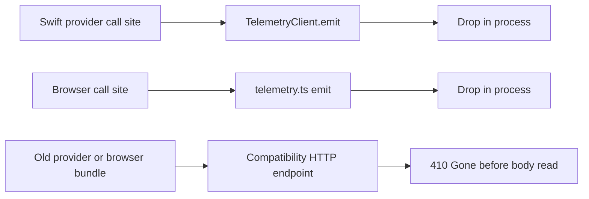

# Telemetry

Client-supplied telemetry is disabled. Provider and browser events are dropped
locally, and both compatibility HTTP endpoints return `410 Gone` before reading
a request body. The retained protocol mirrors, client-side compatibility
filters, queue methods, and facade APIs are source-compatibility surfaces; they
are not an active provider/browser data path.

Coordinator-generated operational telemetry is separate and remains active. It
is created inside the coordinator, mirrored to the process logger and metrics,
and may be forwarded to Datadog. It does not accept provider or browser event
payloads ([`coordinator/telemetry/emitter.go`, `Emitter.Emit`](../../../coordinator/telemetry/emitter.go#L61-L119)).

## Canonical code

### Disabled client-ingestion path

- Coordinator route wiring: [`coordinator/api/server.go`](../../../coordinator/api/server.go)
- Coordinator fixed `410` handler: [`handleTelemetryIngest`](../../../coordinator/api/telemetry_handlers.go)
- Swift disabled client: [`TelemetryClient`](../../../provider-swift/Sources/ProviderCore/Telemetry/TelemetryClient.swift)
- Swift disabled compatibility queue: [`TelemetryOverflowQueue`](../../../provider-swift/Sources/ProviderCore/Telemetry/TelemetryOverflowQueue.swift)
- Common locked startup cleanup: [`ProcessLifecycle.acquireMediaServingLock`](../../../provider-swift/Sources/ProviderCore/Service/ProcessLifecycle.swift)
- Swift crash hook: [`PanicHook`](../../../provider-swift/Sources/ProviderCore/Telemetry/PanicHook.swift)
- TypeScript disabled facade: [`console-ui/src/lib/telemetry.ts`](../../../console-ui/src/lib/telemetry.ts)
- TypeScript fixed `410` route: [`console-ui/src/app/api/telemetry/route.ts`](../../../console-ui/src/app/api/telemetry/route.ts)

### Retained compatibility schema

- Go protocol mirror: [`coordinator/protocol/telemetry.go`](../../../coordinator/protocol/telemetry.go)
- Swift protocol mirror: [`provider-swift/Sources/ProviderCore/Telemetry/TelemetryEvent.swift`](../../../provider-swift/Sources/ProviderCore/Telemetry/TelemetryEvent.swift)
- TypeScript protocol mirror: [`console-ui/src/lib/telemetry-types.ts`](../../../console-ui/src/lib/telemetry-types.ts)
- Shared wire fixture: [`fixtures/telemetry/v1/events.json`](../../../fixtures/telemetry/v1/events.json)
- Fixture consumers: [Go](../../../coordinator/protocol/telemetry_symmetry_test.go),
  [Swift](../../../provider-swift/Tests/ProviderCoreTests/TelemetrySymmetryTests.swift),
  and [TypeScript](../../../console-ui/__tests__/telemetry.test.ts)

The Go, Swift, and TypeScript event types remain aligned because old binaries
and source call sites still compile against them. The shared fixture and its
three consumers pin enum vocabularies, wire field names, required versus
optional fields, and optional-field omission. They do **not** imply that client
event ingestion is enabled. Field filtering is a separate, inactive
Swift/TypeScript compatibility surface; the coordinator's fixed `410` handler
has no parser, sanitizer, or field allowlist.

## Disabled flow

The coordinator registers `POST /v1/telemetry/events` directly to
`handleTelemetryIngest` ([route wiring](../../../coordinator/api/server.go)).
That handler writes only the fixed `telemetry_ingest_disabled` error response
with status `410`; it does not read, decode, store, log, or forward the body
([handler](../../../coordinator/api/telemetry_handlers.go)).

The browser compatibility route behaves the same way. Its `POST` function does
not access the `NextRequest`; it returns the fixed error with status 410
([route](../../../console-ui/src/app/api/telemetry/route.ts)). The browser
facade's `emit`, global-handler installation, and test reset methods are no-ops,
and its reported buffer size is always zero
([facade](../../../console-ui/src/lib/telemetry.ts)).

## Swift client and legacy queue

`TelemetryClient` retains configuration and emission signatures so existing
call sites keep compiling, but both `emit` overloads discard their arguments.
`setAuthToken`, `setMachineId`, and `setAccountId` also retain compatibility
signatures without storing their values. `ingestEndpoint(from:)` preserves the
historical string-only URL normalization helper for callers that display the
retired endpoint; it performs no I/O and is not used to send events
([`TelemetryClient`](../../../provider-swift/Sources/ProviderCore/Telemetry/TelemetryClient.swift)).
No event is encoded, buffered, written to disk, or sent over the network.

Legacy cleanup is intentionally narrow and shared by both serving modes:

- `ProcessLifecycle.acquireMediaServingLock` acquires the single-instance lock,
  then purges the legacy telemetry queue and legacy video files in that order.
  Both standalone and coordinator-connected startup call this common seam
  ([locked housekeeping](../../../provider-swift/Sources/ProviderCore/Service/ProcessLifecycle.swift#L68-L104),
  [standalone call](../../../provider-swift/Sources/darkbloom/StartCommand+Modes.swift#L78-L82),
  [connected call](../../../provider-swift/Sources/darkbloom/StartCommand+Modes.swift#L182-L187)).
- `TelemetryClient.configure`, `shutdown`, and `shutdownSync` are compatibility
  no-ops; they cannot create a second cleanup path or revive persistence
  ([disabled client](../../../provider-swift/Sources/ProviderCore/Telemetry/TelemetryClient.swift#L57-L85)).
- `push` drops its event and `drain` always returns an empty array
  ([queue no-ops](../../../provider-swift/Sources/ProviderCore/Telemetry/TelemetryOverflowQueue.swift#L27-L36)).
- `purge` removes only the historical `telemetry-queue.jsonl` path and its exact
  `.tmp` companion when each is a regular, non-symlink file. It does not create
  a directory, lock file, or replacement artifact when neither exists
  ([queue purge](../../../provider-swift/Sources/ProviderCore/Telemetry/TelemetryOverflowQueue.swift#L38-L59)).

## Panic hook

`PanicHook.install` registers handlers for `SIGSEGV`, `SIGBUS`, `SIGILL`,
`SIGABRT`, and `SIGFPE`, plus an uncaught Objective-C exception handler
([installation](../../../provider-swift/Sources/ProviderCore/Telemetry/PanicHook.swift#L24-L48)).
The recording path constructs a compatibility `TelemetryEvent`, but
`TelemetryOverflowQueue.push` is a no-op and
`TelemetryClient.shutdownSync` is also a no-op. The common locked startup seam
has already removed eligible legacy queue artifacts. No crash event or stack is
persisted or transmitted
([recording calls](../../../provider-swift/Sources/ProviderCore/Telemetry/PanicHook.swift#L79-L99),
[disabled queue](../../../provider-swift/Sources/ProviderCore/Telemetry/TelemetryOverflowQueue.swift#L27-L35),
[disabled shutdown](../../../provider-swift/Sources/ProviderCore/Telemetry/TelemetryClient.swift#L83-L85),
[startup cleanup](../../../provider-swift/Sources/ProviderCore/Service/ProcessLifecycle.swift#L68-L104)).

The remaining local output is one bounded stderr marker with a fixed format:
`FATAL panic kind=<closed category> message=<closed signal/exception label>`.
It includes a local timestamp but never an Objective-C exception reason, request
value, URL, model identifier, or stack
([marker](../../../provider-swift/Sources/ProviderCore/Telemetry/PanicHook.swift#L95-L100),
[exception redaction](../../../provider-swift/Sources/ProviderCore/Telemetry/PanicHook.swift#L37-L46)).

For POSIX signals, the handler then restores the default disposition and
re-raises the same signal. The process therefore retains its real signal exit
status and Apple's CrashReporter can write the authoritative crash report
([re-raise](../../../provider-swift/Sources/ProviderCore/Telemetry/PanicHook.swift#L68-L75)).
The Objective-C exception callback records the same bounded marker; the signal
re-raise sequence applies specifically to the POSIX handler.

## Explicit provider support reports

`darkbloom report` is a separate, operator-initiated support path; it is not
client telemetry. The command runs `/usr/bin/log show` only for the
`dev.darkbloom.provider` subsystem, includes info-level output without debug
events, and preserves macOS unified-log privacy redaction. `--dry-run` prints the
exact report without uploading it. There is no trust-triggered or background
auto-report path
([command scope](../../../provider-swift/Sources/darkbloom/ReportCommand.swift#L5-L44),
[review and upload flow](../../../provider-swift/Sources/darkbloom/ReportCommand.swift#L78-L159),
[provider logging privacy contract](../../../provider-swift/Sources/ProviderCore/ProviderLogger.swift#L6-L95),
[trust-status runtime](../../../provider-swift/Sources/ProviderCore/ProviderLoop+Trust.swift#L1-L24)).

An authenticated provider upload is capped at 10 MiB and stored for explicit
admin-only list/retrieval. The coordinator does not ingest these reports into
the telemetry event pipeline or forward them to Datadog. This is an intentional
support action controlled by the provider operator, while routine client
telemetry remains disabled
([route wiring](../../../coordinator/api/server.go#L1924-L1927),
[upload and retrieval handlers](../../../coordinator/api/log_report_handlers.go#L16-L112)).

## Historical schema and client-side filters

`TelemetryEvent`, `TelemetryBatch`, and their enum mirrors remain in Go, Swift,
and TypeScript for compatibility. The Swift `TelemetryFieldFilter` and
TypeScript `TELEMETRY_ALLOWED_FIELDS` set are also retained for their local
callers. The coordinator has no corresponding field allowlist or sanitizer:
the fixed route returns `410` before body access.

The retained schema includes free-form `message` and `stack` fields plus
arbitrary field values. A field-name filter cannot prove those values are safe.
Re-enabling client ingestion would require a new closed, per-kind value schema,
new parsing and storage code, and a new confidentiality review. Changing the
inactive Swift or TypeScript filters is insufficient.
