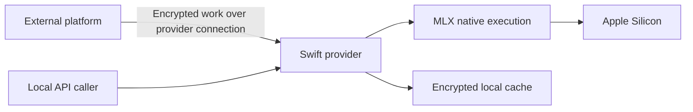

# Provider Architecture

> Last updated: 2026-10-09

The Swift provider owns on-device model execution and local services. It can
connect outbound to the external platform or expose a local API without a
coordinator. This repository also owns the independent landing application.

## Mechanism

The provider validates model identity, load feasibility and request ownership
before native execution. It preserves cancellation, drain and native retirement
boundaries. Local APIs remain local source ownership, not copied backend code.
See [provider components](components/provider.md), [inference](inference.md),
[native blocks](native-block-inference.md) and [memory policy](hardware-support.md).

## Contracts And Trust

Protocol and telemetry fields are [explicit wire contracts](../reference/protocol-messages.md).
Model discovery and publication use [registry manifests](model-registry.md).
The provider is the plaintext inference endpoint; the [privacy model](security/encryption.md)
describes the external coordinator's transient visibility as well as on-device
protections and cache-storage limits. No repository split changes those facts.

Backend routing, billing, persistence and consumer/admin apps are maintained in
[platform architecture](https://github.com/Layr-Labs/darkbloom-platform/tree/48a198c71a2d30feec5597bacf1101120f7f955d/docs/architecture).

## Related

- [MLX dependencies](components/mlx-swift.md)
- [Prefix cache](prefix-cache.md)
- [Landing](../../landing/README.md)
- [Ownership](../developer/navigation.md)
