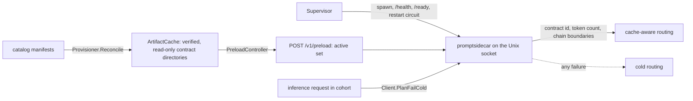

# Prompt-contract sidecar

> Last updated: 2026-10-03

The Go `LowerResponsesInferenceBody` serving adapter preserves ordered inline
media; it does not broaden this sidecar's text-only cache-planning contract.
Go `endpointContainsMedia` and Rust `content_collection_has_media` reject media
in both message content and function-call outputs. Text-only production vectors
and normalization identities remain unchanged. See the
[Responses API contract](../reference/api-contracts.md#responses-api) for serving
formats; native multimodal checkpoint reuse is a separate engine capability.

How the coordinator's `promptsidecar` child process derives deterministic,
provider-compatible token boundaries so exact-cache routing can predict which
provider already holds a prompt's prefix, and why a sidecar that is disabled,
unhealthy, overloaded, timed out or malformed can never block ordinary
inference. Read this to understand contract identity, the block chain and the
process trust boundary; every `EIGENINFERENCE_PROMPT_SIDECAR_*` knob and its
default is in
[`../reference/configuration.md#prompt-sidecar-and-media-fetch`](../reference/configuration.md#prompt-sidecar-and-media-fetch),
and the block format the provider shares is in [`prefix-cache.md`](prefix-cache.md).

## Context

Cache-aware routing ([`cache-aware-routing.md`](cache-aware-routing.md)) needs
the coordinator to know, before dispatch, which provider holds the KV blocks of
a prompt's prefix. The provider derives those block hashes from its own
tokenizer, chat template and normalisation
(`PromptContractIdentity.compute(modelDirectory:)`,
`provider-swift/Sources/ProviderCoreFoundation/PromptContractIdentity.swift`);
the coordinator therefore has to run the same normalisation, template render
and tokenisation with byte-identical results, in a process that never keeps a
prompt-derived byte. That work is isolated in a Rust child, `promptsidecar`
(`coordinator/promptsidecar/`), supervised by the Go package
`coordinator/promptcontract/`.

The inference path consults the sidecar only when routing mode is `on`, the
request is inside the operational rollout cohort, every active artifact has
been provisioned, and the request's contract has been explicitly preloaded.
Any other state — including every failure listed below — is ordinary cold
routing.

## Mechanism



### Process and lifecycle

The coordinator starts `promptsidecar` as its child only when
`EIGENINFERENCE_PROMPT_SIDECAR_ENABLED` is true (`Supervisor.runChild`,
`coordinator/promptcontract/supervisor.go`). It creates the socket directory
with mode `0700` (`prepareSocketDirectory`), passes only bounded numeric
settings and local paths, and uses separate probes and transports for liveness
and readiness: `GET /health` is a cheap liveness probe that stays responsive
while contracts load; `GET /ready` gates cache planning until preload
succeeds (`coordinator/promptsidecar/src/server/handler.rs`). Planning, health,
startup/preload and shutdown have independent deadlines
(`EIGENINFERENCE_PROMPT_SIDECAR_TIMEOUT_MS`, `_HEALTH_TIMEOUT_MS`,
`_STARTUP_TIMEOUT_MS`, `_PRELOAD_TIMEOUT_MS`, `_SHUTDOWN_TIMEOUT_MS`). A single
missed health probe never restarts the child: the supervisor requires
`EIGENINFERENCE_PROMPT_SIDECAR_HEALTH_FAILURE_THRESHOLD` consecutive
post-liveness failures, records the categorical restart reason and exit
status, retains only a bounded stderr tail
(`EIGENINFERENCE_PROMPT_SIDECAR_STDERR_MAX_BYTES`), and applies restart backoff
and a restart-loop circuit (`EIGENINFERENCE_PROMPT_SIDECAR_RESTART_MIN_MS`,
`_RESTART_MAX_MS`, `_RESTART_WINDOW_MS`, `_RESTART_MAX_IN_WINDOW`,
`_RESTART_COOLDOWN_MS`; `restartCircuitDelay`,
`coordinator/promptcontract/supervisor_status.go`). Shutdown sends `SIGTERM`,
then kills a child that exceeds the shutdown deadline. On Linux the child also
installs `PR_SET_PDEATHSIG` and verifies the supervisor PID
(`coordinator/promptsidecar/src/main.rs`), so a coordinator crash cannot leave
an orphan retaining the socket.

Every `EIGENINFERENCE_PROMPT_SIDECAR_*` variable — safety controls, paths,
provisioning concurrency and the sidecar-side limits — is listed once, with its
default and range, in
[`../reference/configuration.md#prompt-sidecar-and-media-fetch`](../reference/configuration.md#prompt-sidecar-and-media-fetch);
`promptcontract.ReadSupervisorConfig` (`coordinator/promptcontract/config.go`)
reads them and `Check` refuses startup on an out-of-range value.

The sidecar serves HTTP/1.1 only on the Unix socket named by
`EIGENINFERENCE_PROMPT_SIDECAR_SOCKET`. The socket is mode `0600`; there is no
TCP listener and no network client. Connections stay alive and the Go client
pools them (`newUnixTransport`, `coordinator/promptcontract/client.go`).
Resource consumption is bounded by the request-body limit
(`EIGENINFERENCE_PROMPT_SIDECAR_MAX_BODY_BYTES`), the connection limit
(`_MAX_CONNECTIONS`), the planning semaphore (`_MAX_CONCURRENCY`), the token
limit (`_MAX_TOKENS`), the contract LRU (`_MAX_LOADED_CONTRACTS`), the per-plan
deadline (`_TIMEOUT_MS`) and, on Linux, the address-space limit
(`_MEMORY_LIMIT_MIB`). Completed connection tasks are reaped continuously.
Contract misses use a per-contract singleflight (`SingleflightLru`,
`coordinator/promptsidecar/src/artifact_cache.rs`): one worker loads the contract
and concurrent callers wait for that result. The contract LRU owns loaded
artifacts strongly. A second, bounded weak cache shares immutable parsed
tokenizers by their verified `tokenizer.json` digest; it does not keep an unused
tokenizer alive after the last contract or caller releases it. Every contract
still reads and verifies every declared artifact before tokenizer reuse
(`load`, `coordinator/promptsidecar/src/artifacts.rs`). Templates, tokenizer
configuration and model metadata remain separate for each contract. Both caches
use the same singleflight implementation and configured LRU capacity; the
planner semaphore bounds concurrent loads and plans.

At startup the sidecar binds its socket and reports live but not ready; it does
not discover or load every directory left on disk. After asynchronous artifact
provisioning finishes (`Provisioner.Reconcile`,
`coordinator/promptcontract/provisioner.go`), the coordinator sends the
complete, deduplicated active set to `POST /v1/preload`, which loads that set
sequentially before traffic (`coordinator/promptsidecar/src/preload.rs`). This
prevents stale contracts from consuming the bounded cache during a restart. The
endpoint serializes preload runs, stops new plans while swapping readiness,
rejects sets larger than the configured contract capacity
(`validate_contracts`), and reports only bounded cold/warm/failure results. The
Go preload gate (`PreloadController.ReadyFor`,
`coordinator/promptcontract/preload_controller.go`) records the child
generation and will not route a model until its contract succeeded in that
generation. A fresh or stale artifact root is live but has no
planning-eligible contract until this explicit handoff completes.

Prompt artifacts live under `EIGENINFERENCE_PROMPT_SIDECAR_ARTIFACT_ROOT` on
the persistent disk. The verified artifact loader rejects symlinks in every
path component, so `/data` — a runtime symlink to the persistent disk — must
never be used as the artifact root.

`POST /v1/plan` accepts (`PlanRequest`, `coordinator/promptsidecar/src/api.rs`):

```json
{
  "prompt_contract_id": "<64 lowercase hex characters>",
  "scope_id": "<authenticated cache scope>",
  "endpoint": "chat_completions",
  "body": {}
}
```

It returns the contract identifier, the prompt token count, the ordered chain
boundaries (one per complete block — block size in
[`prefix-cache.md#block-hashing`](prefix-cache.md#block-hashing)), and the last
lookup-eligible boundary (`PlanResponse`). The normalized body and token IDs
remain transient and are not returned by the service. The offline fixture
generator is the only interface that emits token IDs.

### Provider service preparation

Before tool-choice normalization and template rendering, the planner mirrors
`MLXOpenAIService` response-format preparation: `json_object` and `json_schema`
insert the same system instruction after initial system messages
(`coordinator/promptsidecar/src/response_format.rs`, `prepare`). Schema JSON
matches the typed Swift `JSONValue` and `JSONEncoder.openAIServer` encoding.
The provider-bound body remains unchanged because the provider service inserts
this instruction itself. Qwen and Harmony system-turn folding then mirrors
`Qwen35TemplateFix` / `GPTOSSHarmonyTemplateFix` / `LeadingSystemMessageNormalizer` before rendering
(`coordinator/promptsidecar/src/leading_system.rs`, `normalize_messages`). Invalid or
unsupported shapes fail cold.

Five provider-side transformations that precede every template are mirrored in
`coordinator/promptsidecar/src/normalize.rs`:

1. **Member order.** Foundation dictionaries carry no order and
   `Jinja.Value(any:)` sorts every object it bridges with Swift `String <`, so
   `normalize` sorts every object in the final messages, tools and template
   context once, after all other steps (`sorted_object_keys`). The planner
   never relies on wire order. Today the shared prelude re-serializes every
   provider body from the decoded map, which sorts keys
   (`coordinator/api/inference/inference_preprocess.go`, `parseInferencePrelude`,
   `ForwardBody.Current`), but that follows from the prelude stamping the
   request date, not from a contract: `ForwardBody` forwards the caller's
   bytes verbatim whenever nothing is dirty, and JSON carried inside strings,
   such as tool-call `arguments`, is never re-serialized. The sort is
   therefore load-bearing.
2. **Tool-call arguments.** Decoded `arguments` take the value bridge's
   shape: sorted members and integral JSON doubles as integers, because
   `Jinja.Value(any:)` matches `Int` before `Double` (`provider_bridged_value`).
3. **Tool definitions.** A tool's `function` object keeps `name`,
   `description` and `parameters`, plus optional `strict` for Nemotron
   (`typed_function_definition`). `ChatTemplateFixes.normalizeToolMetadata`
   removes that SDK metadata for other families in both text and native media
   inputs. It preserves the media producer's existing schema/history handling.
4. **Harmony framing.** Assistant `content` and `reasoning_content` lose raw
   Harmony channel framing for every model family
   (`strip_harmony_channel_framing`, the mirror of `sanitizeJinjaMessages`).
5. **Content parts.** `output_text` parts contribute text exactly like `text`
   and `input_text` (`message_text`).

The provider's tokenization is the ground truth, so where the two runtimes
cannot be shown to agree the planner refuses the request and it is served
cold. Two such refusals belong to the mirrors above. Object keys that are not
already NFC are refused (`coordinator/promptsidecar/src/render/input.rs`,
`visit`): Swift orders keys by their composed scalars while the planner orders
bytes, so a decomposed key can render in a different position even without a
colliding sibling. Harmony framing is stripped only when every control token is
a whole extended grapheme cluster (`require_whole_grapheme_tokens`): Foundation
and Swift `Character` search do not match a token whose last character carries
a combining mark, joiner, variation selector, emoji modifier or spacing mark,
or whose first character follows a prepended format character, and
`replacingOccurrences` does not agree with `contains` on every one of those.

Three provider-side differences have no mirror and no refusal. Requests that
exercise them still plan, still fail their receipt with
`prompt_anchor_mismatch`, and still fence the provider and model:

- **Gemma `dictsort` collation.** The Gemma template orders tool `properties`
  and tool-call arguments with `dictsort`. MiniJinja compares keys with
  `unicase::UniCase` (its `unicode` feature is enabled), so keys that differ
  only in case agree on both sides. swift-jinja compares with
  `localizedCaseInsensitiveCompare`, which collates `_` before digits and
  accented letters next to their base letter; `_a` against `1a`, or `é`
  against `z`, renders in the opposite order. Deciding experiment: add a
  Gemma case whose tool properties are `_a` and `1a`, regenerate the vectors
  and run `ProductionPromptParityTests`; it fails at the first property name.
  Then run the same case on a provider under two system locales with keys
  `aa` and `z` (Danish collates `aa` after `z`): if the token arrays differ,
  the provider's order is locale-dependent and no planner mirror can be
  exact, which leaves a locale-independent comparator on the provider with a
  renderer version change, or a refusal for Gemma requests with more than one
  key in a sorted map.
- **Combining-mark scripts on the Qwen pre-tokenizer.** For Devanagari,
  Bengali, Tamil, Thai and vocalized Arabic, `swift-transformers` keeps marks
  with their base letter where the `tokenizers` crate splits them, so the
  provider's prompt is shorter. Deciding experiment: encode one sentence per
  script with `LocalTokenizerLoader` and with the crate from the same
  `tokenizer.json`, then apply the file's pre-tokenizer pattern alone with
  `NSRegularExpression` and with the crate; the first span that differs shows
  whether the `\p{M}` and `\p{L}` classes or the matching unit differ.
- **CRLF on the GPT-OSS and Qwen pre-tokenizers.** `":\r\n"`, a code fence
  followed by `"\r\n"`, and `"\r\n\r\n"` split differently, so the provider's
  prompt is longer. Deciding experiment: the same two-step comparison with
  those three strings; if the pattern spans agree and only the merged tokens
  differ, the difference is in how `"\r\n"` is segmented before the model's
  merges apply.

Both pre-tokenizer differences are departures of the provider from the
reference tokenizer, so they also change what the model reads for those
inputs. Correcting them changes provider token arrays and therefore requires a
tokenizer version change.

Constrained tool validation and grammar-cost accounting inspect the same borrowed
`const`/`enum` values from the parsed schema; they do not allocate temporary
reference vectors. Numeric, nullable, delimiter and grammar-complexity bounds
remain in `coordinator/promptsidecar/src/tool_constraint.rs`
(`validate_finite_values`, `constrained_schema_grammar_cost`).

The production parity gate captures the request entering the engine through
`MLXOpenAIService.streamChatCompletionFrames`, then checks tokens and scoped
block hashes. Calling the tokenizer directly on the inbound body would miss
service-level prompt transformations
(`provider-swift/Tests/ProviderCoreTests/Inference/Prompting/ProductionPromptParityTests.swift`).
This corrects planner parity with existing provider behavior; it does not change
the provider contract, relax receipt checks or clear existing fences.

### Contract identity

`prompt_contract_id` is SHA-256 over this binary encoding (`ContractID`,
`coordinator/promptcontract/contract.go`; `compute_contract_id`,
`coordinator/promptsidecar/src/contract.rs`):

1. `u32be(length) || bytes` for the domain
   `darkbloom.prompt-contract.v1`.
2. `u32be(artifact_count)`.
3. For artifacts sorted by `(role, path, sha256)`, length-prefixed UTF-8 role,
   length-prefixed UTF-8 relative path, and a length-prefixed 32-byte digest.
   Only manifest roles `config`, `template`, and `tokenizer` participate
   (`IsPromptRole`).
4. Length-prefixed name and value pairs for `normalization`, `renderer`,
   `tokenizer`, and `block_hash`.
5. Length-prefixed `block_size` followed by the block size as `u32be`
   (`CBv2BlockHasher.defaultBlockSize`,
   [`prefix-cache.md#block-hashing`](prefix-cache.md#block-hashing)).

The semantic versions (`CurrentVersions`) are:

- normalization: `darkbloom-request-normalization-v8` (retains v7 model policies, including native MiMo history/null handling, and preserves typed function-level `strict` only for Nemotron)
- renderer: `swift-jinja-request-date-compatible-v4` (Nemotron-scoped Transformers-compatible scalar/JSON filters)
- tokenizer: `huggingface-tokenizer-json-v1`
- block hash: `PromptContractIdentity.blockHashVersion`, stated in
  [`prefix-cache.md#block-hashing`](prefix-cache.md#block-hashing)

Changing an artifact digest, path, role, semantic implementation, or block size
creates a different contract.

The instruction contract preserves the user's independent requested calls
when `parallel_tool_calls` is true, null or omitted; explicit false keeps the
previous singular wording. Named calls remain restricted to the selected
function. `ToolChoicePromptPolicy.prepare` and
`coordinator/promptsidecar/src/normalize.rs` (`apply_tool_choice_policy`) share
exact instruction fixtures across all four parallel settings. Auto and none
modes are unchanged.

V6 leaves the original messages unchanged for required/named text requests only
when the serving ID is a qualified Qwen4 ID and `model_type` is `qwen4_exp`.
The registry and legacy IDs are defined in
`provider-swift/Sources/ProviderCoreFoundation/Qwen4ModelIdentity.swift`
(`isQualified`) and mirrored by `coordinator/promptsidecar/src/qwen4_identity.rs`.
Media-bearing requests do not select this policy. The trained template supplies
the tool format; the provider's native framing constraint and final
name/schema/cardinality validator enforce the request. Selected named tools are
still filtered before rendering. Swift serving, admission/accounting and the
Rust planner share this predicate; other models retain their prior messages.
Sources: `provider-swift/Sources/ProviderCore/Inference/Prompting/ToolChoicePromptPolicy.swift`
(`prepare`), `provider-swift/Sources/ProviderCore/Inference/Prompting/ProviderPromptContractPipeline.swift`
(`tokenize`) and `coordinator/promptsidecar/src/normalize.rs` (`apply_tool_choice_policy`).

Native `qwen4_exp` / `qwen4_exp_text` and the explicitly supported Nemotron
identities preserve caller reasoning during forced tools instead of inheriting
the legacy Qwen thinking-OFF workaround. Typed `reasoning.effort` takes
precedence over the raw effort alias; malformed typed controls fail planning.
The owned Next artifact rejects unsupported active efforts rather than mapping
them to a different value. The context/error vectors mirror
`Qwen4SupportPolicy.validateReasoningContext` and
`MultiModelBatchSchedulerEngine.templateAdditionalContext`.

A provider and coordinator using different normalization or renderer identities
cannot earn cache credit or affinity from the other's contract:
`coordinator/registry/cache_tiers.go`
(`capabilityMatchesPlan`) requires identical IDs while ordinary serving remains
available. Before an authorized rollout, regenerate prompt artifacts/preloaded
contracts and any configured exact artifact allowlist using the new identity;
do not relabel old cache objects as v8. Tokenizer and block-hash versions are
unchanged. No deployment or allowlist mutation follows merely
from building this private candidate.

The new registry ID additionally requires a compatible provider version for
all inference, not merely cache credit; see the
[registry-ID gate](routing.md#native-model-capacity-and-registry-identity).
The v8 transition preserves non-Nemotron template inputs and token arrays while
regenerating contract-dependent hashes. The checked-in production corpus has
no Nemotron model; its identity-only transformation cannot establish Nemotron
prompt parity. Nemotron's reference corpus separately verifies the changed
tool metadata and filter bytes. Model weights and floating-point behavior are
unchanged.

Nemotron's Rust filters mirror the provider's `String(Double)` spelling rather
than Rust's decimal display or serde's exponent spelling. The normalizer applies
the SDK's Int-before-Double conversion to Nemotron tool values before rendering;
numeric enum/default/minimum fields therefore produce identical token counts
and cache blocks. Decimal/exponent tool values at or above the `2^53` exact
integer boundary stay cold: serde's Double may already have lost a digit that
Swift's typed Int decoder preserves. Plain signed integer spellings remain
eligible. The shared 526-value finite-number oracle exercises both
Swift and Rust filters, and the pinned reference/edge corpora exercise the real
provider tokenizer and Rust planner. See the
[Nemotron parity gate](../developer/test.md#9-prompt-contract-parity-fixtures-and-vectors).

The artifact loader records the pinned `swift-transformers` precedence:
`chat_template.jinja`, then `chat_template.json`, then the tokenizer-config
value. V2 readiness is intentionally narrower: the provider advertises an exact
prompt contract only when `chat_template.jinja` exists and passes the real
serving-render checks. Alternate template sources stay cold until their
multi-template selection and Swift compatibility rewriting are proven by the
same production gate; their hashes still remain part of artifact identity.

### Block-chain encoding

For block index `i`, the engine, Go package (`BlockHash`,
`coordinator/internal/promptcontract/identity/blockhash.go`) and Rust sidecar (`block_hash`,
`coordinator/promptsidecar/src/hash.rs`) compute:

```text
SHA256(
  "darkbloom.prefix-block-chain.v1" ||
  field(prompt_contract_id) ||
  field(scope_id) ||
  parent_hash_32 ||
  u32be(i) ||
  u32be(token_0) || ... || u32be(token_n)
)
```

`field(x)` is `u32be(byte_length(x)) || x`; the fixed domain is unprefixed and
the first parent is 32 zero bytes. Only complete blocks are hashed, so the
token sequence has an invariant length and needs no count field. Lookup always
reserves the final token (`LastCompleteBoundary`): a prompt of exactly one
block has no eligible boundary, one block plus one token has the first
boundary, and two exact blocks still use only the first boundary. The
provider's SSD tier stores the resulting blocks in the DBK3 format described in
[`../reference/ssd-kv-cache.md#dbk3-file-format`](../reference/ssd-kv-cache.md#dbk3-file-format);
its layout-epoch binding includes the block size.

### Artifact handoff and threat model

The Go cache (`ArtifactCache.Ensure`,
`coordinator/promptcontract/artifact_cache.go`) accepts catalog manifest data,
filters to prompt roles, verifies the model aggregate identity
(`verifyManifestAggregate`), downloads each declared file from the configured
HTTPS origin, rejects cross-origin redirects (`sameOrigin`), verifies size and
SHA-256 while writing, fsyncs files and directories, and atomically renames a
random same-root temporary directory. `os.Root`, exclusive creation,
relative-path validation, and symlink checks (`rejectSymlinks`) contain
traversal. Published files are mode `0400` and directories mode `0500`; every
reuse re-hashes every artifact (`verifyPublished`).

The Rust process never downloads. It opens every path component from `/` with
`O_NOFOLLOW` (`load`, `coordinator/promptsidecar/src/artifacts.rs`), so a
symlink anywhere in the artifact path is rejected; it rechecks sizes and
hashes, verifies metadata and contract identity, and loads only a
coordinator-published contract directory.

Protected failures include malicious JSON, oversized or slow bodies, unsafe
paths, symlinks, changed artifacts, wrong contracts, incompatible templates,
unsupported tokenizers, child crashes, stale sockets, process hangs, and
malformed responses. Errors contain fixed categories (`ErrorResponse`,
`coordinator/promptsidecar/src/api.rs`) and never include request bodies,
rendered prompts, token IDs, or hashes. Cache routing treats every such
failure as ordinary cold routing (`Client.PlanFailCold`,
`coordinator/promptcontract/client.go`).

`GET /metrics` returns a bounded JSON snapshot for the local coordinator
(`MetricsSnapshot`, `coordinator/promptsidecar/src/metrics.rs`): planning
success/failure/capacity/timeout counts and latency buckets,
cold/warm/waited/failed contract loads and cold-load latency, preload runs, and
cache occupancy. It contains no model IDs, contract IDs, accounts, scopes,
prompts, tokens, or chain hashes. Public status projects only aggregate values.

### Request-owned template date

The coordinator captures one UTC Gregorian day when a request enters the shared
prelude, overwriting the reserved `_darkbloom_prompt_date` body field. Endpoint
lowering, cache planning, fallback and retries reuse that value. Local provider
HTTP captures its own date and also overwrites caller input. See the
[provider-bound body contract](../reference/api-contracts.md#provider-bound-request-normalization).

Both renderers bind direct literal `strftime_now("%Y-%m-%d")` calls to this
request date. Swift passes a private request clock through template context;
`normalizeSwiftJinjaTemplate` installs it with a statement that emits no output
before the model template executes. This avoids the pinned interpreter's
built-in reset without modifying model artifacts or retaining a process-wide
clock. A render without request context retains ordinary built-in behavior for
scan checks. The Rust planner requires the captured date when a template uses
the clock (`validate_template_source`, `coordinator/promptsidecar/src/render.rs`).

Computed formats, clock aliases, unsupported formats and invalid or missing
dates remain ineligible for exact planning. The date syntax and source guards
live in `provider-swift/Sources/ProviderCoreFoundation/PromptRenderDate.swift`
and `coordinator/promptsidecar/src/request_date.rs`. New requests after UTC
midnight use the new date; retries keep their original date. Actual rendered
tokens determine reuse, so a date change affects only templates that emit it.
The semantic version changes every prompt-contract ID; artifact allowlists and
preloaded contracts must be regenerated before a rollout.

### Swift-compatible template values

The provider pins Swift Jinja 2.3.6, including neighboring loop items used to
group Qwen tool responses. The Rust renderer's `tojson` filter mirrors Swift's
recursive key ordering, ASCII and slash escaping, numeric spelling and indent
rules (`coordinator/promptsidecar/src/render/json.rs`, `tojson`). Output and
sorting scratch share a bounded byte budget. Decimal JSON parsing uses
`serde_json`'s `float_roundtrip` feature so supported fractional values reach
the renderer with the same bits.

Before normalization, the planner rejects known input shapes whose Swift and
Rust representations differ (`coordinator/promptsidecar/src/render/input.rs`).
These include canonically equivalent duplicate object keys and unsupported
numeric ranges. Recognized JSON-encoded tool arguments receive the same checks
before null sanitation; ordinary message text stays opaque. Unsupported inputs
use ordinary serving without exact cache planning. Native boolean tool argument
values remain booleans through `ParserUtilities.asSendable` in
`libs/mlx-swift-lm/Libraries/MLXLMCommon/Tool/Parsers/ParserUtilities.swift`.

### Parity fixtures and measured latency

For `model_type=nemotron_h`, the provider and sidecar instead use the pinned
Nemotron template's Transformers-compatible default scalar and JSON filters.
`provider-swift/Sources/ProviderCoreFoundation/NemotronTemplateFilters.swift`
and `coordinator/promptsidecar/src/render/nemotron.rs` preserve Unicode and
use comma-space/colon-space JSON separators. The Swift writer bounds nesting
at 128 and output at 16 MiB; unsupported filter options fail closed.
`NemotronTemplateFilterBinding` binds only the `string` filter to a private
name because Swift Jinja shares filter and type-test names. It leaves
`is string` tests intact. Model artifact templates are not modified.

The SDK preserves optional boolean `strict` (including false); provider and
sidecar normalization retain it only for Nemotron. Unknown function fields
are still outside the typed SDK contract. This is not a general arbitrary-JSON
or every-template parity guarantee. The fixture corpus verifies the pinned
template's supported request shapes; it does not certify model tool-selection
quality.

The normalization-v8/renderer-v4 identity change affects all model families,
including those with unchanged prompt bytes. Existing checkpoints remain separated by prompt
identity and start cold. Coordinator/sidecar contracts and artifact allowlists
must be regenerated with the provider rollout; rollback restores the prior
provider/coordinator versions together, never relabeling old cache entries.

`fixtures/prompt-contract/v1` is shared by Rust, Go, and Swift tests:
`contract_vectors.json` and `block_hash_vectors.json` hold the contract and
block-hash vectors; `corpus.json` contains complete requests for tools, null
sanitization, Harmony and Gemma normalization, reasoning effort, Unicode, all
four endpoints, exact block multiples, and long prompts;
`production_vectors.json` holds the per-model normalized bodies, token IDs and
boundaries generated from manifest-pinned, coordinator-provisioned artifacts,
and `manifests/` is the catalog snapshot they were generated from. Production
tokenizer/template/config artifacts are not stored in this repository. How to
regenerate the vectors and run the three-way parity gate
(`scripts/verify-prompt-parity.sh`) is a developer procedure:
[`../developer/test.md#9-prompt-contract-parity-fixtures-and-vectors`](../developer/test.md#9-prompt-contract-parity-fixtures-and-vectors).
Models with unsupported provider-local dynamic time stay in the inventory with
`cache_routing_eligible: false` and `ineligibility_reason: "dynamic_time"`
(written by `prompt-fixtures`,
`coordinator/promptsidecar/src/bin/prompt-fixtures.rs`), have no routable
vectors, and must fail provider contract readiness
(`PromptContractIdentity.compute(modelDirectory:)`).

Latency is enforced by `coordinator/promptsidecar/tests/planner_fixture.rs`
(`measure_fixture_planning_latency`, `measure_fixture_unix_http_latency`): 1,000
warm plans of the local `"hello world " × 128` fixture, asserting
`p99 <= 250 × p50` and `16 × p99 <= 1 s` (`assert_latency_distribution`) for
both the in-process planner and the persistent Unix HTTP/1.1 path. A one-off
2026-07-14 run of that harness (arm64 Apple Silicon release build, Rust 1.88.0)
recorded 72 µs p50 / 133 µs p99 in the planner and 82 µs / 168 µs over HTTP
including JSON work; CI checks the ratios, not these absolute figures, and
neither includes production model cold-load cost. The
`EIGENINFERENCE_PROMPT_SIDECAR_TIMEOUT_MS` deadline leaves the enforced ≥ 16×
p99 margin until manifest-pinned production measurements replace the synthetic
gate.

## Invariants

1. **Fail cold.** A disabled, not-live, not-ready, overloaded, timed-out or
   malformed sidecar yields cold routing, never an inference error —
   `coordinator/promptcontract/client.go` (`Client.PlanFailCold`,
   `validatePlan`).
2. **Identity is a pure function of the artifact set.** `prompt_contract_id`
   is SHA-256 over the sorted prompt-role artifact digests, the four semantic
   versions and the block size; changing any of them yields a different
   contract — `coordinator/promptcontract/contract.go` (`ContractID`),
   `coordinator/promptsidecar/src/contract.rs` (`compute_contract_id`),
   `provider-swift/Sources/ProviderCoreFoundation/PromptContractIdentity.swift`
   (`compute`).
3. **Three implementations, one chain.** Go, Rust and the Swift provider
   produce byte-identical chain hashes and boundaries for the shared vectors —
   `coordinator/internal/promptcontract/identity/blockhash.go` (`BlockHash`,
   `LastCompleteBoundary`), `coordinator/promptsidecar/src/hash.rs`
   (`chain_hashes`), `fixtures/prompt-contract/v1`,
   `scripts/verify-prompt-parity.sh`.
4. **A model routes only after its contract preloaded in the current child
   generation** — `coordinator/promptcontract/preload_controller.go`
   (`PreloadController.ReadyFor`).
5. **The sidecar never downloads and never follows a symlink**; it loads only
   a coordinator-published, re-verified contract directory —
   `coordinator/promptsidecar/src/artifacts.rs` (`load`),
   `coordinator/promptcontract/artifact_cache.go` (`ArtifactCache.Ensure`,
   `rejectSymlinks`, `verifyPublished`).
6. **No prompt-derived bytes leave the sidecar.** A plan returns the contract
   id, the token count and chain boundaries; errors are fixed categories;
   `/metrics` carries no identifiers; only the offline fixture generator emits
   token IDs — `coordinator/promptsidecar/src/api.rs` (`PlanResponse`,
   `ErrorResponse`), `coordinator/promptsidecar/src/metrics.rs`
   (`MetricsSnapshot`), `coordinator/promptsidecar/src/bin/prompt-fixtures.rs`.
7. **One missed probe never restarts the child.** Restarts need the
   consecutive-failure threshold and pass through backoff and the restart
   circuit — `coordinator/promptcontract/supervisor.go` (`Supervisor.run`),
   `coordinator/promptcontract/supervisor_status.go` (`restartCircuitDelay`).
8. **Template dates belong to requests.** Only the reviewed literal date format
   with valid request context can participate. Other clock use gets a fixed
   planning failure —
   `coordinator/promptsidecar/src/render.rs` (`validate_template_source`).

## Failure modes

| Symptom | Cause | Where |
|---|---|---|
| Every request routes cold although routing mode is `on` | Sidecar disabled, not live or not ready; the model's contract has not preloaded in this child generation; the plan timed out or failed validation | `client.go` (`PlanFailCold`, `validatePlan`), `preload_controller.go` (`ReadyFor`) |
| Child restarts repeatedly, then stops being restarted | Consecutive health failures reached the threshold; the restart circuit opened and suppresses restarts for the cooldown | `supervisor_status.go` (`restartCircuitDelay`, `setRestartSuppressed`) |
| Contract provisioned but never planning-eligible | Artifact root reached through a symlink (for example `/data`), or an artifact failed size or hash re-verification | `artifacts.rs` (`load`), `artifact_cache.go` (`verifyPublished`) |
| Fixed planning failure for one model on every request | Unsupported template clock use or missing request date; body over `EIGENINFERENCE_PROMPT_SIDECAR_MAX_BODY_BYTES`; rendered prompt over `_MAX_TOKENS` | `render.rs` (`RenderError::DynamicTime`), `server/handler.rs` (body limit), `planner.rs` (`PlanError::TooManyTokens`) |
| Preload rejected | Active set larger than `EIGENINFERENCE_PROMPT_SIDECAR_MAX_LOADED_CONTRACTS` | `preload.rs` (`validate_contracts`) |
| `verify-prompt-parity.sh` fails | Regenerated vectors differ from `production_vectors.json`; a manifest, artifact or corpus case is missing; an unrecognised template incompatibility — no fabricated token IDs are accepted | `scripts/verify-prompt-parity.sh`, `prompt-fixtures.rs` (`require_model_manifests`, `require_case_ids`) |

## Code map

| Concern | File / symbol |
|---|---|
| Supervisor: spawn, probes, restart circuit, shutdown | `coordinator/promptcontract/supervisor.go`, `coordinator/promptcontract/supervisor_status.go`, `coordinator/internal/promptcontract/process/supervisor_process.go`, `coordinator/promptcontract/supervisor_defaults.go` |
| Configuration and startup checks | `coordinator/promptcontract/config.go` (`ReadSupervisorConfig`, `Check`) |
| Go client: plan, fail-cold, preload, metrics | `coordinator/promptcontract/client.go` (`Plan`, `PlanFailCold`), `coordinator/promptcontract/client_control.go` (`Ready`, `Preload`, `Metrics`) |
| Artifact provisioning and verified publication | `coordinator/promptcontract/provisioner.go`, `coordinator/promptcontract/artifact_cache.go` |
| Descriptor-relative artifact paths | `coordinator/internal/promptcontract/artifacts/secure_files_unix.go` (`walkSecureDirectories`): absolute and root-relative path validation share descriptor traversal, optional directory creation, `O_NOFOLLOW` checks and ownership cleanup |
| Preload gate per child generation | `coordinator/promptcontract/preload_controller.go` |
| Contract identity and block chain (Go) | `coordinator/promptcontract/contract.go`, `coordinator/internal/promptcontract/identity/blockhash.go` |
| Sidecar process, socket server, routes | `coordinator/promptsidecar/src/main.rs`, `coordinator/promptsidecar/src/server.rs`, `coordinator/promptsidecar/src/server/handler.rs` |
| Bounded HTTP JSON decoding | `coordinator/promptsidecar/src/server/handler.rs` (`decode_request`): plan and preload share declared/streamed body bounds, read deadline and JSON decoding; each operation retains its own malformed-request message and worker timeout policy |
| Planner, contract LRU, artifact loading | `coordinator/promptsidecar/src/planner.rs`, `coordinator/promptsidecar/src/artifact_cache.rs`, `coordinator/promptsidecar/src/artifacts.rs` |
| Normalisation, render, tokenizer-side identity and hashes | `coordinator/promptsidecar/src/normalize.rs`, `coordinator/promptsidecar/src/render.rs`, `coordinator/promptsidecar/src/contract.rs`, `coordinator/promptsidecar/src/hash.rs` |
| Template value coercion | `coordinator/promptsidecar/src/render_values.rs` (`sanitize`, `sanitize_array`, `scalar_string`): base/Harmony normalization and Gemma argument/schema preparation share null removal and scalar string rendering |
| Wire shapes and metrics | `coordinator/promptsidecar/src/api.rs`, `coordinator/promptsidecar/src/preload.rs`, `coordinator/promptsidecar/src/metrics.rs` |
| Provider-side identity | `provider-swift/Sources/ProviderCoreFoundation/PromptContractIdentity.swift` |
| Fixtures, generator, parity gate | `fixtures/prompt-contract/v1`, `coordinator/promptsidecar/src/bin/prompt-fixtures.rs`, `coordinator/cmd/promptfixtureinput`, `coordinator/cmd/promptsidecarloadproof`, `scripts/verify-prompt-parity.sh`, `coordinator/promptsidecar/tests/planner_fixture.rs` |

## Related

- [`prefix-cache.md`](prefix-cache.md) — block size, block-hash version and the provider's prefix-reuse rules
- [`cache-aware-routing.md`](cache-aware-routing.md) — how the coordinator uses the plan
- [`inference.md`](inference.md) — the provider side of the same contract
- [`../reference/ssd-kv-cache.md`](../reference/ssd-kv-cache.md) — the DBK3 blocks the chain addresses
- [`../reference/configuration.md#prompt-sidecar-and-media-fetch`](../reference/configuration.md#prompt-sidecar-and-media-fetch) — every `EIGENINFERENCE_PROMPT_SIDECAR_*` variable and default
- [`../developer/test.md#9-prompt-contract-parity-fixtures-and-vectors`](../developer/test.md#9-prompt-contract-parity-fixtures-and-vectors) — regenerating vectors and running the parity gate

### MiMo thinking alias

For exact `mimo_v2`, `coordinator/promptsidecar/src/mimo_v26.rs`
(`additional_context`) accepts Boolean `chat_template_kwargs.thinking` as a
fallback alias for `enable_thinking`. Nested `reasoning.enabled`, top-level
`enable_thinking`, and kwargs `enable_thinking` retain precedence. Every
supplied alias is type checked. The provider mirrors this in
`MiMoV26RawControlEvidence` and `MiMoV26TemplateFix`; existing valid requests
retain identical normalized content and contract identity.
