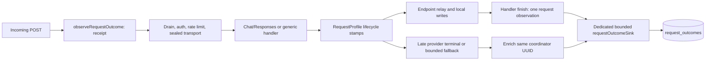

# Incoming request accounting

> Last updated: 2026-09-06 · commit `bbf6f83d4`

`request_outcomes` records unsampled observations of incoming inference requests, including early rejections, independently of sampled attempt profiles. Operators use this source to distinguish final request outcomes from internal retries. The dashboard aggregation and presentation work in issue #845 remains open.

## Context

`inference_routes` has provider-attempt identity, `request_profiles` samples successful traffic, and `request_rejections` omits several early exits. None supplies a complete incoming-request denominator. Existing uptime counters also have protected commit-time definitions. This ledger adds evidence without changing those sources, HTTP responses, routing, retries, billing, or provider health attribution.

The ledger is asynchronous and best effort. Unsampled means every covered request produces observations; it does not mean every observation reaches durable storage. Its exact counts describe observed rows. A traffic-wide fulfillment percentage requires independent reconciliation of coverage, process restarts, drops, errors and still-open records. Neither completion nor a successful local write proves upstream receipt or acceptance.

## Mechanism

`coordinator/api/request_outcome.go` (`observeRequestOutcome`) wraps each inference route before drain, authentication, rate limiting, sealed transport and the endpoint handler. The logging middleware mints an independent UUID for inference routes regardless of profiler configuration. This canonical ID joins the ledger and detailed profiles. The existing `X-Request-ID` header and access-log ID retain their behavior: a supplied client ID is echoed, otherwise the coordinator generates the existing short ID. Neither supplies ledger identity.

Only the compact fixed schema is unsampled. The existing in-memory request/attempt lifecycle objects collect evidence when the heavy profiler is off; `CompactOnly` preserves the profiler-off timing-header behavior. Heavy `request_profiles` persistence, provider-profile payload retention, sampling and fleet sampling retain their existing switches.

The request sink has 4,096 queued snapshots, one worker, batches of up to 128, and a 100 ms flush interval. Each database transaction has a one-second context deadline. Upserts run through one `pgx.Batch`. A full/closed queue drops the snapshot, while failed transactions increment a separate failure count. No telemetry write blocks the inference path. Shutdown waits up to two seconds for draining. The existing hourly retention loop deletes ledger rows by receipt time after 14 days, even with the heavy profiler off.

## Identity, coverage and time

| Contract | Definition and code |
|---|---|
| Covered requests | Matched `POST /v1/chat/completions`, `/v1/responses`, `/v1/completions`, `/v1/messages`, streaming and non-streaming. The observer wraps all route middleware in `coordinator/api/server.go` (`routes`). |
| Early exits | Drain, auth, account/key rate limits, sealed-envelope/decryption, validation, model resolution, balance, preflight, queue and dispatch exits are included. Unknown pre-parse streaming mode is NULL, not false. Existing explicit rejection stages/reasons are copied; uncovered reason details remain `ext_unknown` with the last known pipeline stage. |
| Exclusions | OPTIONS, other methods, unmatched paths, and connections that never enter these HTTP routes. An abort/panic records `handler_aborted`; the outer recovery response is outside the observer, so no replacement status is invented. |
| Request identity | `coord_request_id`, a coordinator-minted UUID. Repeated client `X-Request-ID` values do not merge requests. Empty identities are rejected by both stores. Count HTTP requests, never `n` or attempt rows. |
| Attempt identity | `(request_id, attempt)`, matching routes/profiles. `backup_of` and `winning` retain speculative relationships. A selected/queued placeholder is an attempt record, not necessarily a transmitted provider request. |
| Receipt cohort | `received_at` selects `[since, until)` in UTC. Consumers must convert ET day boundaries using the applicable DST offset before querying. Late revisions remain in the same receipt cohort and cannot enter the next window. |
| Terminal timing | `handler_finished_at` is handler/transport return. `finalized_at` means all retained attempt lifecycle halves have finalized; a grace fallback can finalize with no provider terminal. `updated_at` is snapshot creation, not request receipt or database commit. |
| Bounded detail | At most 128 compact attempt entries. `attempts_total` remains independent; `attempts_truncated=true` discloses omitted detail and prevents claiming a complete chain. The winner and request progress are evaluated across all registered attempts. |

## Evidence and precedence

`coordinator/store/request_outcomes.go` defines schema version 1. Evidence booleans mean an observation exists; false does not prove that nothing happened remotely. No token count, preamble, acknowledgment, successful reservation, committed HTTP 200, or profile `client_outcome=completed` establishes completed response delivery.

| Field | Meaning |
|---|---|
| `provider_content_observed` | The coordinator decoded recognized generated text/reasoning/tool output at provider ingress. A stricter parser than routing's permissive commitment discriminator excludes role-only, usage-only, finish-only, DONE, malformed, and error frames. It recognizes the supported endpoint payload shapes and has a bounded nesting depth. Unknown shapes do not supply content evidence. |
| `content_write_completed` | At least one recognized generated-content write completed locally. An earlier successful content write survives a later failed write. For sealed responses the observation occurs after the encrypted event/envelope write to the outer writer, not when plaintext was buffered. |
| `egress_completed` | The endpoint's successful terminal/body egress stamp exists and no failed/short client write or local sealing error occurred. It is local completion evidence, not acknowledgment from OpenRouter. |
| `client_departed` | The request context was canceled by handler return, or a relay recorded departure. It does not infer why the client left. A later provider completion remains independently visible. |
| `client_write_error`, `egress_error` | A client write failed/was short, or local sealed transport failed to encode output. These prevent a completion claim. They do not erase earlier successful content egress. |
| `attempts[].provider_complete_observed` | A matched complete frame arrived, independent of whether terminal arbitration accepted it. A discarded completion never proves delivered content or selected-winner completion. |
| `provider_outcome` | The selected winner's existing terminal evidence: `completed`, `error`, `not_dispatched`, `no_terminal`, or `unknown`. `unknown` means a matched completion was received but arbitration retained no authoritative outcome (for example a discarded empty speculative loser with detailed profiling off). When no winner exists, inspect individual attempt outcomes. |
| `response_progress` | `no_content_observed`, `content_observed`, or `provider_completed`; receipt-only records begin `unknown`. This dimension is provider progress, not client delivery. |
| Attempt dispatch | `write_submitted` records writer submission; `write_completed` records successful completion of the socket-write call; `provider_accepted` records the existing acknowledgment. An interrupted write has ambiguous provider receipt. No field proves engine admission. |

The summary `termination` follows deterministic precedence: unfinished handler → `in_progress`; inconsistent evidence → `unknown`; observed departure → `client_departure`; write/sealing error → `interrupted_response`; provider completed plus complete local egress and 2xx → `completed`; HTTP error → `rejected`; observed content or provider error without complete response → `interrupted_response`; otherwise → `unknown`. Underlying dimensions remain available.

A non-streaming provider may emit content and then fail while the client receives only an error body. That request is rejected with provider progress, with `content_write_completed=false`. A zero-token completion is completed if its provider terminal and endpoint egress contract complete successfully. A speculative loser's refusal/error cannot override a winner's completion.

Attempt finalization uses the existing idempotent handler/terminal lifecycle, including its 31-second missing-terminal fallback. Compact observers preserve the profiler-off `RemovePending`/settlement arbitration; they claim evidence only after winning that existing ownership boundary. Heavy profiling retains its existing earlier terminal claims. Evidence arriving after an attempt's existing finalization/retention boundary is not retroactively invented. Pending or abandoned receipts remain `in_progress`/unknown when terminal persistence is lost. There is no timeout-based fabrication of success or rejection.

## Versioned normalization

`normalizedAttemptOutcome` and `normalizedRequestOutcome` in `coordinator/api/request_outcome.go` are analytics-only mappings. Raw existing codes remain unchanged in routes, profiles and rejection records.

| Observation | Version 1 normalized code |
|---|---|
| Internal `deadline_unreachable` | `int_provider_deadline_rejected` |
| Final dispatch `429 / first_chunk_timeout` | `ext_first_content_timeout` |
| Final dispatch `429 / deadline_unreachable` | `ext_coordinator_exhausted` |
| Final `dispatch_exhausted` with recorded undecided selection exhaustion and no provider status | `ext_coordinator_exhausted`; `coordinator_exhausted=true` records the audited stop evidence |
| Any other known final rejection reason | `ext_legacy:<raw reason>` |
| Any other known internal reason | `int_legacy:<raw reason>` |
| Rejection with no recorded reason | `ext_unknown` |
| Completion, departure, or interrupted response | No final rejection code; inspect dimensions and raw diagnostics |

A raw historical `dispatch_exhausted` can represent a retained real provider error. Without the new stop evidence it stays legacy-scoped. Typed provider 504s, queue deadlines, and post-content errors never become the final first-content timeout by string matching. A final timeout describes the existing coordinator classification, not necessarily expiration of every historical absolute request clock. Refusals are evidence, not a mandatory root-cause field.

## Consistency and failure modes

1. The coordinator UUID is the primary key. Monotonically increasing revisions enrich one row. Duplicate identical revisions and stale revisions do not count twice.
2. Same-revision conflicting payloads or attempted receipt/endpoint identity changes set sticky `evidence_conflict`. Both stores preserve the original identity. Readers must surface conflict, not choose a last row arbitrarily.
3. Missing old rows do not become zero requests. Missing profiles do not remove ledger observations. Missing provider terminals stay `no_terminal`; a received but unowned completion stays explicitly `unknown`; heavy profiling remains independently sampled/disabled.
4. `GET /v1/admin/request-outcomes` requires existing admin authorization and returns an indexed bounded received cohort, a truncation flag, schema version, coverage label, and current-process sink counters. Store failures return 503, never an empty successful list. A full page must be narrowed before exact counts are claimed.
5. Process counters count observed receipts and persistence snapshots, not durable unique rows. Snapshot failures, queued work and restarts prevent traffic-wide denominator claims. Multi-process/historical coverage needs independent reconciliation; this API does not pretend otherwise.
6. Rollback leaves the additive table readable but stops new observations. Do not mix older traffic with newly covered receipts as if their coverage were equal. Retention is receipt-based, including late revisions.

## Code map

| Concern | Source |
|---|---|
| Observation, lifecycle and mapping | `coordinator/api/request_outcome.go` |
| Content and write evidence | `coordinator/api/request_outcome_egress.go`, `coordinator/api/sender_encryption.go` |
| Bounded persistence and health | `coordinator/api/request_outcome_sink.go`, `coordinator/api/request_outcome_admin.go` |
| Schema, revision merge and reads | `coordinator/store/request_outcomes.go`, `coordinator/store/postgres_request_outcomes.go`, `coordinator/store/memory_request_outcomes.go` |
| Live isolated endpoint regressions | `coordinator/api/request_outcome_integration_test.go`, `coordinator/api/request_outcome_test.go`, `coordinator/api/deadline_unreachable_integration_test.go` |
| Memory/Postgres parity and retention | `coordinator/store/request_outcomes_test.go` |

## Related

- [Existing attempt outcomes and protected counters](request-outcome-observability.md)
- [Heavy system profiler](system-profiler.md)
- [Storage and migrations](storage.md)
- [Tracking issue #845](https://github.com/Layr-Labs/d-inference/issues/845): aggregation/dashboard work remains separate and incomplete.
