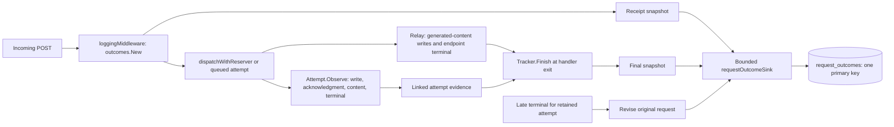

# Incoming request accounting

> Last updated: 2026-09-05 · commit `bbf6f83d4`

The coordinator's `request_outcomes` ledger records one incoming request with
linked internal attempts and separate provider, response and client evidence.
It gives operators an observed receipt cohort without treating sampled
profiles, retries or a committed HTTP 200 as completed requests.

## Context

A provider can decline an attempt and a retry can complete the same incoming
request. A provider can also complete after the client leaves, or an HTTP 200
stream can fail after its first content. The existing
[route and profile taxonomy](request-outcome-observability.md) remains useful
for diagnostics and billing attribution, but it cannot supply a complete
incoming-request denominator or prove successful response egress.

This ledger implements the coordinator part of
[#845](https://github.com/Layr-Labs/d-inference/issues/845). The linked
[Intelligence dashboard](https://github.com/Layr-Labs/darkbloom-intelligence)
consumes its versioned schema. Routing calibration is independent;
[#844](https://github.com/Layr-Labs/d-inference/issues/844) owns additional
provider-refusal evidence.

## Mechanism

### Receipt, attempts and finalization

`loggingMiddleware` in `coordinator/api/server.go` creates a fresh UUID before
authentication, rate limits, parsing, validation, balance checks, admission or
queueing for exact POST paths `/v1/chat/completions`, `/v1/responses`,
`/v1/completions` and `/v1/messages`. Other methods and paths, and failures
before this middleware, are outside the cohort. Both response modes are
covered; `stream` is null and `model` is empty before those values are known.
Client-supplied `X-Request-ID` never becomes the ledger identity.

`outcomes.NewAttempt` records selection attempts as well as dispatched work.
The provider request UUID joins existing `inference_routes.request_id` and
`request_profiles.request_id`; `coord_request_id` joins the sampled profile
parent and `request_rejections.request_id`. Attempt ordinal, `backup_of` and
`winning` keep retries and speculation inside the parent request.

Attempt evidence distinguishes writer dequeue (`write_started`), successful
socket write (`write_completed`), provider acknowledgment, first content
ingress, and provider terminal. A failed write may have delivered bytes;
selection or acknowledgment does not prove engine admission. Synthetic route
timeouts and cancellations never become observed provider refusals.

`Tracker.Finish` records handler exit, HTTP status, context departure and write
errors. A subsequent terminal can revise an attempt while the coordinator
still retains it, including a parked request after client departure. It does
not move `received_at` or `finalized_at`. Expired or unknown provider frames
cannot be joined retrospectively.

### Completion and normalized reasons

The record keeps the following dimensions distinct
(`coordinator/outcomes/record.go`, `coordinator/outcomes/tracker.go`):

| Field | Values or meaning |
|---|---|
| `termination` | `open`, `completed`, `rejected`, `interrupted`, `client_departure`, `unknown` |
| `response_progress` | `unknown` before finalization; `none`, `content_observed`, or `completion_confirmed` afterward. Content here is provider ingress from any linked attempt. |
| `content_egress_observed` | At least one fully accepted write containing generated content; headers, preamble, usage and terminal frames alone are insufficient. |
| `response_terminal` | `unknown`, `completed`, `incomplete`, `error`; the endpoint adapter's terminal meaning, separate from writing its bytes. |
| `provider_outcome` | The winning attempt's `completed`, `error`, `not_dispatched` or `no_terminal`; `unknown` without a winner, or `not_dispatched` with no attempts. |
| `response_egress_completed`, `client_write_error`, `client_departed` | Complete local response write, failed/short write, and observed request-context departure, respectively. |
| `raw_reason`, `http_status`, `normalized_code` | Existing bounded diagnostic classification and raw status alongside the new authoritative label. No free-form provider text. |
| `evidence_conflict` | Contradictory evidence; consumers must retain it as conflicting/unknown rather than count it as completion. |

Completion requires a completed winning provider, a completed endpoint
terminal, successful full response egress and no write error. A legitimate
zero-token completion can satisfy this without generated-content egress.
Responses `incomplete` or error terminals do not satisfy it. Observed client
departure takes precedence over completion; a later provider completion
remains visible. Successful local writes do not prove downstream receipt.

| Normalized code | Required evidence | Owner |
|---|---|---|
| `int_provider_deadline_rejected` | An actual provider error with normalized raw reason `deadline_unreachable`; once per attempt | `Attempt.Observe`, `AttemptCode` |
| `ext_first_content_timeout` | The incoming request's authoritative final `first_chunk_timeout` classification | `Tracker.Rejection`, `RequestCode` |
| `ext_coordinator_exhausted` | Final `deadline_unreachable` or `dispatch_exhausted` with explicit routing-stop evidence from the dispatch classifier | `dispatchState.run`, `RequestCode` |

The raw `dispatch_exhausted` string alone is insufficient: genuine provider
faults and typed provider timeouts keep their final distinction. An internal
refusal or first-content timeout followed by recovery stays in the attempt
history and does not become a final rejection.

### Persistence and coverage

`NewServer` starts a dedicated unsampled sink, independent of profiler enablement
and sample rate. It publishes receipt and final snapshots, then changed late
attempt evidence. Detailed per-token events and full provider profiles are
excluded. Only the first generated-content ingress/egress adds accounting work.

The channel holds 4,096 snapshots. The worker batches at most 64 rows and
flushes every 100 ms or on a full batch. PostgreSQL calls have a five-second
timeout. `Server.Close` allows the existing two-second telemetry shutdown
window; an in-flight write can remain unconfirmed. These limits come from
`coordinator/api/request_outcome_sink.go`, `defaultTelemetrySinkCapacity` and
`telemetrySinkShutdownFlush`.

The new table is created by boot migration and indexed by
`(received_at, coord_request_id)`. Revision-ordered upserts preserve one row per
coordinator ID, reject identity reuse by retaining the original cohort and
marking conflict, ignore older state, and retain same-revision contradictions.
Both stores preserve immutable snapshots. Attempt detail stops at 64 entries;
scalar attempt, successful-write and provider-deadline-refusal counts continue.
Read helpers use half-open receipt bounds and the existing telemetry row cap.
Storage and cleanup are implemented in
`coordinator/store/postgres_request_outcomes.go` and
`coordinator/store/request_outcomes.go`.

Retention deletes receipts older than 14 days in a separate worker every
minute, in 5,000-row batches with a five-second sweep budget. It cannot block
the accounting writer. Deployment creates an additive table; no historical
backfill, existing-table rewrite, provider release or wire change is required.

Unsampled does not mean lossless. Queue pressure, failed writes, process exit,
missing middleware traffic and retention can remove observations. Loss metrics
count snapshots, not incoming requests, so they cannot repair a denominator.
Dashboards must use **observed records**, distinguish unavailable from recorded
zero, and leave full-traffic fulfillment percentages unset without independent
coverage evidence. Receipt windows are `[from, to)` UTC instants; display in
America/New_York must preserve both repeated fall-back hours. Late evidence
updates the original receipt cohort, never the finalization hour.

## Invariants

1. One incoming UUID survives retries and speculation; client IDs are never
   authoritative (`loggingMiddleware`, `Tracker.NewAttempt`).
2. Accounting does not drive routing, retries, deadlines, billing or wire
   statuses (`coordinator/outcomes/tracker.go`; hooks only observe milestones).
3. Provider ingress, generated-content egress, endpoint completion and client
   departure are separate facts (`Tracker.classifyLocked`).
4. Replayed revisions do not add requests or move receipt cohorts; conflicts
   remain sticky (`buildRequestOutcomeUpsertSQL`, `RecordRequestOutcomes`).
5. No request/response content, client keys, raw provider messages or new
   provider telemetry enters the compact schema (`outcomes.Record`).

## Failure modes

| Condition | Representation or effect |
|---|---|
| Only receipt persisted | `open`, finalization unknown; never presumed rejected |
| Only final snapshot persisted | Upsert retains the request's original receipt timestamp |
| Queue full, store error or shutdown loss | Nonblocking request path; `request_outcomes.records` pipeline counts, incomplete coverage |
| Storage slow during shutdown | `request_outcomes.shutdown_unconfirmed`; do not assume that in-flight batch was either committed or lost |
| Conflicting terminal, winner, identity or same revision | `evidence_conflict`; excluded from authoritative completion |
| Provider completes after departure | `client_departure` plus provider completion when still correlatable |
| Sink/process dies or retention falls behind | Missing or stale observations; no lossless traffic claim |
| Recorder absent or schema incompatible in dashboard source | Explicit unavailable/incompatible state or last-good snapshot, never fabricated zero traffic |

## Code map

| Concern | Location |
|---|---|
| Compact schema, reason mapping and lifecycle | `coordinator/outcomes/record.go`, `coordinator/outcomes/tracker.go` |
| Middleware and sink ownership | `coordinator/api/server.go`, `coordinator/api/request_outcome_sink.go` |
| Adapter evidence, content classification and response terminal | `coordinator/api/request_outcome_accounting.go`, `coordinator/api/request_outcome_content.go`, `coordinator/api/profiler_dispatch.go` |
| Dispatch and provider observations | `coordinator/api/dispatch.go`, `coordinator/api/consumer.go`, `coordinator/api/provider.go`, `coordinator/registry/registry.go` |
| Storage/replay and bounded reads | `coordinator/store/request_outcomes.go`, `coordinator/store/postgres_request_outcomes.go` |
| Regression coverage | `coordinator/outcomes/tracker_test.go`, `coordinator/api/request_outcome_accounting_test.go`, `coordinator/api/request_outcome_sink_test.go`, `coordinator/store/request_outcomes_test.go` |

## Related

- [Request outcome observability](request-outcome-observability.md): established route, profile, metric and billing dimensions.
- [System profiler](system-profiler.md): sampled waterfalls and joins for diagnosis.
- [Storage](storage.md): boot migration and persistence ownership.
- [Telemetry inventory](../reference/telemetry-inventory.md): pipeline metrics and source grains.
