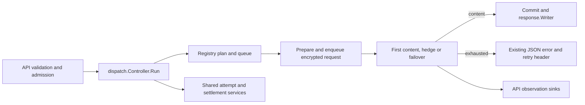
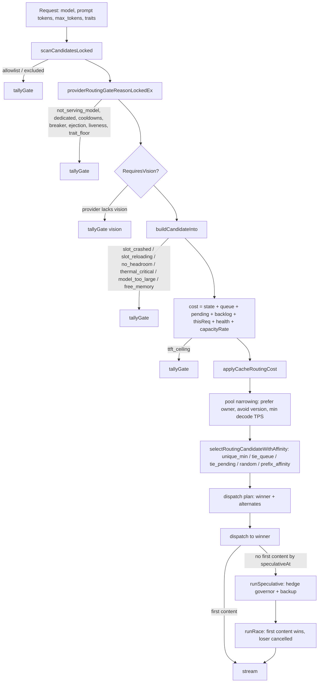

# Routing: how a request becomes a provider choice

> Last updated: 2026-09-14 · commit `6ad3d5605`

Routing is the part of the coordinator that, given one inference request and
the live fleet, picks the provider that should run it. It filters the fleet
through a fixed sequence of eligibility gates, prices every survivor in
estimated milliseconds, selects the cheapest, and — when the chosen provider
is slow to produce first content — races a second provider against it.
Capacity, queues, slot states and the warm pool are covered in
[`scheduling.md`](scheduling.md); this page covers only choosing among
eligible providers.

## Context

The fleet is heterogeneous consumer Apple-silicon hardware that comes and
goes. Any single provider may be cold for a model, thermally throttled,
memory-starved, mid-attestation, or silently rejecting work. The scheduler
therefore never trusts one signal: it combines the provider's own heartbeat
telemetry (`BackendCapacity`, see
[`protocol-messages.md`](../reference/protocol-messages.md)), coordinator-side
fault tracking (cooldowns, breakers, ejection) and request-shape estimates
(prompt tokens, `max_tokens`, vision, tool constraints) into one ranked
decision per request.

Two properties shape the design:

- **Cost is expressed in milliseconds.** Every penalty in the model is an
  estimate of added latency for *this* request, so terms can be summed and
  compared directly, and the routing breakdown that is logged per decision
  (`costBreakdown`, `coordinator/registry/routing_candidates.go`) always sums to the
  total.
- **Every rejection has a name.** Gate outcomes (`GateReason`) and selection
  outcomes (`SelectionPath`) are closed vocabularies
  (`coordinator/registry/gate_reason.go`) so telemetry and the simulation
  harness can account for every provider the scanner looked at.

The coordinator decrypts consumer bodies in Confidential VM memory only far
enough to estimate tokens and detect request shape; routing never sees prompt
content beyond that. See [`data-flow.md`](data-flow.md) and
[`security/encryption.md`](security/encryption.md).

## Mechanism

### Dispatch controller

`Controller.Run` (`coordinator/inference/dispatch/request.go`) receives the
validated HTTP input and creates one private `execution` for its provider
attempts. `coordinator/api/inference_dispatch.go` (`initializeInferenceDispatch`)
binds one controller to each Server. The controller owns the scan semaphore,
hedge governor and route-latency EWMA; the execution owns its plan, selected
providers, first-content clock and retry state. HTTP validation and initial
admission remain in the API pipeline.

The controller uses the existing registry, attempt tracker, settlement holds
and response writer. Its `Dependencies` getters (`coordinator/inference/dispatch/dependencies.go`)
read the current API service and configuration at each original read point,
including billing configured after server construction. `dispatchObserver`
(`coordinator/api/inference_dispatch.go`) retains the actual route, rejection,
cache-terminal and request-outcome publication operations.

Pending terminal publication goes through `attempt.PublishPendingOutcome`
(`coordinator/inference/attempt/pending_outcome.go`): claim the terminal, update
the profile, publish cache telemetry, then publish the route using the current
pending identity. A losing claim invokes no observer. Successful terminal outcomes leave
profile completion to the provider, and callbacks run after the
request's claim lock is released. The API observer retains its existing
metrics, storage and nil-Server handling.



### Entry points

`ReserveProviderWithPlan` (`coordinator/registry/plan_reservation.go`) is the
dispatch-time entry point. It scans the fleet
(`scanCandidatesLocked`), gates each provider
(`snapshotProviderIntoLockedEx`), prices it (`buildCandidateInto`), selects a
winner (`selectRoutingCandidate`) and
returns a bounded **dispatch plan** (`coordinator/registry/dispatch_plan.go`)
recording the winner as attempted and retaining up to
`dispatchplan.MaxAlternates = 8` alternate entries
(`coordinator/registry/dispatchplan/build.go`). The dispatch controller (`coordinator/inference/dispatch/run.go`) consumes the plan:
it dispatches to the winner, may probe alternates for capacity quotes
(`capacityProbeWindow = 250 * time.Millisecond`,
`dispatchPlanProbeFanout = 8`, `coordinator/inference/dispatch/plan.go`) and
falls through the plan on retry or hedge. `ReserveNextFromPlan`
(`coordinator/registry/plan_reservation.go`) refreshes remaining time after both
registry and provider locks are acquired, before evaluating and debiting an
alternate. An expired request does not reserve a candidate; an enabled
prediction ceiling shrinks with remaining time, while a disabled ceiling stays
zero. The writer independently checks expiry before constructing the envelope.
Recorded policy and deadline values are defined in the
[prediction telemetry reference](../reference/prediction-decision-telemetry.md).

The same gate chain is reused by the preflight admission check
(`PredictServable`, `coordinator/registry/servability.go`) and by the queue
drain path (`scheduling.md`), so the set of providers a request can queue for
is the set it can be dispatched to.



### Eligibility gates and the `GateReason` vocabulary

Gates run in the order below. The first failing gate names the rejection;
`scanCandidatesLocked` tallies exactly one `GateReason` per rejected provider.
`GateReasonCount` is the "passed every gate" sentinel and is reported as
`EligibilityReasonEligible = "eligible"`.

| Order | `GateReason` | snake_case | Enforced in | Meaning |
|---|---|---|---|---|
| 1 | `GateAllowlist` | `allowlist` | `scanCandidatesLocked` | Request is `SelfRouteOnly` and the provider is not owned by the caller, or the request carries allowed serials the provider does not match. |
| 2 | `GateExcluded` | `excluded` | `scanCandidatesLocked` | Provider is in the caller's exclude set (already failed this request, or a prior attempt). |
| 3 | `GateNotServingModel` | `not_serving_model` | `providerServesRoutableModelReasonLocked` | Provider does not advertise the model. |
| 4 | `GateDedicated` | `dedicated` | `providerServesRoutableModelReasonLocked` | Model belongs to a dedicated family and the provider's catalog is not exclusively that family. Owners self-routing to their own box are exempt. |
| 5 | `GateDispatchLoadCooldown` | `dispatch_load_cooldown` | `providerRoutingGateReasonLockedEx` | Pair is cooling down after a dispatch-time `load_model` failure (`dispatchLoadCooldownTTL`, [below](#cooldowns-breakers-and-ejection)). |
| 6 | `GateErrorCooldown` | `error_cooldown` | `providerRoutingGateReasonLockedEx` | Shape-keyed inference-error breaker is open ([constants](#cooldowns-breakers-and-ejection)). |
| 7 | `GateCapacityCooldown` | `capacity_cooldown` | `providerRoutingGateReasonLockedEx` | Pair is in capacity-reject cooldown (black-hole 503s). |
| 8 | `GateBreaker` | `breaker` | `providerRoutingGateReasonLockedEx` | Node-health breaker open for genuine-fault errors. |
| 9 | `GateEjection` | `ejection` | `providerRoutingGateReasonLockedEx` | Stable-identity health ejection open. |
| 10 | `GateOffline` | `offline` | `providerLivenessGateReasonLocked` | `Status == StatusOffline` — set by the connection owner (`coordinator/providercontrol/session/disconnect.go`, `readFailed`) the moment the WebSocket dies, before the deferred `Disconnect()` removes the record ([`scheduling.md`](scheduling.md#disconnect)). |
| 11 | `GateUntrusted` | `untrusted` | `providerLivenessGateReasonLocked` | `Status == StatusUntrusted`. |
| 12 | `GateStateRestoring` | `state_restoring` | `providerLivenessGateReasonLocked` | Verified SE identity is still awaiting durable account/counter/reputation restoration. Also excludes owner self-route, capacity and model loading. |
| 13 | `GatePrivateOnly` | `private_only` | `providerLivenessGateReasonLocked` | Provider is `PrivateOnly` and the request is not from its owner. |
| 14 | `GateTrustFloor` | `trust_floor` | `providerLivenessGateReasonLocked` | `TrustLevel` ranks below the floor ([below](#trust-floor-and-self-route-relaxation)). |
| 15 | `GateRuntimeUnverified` | `runtime_unverified` | `providerLivenessGateReasonLocked` | `RuntimeVerified` is false. |
| 16 | `GatePrivateText` | `private_text` | `providerLivenessGateReasonLocked` | `providerSupportsPrivateTextLocked` is false (code attestation not proven). |
| 17 | `GateChallengeStale` | `challenge_stale` | `providerLivenessGateReasonLocked` | Last passed challenge is missing or older than `challengeFreshnessMaxAge` ([below](#challenge-freshness)). |
| 18 | `GateTraitFloor` | `trait_floor` | `providerRoutingGateReasonLockedEx` | Provider cannot satisfy a request trait (for example inference-time tool constraints). |
| 19 | `GateVision` | `vision` | `providerServesVisionModelLocked` | Request `RequiresVision` and the provider's build of the model does not serve vision. |
| 20 | `GateSlotCrashed` | `slot_crashed` | `buildCandidateInto` / `SlotStatePenalty` | Slot state `crashed`. |
| 21 | `GateSlotReloading` | `slot_reloading` | `buildCandidateInto` / `SlotStatePenalty` | Slot state `reloading`. |
| 22 | `GateNoHeadroom` | `no_headroom` | `hasConcurrencyHeadroomForModelCapResolvedLocked` | Provider or slot is at its concurrency cap ([`scheduling.md`](scheduling.md#concurrency-caps)). |
| 23 | `GateThermalCritical` | `thermal_critical` | `buildCandidateInto` | `SystemMetrics.ThermalState == "critical"`. |
| 24 | `GateModelTooLarge` | `model_too_large` | `modelFitsHardware` | Model is not resident and cannot fit the node's total memory. Permanent, not capacity. |
| 25 | `GateFreeMemory` | `free_memory` | `freeMemoryAdmits` | Token-budget or memory admission fails, or the pair is budget-clamped. |
| 26 | `GateTTFTCeiling` | `ttft_ceiling` | `scanCandidatesLocked` | Estimated TTFT exceeds `pr.MaxTTFTMs` (public non-vision requests with a ceiling only). |

Gates 5–9 are the coordinator's own fault memory and are evaluated *before*
liveness so a breaker-open provider is counted as `breaker`, not as whatever
else may also be wrong with it. `scanCandidatesLocked` separately counts
providers rejected by gates 8–9 (`breakerRejected`) and providers that would
have been routable but for gate 7 (`capacityRejections`) because both feed the
fail-open and 429 decisions described under [Failure modes](#failure-modes).

Registration recovery (`coordinator/providercontrol/verification/restore.go`,
`Verifier.Restore`) retries transient reads within one bounded
deadline. Until it completes, `providerStateRestoreRequiredLocked` keeps the
verified identity out of routing, public capacity and warm-pool candidates.
A sustained failure closes the new connection for retry before evicting an
existing session; it cannot serve with account history silently missing.
Providers without verified SE evidence retain the existing Open Mode gates.

### Trust floor and self-route relaxation

`Registry.MinTrustLevel` is the lowest `TrustLevel` a provider may hold and
still receive public traffic; `New` (`coordinator/registry/registry.go`)
sets it to `TrustHardware`. What the levels mean, how they are earned and how
the floor is configured is the subject of
[`security/attestation.md`](security/attestation.md).

Two request policies relax the gate for the caller's **own** machines only:
`SelfRouteOnly` (route exclusively to owned providers) and `PreferOwner`
(prefer owned, fall back to public). In `scanCandidatesLocked`,
`relaxTrust := owned && (pr.SelfRouteOnly || pr.PreferOwner)`. When relaxed,
`providerRoutingGateReasonLockedEx` substitutes `TrustNone` for the floor,
`providerLivenessGateReasonLocked` admits `PrivateOnly` providers, and
`providerServesRoutableModelReasonLocked` waives dedicated-catalog isolation.
Every other gate — runtime verification, private-text attestation, challenge
freshness, slot state, memory — still applies to owned machines.

### Challenge freshness

`challengeFreshnessMaxAge = 16 * time.Minute`
(`coordinator/registry/routing_constants.go`). A provider whose `LastChallengeVerified`
is zero or older than this fails `challenge_stale`. The constant was raised
from 6 minutes when attestation churn was reworked
([`../design/routing-v2-attestation-churn.md`](../design/routing-v2-attestation-churn.md)).

`MaxFailedChallenges = 3` (`coordinator/registry/provider.go`) governs how
failures clear that timestamp in `RecordChallengeFailure`: a *security*
failure (bad signature, SIP off, binary hash mismatch) clears
`LastChallengeVerified` immediately; a *transient* failure (the provider did
not answer in time) only clears it once `FailedChallenges` reaches the
threshold, so a single missed challenge does not deroute a provider verified
seconds earlier. Both paths also record the failure into reputation.

### Cost model

`routingcost.Policy` owns one process-wide calibration instance and the existing
startup latency knobs. `coordinator/registry/routing_policy.go` (`routingPolicy`) shares it across every registry and
API observation hook; constructing another registry does not reset calibration.
Configure the startup setters before serving. Calibration alone mutates during
serving, under its private leaf lock; it never calls back into registry, provider
or request transactions. The calibration and decode-floor environment switches
retain their live reads (`coordinator/registry/routingcost/policy.go`,
`coordinator/registry/routingcost/calibration.go`,
`coordinator/registry/routingcost/throughput.go`).

The caller fills `routingcost.Snapshot[*Provider]` directly in the candidate
arena under the original locks. Its 48 fields retain their order and types;
`Provider` is opaque identity to the cost owner. There is no additional projection
or copy. Eligibility, current capacity-rate reads, the applied calibration-ratio
read, reservation commit and queue handoff keep their existing order at registry
(`coordinator/registry/routingcost/snapshot.go`,
`coordinator/registry/candidate_cost.go`, `coordinator/registry/reservation_commit.go`).

`buildCandidateInto` prices an eligible provider as

```text
cost = statePenalty + queueMs + pendingMs + backlogMs + thisReqMs + healthMs + capacityRateMs
```

and stores every term in `costBreakdown` with `Total = cost`
(`coordinator/registry/routing_candidates.go`). `buildCandidateInto` in
`coordinator/registry/candidate_cost.go` retains gate order and cost composition;
its pure calculations use `routingcost` over the same snapshot.

| Symbol | Value | Applied as | Source |
|---|---|---|---|
| `SlotStatePenaltyRunning` | `0.0` | Slot state `running`, `idle`, or empty (`SlotStatePenalty`). | `coordinator/registry/routingcost/penalties.go` |
| `SlotStatePenaltyUnknown` | `30_000.0` | Slot state `unknown` or any unrecognised state — the model must be loaded first. | `coordinator/registry/routingcost/penalties.go` |
| `SlotStatePenaltyIdleShutdown` | `20_000.0` | Slot state `idle_shutdown` (weights evicted, engine warm). | `coordinator/registry/routingcost/penalties.go` |
| `queueDepthPenaltyMs` | `3_000.0` | × `Occupancy` = max(pending on this model at this provider, backend `NumRunning + NumWaiting`). | `coordinator/registry/routing_constants.go` |
| `totalPendingPenaltyMs` | `750.0` | × total in-flight requests on the provider across all models. | `coordinator/registry/routing_constants.go` |
| `memoryPressurePenaltyMs` | `4_000.0` | × `SystemMetrics.MemoryPressure` (`HealthPenaltyMs`). | `coordinator/registry/routingcost/penalties.go` |
| `cpuUsagePenaltyMs` | `1_500.0` | × `SystemMetrics.CPUUsage`. | `coordinator/registry/routingcost/penalties.go` |
| `gpuUtilizationPenaltyMs` | `5_000.0` | × `GPUMemoryActiveGB / TotalMemoryGB`, clamped to [0, 1]. | `coordinator/registry/routingcost/penalties.go` |
| `thermalPenaltyFairMs` | `2_000.0` | Added when `ThermalState == "fair"`. | `coordinator/registry/routingcost/penalties.go` |
| `thermalPenaltySeriousMs` | `8_000.0` | Added when `ThermalState == "serious"` (`critical` is a gate, not a penalty). | `coordinator/registry/routingcost/penalties.go` |
| `defaultCapacityRatePenaltyMs` | `15_000.0` | × windowed capacity-503 rate (`capacity_rate.go`, [below](#gray-box-capacity-signals)). | `coordinator/registry/faultstate/capacity_rate.go` |
| `nearTieCostWindowMs` | `3_000.0` | Width of the near-tie band in `selectRoutingCandidate`. | `coordinator/registry/routing_constants.go` |
| `defaultRequestedMaxTokens` | `256` | Used for `max_tokens` when the request does not set one. | `coordinator/registry/routing_constants.go` |
| `effectiveTPSLoadFactor` | `0.39` | Per-concurrent-decode TPS derating (`EffectiveDecodeTPS`). | `coordinator/registry/routing_constants.go` |
| `kvCacheBytesPerToken` | `400_000` | Fallback KV bytes per token when the slot does not report `KVBytesPerToken`. | `coordinator/registry/routing_constants.go` |
| `modelMemoryHeadroomFactor` | `2.0` | `ModelFitsHardware`: model GB × 2 must fit total memory when the manifest gives no `minRAMGb`. | `coordinator/registry/admission/memory.go` |
| `maxPrefillTPS` | `5000.0` | Cap on any prefill rate used for pricing (`maxPrefillTPS`, `coordinator/registry/capacity_report.go`; `ResolvePrefillTPS`, `coordinator/registry/routingcost/throughput.go`). | `coordinator/registry/capacity_report.go` |
| `DefaultPrefillToDecodeRatio` | `12.0` | Static prefill TPS = decode TPS × ratio when the provider reports no prefill rate. | `coordinator/registry/routingcost/config.go` |
| `DefaultLongPromptThresholdTokens` | `0` | Long-prompt bias is off until a threshold is set. | `coordinator/registry/routingcost/config.go` |
| `DefaultLongPromptPrefillWeight` | `2.0` | Multiplier on first-token-blocking time for long prompts. | `coordinator/registry/routingcost/config.go` |

The remaining terms are request-shaped:

- **`backlogMs`** — tokens ahead of this request divided by effective TPS.
  For a slot that reports a token budget it is
  `(ActiveTokenBudgetUsed + QueuedTokenBudget) / effectiveTPS`; otherwise
  `BacklogTokenMs` sums `MaxTokensPotential`, the backend's waiting requests ×
  `max_tokens`, and coordinator-side pending tokens the backend has not yet
  seen.
- **`thisReqMs`** — `promptTokens / prefillTPS + maxTokens / effectiveTPS`,
  plus `Policy.LongPromptPenalty`.

**Effective TPS.** `ResolveEffectiveTPS` prefers the slot's
`ObservedDecodeTPS` EWMA, then the fleet median for the model, then the
static registration rate derated by load:
`EffectiveDecodeTPS = staticTPS / (1 + effectiveTPSLoadFactor × backendRunning)`,
floored at 1 tok/s. `ResolvePrefillTPS` prefers `ObservedPrefillTPS`, else
the static prefill rate (`resolvedPrefillTPS`: the registered `PrefillTPS`,
or decode × `prefillToDecodeRatio`), capped at `maxPrefillTPS`.
`SetPrefillToDecodeRatio` changes the ratio process-wide; the coordinator
binary wires it to `EIGENINFERENCE_PREFILL_DECODE_RATIO`
(`coordinator/cmd/coordinator/routing_admission.go` (`configureAdmission`)).

**Prefill weighting for long prompts.** `Policy.LongPromptPenalty(promptTokens,
ttftBlockMs)` returns `(longPromptPrefillWeight − 1) × ttftBlockMs` when a
threshold is set and the prompt reaches it, else `0`. `ttftBlockMs` is the
request's prefill time plus, for a provider that is not resident, its slot
state penalty — so the bias cannot pull a long prompt onto a cold box whose
fast prefill is dwarfed by the load. The setters are
`SetLongPromptThreshold` and `SetLongPromptPrefillWeight`, wired to
`EIGENINFERENCE_LONG_PROMPT_TOKENS` and
`EIGENINFERENCE_LONG_PROMPT_PREFILL_WEIGHT`. The penalty is folded into
`thisReqMs` so the breakdown invariant holds.

**TTFT estimate.** Separately from cost, each candidate carries an estimated
time-to-first-token (`RawTTFTMs`): slot state penalty + prefill of
tokens queued ahead + this request's prefill + one decode step
(`1000 / effectiveTPS`). The per-(model, chip family) calibration scales only
the flow terms, leaving the cold-load state penalty unchanged. It learns
dispatch-to-first-content samples at content commit, not full completion
(`Policy.AppliedRatio`, `coordinator/registry/routingcost/policy.go`).
`ttftOccupancyAlpha` applies only to the diagnostic shadow estimate, including
when `EIGENINFERENCE_TTFT_ADMISSION_MODE=enforce`; it does not change the live TTFT ceiling.
The live estimate drives the `ttft_ceiling` gate, hedge
timing and the `Retry-After` header; it is not a cost term.

When the matching heartbeat reports zero running and waiting requests,
`fillSnapshotPendingAndPool` supplies each local pending request's own prompt
estimate to `QueuedPrefillTokensAhead`. Attempts that already committed
content contribute no further prefill. Non-positive prompt estimates and
cache-routing participants retain the arriving-prompt proxy because their
prefill work is unknown. With nonzero heartbeat occupancy, the existing
waiting-count proxy remains: the coordinator cannot join those counts to
individual pending request phases. These are estimates of full prompt work,
not measurements of remaining provider compute. Output reservations remain
memory accounting and never become serial prefill work. The bounded audit
and synthetic before/after evidence are in the
[admission calibration baseline](../reports/2026-09-06-admission-calibration-baseline.md).

**Cache service cost.** After pricing, `applyCacheRoutingCost` compares the
request's avoidable prefill work with the confirmed endpoint's restore cost.
Useful reuse subtracts a bounded credit; excess restore cost increases
`ThisReqMs`. Queue, load, decode and admission costs remain intact. The rules
and their flag are the subject of
[`cache-aware-routing.md`](cache-aware-routing.md).

### Selection paths

The public capacity snapshot (`coordinator/registry/model_capacity.go`,
`ModelCapacitySnapshot`) applies the model routing gates before counting a
provider as ready, together with the existing concurrency and token headroom
checks. A broken template, mixed dedicated-family catalog or active routing
cooldown therefore cannot advertise immediate readiness. Warm/cold inventory
counts still describe the advertised models independently of readiness.

Capacity readiness preserves the fleet-wide health-breaker fallback. If a
model has an observed breaker/ejection rejection,
`modelCapacityBreakerFallbackLocked` in `coordinator/registry/model_capacity.go`
uses `scanCandidatesLocked` and `shouldBypassBreakerFailOpen` before admitting
last-resort providers. A healthy but busy peer suppresses that fallback. The
read-only probe represents the smallest positive text reservation (one output
token, no TTFT ceiling); it does not commit a reservation. Structural, thermal,
memory and cooldown gates remain in force.

Before selection the candidate pool may be narrowed, each step only when it
leaves at least one candidate (`scanCandidatesLocked`):

1. `PreferOwner` — keep only providers owned by the caller.
2. `Traits.AvoidVersion` — keep only providers not running the version that
   just failed this request (version-diverse retry).
3. `MinDecodeTPS` — keep only providers whose
   `ProjectedPerRequestDecodeTPS` meets the request's floor. The coordinator
   binary sets the floor from
   [`EIGENINFERENCE_MIN_DECODE_TPS`](../reference/configuration.md#routing-admission-and-ttft);
   `0` disables it.

`preferRoutingCandidates` compacts the request-local pool in place.
`selectRoutingCandidateWithAffinity` ranks it without allocating intermediate candidate lists
(`coordinator/registry/candidate_selection.go`):

1. **Best cost.** The minimum `costMs`.
2. **Cost ties.** When any candidate has a cache credit or restore penalty, keep only
   exact minimum-cost candidates. Otherwise keep every candidate within
   `nearTieCostWindowMs` ([cost model](#cost-model)), preserving ordinary load
   spreading. Among the retained candidates choose the lowest `effectiveQueue`,
   then the lowest `totalPending`.
3. **Equivalents.** More than one candidate sharing the retained cost range,
   queue and pending count normally resolves uniformly by `random`. With active
   cache routing, observed repeat demand and no cache cost adjustment in the
   pool, a stable keyed ranking prefers a matching, non-quarantined cache
   capability (`prefix_affinity`). See [cache affinity](cache-aware-routing.md#observed-demand-and-soft-prefix-affinity).
4. **Path label**: `unique_min` when only one candidate is retained;
   `tie_pending` when pending count decides between equal queue depths;
   otherwise `tie_queue`. Equivalent choices use `random` or `prefix_affinity`
   under the conditions above; an empty pool uses `none`.

`SelectionPath` values (`coordinator/registry/gate_reason.go`): `none`,
`unique_min`, `tie_queue`, `tie_pending`, `random`, `prefix_affinity`. Historical profiler rows may
still contain the retired `cache_tiebreak` string. The
runner-up (the lowest-cost candidate other than the winner) is recorded for telemetry
and as the first alternate in the dispatch plan.

### Retained alternates and capacity quotes

`DispatchPlan` wraps a private `dispatchplan.Plan[*Provider]`
(`coordinator/registry/dispatch_plan.go`). Its owner keeps the bounded entries,
cursor, attempted IDs and single-refresh flag under one mutex. Construction
uses the original scan pool: `newDispatchPlan`
(`coordinator/registry/dispatch_plan_build.go`) offers costs to `Builder.Offer`,
which projects values only for candidates retained by the bounded insertion.
`ReserveNextFromPlan` checks the retained provider pointer against the current
registry and delegates the live deadline, gate and debit transaction to
`commitPlanEntry` (`coordinator/registry/plan_reservation.go`). The helper
acquires and releases `p.mu` on every path; the caller publishes successful
cold-dispatch/calibration telemetry after that lock is released. A reconnect
cannot reuse an old plan identity.

`Probes` (`coordinator/registry/dispatchplan/quotes.go`) owns the outstanding
quote map. Its leaf mutex claims each reply, write failure, disconnect or expiry
once. `Probes.Probe` snapshots unquoted entries, skips connections that have not
proven quote capability, and uses the existing data writer through the binding in
`coordinator/registry/capacity_quotes.go`. A collector confirms or demotes its
plan entry before publishing the buffered `QuoteOutcome`; confirmed entries rank
first, then unprobed entries, then demoted entries, with scan cost ordering within
each tier. Consumed entries stay consumed. Wrong-provider and expired replies
leave the pending entry for its bound reply or collector expiry. Disconnect
settlement stays after registry/provider unlock and queue/cache cleanup in
`coordinator/registry/provider_disconnect.go` (`disconnectProvider`).

Opportunistic expiry sweeps in `Probes.add`
(`coordinator/registry/dispatchplan/quotes.go`) deliver a timeout to the owning
collector as well as removing the entry. Otherwise a collector could wait for
a delivery that no longer has an owner. `applyQuoteDelivery`
(`coordinator/registry/dispatchplan/quote_delivery.go`) demotes an expired
alternate before the collector publishes its timeout outcome.

`RefreshDispatchPlan` (`coordinator/registry/plan_refresh.go`) claims the one
refresh and copies attempted IDs through `Plan.ClaimRefresh`, releases that
leaf lock, then invokes the original live scan. The fresh plan is marked used
before it is returned. No owner callback acquires registry or provider locks
while either owner mutex is held.

### Hedged (speculative) dispatch

A request that has not produced first content by its **speculative point**
launches a backup and races the two. The mechanics live in
`coordinator/inference/dispatch/speculative.go`, `coordinator/inference/dispatch/race.go` (`runSpeculative`, `runRace`) with timing in
`coordinator/inference/dispatch/hedge_schedule.go` and `coordinator/inference/dispatch/first_content_clock.go`.

**Launch offset.** The initial speculative point is
`deadline × SpeculativeTimerRatio`, `SpeculativeTimerRatio = 0.5`
(`coordinator/inference/dispatch/limits.go`). When the probe round returns a
high-confidence quote for the best alternate, it may deliver one strictly
earlier absolute launch instant through `hedgeAdvanceCh`, computed by
`hedgeLaunchOffset(deadline, backupTTFTQ90, confidence)`:

```text
halfPoint    = deadline / hedgeRatioDenominator          # hedgeRatioDenominator = 2
backupBudget = max(backupTTFTQ90, hedgeMinBackupBudget)  # hedgeMinBackupBudget = time.Second
latestUseful = deadline − backupBudget − hedgeCommitGuard # hedgeCommitGuard = 500 * time.Millisecond
offset       = max(0, min(halfPoint, latestUseful))      # halfPoint alone unless confidence == hedgeConfidenceHigh
```

`firstTokenSpeculativeWait` converts the offset into a wait measured from the
request's `ReceivedAt`, so retries do not restart the clock.

**Backup selection.** The backup is drawn from the retained dispatch plan
(`dispatchFromPlanMachinery`) or, when the plan is exhausted, from a fresh
`dispatchOneProvider` scan with the primary and every previously failed
provider excluded. A `PreferOwner` request being served by the owner's own
machine never hedges onto the paid public fleet.

**Governor.** `hedgeGovernor.tryAcquireHedge` (`coordinator/inference/dispatch/hedge_governor.go`)
must return `hedgeAllow` before a backup launches; the verdict and the budget
slot are one atomic operation. Suppression verdicts, in evaluation order:

| Verdict | Condition |
|---|---|
| `hedgeSuppressQueued` | The model has coordinator-queued demand (`modelQueueDepth > 0`). |
| `hedgeSuppressNoIdleCapacity` | No idle eligible alternative exists and fleet idle slots < `hedgeFleetIdleHeadroomSlots = 2`. |
| `hedgeSuppressGlobalBudget` | Active hedges ≥ `max(1, fleetIdleSlots / hedgeGlobalBudgetDivisor)`, `hedgeGlobalBudgetDivisor = 4` (budget `0` when nothing is idle). |
| `hedgeSuppressWinRate` | Model win-rate EWMA (`hedgeWinRateAlpha = 0.2`) < `hedgeWinRateFloor = 0.10` after ≥ `hedgeWinRateMinSamples = 8` outcomes; every `hedgeWinRateExploreInterval = 16` suppressions one hedge is allowed through to re-measure. |

**Cancel and win.** `runRace` commits whichever attempt delivers first
content and calls `attempt.Service.Cancel` on the other, which sends the provider a
cancel and releases the reservation. A backup win sets `BackupWon`, emits
`inference.speculative_win`, and is counted by
`recordHedgeOutcome`. Both attempts are marked `UsedBackup`; settlement
excludes them from TTFT calibration (`observeTTFTCalibration`,
`coordinator/inference/dispatch/calibration.go`). The acquired governor slot is released
exactly once on every exit path (`noteHedgeResolved`).

### Early-429 servability predictor

Before a request is queued or dispatched, `PredictServable`
(`coordinator/registry/servability.go`) asks whether the fleet can
*structurally* serve it. It returns a `ServabilityVerdict` with one of two
reasons:

- `context_exceeded` — `contextPromptTokens + max_tokens` exceeds the model's
  context window.
- `prompt_too_long` — every eligible provider has a *known* structural token
  budget and `estimatedPromptTokens + max_tokens` exceeds the largest
  (`FleetMaxBudget`). If any eligible provider's budget is unknown the
  verdict stays servable.

`admission.RequestTokens` (`coordinator/registry/admission/request_budget.go`)
shares negative-prompt normalization and the default output allowance with the
live provider-fit check. It adds the two counts in `uint64`, so a request larger
than the signed integer range still exceeds known context or budget limits.
Only the displayed `ServabilityVerdict.RequestTokens` is capped to the largest
`int`; unknown budgets retain their fail-open policy.

A provider's structural budget (`Policy.StructuralBudget`, `coordinator/registry/admission/request_budget.go`) is its reported
`ActiveTokenBudgetMax` when the slot reports one; for a provider that is not
resident it is `Policy.ColdTokenBudgetEstimate`:

```text
weightsGiB   = measured resident GiB (version ≥ 0.8.16 and model in table) else catalogGB × coldLoadCatalogGBToMemGiB
postLoadGiB  = servabilityCapFraction × totalMemoryGB − weightsGiB        # mirrors the provider cap fraction
tokens       = (postLoadGiB − activationFloorGiB) × 2^30 / kvBytesPerToken  # kvCacheBytesPerToken when unreported
```

`coldLoadCatalogGBToMemGiB = 1.2 * (1e9 / float64(int64(1)<<30))` (≈ 1.1176,
`coordinator/registry/admission/memory.go`). `servabilityCapFraction`,
`servabilityActivationFloorGB` and `servabilityModelActivationFloorsGB` mirror
the provider's `UnifiedMemoryCap` constants, whose values are stated once in
[`hardware-support.md`](hardware-support.md#constants); the two tables move in
the same commit. The activation floor is version-gated
(`Policy.ActivationFloor`, `coordinator/registry/admission/model_memory.go`):

| Provider version | Floor |
|---|---|
| empty or `< 0.8.0` (`servabilityActivationFloorMinVersion = "0.8.0"`) | `servabilityLegacyActivationFloorGB = 3.0` |
| `< 0.8.16` (`servabilityPerModelFloorMinVersion = "0.8.16"`) | `servabilityActivationFloorGB` |
| `≥ 0.8.16` | per-model table, else `servabilityActivationFloorGB` |

Per-model tables (`coordinator/registry/admission/model_memory.go`):

| Table | Entries |
|---|---|
| `servabilityModelActivationFloorsGB` | `gpt-oss-20b` (mirrors `measuredActivationFloorsBytes`) |
| `servabilityMeasuredResidentGiB` | `"gpt-oss-20b": 11.5` |

The consumer path turns an unservable verdict into an immediate `429` instead
of queueing; the coordinator binary enables this by default and
`EIGENINFERENCE_SERVABILITY_GATE=false` disables it
(`coordinator/cmd/coordinator/routing_admission.go` (`configureAdmission`)).

### Gray-box capacity signals

Three mechanisms handle providers that reject with capacity-shaped 503s while
their heartbeat still advertises room.

`faultstate.Manager[*Provider]` owns their shared identity index and every
tracker mutation. Registry keeps the actual Provider locks, current budget
snapshots, stable-identity derivation and routing reason precedence. The
accept transaction retains its original gate reference across the optional
budget snapshot and revalidates it before applying the observed outcome
(`coordinator/registry/faultstate/capacity_accept.go`).

**Budget clamp** (`coordinator/registry/faultstate/budget_clamp.go`). The first
capacity/token-budget rejection for a (provider, model) pair
(`recordBudgetClampLocked`, fed by `RecordCapacityReject`) makes admission
stop believing that pair's heartbeat budget: `freeMemoryAdmits` rejects it as
`free_memory` and `providerBudgetFits` reports zero live headroom. Release
requires both a heartbeat delivered after the clamp showing at least
`budgetClampReleaseMinHeadroomTokens = 1024` tokens of headroom
(`ReleaseBudgetClampsOnHeartbeat`) and an accept for the pair after the clamp
(`CapacityAccept.Apply`, `coordinator/registry/faultstate/capacity_accept.go`). A clamp fails open after
`defaultBudgetClampTTL = 5 * time.Minute`. Kill switch
[`EIGENINFERENCE_BUDGET_CLAMP`](../reference/configuration.md#routing-admission-and-ttft);
TTL override `EIGENINFERENCE_BUDGET_CLAMP_TTL_SECONDS`.

**Capacity-rate penalty** (`coordinator/registry/faultstate/capacity_rate.go`). A pair
whose capacity-503 rate over `capacityRateWindow = 5 * time.Minute` exceeds
`capacityRateThreshold = 0.25` with at least `capacityRateMinSample = 8`
outcomes pays `rate × defaultCapacityRatePenaltyMs` ([cost model](#cost-model);
override `EIGENINFERENCE_CAPACITY_RATE_PENALTY_MS`) in the cost model. A soft
derater: the candidate stays in the pool.

**Capacity cooldown** (`coordinator/registry/faultstate/capacity_policy.go`). A pair
that accumulates `defaultCapacityCooldownThreshold = 5` capacity rejects
within `defaultCapacityCooldownWindow = 60 * time.Second` with no interleaved
accept is gated (`capacity_cooldown`) for `defaultCapacityCooldownTTL =
120 * time.Second`, doubling per trip up to `defaultCapacityCooldownMaxTTL =
10 * time.Minute`. A probe outcome within `capacityProbeOutcomeWindow =
30 * time.Second` counts toward the same tally. Overrides:
`EIGENINFERENCE_CAPACITY_COOLDOWN_THRESHOLD`,
`EIGENINFERENCE_CAPACITY_COOLDOWN_WINDOW_SECONDS`,
`EIGENINFERENCE_CAPACITY_COOLDOWN_TTL_SECONDS`,
`EIGENINFERENCE_CAPACITY_COOLDOWN_MAX_TTL_SECONDS`.

First-content accepts carry their observation time from
`coordinator/inference/dispatch/commit.go` (`commitFirstContent`) to
`coordinator/registry/fault_capacity.go` (`RecordCapacityAcceptObserved`), which
applies the transaction in `coordinator/registry/faultstate/capacity_accept.go`
(`CapacityAccept.Apply`).
The recorder runs asynchronously so the first client byte does not wait for
`registry.mu`. Reject strikes after the observation survive a delayed accept;
a cooldown is rebuilt from fresh backoff when those surviving strikes
independently reach the threshold. Old exponential trip history is reset,
and a valid newer half-open probe remains claimed. A later budget clamp also requires a later accept to prove release.
The request is stamped before scheduling the recorder to count its capacity-rate
outcome exactly once at first content or completion.

### Attempt feedback and cancellation ownership

`coordinator/inference/attempt/` owns the operations shared by dispatch,
provider ingress and response relays. `Service.Error`, `Success` and
`DispatchError` classify an attempt and feed the existing registry recorders;
`ClassifyRejection` and `ClassifyTerminalCause` supply the same policy to the
callers. `coordinator/api/inference_attempt.go` binds the current registry,
model store, reservation service, logger and metrics. The response writer uses
that same service as its feedback dependency.

One startup-owned `Tracker` holds cancellation correlation and resend history.
`Service.Cancel` records before removing pending work, sends only when its
removal owned a still-running attempt, and refunds only that attempt's top-up.
`CancelForFirstContentTimeout` retains the provider's atomic deadline arbitration.
The tracker mutex orders nonblocking enqueue acceptance and sent marking against
terminal consumption; expiry and terminal observations follow the tracker
operation. Shared terminal publication belongs to `PublishPendingOutcome`;
the frame service handles provider terminals; the API keeps parking and durable observation
(`coordinator/inference/attempt/cancel.go`, `cancel_tracker.go`, `cancel_metrics.go`,
`coordinator/inference/attempt/pending_outcome.go`; `coordinator/inference/providerframe/error.go` (`Service.Error`),
`coordinator/inference/providerframe/complete.go` (`Service.CompleteAt`), `coordinator/api/settlement.go`,
`coordinator/api/route_outcome.go`).

### Cooldowns, breakers and ejection

| Mechanism | File | Keyed by | Trips when | Holds for |
|---|---|---|---|---|
| Inference-error cooldown (`error_cooldown`) | `coordinator/registry/faultstate/error_cooldown.go` | provider × model × error shape | `inferenceErrorThreshold = 2` strikes within `inferenceErrorWindow = 60 * time.Second` | `inferenceErrorCooldownTTL = 5 * time.Minute` |
| Node-health breaker (`breaker`) | `coordinator/registry/faultstate/breaker.go` | stable provider identity | `providerBreakerConsecTrip = 5` consecutive genuine faults, or fail rate > `providerBreakerFailRate = 0.80` over ≥ `providerBreakerMinVolume = 20` outcomes in `providerBreakerWindow = 120 * time.Second` (ring of `providerHealthRingSize = 20`) | `providerBreakerBaseCooldown = 60 * time.Second`, doubling to `providerBreakerMaxCooldown = 5 * time.Minute` |
| Health ejection (`ejection`) | `coordinator/registry/faultstate/ejection.go` | stable provider identity | `healthEjectionConsecTrip = 8` consecutive failures, or success rate < `healthEjectionMinSuccessRate = 0.10` over ≥ `healthEjectionMinSample = 15` outcomes in `healthEjectionWindow = 10 * time.Minute`, or `healthEjectionCapacityConsecTrip = 10` consecutive capacity rejects | `healthEjectionBaseCooldown = 60 * time.Second`, doubling to `healthEjectionMaxCooldown = 10 * time.Minute` |
| Dispatch-load cooldown (`dispatch_load_cooldown`) | `coordinator/registry/faultstate/dispatch_load_cooldown.go` | provider × model | a dispatch-time `load_model` fails | `dispatchLoadCooldownTTL = 2 * time.Minute` |

Fault state keys by the provider's stable identity when one is bound, so it
survives disconnect and reconnect (`Disconnect`, `coordinator/registry/provider_disconnect.go`).
Every tracker in this table and in [gray-box capacity signals](#gray-box-capacity-signals)
stores its state in one `gateState` per identity
([below](#concurrency-scan-commit-and-fault-state-gates)).

The health rings share `providerHealthWindow.recordOutcome` for insertion and
`rebuild` for identity merges and version-reset filtering. Rebuilds preserve
each outcome's disconnect-flush marker and recompute the trailing fault streak
from the retained chronological history (`coordinator/registry/faultstate/health_window.go`,
`coordinator/registry/faultstate/version_reset.go`).

**Fail-open.** If the scan produced no winner, at least one provider was
rejected only by the breaker or ejection, and there were no capacity or TTFT
rejections, `shouldBypassBreakerFailOpen` re-runs the scan with
`ignoreProviderBreaker` so a degraded-but-only fleet still serves rather than
returning `no_provider`.

### Concurrency: scan, commit and fault-state gates

`Registry.mu` is a writer-preferring `sync.RWMutex`: a pending writer blocks
every new reader and drains the active batch of fleet scans first. Nothing on
the request path takes it for writing.

| Lock | Guards | Request-path holders |
|---|---|---|
| `Registry.mu` (`sync.RWMutex`, `coordinator/registry/registry.go`) | The provider map, catalog, aliases and routing configuration. | The scan and the commit, for READING (`scanProviderReservation`, `commitLock`). Writers are `Register`, `Disconnect`, `evictStale`, the swap planner and the config setters. |
| `Provider.mu` | One provider's heartbeat state, pending set, attestation and opaque binding (`Provider.faultSession`). | The scan per provider (`snapshotProviderIntoLockedEx`); the commit's whole decide-and-debit section; the identity bind (`bindStableFaultKey`). |
| `faultstate.Manager.gatesMu` (`sync.RWMutex`) | The gate index: fault key → `gateState`, session → `Session[*Provider]` (`coordinator/registry/faultstate/index.go`). | Recorders for READING (session → gate resolution), first insertion (`ensureGateLocked`), and the rare validated retry fallback (`lockGateWithIndex`). Also written by `Manager.Attach`, `Manager.Detach`, `Manager.Bind` and `Manager.Sweep`, through the registry lifecycle bindings. |
| `gateState.mu` | One identity's fault trackers (`coordinator/registry/faultstate/state.go`). | Recorders (`lockGate`), the commit's probe claim (`tryClaimCapacityProbe`), the per-model gate reads. Microseconds, per identity. |

Lock order: `r.mu → p.mu → gatesMu → gate.mu`. `r.mu` or `p.mu` is never
acquired while `gatesMu` or a `gate.mu` is held, and there is no walk-wide
gates lock on the scan (`coordinator/registry/faultstate/reference.go`, `lockGate`).

**Two-phase reservation** (`coordinator/registry/reservation.go`,
`coordinator/registry/reservation_commit.go`).
`scanProviderReservation` walks the fleet under `r.mu.RLock`; concurrent
requests scan together and no capacity is consumed. `commitProviderReservation`
holds `r.mu` for reading — the provider identity, catalog and cache-routing
configuration must be stable, not the fleet frozen — and does everything that
decides the reservation inside ONE `p.mu` section on the winner: the fresh
snapshot (`snapshotProviderIntoPLockedEx`), the cost rebuild, the "winner
unchanged since scan" compare (a change re-scans so the cohort does not herd
onto the formerly cheapest provider), the admit re-check
(`providerCanAdmitLockedEx`), the half-open capacity-probe claim
(`tryClaimCapacityProbe`, check-and-claim under `gate.mu`) and the pending
debit (`addPendingLocked`). `ReserveNextFromPlan`
(`coordinator/registry/plan_reservation.go`) delegates that provider transaction
to `commitPlanEntry`; common rejection handling and post-unlock telemetry stay
with the caller. `commitLock` (`coordinator/registry/gate_commit_mode.go`) selects the
mode: `reserveCommitShared` as described, or `reserveCommitGlobal`, which
takes `r.mu.Lock()` for the commit — the previous fleet-wide serialization,
kept as the kill switch behind
[`EIGENINFERENCE_RESERVE_COMMIT_MODE`](../reference/configuration.md#routing-admission-and-ttft).

**Per-identity gates.** Each fault tracker's state lives in a `gateState`
keyed by fault key (serial → SE key → account → session id) with its own
mutex; the provider’s opaque `faultSession` caches a private atomic gate
pointer inside the owner. Recorders (`RecordProviderOutcome`, `RecordProviderServeOutcome`,
`RecordProviderSessionServeOutcome`, `RecordInferenceError`,
`RecordInferenceSuccess`, `RecordCapacityReject`, `RecordCapacityAcceptObserved`,
`RecordCapacityAcceptOutcome`, `RecordDispatchLoadFailure`,
`ClearDispatchLoadCooldown`) resolve the gate and take `gate.mu` through
`lockGate` (`coordinator/registry/faultstate/reference.go`), never `r.mu`; `lockGate`
re-validates under the lock that the gate is still the session's current one
and not retired, and re-resolves otherwise. A missing identity makes a
clear operation a no-op. After `gateRelockMaxRetries` optimistic retries,
`lockGateWithIndex` holds `gatesMu` through resolution and gate acquisition
so a recorder always writes to a validated identity. The scan reads the breaker and
ejection verdicts from atomics (`breakerOpenAt`, `ejectedAt`) and takes
`gate.mu` only for a provider whose flag word (`pairFlags`) says it holds
per-model state, so a provider with no fault state costs a few atomic loads.

Version-reset history and disconnect-flush tags live under the same identity
mutex (`coordinator/registry/faultstate/version_reset.go`). `disconnectSource` captures
the session before acquiring the gate and compares its disconnect timestamp
with `gateState.versionResetAt` while the mutation lock is held. This preserves
the [restart behavior](scheduling.md#disconnect) without returning terminal
recorders to the fleet lock. `RecordCapacityAcceptObserved` likewise replays
only rejection strikes newer than the accepted observation, retaining a newer
cooldown or clamp even when accept bookkeeping arrives late.

**Identity rebinds** (`coordinator/registry/faultstate/migration.go`, `Manager.Bind`). The registry adapter `bindStableFaultKey`
runs at every (re-)attestation and at account linkage, under the session's
`p.mu` and `gatesMu`. When the key changes it MOVES the identity's accumulated
state to the refined identity (`migrateGateLocked`; merge policy
`mergeLocked`: expiries and trip counts take the max, histories merge
chronologically) and empties the source: an orphaned source is forwarded
(`forwardTo`) so stale pointers land on the live state; a source still bound
to a sibling session is reset and republished. Cached disconnected identities
follow the refined identity without changing their disconnect timestamps.
Their recorder references carry a `disconnectedGateBinding`
(`coordinator/registry/faultstate/disconnected_binding.go`), updated under the source
gate's mutex and validated on acquisition, so an in-flight late flush cannot
recreate or write into the former identity after a shared-source migration.
Because the bind holds
`p.mu`, a section that reads the cached session binding under `p.mu` — the scan's gate chain,
the commit through its debit, the alias resolver's `providerCanRouteBuildLocked`
— never sees the identity change underneath it. The one dispatch-deciding
read made without `p.mu`, the candidate's capacity-rate penalty
(`capacityRatePenaltyFor`), confirms its verdict against the owner’s cached session binding afterwards
and re-reads on a move (`gateView`, `coordinator/registry/fault_reads.go`; `View.Moved`, `coordinator/registry/faultstate/view_binding.go`); the
other gate reads confirm the same way as defence in depth.

**Sweep** (`coordinator/registry/faultstate/sweep.go`). `Manager.Sweep` runs from the
eviction loop: it prunes per-model entries that can no longer gate routing
and drops a gate with no live session once it has been idle for
`gateIdleGrace = 10 * time.Minute`, marking it `retired` under `gate.mu`
before the index delete so a recorder holding a stale pointer re-resolves.
Version metadata additionally keeps its gate for `identityVersionRetention`
after activity, disconnect or reset (`coordinator/registry/faultstate/version_reset.go`);
see [disconnect and reconnect](scheduling.md#disconnect). Half-open trip memory
of a live gate is never pruned.

**Observability.** `registry.gate.wait_ms` (DogStatsD histogram tagged
`site:`, via `SetGateWaitObserver`) records a recorder's `gate.mu`
acquisition wait when it exceeds `gateWaitReportThreshold = time.Millisecond`.

### Reputation

`Reputation.Score` (`coordinator/registry/reputation.go`) is

```text
score = 0.4 × jobRate + 0.3 × uptimeRate + 0.2 × challengeRate + 0.1 × responseTimeFactor
```

- `jobRate` = `SuccessfulJobs / TotalJobs` (`0.5` with no jobs).
- `uptimeRate` = `TotalUptime / 24h`, floored at `0.5`, capped at `1.0`.
- `challengeRate` = passed / (passed + failed) (`0.5` with no challenges).
- `responseTimeFactor` = `1.0` at ≤ 1 000 ms average, `0.0` at ≥ 10 000 ms,
  linear between (`0.5` with no data). The average is an EWMA of
  prefill-adjusted first-content latency, `ttftEWMAAlpha = 0.2`
  (`RecordLatency`).

A provider with no history scores `0.5`. The score is exposed on the
provider-facing `/me` endpoints (`coordinator/api/accountfleet/`) and
persisted; **it is not a term in the routing cost** — `buildCandidateInto`
never reads it. The header comment in `reputation.go` still says the score
factors into routing; the code does not. Reputation inputs do reach routing
indirectly: `RecordChallengeFailure` feeds `challenge_stale`, and the latency
EWMA is fed only by non-cache, non-hedge first-content samples
(`coordinator/inference/dispatch/commit.go`).

### `Retry-After` derivation

When the consumer path sheds a request with `429`, `EstimateRetryAfter` (`coordinator/inference/dispatch/retry_pressure.go`) derives the header:

1. Base `2` seconds. If the model's queue is non-empty,
   `queueDepth × 3`, clamped to [2, 30].
2. Distress override: if the attempt-0 route latency EWMA
   (`routeLatencyEWMAAlpha = 0.2`) exceeds
   `degradedRouteEWMAThresholdMs = 1000.0`, use
   `ceil(ewmaSeconds) × 5`, capped at
   [`maxDistressRetryAfter`](../reference/api-contracts.md#timeouts-and-constants),
   when larger than the base.

For a TTFT shed, `estimateTTFTRetryAfter` uses `ceil(bestTTFT − threshold)`
in seconds, floored at the base estimate and clamped to [2, 30]. Self-route
sheds use fixed values.

### Routing simulation harness (`routingsim`)

`coordinator/registry/routingsim/` is a Go library that replays arrivals
against the **real** scheduler — the same `PredictServable` and candidate
scan production uses — so that routing changes can be evaluated on recorded
traffic before deploy. It has no binary; it is driven from tests.

- `runner.go` — `Classify` / `ClassifyWithGate` run one arrival through the
  preflight capacity check and return an `Outcome`: `served`,
  `machine_busy`, `ttft_too_slow`, `no_provider`, `model_too_large`. `Run` /
  `RunWithGate` classify a whole trace; `TTFTDeadline` applies the production
  first-content deadline policy (`coordinator/modelpolicy/first_content_deadline.go`)
  with a 5 s base.
- `fleet.go` — `BuildFleet` registers a synthetic fleet
  (`FleetConfig`, `DefaultHardwareSpec`) into a fresh `Registry`.
- `fleet_ndjson.go` — `LoadFleetNDJSON` reconstructs a fleet from exported
  fleet snapshots (`store.FleetSnapshotRow`) at the tick nearest a given time.
  The loader validates every line while retaining only rows for the current
  best tick; it accepts interleaved timestamps, chooses the earlier tick on a
  distance tie and keeps duplicate-slot precedence in file order. A zero
  requested time selects the latest tick.
- `trace.go` / `trace_ndjson.go` — `GenerateTrace` and
  `CalibrationPromptMix` build synthetic prompt mixes;
  `LoadProfilesNDJSON` turns exported request profiles into arrivals.
- `report.go` — `Summarize` buckets results by prompt length and
  `EstimatedCliff` finds the prompt size where acceptance collapses.

Run it with the package tests, for example
`go test ./coordinator/registry/routingsim/...` (`TestRoutingSimCalibration`
and friends in `routingsim_test.go`). Tests that change process-wide tunables
such as `SetPrefillToDecodeRatio` restore them afterwards, so the harness
must not run in parallel with other scheduler tests in the same process.

## Invariants

1. **A provider never receives a model it does not advertise, and dedicated
   families never share a box with other models** —
   `providerServesRoutableModelReasonLocked`
   (`coordinator/registry/routing_eligibility.go`).
2. **Public traffic never routes below the trust floor; relaxation applies
   only to a caller's own machines** — `providerRoutingGateReasonLockedEx`
   and `providerLivenessGateReasonLocked`.
3. **No provider is routed without a fresh passed challenge** —
   `providerLivenessGateReasonLocked` with `challengeFreshnessMaxAge`.
4. **A model that is not resident is never routed to hardware it cannot
   fit** — `modelFitsHardware` in `buildCandidateInto`; resident slots
   (`SlotStateModelLoaded`, `coordinator/registry/routingcost/penalties.go`) are exempt because they have demonstrably fit.
5. **Every scanned provider is accounted for exactly once**: as a candidate
   or under one `GateReason` — `scanCandidatesLocked.tallyGate`.
6. **The cost breakdown sums to the total** — `buildCandidateInto`
   folds `Policy.LongPromptPenalty` into `ThisReqMs` and sets `Total = cost`.
7. **Pool narrowing never empties the pool** — each `PreferOwner`,
   `AvoidVersion` and `MinDecodeTPS` filter in `scanCandidatesLocked` is
   applied only when its result is non-empty.
8. **A hedge never launches while the model has queued demand, and never
   exceeds the fleet-wide hedge budget** — `hedgeGovernorVerdict`;
   acquisition and release are exactly-once (`tryAcquireHedge`,
   `noteHedgeResolved`).
9. **Exactly one attempt of a race commits; the other is cancelled** —
   `runRace` calls `attempt.Service.Cancel` on the loser before committing.
10. **Fault memory survives reconnects** — `Disconnect` preserves breaker,
    cooldown and ejection state keyed by stable identity
    (`Manager.Detach`, `coordinator/registry/faultstate/session_lifecycle.go`; `detachSessionGate`, `coordinator/registry/fault_binding.go`).
11. **The admit re-check and the pending debit are atomic per provider, and
    no request-path commit takes `r.mu` for writing** —
    `commitProviderReservation` and `ReserveNextFromPlan` snapshot, compare,
    admit (`providerCanAdmitLockedEx`), claim the probe
    (`tryClaimCapacityProbe`) and debit (`addPendingLocked`) under one `p.mu`
    hold; `commitLock` takes `r.mu` for reading unless the kill switch is set.
12. **A dispatch decision never straddles an identity rebind** —
    `bindStableFaultKey` runs under the session's `p.mu`, so a section that
    read the cached session binding under `p.mu` acts on that same identity; a read made without
    `p.mu` confirms against the cached session binding (`gateView.moved`).
13. **Fault state moves with the identity and is never double-counted** —
    `migrateGateLocked` merges the source into the destination (`mergeLocked`)
    and empties the source; the state is not copied.
14. **One capacity probe at a time per cooled (identity, model) pair** —
    `tryClaimCapacityProbeLocked` is check-and-claim under `gate.mu`: a
    second commit within `capacityProbeOutcomeWindow` of an outstanding claim
    is rejected instead of leaking a second probe.

## Failure modes

| Symptom | Cause | What the code does |
|---|---|---|
| `no_provider` | No provider advertises the model, or every advertising provider fails a non-capacity gate (`candidateCount == 0` with no capacity rejections). | Preflight returns `429` with `Retry-After` and reason code `no_provider` (`coordinator/api/inference_admission.go`). With [`EIGENINFERENCE_COLD_DISPATCH`](../reference/configuration.md#routing-admission-and-ttft) enabled and an idle on-disk provider that could load the model, the request is queued for a cold dispatch instead (`ColdSpillAvailable`, `coordinator/inference/dispatch/cold.go`). With breaker-only rejections, fail-open re-scans first (`shouldBypassBreakerFailOpen`). |
| `model_too_large` | Every advertising provider is cold and `modelFitsHardware` fails (`rejectModelTooLarge`). | Permanent rejection for this fleet composition; `routingsim` reports `OutcomeModelTooLarge`. |
| All gated on capacity (`machine_busy`) | Providers serve the model but all are at `no_headroom`, `free_memory` or `capacity_cooldown`. | With [`EIGENINFERENCE_QUEUE_BEFORE_SHED`](../reference/configuration.md#routing-admission-and-ttft) enabled (`coordinator/inference/dispatch/cold.go`) the request queues per [`scheduling.md`](scheduling.md); otherwise `429` with `Retry-After` from `EstimateRetryAfter`. |
| `ttft_too_slow` | Every candidate's estimated TTFT exceeds the first-content deadline. | Soft by default: the best-available provider still serves. `EIGENINFERENCE_TTFT_HARD_REJECT=true` restores the legacy `429`; vision requests are never TTFT-gated. |
| Queue timeout | A queued request found no eligible provider within the queue's wait bound. | `ErrQueueTimeout` → `429` with `Retry-After`; see [`scheduling.md`](scheduling.md#per-model-request-queue). |
| Budget-clamped fleet | Every pair for the model is clamped after capacity 503s. | Pairs show as `free_memory` until release or `defaultBudgetClampTTL` ([above](#gray-box-capacity-signals)); heartbeat headroom plus one accept releases early. |
| Hedge suppressed under load | Governor returns a suppress verdict. | Primary alone is waited on for the remaining deadline (`waitNoBackup`); `routing.hedge_governor_suppressed` counts the verdict. |

## Code map

| Concern | File / symbol |
|---|---|
| Dispatch-time selection | `coordinator/registry/plan_reservation.go` — `ReserveProviderWithPlan`; `coordinator/registry/routing_scan.go` — `scanCandidatesLocked`; `coordinator/registry/routing_snapshot_gates.go` — `snapshotProviderIntoLockedEx` |
| Cost construction and latency math | `coordinator/registry/candidate_cost.go` — `buildCandidateInto`; `coordinator/registry/routingcost/penalties.go` — `SlotStatePenalty`, `HealthPenaltyMs`; `coordinator/registry/routingcost/throughput.go` — `ResolveEffectiveTPS`; `coordinator/registry/routingcost/latency.go` — `RawTTFTMs`; `coordinator/registry/routingcost/config.go` — `Policy.LongPromptPenalty` |
| Provider-state projection for selection and capacity preflight | `coordinator/registry/routing_snapshot.go` — `fillRoutingSnapshotPLocked`; callers retain their own eligibility gates and hold both registry and provider locks |
| Candidate preferences and ranking | `coordinator/registry/candidate_selection.go` — `preferRoutingCandidates`, `selectRoutingCandidate` |
| Shared gate primitives | `coordinator/registry/routing_eligibility.go` — `providerLivenessGateReasonLocked`, `providerServesRoutableModelLocked` |
| Closed vocabularies | `coordinator/registry/gate_reason.go` — `GateReason`, `SelectionPath`, `SlotState` |
| Trust floor and challenge failures | `coordinator/registry/registry.go` — `MinTrustLevel`; `coordinator/registry/provider.go` — `MaxFailedChallenges`; `coordinator/registry/provider_challenges.go` — `RecordChallengeFailure` |
| Dispatch-load cooldown and disconnect | `coordinator/registry/faultstate/dispatch_load_cooldown.go` — `dispatchLoadCooldownTTL`; `coordinator/registry/provider_disconnect.go` — `Disconnect` |
| Two-phase reservation (scan, commit, plan consumption) | `coordinator/registry/reservation.go` — `scanProviderReservation`; `coordinator/registry/reservation_commit.go` — `commitProviderReservation`, `providerCanAdmitLockedEx`; `coordinator/registry/plan_reservation.go` — `ReserveNextFromPlan`, `commitPlanEntry` |
| Fault-state transaction owner | `coordinator/registry/faultstate/manager.go` — `Manager`, `Session`; `coordinator/registry/faultstate/state.go` — private `gateState`, `publishLocked`; `coordinator/registry/faultstate/migration.go` — `Bind`, `migrateGateLocked`, `mergeLocked`; `coordinator/registry/faultstate/reference.go` — `lockGate`, `gateRef`; `coordinator/registry/faultstate/sweep.go` — `Sweep`, `gateIdleGrace` |
| Fault-state registry bindings and reads | `coordinator/registry/fault_binding.go` — `bindStableFaultKey`, `SetVersion`, `SetGateWaitObserver`; `coordinator/registry/fault_reads.go` — `gateOf`, `gateView`; `coordinator/registry/faultstate/view_binding.go` — `View.Moved`; `coordinator/registry/gate_commit_mode.go` — `reserveCommitMode`, `commitLock` |
| Capacity outcome transactions | `coordinator/registry/fault_capacity.go` — `RecordCapacityAcceptObserved`; `coordinator/registry/faultstate/capacity_accept.go` — `PrepareCapacityAccept`, `CapacityAccept.Apply`; `coordinator/registry/faultstate/capacity_reject.go` — `RecordCapacityReject`; `coordinator/registry/faultstate/capacity_probe.go` — `CapacityProbe.Claim` |
| Bounded plan and quote ranking | `coordinator/registry/dispatchplan/plan.go` — `Plan`; `coordinator/registry/dispatchplan/build.go` — `Builder.Offer`, `MaxAlternates`; `coordinator/registry/dispatchplan/ranking.go` — `ConfirmEntry`, `DemoteEntry`, `BestConfirmedBackup`; private wrapper in `coordinator/registry/dispatch_plan.go` — `DispatchPlan`, `PlanEntry` |
| Plan refresh and capacity probes | `coordinator/registry/plan_refresh.go` — `RefreshDispatchPlan`; `coordinator/registry/dispatchplan/refresh.go` — `ClaimRefresh`; `coordinator/registry/dispatchplan/probe.go` — `Probes.Probe`; `coordinator/registry/dispatchplan/quote_reply.go` — `Probes.Handle`; current transport bindings in `coordinator/registry/capacity_quotes.go` |
| Registry hedge capacity observations | `coordinator/registry/hedge_capacity_snapshot.go` — `HedgeGovernorSnapshot` |
| Fleet servability predictor | `coordinator/registry/servability.go` — `PredictServable`; fleet iteration and verdict remain in the registry |
| Capacity and cold-load arithmetic | `coordinator/registry/admission/request_budget.go` — `Policy.ColdTokenBudgetEstimate`, `Policy.StructuralBudget`; `coordinator/registry/admission/model_memory.go` — `Policy.ActivationFloor`, `Policy.ColdWeightsGiB` |
| Provider-version interpretation | `coordinator/registry/providerversion/` — `Policy.Compare`, `Policy.SlotBudgetLayout`; shared instance in `coordinator/registry/provider_version.go` |
| Budget clamp | `coordinator/registry/faultstate/budget_clamp.go` — `recordBudgetClampLocked`, `ReleaseBudgetClampsOnHeartbeat` |
| Capacity-rate penalty and cooldown | `coordinator/registry/faultstate/capacity_rate.go`, `coordinator/registry/faultstate/capacity_policy.go` |
| Attempt feedback, rejection and terminal policy | `coordinator/inference/attempt/feedback.go` — `Service.Error`, `Success`, `DispatchError`; `rejection.go` — `ClassifyRejection`; `terminal_cause.go` — `ClassifyTerminalCause` |
| Cancellation and terminal correlation | `coordinator/inference/attempt/cancel.go` — `Service.Cancel`; `cancel_tracker.go` — `Tracker`; `cancel_delivery.go` — `SendRecordedCancel`, `StrayChunk`; `cancel_metrics.go` — `ResolveCancelledTerminal` |
| Breakers and ejection | `coordinator/registry/faultstate/error_cooldown.go`, `coordinator/registry/faultstate/breaker.go`, `coordinator/registry/faultstate/ejection.go` |
| Reputation | `coordinator/registry/reputation.go` — `Score`, `RecordLatency` |
| Shared latency policy and calibration | `coordinator/registry/routingcost/policy.go` — `Policy`, `New`; `coordinator/registry/routingcost/calibration.go` — `Policy.RecordTTFTObservation`; `coordinator/registry/routingcost/calibration_pending.go` — pending joins and expiry; `coordinator/registry/routing_policy.go` — process-wide bindings; fed by `observeTTFTCalibration` in `coordinator/inference/dispatch/calibration.go` |
| Hedge timing, governor, race | `coordinator/inference/dispatch/hedge_schedule.go`, `coordinator/inference/dispatch/hedge_governor.go`, `coordinator/inference/dispatch/speculative.go`, `coordinator/inference/dispatch/race.go` (`runSpeculative`, `runRace`), `coordinator/inference/dispatch/first_content_clock.go` |
| Dispatch controller and API bindings | `coordinator/inference/dispatch/request.go` — `Controller.Run`; `coordinator/inference/dispatch/run.go` — `execution.run`; `coordinator/api/inference_dispatch.go` — `initializeInferenceDispatch`, `dispatchObserver` |
| Probes and plan wiring | `coordinator/inference/dispatch/plan.go` |
| `Retry-After`, speculative ratio, route EWMA | `coordinator/inference/dispatch/capacity.go`, `coordinator/inference/dispatch/retry_pressure.go`, `coordinator/inference/dispatch/limits.go` — `EstimateRetryAfter`, `estimateTTFTRetryAfter`, `SpeculativeTimerRatio` |
| Queue-before-shed and cold dispatch flags | `coordinator/inference/dispatch/cold.go` |
| Flag wiring at startup | `coordinator/cmd/coordinator/routing_admission.go` (`configureAdmission`); `coordinator/cmd/coordinator/registry.go` (`configureRegistry`) |
| Simulation harness | `coordinator/registry/routingsim/` — `runner.go`, `fleet.go`, `fleet_ndjson.go`, `trace.go`, `report.go` |

## Related

- [`scheduling.md`](scheduling.md) — queues, slot states, token-budget admission, warm pool, heartbeat and eviction.
- [`cache-aware-routing.md`](cache-aware-routing.md) — prefix-cache discount and tiebreak.
- [`security/attestation.md`](security/attestation.md) — trust levels, challenges, `MinTrustLevel` configuration.
- [`../reference/protocol-messages.md`](../reference/protocol-messages.md) — `heartbeat`, `BackendCapacity`, `BackendSlotCapacity`.
- [`../reference/configuration.md`](../reference/configuration.md) — coordinator environment reference.
- [`../operations/routing-v2-rollout.md`](../operations/routing-v2-rollout.md) — kill switches for the routing flags named on this page.
- [`../design/routing-v2.md`](../design/routing-v2.md), [`../design/routing-telemetry-and-calibration.md`](../design/routing-telemetry-and-calibration.md) — the design history behind the current constants.
- [`request-outcome-observability.md`](request-outcome-observability.md) — how routing outcomes surface in telemetry.
