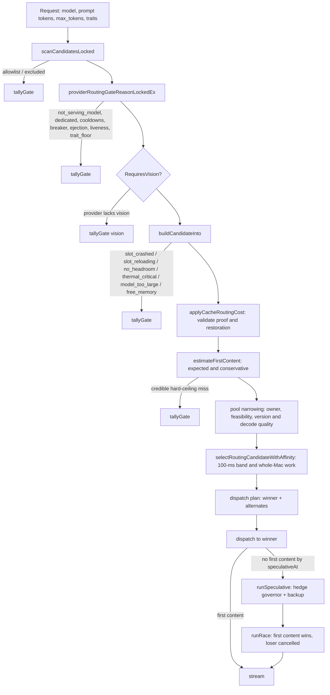

# Routing: how a request becomes a provider choice

> Last updated: 2026-10-04

Routing is the part of the coordinator that, given one inference request and
the live fleet, picks the provider that should run it. It filters the fleet
through a fixed sequence of eligibility gates, prices every survivor in
estimated milliseconds, selects the cheapest, and — when the chosen provider
is slow to produce first content — races a second provider against it.
Capacity, queues, slot states and the warm pool are covered in
[`scheduling.md`](scheduling.md); this page covers only choosing among
eligible providers.

`coordinator/registry/admission` owns detached slot/token/memory calculations;
`coordinator/registry/selection` owns detached ranking and affinity decisions.
Neither imports the live registry. The registry still captures snapshots,
draws randomness, holds locks, revalidates a selected provider and commits its
reservation. HTTP retry, cancellation and settlement ownership is in
`coordinator/api/inference`; moving calculations does not split atomic fleet
state across services.

For same-ID weight updates, `CatalogAcceptsWeightHash` and catalog eligibility
accept the desired and retained approved revisions for that same model. An
unpromoted or explicitly retired hash is not accepted. Catalog size uses the
largest retained revision as a conservative admission bound during convergence.
[Model revisions](model-revisions.md) defines this transition policy.

Autopilot protocol 3 keeps cached planning inventory separate from ordinary serving permission. `providerOrdinaryModelAllowedLocked` excludes observation-only IDs from catalog, owner, capacity and legacy acquisition gates until acknowledged live control; shadow planning reuses the remaining safety gates without changing permission. See [model Autopilot](model-autopilot.md).

## Provider lifecycle drain boundary

`provider_drain` fences a live connection until disconnect or an explicit,
validated model replacement; heartbeat TTL expiry cannot reopen it. `authorizeInferenceHandoff` in
`coordinator/registry/inference_authorization.go` rechecks the drain after writer
queueing and reservation: direct, queued, cold, retry and hedge reservations
cannot send a new inference frame across the boundary. A late reservation gets
`ErrProviderDraining`, releases its unused reservation, and retries through the
existing transient-capacity path. No response output is replayed by this change.

Warm/cold model-load and prefetch selection also exclude drains. Provider-side
admission checks remain necessary for already handed-off frames: these receive
a typed 503 draining refusal before acceptance. Already accepted coordinator
queues (including a cold model load) finish. Local requests that have not acquired
a model may still receive 503; acquired local requests and their HTTP response
writes are drained. See [the terminal barrier](../reference/protocol-messages.md#provider-lifecycle-drain)
for the asynchronous settlement boundary. Existing draining-capacity preflight
semantics (transient 429/capacity, not structural absence) remain unchanged.

`darkbloom switch` resumes the same provider session through `models_replace`
(`coordinator/registry/provider_models_replace.go`, `ReplaceProviderModels`).
The latest drain must be settled, and its generation must match both completion
and the control-writer handoff even if a provider reuses a request ID. One
connection-bound acknowledgement worker coalesces the latest barrier rather than
dropping it when prior settlement is slow. It waits for pre-barrier reservations
to leave the writer/pending set and for terminal billing before acknowledgement
(`providerReadLoop` in `coordinator/api/provider/`).

A validation-only request checks the complete model set without changing routing.
A committed replacement updates model indexes and stale residency/cache evidence
but keeps the fence until its acknowledgement is written successfully and the
provider confirms that local admission has reopened for that replacement and
an accepted `idle`/`serving` heartbeat supplies its refreshed `BackendCapacity`
at or after the `capacity_seq` named in `models_replace_ready`.
Ack failure, missing readiness, or stale/draining capacity never dispatches
queued work. The readiness frame is matched to the current session, replacement
and drain; its sequence was stamped after local admission opened. Either
readiness or that heartbeat may arrive first. Only after both does
the coordinator force desired-model reconciliation and dispatch queued work.
The provider restores prefetching before it sends readiness, so the refreshed
`desired_models` snapshot can be processed even if it arrives before the final
receipt. Snapshots received while prefetching was unavailable remain deferred.
It sends `models_replace_resumed` after those steps. The provider reports a
successful switch only when that receipt matches the current connection,
replacement, drain and capacity sequence; a missing receipt leaves the outcome
unconfirmed even if routing already resumed.
Removed model IDs remain queued for cleanup across a failed receipt and another
same-session drain, until routing resumes or disconnect.
Invalid selections leave inventory and drain unchanged. See
[the replacement contract](../reference/protocol-messages.md#models_replace--models_replace_ack--models_replace_ready--models_replace_resumed).


## Context

First-content forecasts include fresh coordinator-to-provider WebSocket RTT.
`coordinator/internal/registry/transport/history.go` (`History.Forecast`) requires two
successful samples on the current connection within 90 seconds, and adds RTT
and measured variation to the existing delivery allowances. The 30-second
probe loop (`coordinator/api/provider/provider_transport.go`) accepts RTT observations
up to three seconds; this is a sample limit, not a probe-specific socket
deadline. It keeps at most one probe outstanding, and an unanswered pong waits
for ordinary connection teardown. The WebSocket library's control-frame failure
policy still applies, as for automatic pongs; application writes retain their
existing watchdog. Missing or stale samples retain the conservative legacy
allowances. Ping/pong control frames do not hold the application text writer
while waiting for a pong.

Forced tool choice with media, and media-bearing tool results even with
`tool_choice: none`, carry `RequestTraits.RequiresNativeMediaTools`. The shared
eligibility gate requires the selected model's explicit `native_media_tools`
advertisement, vision support and existing tool-constraint protocol. This trait
survives alias resolution, queued requests, retries and final reservation;
ordinary media or text-only tools do not acquire it. A model update or disconnect
immediately removes eligibility. Code: `coordinator/api/inference/native_media_tools.go`
(`RequestHasMediaToolResults`), `coordinator/registry/native_media_tools.go`
(`providerSupportsNativeMediaToolsLocked`) and
`coordinator/registry/request_traits.go` (`providerEligibleForTraitsLocked`).

The fleet is heterogeneous consumer Apple-silicon hardware that comes and
goes. Any single provider may be cold for a model, thermally throttled,
memory-starved, mid-attestation, or silently rejecting work. The scheduler
therefore never trusts one signal: it combines the provider's own heartbeat
telemetry (`BackendCapacity`, see
[`protocol-messages.md`](../reference/protocol-messages.md)), coordinator-side
fault tracking (cooldowns, breakers, ejection) and request-shape estimates
(prompt tokens, `max_tokens`, vision, tool constraints) into one ranked
decision per request.

Two properties shape the design:

- **Cost is expressed in milliseconds.** Every penalty in the model is an
  estimate of added latency for *this* request, so terms can be summed and
  compared directly, and the routing breakdown that is logged per decision
  (`costBreakdown`, `coordinator/registry/scheduler.go`) always sums to the
  total.
- **Every rejection has a name.** Gate outcomes (`GateReason`) and selection
  outcomes (`SelectionPath`) are closed vocabularies
  (`coordinator/registry/gate_reason.go`) so telemetry and the simulation
  harness can account for every provider the scanner looked at.

The coordinator decrypts consumer bodies in Confidential VM memory only far
enough to estimate tokens and detect request shape; routing never sees prompt
content beyond that. See [`data-flow.md`](data-flow.md) and
[`security/encryption.md`](security/encryption.md).

## Mechanism

### Entry points

`ReserveProviderWithPlan` (`coordinator/registry/scheduler.go`) is the
dispatch-time entry point. It scans the fleet
(`scanCandidatesLocked`), gates each provider
(`snapshotProviderIntoLockedEx`), prices it (`buildCandidateInto`), selects a
winner (`selectRoutingCandidate`) and
returns a bounded **dispatch plan** (`coordinator/registry/dispatch_plan.go`)
holding the winner plus up to `dispatchPlanMaxAlternates = 8` retained
alternates. This limit aliases `shortlist.MaxAlternates`; `shortlist.Order`
(`coordinator/internal/registry/shortlist/order.go`) retains bounded candidate
handles and owns their ordering and consumption. The registry's `DispatchPlan`
still owns candidate evidence, its mutexes and final reservation. The API layer
retains one request-scoped `Plan` from
`coordinator/internal/inference/dispatch/plan.go`: its `Scan` dispatches to the
winner, `Next` consumes retained identities before one full refresh, and `Probe`
may probe alternates for capacity quotes
(`capacityProbeWindow = 250 * time.Millisecond`,
`dispatchPlanProbeFanout = 2`, `coordinator/internal/inference/dispatch/plan_probes.go`).
Retry and hedge share that plan and its refresh budget. `ReserveNextFromPlan`
(`coordinator/registry/dispatch_plan.go`) refreshes remaining time after both
registry and provider locks are acquired, before evaluating and debiting an
alternate. An expired request does not reserve a candidate; an enabled
prediction ceiling shrinks with remaining time, while a disabled ceiling stays
zero. The writer independently checks expiry before constructing the envelope.
Recorded policy and deadline values are defined in the
[prediction telemetry reference](../reference/prediction-decision-telemetry.md).

The same gate chain is reused by the preflight admission check
(`PredictServable`, `coordinator/registry/servability.go`) and by the queue
drain path (`scheduling.md`), so the set of providers a request can queue for
is the set it can be dispatched to.


```mermaid
flowchart TD
    R[Request: model, prompt tokens, max_tokens, traits] --> S[scanCandidatesLocked]
    S -->|allowlist / excluded| X1[tallyGate]
    S --> G[providerRoutingGateReasonLockedEx]
    G -->|not_serving_model, dedicated, cooldowns, breaker, ejection, liveness, trait_floor| X2[tallyGate]
    G --> V{RequiresVision?}
    V -->|provider lacks vision| X3[tallyGate vision]
    V --> B[buildCandidateInto]
    B -->|slot_crashed / slot_reloading / no_headroom / thermal_critical / model_too_large / free_memory| X4[tallyGate]
    B --> D[applyCacheRoutingCost: validate proof and restoration]
    D --> C[estimateFirstContent: expected and conservative]
    C -->|credible hard-ceiling miss| X5[tallyGate]
    C --> P[pool narrowing: owner, feasibility, version and decode quality]
    P --> SEL[selectRoutingCandidateWithAffinity: 100-ms band and whole-Mac work]
    SEL --> PLAN[dispatch plan: winner + alternates]
    PLAN --> DISP[dispatch to winner]
    DISP -->|no first content by speculativeAt| H[runSpeculative: hedge governor + backup]
    H --> RACE[runRace: first content wins, loser cancelled]
    DISP -->|first content| OK[stream]
    RACE --> OK
```

### SSD-offloaded model weights

Native Qwen4 can advertise a validated immutable offloaded payload alongside
its native-weight loading estimate. `advertisedOffloadedMemoryGBLocked`
(`coordinator/registry/offloaded_weights.go`) requires matching model ID and
native Qwen4 type, finite positive memory, and an offloaded byte count strictly
between zero and total artifact bytes. It uses the larger of the reported
estimate and the remaining weight bytes plus a valid explicit
`native_load_transient_bytes` allowance (at least 1 GiB, without overflow).
Missing/invalid allowance declarations retain the 1.2 load-transient padding.
Missing/invalid offload or other-family declarations keep the existing
catalog/measured-weight policy.

Exact `mimo_v2` has a separate full-LOAD declaration with **zero** SSD offload.
The same helper requires matching ID, checked positive source bytes/supplement,
finite memory at least their sum, and a valid raw decimal-GB catalog size from
the normal/swap/warm/cold caller. It retains the greater catalog/source-size
floor and adds the supplement once. Invalid or absent declarations keep legacy
pricing; no hardware, catalog identity, activation or request-KV gate is waived.
See `provider-swift/Sources/ProviderCore/Models/MiMo/MiMoV26DiscoveryLoadFootprint.swift`
(`estimate`) for the metadata-only strict native main/sidecar quote.

`coordinator/registry/scheduler.go` carries this estimate into cold snapshots.
`reportedFreeForLoadAdmitsWithOffload` in
`coordinator/registry/offloaded_weights.go` uses it at the cold-load boundary;
`ColdTokenBudgetWithOffload` in
`coordinator/internal/registry/memorypolicy/structural.go`
uses it for the post-load token-budget estimate.
This does not subtract request KV, prove physical capacity, waive catalog
minimum RAM or activate a model. Wire fields are defined in
[model registration messages](../reference/protocol-messages.md#models), and
the [private candidate reference](../reference/qwen4-next-support.md)
records the unqualified serving boundary.

### Eligibility gates and the `GateReason` vocabulary

Gates run in the order below. The first failing gate names the rejection;
`scanCandidatesLocked` tallies exactly one `GateReason` per rejected provider.
`GateReasonCount` is the "passed every gate" sentinel and is reported as
`EligibilityReasonEligible = "eligible"`.

| Order | `GateReason` | snake_case | Enforced in | Meaning |
|---|---|---|---|---|
| 1 | `GateAllowlist` | `allowlist` | `scanCandidatesLocked` | Request is `SelfRouteOnly` and the provider is not owned by the caller, or the request carries allowed serials the provider does not match. |
| 2 | `GateExcluded` | `excluded` | `scanCandidatesLocked` | Provider is in the caller's exclude set (already failed this request, or a prior attempt). |
| 3 | `GateNotServingModel` | `not_serving_model` | `providerServesRoutableModelReasonLocked` | Provider does not advertise the model. |
| 4 | `GateDedicated` | `dedicated` | `providerServesRoutableModelReasonLocked` | Model belongs to a dedicated family and the provider's catalog is not exclusively that family. Owners self-routing to their own box are exempt. |
| 5 | `GateDispatchLoadCooldown` | `dispatch_load_cooldown` | `providerRoutingGateReasonLockedEx` | Pair is cooling down after a dispatch-time `load_model` failure (`dispatchLoadCooldownTTL`, [below](#cooldowns-breakers-and-ejection)). |
| 6 | `GateErrorCooldown` | `error_cooldown` | `providerRoutingGateReasonLockedEx` | Shape-keyed inference-error breaker is open ([constants](#cooldowns-breakers-and-ejection)). |
| 7 | `GateCapacityCooldown` | `capacity_cooldown` | `providerRoutingGateReasonLockedEx` | Pair is in capacity-reject cooldown (black-hole 503s). |
| 8 | `GateBreaker` | `breaker` | `providerRoutingGateReasonLockedEx` | Node-health breaker open for genuine-fault errors. |
| 9 | `GateEjection` | `ejection` | `providerRoutingGateReasonLockedEx` | Stable-identity health ejection open. |
| 10 | `GateOffline` | `offline` | `providerLivenessGateReasonLocked` | `Status == StatusOffline` — set by the provider socket handler (`coordinator/api/provider/`) the moment the WebSocket dies, before the deferred `Disconnect()` removes the record ([`scheduling.md`](scheduling.md#disconnect)). |
| 11 | `GateUntrusted` | `untrusted` | `providerLivenessGateReasonLocked` | `Status == StatusUntrusted`. |
| 12 | `GateStateRestoring` | `state_restoring` | `providerLivenessGateReasonLocked` | Verified SE identity is still awaiting durable account/counter/reputation restoration. Also excludes owner self-route, capacity and model loading. |
| 13 | `GatePrivateOnly` | `private_only` | `providerLivenessGateReasonLocked` | Provider is `PrivateOnly` and the request is not from its owner. |
| 14 | `GateTrustFloor` | `trust_floor` | `providerLivenessGateReasonLocked` | `TrustLevel` ranks below the floor ([below](#trust-floor-and-self-route-relaxation)). |
| 15 | `GateRuntimeUnverified` | `runtime_unverified` | `providerLivenessGateReasonLocked` | `RuntimeVerified` is false. |
| 16 | `GatePrivateText` | `private_text` | `providerLivenessGateReasonLocked` | `providerSupportsPrivateTextLocked` is false (code attestation not proven). |
| 17 | `GateChallengeStale` | `challenge_stale` | `providerLivenessGateReasonLocked` | Last passed challenge is missing or older than `challengeFreshnessMaxAge` ([below](#challenge-freshness)). |
| 18 | `GateTraitFloor` | `trait_floor` | `providerRoutingGateReasonLockedEx` | Provider cannot satisfy a request trait (for example inference-time tool constraints). |
| 19 | `GateVision` | `vision` | `providerServesVisionModelLocked` | Request `RequiresVision` and the provider's build of the model does not serve vision. |
| 20 | `GateSlotCrashed` | `slot_crashed` | `buildCandidateInto` / `slotStatePenalty` | Slot state `crashed`. |
| 21 | `GateSlotReloading` | `slot_reloading` | `buildCandidateInto` / `slotStatePenalty` | Slot state `reloading`. |
| 22 | `GateNoHeadroom` | `no_headroom` | `hasConcurrencyHeadroomForModelCapResolvedLocked` | Provider or slot is at its concurrency cap ([`scheduling.md`](scheduling.md#concurrency-caps)). |
| 23 | `GateThermalCritical` | `thermal_critical` | `buildCandidateInto` | `SystemMetrics.ThermalState == "critical"`. |
| 24 | `GateModelTooLarge` | `model_too_large` | `modelFitsHardware` | Model is not resident and cannot fit the node's total memory. Permanent, not capacity. |
| 25 | `GateFreeMemory` | `free_memory` | `memorypolicy.Admits` | Token-budget or memory admission fails, or the pair is budget-clamped. |
| 26 | `GateTTFTCeiling` | `ttft_ceiling` | `scanCandidatesLocked` | Estimated TTFT exceeds `pr.MaxTTFTMs` (public non-vision requests with a ceiling only). |

Gates 5–9 are the coordinator's own fault memory and are evaluated *before*
liveness so a breaker-open provider is counted as `breaker`, not as whatever
else may also be wrong with it. `scanCandidatesLocked` separately counts
providers rejected by gates 8–9 (`breakerRejected`) and providers that would
have been routable but for gate 7 (`capacityRejections`) because both feed the
fail-open and 429 decisions described under [Failure modes](#failure-modes).

`classifyRejectedProvider` (`coordinator/registry/routing_rejection_classification.go`)
holds the provider lock while `identitygate.View.ClassifyRejection`
(`coordinator/internal/registry/identitygate/rejection.go`) distinguishes
breaker/ejection rejection from otherwise-eligible draining or capacity-cooled
providers. The view confirms its session binding and repeats the reads after
an identity move, so an emptied migration source cannot suppress fail-open or
turn a capacity rejection into structural absence.

Registration recovery (`coordinator/api/provider/provider_restore.go`,
`RestorePersistedProviderState`) retries transient reads within one bounded
deadline. Until it completes, `providerStateRestoreRequiredLocked` keeps the
verified identity out of routing, public capacity and warm-pool candidates.
A sustained failure closes the new connection for retry before evicting an
existing session; it cannot serve with account history silently missing.
Providers without verified SE evidence retain the existing Open Mode gates.

### Trust floor and self-route relaxation

`Registry.MinTrustLevel` is the lowest `TrustLevel` a provider may hold and
still receive public traffic; `New` (`coordinator/registry/registry.go`)
sets it to `TrustHardware`. What the levels mean, how they are earned and how
the floor is configured is the subject of
[`security/attestation.md`](security/attestation.md).

Two request policies relax the gate for the caller's **own** machines only:
`SelfRouteOnly` (route exclusively to owned providers) and `PreferOwner`
(prefer owned, fall back to public). In `scanCandidatesLocked`,
`relaxTrust := owned && (pr.SelfRouteOnly || pr.PreferOwner)`. When relaxed,
`providerRoutingGateReasonLockedEx` substitutes `TrustNone` for the floor,
`providerLivenessGateReasonLocked` admits `PrivateOnly` providers, and
`providerServesRoutableModelReasonLocked` waives dedicated-catalog isolation.
Every other gate — runtime verification, private-text attestation, challenge
freshness, slot state, memory — still applies to owned machines.

Under the upcoming [frozen legacy MDM policy](security/enrollment.md#frozen-legacy-authorization-cohort),
noncohort connections set `Provider.RequireAppAttestServingAuthorization` before
attestation attachment. They require current qualified App Attest authorization
even for owner `SelfRouteOnly` or `PreferOwner` routing. A relaxed `TrustNone`
floor cannot substitute for that authorization; shared routing checks and the
final writer enforce it (`coordinator/registry/provider.go`,
`coordinator/registry/owner_authorization.go`,
`coordinator/registry/inference_authorization.go`). Frozen cohort membership
itself is not a serving grant and does not waive existing legacy evidence gates.

Serving and base-reward eligibility are separate: a grandfathered MDM-only
machine may serve but cannot qualify for base rewards without current qualified
App Attest authorization. Inference/work earnings are unchanged and historical
rewards are not clawed back; [billing](billing.md) owns the economics guards.

### Challenge freshness

`challengeFreshnessMaxAge = 16 * time.Minute`
(`coordinator/registry/scheduler.go`). A provider whose `LastChallengeVerified`
is zero or older than this fails `challenge_stale`. The constant was raised
from 6 minutes when attestation churn was reworked
([`../design/routing-v2-attestation-churn.md`](../design/routing-v2-attestation-churn.md)).

`MaxFailedChallenges = 3` (`coordinator/registry/provider.go`) governs how
failures clear that timestamp in `RecordChallengeFailure`: a *security*
failure (bad signature, SIP off, binary hash mismatch) clears
`LastChallengeVerified` immediately; a *transient* failure (the provider did
not answer in time) only clears it once `FailedChallenges` reaches the
threshold, so a single missed challenge does not deroute a provider verified
seconds earlier. Both paths also record the failure into reputation.

### Historical cost diagnostics

First-content selection is defined in [first-content routing](first-content-routing.md).
`buildCandidateInto` retains the historical cost breakdown for profiler comparisons:

```text
cost = statePenalty + queueMs + pendingMs + backlogMs + thisReqMs + healthMs + capacityRateMs
```

and stores every term in `costBreakdown` with `Total = cost`
(`coordinator/registry/scheduler.go`). All constants below live in
`coordinator/registry/scheduler.go` unless another file is named.

| Symbol | Value | Applied as |
|---|---|---|
| `slotStatePenaltyRunning` | `0.0` | Slot state `running`, `idle`, or empty (`slotStatePenalty`). |
| `slotStatePenaltyUnknown` | `30_000.0` | Slot state `unknown` or any unrecognised state — the model must be loaded first. |
| `slotStatePenaltyIdleShutdown` | `20_000.0` | Slot state `idle_shutdown` (weights evicted, engine warm). |
| `queueDepthPenaltyMs` | `3_000.0` | × `snapshotOccupancy` = max(pending on this model at this provider, backend `NumRunning + NumWaiting`). |
| `totalPendingPenaltyMs` | `750.0` | × total in-flight requests on the provider across all models. |
| `memoryPressurePenaltyMs` | `4_000.0` | × `SystemMetrics.MemoryPressure` (`healthPenaltyMs`). |
| `cpuUsagePenaltyMs` | `1_500.0` | × `SystemMetrics.CPUUsage`. |
| `gpuUtilizationPenaltyMs` | `5_000.0` | × `GPUMemoryActiveGB / TotalMemoryGB`, clamped to [0, 1]. |
| `thermalPenaltyFairMs` | `2_000.0` | Added when `ThermalState == "fair"`. |
| `thermalPenaltySeriousMs` | `8_000.0` | Added when `ThermalState == "serious"` (`critical` is a gate, not a penalty). |
| `defaultCapacityRatePenaltyMs` | `15_000.0` | × windowed capacity-503 rate (`capacity_rate.go`, [below](#gray-box-capacity-signals)). |
| `firstContentFastBandMs` | `100.0` | Expected-first-content band in `selectFirstContentCandidate` (`coordinator/registry/first_content_selection.go`). |
| `defaultRequestedMaxTokens` | `256` | Used for `max_tokens` when the request does not set one. |
| `effectiveTPSLoadFactor` | `0.39` | Per-concurrent-decode TPS derating (`effectiveDecodeTPS`). |
| `kvCacheBytesPerToken` | `400_000` | Fallback KV bytes per token when the slot does not report `KVBytesPerToken`. |
| `modelMemoryHeadroomFactor` | `2.0` | `modelFitsHardware`: model GB × 2 must fit total memory when the manifest gives no `minRAMGb`. |
| `maxPrefillTPS` | `20_000.0` | Cap on any prefill rate used for pricing (`maxPrefillTPS`, `coordinator/registry/heartbeat.go`; `resolvePrefillTPS`, `coordinator/registry/scheduler.go`). |
| `defaultPrefillToDecodeRatio` | `12.0` | Static prefill TPS = decode TPS × ratio when the provider reports no prefill rate. |
| `defaultLongPromptThresholdTokens` | `0` | Long-prompt bias is off until a threshold is set. |
| `defaultLongPromptPrefillWeight` | `2.0` | Multiplier on first-token-blocking time for long prompts. |

The remaining terms are request-shaped:

- **`backlogMs`** — physical token commitments divided by effective TPS; a diagnostic, not elapsed waiting or serial decode work.
  For a slot that reports a token budget it is
  `(ActiveTokenBudgetUsed + QueuedTokenBudget) / effectiveTPS`; otherwise
  `backlogTokenMs` sums `MaxTokensPotential`, the backend's waiting requests ×
  `max_tokens`, and coordinator-side pending tokens the backend has not yet
  seen.
- **`thisReqMs`** — `promptTokens / prefillTPS + maxTokens / effectiveTPS`,
  plus `longPromptPenalty`.

**Effective TPS.** `resolveEffectiveTPS` and `resolvePrefillTPS` first use the
exact matching reviewed profile's conservative point at or above the batch
width after admission (`coordinator/registry/performance_profile.go`, `batchAt`).
A workload-specific live EWMA does not replace that point. Without a fitting
profile point, `resolveEffectiveTPS` prefers the slot's
`ObservedDecodeTPS` EWMA, then the fleet median for the model, then the
static registration rate derated by load:
`effectiveDecodeTPS = staticTPS / (1 + effectiveTPSLoadFactor × backendRunning)`,
floored at 1 tok/s. The prefill fallback prefers `ObservedPrefillTPS`, else
the static prefill rate (`resolvedPrefillTPS`: the registered `PrefillTPS`,
or decode × `prefillToDecodeRatio`), capped at `maxPrefillTPS`. Reviewed prefill
points satisfy the same ceiling during profile validation.
Native providers can renew an expired isolated-prefill estimate with one
exclusive, short text request; the original deadline, physical admission and
retirement ownership remain enforced. See
[provider prefill evidence recovery](first-content-routing.md#provider-recovery-of-expired-text-prefill-evidence)
for the age, prompt and failure-backoff bounds.
`SetPrefillToDecodeRatio` changes the ratio process-wide; the coordinator
binary wires it to `EIGENINFERENCE_PREFILL_DECODE_RATIO`
(`coordinator/app/routing.go`).

**Historical prefill cost weighting for long prompts.** `longPromptPenalty(promptTokens,
ttftBlockMs)` returns `(longPromptPrefillWeight − 1) × ttftBlockMs` when a
threshold is set and the prompt reaches it, else `0`. `ttftBlockMs` is the
request's prefill time plus, for a provider that is not resident, its slot
state penalty — so the bias cannot pull a long prompt onto a cold box whose
fast prefill is dwarfed by the load. The setters are
`SetLongPromptThreshold` and `SetLongPromptPrefillWeight`, wired to
`EIGENINFERENCE_LONG_PROMPT_TOKENS` and
`EIGENINFERENCE_LONG_PROMPT_PREFILL_WEIGHT`. The penalty is folded into
`thisReqMs` so the breakdown invariant holds.

**TTFT estimate.** Separately from cost, each candidate carries an estimated
time-to-first-token (`ttftMsFromSnapshot`): slot state penalty + prefill of
tokens queued ahead + this request's prefill + one decode step
(`1000 / effectiveTPS`). The scheduler delegates that historical arithmetic to
`ttftforecast.Estimate.Base` and `Work.QueuedPrefill`
(`coordinator/internal/registry/ttftforecast/forecast.go`). The per-(model, chip
family) calibration scales only the flow terms, leaving the cold-load state
penalty unchanged (`ttftcalibration.Apply`,
`coordinator/internal/registry/ttftcalibration/ratio.go`). The process-wide
`ttftCalibration` adapter in `coordinator/registry/ttft_calibration.go` shares
one `ttftcalibration.Calibrator` between reservation and content observation.
`NotePrediction` records the raw warm-slot estimate; `RecordActual` consumes
the matching request/attempt once and learns dispatch-to-first-content latency,
not completion latency. `AppliedRatio` selects the warmed-up chip window before
the model aggregate (`coordinator/internal/registry/ttftcalibration/calibrator.go`).
`ttftOccupancyAlpha` applies only to the diagnostic shadow estimate, including
when `EIGENINFERENCE_TTFT_ADMISSION_MODE=enforce`; it does not change the live TTFT ceiling.
This calibrated mean remains a diagnostic, separate from the expected and
conservative forecasts used by current selection and deadline feasibility.
A learned ratio cannot certify unknown performance evidence.

The prediction join is bounded by `PendingTTL = 10 * time.Minute` and
`MaxPending = 8192`. `PendingPredictions.Maintain`
(`coordinator/internal/registry/ttftcalibration/pending.go`) rate-limits whole-map
sweeps and makes bounded room between sweeps; the calibrator lock covers
maintenance plus insertion and consumption plus learning. Speculative and
cache-routing attempts do not train the ratio (`Reporter.ObserveTTFTCalibration`,
`coordinator/internal/inference/metrics/calibration.go`).

When the matching heartbeat reports zero running and waiting requests,
`fillSnapshotPendingAndPool` supplies each local pending request's own prompt
estimate to `queuedPrefillTokensAhead`, which calls `ttftforecast.Work.QueuedPrefill`.
Attempts that already committed
content contribute no further prefill. Non-positive prompt estimates and
cache-routing participants retain the arriving-prompt proxy because their
prefill work is unknown. With nonzero heartbeat occupancy, the existing
waiting-count proxy remains: the coordinator cannot join those counts to
individual pending request phases. These are estimates of full prompt work,
not measurements of remaining provider compute. Output reservations remain
memory accounting and never become serial prefill work. The bounded audit
and synthetic before/after evidence are in the
[admission calibration baseline](../reports/2026-09-06-admission-calibration-baseline.md).

**Cache service cost.** After pricing, `applyCacheRoutingCost` compares the
request's avoidable prefill work with the confirmed endpoint's restore cost.
Useful reuse subtracts a bounded credit; excess restore cost increases
`ThisReqMs`. Queue, load, decode and admission costs remain intact. The rules
and their flag are the subject of
[`cache-aware-routing.md`](cache-aware-routing.md).

### Native model capacity and registry identity

Native model context describes a capability, not an SLA promise. The provider
enforces prompt plus reserved output against the native window and retains
physical-memory safeguards. Coordinator token budgets, queueing, TTFT and
throughput policies decide which eligible requests can be routed; historical
test sizes must not become hidden provider context ceilings. The native
Flash-Next policy is defined in [the support reference](../reference/qwen4-next-support.md).

`providerEligibleForTraitsLocked` applies the exact registry-ID compatibility
floor before request-shape gates. `qwen3.8-flash-next` requires `0.9.6` or newer;
unknown/older versions are ineligible even for plain text. The 0.9.5 signed
app crashes when resolving Qwen Metal resources, so it is excluded for Flash
while remaining eligible for other supported models. This prevents an
older provider from accepting that ID without its qualified native policies.
Other IDs, including the legacy developer ID, retain existing version rules.
Sources: `coordinator/registry/qwen4_model_policy.go`
(`providerMeetsQwen4CatalogPolicyLocked`) and
`coordinator/registry/request_traits.go` (`providerEligibleForTraitsLocked`).

### Selection paths

`scanCandidatesLocked` narrows the request-local pool by owner scope, credible
first-content feasibility, retry version preference and the existing soft decode
floor. A preference keeps the original pool when it has no matching candidates.
`selectRoutingCandidateWithAffinity` then chooses within a 100-ms band around
the minimum health-adjusted expected delivery time, using whole-Mac service work
before validated cache affinity and spreading equivalent choices. Maximum output
commitments do not widen that band. The full mechanism, confidence rules and
reservation invariants are in [first-content routing](first-content-routing.md).

`SelectionPath` (`coordinator/registry/gate_reason.go`) retains its historical
vocabulary for stored rows: `none`, `unique_min`, `tie_queue`, `tie_pending`,
`random`, `prefix_affinity`, `cache_credit`. Current least-service-work choices
use `tie_pending`; `cache_credit` requires a useful verified holder among work
ties. The runner-up records the next first-content alternative.

### Scan cost per candidate

A reservation evaluates every provider advertising the model while it holds
`Registry.mu` for reading, so work done per candidate is multiplied by fleet
size. The scan keeps admission policy and observed results intact while reducing
retained storage, copied evidence and repeated aggregation.

- **No clock read without a matching grant.** The Autopilot fence
  (`RoutingBlocked` in `coordinator/internal/registry/autopilotstate/routing.go`,
  `OrdinaryAllowed` in `coordinator/internal/registry/autopilotstate/inventory.go`)
  compares a lease expiry only after every other lease condition holds
  (`Lease.grantMatches`, `coordinator/internal/registry/autopilotstate/lease.go`).
  A provider without a matching control grant is decided without calling the clock.
- **Ranking reads candidates in place.** `Rank` and `Ranking.Choose`
  (`coordinator/registry/selection/first_content.go`) index the projected pool
  instead of copying each candidate on every pass, and `Project`
  (`coordinator/registry/selection/project.go`) takes the forecast and cost
  breakdown by pointer.
- **Arena chunks fill one allocation size class.** `const ChunkSize = 55`
  (`coordinator/internal/registry/candidatearena/arena.go`) is the largest
  number of `Candidate` values (`coordinator/registry/scheduler.go`) that fits
  the Go allocator's 32 KiB small-object class.
  `TestCandidateArenaChunkFillsLargestSmallSizeClass`
  (`coordinator/tests/registry/candidate_arena_test.go`) fails when the struct
  changes size enough to need retuning.

The full `routingSnapshot` is transient evaluation storage, reused on the scan's
stack. `candidateSnapshot` (`coordinator/registry/candidate_snapshot.go`) retains
only the detached values needed for ranking, quotes, diagnostics and commit
comparison. The canonical provider/model binding stays in `Candidate`; no
candidate retains a pointer into the transient snapshot. Forecast and calibration
operations borrow immutable evidence for the duration of the call, while
`PredictCalibrated` still copies its work before adding the incoming request.

Ordinary private reservations lazily borrow exclusive `candidatearena.Storage`
through `reservationCandidateStorage` (`coordinator/registry/reservation_storage.go`).
The model index is copied once before choosing storage. A scan above
`MaxReusableCandidates` uses ordinary request-owned chunks immediately. Pooled
objects retain at most `MaxStorageChunks` chunks (2 MiB); extra chunks needed by a
fail-open pass remain request owned. Retries reset storage after the previous
commit result is consumed, and returning a borrower clears every historical
chunk, including rejected slots. This is a per-object bound; `sync.Pool` may drop
idle objects and does not impose a global memory cap. Public scans and decorated
preparations always own their candidate chunks. Dispatch decisions and alternate
plans contain detached values before private storage is returned.

`fillPendingSnapshot` (`coordinator/registry/pending_snapshot.go`) freezes pending
content state once under the provider lock and shares the resulting scalar work
across forecast slot passes. Memory commitments still include prompt and maximum
output until the pending owner retires. `capacityvalue.ServiceReport` shares one
validation result between deadline work and headroom within the same provider
critical section; it cannot cross capacity owners or survive a mutation.

Alternate planning projects immutable selection values once through
`selection.RetainRanked` (`coordinator/registry/selection/retain_ranked.go`). After
each removal it recomputes the current fast-band, service-work and cache-credit
classes, preserving pool order, random draw counts and affinity semantics.

`BenchmarkReserveProviderEx_350x2`
(`coordinator/tests/registry/reserve_bench_test.go`),
`BenchmarkRequestPathSerial`
(`coordinator/tests/registry/request_path_probe_test.go`) and
`BenchmarkSelectRoutingCandidate`
(`coordinator/tests/registry/candidate_selection_test.go`) measure this path.

### Hedged (speculative) dispatch

A request that has not produced first content by its **speculative point**
may launch one distinct feasible backup with spare service allowance. A logical
request never launches a second hedge after retry. `runSpeculative` and `runRace`
in `coordinator/api/inference/dispatch.go` delegate to `Speculative.Run`
(`coordinator/api/inference/speculative_run.go`) and the `attempt.Race` owner
(`coordinator/internal/inference/attempt/race.go`). Timing lives in
`coordinator/internal/inference/hedge/hedge_schedule.go` and
`coordinator/internal/inference/firstcontent/clock.go`.

**Launch offset.** The initial speculative point is
`deadline × 0.5` (`AccountPolicy.HedgeDelay`,
`coordinator/internal/inference/firstcontent/accounts.go`). For exempt requests,
the account policy uses an advisory model budget without creating a deadline.
When the probe round returns a
high-confidence quote for the best alternate, it may deliver one strictly
earlier absolute launch instant through `hedgeAdvanceCh`, computed by
`hedge.LaunchOffset(deadline, backupTTFTQ90, confidence)`:

```text
halfPoint    = deadline / hedgeRatioDenominator          # hedgeRatioDenominator = 2
backupBudget = max(backupTTFTQ90, hedgeMinBackupBudget)  # hedgeMinBackupBudget = time.Second
latestUseful = deadline − backupBudget − hedgeCommitGuard # hedgeCommitGuard = 500 * time.Millisecond
offset       = max(0, min(halfPoint, latestUseful))      # halfPoint alone unless confidence == hedge.ConfidenceHigh
```

`firstcontent.Clock.SpeculativeWait` converts the offset into a wait measured
from the request's `ReceivedAt`, so retries do not restart the clock.

**Backup selection.** The backup is drawn from the retained dispatch plan
(`dispatchFromPlanMachinery`), reranked and revalidated against current evidence,
or, when the plan is exhausted, from a fresh
`dispatchOneProvider` scan with the primary and every previously failed
provider excluded. A `PreferOwner` request being served by the owner's own
machine never hedges onto the paid public fleet.

**Governor.** `hedge.Governor.TryAcquire` (`coordinator/internal/inference/hedge/governor.go`)
must return `hedge.Allow` before a backup launches; the verdict and the budget
slot are one atomic operation. Suppression verdicts, in evaluation order:

| Verdict | Condition |
|---|---|
| `hedge.SuppressQueued` | The model has coordinator-queued demand (`ModelQueueDepth > 0`). |
| `hedge.SuppressNoIdleCapacity` | No idle eligible alternative exists and fleet idle slots < `FleetIdleHeadroomSlots = 2`. |
| `hedge.SuppressGlobalBudget` | Active hedges ≥ `GlobalBudget(FleetIdleSlots, IdleAlternativeExists)`: idle slots divided by `GlobalBudgetDivisor = 4`, floored at one when either idle-capacity signal is positive, otherwise zero. |
| `hedge.SuppressWinRate` | Model win-rate EWMA (`WinRateAlpha = 0.2`) < `WinRateFloor = 0.10` after ≥ `WinRateMinSamples = 8` outcomes; every `WinRateExploreInterval = 16` suppressions one hedge is allowed through to re-measure. |

Verdicts and constants are defined in
`coordinator/internal/inference/hedge/hedge_policy.go` (`Evaluate`, `GlobalBudget`).

**Cancel and win.** `runRace` commits whichever attempt delivers first
content and calls `cancelDispatch` on the other, which sends the provider a
cancel and releases the reservation. A backup win sets `BackupWon`, emits
`inference.speculative_win`, and is counted by
`Governor.RecordOutcome`. Both attempts are marked `UsedBackup`; content
observation excludes them from TTFT calibration (`Reporter.ObserveTTFTCalibration`,
`coordinator/internal/inference/metrics/calibration.go`). `Speculative.Run`
releases the acquired governor slot exactly once on every exit path through
`Governor.Resolve`, including the accepted-empty-completion wait.

### Early-429 servability predictor

Before a request is queued or dispatched, `PredictServable`
(`coordinator/registry/servability.go`) asks whether the fleet can
*structurally* serve it. It returns a `ServabilityVerdict` with one of two
reasons:

- `context_exceeded` — `contextPromptTokens + max_tokens` exceeds the model's
  context window.
- `prompt_too_long` — every eligible provider has a *known* structural token
  budget and `estimatedPromptTokens + max_tokens` exceeds the largest
  (`FleetMaxBudget`). If any eligible provider's budget is unknown the
  verdict stays servable.

A provider's structural budget (`StructuralBudget` in
`coordinator/internal/registry/memorypolicy/structural.go`) is its reported
`ActiveTokenBudgetMax` when the slot reports one; for a provider that is not
resident it is `ColdTokenBudgetWithOffload`:

```text
weightsGiB   = measured resident GiB (model in servabilityMeasuredResidentGiB) else catalogGB × coldLoadCatalogGBToMemGiB
postLoadGiB  = servabilityCapFraction × totalMemoryGB − weightsGiB        # mirrors the provider cap fraction
tokens       = (postLoadGiB − activationFloorGiB) × 2^30 / kvBytesPerToken  # kvCacheBytesPerToken when unreported
```

`coldLoadCatalogGBToMemGiB = 1.2 * (1e9 / float64(int64(1)<<30))` (≈ 1.1176,
`coordinator/registry/scheduler.go`). `servabilityCapFraction`,
`servabilityActivationFloorGB` and `servabilityModelActivationFloorsGB` mirror
the provider's `UnifiedMemoryCap` constants, whose values are stated once in
[`hardware-support.md`](hardware-support.md#constants); the two tables move in
the same commit. The activation floor (`ActivationFloor`) is the
model's entry in `servabilityModelActivationFloorsGB`, else
`servabilityActivationFloorGB`. Neither term depends on the provider version:
they mirror the per-model reserve that v0.8.16 and later providers hold, and
older providers are expected to sit below the routing floor
(`EIGENINFERENCE_MIN_PROVIDER_VERSION`,
[`configuration.md`](../reference/configuration.md#release-policy-version-floor-and-binary-hashes)).

Per-model tables (`coordinator/internal/registry/memorypolicy/structural.go`):

| Table | Entries |
|---|---|
| `servabilityModelActivationFloorsGB` | `gpt-oss-20b` (mirrors `measuredActivationFloorsBytes`) |
| `servabilityMeasuredResidentGiB` | `"gpt-oss-20b": 11.5` |

The consumer path turns an unservable verdict into an immediate `429` instead
of queueing; the coordinator binary enables this by default and
`EIGENINFERENCE_SERVABILITY_GATE=false` disables it
(`coordinator/app/routing.go`, `SetServabilityGate`).

### Gray-box capacity signals

Three mechanisms handle providers that reject with capacity-shaped 503s while
their heartbeat still advertises room.

**Budget clamp** (`coordinator/registry/budget_clamp.go`). The first
capacity/token-budget rejection for a (provider, model) pair
(`recordBudgetClampLocked`, fed by `RecordCapacityReject`) makes admission
stop believing that pair's heartbeat budget: `memorypolicy.Admits` rejects it as
`free_memory` and `BudgetFits` in
`coordinator/internal/registry/memorypolicy/structural.go` reports zero live
headroom. Release
requires both a heartbeat delivered after the clamp showing at least
`budgetClampReleaseMinHeadroomTokens = 1024` tokens of headroom
(`releaseBudgetClampsOnHeartbeat`) and an accept for the pair after the clamp
(`noteBudgetClampAcceptLocked`). A clamp fails open after
`defaultBudgetClampTTL = 5 * time.Minute`. Kill switch
[`EIGENINFERENCE_BUDGET_CLAMP`](../reference/configuration.md#routing-admission-and-ttft);
TTL override `EIGENINFERENCE_BUDGET_CLAMP_TTL_SECONDS`.

The typed `media_memory_unavailable` refusal describes one request's media
preparation reservation. It is excluded from model-wide budget clamps,
capacity-rate penalties, health breakers and reputation through
`failure.IsProviderHealthNeutralErrorReason` (`coordinator/internal/inference/failure/failure_reasons.go`). It
still receives bounded capacity failover (`classifyRejection`,
`coordinator/internal/inference/rejection/inference_failure_class.go`). A genuine native engine terminal
cannot claim this exemption. Deploy the coordinator's reason handling before
providers that emit it; older coordinators treat unknown capacity reasons as
ordinary capacity refusals.

**Capacity-rate penalty** (`coordinator/registry/capacity_rate.go`). A pair
whose capacity-503 rate over `capacityRateWindow = 5 * time.Minute` exceeds
`capacityRateThreshold = 0.25` with at least `capacityRateMinSample = 8`
outcomes pays `rate × defaultCapacityRatePenaltyMs` ([cost model](#cost-model);
override `EIGENINFERENCE_CAPACITY_RATE_PENALTY_MS`) in the cost model. A soft
derater: the candidate stays in the pool.

**Capacity cooldown** (`coordinator/registry/capacity_cooldown.go`). A pair
that accumulates `defaultCapacityCooldownThreshold = 5` capacity rejects
within `defaultCapacityCooldownWindow = 60 * time.Second` with no interleaved
accept is gated (`capacity_cooldown`) for `defaultCapacityCooldownTTL =
120 * time.Second`, doubling per trip up to `defaultCapacityCooldownMaxTTL =
10 * time.Minute`. A probe outcome within `capacityProbeOutcomeWindow =
30 * time.Second` counts toward the same tally. Overrides:
`EIGENINFERENCE_CAPACITY_COOLDOWN_THRESHOLD`,
`EIGENINFERENCE_CAPACITY_COOLDOWN_WINDOW_SECONDS`,
`EIGENINFERENCE_CAPACITY_COOLDOWN_TTL_SECONDS`,
`EIGENINFERENCE_CAPACITY_COOLDOWN_MAX_TTL_SECONDS`.

First-content accepts carry their observation time from
`coordinator/api/inference/dispatch.go` (`commitFirstContent`) to
`coordinator/registry/gate_preparation.go` (`RecordCapacityAcceptObserved`).
The recorder runs asynchronously so the first client byte does not wait for
`registry.mu`. Reject strikes after the observation survive a delayed accept;
a cooldown is rebuilt from fresh backoff when those surviving strikes
independently reach the threshold. Old exponential trip history is reset,
and a valid newer half-open probe remains claimed. A later budget clamp also requires a later accept to prove release.
The request is stamped before scheduling the recorder to count its capacity-rate
outcome exactly once at first content or completion.

### Cooldowns, breakers and ejection

| Mechanism | File | Keyed by | Trips when | Holds for |
|---|---|---|---|---|
| Inference-error cooldown (`error_cooldown`) | `coordinator/internal/registry/identitygate/error_cooldown.go` | provider × model × error shape | `inferenceErrorThreshold = 2` strikes within `inferenceErrorWindow = 60 * time.Second` | `inferenceErrorCooldownTTL = 5 * time.Minute` |
| Node-health breaker (`breaker`) | `coordinator/internal/registry/identitygate/provider_breaker.go`; `coordinator/internal/registry/identitygate/health_history.go` | stable provider identity | `ProviderBreakerConsecTrip = 5` consecutive genuine faults, or fail rate > `providerBreakerFailRate = 0.80` over ≥ `providerBreakerMinVolume = 20` outcomes in `BreakerWindow = 120 * time.Second` (ring of `HealthRingSize = 20`) | `providerBreakerBaseCooldown = 60 * time.Second`, doubling to `providerBreakerMaxCooldown = 5 * time.Minute` |
| Health ejection (`ejection`) | `coordinator/internal/registry/identitygate/health_ejection.go` | stable provider identity | `healthEjectionConsecTrip = 8` consecutive failures, or success rate < `healthEjectionMinSuccessRate = 0.10` over ≥ `healthEjectionMinSample = 15` outcomes in `healthEjectionWindow = 10 * time.Minute`, or `healthEjectionCapacityConsecTrip = 10` consecutive capacity rejects | `healthEjectionBaseCooldown = 60 * time.Second`, doubling to `healthEjectionMaxCooldown = 10 * time.Minute` |
| Dispatch-load cooldown (`dispatch_load_cooldown`) | `coordinator/internal/registry/identitygate/dispatch_load.go` | provider × model | a dispatch-time `load_model` fails | `dispatchLoadCooldownTTL = 2 * time.Minute` |

Fault state keys by the provider's stable identity when one is bound, so it
survives disconnect and reconnect (`ConnectionLifecycle.Disconnect`,
`coordinator/registry/connection_disconnect.go`).
Every tracker in this table and in [gray-box capacity signals](#gray-box-capacity-signals)
stores its state in one `identitygate.State` per identity
([below](#concurrency-scan-commit-and-fault-state-gates)).

The health rings share `HealthHistory.recordOutcome` for insertion and
`rebuild` for identity merges and version-reset filtering. Rebuilds preserve
each outcome's disconnect-flush marker and recompute the trailing fault streak
from the retained chronological history
(`coordinator/internal/registry/identitygate/health_history.go`,
`coordinator/internal/registry/identitygate/version_reset.go`).

**Fail-open.** If the scan produced no winner, at least one provider was
rejected only by the breaker or ejection, and there were no capacity or TTFT
rejections, `shouldBypassBreakerFailOpen` re-runs the scan with
`ignoreProviderBreaker` so a degraded-but-only fleet still serves rather than
returning `no_provider`.

### Concurrency: scan, commit and fault-state gates

`Registry.mu` is a writer-preferring `sync.RWMutex`: a pending writer blocks
every new reader and drains the active batch of fleet scans first. Nothing on
the request path takes it for writing.

| Lock | Guards | Request-path holders |
|---|---|---|
| `Registry.mu` (`sync.RWMutex`, `coordinator/registry/registry.go`) | The provider map, catalog, aliases and routing configuration. | The scan and the commit, for READING (`prepareProviderReservationIntoStorage`, `commitLock`). Writers are `Register`, `Disconnect`, `evictStale`, the swap planner and the config setters. |
| `Provider.mu` | One provider's heartbeat state, pending set, attestation and retained directory session (`Provider.gateSession`). | The scan per provider (`snapshotProviderIntoLockedEx`); the commit's whole decide-and-debit section; the identity bind (`bindStableFaultKey`). |
| `Registry.sessionsMu` (`sync.RWMutex`) | Session → live `Provider` projection (`coordinator/registry/gate_index.go`, `sessionProvider`). | Attach/detach brackets directory publication; budget projection reads finish before directory fault mutations. The directory itself never acquires a provider lock. |
| `identitygate.Directory.gatesMu` (`sync.RWMutex`) | Private fault-key → `State` and session → `identitygate.Session` indexes (`coordinator/internal/registry/identitygate/directory.go`). | Recorders resolve under the index read lock; insertion, identity bind, sweep and retry fallback stabilize the index before state acquisition (`gate_index.go`, `gate_lock.go` under `coordinator/internal/registry/identitygate/`). |
| `identitygate.State.mu` | One identity's fault trackers (`coordinator/internal/registry/identitygate/gate_state.go`). | Recorders (`lockGate`), the commit's probe claim (`tryClaimCapacityProbe`), the per-model gate reads. Microseconds, per identity. |

Lock order retains the caller's registry/provider critical sections before the
directory index and identity state: `r.mu → p.mu → Directory.gatesMu → State.mu`.
The optional live-session projection lock brackets attach/detach before directory
publication. `r.mu` or `p.mu` is never acquired while a directory index or state
lock is held, and the scan takes no walk-wide gates lock
(`coordinator/internal/registry/identitygate/directory.go`, `Directory`;
`coordinator/registry/gate_index.go`, `attachSessionGate`, `detachSessionGate`).

**Two-phase reservation** (`coordinator/registry/scheduler.go`).
`prepareProviderReservationIntoStorage` walks the fleet under `r.mu.RLock`; concurrent
requests scan together and no capacity is consumed. `commitProviderReservation`
holds `r.mu` for reading — the provider identity, catalog and cache-routing
configuration must be stable, not the fleet frozen — and does everything that
decides the reservation inside ONE `p.mu` section on the winner: the fresh
snapshot (`snapshotProviderIntoPLockedEx`), the cost rebuild, the "winner
unchanged since scan" compare (a change re-scans so the cohort does not herd
onto the formerly cheapest provider), the admit re-check
(`providerCanAdmitLockedEx`), the half-open capacity-probe claim
(`tryClaimCapacityProbe`, check-and-claim under `gate.mu`) and the pending
debit (`addPendingLocked`). `ReserveNextFromPlan`
(`coordinator/registry/dispatch_plan.go`) commits each plan entry the same
way. The comparison also rechecks the [idle evidence-exploration
exception](first-content-routing.md#prediction-and-freshness): newly reported
service or an unretired terminal lease forces a rescan even if pending counts
and numeric forecasts have not changed.
`commitLock` (`coordinator/registry/gate_commit_mode.go`) selects the
mode: `reserveCommitShared` as described, or `reserveCommitGlobal`, which
takes `r.mu.Lock()` for the commit — the previous fleet-wide serialization,
kept as the kill switch behind
[`EIGENINFERENCE_RESERVE_COMMIT_MODE`](../reference/configuration.md#routing-admission-and-ttft).

**Per-identity gates.** Each fault tracker's state lives in an `identitygate.State`
keyed by fault key (serial → SE key → account → session id) with its own
mutex; a connected provider retains an `identitygate.Session` whose private gate
pointer is atomic. `Directory` owns the index, state and bindings; the registry
keeps only live-provider projection and decision adapters. Recorders
(`RecordProviderOutcome`, `RecordProviderServeOutcome`,
`RecordProviderSessionServeOutcome`, `RecordInferenceError`,
`RecordInferenceSuccess`, `RecordCapacityReject`, `RecordCapacityAcceptObserved`,
`RecordCapacityAcceptOutcome`, `RecordDispatchLoadFailure`,
`ClearDispatchLoadCooldown`) resolve the gate and take `gate.mu` through
`lockGate` (`coordinator/internal/registry/identitygate/gate_lock.go`), never `r.mu`; `lockGate`
re-validates under the lock that the gate is still the session's current one
and not retired, and re-resolves otherwise. A missing identity makes a
clear operation a no-op. After `gateRelockMaxRetries` optimistic retries,
`lockGateWithIndex` holds `gatesMu` through resolution and gate acquisition
so a recorder always writes to a validated identity. The scan reads the breaker and
ejection verdicts from atomics (`breakerOpenAt`, `ejectedAt`) and takes
`gate.mu` only for a provider whose flag word (`pairFlags`) says it holds
per-model state, so a provider with no fault state costs a few atomic loads.

Version-reset history and disconnect-flush tags live under the same identity
mutex (`coordinator/internal/registry/identitygate/version_reset.go`). `DisconnectSource` captures
the session before acquiring the gate and compares its disconnect timestamp
with `State.versionResetAt` while the mutation lock is held. This preserves
the [restart behavior](scheduling.md#disconnect) without returning terminal
recorders to the fleet lock. `RecordCapacityAcceptObserved` likewise replays
only rejection strikes newer than the accepted observation, retaining a newer
cooldown or clamp even when accept bookkeeping arrives late.

**Identity rebinds** (`coordinator/internal/registry/identitygate/gate_migrate.go`).
`bindStableFaultKey` (`coordinator/registry/gate_preparation.go`) delegates to
`Directory.Bind`, which
runs at every (re-)attestation and at account linkage, under the session's
`p.mu` and `gatesMu`. When the key changes it MOVES the identity's accumulated
state to the refined identity (`migrateGateLocked`; merge policy
`mergeLocked`: expiries and trip counts take the max, histories merge
chronologically) and empties the source: an orphaned source is forwarded
(`forwardTo`) so stale pointers land on the live state; a source still bound
to a sibling session is reset and republished. Cached disconnected identities
follow the refined identity without changing their disconnect timestamps.
Their recorder references carry a `disconnectedGateBinding`
(`coordinator/internal/registry/identitygate/gate_disconnected_binding.go`), updated under the source
gate's mutex and validated on acquisition, so an in-flight late flush cannot
recreate or write into the former identity after a shared-source migration.
Because the bind holds
`p.mu`, a section that resolves `p.gateSession` under `p.mu` — the scan's gate chain,
the commit through its debit, the alias resolver's `providerCanRouteBuildLocked`
— never sees the identity change underneath it. The one dispatch-deciding
read made without `p.mu`, the candidate's capacity-rate penalty
(`capacityRatePenaltyFor`), confirms its verdict against the session's binding
and re-reads on a move (`identitygate.View.Confirm`,
`coordinator/internal/registry/identitygate/view.go`; registry `gateView` adapter,
`coordinator/registry/gate_index.go`); the
other gate reads confirm the same way as defence in depth.

**Sweep** (`coordinator/internal/registry/identitygate/gate_sweep.go`). The registry's
`sweepGates` adapter (`coordinator/registry/gate_index.go`) invokes
`Directory.Sweep` from the eviction loop. `Sweep` delegates to `Maintain`, which
captures `DefaultRetention(now)` and calls `MaintainWithRetention`
(`coordinator/internal/registry/identitygate/directory.go`). `RetentionCutoffs`
keeps history freshness (`HistoryNow`), disconnected-session expiry
(`DisconnectedBefore`) and idle-identity retention (`IdleBefore`) distinct.
Maintenance prunes per-model entries that can no longer gate routing
and drops a gate with no live session once it has been idle for
`gateIdleGrace = 10 * time.Minute`, marking it `retired` under `gate.mu`
before the index delete so a recorder holding a stale pointer re-resolves.
Version metadata additionally keeps its gate for `identityVersionRetention`
after activity, disconnect or reset (`coordinator/internal/registry/identitygate/version_reset.go`);
see [disconnect and reconnect](scheduling.md#disconnect). Half-open trip memory
of a live gate is never pruned.
`InferenceHistory.Prune` (`coordinator/internal/registry/identitygate/inference_history.go`)
removes expired strike/cooldown buckets and their expired disconnect provenance;
`MaintenanceReport` reports retained evidence and retired identities, not mutable
state. Expiring a disconnected-session lookup does not itself retire an identity
with live sessions, active history or retained version metadata.

**Observability.** `registry.gate.wait_ms` (DogStatsD histogram tagged
`site:`, via `SetGateWaitObserver`) records a recorder's `gate.mu`
acquisition wait when it exceeds `gateWaitReportThreshold = time.Millisecond`.

### Provider operational history

`Reputation` (`coordinator/registry/reputation.go`) retains job success/failure
counts, accumulated uptime, attestation challenge counts, and the
prefill-adjusted first-content latency EWMA (`RecordLatency`,
`ttftEWMAAlpha = 0.2`). These values are persisted and exposed as raw metrics
in the owner provider API. There is no composite reputation score.

The dashboard presents request counts; low historical success rate is an
informational warning, not a reduced-routing-priority signal
(`console-ui/src/app/providers/warnings.ts`, `computeWarnings`). Routing uses
the cost function and live gates described above, not these historical
counters. Attestation failures still update their separate live trust state
through `RecordChallengeFailure`.

### `Retry-After` derivation

When the consumer path sheds a request with `429`, `estimateRetryAfter` (`coordinator/api/inference/consumer.go`) derives the header:

1. Base `2` seconds. If the model's queue is non-empty,
   `queueDepth × 3`, clamped to [2, 30].
2. Distress override: if the attempt-0 route latency EWMA
   (`routeLatencyEWMAAlpha = 0.2`) exceeds
   `degradedRouteEWMAThresholdMs = 1000.0`, use
   `ceil(ewmaSeconds) × 5`, capped at
   [`maxDistressRetryAfter`](../reference/api-contracts.md#timeouts-and-constants),
   when larger than the base.

For a TTFT shed, `estimateTTFTRetryAfter` uses `ceil(bestTTFT − threshold)`
in seconds, floored at the base estimate and clamped to [2, 30]. Self-route
sheds use fixed values.

### Routing simulation harness (`routingsim`)

`coordinator/registry/routingsim/` is a Go library that replays arrivals
against the **real** scheduler — the same `PredictServable` and candidate
scan production uses — so that routing changes can be evaluated on recorded
traffic before deploy. It has no binary; it is driven from tests.

- `runner.go` — `Classify` / `ClassifyWithGate` run one arrival through the
  preflight capacity check and return an `Outcome`: `served`,
  `machine_busy`, `ttft_too_slow`, `no_provider`, `model_too_large`. `Run` /
  `RunWithGate` classify a whole trace; `TTFTDeadline` applies the production
  first-content deadline policy (`coordinator/modelpolicy/first_content_deadline.go`)
  with a 5 s base.
- `fleet.go` — `BuildFleet` registers a synthetic fleet
  (`FleetConfig`, `DefaultHardwareSpec`) into a fresh `Registry`.
- `fleet_ndjson.go` — `LoadFleetNDJSON` reconstructs a fleet from exported
  fleet snapshots (`store.FleetSnapshotRow`) at the tick nearest a given time.
  The loader validates every line while retaining only rows for the current
  best tick; it accepts interleaved timestamps, chooses the earlier tick on a
  distance tie and keeps duplicate-slot precedence in file order. A zero
  requested time selects the latest tick.
- `trace.go` / `trace_ndjson.go` — `GenerateTrace` and
  `CalibrationPromptMix` build synthetic prompt mixes;
  `LoadProfilesNDJSON` turns exported request profiles into arrivals.
- `report.go` — `Summarize` buckets results by prompt length and
  `EstimatedCliff` finds the prompt size where acceptance collapses.

Run it with the package tests, for example
`go test ./coordinator/tests/registry/routingsim/...` (`TestRoutingSimCalibration`
and friends in `routingsim_test.go`). Tests that change process-wide tunables
such as `SetPrefillToDecodeRatio` restore them afterwards, so the harness
must not run in parallel with other scheduler tests in the same process.

## Invariants

1. **A provider never receives a model it does not advertise, and dedicated
   families never share a box with other models** —
   `providerServesRoutableModelReasonLocked`
   (`coordinator/registry/routing_eligibility.go`).
2. **Public traffic never routes below the trust floor; relaxation applies
   only to a caller's own machines** — `providerRoutingGateReasonLockedEx`
   and `providerLivenessGateReasonLocked`.
3. **No provider is routed without a fresh passed challenge** —
   `providerLivenessGateReasonLocked` with `challengeFreshnessMaxAge`.
4. **A model that is not resident is never routed to hardware it cannot
   fit** — `modelFitsHardware` in `buildCandidateInto`; resident slots
   (`slotStateModelLoaded`) are exempt because they have demonstrably fit.
5. **Every scanned provider is accounted for exactly once**: as a candidate
   or under one `GateReason` — `scanCandidatesLocked.tallyGate`.
6. **The cost breakdown sums to the total** — `buildCandidateInto`
   folds `longPromptPenalty` into `ThisReqMs` and sets `Total = cost`.
7. **Pool narrowing never empties the pool** — each `PreferOwner`,
   `AvoidVersion` and `MinDecodeTPS` filter in `scanCandidatesLocked` is
   applied only when its result is non-empty.
8. **A hedge never launches while the model has queued demand, and never
    exceeds the fleet-wide hedge budget** — `hedge.Evaluate`;
    acquisition and release are exactly-once (`Governor.TryAcquire`,
    `Governor.Resolve`, called by `Speculative.Run`).
9. **Exactly one attempt of a race commits; the other is cancelled** —
   `runRace` calls `cancelDispatch` on the loser before committing.
10. **Fault memory survives reconnects** — `Disconnect` preserves breaker,
    cooldown and ejection state keyed by stable identity
    (`detachSessionGate`, `coordinator/registry/gate_index.go`).
11. **The admit re-check and the pending debit are atomic per provider, and
    no request-path commit takes `r.mu` for writing** —
    `commitProviderReservation` and `ReserveNextFromPlan` snapshot, compare,
    admit (`providerCanAdmitLockedEx`), claim the probe
    (`tryClaimCapacityProbe`) and debit (`addPendingLocked`) under one `p.mu`
    hold; `commitLock` takes `r.mu` for reading unless the kill switch is set.
12. **A dispatch decision never straddles an identity rebind** —
    `bindStableFaultKey` runs under the session's `p.mu`, so a section that
    resolves `p.gateSession` under `p.mu` acts on that same identity; a read made
    without `p.mu` confirms the session binding (`gateView.moved`, backed by
    `identitygate.View.Confirm`).
13. **Fault state moves with the identity and is never double-counted** —
    `migrateGateLocked` merges the source into the destination (`mergeLocked`)
    and empties the source; the state is not copied.
14. **One capacity probe at a time per cooled (identity, model) pair** —
    `tryClaimCapacityProbeLocked` is check-and-claim under `gate.mu`: a
    second commit within `capacityProbeOutcomeWindow` of an outstanding claim
    is rejected instead of leaking a second probe.

## Failure modes

| Symptom | Cause | What the code does |
|---|---|---|
| `no_provider` | No provider advertises the model, or every advertising provider fails a non-capacity gate (`candidateCount == 0` with no capacity rejections). | Preflight returns `429` with `Retry-After` and reason code `no_provider` (`coordinator/api/inference/inference_admission.go`). With [`EIGENINFERENCE_COLD_DISPATCH`](../reference/configuration.md#routing-admission-and-ttft) enabled and an idle on-disk provider that could load the model, the request is queued for a cold dispatch instead (`coldSpillAvailable`, `coordinator/api/inference/cold_dispatch.go`). With breaker-only rejections, fail-open re-scans first (`shouldBypassBreakerFailOpen`). |
| `model_too_large` | Every advertising provider is cold and `modelFitsHardware` fails (`rejectModelTooLarge`). | Permanent rejection for this fleet composition; `routingsim` reports `OutcomeModelTooLarge`. |
| All gated on capacity (`machine_busy`) | Providers serve the model but all are at `no_headroom`, `free_memory` or `capacity_cooldown`. | With [`EIGENINFERENCE_QUEUE_BEFORE_SHED`](../reference/configuration.md#routing-admission-and-ttft) enabled (`coordinator/api/inference/cold_dispatch.go`) the request queues per [`scheduling.md`](scheduling.md); otherwise `429` with `Retry-After` from `estimateRetryAfter`. |
| `ttft_too_slow` | Every candidate with credible conservative evidence exceeds the first-content deadline. | Soft by default: the best-available provider still serves. `EIGENINFERENCE_TTFT_HARD_REJECT=true` restores the legacy `429`; vision requests and accounts outside the first-content SLA selector are never TTFT-gated. |
| Queue timeout | A queued request found no eligible provider within the queue's wait bound. | `ErrQueueTimeout` → `429` with `Retry-After`; see [`scheduling.md`](scheduling.md#per-model-request-queue). |
| Budget-clamped fleet | Every pair for the model is clamped after capacity 503s. | Pairs show as `free_memory` until release or `defaultBudgetClampTTL` ([above](#gray-box-capacity-signals)); heartbeat headroom plus one accept releases early. |
| Hedge suppressed under load | Governor returns a suppress verdict. | Primary alone is waited on for the remaining deadline (`waitNoBackup`); `routing.hedge_governor_suppressed` counts the verdict. |

## Code map

| Concern | File / symbol |
|---|---|
| Dispatch-time selection, cost model, TTFT estimate | `coordinator/registry/scheduler.go` — `ReserveProviderWithPlan`, `scanCandidatesLocked`, `snapshotProviderIntoLockedEx`, `buildCandidateInto`, `slotStatePenalty`, `healthPenaltyMs`, `resolveEffectiveTPS`, `ttftMsFromSnapshot`, `longPromptPenalty` |
| Historical TTFT and occupancy shadow arithmetic | `coordinator/internal/registry/ttftforecast/forecast.go` (`Estimate.Base`, `Work.QueuedPrefill`, `OccupancyDelay`, `Shadow`, `Deadline`); callers in `coordinator/registry/scheduler.go` and `coordinator/registry/ttft_shadow.go` |
| Provider-state projection for selection and capacity preflight | `coordinator/registry/routing_snapshot.go` — `fillRoutingSnapshotPLocked`; callers retain their own eligibility gates and hold both registry and provider locks |
| Candidate preferences and ranking | `coordinator/registry/candidate_selection.go` — `preferRoutingCandidates`, `selectRoutingCandidate` |
| Shared gate primitives | `coordinator/registry/routing_eligibility.go` — `providerLivenessGateReasonLocked`, `providerServesRoutableModelLocked` |
| Closed vocabularies | `coordinator/registry/gate_reason.go` — `GateReason`, `SelectionPath`, `SlotState` |
| Trust floor and challenge failures | `coordinator/registry/registry.go` — `MinTrustLevel`; `coordinator/registry/provider.go` — `MaxFailedChallenges`; `coordinator/registry/attestation_policy.go` — `RecordChallengeFailure` |
| Dispatch-load cooldown and disconnect | `coordinator/internal/registry/identitygate/dispatch_load.go` (`dispatchLoadCooldownTTL`); `coordinator/registry/connection_disconnect.go` (`ConnectionLifecycle.Disconnect`) |
| Two-phase reservation (scan, commit, plan consumption) | `coordinator/registry/scheduler.go` — `prepareProviderReservationIntoStorage`, `commitProviderReservation`, `providerCanAdmitLockedEx`; `coordinator/registry/dispatch_plan.go` — `ReserveNextFromPlan` |
| Per-identity fault-state gates | `coordinator/internal/registry/identitygate/directory.go` (`Directory`, `Session`, `Bind`, `Sweep`); `coordinator/internal/registry/identitygate/gate_state.go` (`State`, `publishLocked`, `breakerOpenAt`, `ejectedAt`); `coordinator/internal/registry/identitygate/gate_migrate.go` (`migrateGateLocked`, `mergeLocked`); `coordinator/internal/registry/identitygate/gate_lock.go` (`lockGate`, `Reference`, `SetGateWaitObserver`); `coordinator/internal/registry/identitygate/gate_sweep.go` (`sweepGatesLocked`, `gateIdleGrace`); registry adapters in `coordinator/registry/gate_index.go`, `coordinator/registry/gate_preparation.go`; `coordinator/registry/gate_commit_mode.go` (`commitLock`) |
| Identity retention and rejection classification | `coordinator/internal/registry/identitygate/directory.go` (`DefaultRetention`, `MaintainWithRetention`, `MaintenanceReport`); `coordinator/internal/registry/identitygate/inference_history.go` (`InferenceHistory.Prune`); `coordinator/internal/registry/identitygate/rejection.go` (`View.ClassifyRejection`); `coordinator/registry/routing_rejection_classification.go` (`classifyRejectedProvider`) |
| Bounded dispatch plan | `coordinator/registry/dispatch_plan.go` (`DispatchPlan`, `PlanEntry`); `coordinator/internal/registry/shortlist/order.go` (`MaxAlternates`, `Order.Claim`, `Order.Rank`); `coordinator/registry/first_content_plan.go` (`reserveFirstContentFromPlan`, `claimEntry`) |
| Servability predictor | `coordinator/registry/servability.go` — `PredictServable`; `coordinator/internal/registry/memorypolicy/structural.go` — `StructuralBudget`, `ColdTokenBudgetWithOffload`, `ActivationFloor`, `ColdWeightsGiB` |
| Budget clamp | `coordinator/registry/budget_clamp.go` — `recordBudgetClampLocked`, `releaseBudgetClampsOnHeartbeat` |
| Capacity-rate penalty and cooldown | `coordinator/registry/capacity_rate.go`, `coordinator/registry/capacity_cooldown.go` |
| Breakers and ejection | `coordinator/registry/error_cooldown.go`, `coordinator/registry/provider_breaker.go`, `coordinator/registry/health_ejection.go` |
| Provider operational history | `coordinator/registry/reputation.go` — `Reputation`, `RecordLatency` |
| TTFT calibration | `coordinator/internal/registry/ttftcalibration/calibrator.go` (`Calibrator.NotePrediction`, `RecordActual`, `AppliedRatio`); `pending.go` (`PendingPredictions.Maintain`); `ratio.go` (`Apply`); process-wide adapter in `coordinator/registry/ttft_calibration.go`, fed by `Reporter.ObserveTTFTCalibration` in `coordinator/internal/inference/metrics/calibration.go` |
| Hedge timing, governor, race | `coordinator/internal/inference/hedge/hedge_schedule.go` (`LaunchOffset`); `coordinator/internal/inference/hedge/governor.go` (`Governor.TryAcquire`, `Resolve`, `RecordOutcome`); `coordinator/api/inference/speculative_run.go` (`Speculative.Run`); `coordinator/internal/inference/attempt/race.go` (`Race`); `coordinator/internal/inference/firstcontent/clock.go` (`Clock`) |
| Request-scoped plan, probes and evidence refresh | `coordinator/internal/inference/dispatch/plan.go` (`Plan.Scan`, `Plan.Next`); `plan_probes.go` (`Plan.Probe`, `Plan.RefreshQuotes`); `coordinator/api/inference/dispatch_plan_wiring.go` binds the request inputs |
| `Retry-After` and route EWMA | `coordinator/api/inference/consumer.go` — `estimateRetryAfter`, `estimateTTFTRetryAfter` |
| Initial speculative delay | `coordinator/internal/inference/firstcontent/accounts.go` (`AccountPolicy.HedgeDelay`); `coordinator/api/inference/first_content_accounts.go` (`firstContentHedgeDelay`) |
| Queue-before-shed and cold dispatch flags | `coordinator/api/inference/cold_dispatch.go` |
| Flag wiring at startup | `coordinator/app/routing.go` |
| Simulation harness | `coordinator/registry/routingsim/` — `runner.go`, `fleet.go`, `fleet_ndjson.go`, `trace.go`, `report.go` |

## Related

- [`scheduling.md`](scheduling.md) — queues, slot states, token-budget admission, warm pool, heartbeat and eviction.
- [`cache-aware-routing.md`](cache-aware-routing.md) — prefix-cache discount and tiebreak.
- [`security/attestation.md`](security/attestation.md) — trust levels, challenges, `MinTrustLevel` configuration.
- [`../reference/protocol-messages.md`](../reference/protocol-messages.md) — `heartbeat`, `BackendCapacity`, `BackendSlotCapacity`.
- [`../reference/configuration.md`](../reference/configuration.md) — coordinator environment reference.
- [`../operations/routing-v2-rollout.md`](../operations/routing-v2-rollout.md) — kill switches for the routing flags named on this page.
- [`../design/routing-v2.md`](../design/routing-v2.md), [`../design/routing-telemetry-and-calibration.md`](../design/routing-telemetry-and-calibration.md) — the design history behind the current constants.
- [`request-outcome-observability.md`](request-outcome-observability.md) — how routing outcomes surface in telemetry.

Native MiMo providers also [calibrate idle loaded engines automatically](first-content-routing.md#automatic-mimo-calibration).
The resulting measured phase rates use the existing capacity heartbeat and
freshness checks; probes yield to serving and do not increase reviewed
concurrency or memory limits.

## Account-scoped first-content SLA

`coordinator/modelpolicy/first_content_sla.go` (`SetFirstContentSLAsFromEnv`) configures both fixed and per-input-token terms for exact model IDs, independently of model registration. Bonsai 2 uses a 10-second upstream base plus 5 ms per estimated prompt token; the live coordinator cutoff retains the existing 1-second response margin. This is the request-absolute first-content budget, carried through admission, queueing, retries and provider writer handoff, not an independent kernel prefill clock. These budgets apply only to accounts selected by `EIGENINFERENCE_FIRST_CONTENT_SLA_ACCOUNTS`. Provision the selector privately in the deployment environment; its value must match the authenticated account ID or stored email. Other service accounts and direct consumers are exempt, including for Bonsai. An explicit public-model policy takes precedence over its resolved build. Enforcement is selected before media and admission; a concrete native-media post-fetch recount may correct the input-token term once, anchored to the original receive time. Alias fallback and retries retain that clock. Configuration details are in [configuration.md](../reference/configuration.md).

Concrete native MiMo requests replace recognized media fallback costs with
processor-aware estimates (`coordinator/internal/inference/media/media_prompt_work.go`,
`mediaPromptTokens`). The background prompt-artifact provisioner verifies and
retains `config.json` geometry; a changed active artifact invalidates its use.
`coordinator/mediawork` reads bounded image headers, ordinary MP4/MOV sample
tables, and PCM WAV metadata without decoding media or fetching URLs. Counts
include native resize/merge/temporal rounding, sampled frames, audio patches,
and wrappers. Timestamp text retains a byte upper estimate; text/template work
remains heuristic, so these values never qualify as exact cache or calibration
evidence. Unknown formats, unavailable metadata and alias traffic retain the
existing fallback. Optional accounting has eight non-queuing permits and a
100 ms work bound; media payloads are not copied into telemetry.

Remote media remains behind the existing quota, balance and catalog gates.
After fetching, the handler recounts against the original fallback, charges any
additional input-token quota before dispatch, and runs the existing balance
top-up. The corrected deadline spends time from the original request arrival;
it never grants a fresh clock after fetching. Provider memory and deadline
checks remain authoritative.

`coordinator/api/inference/first_content_accounts.go` (`requestFirstContentDeadline`) selects the policy using authenticated identity. Empty selectors disable the SLA for all accounts. An email lookup storage failure returns a retryable service error before reservation rather than silently changing account policy. Missing user records do not match an email selector.

For exempt accounts, zero explicitly disables first-content deadlines: preflight skips its TTFT ceiling, queued and dispatched requests retain an empty `FirstContentDeadline`, and the provider frame omits `first_content_budget_ms`. The Swift inbound handler already interprets an omitted budget as no coordinator first-content deadline. `coordinator/api/inference/first_token_clock.go` (`newFirstContentTimer`) disables the timeout select arm in every first-content wait, including accepted, retry and speculative-race paths. There is no 600-second first-content fallback. Clean empty completions remain eligible for speculative arbitration even with a zero deadline.

Queue limits, provider write watchdogs, client cancellation and disconnect cleanup remain. The existing response/stream timers apply after first content commits. Ranking, ordinary hedge launch hints and capacity probes remain active; exempt probes, hedges and fresh-evidence recovery after repeated predictive refusal use a finite advisory planning horizon without arming a request timeout or advancing SLA hedges. Exempt primary scans use the short admission scan-wait slice. Speculative backup scans only acquire an immediately available scan slot; saturation skips the backup and resumes reading the primary. Shadow TTFT metrics remain counterfactual measurements, not enforcement.

### Planned provider reconnects

`provider-swift/Sources/ProviderCore/ProviderLoop+PlannedDisconnect.swift`
(`requestPlannedReconnect`, `waitForSafeDisconnect`) gates late APNs registration
and inventory reconciliation on the same accepted-work/terminal barrier used
for update activation. Requests are coalesced by revision so an inventory change
while a close is underway cannot be lost. Deadlines leave work alive; lifecycle
stop takes precedence. Unexpected network loss still cancels work on the dead
connection and does not replay partially emitted output.
