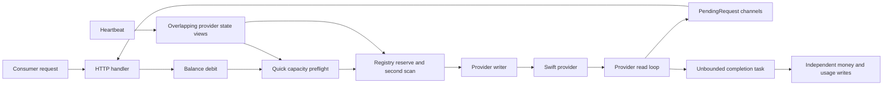
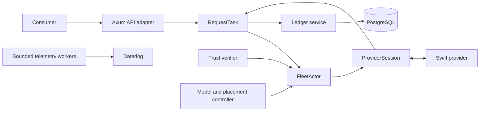

# Rust Coordinator Architecture and Migration Plan

Status: Proposed, not current production behavior

Date: 2026-07-10

Audited baseline: `master` at `73cff2a2332c1b302dd7d61607b6635659b169f1`

Scope: Replace the Go coordinator with a simpler Rust coordinator while preserving
Darkbloom's API, privacy, trust, provider, billing, and operational contracts.

## 1. Executive decision

Build a single-active Rust modular monolith. Do not translate the Go package
structure or reproduce its shared-state design.

The target has four authoritative owners:


| Authority         | Owns                                                                                                                                          |
| ----------------- | --------------------------------------------------------------------------------------------------------------------------------------------- |
| `FleetActor`      | Live provider membership, eligibility, advisory capacity, health, model readiness, and short-lived dispatch permits                           |
| `ProviderSession` | One provider WebSocket, one connection epoch, frame ordering, per-attempt routing, and bounded writer lanes                                   |
| `RequestTask`     | One logical request, its attempts, deadlines, consumer commitment, cancellation, and terminal decision                                        |
| PostgreSQL        | Durable request jobs, financial reservations, settlement, external-event idempotency, model/catalog configuration, and reusable trust records |


The first Rust release is deliberately single-active. Do not add active-active
coordination, a distributed message bus, microservices, QUIC, or multi-region
session ownership until production measurements require them.

At the audited baseline, production has roughly 300 connected providers and a
single GCE coordinator. A single nonblocking fleet actor has substantial
headroom at this scale and is easier to reason about than sharded mutable state.

## 2. Why this is a redesign, not a port

The current inference path is spread across:

- HTTP handling and request normalization in `coordinator/api/consumer.go`.
- Public preflight in `coordinator/api/inference_admission.go:146-435`.
- Committing provider reservation in `coordinator/registry/scheduler.go:319-455`.
- A large retry, speculation, queue, and first-content state machine in
`coordinator/api/dispatch.go`.
- Provider frame delivery in `coordinator/api/provider.go:1397-2180`.
- Process-local reservation and settlement guards in
`coordinator/registry/registry.go:70-403`.
- Independent consumer, provider, platform, referral, usage, and telemetry
writes in `coordinator/api/provider.go:1716-2031`.

The current implementation is heavily tested, but its state ownership is
implicit. `PendingRequest` combines transport, routing, timing, billing,
speculation, and terminal state using four channels and three locks.

The Rust coordinator must preserve behavior that is externally required while
deleting accidental complexity.




## 3. Measured constraints

The design is grounded in current production evidence rather than assumed Rust
performance.

- Failed requests spent roughly 180-256 ms in coordinator stages and 11-17
seconds in provider dark time. About 99% of failed-request latency was inside
provider scheduling. See
`docs/reports/2026-06-22-openrouter-client-gone-batch-contention.md:89-103`.
- The observed OpenRouter first-content deadline is approximately `10 seconds + 1 millisecond per estimated prompt token`, not the current default 5-second base. See `docs/reports/2026-06-22-telemetry-db-findings.md:80-100`. We do 5 seconds to be conservative.
- Token-budget utilization was approximately 0.4% at cancellation while running
occupancy was elevated. Provider scheduling and stale admission state, not raw
coordinator CPU, were the binding resources.
- Current coordinator overhead thresholds are parse p95 5 ms, reservation p95
200 ms, encryption p95 50 ms, and dispatch p95 50 ms in
`e2e/testbed/assert/assert.go:46-52`.
- The current provider sends `inference_accepted` before model load and final
engine/KV admission. It is not an authoritative capacity lease. See
`provider-swift/Sources/ProviderCore/ProviderLoop+InferenceHandler.swift:185-240`.

Consequences:

1. Preserve JSON WebSockets for control, lifecycle, and registration frames in
  the pilot. Protocol v2 moves only the encrypted payload frames to binary
   framing (section 15.3). A general transport rewrite (QUIC, a second
   connection) is not supported by current latency evidence.
2. Move exact capacity authority to a provider-side prepare lease.
3. Make coordinator state ownership and financial durability the primary work.
4. Treat low latency as a bounded-stage objective, not a reason to weaken money
  or lease correctness.


## 4. Immediate Go safety prerequisites

The Rust project will take time. These independently verified Go risks should be
fixed before the migration reaches a paid pilot.

### 4.1 Speculative double settlement

Primary and backup attempts have different request IDs and independent
reservation-finalization locks while sharing one base reservation. Both attempts
can settle and pay if completion races loser cancellation.

Relevant paths:

- Attempt construction: `coordinator/api/consumer.go:707-743`.
- Backup construction: `coordinator/api/dispatch.go:1301-1319`.
- Race completion: `coordinator/api/dispatch.go:1451-1548`.
- Settlement entry: `coordinator/api/provider.go:1563-1578`.

Disable speculative paid dispatch or introduce one logical job-level settlement
guard as a Go fast fix.

### 4.2 Stripe deposit idempotency

Stripe checkout handling currently checks a billing session, credits the
balance, and completes the session in separate operations. Concurrent webhook
delivery or a crash after credit can apply the deposit more than once.

Replace it with one atomic, idempotent `ApplyStripeDeposit` transaction keyed by
both Stripe event ID and Checkout Session ID.

### 4.3 Reservation provenance

Inference debit can reduce `withdrawable_micro_usd`, while ordinary refund only
restores total balance. Failed or free requests can convert earned funds into
non-withdrawable credit.

Reservation state must record how much total and withdrawable balance was
removed, and release must restore both amounts exactly.

### 4.4 Startup withdrawable backfill

The unconditional startup backfill in `coordinator/store/postgres.go:679-690`
can make later deposits withdrawable. Remove or marker-gate it and reconcile the
live data before Rust shares the database.

### 4.5 Bounded completion work

Current completion creates unbounded goroutines and then additional provider and
platform credit goroutines. Replace it with bounded workers or one transactional
settlement call.

### 4.6 Rollback-safe Go baseline

The retained Go fallback must be a deliberately patched compatibility build. It
must:

- Use external migrations rather than startup DDL.
- Understand all additive Rust schema objects it may encounter.
- Acquire the same global coordinator ownership lock as Rust.
- Refuse unsafe startup while Rust jobs, reservations, prepared leases, or
terminal dispositions remain active.
- Preserve the existing provider protocol fallback behavior for dual-stack
providers.
- Ingest and ACK historical protocol-v2 terminals for Rust jobs, using the Rust
durable disposition tables without attempting a second settlement. This keeps
offline providers from retaining an unacknowledged terminal forever after Go
rollback.

Today's Go image is not a safe emergency fallback once Rust has active durable
jobs.

The rollback-safe baseline is a real sub-project, not an incidental patch: a Go
build that understands the additive Rust schema, honors the ownership epoch,
and ingests protocol-v2 terminals competes for the same engineers as the Rust
implementation. Give it an owner and an estimate in Milestone 0.

## 5. Goals


### 5.1 Reliability

- Exactly one authority for each live provider, logical request, and financial
transition.
- No paid provider execution without durable funding.
- No duplicate consumer charge, provider payout, refund, platform fee, referral
reward, or usage record.
- Crash recovery from PostgreSQL and provider terminal replay.
- Bounded tasks, mailboxes, byte buffers, database workers, and external calls.
- Explicit cancellation and shutdown rather than detached cleanup.


### 5.2 Performance

- One fleet admission operation rather than preflight plus reserve.
- No global mutex held across candidate scans and provider mutation.
- No database catalog or pricing reads in the routing loop.
- No synchronous geolocation request in the inference path.
- No generic 120-second request queue.
- No 64-attempt retry ladder.
- Byte-bounded, zero-copy-oriented streaming where practical.
- No per-token base64 or JSON re-encode on protocol-v2 encrypted frames.
- Calibrated first-content prediction per model and hardware class.
- Tail latency bounded by prepare-stage hedging, never start-stage speculation.
- Measurable stage budgets and queue-delay metrics.


### 5.3 Maintainability

- Rust enums represent lifecycle states and rejection reasons.
- One reducer owns each state machine.
- Three primary workspace crates rather than many small crates.
- No `Arc<RwLock<Registry>>` god object.
- No broad union repository equivalent to the current 157-method `Store`.
- No duplicate memory-store implementation for production persistence.


## 6. Non-goals

- Active-active or multi-region coordinator operation.
- Replacing PostgreSQL.
- Replacing the Swift provider.
- Replacing the WebSocket transport during the pilot. Binary framing for
encrypted payload frames is protocol-v2 scope (section 15.3); QUIC or a second
control connection is not.
- A full provider scheduling-engine redesign.
- Reproducing deprecated provider versions and retired coordinator behavior.
- Maintaining exact internal routing decisions when the new behavior is an
explicitly approved simplification.
- Storing prompt or response content for recovery.


## 7. Target architecture




### 7.1 Axum API adapter

The adapter owns external HTTP contracts only:

- Route matching and middleware.
- Request body and header limits.
- Authentication extraction.
- OpenAI, Responses, Completions, and Anthropic request normalization.
- SSE or non-streaming response construction.
- Mapping typed domain errors to stable HTTP responses.

It must not mutate provider state or implement settlement rules.

### 7.2 `RequestTask`

One supervised task owns each logical request.

It owns:

- `JobId` and attempt sequence.
- The absolute first-content and total request deadlines.
- Durable reservation state returned by the ledger service.
- At most one funded, start-authorized provider attempt.
- At most one sequential alternate and at most one concurrent prepare hedge
(section 11.8).
- First-content commitment.
- Consumer output backpressure.
- Cancellation and terminal disposition.
- Settlement or release command submission.

`RequestTask` is the sole live orchestrator. PostgreSQL's versioned job reducer is
the sole durable terminal authority. Recovery workers invoke that same reducer;
they do not implement a second state machine. Every live and recovery mutation
CASes the expected job version and coordinator/worker ownership lease.

Content chunks do not queue through the `RequestTask` mailbox. They flow from
`ProviderSession` into the bounded per-request consumer byte pipe directly;
`RequestTask` observes control events only (first-content commitment,
backpressure failure, terminal, cancellation). This keeps the per-chunk relay
budget independent of actor scheduling.

Suggested process-local states:

```rust
enum RequestState {
    Reserving,
    Admitting,
    Preparing { attempt: AttemptId },
    FundingPrepared { attempt: AttemptId, lease: LeaseId },
    Starting { attempt: AttemptId, lease: LeaseId },
    AwaitingContent { attempt: AttemptId, lease: LeaseId },
    Streaming { attempt: AttemptId, lease: LeaseId },
    AwaitingTerminal { attempt: AttemptId, lease: LeaseId },
    Finalizing,
    Finished,
}
```

The enum is illustrative. The implementation should keep the state set minimal
while making invalid transitions unrepresentable.

### 7.3 `FleetActor`

One nonblocking actor owns all live fleet decision state.

It owns:

- Authenticated active provider sessions and their connection epochs.
- Trust and routing eligibility.
- Authoritative model-ready generations.
- Advisory heartbeat snapshots.
- One simplified health state per provider/model.
- Short-lived prepare permits.
- Per-model candidate indexes.
- Coalesced warm-demand signals.

It does not own prompt bytes, WebSocket I/O, cryptography, database work, chunks,
or settlement.

The actor performs one `Admit` operation that both selects a candidate and
reserves a short-lived local prepare permit. There is no separate public
preflight and committing reserve path.

At current scale, an indexed scan over a few hundred providers is inexpensive.
Do not shard this actor until profiling shows its mailbox or CPU is a real
bottleneck. Sharding prematurely reintroduces cross-model and shared-provider
atomicity problems.

### 7.4 `ProviderSession`

One supervised session owns one WebSocket connection and one monotonically
increasing connection epoch.

It owns:

- WebSocket receiver and writer.
- Bounded control and data lanes.
- Request-before-cancel wire ordering.
- Mapping attempt IDs to request event sinks.
- Provider protocol decoding and size enforcement.
- Session shutdown and stale-epoch rejection.

It must not perform database work or decide billing state.

One writer task owns the WebSocket sink. The session event loop owns inbound
frame demultiplexing and attempt routing. A new authenticated session atomically
supersedes the prior epoch. Teardown from an older epoch cannot remove the new
session.

### 7.5 Ledger service

The ledger service is a narrow SQLx-backed application service. It owns atomic,
idempotent reserve, resize, settle, release, deposit, and withdrawal-intent
transactions.

It does not own live requests or providers.

### 7.6 Trust verifier

The trust verifier parses and verifies Secure Enclave, MDM/MDA, runtime, APNs,
and signed status evidence. Slow external calls and CPU-heavy certificate work
run outside `FleetActor`. Results return as epoch-fenced events.

### 7.7 Model and placement controller

The controller consumes demand and fleet snapshots, then publishes declarative
desired model state. It does not queue customer requests and does not synthesize
routing state. Provider lifecycle events and heartbeats reduce into the same
canonical model-presence state.

### 7.8 End-to-end paid request

1. Axum authenticates, validates, normalizes, resolves the model, applies request
  and byte limits, and creates `JobId`.
2. `FleetActor::admit` selects one warm eligible provider and returns a
  short-lived prepare permit plus the candidate's frozen pricing/beneficiary
   reference.
3. PostgreSQL atomically creates the logical job and provisional reservation. If
  this fails, `RequestTask` releases the prepare permit and no provider frame is
   sent.
4. `RequestTask` sends `prepare` through `ProviderSession` and records ambiguous
  on-wire outcomes explicitly.
5. The provider validates the request and reserves a non-generating prepared
  lease, then returns exact resource, billing, and execution facts. It begins
   speculative prefill immediately; emission stays gated on start (section 10.3).
6. PostgreSQL resizes the reservation, freezes every price and beneficiary term,
  and records `start_authorized`.
7. `RequestTask` sends idempotent `start`; the provider acknowledges started and
  begins emission — prefill may already be complete or in flight.
8. First content commits the consumer stream process-locally. No database write
  is added to the first-content path.
9. Encrypted chunks pass through a bounded byte pipe until terminal, client
  cancellation, or backpressure failure.
10. The provider journals and sends one signed terminal.
11. PostgreSQL atomically settles or releases the complete job.
12. The coordinator acknowledges the terminal and emits the final client event.

Self-route follows the same execution ownership but may use a non-financial job
record and skips paid reservation/settlement legs.

## 8. State ownership and authority


| State                         | Authority                                                              | Derived copies                 |
| ----------------------------- | ---------------------------------------------------------------------- | ------------------------------ |
| Live provider connection      | `ProviderSession` plus current epoch in `FleetActor`                   | Health and stats snapshots     |
| Provider trust eligibility    | `FleetActor` reducer from verified, epoch-fenced evidence              | API and telemetry snapshots    |
| Model ready/not-ready         | Provider lifecycle event and current heartbeat reduced by `FleetActor` | Model capacity feed            |
| Exact provider capacity lease | Provider prepared lease                                                | Fleet advisory counters        |
| Request lifecycle             | `RequestTask`                                                          | Route telemetry                |
| Financial job state           | PostgreSQL job row                                                     | HTTP status and analytics      |
| Catalog, aliases, pricing     | PostgreSQL version plus atomically swapped in-memory snapshot          | API read cache                 |
| Placement desired state       | Placement controller version                                           | Provider reconciliation status |
| Telemetry                     | Best-effort bounded sink                                               | Datadog and admin views        |


Stored provider records never create live routing capacity. A provider becomes
routable only through a current authenticated session.

## 9. Core invariants


### 9.1 Provider and trust invariants

1. One stable provider identity has at most one active routable session epoch.
2. Frames from stale epochs cannot mutate live state or active attempts.
3. Historical terminal replay may reference its origin epoch only when it is
  authenticated as the same stable provider and bound to a durable attempt.
4. Public routing requires current trust, runtime integrity, encrypted transport,
  challenge freshness, model readiness, and request-shape capability.
5. Self-route may relax hardware enrollment and private-only policy, but never
  encryption, runtime, signature, or live-challenge requirements.
6. A hard trust downgrade cannot be reversed by an older in-flight verifier
  result. Trust events carry a monotonic trust epoch.
7. Unknown, plaintext, mixed, wrong-key, or cryptographically invalid chunks are
  never forwarded.
8. Every durable trust-reuse row carries the current hard-untrust epoch. Grant,
  upsert, invalidation, and delete linearize against that epoch in PostgreSQL;
   stale verifier work cannot repersist pre-downgrade hardware trust.


### 9.2 Request invariants

1. One logical consumer request has one `JobId` and one `RequestTask`.
2. Each provider dispatch has a distinct `AttemptId`.
3. At most one attempt is ever funded and start-authorized. Before start
  authorization, at most two attempts may hold prepared leases concurrently:
   one primary and one hedge.
4. At most one sequential alternate and at most one concurrent prepare hedge
  are allowed, and only before any attempt is `start_authorized`.
5. The absolute first-content deadline is shared by every attempt and never
  resets.
6. No alternate is start-authorized after ambiguous start delivery or
  unacknowledged cancellation. Concurrent prepares are safe under ambiguity
   because prepared leases emit nothing; the funding compare-and-swap selects
   the single start.
7. First content commits the request. Role or lifecycle preamble does not.
8. No failover occurs after first content.
9. Every provider lease is released only by provider terminal evidence,
  acknowledged abort/cancel, lease expiry, or session loss.
10. Every local prepare permit and provider lease has a hard expiry and an
  idempotent release path.
11. An ambiguous `start` delivery never authorizes an alternate. The coordinator
  resends the same idempotent start or waits for provider evidence.
12. `start_authorized`, not first-content telemetry, is the durable
  no-automatic-redispatch boundary after coordinator recovery.


### 9.3 Financial invariants

1. No paid provider generation starts without a durable funded reservation.
  Generation means token emission: speculative prefill under a prepared lease
   backed by the durable provisional reservation is permitted and is never
   billable (section 10.3).
2. Reserve, resize, settle, and release are idempotent on stable operation keys.
3. A job reaches one final money state: `settled`, `released`,
  `settled_reviewed`, or `released_reviewed`. `review_pending` is nonterminal,
   retains its reservation, and blocks rollback.
4. Consumer adjustment, provider payout, platform-fee and referral-reward
  allocations, canonical usage, ledger rows, and job terminal commit in one
   settlement transaction. Materialized platform/referrer balances may lag their
   authoritative fee rows through the bounded projection (section 12.6).
5. Provider, platform, or referrer credit never exceeds collected funds.
6. A reservation records both total and withdrawable provenance and refunds both
  exactly.
7. Pricing, beneficiary, fee, referral, token bounds, model, API key, and rounding
  rules are frozen before generation.
8. Provider usage above funded bounds is capped, marked for review, and treated as
  a provider protocol violation.
9. A terminal acknowledgement means the coordinator can recover the exact durable
  disposition after a crash.
10. A released job cannot later auto-settle from a delayed terminal.


### 9.4 Backpressure invariants

1. Every task set, mailbox, writer lane, request pipe, telemetry queue, database
  worker set, and terminal journal is bounded.
2. A full data lane makes that provider temporarily ineligible.
3. A full control lane closes the provider session rather than losing cancel or
  trust intent.
4. A slow consumer never blocks the provider reader.
5. Telemetry may be dropped with a counter. Money, terminal, trust, lease, and
  cancellation events may not be silently dropped.
6. Database pressure causes paid admission shedding before it creates unbounded
  unsettled work.


## 10. Provider protocol v2

Plain v0.7.5 is not protocol-v2 compatible. The paid Rust pilot requires a later
dual-stack Swift provider release advertising an explicit capability. Version
comparison is not a substitute for capability negotiation.

### 10.1 Registration

Add:

- Protocol major and minor version.
- Capability set.
- Current provider process/session generation.
- Support flags for prepared leases, start authorization, structured errors,
start acknowledgement, abort acknowledgement, cancel acknowledgement, durable
terminals, and model lifecycle events.

The coordinator sends only messages supported by the negotiated capability set.

### 10.2 Identifiers

Every request frame carries:

- `job_id`: logical financial and consumer request identity.
- `attempt_id`: one provider dispatch identity.
- `session_epoch`: active connection fence.
- `coordinator_epoch`: single-active coordinator fence.
- `dispatch_nonce`: replay and substitution fence.
- `request_digest`: digest of the canonical encrypted request envelope.

The encrypted envelope repeats the critical identifiers. The provider compares
the inner and outer values after decryption.

Binary encrypted-payload frames (section 15.3) carry the same identifiers in a
fixed header; the fencing semantics do not depend on the frame encoding.

Every `start`, `started`, `abort`, `aborted`, `cancel`, `cancelled`, terminal, and
terminal-ACK frame carries `job_id`, `attempt_id`, `lease_id`, coordinator epoch,
session epoch, provider-process generation, dispatch nonce, and request digest.
An acknowledgement proves the named state transition, not merely receipt of the
command. In particular, cancel acknowledgement means the attempt is durably
quiescent and cannot later emit output.

### 10.3 Prepare, fund, and start

The canonical reliable protocol is two-phase:

```text
Coordinator sends prepare
Provider decrypts, validates, renders, tokenizes, and reserves a prepared lease
Provider returns prepared lease, exact resource, billing, and execution facts
Provider begins speculative prefill; no emission
Coordinator freezes and funds the complete charge in PostgreSQL
Coordinator records start_authorized and sends idempotent start
Provider begins emission once start arrives and the start record is durable
```

The prepared lease authorizes no output emission. It has a provider-local
monotonic expiry returned as a duration, not a cross-machine wall-clock
timestamp. `start`, `abort`, and `cancel` are idempotent and tombstoned so
delayed frames cannot resurrect released work.

The `prepared` reply carries execution facts alongside resource facts: engine
queue depth and whether prefill can begin immediately. A prepared ETA that
cannot meet the remaining first-content budget is grounds for the pre-start
alternate (section 11.8) — abort the lease and re-route in milliseconds instead
of absorbing a multi-second first-content penalty.

After returning `prepared`, the provider begins speculative prefill
immediately. Prefill is compute against the funded provisional reservation; it
emits no billable output and no consumer-visible content, so it does not
violate the funding invariant (section 9.3). The fund/authorize database leg
and the start round trip then overlap prefill and add to time-to-first-token
only when prefill is shorter than they are. Abort halts speculative prefill and
discards its state; wasted prefill is bounded by the lease TTL and occurs only
on abort, hedge loss, resize failure, or expiry.

`start` returns an explicit `started` acknowledgement. If that acknowledgement is
lost, the coordinator resends the same start identity. It never creates another
attempt from an ambiguous start outcome.

The provider serializes `start` and `abort` for one lease. An abort tombstone
rejects every later start. If start wins first, a later abort becomes cancellation
of the running attempt and must produce a terminal. Session teardown aborts every
not-started lease and journals a terminal or cancellation disposition for every
started attempt.

Before returning `started` and before emitting any chunk, the provider reserves
terminal-journal capacity and fsyncs a start record containing the request/lease
identity and funded bounds. The fsync overlaps ongoing prefill; only first
emission gates on durability, so the disk write does not extend
time-to-first-token. If the provider dies before it can durably produce an
exact terminal, the coordinator moves the job to `review_pending`; it does not
guess usage, redispatch, or silently release funds.

This adds one control round trip and one database transaction before emission
authorization. With speculative prefill those legs overlap prompt prefill, so
the observed first-token cost is near zero for realistic prompts. It removes
the unresolved boundary where a provider can begin work before exact funding is
durable.

A later one-phase fast path may pre-fund a provable conservative upper bound and
allow generation immediately after provider preparation. Speculative prefill
removes most of its time-to-first-token motivation; what remains is
control-plane load. It must not ship until property tests prove the bound
covers every supported tokenizer, chat template, tool schema, media shape,
output bound, and pricing rule.

### 10.4 Provider state machine

```text
idle
  -> preparing
  -> prepared with TTL, speculative prefill running, no emission
  -> running after start authorization, emission after durable start record
  -> terminal journaled
  -> acknowledged and removed
```

Abort before start writes a tombstone. Cancellation after start retains the
lease until a cancelled terminal, normal terminal, lease expiry, or session loss.

### 10.5 Structured errors

Replace coordinator substring classification with a typed provider error class:


| Class             | Meaning                                      | Coordinator action                                                           |
| ----------------- | -------------------------------------------- | ---------------------------------------------------------------------------- |
| `invalid_request` | Deterministic request shape or content error | Return once, no retry                                                        |
| `capacity`        | Exact provider capacity unavailable          | Refresh advisory state; one alternate allowed                                |
| `model_not_ready` | Model not resident or ready                  | Signal placement; return 429 or try one warm alternate                       |
| `draining`        | Provider update/shutdown drain               | One alternate allowed                                                        |
| `cancelled`       | Confirmed cancellation                       | Release lease according to request state                                     |
| `fault`           | Provider or engine failure                   | Record health failure; one alternate only if no attempt was start-authorized |
| `security`        | Identity, encryption, or integrity failure   | Hard fence provider                                                          |


Human-readable text remains diagnostic and never drives control flow.

### 10.6 Terminal delivery

Every content-bearing protocol-v2 chunk carries a sequence number, cumulative
completion-token count, and rolling response hash. The coordinator records the
latest chunk successfully accepted into the bounded consumer-output pipe. That
acceptance, not provider generation, is the billable-output linearization point.
Tokens generated after pipe enqueue fails are not charged to the consumer.

Each attempt emits one canonical signed terminal containing:

- Job, attempt, lease, provider, model, and origin-epoch identity.
- Request digest.
- Outcome and structured error class.
- Prompt, completion, and reasoning token counts.
- Response hash.
- Final generated-token count and provider rolling-hash checkpoint.
- Provider Secure Enclave signature over the canonical terminal.

The provider fsyncs the terminal into a local bounded journal before sending it.
It deletes the entry only after a matching acknowledgement. The journal contains
only IDs, outcome, usage, digests, signatures, and retry metadata. It never stores
prompt or response content and is encrypted at rest with a provider-local key.

On reconnect, the provider replays unacknowledged terminals. Duplicate terminals
with the same digest return the stored disposition. The same attempt with a
different terminal digest is a protocol conflict and cannot move money.

If the terminal journal is full, the provider stops accepting paid work until it
drains.

Settlement joins the provider's generated terminal facts with the coordinator's
independent last-accepted chunk sequence/token/hash checkpoint. A mismatch cannot
increase consumer charge and is recorded for provider review.

If the coordinator crashes after exposing output but before terminal and loses
its process-local accepted checkpoint, replayed terminal settlement enters
`review_pending`. It does not infer client delivery from provider generation.

### 10.7 Model lifecycle

Add versioned `model_ready` and `model_gone` events. Heartbeats continue carrying
the full snapshot and reconcile missed events.

Lifecycle events and the full heartbeat snapshot carry one monotonically
increasing provider-process state revision. `FleetActor` ignores older revisions,
so a delayed heartbeat cannot resurrect a model after `model_gone` or overwrite a
newer ready generation.

Both event types reduce into one canonical model-presence enum. The coordinator
does not maintain separate `CurrentModel`, `WarmModels`, synthetic slots, and
pending-load views.

## 11. Admission and routing


### 11.1 One admission operation

`FleetActor::admit` performs:

1. Hard eligibility filtering.
2. Advisory warm and health filtering.
3. Simple scoring.
4. Short-lived prepare-permit reservation.
5. Typed decision return.

Admit accepts an exclusion set of already-attempted providers so the sequential
alternate and the prepare hedge never re-select the primary.

It returns one of:

```rust
enum AdmissionDecision {
    Prepare(DispatchPermit),
    RetryAfter { reason: CapacityReason, delay: Duration },
    Reject { reason: RejectionReason },
}
```

There is no separate `QuickCapacityCheck` equivalent.

### 11.2 Hard gates

- Active current session epoch.
- Trust and challenge freshness.
- Runtime and encrypted-transport integrity.
- Concrete model readiness.
- Vision, tools, media, and other request traits.
- Provider beneficiary identity for paid public routing.
- Health state not quarantined, except one explicit half-open probe.
- Writer data-lane capacity.


### 11.3 Capacity authority

Heartbeat capacity ranks providers and limits how many prepares are outstanding.
It never authorizes exact execution.

The provider prepared lease is the exact authority for model, KV, media,
concurrency, and engine admission.

A stale heartbeat may cause one failed or slow prepare. It cannot cause
unfunded or overcommitted generation. The prepared reply's execution facts
convert a stale-capacity mistake from a multi-second first-content penalty into
one fast pre-start re-route (section 11.8).

### 11.4 Scoring

Score only eligible warm candidates:

```text
predicted first-content latency
+ expected decode duration
+ small health adjustment
+ small load-spread adjustment
```

Trust is a hard gate, not a score. Warmth is represented by model readiness and
predicted latency, not a separate large bonus. Occupancy appears once through
provider estimates, not through multiple correlated penalties.

Do not route on requested maximum output as if it were expected output. Keep the
maximum for physical funding and safety, but use a measured per-model output
distribution for latency ranking.

Predicted first-content latency must be calibrated online: maintain a windowed
median of actual versus predicted per model and hardware class and apply it as
a clamped multiplicative correction. Uncalibrated predictions ran 1.9-2.8x high
in production and rejected hundreds of thousands of counterfactually servable
requests with spurious 429s before online calibration was added to the Go
coordinator (2026-07-03 routing audit). The Milestone 1 replay gate scores
prediction accuracy, not only candidate parity.

### 11.5 Pricing simplification

Preferred product direction: one public consumer price per model, independent of
the selected provider. Provider payout schedules are eligibility and settlement
inputs, not a second consumer quote.

If provider-specific pricing must remain, freeze the exact provider quote before
start authorization. Never perform a post-dispatch provider-price top-up.

### 11.6 Health

Use one provider/model health machine:

```text
healthy
  -> suspect
  -> quarantined until time
  -> half_open with one probe
  -> healthy or quarantined
```

Security state is separate and machine-wide.

Capacity rejection invalidates advisory capacity until fresh state arrives. It
does not count as a provider fault. Request-invalid rejection never affects
provider health.

Do not fail open by routing general traffic to every quarantined provider. If the
fleet has no healthy route, allow at most one explicit half-open probe and return
a retryable error for other traffic.

### 11.7 Queue policy

Do not include a generic internal queue in the initial Rust execution path.

- Service and OpenRouter traffic receives a fast 429 with `Retry-After`.
- Cold model demand signals the placement controller and receives a load-time
retry hint.
- Direct or self-route traffic may later opt into a separate bounded wait policy
tied to the caller's own deadline.

No request waits 120 seconds by default while holding a financial reservation.

### 11.8 Retry policy

- At most one attempt is ever funded and start-authorized.
- At most one sequential alternate, before start authorization only.
- At most one concurrent prepare hedge, before start authorization only: when
the primary prepare exceeds a per-model prepare-latency percentile timer, or
its prepared execution facts cannot meet the remaining first-content budget,
send prepare to one alternate provider. The first usable prepared lease is
funded and started; the losing lease is aborted idempotently.
- Starts are never hedged. The job-level funding compare-and-swap makes a
second funded start unrepresentable, so hedged prepares cannot recreate the
section 4.1 double-settlement class.
- Hedges draw from a global bounded budget (target well under 10% of requests)
and require their own fleet permit and writer-lane headroom. An exhausted
budget degrades to the sequential-alternate behavior.
- One absolute first-content deadline shared across all attempts.
- An alternate starts only after explicit rejection, acknowledged abort/cancel,
prepared-lease expiry, pre-start provider session loss, or a hedge trigger.
- Once any attempt is `start_authorized`, no alternate and no hedge is allowed
in the initial release, even after a zero-output terminal or provider loss.
- No retry after first content.

Start-stage speculative dispatch (the current Go behavior) is not ported: it is
the source of the double-settlement risk in section 4.1, and in production its
backup won roughly 43% of the races it entered (2026-07-03 routing audit) —
evidence that the tail-latency tool is worth keeping, not that start-stage
racing is safe. Prepare-stage hedging keeps the measured tail benefit with
clean money semantics because prepares are non-generating, abortable, and
tombstoned.

## 12. Durable request and money design


### 12.1 Required tables

Use an additive Rust schema during migration:


| Table                              | Purpose                                                                                                               |
| ---------------------------------- | --------------------------------------------------------------------------------------------------------------------- |
| `rust_coord.inference_jobs`        | One logical request, reservation provenance, frozen pricing/beneficiaries, state, deadlines, and terminal disposition |
| `rust_coord.inference_attempts`    | Attempt identity, provider/session/lease binding, request digest, and state                                           |
| `rust_coord.provider_terminals`    | Idempotent signed terminal receipt and disposition                                                                    |
| `rust_coord.financial_operations`  | Unique operation keys for reserve, resize, settle, and release                                                        |
| `rust_coord.external_events`       | Stripe and other external event inbox, keyed by source and event ID                                                   |
| `rust_coord.outbox`                | External side effects, notifications, and non-critical projections                                                    |
| `rust_coord.coordinator_ownership` | Single-active coordinator epoch and recovery state                                                                    |


Keep legacy balance, ledger, usage, earning, billing-session, and Stripe tables as
compatibility projections until Go fallback is retired. Rust updates them in the
same transaction as its canonical job state, with one deliberate exception: the
platform/referral materialized balances, which a bounded single-writer projection
folds in from the authoritative fee rows (section 12.6).

### 12.2 Durable job states

```text
reserved
  -> preparing
  -> prepared
  -> start_authorized
  -> running
  -> settled

reserved/preparing/prepared/running
  -> released
  -> review_pending
  -> settled_reviewed
  -> released_reviewed
```

`settled`, `released`, `settled_reviewed`, and `released_reviewed` are terminal
money states. `review_pending` is nonterminal: its reservation remains debited,
it blocks Go rollback, and an explicit reconciler/operator decision must atomically
settle or release every cent before the job becomes final.

An attempt can be `queued_to_socket`, `sent_unknown`, `prepared`, `started`,
`terminal_recorded`, `aborted`, or `acknowledged`.

`sent_unknown` is explicit because a socket error cannot prove whether the
provider received the request.

### 12.3 Reservation provenance

During the pilot, retain Go-compatible balance semantics: reservation removes
funds from the existing available balance. The durable job records how much of
the reservation came from withdrawable funds.

Use nonwithdrawable credit first. For balance `B`, withdrawable subset `W`, and
reservation `H`:

```text
nonwithdrawable = B - W
reserved_withdrawable = max(0, H - nonwithdrawable)
```

Reserve transaction:

- Inserts the job if its operation key is new.
- Debits `balance_micro_usd` by `H`.
- Debits `withdrawable_micro_usd` by `reserved_withdrawable`.
- Stores both reservation components in the job.
- Inserts the compatible reservation ledger entry.

Release restores the exact total and withdrawable amounts from the job.

Settlement computes the actual withdrawable amount consumed and refunds the
unused total and unused withdrawable provenance exactly.

This avoids a new balance-hold column that an old Go binary would ignore.

### 12.4 Freeze before start

Before `start_authorized`, persist:

- Consumer account and API key.
- Concrete model and public model.
- Pricing and rounding version.
- Exact billable input and bounded output.
- Provider stable identity and beneficiary account.
- Provider payout amount/rate.
- Platform fee.
- Referral beneficiary and share.
- Request digest and attempt binding.
- Total and withdrawable reservation.

No settlement path may re-read mutable pricing, user role, provider ownership, or
referral rules.

### 12.5 Reserve transaction

The initial transaction creates a provisional anti-abuse reservation and job.
It commits before provider prepare.

The transaction atomically enforces the account balance and any per-key spend cap
against settled spend plus active Rust reservations. A separate read-then-write
spend-cap check is not sufficient.

After provider prepare returns exact facts, a resize transaction adjusts the
reservation, freezes every pricing and beneficiary field, and records
`start_authorized` before the start command is sent.

Provider-reported exact input is accepted only from a fully code-attested modern
provider and must remain within a coordinator-computed request-shape upper bound.
An out-of-bound quote aborts the lease and is a protocol/security fault.

If resize fails, the coordinator aborts the prepared provider lease and releases
the job reservation idempotently.

All financial commands have immutable operation keys. If PostgreSQL returns an
ambiguous commit result, reconnect and query that operation key before retrying.
Never replay a debit or credit solely because the commit response was lost.

Use short `READ COMMITTED` transactions with explicit row locks and deterministic
account lock ordering. Retry only recognized deadlock or serialization failures.

Shape each financial transaction as one wire round trip: a single statement
built from data-modifying CTEs, or one server-side function call — not a
BEGIN/statement/statement/COMMIT conversation. Combined with the same-zone
database placement required by section 24, reserve and resize each cost
single-digit milliseconds instead of the cross-cloud multi-round-trip budget
they would otherwise consume twice per request.

### 12.6 Settlement transaction

One transaction:

1. Inserts or validates the provider terminal receipt.
2. Locks the job and attempt.
3. Verifies the provider, lease, request digest, terminal digest, usage bounds,
  response hash, and Secure Enclave signature.
4. Computes actual funded cost.
5. Refunds unused total and withdrawable reservation.
6. Credits the provider balance and inserts platform-fee and referral-reward
  rows computed from the frozen terms.
7. Inserts provider earning, usage, and ledger rows.
8. Marks the attempt and job terminal.
9. Inserts non-critical analytics/outbox work.
10. Commits before terminal acknowledgement.

Lock affected account rows in deterministic account-ID order.

Platform and referral balances are not updated synchronously: every settlement
would otherwise serialize on one global platform account row, turning the hot
path into a lock convoy under load. The inserted fee rows are the authoritative
allocations (section 26.3 reconciliation sums them); a bounded single-writer
projection folds them into the materialized platform/referrer balances and
their legacy compatibility projections. Consumer refund and provider credit
remain synchronous row updates in this transaction. Rollback quiescence
(section 26.1) requires the fee-projection backlog to be zero.

Do not hold a PostgreSQL transaction across WebSocket, Stripe, APNs, MDM, or HTTP
I/O.

### 12.7 Release transaction

One idempotent transaction restores the exact reservation and marks the job
released.

A terminal received after release is recorded and acknowledged as late, but does
not automatically charge or pay. Any compensation is an explicit reviewed
financial operation.

### 12.8 Terminal acknowledgement

The coordinator acknowledges a provider terminal only after its durable receipt
and financial disposition commit.

- Commit succeeds and ACK is lost: replay returns the prior ACK.
- Terminal arrives twice: same digest returns prior disposition.
- Same attempt arrives with a different digest: mark conflict and quarantine.
- Database unavailable: no ACK; provider retains and retries.


### 12.9 First-content durability

First-content commitment remains process-local and telemetry-oriented. Persisting
before the client write would add a PostgreSQL round trip to TTFT without proving
client receipt; persisting after the write retains an unavoidable crash window.

The durable recovery boundary is `start_authorized`:

- Recovery never automatically redispatches a start-authorized job.
- A live RequestTask may use one sequential alternate or one prepare hedge only
before start authorization, after explicit prepare rejection, acknowledged
abort, prepared-lease expiry, fenced pre-start session loss, or a hedge trigger
(section 11.8).
- First-content timestamps describe observed behavior but do not independently
authorize charge, payout, or replay.


### 12.10 Stripe deposit

Create a durable local deposit order before creating the Stripe Checkout Session.
Use a stable Stripe idempotency key and integer cents.

The paid webhook transaction:

1. Verifies signature.
2. Inserts the Stripe event ID idempotently.
3. Locks the local order by Checkout Session ID.
4. Validates account, currency, amount, and paid status against the order.
5. Credits the compatible balance and ledger.
6. Marks the order and billing session complete.
7. Commits before HTTP 200.

Unknown or mismatched sessions become auditable orphans and never metadata-driven
credits.

### 12.11 Stripe withdrawal

Withdrawal request transaction:

- Applies one client idempotency key.
- Debits total and withdrawable balance.
- Creates the local payout intent and compatible withdrawal row.
- Commits before external Stripe I/O.

A bounded outbox worker calls Stripe with stable idempotency keys. Ambiguous
responses remain `external_unknown` and are reconciled. Never refund an ambiguous
external transfer automatically.

During Go fallback retention, every Rust withdrawal state has an exact legacy
projection and stable operation key. The fallback Go build must understand
`external_unknown` without issuing a refund or duplicate Stripe call. Normal
rollback is blocked while any external intent lacks a Go-reconcilable projection.

Credit semantics remain explicit: provider and referral earnings restore total
and withdrawable balance; Stripe deposits and platform fees credit total balance
only; definitive withdrawal failure restores exactly the provenance removed by
the withdrawal intent.

## 13. Cancellation and consumer commitment


### 13.1 Before provider write

Discard the queued frame, release the fleet permit, and release the financial job.
No cancel frame is needed.

### 13.2 Write outcome unknown

Record `sent_unknown`. Do not release or retry merely because the local write
returned an ambiguous error. Await provider evidence, lease expiry, or session
loss.

### 13.3 Prepared but not started

Send idempotent abort. An alternate is legal only after abort acknowledgement,
prepared-lease expiry, or session loss. The losing hedge lease (section 11.8)
takes exactly this path: abort on loss of the funding race, with any
speculative prefill discarded unpaid.

### 13.4 Started before content

Send idempotent cancel. Retain the lease and job until cancelled terminal,
zero-output terminal, expiry, or session loss. No alternate is allowed after
start authorization. Session loss ends live capacity authority but does not
release money; the reservation remains until signed terminal disposition or a
final reviewed settlement/release.

### 13.5 After first content

Never reroute. Send cancel if the client leaves. Await a bounded terminal window
and settle authenticated partial usage when available.

### 13.6 Slow consumer

Chunks enter a byte-accounted bounded request pipe using nonblocking send. The
pipe is the grace window: size it to absorb normal client burst behavior —
several seconds of typical token throughput (hundreds of kibibytes), not a
handful of chunks. The current Go coordinator blocks the provider reader for up
to 250 ms precisely because healthy consumers hiccup (TCP burst recovery,
mobile links); the Rust design must preserve that tolerance in pipe capacity
while never blocking the reader. If the pipe is full or disconnected:

- Mark client backpressure.
- Cancel provider work.
- Stop forwarding.
- Never silently drop a billed chunk.
- Never block the provider reader.

Settlement caps completion usage at the cumulative token checkpoint of the last
chunk successfully enqueued into the consumer-output pipe. Coordinator acceptance
into that pipe is the billing boundary; later client-socket ambiguity is recorded
for telemetry but does not authorize billing for provider-only generated output.

## 14. Backpressure design


| Boundary                  | Limit and action                                                                                        |
| ------------------------- | ------------------------------------------------------------------------------------------------------- |
| HTTP requests             | Global and per-account semaphores; reject before large allocation                                       |
| Request bodies            | Existing 16 MiB plaintext compatibility cap initially; weighted global byte semaphore                   |
| Fleet mailbox             | Separate reliable lifecycle/admission lane and coalesced heartbeat lane; admission fails fast when full |
| Provider data lane        | Bounded by item count and bytes; at most a small number of full-size inference frames                   |
| Provider control lane     | Small bounded messages; full lane fences the session                                                    |
| Request chunk pipe        | Byte-bounded, sized as the client grace window (multi-second burst absorption); full pipe cancels request |
| SQLx pool                 | Bounded pool and statement timeout; no unbounded waiter creation                                        |
| Terminal intake           | Bounded workers; no ACK until durable                                                                   |
| Provider terminal journal | Bounded disk journal; full journal stops paid admission                                                 |
| Telemetry                 | Nonblocking bounded sink; drop counter on overflow                                                      |
| External APIs             | Per-service semaphores, deadlines, retry budgets, and circuit state                                     |


Every limit must emit current depth, capacity, wait time, rejection count, and
oldest-item age.

Admission cannot consume every shared permit. Reserve dedicated mailbox and SQL
pool capacity for ownership fencing, provider lifecycle, abort/cancel, terminal
receipt, settlement, and release. Shed new admissions before those correctness
reserves are touched. Check both provider data-lane and control-lane headroom when
selecting a candidate.

## 15. Networking design


### 15.1 Runtime and framework

Use Tokio, Axum, Tower, and rustls-compatible clients.

Axum graceful shutdown covers HTTP connections but upgraded WebSockets require
explicit application shutdown. An application supervisor must:

1. Stop new inference admission.
2. Cancel or drain request tasks.
3. Stop model and external workers.
4. Broadcast provider going-away intent.
5. Close provider sessions.
6. Join all tracked tasks before exit or leave durable recovery state.


### 15.2 Provider writer

Keep the current two-lane principle:

- Control: cancel, abort, start, challenge, trust status, shutdown.
- Data: prepare request frames and model-control data.

One writer owns the socket sink. It emits an explicit on-wire result for each
frame. A cancel submitted after a confirmed request write cannot overtake it.

Control priority is non-preemptive for an already active large data frame. Treat
this as an explicit measured residual. Do not introduce QUIC or a second control
connection until metrics show it is material.

### 15.3 Message format

Preserve JSON for control, registration, heartbeat, and lifecycle frames during
the pilot. Decode with a Serde tagged enum rather than an `any` payload plus
type assertions.

Encrypted payload frames — the prepare request body and response chunks — use
binary WebSocket frames in protocol v2: a fixed header carrying frame type,
job/attempt/lease identity, epochs, nonce, and sequence, followed by raw
ciphertext. Base64-wrapped ciphertext inside JSON has no observability value,
and v2 providers are a new dual-stack release, so nothing is lost: this removes
the per-token base64 and JSON encode/decode plus roughly one-third wire
inflation on the hottest path, and it ships inside the fleet migration protocol
v2 already forces instead of requiring a second migration later. v1 sessions
keep the existing JSON frames end to end.

Preserve raw signed registration and status bytes where verification depends on
exact encoding. Do not deserialize and reserialize signed input before hashing.

### 15.4 Memory and secret handling

- Use `Bytes` or `Arc<[u8]>` for immutable frame sharing.
- Receive chunk ciphertext as bytes, decrypt in place (`AeadInPlace`; plaintext
is ciphertext minus the tag), and emit SSE as one vectored write of the data
prefix, plaintext, and terminator. No copies after the socket read.
- Parse each consumer request once into typed form, mutate, and serialize once
into the sealed envelope. The current Go path re-marshals the body several
times (alias resolution, allowlist and routing-field stripping); do not
reproduce it.
- Avoid repeated JSON remarshal and base64 copies.
- Drop or zeroize plaintext prompt buffers after provider start when no alternate
can use them.
- Zeroize ephemeral private keys on every terminal and cancellation path.
- Never include raw provider decode errors or prompt fragments in logs.


## 16. Latency budgets

These are objectives to validate, not assumed Rust results.


| Segment                                            | Target        |
| -------------------------------------------------- | ------------- |
| Authentication and parse, text request p95         | < 5 ms        |
| Fleet admission p99                                | < 1 ms        |
| Initial/resize PostgreSQL reservation p95          | < 50 ms each  |
| Initial/resize PostgreSQL reservation p99          | < 150 ms each |
| Encrypt plus provider on-wire handoff p95          | < 20 ms       |
| Total coordinator work before provider prepare p95 | < 75 ms       |
| Total coordinator work before provider prepare p99 | < 200 ms      |
| Provider prepare p95, warm text path               | < 250 ms      |
| Prepared-to-start authorization p95                | < 75 ms       |
| Ingress-to-start p95, warm text path               | < 400 ms      |
| Per-chunk coordinator relay p99                    | < 2 ms        |
| Terminal settlement p99                            | < 200 ms      |


The two-phase prepare/fund/start flow adds one database and one control round
trip before emission authorization. Speculative prefill (section 10.3) overlaps
those legs with prompt prefill, so they extend time-to-first-token only when
prefill is shorter than the prepared-to-start leg. Validate the overlap
explicitly: measure prepared-to-start time hidden by prefill as its own metric.

First-content policy must be client-class aware. Initial OpenRouter calibration
uses approximately `10 seconds + 1 millisecond per estimated prompt token`.
Direct and self-route clients may have different explicit policies.

No attempt receives a fresh full deadline. The absolute request deadline is
created at ingress.

Same-zone database placement and one-round-trip financial transactions (section
12.5) are pilot prerequisites, not post-pilot tuning: the coordinator runs on
GCE while the database is AWS RDS, and this design puts two financial
transactions ahead of every start. If topology cannot meet the reservation
budget, fix database placement before Milestone 5. Do not replace durable
funding with process-local holds as a latency shortcut.

## 17. Observability

One trace uses `JobId`; each provider attempt is a child span keyed by
`AttemptId`.

Record:

- Middleware and authentication latency.
- Body parse and normalization latency.
- Provisional and exact reservation latency.
- Fleet mailbox wait and admission CPU time.
- Writer queue wait and actual on-wire completion.
- Provider prepare latency.
- Prepared-to-start latency.
- Start-to-first-content latency.
- Per-chunk coordinator relay delay.
- Terminal journal, receipt, settlement, and ACK latency.
- Cancellation and abort acknowledgement latency.
- Queue depths and byte occupancy at every bounded boundary.
- Provider rejection classes and one-alternate outcomes.
- Prepare-hedge rate, trigger reason, and win/loss outcome.
- Prepared execution facts versus actual first-content error, and the online
calibration ratio per model and hardware class.
- Prepared-to-start time hidden by speculative prefill.

Do not create per-token trace spans. Aggregate chunk latency histograms per
request/provider/model.

Route telemetry remains best effort. Financial jobs and terminal dispositions are
the durable audit source.

## 18. Failure and recovery behavior


| Failure                                     | Required behavior                                                                                                                                   |
| ------------------------------------------- | --------------------------------------------------------------------------------------------------------------------------------------------------- |
| Database unavailable before paid dispatch   | Reject paid work; never send unfunded inference                                                                                                     |
| Database unavailable after provider prepare | Abort or let prepared lease expire; release provisional job idempotently                                                                            |
| Database unavailable at terminal            | Do not ACK; provider retains and replays terminal                                                                                                   |
| Coordinator crash after reservation         | Durable job is recovered and released or resumed according to state                                                                                 |
| Coordinator crash after start authorization | Query the exact prepared lease and resend the same idempotent start while valid; explicit no-start/expiry releases it; never create another attempt |
| Provider disconnect before prepare          | Release permit; one alternate may be selected                                                                                                       |
| Provider disconnect with prepared lease     | Provider teardown aborts the not-started lease; retain the durable job and choose an alternate only after teardown or expiry is authoritative       |
| Provider disconnect after start             | Do not redispatch ambiguously; await replay/recovery policy                                                                                         |
| Stale heartbeat                             | May choose a poor candidate; provider prepare rejects or reveals honest execution facts safely                                                      |
| Both hedged prepares usable                 | Fund and start exactly one; abort the other lease idempotently                                                                                      |
| Malformed or insecure provider frame        | Terminate request and hard-fence provider as appropriate                                                                                            |
| Slow consumer                               | Cancel provider and end stream without silent loss                                                                                                  |
| Fleet mailbox overload                      | Fail admission quickly; preserve lifecycle and lease events                                                                                         |
| Writer stall                                | Close provider session and fail affected attempts explicitly                                                                                        |
| FleetActor panic                            | Readiness fails and process exits for supervised restart                                                                                            |
| RequestTask panic                           | Durable job survives; provider lease expires or terminal replays                                                                                    |
| Terminal conflict                           | No financial mutation; durable conflict and provider quarantine                                                                                     |
| Stripe response ambiguous                   | Retain external-unknown intent; reconcile by idempotency key                                                                                        |


### 18.1 Recovery workers

Bounded workers use `FOR UPDATE SKIP LOCKED` and expiring worker leases.

They handle:

- Reserved jobs never dispatched.
- Prepared jobs never start-authorized.
- Start-authorized jobs whose start delivery is unknown: query/resend the same
idempotent start while its exact lease remains valid.
- Started jobs awaiting terminal replay.
- Terminal receipts awaiting settlement.
- External outbox retries.
- Stripe external-unknown reconciliation.
- Durable invariant checks.

Repair uses compensating transactions. Never delete financial history or edit
balances without a journaled operation.

## 19. Rust workspace and dependencies


### 19.1 Workspace

```text
coordinator-rs/
  Cargo.toml
  Cargo.lock
  crates/
    protocol/
    core/
    server/
  migrations/
  tests/
    protocol/
    routing-replay/
    fault/
    e2e/
```

`protocol` contains wire types, cryptographic compatibility, and golden fixtures.

`core` contains newtypes, state enums, reducers, admission, scoring, health, and
pure tests.

`server` contains Axum adapters, fleet actor, provider sessions, trust, SQLx,
placement, external integrations, telemetry, and the binary entry point.

Do not create a crate for every small concern.

### 19.2 Core dependencies

- Tokio.
- Axum, Tower, and tower-http.
- SQLx with checked-in offline query metadata.
- Serde and serde_json.
- `crypto_box`; the repository already verifies Go-to-Rust NaCl Box compatibility
in `coordinator/internal/e2e/cross_compat_test.go`.
- Audited P-256, X.509, CMS/PKCS#7, and PKCS#12 libraries.
- rustls and reqwest.
- tracing and OpenTelemetry.
- bytes.
- arc-swap for catalog, pricing, and policy snapshots.
- A modern allocator (jemalloc or mimalloc); allocation-heavy JSON streaming
reliably gains from replacing the system allocator.
- secrecy and zeroize.
- tokio-util task tracking and cancellation.
- thiserror for domain errors.

Pin the Rust toolchain in `mise.toml`, commit `Cargo.lock`, and run dependency,
license, and vulnerability checks in CI.

### 19.3 Coding rules

- No unbounded channels.
- No detached essential tasks.
- No async mutex guard across network or database I/O.
- No content chunks through an actor mailbox; the bounded byte pipe is the only
chunk path.
- CPU-heavy certificate, CMS, and signature work runs on the blocking pool,
never on the reactor.
- Prefer actor ownership to shared mutable maps.
- Prefer concrete services to traits until a second implementation exists.
- Use newtypes for IDs, money, tokens, epochs, and digests.
- Use enums for states, outcomes, rejection reasons, and protocol messages.
- No provider semver checks for capabilities after protocol v2.
- Keep files focused; split orchestration, pure domain logic, and I/O adapters.
- Comments explain invariants and non-obvious failure semantics, not incident
chronology.


## 20. Schema and migration discipline

- Application startup never runs DDL.
- A separate migration command or job applies schema changes.
- Migrations use bounded lock and statement timeouts.
- Large indexes are created concurrently before cutover.
- All coexistence migrations are additive and Go-compatible.
- No rename, drop, type change, trigger-based semantic change, destructive
backfill, or required non-null field until Go rollback is retired.
- SQL uses explicit column lists.
- `cargo sqlx prepare --check` runs in CI.
- Startup checks a supported schema range and refuses an incompatible database.
- Single-active ownership uses both a persistent fencing epoch and a live
PostgreSQL lock/lease. Readiness requires the lock-holding connection to remain
healthy. Ownership loss immediately stops admission and terminates the process
after bounded drain.
- Every provider session, job start authorization, external worker lease, and
financial command records the coordinator fencing epoch that created it.
- Ownership loss immediately forbids new prepare/start commands and fences every
provider session. A stale coordinator cannot keep issuing work during its drain
after another epoch becomes active.
- Every authoritative SQL mutation and every worker claim compares the expected
active fencing epoch in the same transaction. Zero affected rows means immediate
ownership loss. Recording an epoch without a transactional compare-and-swap is
not a fence.


## 21. Implementation milestones


### Milestone 0: Safety baseline and contracts

Deliver:

- Go fixes from section 4.
- Rollback-safe Go baseline.
- Auditable Go quiescence endpoint covering HTTP handlers, request queues,
provider pending attempts, settlement holders, service reservations, writer
lanes, MDM/APNs work, Stripe/external jobs, and background financial workers.
- Route and endpoint inventory.
- Provider protocol inventory.
- Golden JSON frames for every message and omission/null behavior.
- Go, Swift, and Rust crypto vectors.
- Attestation raw-byte and canonical-status vectors.
- OpenAI/Responses/Anthropic HTTP contract fixtures.
- Production-safe routing replay data with no prompt content.

Exit gate:

- Every externally required behavior has an owner, fixture, or explicit decision
to delete.


### Milestone 1: Rust protocol and pure core

Deliver:

- Rust workspace and CI.
- Protocol v1 compatibility decoder/encoder.
- Crypto and sender-sealing compatibility.
- Domain newtypes and state reducers.
- Pure `FleetActor` admission reducer.
- Pure `RequestTask` transition tests.
- Routing replay and intentional-difference report.

Exit gate:

- Protocol and crypto goldens are green.
- Pure reducers pass property tests for invalid transitions, lease accounting,
deadline monotonicity, and one terminal disposition.
- Routing replay scores first-content prediction accuracy against recorded
actuals, not only candidate parity.


### Milestone 2: Dual-stack provider protocol

This milestone attacks the dominant measured latency (provider dark time), and
most of its correctness value — durable terminals, structured errors, journaled
replay — is provider-local and coordinator-independent. Ship the dual-stack
provider release to the fleet as early as fleet policy allows; do not hold it
for Rust coordinator readiness.

Deliver:

- Explicit protocol-v2 capability negotiation.
- Prepare, prepared lease, start, started ACK, abort, cancel ACK, structured
errors, and tombstone ordering.
- Prepared execution facts and speculative prefill with emission gated on start
and on the durable start record.
- Binary encrypted-payload frames (prepare body, response chunks).
- Session and trust epochs.
- Model lifecycle events.
- Signed terminal and bounded fsynced terminal journal.
- Terminal replay and ACK.
- Provider request/attempt deduplication.

Exit gate:

- Current Go remains compatible with the dual-stack provider in v1 mode.
- Rust exercises v2 mode against real providers.
- Lost prepare, lost start, duplicate start, delayed abort, disconnect, replay,
and terminal conflict tests pass.
- Live tests prove no chunk emission before start authorization and no emission
before the durable start record.


### Milestone 3: Rust warm execution plane

Deliver:

- Axum health, readiness, encryption-key, models, and chat-completions endpoints.
- API-key authentication for pilot keys.
- Plain and sealed requests.
- Streaming and non-streaming output.
- Fleet actor and provider sessions.
- One preloaded text model.
- One sequential alternate and the bounded prepare hedge.
- Cancellation and slow-consumer handling.
- Trust verification required by the pilot.

Exit gate:

- Real Swift provider E2E passes.
- Coordinator pre-provider and chunk-relay budgets pass.
- No unbounded task, queue, or memory growth at 10x observed peak.


### Milestone 4: Durable paid execution

Deliver:

- Rust job, attempt, terminal, operation, inbox, and outbox tables.
- Provisional reserve, exact resize, settle, and release transactions.
- Reservation provenance.
- Terminal signature and usage validation.
- Bounded recovery and reconciliation workers.
- Same-release recovery subcommand/image with an explicit supported schema range.
- Stripe deposit exact-once path.
- Provider withdrawal intent/outbox path.

Exit gate:

- Kill-at-every-boundary suite passes.
- Money conservation and idempotency property tests pass. At most one funded
start per job holds under hedge races.
- Go-compatible projections match canonical Rust jobs.
- The section 16 latency budgets pass again with the reserve and resize
transactions on the path against production-shaped database placement —
Milestone 3 validated the warm plane without them.


### Milestone 5: Isolated live pilot

Run the pilot described in section 23.

Exit gate:

- Every pilot success criterion passes for the required duration and volume.


### Milestone 6: Full surface parity

Complete or explicitly retire all production surfaces:

- Chat, Responses, Completions, Anthropic, model list and capacity.
- Privy, API-key CRUD and limits, provider tokens, device authorization.
- Secure Enclave, MDM/MDA, APNs, trust reuse, enrollment and profile signing.
- Models, aliases, manifests, releases, installer and runtime manifest.
- Reservations, provider earnings, fees, referrals, invites, Stripe Checkout,
Stripe Connect, withdrawals and reconciliation.
- Admin, drain, metrics, telemetry, state export, log reports, rewards and stats.
- Console and admin UI behavior.

Exit gate:

- The production route matrix has no unsupported required endpoint.


### Milestone 7: Production-shaped cutover rehearsal

Deliver:

- Cloned production database rehearsal.
- Cloned or test MicroMDM state rehearsal.
- Go to Rust to Go sequence executed twice.
- Crash recovery with active prepared and running jobs.
- Financial reconciliation and terminal replay.

Exit gate:

- Both rehearsals complete within the approved recovery window with zero
unexplained state.


### Milestone 8: Production cutover

Use section 25.

### Milestone 9: Go retirement

Use section 28.

## 22. Validation strategy


### 22.1 Protocol

- Every provider-to-coordinator and coordinator-to-provider frame.
- Binary encrypted-payload frame headers: encode/decode goldens, identifier
fencing fields, truncation, and oversize.
- Missing, omitted, null, zero, false, and empty behavior.
- Unknown message handling.
- Malformed and oversized frames.
- Strict Swift decoder compatibility.
- Raw signed JSON preservation.


### 22.2 Cryptography and trust

- Go to Rust, Rust to Go, Swift to Rust, and Rust to Swift NaCl Box.
- Wrong key, wrong KID, replay, nonce, truncation, and tamper.
- Sender-sealed JSON and SSE.
- Secure Enclave registration and status signatures.
- X25519-to-SE identity binding.
- MDA chain and freshness binding.
- APNs token rotation and challenge reuse.
- Hard-untrust epoch races.


### 22.3 State-machine and concurrency

- Property tests for every request transition.
- One active provider session per stable identity.
- Lost and duplicated prepare/start/abort/cancel frames.
- Hedge races: both prepared, both rejected, hedge fires as the primary
prepared arrives, primary funded while the hedge is in flight (hedge must
abort), and hedge-budget exhaustion.
- No emission before start authorization or before the durable start record.
- Session replacement while old teardown runs.
- Fleet mailbox saturation.
- Writer lane saturation and writer stall.
- RequestTask panic and FleetActor panic.
- Slow and disconnected consumers.
- Prepared lease and terminal journal exhaustion.

Use Loom only for the small shared synchronization primitives that remain. Actor
state machines should be tested primarily through deterministic event traces.

### 22.4 Money and recovery

- Duplicate reserve, resize, settle, release, deposit, and withdrawal request.
- Kill before and after every SQL statement and commit boundary.
- Ambiguous PostgreSQL commit result.
- Terminal received before, during, and after coordinator restart.
- Provider remains offline through Rust-to-Go rollback, then reconnects later
with an unacknowledged protocol-v2 terminal; fallback Go ingests and ACKs the
already-durable Rust disposition without moving money twice.
- Same terminal replay and conflicting terminal replay.
- Late terminal after release.
- Withdrawable provenance for full, partial, and free settlement.
- Concurrent API-key limit reservations.
- Stripe duplicate events, lost responses, definitive failures, and
external-unknown reconciliation.


### 22.5 Load and fault injection

- At least 10x observed peak request and chunk rates.
- At least 1,000 synthetic provider sessions.
- Database latency, connection loss, and pool exhaustion.
- Provider packet loss, half-open TCP, large frame, and abrupt disconnect.
- MDM and APNs latency/rate-limit faults.
- Datadog and external API outages.
- Long-running streams and cancellation storms.

Verify bounded memory, tasks, mailboxes, file descriptors, SQL waiters, and
terminal journal size.

## 23. Isolated pilot

Use a separate environment rather than implementing temporary cross-coordinator
production cohort fencing.

### 23.1 Isolation

- Separate hostname.
- Separate Rust database or dedicated isolated database instance.
- Separate MicroMDM enrollment and persistent volume.
- Dedicated provider tokens and Secure Enclave identities.
- Dedicated API keys and accounts.
- No production Stripe callbacks.
- Six to ten owned provider Macs across relevant hardware classes.


### 23.2 Minimum pilot scope

Include:

- Health and readiness.
- Encryption-key endpoint.
- Model/catalog reads.
- Chat Completions.
- Streaming and non-streaming.
- Plain and sender-sealed requests.
- API-key auth.
- Provider registration, heartbeat, trust, prepare/start (including the bounded
prepare hedge and speculative prefill), encrypted chunks, cancellation,
terminal replay, and ACK.
- One preloaded text model.
- Self-route first.
- Pre-funded paid traffic after self-route passes.
- Reservation, settlement, usage, provider earning, and platform fee.

Exclude initially:

- Stripe deposits and withdrawals.
- Privy and API-key administration.
- Vision and tools.
- Multi-model placement and model migration.
- Releases, installer, enrollment, invites, referrals, rewards, admin writes, and
public stats.

The Rust pilot returns an explicit unsupported response for excluded routes. It
does not proxy them to Go.

### 23.3 Pilot gates


| Gate           | Requirement                                                                                                                     |
| -------------- | ------------------------------------------------------------------------------------------------------------------------------- |
| Duration       | At least 7 continuous days                                                                                                      |
| Volume         | At least 10,000 completed requests                                                                                              |
| Paid coverage  | At least 2,000 settled paid requests, 500 cancellations, and 100 terminal replays                                               |
| Security       | Zero plaintext provider requests/chunks and zero identity-binding regressions                                                   |
| Money          | Zero unexplained reservation, balance, usage, earning, payout, or fee differences                                               |
| Reliability    | 5xx no worse than matched Go baseline by more than 0.25 percentage points                                                       |
| Acceptance     | Matched acceptance, success, 429, and partial/truncated-stream rates within approved bounds; shedding cannot manufacture a pass |
| TTFT           | Matched p95 no worse than max(Go p95 x 1.20, Go p95 + 250 ms)                                                                   |
| Overhead       | Coordinator-owned segments (pre-provider p95/p99, per-chunk relay p99) meet section 16 and are at or below the matched Go segments; end-to-end TTFT is provider-dominated and cannot be the only performance gate |
| Trust recovery | At least 95% of pilot capacity hardware-routable within 2 minutes of restart                                                    |
| Backpressure   | No unbounded task, queue, memory, descriptor, or SQL growth at 10x load                                                         |
| Recovery       | Every kill-at-boundary and terminal replay test converges                                                                       |
| Operations     | Two successful manual cutover and rollback drills                                                                               |


Immediate no-go:

- Duplicate or unexplained money movement.
- Plaintext or mixed provider transport.
- Cross-request/session/terminal replay violation.
- MDM, MDA, APNs, or trust downgrade caused by Rust.
- Unbounded resource growth.
- Unknown active job after reconciliation.

Before Milestone 7, run a separate full-surface staging soak that includes Stripe
test mode, Privy, MDM enrollment/callbacks, APNs, model/release operations, device
authorization, admin writes, and rollback. The narrow inference pilot cannot by
itself qualify those production surfaces.

## 24. Production topology prerequisites

Production currently runs as a serial host-network Docker swap on the GCE VM
`darkbloom-coordinator`, with host Caddy, external RDS, and MicroMDM inside the
coordinator container. The canonical runbook is
`docs/operations/coordinator-deploy.md`.

Before Rust production cutover:

1. Move MicroMDM into its own independently supervised service/container with
  exclusive ownership of `/mnt/disks/userdata/micromdm`.
2. Remove the unused step-ca process from the coordinator lifecycle.
3. Route MDM callbacks through the stable active coordinator endpoint.
4. Rehearse the separation under Go before introducing Rust.
5. Keep the persistent volume and webhook secret mandatory and fingerprinted.
6. Ensure APNs configuration, topic, keys, token binding, reuse rules, and
  enforcement deadline are identical.
7. Add a global PostgreSQL coordinator ownership epoch/lock shared by patched Go
  and Rust.
8. Make Caddy switch only to an instance whose readiness includes database,
  FleetActor, provider capacity, trust, terminal intake, and settlement workers.
9. Give Go and Rust distinct fixed ports during rehearsal/cutover. Caddy must be
  able to switch consumer routes, provider WebSocket routes, and MDM callback
   routes independently. This lets Rust rebuild provider capacity while consumer
   traffic remains gated and avoids two host-network containers competing for
   `:8080`.
10. Place PostgreSQL in the same zone as the active coordinator (or move the
  coordinator adjacent to the database) and verify commit latency against the
   section 16 reservation budgets under production-shaped load. The current
   GCE-coordinator-to-AWS-RDS topology pays cross-cloud latency on two
   financial transactions per request.

Do not run two MicroMDM processes against the same Bolt database.

The MicroMDM extraction contract includes the Bolt database, push-certificate
import state, TLS assets, API key, SCEP/MDM public paths, webhook target and
secret, solicited-command allowlist, command UUID records, and read-only command
restrictions. Rehearse extraction and rollback under Go before Rust uses it.

Outstanding MDM command UUIDs and results must either be durably relayed to the
active coordinator epoch or reach zero before authority changes. Likewise, do not
cut over with an unaccounted APNs challenge set. This prevents late callbacks from
granting trust to the wrong epoch and avoids a fleet-wide APNs re-challenge herd.

## 25. Production cutover

The cutover is manual and serial.

1. Freeze exact Go fallback and Rust image digests.
2. Confirm all additive migrations and indexes are applied; no startup migration
  is pending.
3. Verify Go and Rust derive the same sender-encryption KID.
4. Capture provider, trust, capacity, request, TTFT, error, release, model, price,
  balance, ledger, Stripe, and session baselines.
5. Freeze provider releases, model promotion, pricing, enrollment, device linking,
  payouts, rewards, invites, and nonessential admin mutations.
   Return retryable failures for Stripe and MDM callbacks during the short
   no-owner interval so their senders retry. Never acknowledge an event that no
   authority durably recorded.
6. Put Go into drain and stop new inference admission.
7. Poll the full Milestone 0 quiescence endpoint to zero, including HTTP requests,
  request queues, provider attempts, settlement holders, service reservations,
   writer lanes, financial workers, MDM/APNs work, Stripe/external jobs, and
   terminal backlog.
8. Close and join Go provider sessions and every mutating/background worker, then
  release the global coordinator epoch as the final mutating action and stop Go.
9. Keep the independently supervised MicroMDM service running.
10. Start Rust in passive mode without provider ingress, external workers, or
  public traffic.
11. Verify schema, secrets, encryption KID, catalog, release state, trust caches,
  MDM, APNs, R2, auth, Stripe verification, and observability.
12. Acquire the Rust coordinator epoch before enabling any mutator or provider
  ingress.
13. Enable Rust workers and provider ingress, switch the provider WebSocket and
  MDM callback upstreams in Caddy to Rust, then let providers reconnect and
    rebuild trust while consumer traffic remains gated.
14. Wait for readiness and approved provider/trust capacity thresholds.
15. Switch Caddy to Rust.
16. Run plaintext and sealed, streaming and non-streaming smoke tests with a
  dedicated account.
17. Verify request settlement, provider earning, balance, usage, model, release,
  trust, and telemetry.
18. Keep control-plane mutations frozen for the initial observation window.
19. Unfreeze reads, normal inference, model operations, admin writes, and Stripe
  operations in that order.

Rollback immediately for any cryptographic, identity, financial, ownership, MDM,
or APNs invariant violation.

Initial operational rollback triggers:

- Any duplicate or unexplained financial mutation.
- Any plaintext or invalid encrypted provider traffic.
- Less than 90% of baseline routable capacity for an active model after 5 minutes.
- Less than 95% of baseline aggregate routable capacity after 10 minutes.
- 5xx above baseline by 0.25 percentage points for 5 consecutive minutes.
- Matched p95 TTFT beyond the approved pilot threshold for 10 consecutive minutes.
- A fleet-wide MDM `device not found` or APNs retry spike.
- Rust readiness, FleetActor, terminal worker, or reconciliation invariant failure.


## 26. Rollback


### 26.1 Normal rollback

1. Freeze control-plane mutations.
2. Put Rust into drain.
3. Stop new inference and new external intents.
4. Poll the full Rust quiescence endpoint to zero, including request tasks,
  provider attempts, prepared leases, financial jobs, terminal replay backlog,
   the fee-projection backlog, writer lanes, trust work, and every external
   worker.
5. Reconcile the Rust interval and verify every job is settled, released,
  settled-reviewed, or released-reviewed. No `review_pending` row may remain.
   Verify every external intent, especially `external_unknown`, has an exact
   Go-reconcilable legacy projection and stable operation key.
6. Close and join every Rust provider session and mutating/background worker.
7. Release the Rust coordinator epoch as the final mutating action and stop Rust.
8. Start the tested rollback-safe Go image in passive mode against the current
  additive schema, without provider ingress or background mutators.
9. Verify encryption KID, database, MicroMDM, APNs, trust, catalog, and release
  configuration using read-only checks.
10. Acquire the Go coordinator epoch before enabling workers or provider ingress.
11. Enable Go provider ingress, switch the provider WebSocket and MDM callback
  upstreams in Caddy, verify reconnection/trust/readiness, and then switch
    consumer and remaining callback routes.
12. Keep releases, models, enrollment, and Stripe mutations frozen until the Go
  baseline is restored and the Rust interval is reconciled.

Do not restore PostgreSQL for a normal deployment rollback.

### 26.2 Emergency Rust failure

Current Go cannot safely interpret active Rust jobs, prepared leases, or replayed
terminals.

Every Rust deployment ships and rehearses a same-release `recovery` subcommand or
image with an explicit forward-compatible schema range. The immediate recovery
tool is that same-release artifact, not an arbitrary previous production image:

- It accepts no new consumer traffic.
- It reacquires only the recovery/settlement authority.
- It receives or replays provider terminals.
- It settles or releases every job, including converting each `review_pending`
row into an explicit settled-reviewed or released-reviewed disposition.
- It verifies no active reservation, lease, terminal, or external intent remains.

Only then may Go acquire production authority.

If emergency availability requirements demand Go serve new requests before Rust
recovery completes, the fallback Go implementation must explicitly understand and
fence Rust jobs. This is additional scope and is not assumed by this plan.

### 26.3 Reconciliation

For the exact Rust interval, verify:

- Each logical request has one job and at most one funded start.
- Each attempt has one terminal disposition.
- Consumer reservation equals actual charge plus exact refund.
- Provider payout plus platform and referral allocations equal collected cost.
- Withdrawable provenance is preserved.
- Usage and provider earnings exist exactly once for settled jobs.
- Stripe events and intents map to one local transition.
- Provider sessions, trust reuse, MDA, APNs, catalog, aliases, releases, and prices
match the intended state.
- Route telemetry explains every operational error but is not used as financial
authority.

Run reconciliation at cutover, 15 minutes, 1 hour, 24 hours, and before declaring
rollback complete.

## 27. What not to port


| Current mechanism                                  | Rust disposition                                                   |
| -------------------------------------------------- | ------------------------------------------------------------------ |
| Public preflight plus committing reserve           | Replace with one FleetActor admission                              |
| `PendingRequest` channel/lock bundle               | Replace with one RequestTask reducer                               |
| Global registry lock plus provider lock            | Replace with FleetActor ownership                                  |
| 120-second model queues                            | Delete from default path                                           |
| 64 failover attempts                               | Replace with one bounded alternate                                 |
| Default speculative backup                         | Replace with bounded prepare-stage hedging; starts are never hedged |
| Accepted message before actual capacity            | Replace with prepared lease and start authorization                |
| Request-triggered cold load                        | Replace with detached placement signal and retry response          |
| Separate warm/current/backend/pending-load views   | Replace with one model lifecycle state                             |
| Pooled-KV and free-memory re-derivation            | Provider prepare is exact authority                                |
| Multiple cooldowns, clamps, deraters, and breakers | Replace with one health state machine plus advisory invalidation   |
| Provider string error classification               | Replace with typed error enum                                      |
| Per-attempt base settlement locks                  | Replace with durable job-level idempotency                         |
| Process-local service holds                        | Replace with durable reservation transaction                       |
| Independent settlement goroutines                  | Replace with one settlement transaction and bounded workers        |
| Broad `Store` interface and memory clone           | Replace with narrow concrete SQLx services and real Postgres tests |
| Startup DDL                                        | Replace with external migrations                                   |
| Live env reads and many rollout flags              | Replace with typed startup config and versioned policy snapshot    |
| Synchronous geolocation                            | Trusted headers or post-request best effort                        |
| Provider semver feature floors                     | Replace with protocol capability negotiation                       |
| Legacy provider compatibility                      | Require the approved modern protocol floor                         |


## 28. Go retirement

Go remains an operational fallback until all of the following are true:

- Rust has been production primary for at least 90 days without rollback.
- Two provider release cycles complete through Rust.
- At least two payout and financial reconciliation cycles complete without
discrepancy.
- Every required production route and background job is Rust-owned or explicitly
retired.
- Every active provider protocol version passes Rust compatibility tests.
- No unresolved Rust financial, trust, terminal, model, release, MDM, MDA, APNs,
or Stripe discrepancy remains.
- The console and admin UI operate correctly against Rust and the read replica.
- The team explicitly accepts loss of Go rollback capability.

Only then may destructive schema cleanup or removal of legacy protocol fields be
considered. Keep the Go source, final tested image digest, environment fingerprint,
and compatibility fixtures beyond the active rollback window.

## 29. Open decisions

These decisions must be explicit before the relevant milestone begins:

1. Whether public consumer pricing becomes provider-independent. Recommended: yes.
2. The exact provisional reservation amount before provider prepare.
3. The proof required before enabling a one-phase pre-funded fast path.
  Speculative prefill removes most of its first-token motivation; what remains
   is control-plane load.
4. Provider prepared-lease TTL and cancel/abort acknowledgement deadlines.
5. Direct and self-route bounded-wait policies. Recommended initial public policy:
  no internal queue.
6. Provider terminal journal storage, size, encryption, and retention.
7. Exact terminal canonicalization and signature domain.
8. Required protocol-v2 provider fleet floor for production cutover.
9. Which database placement change meets the reservation budget — same-zone
  PostgreSQL next to the coordinator, or coordinator co-location with the
   database. Required before Milestone 5; see sections 16 and 24.
10. Whether emergency Go service before Rust reconciliation is worth the added
  fallback complexity. Recommended: no.
11. The prepare-hedge trigger percentile, the prepared-ETA alternate threshold,
  and the global hedge budget.
12. The binary encrypted-payload frame header layout and its protocol-v2
  capability flag.


## 30. Definition of done

The Rust coordinator is ready for production cutover only when:

- State ownership matches section 8.
- Every invariant in section 9 has a test or runtime assertion.
- Protocol v2 and durable terminal replay are deployed to the approved fleet.
- Money transitions are durable and idempotent under kill-at-boundary tests.
- All queues, tasks, byte buffers, SQL workers, and journals are bounded and
observable.
- Latency budgets pass under production-shaped load.
- The isolated pilot gates pass.
- Full required surface parity is complete.
- Production-shaped Go to Rust to Go rehearsals pass twice.
- The normal and emergency rollback procedures are executable by an operator who
did not implement the system.

The success criterion is not that the Rust coordinator reproduces every Go
mechanism. It is that the externally required behavior is preserved with fewer
authorities, fewer state transitions, bounded failure domains, and durable
financial correctness.