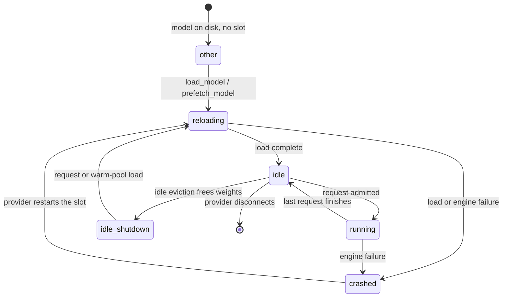

# Scheduling: queues, slots, capacity and the warm pool

> Last updated: 2026-09-13 · commit `8eba1c7f3`

Scheduling is the coordinator's model of *how much work the fleet can take
and where the weights are*: the per-model request queue, the per-slot state
and token budgets a provider reports in its heartbeat, the concurrency caps
derived from them, demand-driven model loads, and the warm-pool controller
that keeps enough providers resident for each model. Choosing *which*
eligible provider gets a request is the subject of
[`routing.md`](routing.md); this page stops where that choice begins.

## Context

Providers are personal Macs. Their memory is finite and shared between model
weights and KV cache, they can hold only a few models resident at once, and
they announce their state only as often as they heartbeat. The coordinator
cannot see a provider's queue directly; it sees what the last heartbeat said
(`BackendCapacity`, [`protocol-messages.md`](../reference/protocol-messages.md))
plus whatever it has dispatched since. Scheduling therefore has three jobs:

1. **Admit honestly.** Do not send a request a provider will reject for lack
   of KV memory or concurrency (token-budget admission, concurrency caps).
2. **Absorb bursts.** Hold requests briefly in a per-model queue rather than
   shedding on the first busy moment, and re-run placement whenever something
   changes.
3. **Shape the fleet.** Load models where demand is, ahead of demand where
   the signals justify it, without flapping.

## Mechanism

### Per-model request queue

`RequestQueue` (`coordinator/registry/queue.go`) delegates FIFO storage and its
mutex to `requestqueue.Queue` (`coordinator/registry/requestqueue/queue.go`),
bounded by `defaultQueueMaxDepth` queued requests per model (`maxSize`) and
`defaultQueueMaxWait` per request (`maxWait`); the `EIGENINFERENCE_QUEUE_*`
overrides and their defaults are in
[configuration.md → Routing, admission and TTFT](../reference/configuration.md#routing-admission-and-ttft).

`Enqueue` sweeps the model's stale entries, then returns `ErrQueueFull` when
the queue already holds `maxSize` requests. Each waiter blocks in
`WaitForProviderContext` on its own `maxWait` timer and on the request's
absolute first-content clock. The queue's error vocabulary:

| Error | Meaning |
|---|---|
| `ErrQueueFull` | Model queue at `maxSize`. |
| `ErrQueueTimeout` | Waited `maxWait` without a reservation. |
| `ErrQueueTTFTTooSlow` | Hard-reject mode: every otherwise-eligible provider fails only the TTFT ceiling, so waiting cannot help. |
| `ErrQueueFirstContentDeadline` | The request-absolute first-content clock expired while queued. |
| `ErrQueueToolConstraintUnavailable` | No provider left that can honour a required tool constraint. |

**Draining.** A queue is drained — waiters popped in order and offered to the
routing path — whenever fleet state changes. The event is recorded on the
queued request as a `DrainTrigger` (closed vocabulary; `foldDrainTrigger` maps
anything else to `unknown`):

| `DrainTrigger` | Fired by |
|---|---|
| `heartbeat` | A provider heartbeat for any model it serves (`Heartbeat`, `coordinator/registry/heartbeat.go`). |
| `idle` | A provider finished a request (`SetProviderIdle`). |
| `challenge` | A provider passed a challenge and became eligible (`coordinator/api/provider.go`, `coordinator/api/provider_codeattest.go`). |
| `load` | A provider reported a model load complete (`coordinator/api/provider.go`). |
| `disconnect` | A provider left; queued requests it alone could have served fail fast (`Disconnect`). |
| `kick` | Cold-dispatch kick from the API layer when a request is enqueued (`coordinator/api/cold_dispatch.go`). |
| `unknown` | Any other caller of the public drain helpers (`coordinator/registry/scheduler.go`). |

`drainModelQueue` (`coordinator/registry/scheduler.go`) serializes passes per
model through `requestqueue.DrainCoalescer` (`coordinator/registry/requestqueue/drain.go`).
A trigger arriving during a pass requests another pass after held waiters are
requeued. Within a pass, `drainDominated` skips a scan only for a request with
the same structural eligibility that is no smaller and has no looser TTFT
ceiling than an earlier capacity rejection (`coordinator/registry/queue_drain_dominance.go`).
Heartbeat-only triggers within `heartbeatDrainSuppressWindow = 20 * time.Millisecond`
of a saturated pass coalesce into one trailing drain; other triggers run
immediately (`coordinator/registry/queue_drain_suppress.go`).

A provider reporting `status: draining` or a typed `error_reason: draining`
is excluded as transient capacity until its next idle/serving heartbeat, or
`drainStateTTL = 150 * time.Second` without a refresh. These rejections do not
consume capacity retries or feed provider fault/capacity trackers
(`coordinator/registry/drain_state.go`, `MarkDraining`;
`coordinator/api/provider.go`, `handleInferenceErrorOwned`;
`coordinator/api/provider_drain.go`, `noteProviderDraining`). Error ingress marks
the provider before removing its pending slot or draining queued demand.
Consumer classification does not repeat the mutation, so a delayed error cannot
overwrite a newer recovery heartbeat. Wire values are listed in
[the protocol reference](../reference/protocol-messages.md).
The Swift retirement reconnect keeps `refusingNewWork` raised through its
late in-flight drain and clears that barrier on the new connection; another
active update or shutdown barrier remains authoritative
(`provider-swift/Sources/ProviderCore/ProviderLoop+DrainState.swift`,
`setRetirementReconnectBarrier`).

`PopNextFresh` skips stale entries as it pops; `RequeueFront` returns a
waiter that could not be placed; `PreferWaiterOwners` lets a drain favour
waiters that own the provider that just freed. `FailQueuedRequestsForModel`
fails every waiter for a model with a specific error (used for
capability-unavailable and disconnect outcomes).

**Lazy stale sweep.** There is no background timer. `cleanStaleLocked` runs
inside `Enqueue` and `QueuedModels`, dropping entries older than `maxWait`
and signalling their waiters; `PopNextFresh` rejects stale entries as it
pops; and every waiter enforces its own `maxWait` timer. A model key is
deleted from the map when nothing survives the sweep.

### Slot states

A provider's heartbeat carries one `BackendSlotCapacity` per model it has
engine state for (`coordinator/protocol/messages.go`). The coordinator's
closed `SlotState` vocabulary (`coordinator/registry/gate_reason.go`) folds
the wire string:

| `SlotState` | Wire `state` | Weights resident | Routable | Cost effect (`slotStatePenalty`) |
|---|---|---|---|---|
| `running` | `running` | yes — actively serving | yes | `slotStatePenaltyRunning` |
| `idle` | `idle` | yes — loaded, nothing in flight | yes | `slotStatePenaltyRunning` |
| `idle_shutdown` | `idle_shutdown` | no — evicted after idle, engine warm | yes | `slotStatePenaltyIdleShutdown` |
| `crashed` | `crashed` | no | **no** (`slot_crashed`) | ineligible |
| `reloading` | `reloading` | no — load in progress | **no** (`slot_reloading`) | ineligible |
| `other` | anything else, or no slot | no | yes | `slotStatePenaltyUnknown` |

The penalty values are part of the cost model, stated once in
[`routing.md` → Cost model](routing.md#cost-model).

`slotStateModelLoaded` (`coordinator/registry/scheduler.go`) treats
`running` and `idle` as *resident*; that is the definition of **warm** used
by the warm pool (`providerHasWarmModelLocked`) and by the hardware-fit
exemption in routing. A provider with no `BackendCapacity` at all falls back
to its registered `WarmModels` list for warmth and to the flat concurrency
default for admission.

The diagram shows the slot lifecycle as the coordinator observes it through
successive heartbeats; transitions are driven by the provider's engine.



### Token-budget admission per slot

`coordinator/registry/admission/` owns capacity calculations over immutable
`Snapshot` and `Pool` values. The registry captures those values under its
existing locks, then keeps the live reservation recheck and pending-token debit.
`admissionSnapshot` (`coordinator/registry/admission_policy.go`) is the explicit
field mapping; the calculation package owns no provider or registry mutex.

Modern providers report a live KV budget per slot: `ActiveTokenBudgetMax`
(tokens the slot can hold given current free memory), `ActiveTokenBudgetUsed`
(reserved by running requests), `QueuedTokenBudget` (reserved by requests in
the backend queue) and `KVBytesPerToken`. `Policy.FreeMemoryAdmits`
(`coordinator/registry/admission/memory.go`) admits a request of
`requestTokens = promptTokens + max_tokens` when

```text
ActiveTokenBudgetUsed + QueuedTokenBudget + coordinatorExtra + requestTokens ≤ ActiveTokenBudgetMax
```

where `coordinatorExtra` is the coordinator's own in-flight `max_tokens` for
the slot that the provider has not yet reflected (`pendingMaxTokens −
admission.CommittedTokenBudget`, floored at 0; implementation in
`coordinator/registry/admission/memory.go`). A budget-clamped pair
([`routing.md`](routing.md#gray-box-capacity-signals)) and a slot that reports
`KVBytesPerToken` with a zero budget (`admission.KnownZeroTokenBudget`) are refused
outright. `PoolAdmits` (`coordinator/registry/admission/pool_accounting.go`) then checks the provider-wide pool that all
slots share, in bytes when the provider reports byte-mode budgets.

**Memory fallback** for slots without a token budget: a resident model needs
no weight memory; a non-resident one needs `modelSizeGB` plus the request's
KV estimate (`tokens × kvCacheBytesPerToken / bytesPerGB`; the fallback
`kvCacheBytesPerToken` is in [`routing.md` → Cost model](routing.md#cost-model)). An idle on-disk provider with nothing in flight is judged against
its reported `FreeForLoadGB` when present, otherwise against
`modelSizeGB + kvCacheGB + osReserveGB ≤ totalMemoryGB` with
`osReserveGB = 4.0`; a busy provider must satisfy
`totalMemoryGB − GPUMemoryActiveGB ≥ required`.

The **absolute hardware-fit gate** (`modelFitsHardware`,
`modelMemoryHeadroomFactor`) precedes both paths for non-resident models
and is described with the other gates in [`routing.md`](routing.md#eligibility-gates-and-the-gatereason-vocabulary).

Optional MTP preparation retains its target across asynchronous work, so the
provider excludes that target from eviction feasibility and refreshes its
capacity quote when staging ownership changes. A quote calculated before a
staging change cannot overwrite the newer snapshot
(`provider-swift/Sources/ProviderCore/ProviderLoop+Capacity.swift`,
`updateAggregateCapacity`). The retained-weight and survivor-grant lifecycle is
specified in [Inference: multi-token prediction](inference.md#multi-token-prediction).

### Concurrency caps

Admission also requires headroom
(`hasConcurrencyHeadroomForModelCapResolvedLocked`,
`coordinator/registry/concurrency_cap.go`): the provider's in-flight count for
the model must be below its *effective per-model cap*, **and** its in-flight
count across all models must be below its *provider cap*.

**Provider cap** (`Provider.maxConcurrency`, `coordinator/registry/provider.go`):

| Condition | Cap |
|---|---|
| No `BackendCapacity` reported | `DefaultMaxConcurrent = 4` |
| Any slot reports `ActiveTokenBudgetMax > 0` | `24` (budget admission does the real work; this is a safety valve) |
| Total memory ≤ 24 GB | `2` |
| ≤ 48 GB | `4` |
| ≤ 96 GB | `6` |
| ≤ 128 GB | `8` |
| > 128 GB | `12` |

**Per-model base cap** (`maxConcurrencyForModelLocked`): the slot's reported
`MaxConcurrency` when positive, else the provider cap.

**Quality cap** (`effectiveMaxConcurrencyForModelRateLocked`), enabled by
[`EIGENINFERENCE_QUALITY_CONCURRENCY_CAP`](../reference/configuration.md#routing-admission-and-ttft):
the base cap is
lowered to `ceil(qualityConcurrency × overcommit)`, where
`throughput.QualityConcurrency` (`coordinator/registry/throughput/batch.go`) is the
largest batch that keeps per-request decode at or above the floor:

```text
qualityConcurrency = clamp(floor((soloDecodeTPS / floorTPS − 1) / effectiveTPSLoadFactor), 1, baseCap)
```

with `floorTPS` the warm-pool `DecodeFloorTPS`
([configuration.md → Warm pool](../reference/configuration.md#warm-pool)) and
`effectiveTPSLoadFactor` from the cost model
([`routing.md`](routing.md#cost-model)). The overcommit multiplier is
`defaultQualityCapOvercommit` unless
[`EIGENINFERENCE_QUALITY_CONCURRENCY_OVERCOMMIT`](../reference/configuration.md#routing-admission-and-ttft)
is set explicitly (`SetQualityConcurrencyCap` ignores the legacy fallback that
`config.go` parses when the variable is absent). Per-model overrides come
from `EIGENINFERENCE_QUALITY_CONCURRENCY_OVERCOMMIT_BY_MODEL`; the solo
decode rate is the provider's median solo sample (at least
`defaultQualityCapSoloMinSamples`, the default of
`EIGENINFERENCE_QUALITY_CAP_SOLO_MIN_SAMPLES`), or a seeded/benchmark rate.

### Model slots, pending loads and swaps

**`maxModelSlots`.** The number of models a provider keeps resident at once
is a provider-side setting: `maxModelSlots` in
`provider-swift/Sources/ProviderCore/Config/ProviderConfig.swift` (the
`max_model_slots` key of [`provider.toml`](../provider/cli-reference.md#providertoml-keys-read-by-the-cli)).
The coordinator does not enforce it; it observes the result through slot
states and, when it asks for a load, relies on the provider to evict.

**Pending model loads.** Swap planning and the warm-pool controller reserve
`load_model` commands per (provider session, model) before sending them
(`coordinator/registry/model_load_commands.go`, `reservePendingModelLoads`).
`Commands` in `coordinator/registry/modelloads/commands.go` privately owns the
reservation deadlines and original start times. One pending nonempty-model
command blocks another model on that session until completion or cleanup.
The following policy constants live in `coordinator/registry/modelloads/limits.go`,
except the separate dispatch-load cooldown:

| Constant | Value | When |
|---|---|---|
| `PendingTTL` | `2 * time.Minute` | Default suppression after a `load_model`, and after a failed load. |
| `DrainBackoff` | `30 * time.Second` | Provider rejected the load because it is draining for an auto-update restart. |
| `MemoryBackoff` | `30 * time.Second` | Proactive load failed for a non-draining reason (typically transient memory pressure). |
| `dispatchLoadCooldownTTL` | see [`routing.md`](routing.md#cooldowns-breakers-and-ejection) | Routing skips the pair after a *dispatch-time* load failure (`dispatch_load_cooldown` gate). |
| `PlanInterval` | `250 * time.Millisecond` | Minimum spacing between heartbeat-triggered swap plans, fleet-wide (`coordinator/registry/modelloads/plan_gate.go`, `PlanGate`). |

Pending entries are cleared when the load completes, when the provider
disconnects (`Disconnect`), and by the warm-pool sweep as they expire. A sweep
removes an entry only after its deadline; a status receipt requires the current
time to be strictly before the deadline (`coordinator/registry/modelloads/deadlines.go`,
`Commands.Expire`, `Commands.Count`; `coordinator/registry/model_load_state.go`,
`HasPendingModelLoad`). Backoff changes the deadline while retaining the original
start time for load-duration telemetry.

Registry adapters retain `r.mu` around live policy checks and command
transactions; capability cleanup also holds `p.mu` across observation and
removal. The command mutex is always acquired after those live locks and never
calls back into the registry (`coordinator/registry/model_load_state.go`,
`ClearIneligiblePendingModelLoads`). Disconnect removes session command state
while the separate stable-identity dispatch-load cooldown survives reconnect
(`coordinator/registry/dispatch_load_cooldown.go`, `RecordDispatchLoadFailure`).

**Model swaps.** `TriggerModelSwaps` (`coordinator/registry/model_loading.go`)
plans one swap per model with queued requests and no warm provider: it picks
a cold provider that has the model on disk (`bestModelLoadProviderLocked`)
and sends `load_model`, so demand that no resident slot can satisfy pulls the
model in rather than waiting out the queue. It has two entry points:

- **Heartbeat** — after its queue drain, `Registry.Heartbeat` calls
  `triggerModelSwapsFromHeartbeat` (`coordinator/registry/model_swap_coalesce.go`),
  which returns without planning while the queue is empty and otherwise
  admits at most one plan per `modelSwapPlanInterval` across all heartbeats
  (`PlanGate.Claim`). The planner walks the fleet per queued model, so N
  heartbeats inside the window would each re-derive the same plan. A
  heartbeat the window refuses is coalesced, not dropped: it arms one
  trailing plan for the end of the window (`PlanGate.ArmTrailing`,
  `trailingModelSwapPlan`), so a provider that heartbeat made loadable waits
  at most `modelSwapPlanInterval` for the planner rather than for the next
  heartbeat; the trailing plan claims the same gate, so the planner still
  runs at most once per window. If a delayed timer finds that a heartbeat
  opened a newer window, it rearms for that window to preserve any later
  suppressed state change. The queue *drain* uses the per-model coalescing and
  heartbeat suppression described above.
- **Cold dispatch** ([`EIGENINFERENCE_COLD_DISPATCH`](../reference/configuration.md#routing-admission-and-ttft),
  `coordinator/api/cold_dispatch.go`) calls `TriggerModelSwaps` directly the
  moment a request is enqueued; that kick is immediate and not subject to
  the heartbeat gate.

The plan gate releases its private mutex before invoking the registry callback
(`coordinator/registry/modelloads/plan_gate.go`, `PlanGate.ArmTrailing`). The
registry keeps live provider selection in `coordinator/registry/model_load_plan.go`
(`bestModelLoadProviderLocked`), warm-state publication in
`coordinator/registry/model_load_warm.go` (`MarkModelWarm`), and terminal queue
rejection in `coordinator/registry/model_load_failures.go`
(`RejectUnservableQueuedRequests`).

### Warm-pool controller

`warmpool.Controller` (`coordinator/registry/warmpool/controller.go`) runs
every `Interval` and, per model, decides how many providers *should* be warm
and which cold providers to load. It owns tick serialization, the coalesced
trigger channel, pressure state and latest snapshots. The registry binds live
fleet reads, reservation, dedicated-model policy and command I/O in
`coordinator/registry/warm_pool_controller.go` (`newWarmPoolController`).
Configuration is read once from the environment in `ReadConfig`
(`coordinator/registry/config.go`); `WarmPoolConfig` aliases the owner
`Config` (`coordinator/registry/warmpool/config.go`). The type and default of every knob is in
[configuration.md → Warm pool](../reference/configuration.md#warm-pool):

| Field | Environment variable |
|---|---|
| `Enabled` | `EIGENINFERENCE_WARM_POOL_ENABLED` |
| `ObserveOnly` | `EIGENINFERENCE_WARM_POOL_OBSERVE_ONLY` |
| `Interval` | `EIGENINFERENCE_WARM_POOL_INTERVAL` |
| `MinDwell` | `EIGENINFERENCE_WARM_POOL_MIN_DWELL` |
| `QueueAgeThreshold` | `EIGENINFERENCE_WARM_POOL_QUEUE_AGE_THRESHOLD` |
| `CapacityRejectThreshold` | `EIGENINFERENCE_WARM_POOL_CAPACITY_REJECT_THRESHOLD` |
| `WarmSaturationThreshold` | `EIGENINFERENCE_WARM_POOL_WARM_SATURATION_THRESHOLD` |
| `TTFTMissThreshold` | `EIGENINFERENCE_WARM_POOL_TTFT_MISS_THRESHOLD` |
| `SpeculativeStartThreshold` | `EIGENINFERENCE_WARM_POOL_SPECULATIVE_START_THRESHOLD` |
| `SpeculativeWinThreshold` | `EIGENINFERENCE_WARM_POOL_SPECULATIVE_WIN_THRESHOLD` |
| `ColdDispatchThreshold` | `EIGENINFERENCE_WARM_POOL_COLD_DISPATCH_THRESHOLD` |
| `LoadDurationThreshold` | `EIGENINFERENCE_WARM_POOL_LOAD_DURATION_THRESHOLD` |
| `DecodeFloorTPS` | `EIGENINFERENCE_WARM_POOL_DECODE_FLOOR_TPS` |
| `BurstBuffer` | `EIGENINFERENCE_WARM_POOL_BURST_BUFFER` |
| `FallbackQualityConcurrency` | `EIGENINFERENCE_WARM_POOL_FALLBACK_QUALITY_CONCURRENCY` |
| `AssumedPromptTokens` | `EIGENINFERENCE_WARM_POOL_ASSUMED_PROMPT_TOKENS` |
| `AssumedCompletionTokens` | `EIGENINFERENCE_WARM_POOL_ASSUMED_COMPLETION_TOKENS` |
| `MinWarmByModel` | `EIGENINFERENCE_WARM_POOL_MIN_WARM` (`model=n,...`) |
| `MaxLoadsPerTick` | `EIGENINFERENCE_WARM_POOL_MAX_LOADS_PER_TICK` |
| `MaxLoadsPerTickCeiling` | `EIGENINFERENCE_WARM_POOL_MAX_LOADS_PER_TICK_CEILING` |
| `RampGapFraction` | `EIGENINFERENCE_WARM_POOL_RAMP_GAP_FRACTION` |
| `MaxGlobalPendingLoads` | `EIGENINFERENCE_WARM_POOL_MAX_GLOBAL_PENDING_LOADS` |

**Demand pressure** (`Controller.hasDemandPressure`,
`coordinator/registry/warmpool/target_policy.go`). A model is under pressure when,
within the current pressure window, capacity rejects, TTFT misses, cold
dispatches, speculative starts or speculative wins reach their thresholds;
or the queue is non-empty and its oldest entry is at least
`QueueAgeThreshold` old; or there is any external pressure signal and the
warm-saturated fraction (`warmSaturated / warm`) reaches
`WarmSaturationThreshold`. A warm provider is *saturated* when it has no
concurrency headroom for the model or its backend slot is busy.

**Target** (`warmpool.Target`, `coordinator/registry/warmpool/target.go`) applies
Little's Law when pressure is present and otherwise holds the current warm
count:

```text
serviceTime  = clamp(AssumedPromptTokens / prefillTPS + AssumedCompletionTokens / decodeTPS,
                     MinServiceTime, MaxServiceTime)   # 500 * time.Millisecond … 2 * time.Minute
L            = running + waiting + queueDepth + spillArrivalRate × serviceTime
target       = ceil(L / qualityConcurrency) + BurstBuffer
target       = max(target, warm + 1)              # reactive: pressure always earns one more
target       = clamp(target, warm, warm + eligibleCold)
```

`spillArrivalRate` is an EWMA of arrivals the warm set could not absorb,
`ArrivalEWMAAlpha = 0.3` (`coordinator/registry/warmpool/state.go`).
`Controller.TargetWarm` then applies anti-flap and floors: a target lower than the last
one is held for `MinDwell`, and `MinWarmByModel` raises the target (both
capped at `warm + eligibleCold`).

**Ramp.** The gap between target and warm is closed at
`warmpool.LoadsThisTick(gap, MaxLoadsPerTick, MaxLoadsPerTickCeiling,
RampGapFraction)` loads per tick — at least the base, scaled up to
`ceil(gap × RampGapFraction)`, never above the ceiling or the gap — subject
to `MaxGlobalPendingLoads` outstanding loads fleet-wide. Cold candidates are
ranked by `warmPoolCandidateReasonLocked`
(`coordinator/registry/warm_pool_eligibility.go`); those disqualified are tallied by
reason (`offline_untrusted_private`, `pending_load_or_cooldown`, `not_idle`,
`thermal_critical`, `trust_or_runtime`, `stale_challenge`,
`not_serving_catalog`, `dedicated_excluded`, `model_too_large`,
`no_free_for_load`, `state_restoring`).

**`WarmPoolSnapshot`.** Every tick produces one per model, logged as
`warm_pool_tick` and retained as the controller's latest state
(`Controller.storeSnapshots` / `Controller.LatestSnapshots` in
`coordinator/registry/warmpool/snapshots.go`):
`Model`, `TargetWarm`, `WarmProviders`, `EligibleCold`, `QueueDepth`,
`OldestQueueAge`, `CapacityRejects`, `TTFTMisses`, `SpeculativeStarted`,
`SpeculativeWon`, `ColdDispatches`, `LoadDurationEWMA`, `ObserveOnly`,
`Actions`, `RunningRequests`, `WaitingRequests`, `SpillArrivalRate`,
`ServiceTime`, `QualityConcurrency`, `DemandConcurrency`, `ColdIneligible`,
`ColdDisqualifiers`. With `ObserveOnly` the snapshot is produced but no
`load_model` is sent; `MaxLoadsPerTick = 0` or `MaxGlobalPendingLoads = 0`
has the same effect (`Controller.Plan`, `coordinator/registry/warmpool/plan.go`).

A tick retains its serialization lock across planning, snapshot publication,
diagnostics and sends, in that order. Pressure, queue and snapshot locks are
released before live registry callbacks. Fleet selection keeps `r.mu` then
`p.mu` in `warmPoolFleetSnapshot` (`coordinator/registry/warm_pool_fleet.go`);
reservations retain the model-load transaction locks described above.
`Controller.Configure` publishes the configuration through a private atomic
pointer without taking the tick lock, so registry-held configuration updates
cannot invert the tick-to-registry callback order
(`coordinator/registry/warmpool/owner.go`).

Latest-snapshot readers receive a copy of the outer slice, preserving the
existing nested action and diagnostic-map values. `WarmPoolSnapshot` aliases
`warmpool.Snapshot[modelLoadAction]`: the action type keeps its two fields
private, including when a snapshot is JSON-encoded. Publication happens before
command callbacks, so reentrant observers see the tick that issued the command
(`coordinator/registry/warm_pool_publication_test.go`,
`TestWarmPoolPublishesSnapshotBeforeReentrantSend`).

### Heartbeat cadence and eviction

Each heartbeat (`Registry.Heartbeat`) refreshes `LastHeartbeat`,
`SystemMetrics` and `BackendCapacity`, credits uptime for the gap since the
previous heartbeat when that gap is at most `maxUptimeCredit =
2 * time.Minute`, releases satisfied budget clamps, drains the provider's
model queues with `DrainTriggerHeartbeat`, and calls
`triggerModelSwapsFromHeartbeat`, which runs the swap planner only when the
queue is non-empty and at most once per `modelSwapPlanInterval` fleet-wide,
a heartbeat the window refuses arming one trailing plan for the window's end
([above](#model-slots-pending-loads-and-swaps)).

The provider CLI heartbeats every
[`heartbeat_interval_secs`](../provider/cli-reference.md#providertoml-keys-read-by-the-cli)
(the TOML key of `ProviderConfig.heartbeatIntervalSecs`,
`provider-swift/Sources/ProviderCore/Config/ProviderConfig.swift`).
Coordinator-side comments still describe a 30 s cadence; the eviction math
below is sized for that slower cadence and is therefore conservative for the
provider's faster default.

**Eviction** (`StartEvictionLoop`, `evictStale`): the coordinator binary
starts the loop with a `90*time.Second` timeout
(`coordinator/cmd/coordinator/main.go`). The sweep runs every `timeout / 3`.
A provider whose heartbeat age exceeds the timeout earns a strike; at
`evictStrikeThreshold = 2` consecutive strikes it is disconnected. A provider
must therefore be silent past the timeout at two successive sweeps — at
least ~120 s — before eviction, which rides out a single delayed heartbeat.
The read scan retains each candidate's exact provider pointer. Before removal,
`disconnectProvider` rechecks that pointer and the latest heartbeat under the
registry and provider locks. A heartbeat that recovered after the scan, or a
replacement session registered under the same ID, cancels the stale eviction.

### Provider writer: two lanes

All frames to a provider WebSocket go through one `providerwriter.Writer`
(`coordinator/registry/providerwriter/writer.go`). It privately owns both queues,
acceptance and shutdown state, request handoff state and the write watchdog.
`Provider` methods in `coordinator/registry/provider_writer.go` retrieve or detach
the exact writer pointer under `p.mu`, then release the lock before calling it.
The two lanes retain their existing wire behavior:

| Lane | Carries | Queue | Timeout |
|---|---|---|---|
| control | attestation challenges (`WriteTextControl`), cancel / trust-status / runtime-status frames (`EnqueueText`) | `controlQueueSize = 256` | Same whole-message schedule as data; caller enqueue/result deadlines remain separate |
| data | inference bodies (up to ~21 MiB sealed vision payloads), `load_model`, `prefetch_model`, `desired_models` (`WriteText`) | `dataQueueSize = 128` | `writeTimeout(frameBytes)` = `frameBytes / writeBytesPerSecond` (`2 << 20`, 2 MiB/s) clamped to [`minWriteTimeout = 5 * time.Second`, `maxWriteTimeout = 30 * time.Second`] |

Queue sizes and timeout values are in `coordinator/registry/providerwriter/policy.go`.
`ControlWriteTimeout = 5 * time.Second` remains the caller deadline used by model
commands in `coordinator/registry/model_commands.go`; those commands still use
the data lane. Fire-and-forget control enqueue checks the caller context before
submission and retains a background context for its accepted frame.

Control has strict but non-preemptive priority: a control frame waits for
any in-flight data write to finish, then goes next. Ordering is FIFO within a
lane and unspecified across lanes. Whole-message deadlines are enforced by one
watchdog goroutine per connection (`Writer.watchWrites` in
`coordinator/registry/providerwriter/watchdog.go`) polling every
`watchdogInterval = 250 * time.Millisecond`; on a missed
deadline it closes the socket and the writer surfaces a timeout rather than
a generic closed-connection error. An explicit stop drains queued frames with
`drainErrorString = "provider websocket writer stopped"`; a write failure drains
them with that write's error (`Writer.serve`, `drainAll`).

Deferred writes keep their handoff transaction in
`coordinator/registry/providerwriter/handoff.go` (`Writer.writeRequest`) and
`coordinator/registry/providerwriter/run.go` (`Writer.serve`). The writer builds
at dequeue time; the submitting goroutine observes `TextFrameWriteMetadata`
and acknowledges it before socket exposure. Cancellation claims queued,
building or awaiting-ack frames without sending them. Cancellation during a
write closes the connection before the caller can clean up; an already-completed
write remains successful even if cancellation or shutdown races its result.
The acceptance mutex is released before builders or submitting-owner callbacks.

`Writer.writeFrame` and `writeFragmented` in
`coordinator/registry/providerwriter/frames.go` keep one deadline for the whole
message. Messages larger than `fragmentBytes = 256 << 10` use continuation
frames so peer pongs can interleave; a partial-write error returns without
attempting a final frame. Registry sentinel aliases keep API cancel-failure
classification unchanged.

### `Disconnect()`

`Registry.Disconnect` (`coordinator/registry/provider_lifecycle.go`) is the single
teardown path, reached from socket close and from eviction. On socket close
the provider handler (`coordinator/api/provider.go`) first flips the record to
`StatusOffline` — failing the routing gate `offline` at once, so a slow
session-close write can never leave a dead provider selectable — and only then
runs the deferred `Disconnect`. `offline` is therefore a transient state between
a socket dying and its teardown, never a resting state; an untrusted provider
keeps `StatusUntrusted` instead. Eviction reaches `Disconnect` directly. It:

1. Removes the provider from the registry map and deletes its pending
   model-load entries.
2. **Keeps fault state** (node-health breaker, inference-error cooldowns,
   dispatch-load cooldowns, health ejection) when the provider has a stable
   identity, remembering the identity so faults recorded during teardown
   still land on it. Only a provider that never had a stable identity has
   its session-keyed residue deleted.
3. Decrements the online and per-model provider counts.
4. Fails every in-flight request on the provider with a `502`
   `"provider disconnected"` error and closes its channels. A peer close with
   code 1000/1001 uses the health-neutral `CoordinatorCauseProviderRestart`;
   abrupt drops retain `CoordinatorCauseProviderDisconnected`
   (`coordinator/registry/disconnect_reason.go`, `ClassifyPeerClose`).
5. Drains the provider's model queues with `DrainTriggerDisconnect` so
   waiters that only it could serve fail fast.
6. Clears the provider's prefix-cache holders
   (`cacheHolderRemovalDisconnect`, [`cache-aware-routing.md`](cache-aware-routing.md))
   and resolves outstanding capacity-probe waiters as send-failed.

On reconnect with a changed binary version, `Provider.SetVersion` removes the
stable identity's disconnect-flush strikes and recomputes quarantine state,
at most once per `identityVersionResetMinInterval = 10 * time.Minute`.
Genuine provider 500/502/504 faults survive. Only a 502 carrying the non-wire
`CoordinatorCauseProviderDisconnected` marker is tagged as a disconnect flush;
HTTP status alone does not establish that provenance. Each tracker discards a
marked late disconnect flush from a session
dropped before that reset while holding its mutation lock; request goroutines
cannot reopen the new binary's quarantine after the reset. Same-version churn
and a drop after a throttled reset keep their strikes
(`coordinator/registry/version_reset.go`, `disconnectSource.supersededBy`).
The reset and each fault mutation share the identity's `gateState.mu`; both
live references and the disconnect cache use the same timestamp recorded by
`detachSessionGate`. These request terminal paths never acquire `Registry.mu`.
Cached disconnected identities follow enrichment without changing their drop
times. Version metadata for departed identities remains for
`identityVersionRetention = 20 * time.Minute` after the last activity or
disconnect; live identities, recent resets and active fault state retain their
gate. The existing eviction-loop gate sweep handles this cleanup
(`coordinator/registry/version_reset.go`, `versionHistoryActive`;
`coordinator/registry/gate_sweep.go`, `sweepGates`).

## Invariants

1. **A queue never exceeds `maxSize` and no waiter outlives `maxWait`** —
   `Enqueue`, `cleanStaleLocked`, `WaitForProviderContext`
   (`coordinator/registry/requestqueue/queue.go`, `coordinator/registry/queue_waiter.go`).
2. **Every drain that reserves a waiter records one of the seven
   `DrainTrigger` values** — `foldDrainTrigger`.
3. **A request is never admitted past a slot's reported token budget** —
   `Policy.FreeMemoryAdmits` (`coordinator/registry/admission/memory.go`) and
   `PoolAdmits` (`coordinator/registry/admission/pool_accounting.go`).
4. **In-flight requests never exceed the effective per-model cap or the
   provider cap** — `hasConcurrencyHeadroomForModelCapResolvedLocked`
   (`coordinator/registry/concurrency_cap.go`).
5. **A `load_model` is not re-sent to a pair while its pending entry is
   live** — `Commands.Reserve` in `coordinator/registry/modelloads/commands.go`;
   unswept entries continue to block another model on that session.
6. **The warm target never exceeds what the fleet can reach and never drops
   below the current warm count** — `warmpool.Target`
   (`coordinator/registry/warmpool/target.go`).
7. **Warm-pool loads per tick are bounded** — `warmpool.LoadsThisTick`,
   `MaxGlobalPendingLoads`.
8. **A provider is evicted only after `evictStrikeThreshold` consecutive stale
   sweeps and a fresh identity/heartbeat recheck at removal** — `evictStale`,
   `disconnectProvider` ([above](#heartbeat-cadence-and-eviction)).
9. **Control frames never wait behind queued data frames** — lane priority
   in `Writer.run` (`coordinator/registry/providerwriter/run.go`).
10. **Disconnect preserves stable-identity fault state** — `Disconnect`.
11. **A provider is never double-booked** — the admit re-check and the
    pending debit run under one `p.mu` hold in `commitProviderReservation`
    and `ReserveNextFromPlan`; the locking model is in
    [`routing.md`](routing.md#concurrency-scan-commit-and-fault-state-gates).

## Failure modes

| Symptom | Cause | What the code does |
|---|---|---|
| `429` with `Retry-After`, reason queue full | `maxSize` requests already queued for the model. | `ErrQueueFull`; the API sheds immediately. |
| `429` after `maxWait` | No eligible provider appeared within the queue's wait bound. | `ErrQueueTimeout`; `Retry-After` per [`routing.md`](routing.md#retry-after-derivation). |
| Requests queue although a provider looks idle | Provider's slot is `idle_shutdown`, `reloading` or `crashed`, or its token budget is exhausted. | Routing gates it (`slot_*`, `free_memory`); `TriggerModelSwaps` or the warm pool loads elsewhere. |
| Model never loads despite demand | Every cold candidate is disqualified (`ColdDisqualifiers`) or `MaxGlobalPendingLoads` is saturated. | `warm_pool_tick` logs the reason tally; pending entries expire after `PendingTTL`. |
| Warm count oscillates | `MinDwell` too short for the load duration. | Anti-flap holds a lowered target for `MinDwell`; raise it or set `MinWarmByModel`. |
| Provider evicted while alive | Heartbeats older than the eviction timeout at `evictStrikeThreshold` consecutive sweeps ([above](#heartbeat-cadence-and-eviction)); network stall, sleeping Mac. | `Disconnect`; the provider re-registers, fault state persists by stable identity. |
| Cancel arrives late at provider | A multi-MiB data frame was mid-write. | Control priority is non-preemptive; worst case one `maxWriteTimeout`. |
| Attestation timeout under load | Same cause as above. | Control lane exists to bound this; see `Writer` in `coordinator/registry/providerwriter/writer.go`. |

## Code map

| Concern | File / symbol |
|---|---|
| Per-model FIFO, stale sweep and drain coalescing | `coordinator/registry/requestqueue/queue.go` — `Queue`, `Enqueue`, `PopNextFresh`, `cleanStaleLocked`; `coordinator/registry/requestqueue/drain.go` — `DrainCoalescer` |
| Provider handoff, deadlines and queue policy | `coordinator/registry/queue_waiter.go` — `QueuedRequest`, `WaitForProviderContext`; `coordinator/registry/requestqueue/assignment.go` — `Assignment`; `coordinator/registry/queue_policy.go` — `DrainTrigger*` |
| Drain orchestration | `coordinator/registry/scheduler.go` — `drainQueuedRequestsForModelsWithReason`; `coordinator/registry/provider_lifecycle.go` — `SetProviderIdle`; `coordinator/registry/heartbeat.go` — `Heartbeat` |
| Slot vocabulary | `coordinator/registry/gate_reason.go` — `SlotState`; `coordinator/registry/scheduler.go` — `slotStatePenalty`, `slotStateModelLoaded` |
| Heartbeat payload | `coordinator/protocol/messages.go` — `BackendCapacity`, `BackendSlotCapacity` |
| Token-budget and memory admission | `coordinator/registry/admission/` — `Policy.FreeMemoryAdmits`, `PoolAdmits`, `KnownZeroTokenBudget`, `CommittedTokenBudget`; `coordinator/registry/admission_policy.go` maps the immutable routing snapshot |
| Provider-version interpretation | `coordinator/registry/providerversion/` — `Policy.Compare`, `Policy.SlotBudgetLayout`; one shared interpreter in `coordinator/registry/provider_version.go` |
| Concurrency caps | `coordinator/registry/provider.go` — `maxConcurrency`, `maxConcurrencyForModelLocked`; `coordinator/registry/config.go` — `DefaultMaxConcurrent`; `coordinator/registry/concurrency_cap.go` — `SetQualityConcurrencyCap`, `effectiveMaxConcurrencyForModelRateLocked`, `hasConcurrencyHeadroomForModelCapResolvedLocked` |
| Pending command lifecycle | `coordinator/registry/modelloads/commands.go` — `Commands.Reserve`, `Disconnect`; `coordinator/registry/modelloads/deadlines.go` — `Expire`, `Count`, `Backoff`, `Complete`, `Observe`; `coordinator/registry/model_load_state.go` retains live registry/provider synchronization |
| Model swap planning and publication | `coordinator/registry/model_loading.go` — `TriggerModelSwaps`; `coordinator/registry/model_load_plan.go` — `bestModelLoadProviderLocked`; `coordinator/registry/model_load_commands.go` — `reservePendingModelLoads`, `sendModelLoadActions`; `coordinator/registry/model_load_warm.go` — `MarkModelWarm`; `coordinator/registry/model_commands.go` — `SendLoadModel` |
| Heartbeat plan coalescing | `coordinator/registry/modelloads/plan_gate.go` — `PlanGate.Claim`, `ArmTrailing`; `coordinator/registry/model_swap_coalesce.go` — `triggerModelSwapsFromHeartbeat`, `trailingModelSwapPlan`; `coordinator/registry/modelloads/limits.go` — `PlanInterval` |
| Warm-pool controller | `coordinator/registry/warmpool/controller.go` — `Controller.Run`, `Tick`; `coordinator/registry/warmpool/plan.go` — `Plan`, `PlanObserveOnly`; `coordinator/registry/warmpool/target_policy.go` — `TargetWarm`, `hasDemandPressure`; `coordinator/registry/warmpool/queue_pressure.go` — `RecordQueuePressure`; `coordinator/registry/warmpool/snapshots.go` — `Snapshot`, `LatestSnapshots` |
| Live warm-pool fleet and commands | `coordinator/registry/warm_pool_controller.go` — `newWarmPoolController`, `TriggerWarmPool`; `coordinator/registry/warm_pool_fleet.go` — `warmPoolFleetSnapshot`; `coordinator/registry/warm_pool_eligibility.go` — `warmPoolCandidateReasonLocked` |
| Warm-pool demand and target math | `coordinator/registry/warmpool/target.go` — `Target`, `ServiceTime`, `LoadsThisTick`; `coordinator/registry/warmpool/state.go` — `State`, `ArrivalEWMAAlpha` |
| Observed throughput and batch policy | `coordinator/registry/throughput/observations.go` — `Observations`; `coordinator/registry/throughput/batch.go` — `QualityConcurrency`; `coordinator/registry/throughput/anomaly.go` — `EvaluateAnomaly` |
| Warm-pool and quality-cap configuration | `coordinator/registry/warmpool/config.go` — `Config`, `Check`, `PerTickCeiling`; `coordinator/registry/config.go` — `WarmPoolConfig` alias, `QualityCapConfig`, `ReadConfig` |
| Eviction | `coordinator/registry/provider_lifecycle.go` — `StartEvictionLoop`, `evictStale`, `disconnectProvider`, `evictStrikeThreshold`; wired in `coordinator/cmd/coordinator/main.go` |
| Provider writer and live binding | `coordinator/registry/providerwriter/writer.go` — `Writer`, `New`, `CloseNow`; `coordinator/registry/provider_writer.go` — `Provider.WriteText`, `WriteTextDeferred`, `WriteTextControl`, `EnqueueText`, `closeWriterNow` |
| Writer handoff, lane selection and socket policy | `coordinator/registry/providerwriter/handoff.go` — `Writer.writeRequest`; `coordinator/registry/providerwriter/run.go` — `serve`, `run`; `coordinator/registry/providerwriter/frames.go` — `writeFrame`, `writeFragmented`; `coordinator/registry/providerwriter/watchdog.go` — `watchWrites`; `coordinator/registry/providerwriter/policy.go` — `writeTimeout` |
| Teardown | `coordinator/registry/provider_lifecycle.go` — `Disconnect` |
| Cold dispatch and queue-before-shed flags | `coordinator/api/cold_dispatch.go` |
| Provider-side slot limit and heartbeat interval | `provider-swift/Sources/ProviderCore/Config/ProviderConfig.swift` — `maxModelSlots`, `heartbeatIntervalSecs` |

## Related

- [`routing.md`](routing.md) — gates, cost model, selection, hedging.
- [`inference.md`](inference.md) — the provider-side batch scheduler that produces the slot telemetry consumed here.
- [`storage.md`](storage.md) — KV cache and on-disk model storage on the provider.
- [`model-registry.md`](model-registry.md) — which models a provider may load.
- [`../reference/protocol-messages.md`](../reference/protocol-messages.md) — `heartbeat`, `load_model`, `BackendCapacity`.
- [`../reference/configuration.md`](../reference/configuration.md) — coordinator environment reference.
- [`../operations/routing-v2-rollout.md`](../operations/routing-v2-rollout.md) — kill switches for the queue, cold-dispatch and warm-pool flags.

## Verification dispatcher cadence

The verification scheduler is separate from inference admission. Its dispatcher
reloads durable due rows at `mdmSchedulerDispatchInterval = time.Second` or on a
wake with an empty queue (`coordinator/api/mdm_scheduler_exec.go`,
`shouldLoadDueRows`). A due job blocked by occupied workers or the reserved urgent
slot waits at most `mdmSchedulerBusyRetryDelay = 250 * time.Millisecond`; an
earlier future job retains its shorter timer (`nextDispatchDelay`). Worker
completion signals the dispatcher immediately. Due-row pages start at
`min(limit, verificationDuePageHint)` with `verificationDuePageHint = 256`
and grow to the requested limit (`coordinator/store/postgres.go`,
`ListDueVerificationJobsPage`); the initial allocation does not truncate a page.
