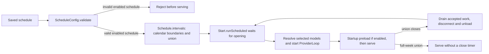
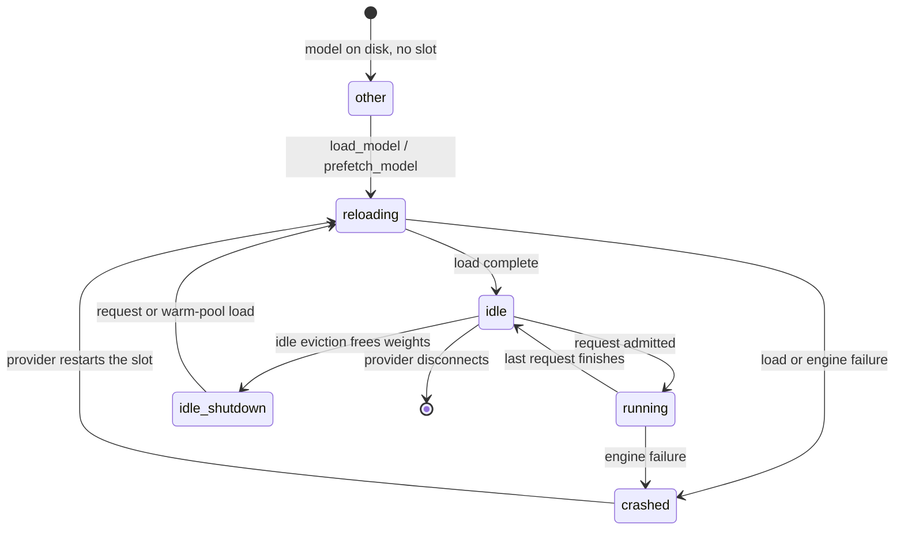

# Scheduling: queues, slots, capacity and the warm pool

> Last updated: 2026-10-03

Scheduling is the coordinator's model of *how much work the fleet can take
and where the weights are*: the per-model request queue, the per-slot state
and token budgets a provider reports in its heartbeat, the concurrency caps
derived from them, demand-driven model loads, and the warm-pool controller
that keeps enough providers resident for each model. Choosing *which*
eligible provider gets a request is the subject of
[`routing.md`](routing.md); this page stops where that choice begins.
Provider-local weekly availability separately controls when a Mac joins that
fleet, as described under [Provider availability windows](#provider-availability-windows).

For automatic same-ID weight updates, desired state includes a revision and
aggregate hash for providers advertising `model_revisions_v1`. The provider
stages the update without occupying a GPU slot. If an alias target is ineligible,
its eligible previous or retired lineage build still receives revision updates.
Only an emitted alias target suppresses competing lineage targets. The provider
then closes admission for that
model and drains accepted work before activation. Other resident models remain
available; new cold loads wait through the activation boundary. See
[model revisions](model-revisions.md) for backoff, snapshot selection and rollback.

## Shared-host memory admission

`SystemMemory.availableBytes` in
`provider-swift/Sources/ProviderCore/Inference/Memory/SystemMemory.swift`
selects one process-start policy through `DARKBLOOM_MEMORY_AVAILABILITY`:

- `reclaimable` (default) counts Mach free + inactive pages. Inactive pages can
  contain a neighbouring process's anonymous memory; reclaiming them may require
  compression and swap. They are not guaranteed physical slack.
- `free-only` counts only Mach `free_count`, which already includes speculative
  pages. It does not credit inactive pages or provider RSS. A failed sample
  returns zero; an invalid explicit policy also selects this stricter mode.

The model-load gate subtracts the larger of the configured `memory_reserve_gb`
and the unified-cap reserve, then outstanding unmaterialized commitments, from
the smaller of OS availability and the MLX-free view. Required load memory still
includes weights and activation/minimum-KV headroom (`ModelLoadAdmission` in
`provider-swift/Sources/ProviderCore/Inference/Memory/ModelLoadAdmission.swift`).
GiB are used despite the configuration's historical `gb` spelling.

The common sampler also feeds runtime KV accounting, post-load serviceability,
doctor and coordinator capacity. Cold-load capacity may still anticipate eviction
of the provider's own eligible MLX allocations; actual admission rechecks the
sample after reclamation. It cannot credit a foreign resident set in free-only
mode. No wire or catalog changes are required.

Free-only mode can reject a load that would fit after file-cache reclamation.
It is an opt-in tradeoff for co-tenanted machines, not an OS memory reservation:
another process can allocate after the sample, and already admitted work is not
cancelled merely because the mode is stricter. Neither mode guarantees prevention
of jetsam or low-swap kills. For background serving, stop and start with
`DARKBLOOM_MEMORY_AVAILABILITY=free-only darkbloom start` to persist the setting
in the provider's launchd plist (`LaunchAgent.passthroughEnvironment` in
`provider-swift/Sources/ProviderCore/Service/LaunchAgent.swift`). Foreground and
background starts resolve empty or invalid explicit values identically.
Watchdog/manual restarts reuse the installed plist. To roll back, stop and start
with `DARKBLOOM_MEMORY_AVAILABILITY=reclaimable`; a plain restart intentionally
preserves the installed policy.

## Draining providers

A lifecycle-draining connection is excluded from `modelLoadCandidatePendingLocked`
and `providerHasWarmModelLocked` in `coordinator/registry/model_loading.go`, from
`warmPoolCandidateReasonLocked` in `coordinator/registry/warm_pool_fleet.go`,
and from load/prefetch command submission in `coordinator/registry/model_commands.go`.
A slot being warm does not make a stopped provider available. Provider admission
and the final inference writer still fence races after planning; existing accepted
work retains its model pin until terminal completion. See
[the routing boundary](routing.md#provider-lifecycle-drain-boundary).

A live inventory replacement remains fenced until its committed receipt reaches
the wire, the provider sends matching `models_replace_ready` after reopening
local admission, and an accepted serving heartbeat refreshes `BackendCapacity`
at the ready frame's `capacity_seq` or later
(`ResumeProviderModels`, `coordinator/registry/provider_models_replace.go`).
Readiness and the heartbeat may arrive in either order; earlier sequence numbers,
draining status, and missing capacity do not release the fence. Only then does
the API reconcile queues and force a current `desired_models`
snapshot through `RefreshDesiredModels` in `coordinator/registry/model_commands.go`.
The API then sends `models_replace_resumed`, and the provider waits for the
matching receipt before reporting success.
That refresh bypasses per-connection delivery deduplication, retains the existing
backend/capability guards and retired-alias lineage, and emits an empty snapshot
when deselected aliases no longer apply. The provider preserves a snapshot that
arrives while its commit is awaiting acknowledgement and resumes convergence
after reopening admission. A failed receipt write or missing readiness neither
resumes routing nor dispatches queued work. Removed-model queue cleanup persists
through a reconciliation drain until routing resumes or disconnect (`handleModelsReplace`,
`handleModelsReplaceReady`, `coordinator/internal/provider/inventory/provider_models_replace.go`).


## Context

Providers are personal Macs. Their memory is finite and shared between model
weights and KV cache, they can hold only a few models resident at once, and
they announce their state only as often as they heartbeat. The coordinator
cannot see a provider's queue directly; it sees what the last heartbeat said
(`BackendCapacity`, [`protocol-messages.md`](../reference/protocol-messages.md))
plus whatever it has dispatched since. Scheduling therefore has three jobs:

1. **Admit honestly.** Do not send a request a provider will reject for lack
   of KV memory or concurrency (token-budget admission, concurrency caps).
2. **Absorb bursts.** Hold requests briefly in a per-model queue rather than
   shedding on the first busy moment, and re-run placement whenever something
   changes.
3. **Shape the fleet.** Load models where demand is, ahead of demand where
   the signals justify it, without flapping.

Warm-pool eligibility uses the same complete legacy or qualified App Attest
serving policy as dispatch (`coordinator/registry/warm_pool_fleet.go`,
`warmPoolCandidateReasonLocked`). App Attest never changes capacity or grants
legacy trust flags. See [provider authorization](../reference/provider-authorization.md).

## Mechanism

### Provider availability windows

The provider's weekly schedule controls coordinator-connected serving and an
attached local endpoint, not standalone `--local`. The CLI editor saves
availability and the existing startup-preload policy; it does not start/stop the
service or change a running process's schedule. Flags and presets belong to the
[CLI reference](../provider/cli-reference.md#darkbloom-schedule); keys belong to
[configuration](../reference/configuration.md#provider-availability).

`Start.runScheduled` in `provider-swift/Sources/darkbloom/Start/StartCommand+Modes.swift`
waits outside availability windows without a `ProviderLoop` or coordinator
connection. At an opening it resolves and validates the model selection, then
starts a loop. The existing `ProviderLoop.runStartupPreloadGate` in
`provider-swift/Sources/ProviderCore/ProviderLoop+StartupPreload.swift` loads
models then, not before the opening. Memory/slot limits and the explicit
`preload_models` list still apply. Disabling startup preload does not prohibit
coordinator-driven or request-driven loads. At a close, accepted work drains
before disconnect and model unloading; the wait between windows continues to
handle lifecycle commands (`Start.waitOutsideSchedule` in
`provider-swift/Sources/darkbloom/Start/StartCommand+ScheduledDrain.swift`).


```mermaid
flowchart LR
    A[Saved schedule] --> B[ScheduleConfig.validate]
    B -->|invalid enabled schedule| E[Reject before serving]
    B -->|valid enabled schedule| C[Schedule.intervals: calendar boundaries and union]
    C --> D[Start.runScheduled waits for opening]
    D --> F[Resolve selected models and start ProviderLoop]
    F --> G[Startup preload if enabled, then serve]
    G -->|union closes| H[Drain accepted work, disconnect and unload]
    H --> D
    G -->|full-week union| I[Serve without a close timer]
```

Availability invariants:

1. Enabled schedules require at least one window, nonempty valid days and valid
   `HH:MM` endpoints. `ScheduleConfig.validate` in
   `provider-swift/Sources/ProviderCore/Scheduling/ScheduleConfig.swift` rejects
   invalid input before serving through `Start.run`. `Schedule.from` in
   `provider-swift/Sources/ProviderCore/Scheduling/Schedule.swift` independently
   fails closed: invalid enabled input produces an unavailable schedule, not
   `nil`/always-available. Disabled schedules return `nil` and may retain invalid
   windows for later repair.
2. Days name the opening day; an earlier or equal end belongs to the following
   local-calendar day. Availability uses inclusive start/exclusive end, not
   fixed elapsed-day arithmetic (`Schedule.from`, `Schedule.isActive`).
3. All membership and wait/close calculations share calendar-derived boundaries
   in the Mac's local timezone. Nonexistent DST times advance to the next valid
   time; repeated times use the first occurrence (`Schedule.boundary` in
   `provider-swift/Sources/ProviderCore/Scheduling/ScheduleIntervals.swift`).
   Equal endpoints denote a calendar day, whose elapsed length can change at DST.
   The schedule does not wake a sleeping Mac; it must remain awake to serve.
4. Overlapping and adjacent windows form a union, including overnight and weekly
   boundaries; an internal boundary never unloads models or disconnects the
   provider (`Schedule.intervals`, `Schedule.durationUntilInactive`). A union
   covering the full week has no close timer, rather than an hourly fallback
   disconnect (`Schedule.coversEntireWeek`, `Start.runScheduled`).

### Per-model request queue

`RequestQueue` (`coordinator/registry/queue.go`) keeps one FIFO per model,
bounded by `defaultQueueMaxDepth` queued requests per model (`maxSize`) and
`defaultQueueMaxWait` per request (`maxWait`); the `EIGENINFERENCE_QUEUE_*`
overrides and their defaults are in
[configuration.md → Routing, admission and TTFT](../reference/configuration.md#routing-admission-and-ttft).

`Enqueue` sweeps the model's completed and stale entries, then returns `ErrQueueFull` when
the queue already holds `maxSize` requests. Each waiter blocks in
`WaitForProviderContext` on its own `maxWait` timer and on the request's
absolute first-content clock. Public deadline-bound dispatch only waits when
credible release evidence leaves time for first content. Current occupancy-only
reports cannot establish a future release, so a full public request returns its
early overload response instead of spending the configured maximum. Explicit
owner and deadline-exempt queue behavior remains. See
[first-content routing](first-content-routing.md).

The queue's error vocabulary:

| Error | Meaning |
|---|---|
| `ErrQueueFull` | Model queue at `maxSize`. |
| `ErrQueueTimeout` | Waited `maxWait` without a reservation. |
| `ErrQueueTTFTTooSlow` | Hard-reject mode: every otherwise-eligible provider fails only the TTFT ceiling, so waiting cannot help. |
| `ErrQueueFirstContentDeadline` | The request-absolute first-content clock expired while queued. |
| `ErrQueueToolConstraintUnavailable` | No provider left that can honour a required tool constraint or the request's native media-tool capability. |

**Draining.** A queue is drained — waiters popped in order and offered to the
routing path — whenever fleet state changes. The event is recorded on the
queued request as a `DrainTrigger` (closed vocabulary; `foldDrainTrigger` maps
anything else to `unknown`):

| `DrainTrigger` | Fired by |
|---|---|
| `heartbeat` | A provider heartbeat for any model it serves (`Heartbeat`, `coordinator/registry/heartbeat.go`). |
| `idle` | A provider finished a request (`SetProviderIdle`). |
| `challenge` | A provider passed a challenge and became eligible (`coordinator/api/provider/`, `coordinator/internal/provider/codeidentity/provider_codeattest.go`). |
| `load` | A provider reported a model load complete (`coordinator/api/provider/`). |
| `disconnect` | A provider left; queued requests it alone could have served fail fast (`Disconnect`). |
| `kick` | Cold-dispatch kick from the API layer when a request is enqueued (`coordinator/api/inference/cold_dispatch.go`). |
| `unknown` | Any other caller of the public drain helpers (`coordinator/registry/scheduler.go`). |

`drainModelQueue` (`coordinator/registry/scheduler.go`) serializes passes per
model through `queuedrain.Coalescer`
(`coordinator/internal/registry/queuedrain/coalescer.go`, `Begin`, `End`, `Abandon`).
A trigger arriving during a pass requests another pass after held waiters are
requeued. Within a pass, `drainDominated` skips a scan only for a request with
the same structural eligibility that is no smaller and has no looser TTFT
ceiling than an earlier capacity rejection (`coordinator/registry/queue_drain_dominance.go`).
Heartbeat-only triggers within `heartbeatDrainSuppressWindow = 20 * time.Millisecond`
of a saturated pass coalesce into one trailing drain; other triggers run
immediately (`coordinator/registry/queue_drain_suppress.go`).

A provider reporting `status: draining` or a typed `error_reason: draining`
is excluded as transient capacity until its next idle/serving heartbeat, or
`drainStateTTL = 150 * time.Second` without a refresh. These rejections do not
consume capacity retries or feed provider fault/capacity trackers
(`coordinator/registry/drain_state.go`, `MarkDraining`;
`coordinator/api/provider/`, `handleInferenceErrorOwned`;
`coordinator/api/inference/provider_drain.go`, `noteProviderDraining`). Error ingress marks
the provider before removing its pending slot or draining queued demand.
Consumer classification does not repeat the mutation, so a delayed error cannot
overwrite a newer recovery heartbeat. Wire values are listed in
[the protocol reference](../reference/protocol-messages.md).
Connection-scoped drain and inventory-replacement receipts live in
`providerdrain.Authority` (`coordinator/internal/registry/providerdrain/authority.go`,
`Commit`, `Complete`, `Disconnect`; `coordinator/internal/registry/providerdrain/replacement.go`,
`CanReplace`, `ConfirmReceipt`, `Readiness`). Registry adapters in
`coordinator/registry/drain_state.go` retain the live-session recheck and provider
critical section. A committed barrier remains distinct from the heartbeat-loss
TTL: reused wire IDs cannot restore superseded generations, and admission stays
closed until the existing replacement receipt and applied-capacity checks permit
resumption. Component ownership does not change these wire or lifecycle rules.
The Swift retirement reconnect keeps `refusingNewWork` raised through its
late in-flight drain and clears that barrier on the new connection; another
active update or shutdown barrier remains authoritative
(`provider-swift/Sources/ProviderCore/ProviderLoop+DrainState.swift`,
`setRetirementReconnectBarrier`).

`PopNextFresh` skips completed and stale entries as it pops; `RequeueFront`
returns a waiter that could not be placed only while its `DoneCh` is open.
It checks completion under the queue lock shared with `Remove`, so a
cancellation that misses a waiter held in the scheduler's skipped list cannot
restore that waiter as queued demand. `PreferWaiterOwners` lets a drain favour
waiters that own the provider that just freed. `FailQueuedRequestsForModel`
fails every waiter for a model with a specific error (used for
capability-unavailable and disconnect outcomes).

**Lazy stale sweep.** There is no background timer. `cleanStaleLocked` runs
inside `Enqueue` and `QueuedModels`, dropping completed entries without another
terminal notification, and entries older than `maxWait` while signalling their
waiters; `PopNextFresh` rejects completed and stale entries as it
pops; and every waiter enforces its own `maxWait` timer. A model key is
deleted from the map when nothing survives the sweep.

### Slot states

A provider's heartbeat carries one `BackendSlotCapacity` per model it has
engine state for (`coordinator/protocol/messages.go`). The coordinator's
closed `SlotState` vocabulary (`coordinator/registry/gate_reason.go`) folds
the wire string:

| `SlotState` | Wire `state` | Weights resident | Routable | Cost effect (`slotStatePenalty`) |
|---|---|---|---|---|
| `running` | `running` | yes — actively serving | yes | `slotStatePenaltyRunning` |
| `idle` | `idle` | yes — loaded, nothing in flight | yes | `slotStatePenaltyRunning` |
| `idle_shutdown` | `idle_shutdown` | no — evicted after idle, engine warm | yes | `slotStatePenaltyIdleShutdown` |
| `crashed` | `crashed` | no | **no** (`slot_crashed`) | ineligible |
| `reloading` | `reloading` | no — load in progress | **no** (`slot_reloading`) | ineligible |
| `other` | anything else, or no slot | no | yes | `slotStatePenaltyUnknown` |

The penalty values are part of the cost model, stated once in
[`routing.md` → Cost model](routing.md#cost-model).

`slotStateModelLoaded` (`coordinator/registry/scheduler.go`) treats
`running` and `idle` as *resident*; that is the definition of **warm** used
by the warm pool (`providerHasWarmModelLocked`) and by the hardware-fit
exemption in routing. A provider with no `BackendCapacity` at all falls back
to its registered `WarmModels` list for warmth and to the flat concurrency
default for admission.

The diagram shows the slot lifecycle as the coordinator observes it through
successive heartbeats; transitions are driven by the provider's engine.


```mermaid
stateDiagram-v2
    [*] --> other: model on disk, no slot
    other --> reloading: load_model / prefetch_model
    reloading --> idle: load complete
    reloading --> crashed: load or engine failure
    idle --> running: request admitted
    running --> idle: last request finishes
    idle --> idle_shutdown: idle eviction frees weights
    idle_shutdown --> reloading: request or warm-pool load
    running --> crashed: engine failure
    crashed --> reloading: provider restarts the slot
    idle --> [*]: provider disconnects
```

### Token-budget admission per slot

Modern providers report a live KV budget per slot: `ActiveTokenBudgetMax`
(tokens the slot can hold given current free memory), `ActiveTokenBudgetUsed`
(reserved by running requests), `QueuedTokenBudget` (reserved by requests in
the backend queue) and `KVBytesPerToken`. `memorypolicy.Admits`
(`coordinator/internal/registry/memorypolicy/admission.go`) admits a request of
`requestTokens = promptTokens + max_tokens` when

```text
ActiveTokenBudgetUsed + QueuedTokenBudget + coordinatorExtra + requestTokens ≤ ActiveTokenBudgetMax
```

where `coordinatorExtra` is the coordinator's own in-flight `max_tokens` for
the slot that the provider has not yet reflected (`pendingMaxTokens −
admission.CommittedTokens`, floored at 0; `coordinator/registry/admission/budget.go`). A budget-clamped pair
([`routing.md`](routing.md#gray-box-capacity-signals)) and a slot that reports
`KVBytesPerToken` with a zero budget (`admission.CheckSlot`) are refused
outright. `memorypolicy.PoolAdmits`
(`coordinator/internal/registry/memorypolicy/pool.go`) then checks the provider-wide pool: the sum of
every slot's private grant (`kvbudget.FromSlots`,
`coordinator/internal/registry/kvbudget/pool.go`) charged with every model's
coordinator-pending tokens, in bytes when every budget slot reports
`KVBytesPerToken`. It rejects what a per-slot check cannot see: pending work
for a cold model that has no slot yet, and a grant that a re-slice shrank
below its live use. A cold request is charged against the same pool.

Native MiMo capacity in 0.9.13 also accounts for fixed request workspace.
`EngineV2Bridge.memoryLimitedConcurrency`
(`provider-swift/Sources/ProviderCore/Inference/Engine/Bridge/EngineV2Bridge+MemoryConcurrency.swift`)
reduces the configured concurrency to what the current admission ceiling can
hold while retaining `UnifiedMemoryCap.minimumLoadKVBytes`. The provider
deducts fixed workspace only for the resulting available slots, reports that
same `MaxConcurrency`, and enforces it before local or remote submission.
The ceiling includes the real engine watermark and fleet clamp; live native
reservations remain charged through retirement. A zero budget still means
unavailable, and raw `kv_bytes_capacity` must not override it.

Before a new model loads or an advertised serving set raises its reserve,
`resliceMeetsServiceabilityFloor`
(`provider-swift/Sources/ProviderCore/Inference/Memory/EngineV2Reslice.swift`)
preserves one native request's fixed workspace, the watermark and minimum KV
allowance for existing slots. The new native contiguous engine is checked
against the same floor before publication. Ordinary engines keep their existing
floor. These are provider-side changes; the coordinator's existing per-model
concurrency and token-budget checks consume the corrected heartbeat.
The standalone/local server applies the same per-engine minimum to native and
ordinary newcomer loads and serving-set reserve raises through
`StandaloneServer.resliceKeepsSlotsServiceable`
(`provider-swift/Sources/ProviderCore/Server/StandaloneServer.swift`).

**Memory fallback** for slots without a token budget: a resident model needs
no weight memory; a non-resident one needs `modelSizeGB` plus the request's
KV estimate (`tokens × kvCacheBytesPerToken / bytesPerGB`; the fallback
`kvCacheBytesPerToken` is in [`routing.md` → Cost model](routing.md#cost-model)). An idle on-disk provider with nothing in flight is judged against
its reported `FreeForLoadGB` when present, otherwise against
`modelSizeGB + kvCacheGB + osReserveGB ≤ totalMemoryGB` with
`osReserveGB = 4.0`; a busy provider must satisfy
`totalMemoryGB − GPUMemoryActiveGB ≥ required`.

The **absolute hardware-fit gate** (`modelFitsHardware`,
`modelMemoryHeadroomFactor`) precedes both paths for non-resident models
and is described with the other gates in [`routing.md`](routing.md#eligibility-gates-and-the-gatereason-vocabulary).

For an explicitly advertised native Qwen4 SSD weight-offload declaration,
`advertisedOffloadedMemoryGBLocked` validates the model family, matching ID,
positive total/offloaded bytes and finite estimated memory before cold-load
accounting uses it. The estimate cannot undercut the remaining resident weight
bytes plus its valid explicit `native_load_transient_bytes` allowance; missing
or invalid allowances retain the existing 1.2 load-transient padding. Missing,
invalid or unrelated-
family declarations retain catalog-based accounting; a model name alone grants
no reduction (`coordinator/registry/offloaded_weights.go`).
`reportedFreeForLoadAdmitsWithOffload` is shared by routing, the model-load
planner and the warm pool, so none independently discounts the same weights.
Exact `mimo_v2` may instead advertise a checked full-LOAD supplement with zero
SSD subtraction. The same shared helper preserves raw catalog/source-size
floors, adds the supplement once, and rejects malformed/understated declarations.
All four consumers provide unpadded decimal catalog GB; they do not replace it
with minimum RAM, GiB or an already padded requirement.
This is load-admission accounting, not prefix-cache credit, a lower activation
reserve or proof that a physical RAM tier passes cold load and reload. The
[native support reference](../reference/qwen4-next-support.md) records those
separate model/resource qualification boundaries.

Optional MTP preparation retains its target across asynchronous work, so the
provider excludes that target from eviction feasibility and refreshes its
capacity quote when staging ownership changes. A quote calculated before a
staging change cannot overwrite the newer snapshot
(`provider-swift/Sources/ProviderCore/ProviderLoop+Capacity.swift`,
`updateAggregateCapacity`). The retained-weight and survivor-grant lifecycle is
specified in [Inference: multi-token prediction](inference.md#multi-token-prediction).

### Concurrency caps

Admission also requires headroom
(`hasConcurrencyHeadroomForModelCapResolvedLocked`,
`coordinator/registry/concurrency_cap.go`): the provider's in-flight count for
the model must be below its *effective per-model cap*, **and** its in-flight
count across all models must be below its *provider cap*.

**Provider cap** (`Provider.maxConcurrency`, `coordinator/registry/provider.go`):

| Condition | Cap |
|---|---|
| No `BackendCapacity` reported | `DefaultMaxConcurrent = 4` |
| Any slot reports `ActiveTokenBudgetMax > 0` | `24` (budget admission does the real work; this is a safety valve) |
| Total memory ≤ 24 GB | `2` |
| ≤ 48 GB | `4` |
| ≤ 96 GB | `6` |
| ≤ 128 GB | `8` |
| > 128 GB | `12` |

**Per-model base cap** (`maxConcurrencyForModelLocked`): the slot's reported
`MaxConcurrency` when positive, else the provider cap.

Exact reviewed profiles (`coordinator/registry/performance_profile.go`) replace
the legacy batch curve and bound the per-model cap. Admission and warm sizing
still honor their configured decode floors and lower operator concurrency caps.
Both languages require the same artifact/runtime/backend/hardware/context
identity. Static qualification survives temporary low-power or thermal limits;
the provider gates expansion dynamically until posture recovers. The optional
`whole_mac_service_used` heartbeat field is the provider's shared fractional
allowance usage. Each committed coordinator reservation gets a fresh opaque
`service_reservation_id`, including retries of the same request. The provider's
optional `whole_mac_service_reservations` entries name the IDs and actual held
fractions included in that total. Admission adds every unmatched pending or
terminal-shadow charge and any positive difference between a matched coordinator
charge and its reported fraction; receipt timestamps never establish overlap.
Local and legacy provider
work remains in the total. Missing correlation adds all pending charges
conservatively, while providers that have not opted into retirement reporting
and omit the total retain legacy admission.
Correlation is bounded to 64 unique UUIDs with finite positive fractions whose
sum does not exceed the total; malformed reports fail closed at full usage.
Providers opt into explicit retirement with
`whole_mac_service_retirement_protocol = 1`, sticky for their connection.
Tracking applies at the final authorized handoff after opt-in, including
reservations created before capability arrived. Attempts already handed off
before opt-in retain their original cleanup behavior.
After a dispatched request's terminal, the coordinator retains its frozen
service charge until `service_reservation_released` proves that the request
pipeline can no longer acquire work and all its engine leases have retired.
Producer callbacks join those lifetimes and also acknowledge never-acquired
rejections and short leases invisible to coalesced heartbeats. A release before
terminal prevents a later shadow. No heartbeat omission, receipt timestamp,
sequence increment or timeout infers release. Definitively unsent writer attempts
are rolled back locally; disconnect clears ownership, while transient untrust or
missing capacity retains it. Release wakes the queue after dropping registry
locks. Admission continues charging shadows, bounding retained owners by actual
service capacity (current reviewed widths ≤16 and fallback width 24).
`CapacityHeartbeatMateriality` in
`provider-swift/Sources/ProviderCore/CapacityEventHeartbeats.swift` treats changes
to this fraction or its reservation correlations as material even when slot
counts and token budgets remain unchanged, covering pre-submit acquisition and
delayed retirement release. Changes to slot concurrency or the full profile
reference are also material, so a capacity refresh publishes posture-driven
withdrawal and recovery even for idle slots with unchanged token budgets.
The shared budget coalesces ownership notifications into one bounded stream;
`provider-swift/Sources/ProviderCore/ProviderLoop+ServiceAllowance.swift`
(`startServiceAllowanceRefreshMonitor`) rebuilds capacity through the existing
event-heartbeat path without waiting for periodic polling.
Three loaded engines do not receive three independent qualified machine budgets.
The [qualification procedure](../developer/serving-performance-qualification.md)
describes promotion; the initial reviewed catalogs contain no entries.

**Quality cap** (`effectiveMaxConcurrencyForModelRateLocked`), enabled by
[`EIGENINFERENCE_QUALITY_CONCURRENCY_CAP`](../reference/configuration.md#routing-admission-and-ttft):
the base cap is
lowered to `ceil(qualityConcurrency × overcommit)`, where
`warmplan.QualityConcurrency` (`coordinator/internal/registry/warmplan/warm_pool_target.go`) is the
largest batch that keeps per-request decode at or above the floor:

```text
qualityConcurrency = clamp(floor((soloDecodeTPS / floorTPS − 1) / effectiveTPSLoadFactor), 1, baseCap)
```

with `floorTPS` the warm-pool `DecodeFloorTPS`
([configuration.md → Warm pool](../reference/configuration.md#warm-pool)) and
`effectiveTPSLoadFactor` from the cost model
([`routing.md`](routing.md#cost-model)). The overcommit multiplier is
`defaultQualityCapOvercommit` unless
[`EIGENINFERENCE_QUALITY_CONCURRENCY_OVERCOMMIT`](../reference/configuration.md#routing-admission-and-ttft)
is set explicitly (`SetQualityConcurrencyCap` ignores the legacy fallback that
`config.go` parses when the variable is absent). Per-model overrides come
from `EIGENINFERENCE_QUALITY_CONCURRENCY_OVERCOMMIT_BY_MODEL`; the solo
decode rate is the provider's median solo sample (at least
`defaultQualityCapSoloMinSamples`, the default of
`EIGENINFERENCE_QUALITY_CAP_SOLO_MIN_SAMPLES`), or a seeded/benchmark rate.

### Model slots, pending loads and swaps

**`maxModelSlots`.** The number of models a provider keeps resident at once
is a provider-side setting: `maxModelSlots` in
`provider-swift/Sources/ProviderCore/Config/ProviderConfig.swift` (the
`max_model_slots` key of [`provider.toml`](../provider/cli-reference.md#providertoml-keys-read-by-the-cli)).
The coordinator does not enforce it; it observes the result through slot
states and, when it asks for a load, relies on the provider to evict.

**Pending model loads.** When the coordinator sends `load_model` (or
`prefetch_model` / `desired_models`) it records a pending entry per
(provider, model) so it does not re-send while the load is in progress
(`coordinator/registry/model_loading.go`):

| Constant | Value | When |
|---|---|---|
| `pendingModelLoadTTL` | `2 * time.Minute` | Default suppression after a `load_model`, and after a failed load. |
| `pendingModelLoadDrainBackoff` | `30 * time.Second` | Provider rejected the load because it is draining for an auto-update restart. |
| `pendingModelLoadMemoryBackoff` | `30 * time.Second` | Proactive load failed for a non-draining reason (typically transient memory pressure). |
| `dispatchLoadCooldownTTL` | see [`routing.md`](routing.md#cooldowns-breakers-and-ejection) | Routing skips the pair after a *dispatch-time* load failure (`dispatch_load_cooldown` gate). |
| `modelSwapPlanInterval` | `250 * time.Millisecond` | Minimum spacing between heartbeat-triggered swap plans, fleet-wide (`coordinator/registry/model_swap_coalesce.go`). |

Pending entries are cleared when the load completes, when the provider
disconnects (`Disconnect`), and by the warm-pool sweep as they expire.

**Model swaps.** `TriggerModelSwaps` (`coordinator/registry/model_loading.go`)
plans one swap per model with queued requests and no warm provider: it picks
a cold provider that has the model on disk (`ModelLoadPreparation.bestProvider`,
`coordinator/registry/model_load_preparation.go`)
and sends `load_model`, so demand that no resident slot can satisfy pulls the
model in rather than waiting out the queue. It has two entry points:

- **Heartbeat** — after its queue drain, `Registry.Heartbeat` calls
  `triggerModelSwapsFromHeartbeat` (`coordinator/registry/model_swap_coalesce.go`),
  which returns without planning while the queue is empty and otherwise
  admits at most one plan per `modelSwapPlanInterval` across all heartbeats
  (`modelSwapPlanGate`). The planner walks the fleet per queued model, so N
  heartbeats inside the window would each re-derive the same plan. A
  heartbeat the window refuses is coalesced, not dropped: it arms one
  trailing plan for the end of the window (`armTrailing`,
  `trailingModelSwapPlan`), so a provider that heartbeat made loadable waits
  at most `modelSwapPlanInterval` for the planner rather than for the next
  heartbeat; the trailing plan claims the same gate, so the planner still
  runs at most once per window. If a delayed timer finds that a heartbeat
  opened a newer window, it rearms for that window to preserve any later
  suppressed state change. The queue *drain* uses the per-model coalescing and
  heartbeat suppression described above.
- **Cold dispatch** ([`EIGENINFERENCE_COLD_DISPATCH`](../reference/configuration.md#routing-admission-and-ttft),
  `coordinator/api/inference/cold_dispatch.go`) calls `TriggerModelSwaps` directly the
  moment a request is enqueued; that kick is immediate and not subject to
  the heartbeat gate.

### Warm-pool controller

`warmPoolController` (`coordinator/registry/warm_pool_controller.go`) runs
every `Interval` and, per model, decides how many providers *should* be warm
and which cold providers to load. Configuration is read once in `ReadConfig`
(`coordinator/registry/config.go`); the type and default of every knob is in
[configuration.md → Warm pool](../reference/configuration.md#warm-pool):

| Field | Environment variable |
|---|---|
| `Enabled` | `EIGENINFERENCE_WARM_POOL_ENABLED` |
| `ObserveOnly` | `EIGENINFERENCE_WARM_POOL_OBSERVE_ONLY` |
| `Interval` | `EIGENINFERENCE_WARM_POOL_INTERVAL` |
| `MinDwell` | `EIGENINFERENCE_WARM_POOL_MIN_DWELL` |
| `QueueAgeThreshold` | `EIGENINFERENCE_WARM_POOL_QUEUE_AGE_THRESHOLD` |
| `CapacityRejectThreshold` | `EIGENINFERENCE_WARM_POOL_CAPACITY_REJECT_THRESHOLD` |
| `WarmSaturationThreshold` | `EIGENINFERENCE_WARM_POOL_WARM_SATURATION_THRESHOLD` |
| `TTFTMissThreshold` | `EIGENINFERENCE_WARM_POOL_TTFT_MISS_THRESHOLD` |
| `SpeculativeStartThreshold` | `EIGENINFERENCE_WARM_POOL_SPECULATIVE_START_THRESHOLD` |
| `SpeculativeWinThreshold` | `EIGENINFERENCE_WARM_POOL_SPECULATIVE_WIN_THRESHOLD` |
| `ColdDispatchThreshold` | `EIGENINFERENCE_WARM_POOL_COLD_DISPATCH_THRESHOLD` |
| `LoadDurationThreshold` | `EIGENINFERENCE_WARM_POOL_LOAD_DURATION_THRESHOLD` |
| `DecodeFloorTPS` | `EIGENINFERENCE_WARM_POOL_DECODE_FLOOR_TPS` |
| `BurstBuffer` | `EIGENINFERENCE_WARM_POOL_BURST_BUFFER` |
| `FallbackQualityConcurrency` | `EIGENINFERENCE_WARM_POOL_FALLBACK_QUALITY_CONCURRENCY` |
| `AssumedPromptTokens` | `EIGENINFERENCE_WARM_POOL_ASSUMED_PROMPT_TOKENS` |
| `AssumedCompletionTokens` | `EIGENINFERENCE_WARM_POOL_ASSUMED_COMPLETION_TOKENS` |
| `MinWarmByModel` | `EIGENINFERENCE_WARM_POOL_MIN_WARM` (`model=n,...`) |
| `MaxLoadsPerTick` | `EIGENINFERENCE_WARM_POOL_MAX_LOADS_PER_TICK` |
| `MaxLoadsPerTickCeiling` | `EIGENINFERENCE_WARM_POOL_MAX_LOADS_PER_TICK_CEILING` |
| `RampGapFraction` | `EIGENINFERENCE_WARM_POOL_RAMP_GAP_FRACTION` |
| `MaxGlobalPendingLoads` | `EIGENINFERENCE_WARM_POOL_MAX_GLOBAL_PENDING_LOADS` |

**Demand pressure** (`Controller.hasDemandPressure`,
`coordinator/internal/registry/warmplan/planner.go`). A model is under pressure when,
within the current pressure window, capacity rejects, TTFT misses, cold
dispatches, speculative starts or speculative wins reach their thresholds;
or the queue is non-empty and its oldest entry is at least
`QueueAgeThreshold` old; or there is any external pressure signal and the
warm-saturated fraction (`warmSaturated / warm`) reaches
`WarmSaturationThreshold`. A warm provider is *saturated* when it has no
concurrency headroom for the model or its backend slot is busy.

**Target** (`warmplan.WarmTarget`, `coordinator/internal/registry/warmplan/warm_pool_target.go`) applies
Little's Law alongside measured token work and proactive headroom. Prompt work
is serial service and is not divided by the decode batch width. Accepted
per-engine epoch/counter deltas update shape EWMAs and aggregate work rates in
`coordinator/registry/warm_pool_work.go`. At least eight observations are needed;
after ten minutes without new work the assumed shapes remain the fallback.
First snapshots, resets, stale sequence numbers, reconnects and reporting gaps
longer than `firstContentPerformanceFreshness = 2 * time.Minute` supply no new
work. Only providers and models eligible for public routing contribute measured
work; private-only, untrusted, off-catalog and dedicated-pool-excluded reports
clear their baselines. Trust or model eligibility loss also invalidates baselines
between heartbeats, so the first recovered report cannot replay excluded work.
Partial output and prompt computation before later cancellation count as
real consumed work. Separate spill/reject pressure remains visible.
An admission cancelled or expired after engine commitment but before the client
pump starts is drained for numeric output work. Service, KV and measurement
activity ownership remain held until engine retirement; this does not publish
client output or billing usage.

Per-provider reviewed curves supply measured aggregate decode capacity before
fleet medians are computed. Unqualified providers retain the legacy curve.
The target combines occupied/spilled service with measured work demand, then
adds burst headroom and applies the existing bounds:

```text
qc                    = median(per-provider qualified or legacy quality concurrency)
normalizedServiceTime = clamp(promptTokens / prefillTPS + outputTokens / aggregateDecodeTPS,
                               WarmPoolMinServiceTime, WarmPoolMaxServiceTime)
serviceTime           = normalizedServiceTime × qc
L                     = running + waiting + queueDepth + spillArrivalRate × serviceTime
occupiedProviderDemand = L / qc
measuredWorkProviders  = promptWorkTPS / prefillTPS + generationWorkTPS / aggregateDecodeTPS
target                = ceil(max(occupiedProviderDemand, measuredWorkProviders)) + BurstBuffer
target                = max(target, headroomTarget)
target                = max(target, warm + 1)       # only when demand pressure is present
target                = clamp(target, warm, warm + eligibleCold)
```

`promptTokens` and `outputTokens` use fresh measured shape EWMAs where available,
otherwise `AssumedPromptTokens` and `AssumedCompletionTokens`. The service clamps
are `WarmPoolMinServiceTime = 500 * time.Millisecond` and
`WarmPoolMaxServiceTime = 2 * time.Minute`
(`coordinator/internal/registry/warmplan/warm_pool_controller.go`), applied to Mac work before converting
to request-concurrency units. This preserves refused prompt demand independently
of the decode width. Without usable aggregate capacity,
service time retains the legacy per-request decode estimate. The measured-work
term includes only fresh qualified-count observations. Reviewed curves provide
aggregate throughput at an exact width; an operator cap between qualified widths
uses the next measured point's conservative per-request decode p10 times the cap.
Unknown profiles derive aggregate capacity from the observed per-request rate
and legacy quality concurrency.

`spillArrivalRate` is an EWMA of arrivals the warm set could not absorb,
`WarmPoolArrivalEWMAAlpha = 0.3` (`coordinator/internal/registry/warmplan/warm_pool_state.go`).
`Controller.TargetWarm` (`coordinator/internal/registry/warmplan/planner.go`) then applies anti-flap and floors: a target lower than the last
one is held for `MinDwell`, and `MinWarmByModel` raises the target (both
capped at `warm + eligibleCold`).

**Ramp.** The gap between target and warm is closed at
`warmplan.RampLoadsThisTick(gap, MaxLoadsPerTick, MaxLoadsPerTickCeiling,
RampGapFraction)` loads per tick — at least the base, scaled up to
`ceil(gap × RampGapFraction)`, never above the ceiling or the gap — subject
to `MaxGlobalPendingLoads` outstanding loads fleet-wide. Cold candidates are
ranked by `warmPoolCandidateReasonLocked`; those disqualified are tallied by
reason (`offline_untrusted_private`, `pending_load_or_cooldown`, `not_idle`,
`thermal_critical`, `trust_or_runtime`, `stale_challenge`,
`not_serving_catalog`, `dedicated_excluded`, `model_too_large`,
`no_free_for_load`, `state_restoring`, `placement_dwell`).

The active controller owns model-load planning; `TriggerModelSwaps` coalesces
a controller wakeup instead of running a second planner. Disabled/observe-only
controllers and configurations with a non-positive resolved per-tick or global
load limit keep the legacy fallback. A positive ramp ceiling does not override
a disabled per-tick baseline. Exhausting a positive global budget temporarily
keeps controller ownership, so the fallback cannot bypass its load limit.
Releasing a pending load after success, send failure, disconnect, capability
revocation, or inventory replacement wakes that same controller after registry
and provider locks are released. A completion can therefore free the global
budget for another queued model even when an earlier heartbeat or queue trigger
saw the budget full. Expired reservations are reaped before collecting candidates,
so their capacity is usable in the same pass. A failed command send releases its
reservation but keeps that provider session out of both proactive planners for
`pendingModelLoadMemoryBackoff`; inference routing is unchanged. Failed-send
cleanup matches the session and reservation captured at planning time, preserving
a newer reservation if the old write fails late
(`coordinator/registry/model_load_send_failure.go`).
Allocation tries the remaining ranked
candidates when another model already reserved the first candidate, and
rechecks eligibility atomically before sending a command
(`coordinator/registry/warm_pool_allocation.go`). Successful loads start a per-provider
`MinDwell` interval before another warming command; recently useful resident
models rank after idle alternatives but remain eligible when no spare exists.
Only downloaded/operator-enabled inventory is eligible, with complete load
estimates and pending-load/slot limits preserved.

**`WarmPoolSnapshot`.** Every tick produces one per model, writes
`warm_pool_tick` to the process logger, and retains the controller's latest
state (`storeSnapshots` / `latestSnapshots`):
`Model`, `TargetWarm`, `WarmProviders`, `EligibleCold`, `QueueDepth`,
`OldestQueueAge`, `CapacityRejects`, `TTFTMisses`, `SpeculativeStarted`,
`SpeculativeWon`, `ColdDispatches`, `LoadDurationEWMA`, `ObserveOnly`,
`Actions`, `RunningRequests`, `WaitingRequests`, `SpillArrivalRate`,
`ServiceTime`, `QualityConcurrency`, `DemandConcurrency`, `ColdIneligible`,
`ColdDisqualifiers`. With `ObserveOnly` the snapshot is produced but the
controller sends no `load_model`; `MaxLoadsPerTick <= 0` or
`MaxGlobalPendingLoads <= 0` has the same effect (`plan`) and marks the snapshot
observe-only.

When Datadog is configured, `StartWarmPoolTelemetryLoop`
(`coordinator/api/observation/warm_pool_telemetry.go`) polls the retained snapshot every
`warmPoolTelemetryPollInterval = 15 * time.Second`. It emits each newly
observed snapshot timestamp once through the coordinator telemetry emitter as
info/custom `warm_pool_tick`. Cold disqualifier counts become scalar
`cold_disq_<reason>` attributes. The registry retains only the newest tick, so
this is a sampled latest-state feed: multiple hot-trigger ticks between polls
can collapse into one emitted snapshot. The event contains per-model
aggregates only and is not written to Postgres.

### Heartbeat cadence and eviction

Each heartbeat (`Registry.Heartbeat`) refreshes `LastHeartbeat`,
`SystemMetrics` and `BackendCapacity`, credits uptime for the gap since the
previous heartbeat when that gap is at most `maxUptimeCredit =
2 * time.Minute`, releases satisfied budget clamps, drains the provider's
model queues with `DrainTriggerHeartbeat`, and calls
`triggerModelSwapsFromHeartbeat`, which runs the swap planner only when the
queue is non-empty and at most once per `modelSwapPlanInterval` fleet-wide,
a heartbeat the window refuses arming one trailing plan for the window's end
([above](#model-slots-pending-loads-and-swaps)).

The provider CLI heartbeats every
[`heartbeat_interval_secs`](../provider/cli-reference.md#providertoml-keys-read-by-the-cli)
(the TOML key of `ProviderConfig.heartbeatIntervalSecs`,
`provider-swift/Sources/ProviderCore/Config/ProviderConfig.swift`).
Coordinator-side comments still describe a 30 s cadence; the eviction math
below is sized for that slower cadence and is therefore conservative for the
provider's faster default.

**Eviction** (`StartEvictionLoop`, `ConnectionLifecycle.Sweep`): the coordinator binary
starts the loop with a `90*time.Second` timeout
(`coordinator/app/lifecycle.go`). The sweep runs every `timeout / 3`.
A provider whose heartbeat age exceeds the timeout earns a strike; at
`eviction.Threshold = 2` consecutive strikes it is disconnected. A provider
must therefore be silent past the timeout at two successive sweeps — at
least ~120 s — before eviction, which rides out a single delayed heartbeat.
The read scan retains each candidate's exact provider pointer. Before removal,
`ConnectionLifecycle.Disconnect` rechecks that pointer and the latest heartbeat under the
registry and provider locks. A heartbeat that recovered after the scan, or a
replacement session registered under the same ID, cancels the stale eviction.
The retained `eviction.Grace` (`coordinator/internal/registry/eviction/grace.go`)
builds the next strike set with `Begin`/`ObserveStale` during the registry read
scan, then installs it with `Commit` under the registry write lock. Fresh and
disconnected providers are absent from the replacement set.

### Provider writer: two lanes

All frames to a provider WebSocket go through one `providerwrite.Writer` goroutine
(`coordinator/internal/registry/providerwrite/writer.go`), reached through
`coordinator/registry/provider_writer.go`, with two lanes:

| Lane | Carries | Queue | Timeout |
|---|---|---|---|
| control | attestation challenges (`WriteTextControl`), cancel / trust-status / runtime-status frames (`EnqueueText`) | `ControlQueueSize = 256` | Caller wait: `ControlWriteTimeout = 5 * time.Second`; whole-message socket budget uses `writertransport.Timeout` |
| data | inference bodies (up to ~21 MiB sealed vision payloads), `load_model`, `prefetch_model`, `desired_models` (`WriteText`) | `DataQueueSize = 128` | `writertransport.Timeout(frameBytes)` = `frameBytes / bytesPerSecond` (`2 << 20`, 2 MiB/s) clamped to [`minTimeout = 5 * time.Second`, `maxTimeout = 30 * time.Second`] |

Control has strict but non-preemptive priority: a control frame waits for
any in-flight data write to finish, then goes next. Ordering is FIFO within a
lane and unspecified across lanes. Whole-message deadlines are enforced by one
watchdog goroutine per connection (`writedeadline.Watchdog.Watch`,
`coordinator/internal/registry/writedeadline/watchdog.go`) polling every
`interval = 250 * time.Millisecond`; on a missed
deadline it closes the socket and the writer surfaces a timeout rather than
a generic closed-connection error. When the writer stops, queued frames fail
with `providerWriteDrainErrorString = "provider websocket writer stopped"`.
Transport limits and fragmentation live in
`coordinator/internal/registry/writertransport/transport.go` (`Timeout`, `Write`):
messages larger than `fragmentBytes = 256 << 10` use continuation frames so
WebSocket pongs can interleave without preempting application-message ordering.

### `Disconnect()`

`Registry.Disconnect` (`coordinator/registry/provider_lifecycle.go`) delegates to
the shared `ConnectionLifecycle.Disconnect` transaction
(`coordinator/registry/connection_disconnect.go`), also used by eviction. On socket close
the provider handler (`coordinator/api/provider/`) first flips the record to
`StatusOffline` — failing the routing gate `offline` at once, so a slow
session-close write can never leave a dead provider selectable — and only then
runs the deferred `Disconnect`. `offline` is therefore a transient state between
a socket dying and its teardown, never a resting state; an untrusted provider
keeps `StatusUntrusted` instead. Eviction reaches `Disconnect` directly. It:

1. Removes the provider from the registry's sole membership map through
   `ProviderDirectory.deleteLocked` (`coordinator/registry/provider_directory.go`)
   under `Registry.mu`, and deletes its pending
   model-load entries.
2. **Keeps fault state** (node-health breaker, inference-error cooldowns,
   dispatch-load cooldowns, health ejection) when the provider has a stable
   identity, remembering the identity so faults recorded during teardown
   still land on it. Only a provider that never had a stable identity has
   its session-keyed residue deleted.
3. Decrements the online and per-model provider counts (`modelindex.Counts.Remove`,
   `coordinator/internal/registry/modelindex/counts.go`).
4. Fails every in-flight request on the provider with a `502`
   `"provider disconnected"` error and closes its channels. A peer close with
   code 1000/1001 uses the health-neutral `CoordinatorCauseProviderRestart`;
   abrupt drops retain `CoordinatorCauseProviderDisconnected`
   (`coordinator/registry/disconnect_reason.go`, `ClassifyPeerClose`).
5. Drains the provider's model queues with `DrainTriggerDisconnect` so
   waiters that only it could serve fail fast.
6. Clears the provider's prefix-cache holders
   (`cacheHolderRemovalDisconnect`, [`cache-aware-routing.md`](cache-aware-routing.md))
   and resolves outstanding capacity-probe waiters as send-failed.

On reconnect with a changed binary version, `Provider.SetVersion` removes the
stable identity's disconnect-flush strikes and recomputes quarantine state,
at most once per `identityVersionResetMinInterval = 10 * time.Minute`.
Genuine provider 500/502/504 faults survive. Only a 502 carrying the non-wire
`CoordinatorCauseProviderDisconnected` marker is tagged as a disconnect flush;
HTTP status alone does not establish that provenance. Each tracker discards a
marked late disconnect flush from a session
dropped before that reset while holding its mutation lock; request goroutines
cannot reopen the new binary's quarantine after the reset. Same-version churn
and a drop after a throttled reset keep their strikes
(`coordinator/internal/registry/identitygate/version_reset.go`, `DisconnectSource.supersededBy`).
The reset and each fault mutation share the identity's `identitygate.State.mu`; both
live references and the disconnect cache use the same timestamp recorded by
`detachSessionGate`. These request terminal paths never acquire `Registry.mu`.
Cached disconnected identities follow enrichment without changing their drop
times. Version metadata for departed identities remains for
`identityVersionRetention = 20 * time.Minute` after the last activity or
disconnect; live identities, recent resets and active fault state retain their
gate. The existing eviction-loop gate sweep handles this cleanup
(`coordinator/internal/registry/identitygate/version_history.go`, `VersionHistory.Active`;
`coordinator/internal/registry/identitygate/gate_sweep.go`, `sweepGatesLocked`;
`coordinator/internal/registry/identitygate/directory.go`, `Directory.Sweep`).
`Directory.Maintain` uses `DefaultRetention` to capture separate history-freshness,
disconnected-session and idle-identity cutoffs. `MaintainWithRetention` applies
them under the same directory/state locks and returns a `MaintenanceReport`, not
mutable gate state. The sweep marks a dropped state retired before deleting its
index entry, so a recorder that already resolved it must re-resolve instead of
losing a trailing fault (`sweepGatesWithRetentionLocked`).

Cold-load planning consumes `ModelLoadPreparation`
(`coordinator/registry/model_load_preparation.go`, `ModelLoadPlanner.Prepare`,
`ModelLoadPreparation.Candidate`, `Close`). The preparation retains a fleet read
lease while decisions read current providers under their original provider locks;
it returns eligibility/load decisions, not mutable provider state. Warm and cold
candidate evaluation is in `coordinator/registry/model_load_warm.go` (`Warm`,
`ColdCandidate`). `ModelLoadPlanning` (`coordinator/registry/model_load_planner.go`)
keeps planning, reservation and transport as distinct operations on the same
registry, without changing admission or pending-load ownership.

## Invariants

1. **A queue never exceeds `maxSize` and no waiter outlives `maxWait`** —
   `Enqueue`, `cleanStaleLocked`, `WaitForProviderContext`
   (`coordinator/registry/queue.go`).
2. **Every drain that reserves a waiter records one of the seven
   `DrainTrigger` values** — `foldDrainTrigger`.
3. **A request is never admitted past a slot's reported token budget** —
   `memorypolicy.Admits`, `PoolAdmits` (`coordinator/internal/registry/memorypolicy/admission.go`,
   `coordinator/internal/registry/memorypolicy/pool.go`).
4. **In-flight requests never exceed the effective per-model cap or the
   provider cap** — `hasConcurrencyHeadroomForModelCapResolvedLocked`
   (`coordinator/registry/concurrency_cap.go`).
5. **A `load_model` is not re-sent to a pair while its pending entry is
   live** — `pendingModelLoadTTL` handling in `coordinator/registry/model_loading.go`.
6. **The warm target never exceeds what the fleet can reach and never drops
   below the current warm count** — `warmplan.WarmTarget`
   (`coordinator/internal/registry/warmplan/warm_pool_target.go`).
7. **Warm-pool loads per tick are bounded** — `warmplan.RampLoadsThisTick`,
   `MaxGlobalPendingLoads`.
8. **A provider is evicted only after `eviction.Threshold` consecutive stale
    sweeps and a fresh identity/heartbeat recheck at removal** — `ConnectionLifecycle.Sweep`,
    `ConnectionLifecycle.Disconnect` ([above](#heartbeat-cadence-and-eviction)).
9. **Control frames never wait behind queued data frames** — lane priority
    in `providerwrite.Writer`.
10. **Disconnect preserves stable-identity fault state** — `Disconnect`.
11. **A provider is never double-booked** — the admit re-check and the
    pending debit run under one `p.mu` hold in `commitProviderReservation`
    and `ReserveNextFromPlan`; the locking model is in
    [`routing.md`](routing.md#concurrency-scan-commit-and-fault-state-gates).

## Failure modes

| Symptom | Cause | What the code does |
|---|---|---|
| `429` with `Retry-After`, reason queue full | `maxSize` requests already queued for the model. | `ErrQueueFull`; the API sheds immediately. |
| `429` after `maxWait` | No eligible provider appeared within the queue's wait bound. | `ErrQueueTimeout`; `Retry-After` per [`routing.md`](routing.md#retry-after-derivation). |
| Requests queue although a provider looks idle | Provider's slot is `idle_shutdown`, `reloading` or `crashed`, or its token budget is exhausted. | Routing gates it (`slot_*`, `free_memory`); `TriggerModelSwaps` or the warm pool loads elsewhere. |
| Model never loads despite demand | Every cold candidate is disqualified (`ColdDisqualifiers`) or `MaxGlobalPendingLoads` is saturated. | `warm_pool_tick` logs the reason tally; pending entries expire after `pendingModelLoadTTL`. |
| Warm count oscillates | `MinDwell` too short for the load duration. | Anti-flap holds a lowered target for `MinDwell`; raise it or set `MinWarmByModel`. |
| Provider evicted while alive | Heartbeats older than the eviction timeout at `eviction.Threshold` consecutive sweeps ([above](#heartbeat-cadence-and-eviction)); network stall, sleeping Mac. | `Disconnect`; the provider re-registers, fault state persists by stable identity. |
| Cancel arrives late at provider | A multi-MiB data frame was mid-write. | Control priority is non-preemptive; worst case one transport `maxTimeout`. |
| Attestation timeout under load | Same cause as above. | Control lane exists to bound this; see `providerwrite.Writer`. |

## Code map

| Concern | File / symbol |
|---|---|
| Per-model queue, drain triggers, stale sweep | `coordinator/registry/queue.go` — `RequestQueue`, `Enqueue`, `WaitForProviderContext`, `PopNextFresh`, `cleanStaleLocked`, `DrainTrigger*` |
| Drain orchestration | `coordinator/registry/scheduler.go` — `drainQueuedRequestsForModelsWithReason`; `coordinator/registry/provider_lifecycle.go` — `SetProviderIdle`; `coordinator/registry/heartbeat.go` — `Heartbeat` |
| Slot vocabulary | `coordinator/registry/gate_reason.go` — `SlotState`; `coordinator/registry/scheduler.go` — `slotStatePenalty`, `slotStateModelLoaded` |
| Heartbeat payload | `coordinator/protocol/messages.go` — `BackendCapacity`, `BackendSlotCapacity` |
| Token-budget and memory admission | `coordinator/internal/registry/memorypolicy/admission.go` — `Admits`; `coordinator/internal/registry/memorypolicy/pool.go` — `PoolAdmits`; `coordinator/registry/admission/budget.go` — `CheckSlot`, `CommittedTokens` |
| Concurrency caps | `coordinator/registry/provider.go` — `maxConcurrency`, `maxConcurrencyForModelLocked`; `coordinator/registry/config.go` — `DefaultMaxConcurrent`; `coordinator/registry/concurrency_cap.go` — `SetQualityConcurrencyCap`, `effectiveMaxConcurrencyForModelRateLocked`, `hasConcurrencyHeadroomForModelCapResolvedLocked` |
| Pending loads and swaps | `coordinator/registry/model_loading.go` — `pendingModelLoadTTL`, `TriggerModelSwaps`; `coordinator/registry/model_load_preparation.go` — `ModelLoadPreparation.bestProvider`; `coordinator/registry/model_commands.go` — `SendLoadModel`; `coordinator/registry/model_swap_coalesce.go` — `modelSwapPlanInterval`, `modelSwapPlanGate`, `triggerModelSwapsFromHeartbeat` |
| Warm-pool planning and targets | `coordinator/internal/registry/warmplan/lifecycle.go` — `Controller.Tick`; `coordinator/internal/registry/warmplan/planner.go` — `plan`, `hasDemandPressure`, `TargetWarm`; `coordinator/internal/registry/warmplan/warm_pool_target.go` — `WarmTarget`, `QualityConcurrency`, `EstimateServiceTime`, `RampLoadsThisTick`; `coordinator/internal/registry/warmplan/warm_pool_state.go` — `WarmPoolArrivalEWMAAlpha` |
| Warm-pool live adapters and observation | `coordinator/registry/warm_pool_controller.go` — `newWarmPoolController`; `coordinator/registry/warm_pool_types.go` — `WarmPoolSnapshot`; `coordinator/registry/warm_pool_fleet.go` — `warmPoolFleetSnapshot`, `warmPoolCandidateReasonLocked`; `coordinator/api/observation/warm_pool_telemetry.go` — `StartWarmPoolTelemetryLoop`, `warmPoolTelemetryFields` |
| Warm-pool and quality-cap configuration | `coordinator/registry/config.go` — `WarmPoolConfig`, `QualityCapConfig`, `ReadConfig` |
| Eviction | `coordinator/registry/provider_lifecycle.go` — `StartEvictionLoop`, `ConnectionLifecycle.Sweep`; `coordinator/internal/registry/eviction/grace.go` — `Grace`, `Threshold`; wired in `coordinator/app/lifecycle.go` |
| Provider writer | `coordinator/registry/provider_writer.go` — `WriteText`, `WriteTextControl`; `coordinator/internal/registry/providerwrite/writer.go` — `Writer`; `coordinator/internal/registry/writertransport/transport.go` — `Timeout`, `Write`; `coordinator/internal/registry/writedeadline/watchdog.go` — `Watchdog.Watch` |
| Teardown and reversible trust | `coordinator/registry/connection_disconnect.go` — `ConnectionLifecycle.Disconnect`; `coordinator/registry/connection_trust.go` — `MarkUntrusted`, `RecoverTransientlyUntrusted` |
| Cold dispatch and queue-before-shed flags | `coordinator/api/inference/cold_dispatch.go` |
| Provider-side slot limit and heartbeat interval | `provider-swift/Sources/ProviderCore/Config/ProviderConfig.swift` — `maxModelSlots`, `heartbeatIntervalSecs` |
| Availability validation and parsing | `provider-swift/Sources/ProviderCore/Scheduling/ScheduleConfig.swift` (`ScheduleConfig.validate`); `provider-swift/Sources/ProviderCore/Scheduling/Schedule.swift` (`Schedule.from`, `isActive`, `durationUntilInactive`, `durationUntilNextActive`) |
| Calendar boundaries and window union | `provider-swift/Sources/ProviderCore/Scheduling/ScheduleIntervals.swift` (`Schedule.intervals`, `boundary`, `coversEntireWeek`) |
| Availability editor and scheduled serving | `provider-swift/Sources/darkbloom/Scheduling/ScheduleCommand.swift` (`AvailabilitySchedule`); `provider-swift/Sources/darkbloom/Scheduling/ScheduleSettings.swift` (`ScheduleSettings.save`); `provider-swift/Sources/darkbloom/Start/StartCommand+Modes.swift` (`Start.runScheduled`) |

## Related

- [`routing.md`](routing.md) — gates, cost model, selection, hedging.
- [`inference.md`](inference.md) — the provider-side batch scheduler that produces the slot telemetry consumed here.
- [`storage.md`](storage.md) — KV cache and on-disk model storage on the provider.
- [`model-registry.md`](model-registry.md) — which models a provider may load.
- [`../reference/protocol-messages.md`](../reference/protocol-messages.md) — `heartbeat`, `load_model`, `BackendCapacity`.
- [`../reference/configuration.md`](../reference/configuration.md) — coordinator environment reference.
- [`../operations/routing-v2-rollout.md`](../operations/routing-v2-rollout.md) — kill switches for the queue, cold-dispatch and warm-pool flags.

## Verification dispatcher cadence

The verification scheduler is separate from inference admission. Its dispatcher
reloads durable due rows at `mdmSchedulerDispatchInterval = time.Second` or on a
wake with an empty queue (`coordinator/internal/provider/verification/dispatch.go`,
`shouldLoadDueRows`). A due job blocked by occupied workers or the reserved urgent
slot waits at most `mdmSchedulerBusyRetryDelay = 250 * time.Millisecond`; an
earlier future job retains its shorter timer (`nextDispatchDelay`). Worker
completion signals the dispatcher immediately. Due-row pages start at
`min(limit, verificationDuePageHint)` with `verificationDuePageHint = 256`
and grow to the requested limit (`coordinator/store/postgres/`,
`ListDueVerificationJobsPage`); the initial allocation does not truncate a page.

Qualified first-content prediction is separate from physical scheduling limits.
The numeric `deadline_work` snapshot retains pre-submit and retiring owners,
correlates them with whole-Mac reservations, and requires fresh matching
measurements before pricing contention. The provider's final atomic check uses
actual queue/cache state and the original deadline. See
[first-content routing](first-content-routing.md) for the measured-cell gate and
fallback behavior; this does not relax activation, KV or context safeguards.

## Experimental selected-model residency

`coordinator/registry/autopilot/planner.go` (`Plan`) adds guarded
capacity moves for explicitly enrolled providers. The controller splits logical
work by request shape, prefers positive-benefit additions, protects all donor
contributions during whole-device transitions, and revalidates at reservation.
The default shadow rollout computes hypothetical plans without reservations,
fences or residency commands. Startup opt-in records consent, not active control;
shadow/waiting consent retains ordinary policy. Only an explicit live rollout
can activate control. Active/paused providers accept network work only on
confirmed residents. See [Autopilot](model-autopilot.md) for the
session/selection lease, floors, quiet unloading and recovery invariants.
