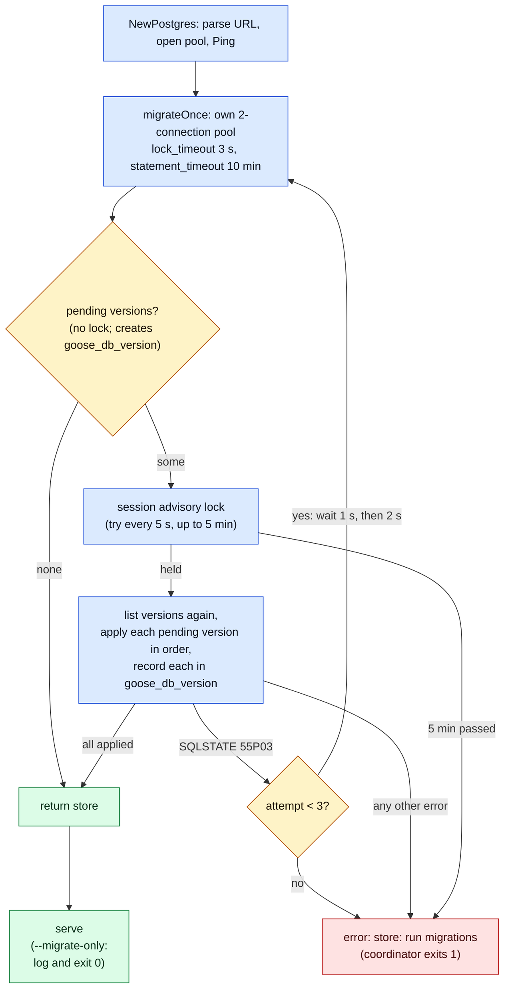
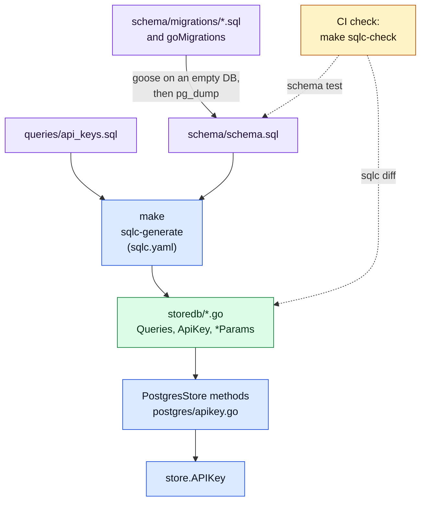

# Schema lifecycle

> Last updated: 2026-10-04

Explanation of how the coordinator's Postgres schema changes: numbered goose
migrations that run inside `NewPostgres` before the coordinator serves, the
locks and timeouts around them, the checked-in schema file that tests compare
against, and the sqlc code generated from that file. Read this before you add a migration
([how-to](../developer/database-migrations.md)) or apply one in production
([runbook](../operations/schema-migration.md)). What the tables hold is in
[storage](storage.md).

## Context

Before goose, `(*PostgresStore).migrate` ran 255 DDL statements on every boot.
Each statement ran on its own, with no `lock_timeout`, so an `ALTER TABLE`
that waited behind a long query blocked every later query on that table
(the 2026-07-03 outage). Nothing stopped two coordinators from running the
same DDL at once, and repair `UPDATE`s ran again at every start.

Goose ([`github.com/pressly/goose/v3`](https://github.com/pressly/goose))
replaces that loop. Each schema change is a numbered version. Goose applies a
version once, records it in `goose_db_version`, and skips it on every later
boot. The 255 statements are version 1, unchanged and in the same order
(`coordinator/store/postgres/schema/migrations/00001_baseline.sql`).

## Mechanism

### Startup path

`NewPostgres` (`coordinator/store/postgres/postgres.go`) opens the serving pool, pings
it, and calls `migrate` (`coordinator/store/postgres/migrations.go`). It
returns the store only after every pending version has applied.
`coordinator --migrate-only` (`coordinator/internal/command/coordinator/maintenance.go`,
`Maintenance`) calls the same `NewPostgres` with a 15-minute context
and exits; it seeds no admin key and starts no listener or worker.

Legend: blue = step, amber = decision, green = success, red = exit 1.

### Versions

| Version | Source | What it does |
|---|---|---|
| 1 | `coordinator/store/postgres/schema/migrations/00001_baseline.sql` | The 255 statements of the pre-goose boot, in the same order, as one `-- +goose NO TRANSACTION` file. On a schema that a pre-goose coordinator built, every statement is a no-op. |
| 2 | `checkRetiredBackfills` (`coordinator/store/postgres/retired_backfills.go`) | Guards the retired one-shot backfills; see [Version 2](#version-2-the-retired-backfill-guard). |
| 3 | `ensureProviderRestoreIndexes` (`coordinator/store/postgres/startup.go`) | Builds `idx_providers_restore_serial` and `idx_providers_restore_se_key` `CONCURRENTLY` through `ensureConcurrentIndex`. |
| 4 | `ensureProviderEarningsJobIndex` (`coordinator/store/postgres/provider_earnings_index.go`) | Drops an invalid leftover with a plain `DROP INDEX`, fails on duplicate non-empty `job_id`s, then builds the unique `idx_provider_earnings_job` `CONCURRENTLY`. |
| 5 | `ensureProviderEarningsWindowIndex` (`coordinator/store/postgres/earnings_window_index.go`) | Builds the BRIN `idx_provider_earnings_created_at_brin` through `ensureConcurrentIndex` and sets `autovacuum_analyze_scale_factor` to `0.005`. |

Versions 2 to 5 are Go migrations, listed in `goMigrations`. They are the
startup steps that ran after the old DDL loop, with their code unchanged.
Goose reads SQL files from the embedded `migrationFiles` and refuses two
sources with the same version (`found duplicate migration version`) and an
unapplied version below the highest applied one
(`missing (out-of-order) migration`).

### Migration kinds

| Kind | How goose runs it | Why it exists | Example |
|---|---|---|---|
| SQL file (default) | All statements and the `goose_db_version` insert in one transaction, on the connection that holds the advisory lock | A change that must apply completely or not at all | None yet; template in the [how-to](../developer/database-migrations.md) |
| SQL file with `-- +goose NO TRANSACTION` | Each statement (or each `StatementBegin`/`StatementEnd` block) commits on its own; the version is recorded after the last one | A statement that cannot run in a transaction (`DROP INDEX CONCURRENTLY`), or a file whose locks must be held one at a time | Version 1 |
| Go migration (`goose.NewGoMigration` with `RunDB`) | Goose calls the function, then records the version on the second migration connection; no transaction | A step that must read the database before it acts, or check its result | Versions 2 and 4 |
| Concurrent index (Go migration through `ensureConcurrentIndex`) | Checks `pg_index`, builds the index with one simple-protocol statement, then checks that it is valid | `CREATE INDEX CONCURRENTLY` cannot run in a transaction, and a failed build leaves an invalid index that `IF NOT EXISTS` would hide | Versions 3 and 5 |

An SQL file must not contain `CREATE INDEX CONCURRENTLY`
(`TestSQLMigrationsDoNotBuildIndexesConcurrently` in
`coordinator/tests/store/postgres/migrations_test.go`). A build that fails, for
example on `lock_timeout`, leaves an invalid index; on the next attempt
`IF NOT EXISTS` skips it and goose records the version with a broken index.
`ensureConcurrentIndex` returns at once for a valid index, refuses an invalid
one by name (`index ... is invalid; repair the interrupted concurrent index
build before retrying`), and fails unless the new index is valid and ready.

### Locks and timeouts

| Control | Value | Where | Effect |
|---|---|---|---|
| Migration pool | `MaxConns = 2`, `MinConns = 0` | `migrateOnce` | One connection holds the advisory lock and runs SQL migrations; goose records Go migration versions on the other. The serving pool is not used for SQL migrations. |
| `lock_timeout` | `migrationLockTimeout = 3 * time.Second` | `migrateOnce` | A DDL statement that waits for a table lock fails with SQLSTATE `55P03` (`lockNotAvailable`) instead of queueing every later query behind it. |
| `statement_timeout` | `migrationStatementTimeout = 10 * time.Minute` | `migrateOnce` | Upper bound for one statement in the migration session. |
| URL override | a `lock_timeout` or `statement_timeout` parameter in `EIGENINFERENCE_DATABASE_URL` | `migrateOnce` | The URL value wins over both defaults. |
| Retries | `migrationAttempts = 3`; pauses of 1 s and 2 s | `migrate`, `isLockTimeout` | Only a lock timeout is retried. Each attempt opens a new migration pool and starts again from the pending check. |
| Advisory lock | session lock `4097083626` (goose `lock.DefaultLockID`), `pg_try_advisory_lock` every 5 s, 60 retries | `lock.NewPostgresSessionLocker` in `newMigrationProvider` | Two coordinators that start together take turns. The second one gives up after 5 min with `failed to acquire lock`. |
| Go migrations | no session timeouts unless the URL sets them | `goMigrations` run on the store pool | Keeps the pre-goose behaviour of versions 2 to 5: a `CREATE INDEX CONCURRENTLY` that times out leaves an invalid index. |
| `--migrate-only` | `context.WithTimeout(..., 15*time.Minute)` | `Maintenance` | The whole run stops after 15 min. The serving path has no such deadline. |

`CREATE INDEX CONCURRENTLY` blocks no reads or writes, but it waits for every
transaction that holds an older snapshot. On a busy database it can wait for a
long time; see the [runbook](../operations/schema-migration.md#3-check-for-long-running-queries)
for the pre-check.

### Version 2: the retired-backfill guard

The one-shot backfills that derived `earnings_summary`, `usage_totals` and
`balances.withdrawable_micro_usd` from history (markers
`backfill_earnings_summary_v1`, `backfill_usage_totals_v1`,
`backfill_withdrawable_balance_v1`) ran in production and are retired after
v0.9.10. The baseline creates `balances` with `withdrawable_micro_usd`.
`checkRetiredBackfills` then guards the first goose boot of a database:

- it fails if `balances.withdrawable_micro_usd` is missing;
- it records each marker whose source table (`balances`, `usage`,
  `provider_earnings`) is empty, because with no history the current schema is
  already exact, and v0.9.10 recorded the same markers on an empty database;
- it seeds the single `usage_totals` row only while `usage` is empty;
- it fails if a source table holds rows but its marker is missing, or if the
  `usage_totals` row is missing.

A failed boot writes no marker and no counter for the data it refused, so the
remedy in the error (boot a coordinator built from v0.9.10 once, then this
build) still runs the real backfill. Databases that ran the backfills keep
their markers and their now-unused scratch tables
(`earnings_summary_backfill_pending`, `usage_totals_backfill_state`).

The Solana-era cleanups are retired the same way: the wallet-keyed price
delete (marker `cleanup_wallet_model_prices_v1`) and the one-time column drops
`billing_sessions.chain`, `users.solana_wallet_address`,
`users.solana_wallet_id` and `releases.image_bridge_hash`.

### Work that now runs once

Each version runs once, so its work does not repeat on later boots. The repair
statements in the baseline (the `api_keys.id` backfill, the `model_registry`
capability fix for `EigenLabs/Qwen3.8-27B-4bit`, the two `provider_trust_reuse`
backfills, and the `model_aliases.desired_build` and
`global_payout_withdrawals.expires_at` backfills) and versions 2 to 5 ran at
every start before goose. The current writers write the repaired form, so one
run is enough. A migration cannot repair rows that a writer keeps producing;
fix the writer.

### The checked-in schema

`coordinator/store/postgres/schema/schema.sql` is the `pg_dump --schema-only
--no-owner --no-privileges` of the schema that the migrations build, without
`goose_db_version`. `TestMigrationsBuildCheckedInSchema` builds a fresh
database with goose and fails when its catalog differs from a database loaded
from that file. `TestMigrationsLeaveLegacyDatabaseUnchanged` loads
`schema.sql` with the marker rows that a pre-goose boot leaves and checks that
versions 1 to 5 change no object and no row. The
[how-to](../developer/database-migrations.md) regenerates the file.

### Generated queries (sqlc)

The api_keys queries of `PostgresStore` are SQL in
`coordinator/store/postgres/queries/api_keys.sql`. [sqlc](https://sqlc.dev) v1.31.1
reads that file and `schema.sql` and writes typed Go into
`coordinator/store/postgres/storedb/` (`coordinator/store/postgres/sqlc.yaml`). The store
methods in `coordinator/store/postgres/apikey.go` call the generated
`storedb.Queries` and convert each row to the public store type.

Legend: purple = checked-in source, blue = step or hand-written code,
green = generated code, amber = CI check.

| Part | What it does | Where |
|---|---|---|
| Schema input | `schema: schema/schema.sql`. sqlc reads the dump, not the migrations: the baseline adds many columns inside `DO` blocks, which sqlc cannot see, so a query on such a column fails with `column "..." does not exist`. | `coordinator/store/postgres/sqlc.yaml` |
| Code generation | `sql_package: pgx/v5`, `emit_pointers_for_null_types: true`, `omit_unused_structs: true`, and `timestamptz` overrides to `time.Time` and `*time.Time` ([type mapping](../reference/sqlc-type-mapping.md)) | `coordinator/store/postgres/sqlc.yaml` |
| Database handle | `storedb.New(db DBTX)` takes the pool or a `pgx.Tx`; `PostgresStore.queries()` wraps the pool, and `RotateAPIKey` uses `storedb.New(tx)` | `coordinator/store/postgres/storedb/db.go`, `coordinator/store/postgres/apikey.go` |
| Row conversion | `apiKeyFromRow` maps `storedb.ApiKey` to `APIKey`; `insertAPIKeyParams` maps back | `coordinator/store/postgres/apikey.go` |
| Tool pin | `go run github.com/sqlc-dev/sqlc/cmd/sqlc@v1.31.1`: sqlc v1.31.1 needs Go 1.26, newer than `go.mod`, so it is not a `go.mod` tool | `Makefile` (`SQLC`) |
| CI check | `make sqlc-check` runs `TestMigrationsBuildCheckedInSchema`, then `sqlc diff`; the Coordinator Tests job runs it against its Postgres service | `Makefile`, `.github/workflows/ci.yml` |

`SELECT *` in a query is expanded to the column list when the code is
generated. A running binary therefore selects only the columns it was built
with, and a new column does not break it. `MemoryStore` and `CachedStore` do
not use sqlc. Adding a query is [Write store queries with sqlc](../developer/sqlc.md).

### Tables and files that are not goose versions

`schema_migrations` is an older table. It holds the markers of the one-shot
data migrations inside the baseline and of the retired backfills, not goose
versions. Two SQL files under `coordinator/store/postgres/migrations/` are applied by
hand with `psql`, never at boot: `dedupe_provider_earnings.sql` (an offline
cleanup that once held a relation lock for about 15 minutes on the production
table) and `request_waterfall.sql` (an analysis view, kept off the boot path
so a `CREATE VIEW` cannot queue behind a long query's lock).
`coordinator/deploy/start.sh` does not touch the database.

### Logs

Logs carry bounded labels only, never SQL or parameters
(`logStartupMigration` in `coordinator/store/postgres/startup.go`).

| Message | Fields | When |
|---|---|---|
| `postgres startup phase` | `phase` (`connect` or an index name), `result`, `duration_ms` | After the ping, and after each index build in versions 3 and 5 |
| `postgres migration hit lock_timeout; retrying` (warn) | `attempt` | Before attempt 2 and 3 |
| `postgres migration` | `version`, `result` (`applied` or `failed`), `duration_ms` | One line per version that goose ran, written after the attempt ends; none when nothing was pending |
| `coordinator migrations complete` | `duration_ms` | `--migrate-only` succeeded |
| `coordinator maintenance command failed` (error) | `error` | `--migrate-only` failed |
| `failed to connect to PostgreSQL` (error) | `error` | The serving path failed in `NewPostgres`, including a failed migration |

## Invariants

1. **The coordinator serves only after every pending version applied.**
   `NewPostgres` returns an error, and `openStore` exits 1, when `migrate` fails
   (`coordinator/store/postgres/postgres.go`, `coordinator/app/store.go`).
2. **A version applies once.** Goose records it after it succeeds, under the
   session advisory lock, and lists versions again after it takes the lock
   (`newMigrationProvider` in `coordinator/store/postgres/migrations.go`).
   `TestConcurrentMigrationsApplyOnce` runs two migrations at once.
3. **A failed version is not recorded.** A transactional SQL file rolls back
   with its version row. A `NO TRANSACTION` file or a Go migration records
   the version only after its last statement succeeds.
4. **A migration statement does not wait more than 3 s for a table lock**
   unless the database URL sets a longer `lock_timeout`
   (`migrationLockTimeout`). `TestMigrateRetriesLockTimeout` holds a lock and
   checks the retry.
5. **Migrations build exactly `schema.sql`** on a fresh database
   (`TestMigrationsBuildCheckedInSchema`).
6. **The generated queries match `schema.sql` and the query files.**
   `make sqlc-check` fails CI when `coordinator/store/postgres/storedb` is stale
   (`Makefile`, `.github/workflows/ci.yml`).
7. **There are no down migrations.** No migration file has a
   `-- +goose Down` section. A rollback starts an older image on the migrated
   schema; it never reverts the schema.
8. **An older goose image applies nothing on a newer database.** Every version
   it knows is recorded, and goose ignores recorded versions it does not
   know. A pre-goose image ignores `goose_db_version` and replays its own boot
   DDL.

## Failure modes

| Symptom | Cause | What happens / where to look |
|---|---|---|
| Exit 1 with `partial migration error (type:sql,version:N): ERROR: canceling statement due to lock timeout (SQLSTATE 55P03)` after three `postgres migration hit lock_timeout; retrying` lines | A long query held a lock that version N needed, through all three attempts | Nothing was recorded for version N; a transactional file rolled back. `pg_stat_activity` for the blocker; [runbook](../operations/schema-migration.md#lock-timeout). |
| Exit 1 with `failed to initialize: failed to acquire lock` after 5 min | Another process held the goose advisory lock for the whole lock wait | The holder in `pg_locks` (`objid = 4097083626`); [runbook](../operations/schema-migration.md#a-second-coordinator-waits-on-the-lock). |
| A `NO TRANSACTION` file failed after some statements | Its earlier statements committed; the version is not recorded | The next run executes the whole file again, so every statement in such a file must be safe to run twice (`IF NOT EXISTS`, `IF EXISTS`). |
| Exit 1 with `index ... is invalid; repair the interrupted concurrent index build before retrying` | A `CONCURRENTLY` build in version 3 or 5 was interrupted | `ensureConcurrentIndex` does not repair it; [runbook](../operations/schema-migration.md#invalid-index). |
| Exit 1 with `found duplicate migration version` | Two sources share a number | Renumber one. |
| CI fails in `make sqlc-check` | `schema.sql` or `coordinator/store/postgres/storedb` is stale | [sqlc troubleshooting](../developer/sqlc.md#troubleshooting). |
| Exit 1 with `missing (out-of-order) migration` | A version below the highest applied one was never applied, for example after two branches added migrations | `SELECT version_id FROM goose_db_version ORDER BY id`; renumber the unapplied version above the highest one. |
| Exit 1 with `database holds data that retired backfills never processed` or `balances.withdrawable_micro_usd is missing` | The database has history but never ran a backfill retired after v0.9.10 | Boot a v0.9.10 coordinator against it once, then redeploy (`checkRetiredBackfills`). |
| Exit 1 with a `provider_earnings` duplicate `job_id` message | Rows share a non-empty `job_id`, so version 4 cannot build its unique index | Run `coordinator/store/postgres/migrations/dedupe_provider_earnings.sql` offline, then redeploy. |
| A dropped column comes back, or a `SET NOT NULL` is undone, after a rollback | The rollback image was built before goose and replayed its boot DDL (`ADD COLUMN IF NOT EXISTS`; `DROP NOT NULL` on `fleet_snapshots.free_for_load_gb`) | Do not ship a destructive migration while a pre-goose image can be a fallback; see [expand and contract](../developer/database-migrations.md#change-a-column-in-two-releases-expand-and-contract). |
| A column or index that `schema.sql` has is missing in production after the first goose deploy | One of the baseline's `DO ... EXCEPTION WHEN others` blocks swallowed an error (for example a lock timeout), and goose still recorded version 1 | The `pg_dump` diff in the [first cut-over checklist](../operations/schema-migration.md#first-production-cut-over-to-goose). |

## Code map

| Concern | Location |
|---|---|
| Migration runner, timeouts, retries, Go migration list | `coordinator/store/postgres/migrations.go` (`migrate`, `migrateOnce`, `newMigrationProvider`, `goMigrations`) |
| SQL migrations | `coordinator/store/postgres/schema/migrations/` |
| Checked-in schema | `coordinator/store/postgres/schema/schema.sql` |
| Concurrent index helper and startup log line | `coordinator/store/postgres/startup.go` (`ensureConcurrentIndex`, `logStartupMigration`) |
| Go migration bodies | `coordinator/store/postgres/retired_backfills.go`, `coordinator/store/postgres/provider_earnings_index.go` (`ensureProviderEarningsJobIndex`), `coordinator/store/postgres/earnings_window_index.go` |
| Database-only command | `coordinator/internal/command/coordinator/maintenance.go` (`Maintenance`) |
| sqlc config, queries, generated code | `coordinator/store/postgres/sqlc.yaml`, `coordinator/store/postgres/queries/`, `coordinator/store/postgres/storedb/` |
| api_keys store methods | `coordinator/store/postgres/apikey.go` (`queries`, `apiKeyFromRow`, `insertAPIKeyParams`) |
| sqlc targets | `Makefile` (`sqlc-generate`, `sqlc-check`) |
| Tests | `coordinator/tests/store/postgres/migrations_test.go`, `coordinator/tests/store/postgres/migration_harness_test.go` |
| Manual SQL | `coordinator/store/postgres/migrations/` |

## Related

- [Add a database migration](../developer/database-migrations.md) — the steps
- [Apply schema migrations in production](../operations/schema-migration.md) — backup, checks, rollback
- [Write store queries with sqlc](../developer/sqlc.md) and [sqlc type mapping](../reference/sqlc-type-mapping.md)
- [Storage](storage.md) — what the tables hold and which backend runs
- [Deploy the coordinator](../operations/coordinator-deploy.md) — the container swap that runs the migrations
