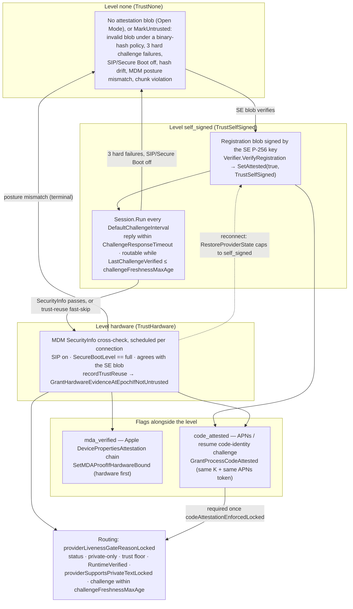

# Provider attestation

> Last updated: 2026-09-16 · commit `35c6a0f5b`

How the coordinator decides how far to trust a provider connection: three
trust levels (`none`, `self_signed`, `hardware`), two flags carried alongside
the level (`mda_verified`, `code_attested`), the five-minute challenge that
keeps the verdict fresh, and the single routing gate that consumes all of it.

[App Attest shadow observations](../../reference/app-attest-shadow.md) run alongside this mechanism. A [prospective App Attest authorization policy](../../reference/app-attest-shadow.md#prospective-authorization) records connection-bound freshness, revocation, build and receipt requirements for a later migration. Protocol 3 binds app-measured static hardware to the signed transcript and compares it with registration. These observations grant and remove no trust; the existing APNs/MDM gates described here remain authoritative.

## Context

Providers are adversarial until proven otherwise ([`../../threat-model.yaml`](../../threat-model.yaml),
`ADV-001`). A provider's self-report is worthless on its own — the reporter is
the thing being judged — so every claim that matters is either signed by a key
the provider cannot extract (the Secure Enclave P-256 key), corroborated by
Apple's MDM subsystem (SecurityInfo), or proven by a channel only genuine code
can use (APNs). The result feeds one routing decision: the public floor is
`Registry.MinTrustLevel` (`EIGENINFERENCE_MIN_TRUST`, default under
[configuration](../../reference/configuration.md#routing-admission-and-ttft); `coordinator/registry/config.go`).

## Mechanism

### Trust levels

`TrustLevel` is a closed enum (`coordinator/registry/provider.go`); `trustRank`
(`coordinator/registry/provider_trust.go`)
orders it `hardware` = 2, `self_signed` = 1, `none` = 0, anything else = −1.

| Level | Granted when | Lost when | Code |
|---|---|---|---|
| `none` | Default for a new `Provider`; a registration without an attestation blob stays connected at `none` when no binary-hash policy is configured (Open Mode) | — | `coordinator/providercontrol/verification/registration.go` (`Verifier.VerifyRegistration`) |
| `none` + status `untrusted` | Missing, unparseable, or invalid blob **while a binary-hash policy is configured**; any `MarkUntrusted` | Hard untrust is terminal for the connection; `MarkUntrustedTransient` (missed challenges) recovers on the next passing challenge | `coordinator/registry/provider_trust.go` (`MarkUntrusted`, `MarkUntrustedTransient`); `coordinator/registry/provider_challenges.go` (`RecordChallengeSuccess`) |
| `self_signed` | The SE-signed registration blob verifies and passes the checks in [Layer 1](#layer-1--secure-enclave-registration-blob); `SetAttested(true, TrustSelfSigned)` and `LastChallengeVerified = now` establish registration freshness; runtime, challenge and other routing gates still apply | Challenge failure accounting, or any hard untrust | `coordinator/providercontrol/verification/registration.go` (`Verifier.VerifyRegistration`); `coordinator/registry/provider_attestation.go` (`SetAttested`) |
| `hardware` | An MDM `SecurityInfo` response for this connection reports SIP enabled and `SecureBootLevel == "full"`, and both agree with the SE blob — the **only** grant path; or the trust-reuse fast-skip re-applies recent device evidence after a fresh signed challenge | Never restored from the store on reconnect (capped to `self_signed`); posture mismatch → `MarkUntrusted` | `coordinator/providercontrol/verification/security_info.go` (`Verifier.VerifySecurityInfo`); `coordinator/providercontrol/trustreuse/grant.go` (`RecordVerified`); `coordinator/providercontrol/trustreuse/reuse.go` (`TryReuse`); `coordinator/registry/provider_restore.go` (`RestoreProviderState`) |

Two booleans travel with the level and never change it:

| Flag | Meaning | Set by | Cleared by |
|---|---|---|---|
| `MDAVerified` (`mda_verified`) | An Apple `DevicePropertiesAttestation` chain verified to the pinned Apple Enterprise Attestation Root CA and bound to this connection's SE key or serial | `coordinator/registry/device_evidence.go` (`SetMDAProofIfHardwareBound`) — requires `TrustLevel == hardware` first | `RestoreProviderState` on every reconnect; re-earned or re-bound live |
| `CodeAttested` / `FreshCodeAttested` (`code_attested`) | The live process proved it holds the registered X25519 key `K` and the SE key by answering a code-identity challenge | `coordinator/registry/code_evidence.go` (`GrantProcessCodeAttested`) | APNs token rotation, hard untrust, `SetCodeAttested(false)` |

### Layer 1 — Secure Enclave registration blob

The provider signs an `AttestationBlob` with a P-256 key held in the Secure
Enclave and sends it in `register.attestation`
(`provider-swift/Sources/ProviderCore/Security/AttestationBuilder.swift`). The
key is persistent and keychain-backed with an ephemeral fallback — see
[`identity-binding.md`](./identity-binding.md).

Signed fields (`coordinator/attestation/attestation.go`, `AttestationBlob`;
alphabetical, matching Swift `.sortedKeys`): `authenticatedRootEnabled`,
`binaryHash`?, `chipFamily`?, `chipName`, `encryptionPublicKey`?,
`hardwareModel`, `hypervisorActive`? (legacy, decoded only so pre-v0.6.31
signatures still verify), `metallibHash`?, `osVersion`, `publicKey` (65-byte
uncompressed P-256, base64), `rdmaDisabled`, `runtimeCapabilities`?,
`secureBootEnabled`, `secureEnclaveAvailable`, `serialNumber`?, `sipEnabled`,
`systemVolumeHash`?, `timestamp` (RFC 3339). The envelope is
`{attestation, signature}` (`SignedAttestation`); the signature is DER ECDSA
over SHA-256 of the exact `attestation` bytes as sent (`AttestationRaw`), with
`marshalSortedJSON` as the fallback when raw bytes are absent.

| Check (in order) | Outcome on failure | Code |
|---|---|---|
| Blob present | Open Mode: stay `none`, connected. Policy configured: `MarkUntrusted` | `coordinator/providercontrol/verification/registration.go` (`Verifier.VerifyRegistration`) |
| Signature verifies; `secureEnclaveAvailable`, `sipEnabled`, `secureBootEnabled` all true (`rdmaDisabled`, `authenticatedRootEnabled` recorded only) | `Valid = false`; `MarkUntrusted` only under a binary-hash policy | `coordinator/attestation/attestation.go` (`Verify`, `VerifyJSON`, `ParseP256PublicKey`) |
| Freshness, providers ≥ `minProviderVersionForReconnectAttestation` ([version gating](../../reference/api-contracts.md#version-gating)): `timestamp` within ±`RegistrationAttestationMaxAge` = 2m of coordinator time | `MarkUntrusted` ("attestation replay rejected"). Older providers keep their blob but `ChipFamily`, `RuntimeCapabilities`, `MetallibHash` are stripped | `coordinator/providercontrol/verification/registration.go` (`Verifier.VerifyRegistration`); `coordinator/attestation/attestation.go` (`CheckTimestamp`) |
| Key binding: `register.public_key` == blob `encryptionPublicKey` | Invalid; `MarkUntrusted` only under a policy | `coordinator/providercontrol/verification/registration.go` (`Verifier.VerifyRegistration`) |
| Binary hash, only when `binaryHashEnforce && policyConfigured`: `binaryHash` present and in the known-good set | `MarkUntrusted`. Otherwise the hash is drift telemetry (v0.6.0: code identity replaced it as the control) | `coordinator/providercontrol/verification/registration.go` (`Verifier.VerifyRegistration`); `coordinator/api/release_policy.go` (`binaryHashPolicySnapshot`) |
| Success | `SetAttested(true, TrustSelfSigned)`; `trust_status{self_signed, online, "SE attestation verified, awaiting MDM verification"}`; `LastChallengeVerified = now` | `coordinator/providercontrol/verification/registration.go` (`Verifier.VerifyRegistration`); `coordinator/api/provider.go` (`sendTrustStatus`) |

The provider's `secureBootEnabled` self-report is a historical proxy:
`checkSecureBootEnabled` delegates to `checkAuthenticatedRootEnabled`
(`csrutil authenticated-root status`, `diskutil` fallback) and is "not presented
as a local Secure Boot verdict" (`provider-swift/Sources/ProviderCore/Security/SecurityHardening.swift`).
The coordinator's Secure Boot signal is MDM `SecurityInfo.SecureBootLevel`
(Layer 3).

### Registration and device-verification ownership

`coordinator/providercontrol/verification/` (`Verifier`) owns registration
signature/freshness/key checks, reconnect recovery and the two device evidence
legs. `registration.go` (`VerifyRegistration`) performs identity-scoped recovery
through `restore.go` (`Restore`) before duplicate eviction and persistence.
`mda_stage.go` (`StageMDA`) stages a durable chain; `mda_reuse.go`
(`AttachCachedMDA`) re-verifies it before attachment.

`security_info.go` (`VerifySecurityInfo`) classifies a received report and calls
the existing trust-reuse grant boundary. `mda.go` (`VerifyMDA`) preserves the
nonce/SE-key and serial checks before publishing a proof. Cached reuse requires
the SE-key digest; a fresh request with a known SE key also rejects a missing or
mismatching digest before the registry's attachment check.

`coordinator/api/provider_verification.go` (`newProviderVerifier`) supplies
current registry, store, MDM, scheduler, logger and policy dependencies. The
verifier starts no workers and owns no provider inventory. Registration and
capability publication belong to `coordinator/providercontrol/session/registration.go`
(`register`); scheduler claims,
generations and late-command authorization belong to
`coordinator/providercontrol/mdmscheduler/` (`Scheduler`).
`verification.NewScheduledAttempt` places the same `*Attempt` in the context
and returns it to the scheduler. Synchronous transport callbacks fill that
record and publish exact command ownership before command visibility; the
scheduler reads `UDID` and `MDAOutcome` after the verification call returns.

### Layer 2 — periodic challenge

`coordinator/providercontrol/challenge/` owns this layer. `Session` keeps a private
pending-nonce tracker for one provider connection; `Run` issues initial, periodic
and requested challenges, and `Deliver` removes a matching nonce before handing
the reply to its waiter. Timeout and cancellation also remove the pending entry.
`coordinator/providercontrol/session/read.go` (`Session.Run`) creates the challenge
session; `coordinator/providercontrol/session/registration.go` (`register`) starts
its loop after registration. Connection teardown cancels its context before
clearing scheduler and coverage state; see the [connection lifecycle](../components/coordinator.md#provider-connection-lifecycle).

`Verifier.VerifyResponse` applies signature, posture, binary and model checks in
order, followed by the current runtime/version policy and existing trust
transitions. `coordinator/api/provider_challenge.go` supplies current registry,
logger, counters, policy and verification-scheduler dependencies. The challenge
owner does not start another MDM verification job.

| Fact | Value | Code |
|---|---|---|
| Cadence | `DefaultChallengeInterval` aliases `challenge.DefaultInterval = 5 * time.Minute` (`ServerConfig.ChallengeInterval`); the loop starts after `register` succeeds | `coordinator/providercontrol/challenge/config.go`; `coordinator/providercontrol/challenge/loop.go` (`Session.Run`); API alias in `coordinator/api/provider.go` |
| Challenge | `attestation_challenge{nonce, timestamp}`; nonce = 32 random bytes, base64; timestamp UTC RFC 3339; pending nonces belong only to the issuing connection | `coordinator/providercontrol/challenge/transport.go` (`sendChallenge`, `generateNonce`, `Session.Deliver`); `session.go` (`Session`) |
| Reply timeout | `ChallengeResponseTimeout` aliases `challenge.ResponseTimeout` = 30s → transient failure | `coordinator/providercontrol/challenge/transport.go` (`sendChallenge`); `failure.go` (`Verifier.TransientFailure`); API alias in `coordinator/api/provider.go` |
| Reply | `attestation_response{nonce, signature, status_signature?, public_key, sip_enabled?, secure_boot_enabled?, rdma_disabled?, binary_hash?, active_model_hash?, python_hash?, runtime_hash?, template_hashes?, model_hashes?, hypervisor_active?}` | `coordinator/protocol/attestation.go` (`AttestationResponseMessage`) |
| Signature | ECDSA P-256 over SHA-256(`nonce + timestamp`, plain concatenation) with the SE key from the registration blob — never a key in the reply | `coordinator/providercontrol/challenge/signature.go` (`verifySignatures`); `coordinator/attestation/attestation.go` (`VerifyChallengeSignature`) |
| Status signature | ECDSA over the canonical status JSON; when present and valid, `statusFieldsTrusted = true`. Canonical = sorted-key compact JSON without HTML escaping; absent fields are omitted, never `false`. Keys: `active_model_hash`?, `binary_hash`?, `grpc_binary_hash`?, `hypervisor_active`? (legacy — emitted only when the provider sent it, so pre-v0.6.31 signatures still verify; never used for a decision), `model_hashes`?, `nonce`, `python_hash`?, `rdma_disabled`?, `runtime_hash`?, `secure_boot_enabled`?, `sip_enabled`?, `template_hashes`?, `timestamp` | `coordinator/attestation/attestation.go` (`StatusCanonicalInput`, `BuildStatusCanonical`, `VerifyStatusSignature`) |
| Checks after the signatures | Require reported SIP on and RDMA status; an explicitly disabled Secure Boot fails. The configured binary-hash policy is enforced only with its enforcement flag; model hashes are checked against their own catalog entries. Runtime mismatch and a version below the configured floor exclude routing without hard-untrust; live capability reconciliation failure marks untrusted | `coordinator/providercontrol/challenge/posture.go` (`verifyPosture`); `integrity.go` (`verifyBinaryHash`, `verifyModelHashes`); `verify.go` (`VerifyResponse`) |
| Success | `ChallengeVerifiedSIP = sip_enabled`; `UpdateModelWeightHashes`; `RecordChallengeSuccess` (clears a transient untrust and drains queued requests); then `TryReuse` may re-grant `hardware` from durable device evidence | `coordinator/providercontrol/challenge/verify.go` (`VerifyResponse`); `coordinator/providercontrol/trustreuse/reuse.go` (`TryReuse`) |
| Failure accounting | `RecordChallengeFailure(providerID, transient)`; `transient` = reason `timeout` / `no response`. A hard failure clears `LastChallengeVerified` and `ChallengeVerifiedSIP` at once (unroutable immediately); at `MaxFailedChallenges` = 3 consecutive failures the provider is `MarkUntrusted` (hard) or `MarkUntrustedTransient` (transient); at `MaxConsecutiveChallengeTimeoutsBeforeReconnect` = 6 transient timeouts the WebSocket is closed with `StatusPolicyViolation` to force a clean re-registration | `coordinator/providercontrol/challenge/failure.go` (`RecordFailure`, `TransientFailure`); `coordinator/registry/provider_challenges.go` (`RecordChallengeFailure`); `coordinator/registry/provider.go` (`MaxFailedChallenges`) |
| Freshness for routing | `now − LastChallengeVerified ≤ challengeFreshnessMaxAge` ([routing](../routing.md#challenge-freshness)), else the scheduler skips the provider (`GateChallengeStale`) | `coordinator/registry/routing_constants.go` (`challengeFreshnessMaxAge`); `coordinator/registry/routing_eligibility.go` (`providerLivenessGateReasonLocked`) |
| Stop | `ChallengeShouldStop` when hard-untrusted or gone | `coordinator/registry/provider_challenges.go` (`ChallengeShouldStop`) |

`provider-swift/Sources/ProviderCore/Security/AttestationBuilder.swift`
(`StatusCanonical.build`) encodes a typed payload with `JSONEncoder.sortedKeys`,
including keys inside `model_hashes` and `template_hashes`. The resulting UTF-8
key order matches `BuildStatusCanonical`; Unicode U+2028 and U+2029 are escaped
as `\u2028` and `\u2029` to match Go's JSON encoder. Literal backslash escape
text remains distinct. Nil optional fields, empty hash strings and empty maps
are omitted; explicit `false` values remain signed. Matching Swift and Go
golden vectors cover these byte rules; signature verification still rejects
changed fields (`provider-swift/Tests/ProviderCoreTests/Security/StatusCanonicalTests.swift`,
`statusCanonicalMatchesCoordinatorNestedMapVectors`;
`coordinator/attestation/status_canonical_mixed_case_test.go`,
`TestBuildStatusCanonicalNestedMapVectors`, `TestVerifyStatusSignatureBindsMixedCaseNestedMaps`).

### Runtime manifest

`releasepolicy.Manager` owns the active release
inventory, binary allowlist and runtime manifest. Its `Snapshot` keeps decision
state private and immutable; the API supplies current store, fleet, logger and
version-floor dependencies (`coordinator/providercontrol/releasepolicy/manager.go`,
`snapshot.go`; `coordinator/api/release_policy.go`, `releasePolicyDependencies`).

The coordinator-owned policy on which runtime a connected provider may run,
independent of the trust level: a provider that fails it stays connected and
keeps its level but is excluded from routing until a later check passes.

| Fact | Value | Code |
|---|---|---|
| Source | `SyncRuntimeManifest` rebuilds the manifest from the release inventory at boot, after every `POST /v1/releases` and after every `DELETE /v1/admin/releases`. It is the **union** of every **active** release row's `python_hash`, `runtime_hash`, `template_hashes` (`name=hash,…`) and `metallib_hash` (filed under the template name `mlx_metallib`): one accepted set per template name, values trimmed and lower-cased. Registering a release can only add accepted values; deactivating one removes exactly that release's values | `coordinator/providercontrol/releasepolicy/runtime_sync.go` (`SyncRuntimeManifest`); `coordinator/providercontrol/releasepolicy/runtime_manifest.go` (`RuntimeManifest`, `AddTemplateHash`); `coordinator/api/releases/registration.go` (`Controller.Register`), `coordinator/api/releases/deactivation.go` (`Controller.Delete`) |
| Never single-valued | Releases overlap for the whole provider self-update window ([auto-update cadence](../../provider/cli-reference.md#runtime-constants)), so every template name must accept every active release's value. Until `ac60c5ada` (#816) the manifest kept one value per name: on 2026-09-03 registering v0.8.16 replaced the v0.8.15 `mlx_metallib` hash and ~1,180 providers still on v0.8.15 were excluded from routing at their next challenge until they self-updated (~30–40 min). Pinned by `coordinator/api/runtime_manifest_union_test.go` | `coordinator/providercontrol/releasepolicy/runtime_manifest.go` (`RuntimeManifest`) |
| Degenerate inventories | Releases exist but none carry hashes → manifest cleared (`nil`, policy withdrawn); zero releases → the existing manifest is kept; inventory read error → the existing manifest is kept and, after a registration or deactivation, the committed mutation is folded in until the next successful sync | `coordinator/providercontrol/releasepolicy/runtime_sync.go` (`SyncRuntimeManifest`); `coordinator/providercontrol/releasepolicy/runtime_convergence.go` (`ConvergeCommittedRuntimeRelease`, `ConvergeCommittedRuntimeDeactivation`) |
| Check | At registration and on every challenge reply, scoped to `mlx_metallib`: the backend must be `mlx-swift` and the reported `template_hashes["mlx_metallib"]` must be one of the accepted values; `python_hash`, `runtime_hash` and other template names are not compared | `coordinator/providercontrol/releasepolicy/runtime_verify.go` (`VerifyRuntimeHashesForBackend`, `VerifyRuntimeHashesAgainstManifest`, `templateHashAccepted`); `coordinator/providercontrol/session/registration.go` (`register`); `coordinator/providercontrol/releasepolicy/runtime_provider.go` (`ApplyChallengeRuntimePolicy`) |
| Flags | `RuntimeVerified = RuntimeManifestChecked = (manifest present ∧ check passed)`; `MetallibVerified` additionally requires the reported `mlx_metallib` in the accepted set (`RuntimeManifestApprovesMetallib`). A failed check clears `RuntimeCapabilities`; a runtime identity that changed since the last reply clears `FreshCodeAttested` | `coordinator/providercontrol/releasepolicy/runtime_provider.go` (`ApplyChallengeRuntimePolicy`) |
| No manifest | Registration sets `RuntimeVerified = true` but `RuntimeManifestChecked = MetallibVerified = false`; every challenge reply and every revalidation set all three false. Either way the provider is unroutable — an absent or withdrawn manifest fails closed | `coordinator/providercontrol/session/registration.go` (`register`); `coordinator/providercontrol/releasepolicy/runtime_provider.go` (`ApplyChallengeRuntimePolicy`, `RevalidateConnectedProviders`) |
| Concurrent updates | Inventory rebuilds and fallback merges publish immutable snapshots under one writer lock. Each registration, challenge and revalidation retains one snapshot through the provider-state update. Caller changes after `SetRuntimeManifest` cannot alter published policy | `coordinator/providercontrol/releasepolicy/runtime_manifest.go`, `runtime_sync.go`, `runtime_provider.go` |
| Routing effect | `RuntimeVerified` is gate 5 of the [routing gate](#routing-gate) (`GateRuntimeUnverified`); `RuntimeManifestChecked` is required by `providerSupportsPrivateTextLocked` (gate 6); all three flags are required for release-policy evidence (`runtime_gate` in [release-policy-rollout](../../operations/release-policy-rollout.md)) | `coordinator/registry/routing_eligibility.go`; `coordinator/registry/attestation_policy.go` |
| On mismatch | The challenge is **not** failed and the provider is **not** untrusted: it stays connected, receives `runtime_status{verified:false, mismatches[]}` ([protocol](../../reference/protocol-messages.md#runtime_status)) and is excluded from routing until a later registration or challenge passes. Log line: `provider runtime integrity mismatch in challenge response — excluding from routing` | `coordinator/providercontrol/challenge/verify.go` (`VerifyResponse`) |
| Revalidation | Every successful sync re-checks every connected provider from its last reported hashes, so a deactivation deroutes the providers on that release at once, not only at their next challenge | `coordinator/providercontrol/releasepolicy/runtime_provider.go` (`RevalidateConnectedProviders`) |
| Read it | `GET /v1/runtime/manifest` — auth, response shape and cache TTL under [api-contracts](../../reference/api-contracts.md#models-and-catalog-9) | `coordinator/api/releases/runtime_manifest.go` (`Controller.RuntimeManifest`) |
| Override | `EIGENINFERENCE_KNOWN_TEMPLATE_HASHES` ([configuration](../../reference/configuration.md#release-policy-version-floor-and-binary-hashes)) replaces the store-built manifest at boot; the next successful sync (a registration or deactivation) rebuilds from the store and discards it | `coordinator/cmd/coordinator/release_policy.go` (`configureRuntimeManifest`) |

### Layer 3 — MDM SecurityInfo (the `hardware` grant)

The coordinator asks Apple's MDM subsystem on the Mac, via MicroMDM, for a
`SecurityInfo` report and grants `hardware` only when that report agrees with
the SE blob. The device enrols through the profile described in
[`enrollment.md`](./enrollment.md). Since the per-connection redesign
([`../../reports/2026-07-04-provider-trust-reliability.md`](../../reports/2026-07-04-provider-trust-reliability.md))
the check is owned by a store-backed scheduler rather than re-run on every
challenge, so a throttled APNs push cannot strand a genuine device.

#### MDM scheduler ownership

`coordinator/providercontrol/mdmscheduler/scheduler.go` (`Scheduler`, `New`, `Close`)
owns the durable queue, worker budget and private connection-generation/command
state. `New` captures
the claim store; `coordinator/api/provider_scheduler.go` (`mdmSchedulerDependencies`)
keeps registry, verifier, logger and metric reads bound to the API's current
resources. `Close` cancels and joins workers before releasing its remaining
claims with the existing bounded cleanup context.

`coordinator/providercontrol/mdmscheduler/bindings.go` (`Binding`, `Binding.Target`) keeps
the generation private and exposes a copy of the provider/evidence view
(`coordinator/providercontrol/mdmscheduler/dependencies.go`, `Target`). A late SecurityInfo
lookup returns this opaque binding only for the current provider generation and
exact UDID/command. The API applies its existing trust
grant and persistence in `coordinator/api/provider_late_verification.go`
(`ApplyLateSecurityInfo`). The owner then rechecks the provider pointer,
generation and command in `CompleteLateSecurityInfo` or `RejectLateSecurityInfo`
(`coordinator/providercontrol/mdmscheduler/late_security_info.go`). These API effects run
outside the scheduler mutex. `coordinator/providercontrol/mdmscheduler/late_mda.go`
(`ApplyLateMDA`) retains the Apple-chain and SE-key/serial/UDID
checks before attaching proof and completing the owned claim.

Worker and late SecurityInfo completion share the cached-MDA follow-up in
`coordinator/providercontrol/mdmscheduler/completion.go` (`finishSecurityInfo`).
Its `forgetBinding` removes only the completed connection's generation. A
reconnect during cached-proof verification keeps its replacement binding and
queued verification; the missing-UDID cleanup uses the same generation check.

| Fact | Value | Code |
|---|---|---|
| Scheduling | One durable `VerificationJob` per SE public key and task kind, usable only through its current live binding; kinds `security_info` and `mda`; `Workers` ≤ 12 (`defaultWorkers`), queue ≤ 4096, one worker reserved for first/expired SecurityInfo attempts, claim TTL 3m, dispatch tick 1s | `coordinator/providercontrol/mdmscheduler/scheduler.go` (`Scheduler`), `coordinator/providercontrol/mdmscheduler/config.go` (`Config`), `coordinator/providercontrol/mdmscheduler/policy.go` (`reservedUrgentWorkers`, `dispatchInterval`); `coordinator/store/contracts/verification.go` (`VerificationJob`, `VerificationTaskKind`) |
| Retry after a transient outcome | first retry 2–4m, second 6–12m, then every 15–30m (jittered) | `coordinator/providercontrol/mdmscheduler/policy.go` (`retryFirstMin` … `retrySteadyMax`) |
| Delay before the first attempt | first or expired verification (the provider holds no usable grant): due almost at once, jitter capped by `firstVerifySpreadMax` (5 s). Refresh or recovery of a still-valid grant: jitter between [`EIGENINFERENCE_MDM_INITIAL_SPREAD_MIN` and `_MAX`](../../reference/configuration.md#mdm-attestation-and-apns), so releases and coordinator restarts do not stampede MDM | `coordinator/providercontrol/mdmscheduler/policy.go` (`initialSpread`, `firstVerifySpreadMax`) |
| One attempt | Look up the UDID by serial via the MicroMDM API → enqueue `SecurityInfo` → push → await ≤ 90s → `VerificationResult{DeviceEnrolled, MDMSIPEnabled, MDMSecureBootFull, MDMAuthRootVolume, SIPMatch, SecureBootMatch, SecurityMismatch, Error}` | `coordinator/mdm/security_info.go` (`VerifyProviderWithUDIDObserver`); `coordinator/mdm/security_info_waiter.go` (`awaitSecurityInfo`) |
| Pass condition | `attestResult.Valid`; `DeviceEnrolled`; `SystemIntegrityProtectionEnabled == true`; `SecureBootLevel == "full"`; both equal the SE blob's `sipEnabled` / `secureBootEnabled`. `AuthenticatedRootVolumeEnabled` is recorded, not compared | `coordinator/providercontrol/verification/security_info.go` (`Verifier.VerifySecurityInfo`); `coordinator/mdm/security_info.go` (`VerifyProviderWithUDIDObserver`) |
| Outcome classes | `verification.Granted` (stop) · `verification.Transient` (retry; `MDMFailureReason` ∈ `error`, `device-not-found`, `found-not-enrolled`, `securityinfo-timeout`; trust unchanged) · `verification.Terminal` (`posture-mismatch`, `MarkUntrusted`, stop). A response proven by a received SecurityInfo is the only path to terminal | `coordinator/providercontrol/verification/config.go` (`Outcome`); `coordinator/providercontrol/verification/security_info.go` (`Verifier.VerifySecurityInfo`) |
| Grant | Persist first (`RecordVerified` → store CAS `RecoverProviderTrustReuse`), then apply atomically at the observed untrust epoch: `GrantHardwareEvidenceAtEpochIfNotUntrusted` sets `Attested`, `TrustLevel = hardware`, `DeviceEvidence`; `trust_status{hardware, online, "MDM verification passed"}`; scheduler workers then enqueue the `mda` task | `coordinator/providercontrol/trustreuse/grant.go` (`recordTrustReuseAtGeneration`); `coordinator/registry/device_evidence.go` (`GrantHardwareEvidenceAtEpochIfNotUntrusted`) |
| Late response | A SecurityInfo webhook arriving after the await window is applied only for the exact scheduler binding and `CommandUUID` that issued it; reason `"MDM verification passed (late SecurityInfo)"` | `coordinator/api/provider_late_verification.go` (`ApplyLateSecurityInfo`); `coordinator/providercontrol/trustreuse/grant.go` (`RecordLate`) |
| Webhook gate | Only responses whose `CommandUUID` matches an outstanding command (within `outstandingCommandTTL`, [enrollment](enrollment.md#coordinator--micromdm)) are honoured; only `SecurityInfo` and `DeviceInformation` may ever be sent | `coordinator/mdm/webhook.go` (`HandleWebhook`); `coordinator/mdm/command_policy.go` (`assertReadOnlyCommand`, `readOnlyMDMRequestTypes`) |
| Reconnect | `RestoreProviderState` caps a stored `hardware` to `self_signed`, resets `MDAVerified`, and only *stages* a stored MDA chain. The first fresh signed challenge may re-grant via trust reuse (next table) | `coordinator/registry/provider_restore.go` (`RestoreProviderState`) |
| Observability | `mdm.verification{outcome}` counter; `mdm.scheduler.*` (`enqueued`, `attempts`, `grants`, `timeouts`, `queue_depth`, `retry_delay_seconds`, …); gauges `providers.by_trust_status{trust_level,status}` and `providers.by_mdm_failure{reason}` | `coordinator/providercontrol/mdmscheduler/metrics.go` (`observeAttempt`, `recordCounter`); `coordinator/api/provider_late_verification.go` (`ApplyLateSecurityInfo`); `coordinator/registry/fleet_views.go` |
| Attempt ownership | Each claim gets a unique token under the scheduler's process ID. A retired worker releases, completes or reschedules only its original token; clearing live cancellation or queue state also checks that token and connection generation. A durable read used to refresh reconnect work is published only while the observed queued record remains unchanged | `coordinator/providercontrol/mdmscheduler/dispatch.go` (`claimAndDispatch`), `coordinator/providercontrol/mdmscheduler/worker.go` (`finishAttempt`); `coordinator/providercontrol/mdmscheduler/queue.go` (`refreshReboundJob`); [store completion ownership](../storage.md#verification-job-ownership) |

Trust reuse — device evidence carried across a reconnect without a new
SecurityInfo round-trip. Evaluated in `tryTrustReuseFastSkip` after a fresh
signed challenge verifies; it reuses *evidence*, never the level itself.

| Fact | Value | Code |
|---|---|---|
| Staleness bound | `defaultTrustReuseWindow` = 5m since the last live hardware proof (`EIGENINFERENCE_TRUST_REUSE_WINDOW`) | `coordinator/providercontrol/trustreuse/config.go` |
| Connection continuity | Alternatively, a coordinator-measured offline gap ≤ `defaultTrustReuseReconnectGap` = 90s (`EIGENINFERENCE_TRUST_REUSE_RECONNECT_GAP`, clamped **down** to `maxTrustReuseReconnectGap` = 120s — the RecoveryOS round trip that could flip SIP takes longer); coverage watermark advanced every `trustCoverageWriteInterval` = 30s | `coordinator/providercontrol/trustreuse/config.go` (`trustReuseReconnectGapFromEnv`); `coordinator/providercontrol/trustreuse/coverage.go` (`trustCoverageWriteInterval`) |
| Decisions | `same_binary`, `approved_release_transition`, `continuity`, `continuity_release_transition`; reported to the provider as the `trust_status` reason and to metrics as `trust_reuse_decisions_total{decision,reason}` | `coordinator/providercontrol/trustreuse/evidence.go` (`Decision`, `Reason`) |
| Refusals | `missing_identity`, `no_device_evidence`, `serial_mismatch`, `durably_revoked`, `not_hardware`, `recorded_posture_bad`, `hardware_proof_expired`, `release_transition_unapproved`, `revocation_safety_latch` | `coordinator/providercontrol/trustreuse/evidence.go` |
| Revocation | A hard untrust writes a durable tombstone; a tombstone always wins a race with a grant (`GrantHardwareEvidenceAtEpochIfNotUntrusted` checks the epoch) | `coordinator/providercontrol/trustreuse/revocation.go` (`Invalidate`, `revokePersistedTrustReuseWithRetry`) |

### Device-evidence ownership and shutdown

`coordinator/providercontrol/trustreuse/manager.go` (`Manager`) owns the reuse cache,
revocation lock, safety latch, journal authority, replay workers and live
coverage tracker. `coordinator/api/trust_reuse.go` supplies registry access,
the current MDM-client predicate, hash normalization, status/metric callbacks
and the application-coverage sweep. Registration signatures are checked by the verification owner; challenge
verification and the API release-policy callback supply the live facts before
`TryReuse` is called.

`coordinator/providercontrol/trustreuse/bootstrap.go` (`Seed`) binds the startup store,
replays the journal and seeds evidence before the HTTP listener starts. Later
store replacements do not redirect this owner's evidence writes. Hard untrust
invalidates memory first, appends the durable journal, and retries the same
revocation event before journal removal
(`coordinator/providercontrol/trustreuse/revocation.go`, `Invalidate`;
`coordinator/providercontrol/trustreuse/replay.go`, `scheduleHardUntrustReplay`).
Journal errors retain the existing fail-closed health reasons
(`coordinator/providercontrol/trustreuse/safety.go`, `SafetyStatus`).

`coordinator/api/server.go` (`Close`) preserves this order: stop the device
coverage worker, perform final device coverage, sweep application coverage,
stop revocation replay, close MDM and routing workers, then release journal
authority. `StopCoverage`, `FinalCoverageSweep`, `StopReplay` and
`ReleaseAuthority` remain separate operations so the authority lock covers
that teardown (`coordinator/providercontrol/trustreuse/shutdown.go`, `ReleaseAuthority`;
`coordinator/providercontrol/trustreuse/coverage.go`, `FinalCoverageSweep`).
Cancellation retains the existing non-joining worker behavior. The journal's
format, path, limits and trust-admission policy are unchanged.

### Flag — Apple Managed Device Attestation

MDA proves *which* Apple device holds the SE key; it is identity and
anti-relay evidence, not a trust level and not a reliability path (it rides
the same MicroMDM → APNs channel as SecurityInfo).

| Fact | Value | Code |
|---|---|---|
| When | After a hardware grant on this connection (`mda` scheduler task, or inline for direct callers) | `coordinator/providercontrol/verification/security_info.go` (`Verifier.VerifySecurityInfo`); `coordinator/providercontrol/verification/mda.go` (`Verifier.VerifyMDA`); `coordinator/providercontrol/mdmscheduler/executor.go` (`Executor.Execute`) |
| Fast path | A durable chain from the store is re-verified against the pinned root and re-bound to this connection's SE key; reused only when `FreshnessCode == SHA-256(SE public key string)` (Apple rate-limits fresh attestations to about one per device per 7 days) | `coordinator/providercontrol/verification/mda_reuse.go` (`Verifier.AttachCachedMDA`); `coordinator/providercontrol/verification/mda_stage.go` (`Verifier.StageMDA`) |
| Fresh request | `DeviceInformation` with `Queries = [DevicePropertiesAttestation]` and `DeviceAttestationNonce = SHA-256(SE public key string)`; await ≤ 60s | `coordinator/mdm/device_attestation.go` (`RequestDeviceAttestation`) |
| Completion ownership | Live and late SecurityInfo grants share the MDA follow-up. Removing a finished binding checks its connection generation, preserving a reconnect that arrives during cached proof reuse or a missing-UDID fallback | `coordinator/providercontrol/mdmscheduler/completion.go` (`finishSecurityInfo`, `forgetBinding`) |
| Verification | Chain to the embedded Apple Enterprise Attestation Root CA (P-384); leaf OIDs `OIDSIPStatus 1.2.840.113635.100.8.13.1`, `OIDSecureBootStatus …13.2`, `OIDKextStatus …13.3`, `OIDDeviceSerialNumber …9.1`, `OIDDeviceUDID …9.2`, `OIDSoftwareUpdateDeviceID …9.4`, `OIDOSVersion …10.1`, `OIDSepOSVersion …10.2`, `OIDLLBVersion …10.3`, `OIDFreshnessCode …11.1` | `coordinator/attestation/mda.go` (`VerifyMDADeviceAttestation`) |
| Attach | Only if `TrustLevel == hardware` **and** (`FreshnessCode` binds the SE key **or** the leaf serial equals the blob `serialNumber`); sets `MDAVerified`, `MDACertChain`, `MDAResult`, `SEKeyBound` | `coordinator/registry/device_evidence.go` (`SetMDAProofIfHardwareBound`) |
| Exposure | `mda_verified`, `mda_os_version`, `mda_sepos_version` on `GET /v1/providers/attestation` only while the connection holds `hardware`; the chain, serial, and UDID are never published | `coordinator/api/provider.go` (`handleProviderAttestation`) |

### Flag — APNs code identity

Only a binary signed by the team, carrying App ID `io.darkbloom.provider` and
the `aps-environment` entitlement (`provider-swift/entitlements.plist`;
`scripts/entitlements.plist` does not carry it), can receive a push for the
topic. The coordinator uses that channel to prove that the process holding `K`
is that binary. The design record is
[`../../design/apns-code-attestation.md`](../../design/apns-code-attestation.md).

Configuration (`coordinator/cmd/coordinator/provider_trust.go` (`loadAPNsAttestor`)): `APNS_KEY_ID`,
`APNS_TEAM_ID`, `APNS_AUTH_KEY_P8_B64` or `APNS_AUTH_KEY_P8_PATH`, `APNS_TOPIC`
(default `io.darkbloom.provider`), `APNS_MODE` (`background` default | `alert`),
`APNS_ENFORCE_AFTER` (RFC 3339; empty = grace mode, challenged but never
derouted). Hosts `https://api.push.apple.com` / `https://api.sandbox.push.apple.com`
selected by `register.apns_environment`.

| Step | Behaviour | Code |
|---|---|---|
| 1 Register | `register.apns_device_token` and `register.apns_environment` are read from the registration; the push budget is keyed by SE key + token hash. A provider without a token cannot become `CodeAttested` | `coordinator/protocol/registration.go` (`RegisterMessage`); `coordinator/providercontrol/codeidentity/push_budget.go` (`codeAttestTokenHash`, `codeAttestPushBudgetKey`) |
| 2 Loop start | `codeAttestLoop` waits for this connection's first signed challenge, then decides between resume and push | `coordinator/providercontrol/codeidentity/challenge_loop.go` (`Loop`, `codeAttestLoopForGeneration`) |
| 3 Resume | If a durable proof for (SE key, version, APNs token, process key `K`) is younger than `reuseWindow` = 30m, or the exact same process has coordinator-observed verified continuity within `codeAttestContinuityGap` = 120s, or a release-approved transition has a recent APNs proof, the coordinator sends `code_attestation_resume_challenge{code_challenge}` over the WebSocket — a NaCl-Box-sealed nonce to `K` — and waits `resumeTimeout` = 30s. Cached evidence only *authorises* the challenge; the flag is set by the answer | `coordinator/providercontrol/codeidentity/resume_dispatch.go` (`sendCodeIdentityResumeChallenge`); `coordinator/providercontrol/codeidentity/resume_policy.go` (`TryResumeApproved`); `coordinator/providercontrol/codeidentity/reuse.go` (`reuseAttestation`); `coordinator/providercontrol/codeidentity/coverage.go` (`SweepCoverage`) |
| 4 Push | Otherwise a 32-byte nonce is sealed to `K` with `e2e.Encrypt` and sent as APNs JSON `{aps: {"content-available": 1}, code_challenge: {ephemeral_public_key, ciphertext}}`; alert mode adds `aps.alert = {title: "Darkbloom", body: "attestation"}` (safe only because the provider never requests notification authorisation). Headers `apns-topic`, `apns-push-type: background|alert`, `apns-priority: 5|10`, `apns-expiration = now + challengeExpirySeconds` (300). Provider-token JWT (ES256) cached `jwtMaxAge` = 50m; HTTP timeout 15s | `coordinator/apns/attestor.go` (`BuildCodeChallengePayload`, `SendChallenge`) |
| 5 Throttle | Per device: at most one push per `backgroundPushCooldown` = 20m (background) or `alertPushCooldown` = 75s (alert); `maxAttempts` = 3 per loop; retry delay `retrySpacing` = 15s + jitter in [0, `retryJitter` = 15s); a pushed nonce is accepted for `challengeValidity` = `CodeAttestResponseTimeout` = 300s; token-rotation budget resets at most once per `budgetClearCooldown` = 20m | `coordinator/providercontrol/codeidentity/config.go` (`DefaultConfig`); `coordinator/providercontrol/codeidentity/push_budget.go` (`reservePush`) |
| 6 Reply | `code_attestation_response{nonce, signature}`: the nonce must match the outstanding challenge recorded for **this** SE key + APNs token + `K` (`matchChallengeForIdentity` / `matchResumeChallenge`); `signature` = ECDSA over the nonce bytes, verified against the **registration** SE key; consumed atomically; `GrantProcessCodeAttested` refuses if the token or `K` rotated meanwhile | `coordinator/providercontrol/codeidentity/response.go` (`HandleResponse`); `coordinator/registry/code_evidence.go` (`GrantProcessCodeAttested`) |
| 7 Persist | An APNs-proven round-trip is upserted as `CodeAttestation{se_pubkey, version, attested_at, apns_token, node_public_key, binary_hash}` so step 3 can authorise a resume on a later connection; the push budget (`CodeAttestPushBudget`) stores only the token hash | `coordinator/providercontrol/codeidentity/persistence.go` (`persistCodeAttestation`); `coordinator/store/contracts/code_attestation.go` (`CodeAttestation`, `CodeAttestPushBudget`) |
| 8 Exhaustion | After `maxAttempts` unanswered pushes the loop stops and waits for a later reconnect; `CodeAttested` stays false. Token rotation or hard untrust clears an existing flag | `coordinator/providercontrol/codeidentity/challenge_loop.go` (`Loop`); `coordinator/registry/provider_trust.go` (`MarkUntrusted`) |
| 9 Enforcement | `SetCodeAttestationConfigured(true)` when an attestor exists; `SetCodeAttestationDeadline` from `APNS_ENFORCE_AFTER`; `codeAttestationEnforcedLocked` = configured ∧ deadline non-zero ∧ now ≥ deadline. Before that the fleet is measured (`attestation.code_attested`, `attestation.code_enforced`) but routes un-attested providers | `coordinator/registry/attestation_policy.go` (`codeAttestationEnforcedLocked`); `coordinator/cmd/coordinator/provider_trust.go` (`parseAPNsEnforceAfter`) |

Same-process continuity is separate from hardware continuity. The coordinator
records it only while the exact SE key, version, APNs token, process key and
binary binding remain code-attested, freshly process-proven, hardware-trusted
and online. Coverage is batched on the existing 30-second loop and stamped
at disconnect and graceful shutdown. Only the final disconnect stamp permits
the just-offlined connection; periodic and shutdown sweeps remain online-only.
The disconnect exception retains all code-proof, hardware-trust and identity
checks, and never admits an untrusted provider. Store updates compare the original
proof tuple and `attested_at`; they cannot insert a proof, resurrect a deleted
row or cover a newer process. Neither coverage nor a resume changes the original
APNs timestamp. An old proof with missing, expired or future coverage requires
a push. A changed
process key/version can use an approved release transition only with a proof
still inside the original 30-minute window. See
`coordinator/providercontrol/codeidentity/coverage.go` (`SweepCoverage`) and
`coordinator/store/postgres/code_attestation_coverage.go`.

The first deployment from a coordinator that never recorded code continuity
has no such evidence to reuse. Do not backfill it from hardware-only liveness
or move proof timestamps forward administratively.

APNs proves which *binary* is running; it proves nothing about SIP, Secure
Boot, or hardware genuineness (Layers 3 and MDA). It binds App ID and Team ID,
not an exact `cdhash`. Delivery needs a logged-in Aqua session
(`provider-swift/Sources/darkbloom/ProviderAppKitHost.swift`); a dropped push
is an availability event, not a confidentiality breach.

### Code-identity ownership

`coordinator/providercontrol/codeidentity/manager.go` (`Manager`) owns the
per-device proof cache, push budgets, challenge nonces and loop generations.
Its API adapter (`coordinator/api/provider_codeattest.go`,
`codeIdentityDependencies`) supplies the existing registry operations, metrics
and measured binary identity. The owner has no `api.Server` dependency.

`Seed` binds the startup store for proof persistence and durable push-budget
reservations (`bootstrap.go`, `persistence.go`, `push_budget.go` in that package).
Coverage separately discovers the current store through `CoverageStore` at
each write. `TryResumeApproved` captures one immutable release-policy snapshot
for its entire decision; an absent snapshot remains a true nil interface and
cannot authorize resume. The adapter retains the existing active-predecessor
derivation.

The per-SE reservation lock still covers budget admission, the final identity
check and APNs dispatch (`loop_ownership.go`, `apns_dispatch.go`). Reply handling
verifies the signature before consuming the bound nonce and requesting the
registry grant (`response.go`, `HandleResponse`). Disconnect clears only that
connection's resume challenges before the final coverage observation. The
existing trust-reuse worker and ordered `Server.Close` sequence invoke coverage;
this owner starts no additional periodic coverage worker.

### Routing gate

One chokepoint decides whether a provider may receive a request. Evaluated in
this order; the first failure is the `GateReason`
(`coordinator/registry/routing_eligibility.go`, `providerLivenessGateReasonLocked`):

| # | Gate | Reason |
|---|---|---|
| 1 | `Status != offline` | `GateOffline` |
| 2 | `Status != untrusted` | `GateUntrusted` |
| 3 | `!(PrivateOnly && !allowPrivate)` | `GatePrivateOnly` |
| 4 | `trustRank(TrustLevel) ≥ trustRank(minTrust)` | `GateTrustFloor` |
| 5 | `RuntimeVerified` ([runtime manifest](#runtime-manifest)) | `GateRuntimeUnverified` |
| 6 | `providerSupportsPrivateTextLocked` (below) | `GatePrivateText` |
| 7 | `LastChallengeVerified` non-zero and within [`challengeFreshnessMaxAge`](../routing.md#challenge-freshness) | `GateChallengeStale` |

`providerSupportsPrivateTextLocked` (`coordinator/registry/attestation_policy.go`) requires
all of: non-empty X25519 `PublicKey`; `Backend == "mlx-swift"`
(`privateTextBackendSupported`); `EncryptedResponseChunks`;
`RuntimeManifestChecked`; `ChallengeVerifiedSIP` (coordinator-verified, not
self-reported); current application evidence when a release policy is enforced
(`releasePolicyEnforcedLocked`); `CodeAttested` when
`codeAttestationEnforcedLocked()`; and `PrivacyCapabilities`
`text_backend_inprocess`, `text_proxy_disabled`, `anti_debug_enabled`,
`core_dumps_disabled`, `env_scrubbed` all true. `python_runtime_locked`,
`dangerous_modules_blocked`, and `sip_enabled` in `PrivacyCapabilities` are
wire-compatibility fields and are not consulted.

| Level | Public routing — `publiclyRoutableLocked`, which is the liveness gate called with `minTrust = MinTrustLevel` ([default](../../reference/configuration.md#routing-admission-and-ttft)) and `allowPrivate = false` | Owner self-route (`minTrust = TrustNone`, `allowPrivate = true`) |
|---|---|---|
| `none` | no (`GateTrustFloor`) | yes, if gates 1–2 and 5–7 pass |
| `self_signed` | no (`GateTrustFloor`) | yes, same conditions |
| `hardware` | yes, if every other gate passes | yes |

Self-route relaxes only the trust floor and the private-only rule; every
privacy gate, including code identity once enforced, still applies.

### Trust status messages to providers

`trust_status{trust_level, status, reason}` (`coordinator/protocol/runtime_status.go`,
`TrustStatusMessage`) is sent by `sendTrustStatus` (`coordinator/api/provider.go`)
with these reasons: `"SE attestation verified, awaiting MDM verification"`
(`self_signed`), `"MDM verification passed"` and
`"MDM verification passed (late SecurityInfo)"` (`hardware`), the trust-reuse
decision string (`hardware`), `"recovered after transient deroute"`, and the
failure reason with status `untrusted`. The provider CLI renders the last one
received (`darkbloom status`, `Trust: <level> / <status>`).

## Invariants

1. Attestation results are immutable snapshots published by `SetAttestationResult`. `DisconnectDuplicatesBySerial` reads each snapshot through `GetAttestationResult` under the provider mutex before comparing serials; the registry read lock alone does not protect attestation renewal. Matching sessions are disconnected after the scan releases the registry lock (`coordinator/registry/provider_attestation.go`, `coordinator/registry/provider_removal.go`).
2. `hardware` is granted only by a received MDM `SecurityInfo` whose SIP and `SecureBootLevel == "full"` agree with the SE blob, or by trust reuse of such evidence after a fresh signed challenge; MDA and code identity never change the level — `coordinator/providercontrol/verification/security_info.go` (`Verifier.VerifySecurityInfo`), `coordinator/providercontrol/trustreuse/reuse.go` (`TryReuse`), `coordinator/registry/device_evidence.go` (`SetMDAProofIfHardwareBound`); `coordinator/registry/code_evidence.go` (`GrantProcessCodeAttested`).
3. A stored `hardware` level and a stored `MDAVerified` flag are never restored on reconnect; the connection re-earns them — `coordinator/registry/provider_restore.go` (`RestoreProviderState`).
4. Only a posture mismatch proven by a received SecurityInfo demotes; lookup failures, timeouts, and not-enrolled outcomes leave trust unchanged and retry — `coordinator/providercontrol/verification/security_info.go` (`Verifier.VerifySecurityInfo`).
5. The coordinator sends only `SecurityInfo` and `DeviceInformation` MDM commands and honours only webhook responses for an outstanding `CommandUUID` — `coordinator/mdm/command_policy.go` (`assertReadOnlyCommand`); `coordinator/mdm/webhook.go` (`HandleWebhook`).
6. Every challenge and code-identity signature is verified against the SE key from the registration blob, never a key carried in the reply — `coordinator/providercontrol/challenge/signature.go` (`verifySignatures`), `coordinator/providercontrol/codeidentity/response.go` (`HandleResponse`).
7. `sip_enabled == false` or `secure_boot_enabled == false` in any challenge reply, an enforced binary-hash mismatch, a model-hash mismatch, or an encrypted-chunk violation untrusts the provider immediately, without the three-strike count — `coordinator/providercontrol/challenge/posture.go` (`verifyPosture`), `integrity.go` (`verifyBinaryHash`, `verifyModelHashes`); `coordinator/inference/providerframe/encryption.go` (`decryptTextResponseChunk`).
8. A code-identity proof is accepted only for the exact (SE key, APNs token, `K`) it was issued to and only within `challengeValidity`; cached proofs authorise a resume challenge, never a grant — `coordinator/providercontrol/codeidentity/challenge_loop.go` (`codeAttestLoopForGeneration`); `coordinator/providercontrol/codeidentity/response.go` (`HandleResponse`), `coordinator/providercontrol/codeidentity/apns_challenge.go` (`matchChallengeForIdentity`).
9. Code identity becomes mandatory only when an attestor is configured and `APNS_ENFORCE_AFTER` has passed — `coordinator/registry/attestation_policy.go` (`codeAttestationEnforcedLocked`).
10. Routing evaluates `providerLivenessGateReasonLocked` in a fixed order and skips any provider whose last verified challenge is older than [`challengeFreshnessMaxAge`](../routing.md#challenge-freshness) — `coordinator/registry/routing_eligibility.go`, `coordinator/registry/routing_constants.go`.
11. Hard untrust writes a durable tombstone that wins any race with a pending hardware grant — `coordinator/providercontrol/trustreuse/revocation.go` (`Invalidate`), `coordinator/registry/device_evidence.go` (`GrantHardwareEvidenceAtEpochIfNotUntrusted`).
12. Effective `RuntimeCapabilities` require hardware trust and code proof; `SetAttested` below hardware and `SetCodeAttested(false)` clear them — `coordinator/registry/provider_attestation.go` (`SetAttested`) and `coordinator/registry/code_evidence.go` (`SetCodeAttested`).
13. The [runtime manifest](#runtime-manifest) accepts every active release's values (one set per template name, `mlx_metallib` included); registering a release can only widen it and deactivating one narrows it, so a registration never deroutes providers on the previous release — `coordinator/providercontrol/releasepolicy/runtime_sync.go` (`SyncRuntimeManifest`), `coordinator/providercontrol/releasepolicy/runtime_manifest.go` (`RuntimeManifest`).

## Failure modes

| Failure | Effect | Code |
|---|---|---|
| No attestation blob | `none`; connected in Open Mode; `untrusted` when a binary-hash policy is configured | `coordinator/providercontrol/verification/registration.go` (`Verifier.VerifyRegistration`) |
| Blob timestamp outside ±`RegistrationAttestationMaxAge` (providers ≥ `minProviderVersionForReconnectAttestation`, [Layer 1](#layer-1--secure-enclave-registration-blob)) | `untrusted` ("attestation replay rejected") | `coordinator/providercontrol/verification/registration.go` (`Verifier.VerifyRegistration`) |
| `register.public_key` ≠ blob `encryptionPublicKey` | Invalid attestation; `untrusted` under a policy; never private-text routable | `coordinator/providercontrol/verification/registration.go` (`Verifier.VerifyRegistration`) |
| Challenge unanswered within `ChallengeResponseTimeout` | Transient failure; `MaxFailedChallenges` consecutive → `MarkUntrustedTransient` (recoverable); `MaxConsecutiveChallengeTimeoutsBeforeReconnect` → WebSocket closed ([Layer 2](#layer-2--periodic-challenge)) | `coordinator/providercontrol/challenge/failure.go` (`TransientFailure`) |
| Nonce / signature / status-signature failure | Hard failure: unroutable at once; `MaxFailedChallenges` consecutive → `untrusted` | `coordinator/providercontrol/challenge/failure.go` (`RecordFailure`) |
| SIP or Secure Boot reported off | `untrusted` immediately | `coordinator/providercontrol/challenge/verify.go` (`VerifyResponse`) |
| Reported `mlx_metallib` not in the [runtime manifest](#runtime-manifest)'s accepted set, or manifest withdrawn | `RuntimeVerified`, `RuntimeManifestChecked`, `MetallibVerified` false and `RuntimeCapabilities` cleared; still connected, trust level unchanged, unroutable until a passing registration or challenge; `runtime_status` sent | `coordinator/providercontrol/releasepolicy/runtime_provider.go` (`ApplyChallengeRuntimePolicy`) |
| MDM `device-not-found` / `found-not-enrolled` | Stays `self_signed`; retried on the scheduler cadence; provider must complete enrolment | `coordinator/providercontrol/verification/security_info.go` (`Verifier.VerifySecurityInfo`) |
| MDM `securityinfo-timeout` / `error` | Stays `self_signed`; retried; a late webhook can still grant | `coordinator/api/provider_late_verification.go` (`ApplyLateSecurityInfo`) |
| MDM `posture-mismatch` | `untrusted`, terminal for the connection | `coordinator/providercontrol/verification/security_info.go` (`Verifier.VerifySecurityInfo`) |
| MDA chain invalid or unbound | `mda_verified` stays false; level unaffected | `coordinator/providercontrol/verification/mda.go` (`Verifier.VerifyMDA`) |
| No APNs token / no Aqua session / pushes unanswered | `CodeAttested` false; routable in grace mode, derouted from private text after `APNS_ENFORCE_AFTER` | `coordinator/providercontrol/codeidentity/challenge_loop.go` (`Loop`) |
| APNs token rotates after a grant | `CodeAttested` cleared; new challenge cycle | `coordinator/providercontrol/codeidentity/rearm.go` (`Rearm`) |
| Reconnect | Level capped to `self_signed`, `MDAVerified` reset; trust reuse may restore `hardware` on the first passing challenge within `defaultTrustReuseWindow` or a measured gap ≤ `defaultTrustReuseReconnectGap` ([Layer 3 trust reuse](#layer-3--mdm-securityinfo-the-hardware-grant)) | `coordinator/registry/provider_restore.go` (`RestoreProviderState`), `coordinator/providercontrol/trustreuse/reuse.go` (`Manager.TryReuse`) |

## Code map

| Concern | File (symbol) |
|---|---|
| Trust enum, flags, setters | `coordinator/registry/provider.go` (`TrustLevel`, `MaxFailedChallenges`); `coordinator/registry/provider_trust.go` (`trustRank`); `coordinator/registry/provider_attestation.go` (`SetAttested`); `coordinator/registry/device_evidence.go` (`GrantHardwareEvidenceAtEpochIfNotUntrusted`, `SetMDAProofIfHardwareBound`); `coordinator/registry/code_evidence.go` (`GrantProcessCodeAttested`); `coordinator/registry/provider_trust.go` (`MarkUntrusted`, `MarkUntrustedTransient`); `coordinator/registry/provider_challenges.go` (`RecordChallengeFailure`, `RecordChallengeSuccess`) |
| Registration blob verification | `coordinator/attestation/attestation.go` (`Verify`, `VerifyJSON`, `CheckTimestamp`, `marshalSortedJSON`); `coordinator/providercontrol/verification/registration.go` (`Verifier.VerifyRegistration`) |
| Challenge loop and verification | `coordinator/providercontrol/challenge/session.go` (`Session`), `loop.go` (`Run`), `transport.go` (`sendChallenge`, `Deliver`), `verify.go` (`VerifyResponse`), `signature.go`, `posture.go`, `integrity.go`, `failure.go`; `coordinator/api/provider_challenge.go` (`newProviderChallengeVerifier`); cryptographic primitives in `coordinator/attestation/attestation.go` |
| MDM verification and scheduler | `coordinator/providercontrol/verification/security_info.go` (`Verifier.VerifySecurityInfo`); `coordinator/api/provider_late_verification.go` (`ApplyLateSecurityInfo`); `coordinator/providercontrol/mdmscheduler/scheduler.go` (`Scheduler`), `coordinator/providercontrol/mdmscheduler/dispatch.go` (`dispatcher`), `coordinator/providercontrol/mdmscheduler/config.go` (`ConfigFromEnv`); `coordinator/mdm/security_info.go` (`VerifyProviderWithUDIDObserver`); `coordinator/mdm/webhook.go` (`HandleWebhook`) |
| Trust reuse | `coordinator/providercontrol/trustreuse/manager.go` (`Manager`); `coordinator/providercontrol/trustreuse/grant.go` (`RecordVerified`, `RecordLate`); `coordinator/providercontrol/trustreuse/reuse.go` (`TryReuse`); `coordinator/providercontrol/trustreuse/revocation.go` (`Invalidate`) |
| Reconnect state | `coordinator/providercontrol/verification/restore.go` (`Verifier.Restore`, `tryRestore`); `coordinator/registry/provider_restore.go` (`RestoreProviderState`) |
| MDA | `coordinator/attestation/mda.go` (`VerifyMDADeviceAttestation`); `coordinator/providercontrol/verification/mda.go` (`Verifier.VerifyMDA`); `coordinator/providercontrol/verification/mda_reuse.go` (`Verifier.AttachCachedMDA`); `coordinator/mdm/device_attestation.go` (`RequestDeviceAttestation`) |
| Code-identity lifecycle and binding | `coordinator/providercontrol/codeidentity/manager.go` (`Manager`); `coordinator/api/provider_codeattest.go` (`codeIdentityDependencies`); `coordinator/cmd/coordinator/provider_trust.go` (`parseAPNsEnforceAfter`) |
| Code proofs, push admission and continuity | `coordinator/providercontrol/codeidentity/reuse.go` (`reuseAttestationBasis`); `coordinator/providercontrol/codeidentity/push_budget.go` (`reservePush`); `coordinator/providercontrol/codeidentity/coverage.go` (`SweepCoverage`) |
| Token rotation and challenge correlation | `coordinator/providercontrol/codeidentity/push_rotation.go` (`rotateLoopAndClearPushBudget`); `coordinator/providercontrol/codeidentity/apns_challenge.go` (`recordChallengeForIdentity`, `matchChallengeForIdentity`) |
| Routing gate | `coordinator/registry/routing_eligibility.go` (`providerLivenessGateReasonLocked`); `coordinator/registry/attestation_policy.go` (`providerSupportsPrivateTextLocked`); `coordinator/registry/model_capacity.go` (`publiclyRoutableLocked`); `coordinator/registry/routing_constants.go` (`challengeFreshnessMaxAge`) |
| Release evidence publication | `coordinator/providercontrol/releasepolicy/publish.go` (`publishReleaseTrustPolicy`) and `snapshot.go` (`retainedReleaseTrustPolicy`, `addRelease`): successful sync and committed-mutation recovery publish the snapshot, revalidate the generation, then challenge invalidated providers; cold-start deny-all stays separate in `coordinator/providercontrol/releasepolicy/inventory.go` |
| Runtime manifest | `coordinator/providercontrol/releasepolicy/runtime_sync.go`, `runtime_manifest.go`, `runtime_verify.go`, `runtime_provider.go` (`SyncRuntimeManifest`, `RuntimeManifest`, `VerifyRuntimeHashesForBackend`, `VerifyRuntimeHashesAgainstManifest`, `RuntimeManifestApprovesMetallib`, `RevalidateConnectedProviders`, `ApplyChallengeRuntimePolicy`); `coordinator/api/releases/runtime_manifest.go` (`Controller.RuntimeManifest`); `coordinator/api/releases/registration.go` (`Controller.Register`), `coordinator/api/releases/deactivation.go` (`Controller.Delete`) |
| Release-policy / evidence-mode gate | `coordinator/registry/attestation_policy.go` (`providerSupportsPrivateTextModeLocked`); `coordinator/registry/application_policy.go` (`releasePolicyEnforcedLocked`, `SetReleasePolicyGeneration`) |
| Trust status messages to providers | `coordinator/api/provider.go` (`sendTrustStatus`); `coordinator/protocol/messages.go` (`TypeTrustStatus`) |
| Enrollment (MDM profile, SCEP, webhook) | see [`enrollment.md`](enrollment.md) — `coordinator/api/enroll.go`, `coordinator/mdm/`, `coordinator/profilesign/` |
| Provider-side signing and hardening | `provider-swift/Sources/ProviderCore/Security/` |

## Related

- [`encryption.md`](encryption.md) — what the attested X25519 key is used for on every request
- [`enrollment.md`](enrollment.md) — how a device gets the MDM enrollment that unlocks `hardware` trust
- [`identity-binding.md`](identity-binding.md) — how the SE P-256, X25519, APNs, and MDA identities bind together
- [`../routing.md`](../routing.md) — where the liveness gate sits in provider selection
- [`../../provider/attestation.md`](../../provider/attestation.md) — operator how-to: reaching and keeping `hardware` trust
- [`../../consumer/verification.md`](../../consumer/verification.md) — verifying a provider's attestation from the consumer API
- [`../../design/apns-code-attestation.md`](../../design/apns-code-attestation.md) — why code identity uses APNs
