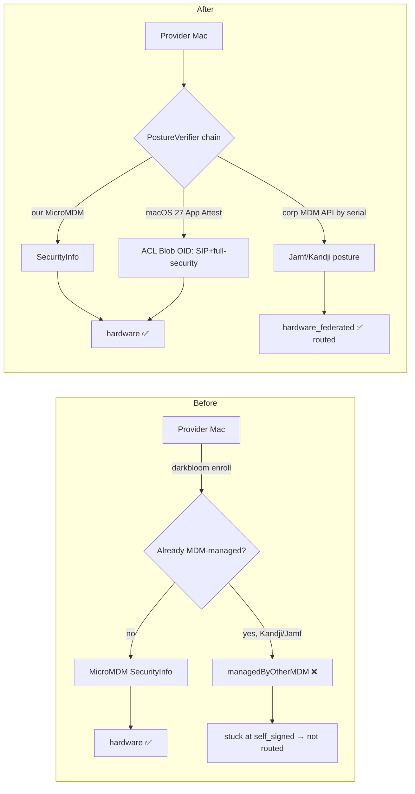

# Hardware trust for corporate-managed Macs (without a second MDM)

**Status:** Proposed (design / options analysis)

## The question

Apple allows **exactly one MDM enrollment per device**. Darkbloom's `hardware`
trust level is granted only after the coordinator's own MicroMDM sends a live
`SecurityInfo` command to the provider Mac (`coordinator/api/provider.go`
`verifyProviderViaMDM` → `GrantHardwareIfNotUntrusted`). A Mac that is already
enrolled in a corporate MDM — Kandji, Jamf, Mosyle, Intune, Addigy — therefore
**cannot enroll in Darkbloom's MicroMDM**, so it can never reach `hardware`
trust and, with `EIGENINFERENCE_MIN_TRUST=hardware` (prod/dev default), is never
routed paid private traffic.

This doc answers: *how can an operator whose Mac is managed by a popular MDM
give us the same hardware-trust signal without a second enrollment?*

## TL;DR (the answer)

There are two viable ways, and they are complementary:

| Option | Mechanism | Second MDM? | New macOS? | Strength | Ship horizon |
|---|---|---|---|---|---|
| **A. BYO-MDM connector** | Read the device's security posture from the corporate MDM's read-only API (serial → SIP / Secure Boot / FileVault / SSV) | **No** — reuses the corporate MDM | Any | Federated posture (a notch below MDA-bound) | Now |
| **B. App Attest** | Provider calls `DCAppAttestService` device-side; Apple signs an attestation whose macOS **ACL Blob OID** proves SIP + full security mode | **No MDM at all** | macOS 27+ | Apple-signed, SE-key-bound, strongest | As macOS 27 lands |

**Recommendation:** build **Option A now** to unblock corporate providers on any
macOS/MDM, and invest in **Option B** as the strategic end state that removes the
MDM dependency entirely. Both plug into one new `PostureVerifier` seam so the
trust-grant path (`verifyProviderViaMDM`) does not care which backend produced
the posture. Full details below.

---

## First principles: what MDM actually buys us

Darkbloom stacks five verification layers (`docs/architecture/security/attestation.md`).
Only **two of them touch MDM**; the rest are device-side and unaffected by the
corporate-MDM problem:

| Layer | Proves | Channel | MDM-dependent? |
|---|---|---|---|
| 1. SE P-256 blob | Hardware-bound identity + posture *claim* + binds X25519 key `K` | Provider self-report, SE-signed | No |
| 2. **MDM SecurityInfo** | **Independent** SIP / Secure Boot / ARV (not the provider app's word) | MicroMDM command → OS MDM subsystem | **Yes** |
| 3. **MDA-over-MDM** | Apple-signed genuine hardware + SE-key binding (nonce = `SHA256(SE pubkey)`) | MicroMDM `DeviceInformation` → Apple | **Yes** |
| 4. Challenge-response | Fresh SIP/Secure Boot every ~5 min, SE-signed | WebSocket | No |
| 5. APNs code identity | Genuine Darkbloom binary holds `K` | APNs push | No |

So the *entire* corporate-MDM problem reduces to: **replace the independent
posture check (Layer 2) and, ideally, the Apple-signed hardware binding (Layer 3)
with a source that does not require enrolling in our MicroMDM.**

Layer 2 exists because Layer 1 is self-reported: a provider with SIP disabled can
*claim* SIP is on. We need a channel the provider software cannot forge. That
channel does not have to be *our* MDM — it only has to be an independent,
Apple-rooted or corporate-rooted attestation of the same facts.

## The constraint, precisely

- A macOS device holds **one enrollment profile** at a time; removing it removes
  every managed profile/app under it. This is true for **all** enrollment types —
  profile-based Device Enrollment, Automated Device Enrollment, account-driven
  Device Enrollment, and account-driven User Enrollment. There is no "second MDM"
  or "device + user enrollment from two MDMs" path. (Apple Platform Deployment:
  *Enrollment methods*, *Device Enrollment and MDM*, *User Enrollment and MDM*.)
- The provider CLI already enforces this: `darkbloom enroll` refuses when a
  foreign MDM server is detected —
  `provider-swift/Sources/ProviderCore/Auth/Enrollment.swift`
  (`EnrollmentError.managedByOtherMDM`),
  `provider-swift/Sources/ProviderCore/Security/MDMEnrollment.swift`
  (`enrolledOtherMDM`).

Conclusion: we **cannot** install our MicroMDM profile on a corporate-managed
Mac. Any solution must get the posture some other way.

---

## Option A — Bring-Your-Own-MDM connector (federated posture)

**Idea:** the corporate MDM already manages the device and already collects its
security posture. Don't re-enroll — **read that posture from the corporate MDM's
API**, with the corporate IT admin's authorization, and feed it into the same
trust-grant path.

Every major Apple MDM exposes SIP / Secure Boot / FileVault / Sealed-System-Volume
over a **read-only** API keyed by hardware serial number — the exact fields
`verifyProviderViaMDM` needs:

| MDM | Lookup by serial | Posture fields | Auth |
|---|---|---|---|
| **Jamf Pro** | `GET /api/v1/computers-inventory?section=SECURITY&section=DISK_ENCRYPTION&filter=hardware.serialNumber=="…"` | `security.sipStatus`, `security.secureBootLevel`, `security.externalBootLevel`, `security.bootstrapTokenAllowed`, `diskEncryption.fileVault2Enabled` | OAuth client-credentials → bearer |
| **Kandji** | `GET /api/v1/devices?serial_number=…` → `id`, then `/api/v1/devices/{id}/details` + `/parameters` (SIP param `b648790a-…`) or **Prism** "Startup Settings" (SIP, SSV) | SIP, Secure Boot / SSV, FileVault, Gatekeeper | Bearer token (regional subdomain) |
| **Mosyle / Addigy / Intune** | Equivalent inventory endpoints | SIP / Secure Boot / FileVault | Bearer / OAuth |

These are the same endpoints compliance vendors (Drata, Vanta, SureCloud) use to
read Apple device posture, so the access pattern is well-trodden and the scopes
are read-only.

### How it wires in

The load-bearing observation: the coordinator already funnels all posture through
a single struct (`mdm.SecurityInfoResponse`) and a single verification decision
(`mdm.VerificationResult` inside `verifyProviderViaMDM`). MicroMDM is **hardcoded**
today (`Server.mdmClient *mdm.Client`, `SetMDMClient`), with no interface. Introduce
one seam:

```go
// coordinator/mdm/posture.go (new)

// PostureVerifier resolves a Mac's independent security posture by hardware
// serial number, from whatever backend manages/attests it. MicroMDM is one
// implementation; corporate-MDM connectors (Jamf, Kandji, …) are others.
type PostureVerifier interface {
    // VerifyPosture returns the device's independently-reported posture, or a
    // typed "not found / not managed / stale" error. attestationSIP/SecureBoot
    // are the provider's self-reported claims, used only for cross-check.
    VerifyPosture(ctx context.Context, serial string, attestationSIP, attestationSecureBoot bool) (*VerificationResult, error)

    // Source identifies the backend for telemetry/UI ("micromdm", "jamf", "kandji").
    Source() string
}
```

`*mdm.Client` already satisfies the shape (`VerifyProvider(ctx, serial, sip, sb)
(*VerificationResult, error)`); wrapping it is a rename, not a rewrite. Then:

- Coordinator holds an **ordered list** of `PostureVerifier`s (MicroMDM first, then
  connectors, resolved per-provider by which tenant owns the device).
- `verifyProviderViaMDM` iterates: first verifier that returns a definitive result
  (pass or `SecurityMismatch`) wins; "not managed here" falls through to the next.
- A connector maps vendor fields → `SecurityInfoResponse` (SIP bool,
  `secureBootLevel == "full"`, FileVault, ARV/SSV) and runs the **identical**
  cross-check logic already in `VerifyProvider` (SIP on, Secure Boot full, matches
  the SE blob → `hardware`; mismatch → `SecurityMismatch` → `MarkUntrusted`).

Tenant → connector binding: a corporate operator links their org in the console
(device-code / Privy), and IT authorizes a read-only API token stored as a
per-tenant coordinator secret (never a personal secret; scoped to the connector).
The provider's serial (already in the SE blob) is matched against that tenant's
MDM inventory.

### Honest limitations of Option A

1. **Posture is inventory, not a live command.** Vendor APIs return the *last
   reported* posture (Jamf on inventory update; Kandji/Prism refreshed periodically
   — some compliance integrations see 24h). We must enforce a **freshness bound**
   (reject if `lastCheckIn`/`lastInventory` is older than N hours) and lean on the
   still-live device-side Layers 4 + 5 (SE challenge every ~5 min, APNs per
   connection) for continuous assurance. MicroMDM's on-demand `SecurityInfo` is
   fresher.
2. **No SE-key-bound MDA (Layer 3).** Third-party MDM APIs do **not** let a partner
   inject a custom `DeviceAttestationNonce` or retrieve the raw
   `DevicePropertiesAttestation` cert chain. So Option A gives Apple-corroborated
   *posture* but not the `SHA256(SE pubkey)` ↔ Apple-attested-serial binding that
   MDA provides. Consequence: serial-spoofing is bounded only by the corporate MDM
   attesting that *a* genuine managed device with that serial is compliant — not by
   Apple binding *our* SE key to that serial. This is why Option A should be a
   **distinct trust sub-level** (`hardware_federated`), routable but visibly
   different from MicroMDM `hardware`, and paired with mandatory Layer 5 (APNs code
   identity) which *does* bind `K` to a genuine binary per connection.
3. **Trust root shifts to the corporate MDM + IT admin.** We trust that the org's
   MDM tenant is honest and its token is not exfiltrated. Mitigate with read-only
   scopes, per-tenant tokens, and treating a connector result as advisory unless
   Layers 1/4/5 also pass.

Net: Option A is **"federated hardware trust"** — good enough to route, honestly
weaker than MDA-bound MicroMDM trust, and the only option that works **today on
any macOS version**.

---

## Option B — App Attest (device-side, no MDM at all)

**New in macOS 27 (WWDC26 "Secure your apps with App Attest", session 201):**
App Attest — long available on iOS — now works on **macOS**. This is the clean
solution because it needs **no MDM whatsoever**, corporate or ours.

Why it fits Darkbloom almost perfectly:

- **It proves posture *and* genuineness, Apple-signed.** The attestation's leaf
  certificate chains to Apple, proves the key was generated in a **genuine Secure
  Enclave**, and embeds the app's relying-party identifier (Team ID + bundle ID).
  On **macOS 27+** the leaf also carries the **ACL Blob OID** — the key access
  control policy the SEP enforced at generation. On macOS, App Attest requires
  **full security mode + System Integrity Protection** to generate/use the key, so
  a valid attestation *is* a signed proof that SIP is on and Secure Boot is full.
  That is precisely Layer 2 + Layer 3, with no MDM.
- **The provider is already the right shape.** App Attest requires a "full Mac app
  running in a user context" (not a launchd daemon / bare CLI). The provider
  **already** runs as an `NSApplication(.accessory)` in a logged-in Aqua session
  with an embedded Apple provisioning profile — that infrastructure was built for
  APNs code identity (`provider-swift/Sources/darkbloom/ProviderAppKitHost.swift`,
  `entitlements.plist` → `SLDQ2GJ6TL.io.darkbloom.provider`). App Attest's
  relying-party ID = `TeamID + bundleID` = exactly what we already provision.
- **SE-key binding for free.** Pass `clientDataHash = SHA256(K ‖ challenge)` to
  `attestKey`; the coordinator vends the challenge and verifies it, binding the
  X25519 inference key `K` and a server nonce into the Apple-signed attestation —
  the same binding MDA gives us via `FreshnessCode`, but without MDM.

### Sketch

Provider (`ProviderCore`, macOS 27+ only, gated on `DCAppAttestService.shared.isSupported`):

```swift
let keyID = try await DCAppAttestService.shared.generateKey()          // SEP-bound
let clientDataHash = sha256(encryptionPublicKey_K + serverChallenge)
let attestation = try await DCAppAttestService.shared.attestKey(keyId: keyID, clientDataHash: clientDataHash)
// send {keyID, attestation} to coordinator
```

Coordinator (new `attestation/appattest.go`): validate the CBOR attestation, chain
to Apple's **App Attest root** (distinct from the Enterprise Attestation Root CA
already embedded in `attestation/mda.go`), confirm relying-party = our Team+bundle,
verify the nonce/`clientDataHash`, and **parse the ACL Blob OID → require SIP +
full security mode**. On success → grant `hardware` with `Source() == "app_attest"`.

### Honest limitations of Option B

1. **macOS 27+ only.** No help for Sonoma/Sequoia providers today; adoption grows
   over time. Ship Option A for the long tail.
2. **`isSupported` gating must be validated empirically.** WWDC26 says "full Mac
   apps in a user context"; developer-forum reports on early macOS 27 betas show
   `isSupported == false` for daemons/CLI even when app-wrapped (a private
   `com.apple.devicecheck.daemon-client` entitlement gate). Our provider is an
   AppKit `.accessory` app, not a launchd daemon — much closer to "full Mac app in
   user context" — but this **must be verified on a real macOS 27 box** before we
   commit. Treat `isSupported == false` itself as a fraud/untrusted signal, exactly
   as Apple recommends.
3. **Proves the app + hardware + posture, not exact cdhash.** Same residual as APNs
   Layer 5 (Team/bundle, plus bundle-version and launch-category extensions on
   iOS 27 — macOS extension availability TBD). Reproducible builds + a cdhash
   transparency log remain the version-pinning story.

---

## Option C — corporate-MDM-deployed managed app (fallback)

If an org will neither share an MDM API token (Option A) nor run macOS 27
(Option B), corporate IT can deploy the Darkbloom provider as a **managed app via
their own MDM** and expose a minimal attested claim. This rides the existing
single enrollment (no second MDM) but is bespoke per vendor and weaker (trusts the
managed-app deployment channel). Mention for completeness; not recommended as a
primary path.

---

## Recommendation & trust model

1. **Introduce the `PostureVerifier` seam** (small, behavior-preserving refactor:
   wrap `*mdm.Client`, no logic change). This is the prerequisite for everything.
2. **Ship Option A (BYO-MDM connector)** — Jamf + Kandji first (largest share),
   generic connector after. Grants a new `hardware_federated` sub-level: routable,
   surfaced distinctly in `/v1/providers/attestation` and the console trust badge,
   always paired with mandatory APNs code identity (Layer 5).
3. **Build Option B (App Attest)** as the strategic end state. Once validated on
   macOS 27, it grants full `hardware` device-side with zero MDM — eventually
   letting us retire MicroMDM for new hardware and sidestep the whole one-MDM
   problem for personal *and* corporate Macs.

Proposed trust ladder after this work:

| Level | Source | Independent posture | Apple SE-key binding |
|---|---|---|---|
| `hardware` | MicroMDM (today) or App Attest (Option B) | Yes (live command / SEP ACL) | Yes (MDA / App Attest nonce) |
| `hardware_federated` | Corporate MDM connector (Option A) | Yes (vendor inventory, freshness-bounded) | No (bounded by corporate MDM + APNs Layer 5) |
| `self_signed` | SE blob only | No | No |
| `none` | — | — | — |

## Implementation plan

Coordinator:
- `coordinator/mdm/posture.go` — `PostureVerifier` interface + `MicroMDMVerifier`
  adapter over `*mdm.Client` (rename `VerifyProvider` call site only).
- `coordinator/mdm/connectors/{jamf,kandji,generic}.go` — vendor clients: auth,
  serial lookup, field mapping → `SecurityInfoResponse`, freshness check.
- `coordinator/api/provider.go` — `verifyProviderViaMDM` iterates the verifier list;
  add `hardware_federated` grant + `Source`/freshness on `Provider`.
- `coordinator/registry` — new sub-level in `trustRank` and routing gate; surface in
  `/v1/providers/attestation`, `/v1/me/providers`, `/v1/stats`.
- Per-tenant connector config + read-only secret storage; Datadog metrics per
  `Source()` and per failure reason (extend existing MDM failure reasons).

Provider (Option B, later):
- `ProviderCore` App Attest key gen + attest, gated on `isSupported`, sent at
  registration alongside the existing SE blob and APNs token.

Tests (per repo testing rules — real HTTP path, no mocks of the thing under test):
- Connector unit tests via `httptest.NewServer` returning recorded Jamf/Kandji
  response shapes → assert correct `SecurityInfoResponse` mapping and
  pass/`SecurityMismatch`/stale outcomes.
- `verifyProviderViaMDM` multi-verifier fallthrough + precedence tests.
- App Attest chain verification against a test root (mirror the MDA
  `OverrideRootCAForTest` pattern in `attestation/mda.go`).

## Before / after



## Code paths

| Concern | Path |
|---|---|
| MDM posture struct / cross-check | `coordinator/mdm/mdm.go` (`SecurityInfoResponse`, `VerificationResult`, `VerifyProvider`) |
| Hardware-trust grant | `coordinator/api/provider.go` (`verifyProviderViaMDM`, `GrantHardwareIfNotUntrusted`) |
| MDM client wiring (hardcoded today) | `coordinator/api/server.go` (`mdmClient`, `SetMDMClient`) |
| Trust levels / routing gate | `coordinator/registry/registry.go` (`TrustLevel`, `trustRank`, `providerSupportsPrivateTextLocked`), `coordinator/registry/routing_eligibility.go` |
| MDA (Enterprise Attestation Root, reuse for App Attest pattern) | `coordinator/attestation/mda.go` |
| Provider foreign-MDM block | `provider-swift/Sources/ProviderCore/Auth/Enrollment.swift`, `Security/MDMEnrollment.swift` |
| AppKit host / provisioning profile (App Attest prerequisite) | `provider-swift/Sources/darkbloom/ProviderAppKitHost.swift`, `provider-swift/entitlements.plist` |
| Public attestation surface | `coordinator/api/provider.go` (`handleProviderAttestation`), `docs/architecture/security/attestation.md` |

## See also

- [`attestation.md`](./attestation.md) — the five-layer trust stack.
- [`enrollment.md`](./enrollment.md) — the current MicroMDM/SCEP enrollment flow.
- [`../decisions/apns-code-attestation.md`](../decisions/apns-code-attestation.md)
  — Layer 5 code identity (the device-side binding both options rely on).
