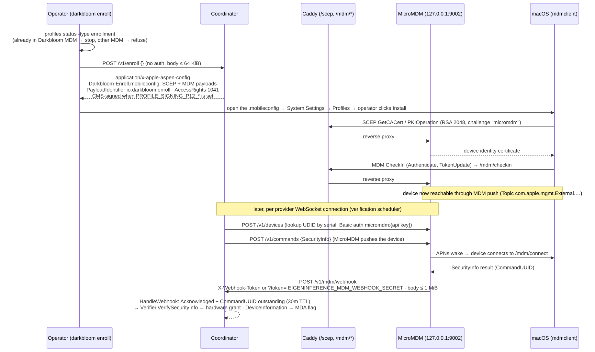

# Provider enrollment

Providers enroll by installing a single `.mobileconfig` profile generated by the coordinator. The profile combines MDM enrollment and SCEP device identity. The coordinator then uses MicroMDM to independently verify the device's security posture and to request an Apple-signed Managed Device Attestation (MDA) certificate chain.

## Enrollment flow



The diagram shows the sequence from `install.sh` requesting a signed profile through MicroMDM/SCEP enrollment to Apple MDA verification. The sections below describe the generated profile, the read-only MDM rights, and the verification checks.

## Enrollment endpoint

`POST /v1/enroll` accepts a serial number and returns a CMS-signed `.mobileconfig`. No authentication is required for the request itself; security comes from Apple's attestation during the MDA step and the MDM SecurityInfo posture check. Code:

- HTTP handler: `coordinator/api/enroll.go:19-81`
- Profile generation: `coordinator/api/enroll.go:113-266`

## Profile contents

The generated profile contains two payloads:

| Payload | Purpose | Key fields |
|---|---|---|
| SCEP | Device identity certificate for MDM | RSA 2048, CN = serial number, O = Darkbloom |
| MDM | Enroll with MicroMDM | `AccessRights = 1041` (read-only), `CheckOutWhenRemoved = true` |

(An ACME `device-attest-01` payload used to be a third payload; it was removed on 2026-07-03 along with the entire ACME trust leg — see below.)

`AccessRights = 1041` means the coordinator can only inspect profiles and query device/security information. It cannot lock, wipe, install/remove profiles, or change settings. The exhaustive allowlist of MDM commands the coordinator will send is:

- `SecurityInfo`
- `DeviceInformation` (for `DevicePropertiesAttestation`)

Code:

- Read-only command gate: `coordinator/mdm/mdm.go:133-166`

## SecurityInfo verification

After enrollment, the coordinator asks MicroMDM to query `SecurityInfo`. The device reports:

- `SystemIntegrityProtectionEnabled`
- `SecureBoot.SecureBootLevel`
- `AuthenticatedRootVolumeEnabled`
- `FDE_Enabled`
- `IsRecoveryLockEnabled`

The coordinator cross-checks these values against the provider's self-reported attestation blob. A mismatch (for example, MDM says SIP is off while the provider claims it is on) marks the provider untrusted. Code:

- MDM verification flow: `coordinator/api/provider.go:2268-2339`
- MicroMDM client: `coordinator/mdm/mdm.go`

## Apple Device Attestation (MDA)

After `SecurityInfo` passes, the coordinator sends a `DeviceInformation` command requesting `DevicePropertiesAttestation`. The device contacts Apple's servers and returns a DER certificate chain signed by the Apple Enterprise Attestation Root CA.

Verification chain:

```
Apple Enterprise Attestation Root CA (P-384, embedded in coordinator)
  └─ Apple Enterprise Attestation Sub CA 1
      └─ Leaf cert (device identity)
          ├─ Serial number   (OID 1.2.840.113635.100.8.9.1)
          ├─ UDID            (OID 1.2.840.113635.100.8.9.2)
          ├─ OS version      (OID 1.2.840.113635.100.8.10.1)
          ├─ SepOS version   (OID 1.2.840.113635.100.8.10.2)
          ├─ Secure Boot level (OID 1.2.840.113635.100.8.13.2)
          └─ Freshness code  (OID 1.2.840.113635.100.8.11.1)
```

The coordinator verifies the chain against the embedded root CA, cross-checks the serial number against the provider's self-reported attestation, and stores the chain for public inspection. Code:

- MDA verification: `coordinator/attestation/mda.go:98-186`
- MDA dispatch and key binding: `coordinator/api/provider.go:2342-2429`

### SE key binding via freshness nonce

When requesting MDA, the coordinator supplies a `DeviceAttestationNonce` equal to the SHA-256 of the provider's SE public key. Apple embeds the raw bytes in the `FreshnessCode` OID, cryptographically binding the SE identity to the Apple-attested hardware. The coordinator checks `bytes.Equal(mdaResult.FreshnessCode, expectedFreshness[:])` before treating the MDA as bound. Code: `coordinator/api/provider.go:2350-2361`.

## ACME `device-attest-01` (removed 2026-07-03)

Earlier profiles carried a third payload: an ACME `device-attest-01` payload (`com.apple.security.acme`) whose step-ca-issued cert was meant to be a second, throttle-immune hardware-trust leg. The leg was never wired end to end — the provider never presented the cert, and no ingress ever did mTLS / `X-Ssl-Client-*` header forwarding — so zero ACME verifications were ever observed in prod, while the dashboard showed a permanently-failing "ACME device-attest-01" red X (Linear DAR-394). The payload, the coordinator verification code (`api/acme_verify.go`), and the step-ca infrastructure were removed on 2026-07-03.

macOS platform limitations that had blocked it (kept for the record): hardware-bound ACME identities are not usable by third-party apps (restricted system keychain access group); the issued ACME leaf did not carry the SIP/SecureBoot OIDs (`1.2.840.113635.100.8.13.*`) that MDA-over-MDM carries; and the payload's P-384 key type mismatched the SE's P-256 attestation key.

The production path for hardware trust is:

- **MDM SecurityInfo** posture check (the sole `hardware` trust grant).
- **MDA-over-MDM** for Apple-signed genuineness/hardware proof.
- **APNs code-identity attestation** for genuine-binary proof.

The deprecated wire key `acme_verified` (hardcoded `false`) is still emitted by `/v1/providers/attestation`, `/v1/me/providers`, and `/v1/stats` because shipped provider builds decode it as a required field; new UI/CLI no longer display it.

## Trust upgrade flow

1. Provider registers with SE-signed attestation → trust level = `self_signed`.
2. MDM `SecurityInfo` passes → upgraded to `hardware`.
3. MDA certificate chain verifies and the serial number matches → MDA proof stored for public inspection.
4. APNs code-identity round-trip passes → `CodeAttested = true`, private traffic may route.

Code:

- Self-signed attestation and MDM upgrade path: `coordinator/api/provider.go:2195-2339`
- Trust level constants: `coordinator/registry/registry.go:52-57`
- Code-identity attestation: `coordinator/api/provider.go:487-617`

## Privacy and control boundaries

- The coordinator requests only read-only MDM rights.
- It cannot install/remove profiles, change settings, lock, or wipe the provider's Mac.
- The only commands it sends are `SecurityInfo` and `DeviceInformation`.
- The `.mobileconfig` is CMS-signed by the coordinator so the user sees a signed profile at install time.
