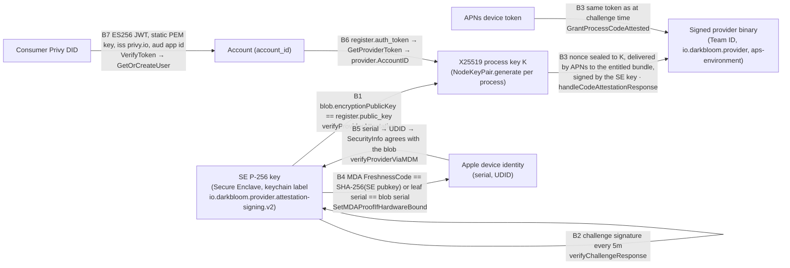

# Identity binding

> Last updated: 2026-09-27 · commit `93d556533`

How the coordinator binds a provider's process encryption key, account and
verification credentials. Legacy MDM/APNs evidence and App Attest credentials
have distinct bindings; [provider trust](provider-trust.md) describes how those
paths combine into a serving decision.

## Context

The X25519 process key `K` changes at provider startup; the legacy SE key,
APNs token, App Attest key and account have separate lifetimes. A signature binds
its transcript to a key holder. It does not independently establish that every
hardware or runtime value in that transcript is true. The checks below connect
identity evidence to the endpoint used by [encryption](encryption.md); the
[attestation mechanisms](attestation.md) describe the evidence behind each path.

## Mechanism

The legacy binding chain is shown below; the App Attest v3 chain follows it.

### The identities

| Identity | Produced by | Lifetime | Code |
|---|---|---|---|
| SE P-256 signing key | `PersistentEnclaveKey.loadOrCreateVerified`: keychain-backed Secure Enclave key, access group `SLDQ2GJ6TL.io.darkbloom.provider`, label `io.darkbloom.provider.attestation-signing.v2` (`kSecAttrAccessibleAfterFirstUnlockThisDeviceOnly`, so challenge signing works with the screen locked); keys under the legacy label `io.darkbloom.provider.attestation-signing.v1` are migrated. Fallback: `SecureEnclaveIdentity.createEphemeral` (CryptoKit `SecureEnclave.P256.Signing.PrivateKey`, lost at exit); `darkbloom-enclave-cli` always uses the ephemeral form | Persistent per Mac and signing identity; per process on the fallback path | `provider-swift/Sources/ProviderCore/Security/PersistentEnclaveKey.swift`; `provider-swift/Sources/ProviderCore/Security/SecureEnclaveIdentity.swift`; `provider-swift/Sources/ProviderCore/ProviderLoop.swift` (`createAttestationSigner`); `provider-swift/Sources/darkbloom-enclave-cli/EnclaveCLI.swift` |
| X25519 process key `K` | `NodeKeyPair.generate()` in the `ProviderLoop` initialiser (libsodium CSPRNG); legacy on-disk key files are purged | One provider process | `provider-swift/Sources/ProviderCore/Crypto/NodeKeyPair.swift`; `provider-swift/Sources/ProviderCore/ProviderLoop.swift` |
| APNs device token | macOS, for the signed bundle with `aps-environment`; sent as `register.apns_device_token` with `register.apns_environment` | Until the OS rotates it | `provider-swift/Sources/ProviderCore/Apns/APNsBridge.swift`; `coordinator/protocol/messages.go` (`RegisterMessage`) |
| Apple device identity | `serialNumber` inside the SE-signed blob (self-reported, SE-signed); serial and UDID inside the MDA leaf certificate (Apple-signed); UDID from the MicroMDM device record | Device lifetime | `coordinator/attestation/attestation.go` (`AttestationBlob`); `coordinator/attestation/mda.go` (`OIDDeviceSerialNumber`, `OIDDeviceUDID`); `coordinator/mdm/mdm.go` (`LookupDevice`) |
| Account | `account_id` created by `GetOrCreateUser` for a Privy DID; attached to a provider through a device-linked provider token | Account lifetime | `coordinator/auth/privy.go`; `coordinator/api/device_auth.go` |
| Provider ID | `uuid.New()` per WebSocket connection — a session handle, never an identity | One connection | `coordinator/api/provider.go` (`handleProviderWS`) |

### The bindings

| # | Binding | Proof | Enforced by |
|---|---|---|---|
| B1 | `K` ↔ SE key | The registration blob, signed by the SE key, carries `encryptionPublicKey`; it must equal `register.public_key`. A mismatch invalidates the attestation (and untrusts under a binary-hash policy) | `coordinator/api/provider.go` (`verifyProviderAttestation`) |
| B2 | SE key ↔ live process | Every `DefaultChallengeInterval` = 5m the process signs `nonce + timestamp` and the canonical status payload with the SE key; verified against the **registration** key, never one in the reply | `coordinator/api/provider.go` (`verifyChallengeResponse`); `coordinator/attestation/attestation.go` (`VerifyChallengeSignature`, `VerifyStatusSignature`) |
| B3 | `K` ↔ SE key ↔ signed binary ↔ APNs token | The code-identity nonce is NaCl-Box-sealed to `K` (only the `K` holder opens it), delivered through APNs to the bundle with App ID `io.darkbloom.provider` and Team ID (only that binary receives it), and returned signed by the SE key. The grant is refused if `K` or the token changed since the challenge; persisted proofs record `(se_pubkey, apns_token, node_public_key, binary_hash)` and authorise only a resume challenge, never a grant; old same-process proofs additionally require code-verified continuity, not hardware-only liveness | `coordinator/api/provider_codeattest.go` (`handleCodeAttestationResponse`); `coordinator/registry/provider_evidence.go` (`GrantProcessCodeAttested`); `coordinator/api/code_attest_throttle.go` (`reuseAttestation`) |
| B4 | SE key ↔ Apple device | `DeviceAttestationNonce` = SHA-256 of the SE public key string; Apple echoes it as `FreshnessCode` in the leaf. A chain is attached only if the connection is `hardware` and (`FreshnessCode` matches this SE key **or** the leaf serial equals the blob `serialNumber`); a cached chain is reused only when the nonce binds this SE key | `coordinator/mdm/mdm.go` (`RequestDeviceAttestation`); `coordinator/attestation/mda.go` (`VerifyMDADeviceAttestation`); `coordinator/registry/provider_evidence.go` (`SetMDAProofIfHardwareBound`); `coordinator/api/provider.go` (`attachCachedMDAProof`) |
| B5 | blob serial ↔ MDM device ↔ posture | The blob's `serialNumber` selects the MicroMDM device (`LookupDevice` → UDID); the device's own `SecurityInfo` must report SIP on and `SecureBootLevel == "full"`, and both must equal the blob's `sipEnabled` / `secureBootEnabled` | `coordinator/mdm/mdm.go` (`VerifyProviderWithUDIDObserver`); `coordinator/api/provider.go` (`verifyProviderViaMDM`) |
| B6 | provider ↔ account | `register.auth_token` is looked up by SHA-256 hash (`GetProviderToken`); on success `provider.AccountID = token.AccountID` and the stable fault key is rebound. An invalid token logs a warning and leaves the provider unlinked | `coordinator/api/provider.go` (`handleProviderWS`); `coordinator/store/postgres.go` (`hashKey`); `coordinator/registry/provider_evidence.go` (`RebindStableFaultKey`) |
| B7 | consumer ↔ account | `Authorization: Bearer <Privy access token>` verified as below; the JWT subject (Privy DID) maps to an account via `GetOrCreateUser` | `coordinator/api/server.go` (`requirePrivyAuth`, `extractBearerToken`); `coordinator/auth/privy.go` (`VerifyToken`, `GetOrCreateUser`) |
| B8 | durable evidence ↔ device | Trust-reuse rows are keyed by SE public key and carry `serial`, `mda_udid`, posture bits and generations; reuse refuses `serial_mismatch`, `missing_identity`, `no_device_evidence` | `coordinator/store/interface.go` (`ProviderTrustReuse`); `coordinator/api/trust_reuse.go` (`tryTrustReuseFastSkip`) |

### App Attest v3 endpoint binding

`ProviderLoop.handleAppAttestShadow` decrypts the coordinator's assertion
challenge with its own process `NodeKeyPair`; it never accepts another
process's public key as the endpoint to certify. The client then passes the
hash of a length-prefixed transcript to DeviceCheck. Code:
`provider-swift/Sources/ProviderCore/ProviderLoop+AppAttestShadow.swift`
(`handleAppAttestShadow`), `provider-swift/Sources/ProviderAppAttest/ShadowProtocol.swift`
(`AppAttestShadowPayload.clientHash`), and
`provider-swift/Sources/ProviderAppAttest/AppAttestShadowClient.swift` (`exchange`).

| Binding | Transcript or check | Code |
|---|---|---|
| Credential ↔ current endpoint | Domain/version, action, session, environment, key ID, challenge and process public key `K` enter `clientHash` | `provider-swift/Sources/ProviderAppAttest/ShadowProtocol.swift` (`clientHash`) |
| Credential ↔ account | Account scope enters v2/v3 transcripts and local key storage scope; a changed account during an exchange is rejected | `provider-swift/Sources/ProviderAppAttest/AppAttestShadowClient.swift` (`keyScope`, `exchange`) |
| Credential ↔ reported app/hardware/SE identity | v2 binds local OS/build, app version, chip and binary hash; v3 also binds machine model, memory, CPU/GPU counts and the legacy attestation public key. These are app-origin values, not independent Apple hardware measurements | `provider-swift/Sources/ProviderAppAttest/ShadowProtocol.swift` (`clientHash`); `provider-swift/Sources/ProviderCore/ProviderLoop+AppAttestShadow.swift` (`handleAppAttestShadow`) |
| Authorization ↔ live request destination | The coordinator rechecks connection, endpoint, account and canonical machine at the final inference write, together with current authorization and model gates | `coordinator/registry/inference_authorization.go` (`providerRequestAuthorizationBindingLocked`, `authorizeInferenceHandoff`) |

Local process/security diagnostics are outside `clientHash`. An App Attest
assertion binds the challenge to its credential and transcript; the serving
lease additionally needs the coordinator's [qualification and receipt policy](../../reference/provider-authorization.md).
The request's verification snapshot records that coordinator decision at dispatch;
it is not a new Apple signature over the inference input, output or computation.
See `coordinator/registry/inference_authorization.go` (`authorizeInferenceHandoff`).

### Stable identity for coordinator state

Reconnects, reputation, fault ejection, and stored trust must follow the
machine, not the session UUID.

| Use | Key | Code |
|---|---|---|
| Stored provider record lookup on registration | `serialNumber` from the fresh blob first, then `"sekey:" + <SE public key>` | `coordinator/api/provider.go` (`verifyProviderAttestation`) |
| Fault / reputation key | `serial:<serial>` → `sekey:<SE key>` → `acct:<account_id>` → `""` (valid attestation required for the first two; the account fallback is safe because `AccountID` comes from the authenticated token, never from the blob) | `coordinator/registry/health_ejection.go` (`stableProviderIdentityLocked`) |
| Trust reuse, code-identity proofs, push budgets | SE public key (plus token hash for budgets) | `coordinator/api/trust_reuse.go`; `coordinator/api/code_attest_throttle.go` |

### Device-code account linking

RFC 8628-style flow implemented in `coordinator/api/device_auth.go` and
`provider-swift/Sources/ProviderCore/Auth/DeviceAuth.swift` (`darkbloom login`).

| Step | Endpoint / value | Code |
|---|---|---|
| 1 | `POST /v1/device/code` (no auth, body capped at `maxControlPlaneBodyBytes`) → `{device_code, user_code, verification_uri, expires_in, interval}`. `device_code` = 32 random bytes hex; `user_code` = 8 chars from `ABCDEFGHJKMNPQRSTUVWXYZ23456789` formatted `XXXX-XXXX`; `expires_in` = `DeviceCodeExpiry` and `interval` = `DeviceCodePollInterval` ([api-contracts](../../reference/api-contracts.md#device-code-flow-3)); `verification_uri` = `EIGENINFERENCE_CONSOLE_URL` + `/link`, else `<scheme>://<host>/link` | `handleDeviceCode`, `generateUserCode` |
| 2 | Operator signs in to the console and submits the code: `POST /v1/device/approve {user_code}` behind `requirePrivyAuth` and `rateLimitFinancial`; code normalised to upper-case; errors `invalid_code`, `expired_code`, `already_used`; success → `ApproveDeviceCode(device_code, account_id)` | `handleDeviceApprove` |
| 3 | CLI polls `POST /v1/device/token {device_code}` (no auth; the secret is the code): `200 {status: "authorization_pending"}` while pending; `invalid_grant` when unknown; `expired_token` after `DeviceCodeExpiry` or once consumed; on approval `200 {status: "authorized", token, account_id}` | `handleDeviceToken` |
| 4 | Token = the provider token whose shape is under [api-contracts](../../reference/api-contracts.md#device-code-flow-3); the store keeps `ProviderToken{TokenHash, AccountID, Label: "device-" + user_code, Active}`; the CLI writes the token to `~/.darkbloom/auth_token` with mode `0600` | `handleDeviceToken`; `AuthTokenStore` |
| 5 | The daemon sends it as `register.auth_token` (binding B6) | `coordinator/api/provider.go` |
| Logging | `device code created {user_code, expires_in}`, `provider token issued {account_id, user_code}`, `device approved {user_code, account_id, email}` at `Info` — never the `device_code` or the token | `coordinator/api/device_auth.go` |

### Consumer identity: Privy JWT verification

| Property | Value | Code |
|---|---|---|
| Configuration | `EIGENINFERENCE_PRIVY_APP_ID`, `EIGENINFERENCE_PRIVY_APP_SECRET`, and the verification key as `EIGENINFERENCE_PRIVY_VERIFICATION_KEY` (PEM; literal `\n` sequences are expanded) or `EIGENINFERENCE_PRIVY_VERIFICATION_KEY_FILE`; both app ID and key are required | `coordinator/auth/config.go`; `coordinator/auth/privy.go` (`NewPrivyAuth`) |
| Key | A single **static** PEM `SubjectPublicKeyInfo` parsed with `x509.ParsePKIXPublicKey`; must be ECDSA. There is no JWKS fetch and no key rotation without a restart | `coordinator/auth/privy.go` (`NewPrivyAuth`) |
| Token checks | Algorithm exactly `ES256`; issuer `privy.io`; audience = app ID; standard `exp`/`nbf` via `jwt.RegisteredClaims`; non-empty `sub` | `coordinator/auth/privy.go` (`VerifyToken`) |
| Result | `sub` is the Privy DID (`did:privy:…`); `GetOrCreateUser` looks it up or creates `User{AccountID: uuid, PrivyUserID, Email}` after fetching details from `https://auth.privy.io/api/v1/users/<did>` with Basic auth `app_id:app_secret` and `Privy-App-Id` | `coordinator/auth/privy.go` (`GetOrCreateUser`, `fetchUserDetails`) |
| Admin email OTP | `InitEmailOTP` and `VerifyEmailOTP` encode email/code with typed JSON serialization before calling Privy; quotes, backslashes and control characters remain inside their string fields | `coordinator/auth/privy.go` |
| Failure | Missing header → `401 authentication_error "missing credentials"`; bad token → `401 authentication_error "invalid Privy token"` | `coordinator/api/server.go` (`requirePrivyAuth`) |

## Invariants

1. The legacy registration attestation is valid only if its SE-signed blob names the registration X25519 key as `encryptionPublicKey` — `coordinator/api/provider.go` (`verifyProviderAttestation`).
2. All legacy challenge and APNs code-identity signatures are checked against the registration-time SE key — `coordinator/api/provider.go` (`verifyChallengeResponse`), `coordinator/api/provider_codeattest.go` (`handleCodeAttestationResponse`).
3. Legacy APNs code identity is granted only if `K` and the APNs token are unchanged since the challenge was issued — `coordinator/registry/provider_evidence.go` (`GrantProcessCodeAttested`).
4. An MDA chain is attached only when it binds this SE key or the blob's serial, and only on a `hardware` connection — `coordinator/registry/provider_evidence.go` (`SetMDAProofIfHardwareBound`).
5. Legacy MDM hardware posture is taken from the device selected by the blob's serial and must agree with the blob — `coordinator/api/provider.go` (`verifyProviderViaMDM`).
6. `AccountID` is set only from a valid device-linked token, never from anything in the attestation blob — `coordinator/api/provider.go` (`handleProviderWS`), `coordinator/registry/health_ejection.go` (`stableProviderIdentityLocked`).
7. Provider tokens and API keys are stored and looked up by SHA-256 hash only — `coordinator/store/postgres.go` (`hashKey`), `coordinator/api/device_auth.go` (`handleDeviceToken`).
8. Privy tokens are accepted only with `ES256`, issuer `privy.io`, and the configured audience, under the static configured key — `coordinator/auth/privy.go` (`VerifyToken`).
9. The provider UUID is never used as an identity for trust, reputation, or reuse — `coordinator/registry/health_ejection.go` (`stableProviderIdentityLocked`).

## Failure modes

| Failure | Effect | Code |
|---|---|---|
| Provider restarts | New `K`; B1 re-established by the fresh blob; old-process continuity cannot transfer to the new key. Legacy resume requires a recent APNs proof and an approved application-evidence transition, otherwise a new push. App Attest needs a fresh assertion bound to the new endpoint | `coordinator/api/code_attest_throttle.go` (`reuseAttestation`) |
| Persistent SE key unusable (keychain locked, poisoned) | `loadOrCreateVerified` repairs once, else ephemeral fallback: a new SE identity, so stored trust, code proofs, and MDA binding start over | `provider-swift/Sources/ProviderCore/Security/PersistentEnclaveKey.swift`; `provider-swift/Sources/ProviderCore/ProviderLoop.swift` |
| APNs token rotates | `CodeAttested` cleared; push budget re-keyed (at most once per `budgetClearCooldown` = 20m) | `coordinator/api/code_attest_throttle.go` |
| Blob serial does not match any MicroMDM device | `device-not-found`; stays `self_signed`; retried | `coordinator/api/provider.go` (`verifyProviderViaMDM`) |
| MDA leaf serial ≠ blob serial and nonce does not bind the SE key | `mda_verified` stays false | `coordinator/registry/provider_evidence.go` (`SetMDAProofIfHardwareBound`) |
| Invalid or revoked provider token | Warning logged; provider connects unlinked (no account, no owner self-route, no payouts) | `coordinator/api/provider.go` |
| Privy key rotated upstream | Every consumer token fails `401` until the coordinator is restarted with the new PEM | `coordinator/auth/privy.go` |
| Device code expired or reused | `expired_token` / `already_used`; operator reruns `darkbloom login` | `coordinator/api/device_auth.go` |

## Code map

| Concern | File (symbol) |
|---|---|
| App Attest transcript and endpoint binding | `provider-swift/Sources/ProviderAppAttest/ShadowProtocol.swift` (`clientHash`); `provider-swift/Sources/ProviderCore/ProviderLoop+AppAttestShadow.swift` (`handleAppAttestShadow`); `coordinator/registry/inference_authorization.go` (`authorizeInferenceHandoff`) |
| SE key lifecycle | `provider-swift/Sources/ProviderCore/Security/PersistentEnclaveKey.swift` (`loadOrCreateVerified`, `defaultLabel`, `defaultAccessGroup`); `provider-swift/Sources/ProviderCore/Security/SecureEnclaveIdentity.swift` (`createEphemeral`); `provider-swift/Sources/ProviderCore/ProviderLoop.swift` (`createAttestationSigner`) |
| `K` lifecycle | `provider-swift/Sources/ProviderCore/Crypto/NodeKeyPair.swift` (`generate`, `purgeLegacyFiles`) |
| Blob ↔ `K` binding | `coordinator/api/provider.go` (`verifyProviderAttestation`); `coordinator/attestation/attestation.go` (`AttestationBlob`) |
| Code identity | `coordinator/api/provider_codeattest.go` (`handleCodeAttestationResponse`); `coordinator/api/code_attest_throttle.go` (`reuseAttestation`, `persistCodeAttestation`); `coordinator/registry/provider_evidence.go` (`GrantProcessCodeAttested`) |
| MDA binding | `coordinator/mdm/mdm.go` (`RequestDeviceAttestation`); `coordinator/attestation/mda.go`; `coordinator/registry/provider_evidence.go` (`SetMDAProofIfHardwareBound`); `coordinator/api/provider.go` (`attachCachedMDAProof`) |
| MDM posture binding | `coordinator/mdm/mdm.go` (`LookupDevice`, `VerifyProviderWithUDIDObserver`); `coordinator/api/provider.go` (`verifyProviderViaMDM`) |
| Stable identity | `coordinator/registry/health_ejection.go` (`stableProviderIdentityLocked`); `coordinator/registry/provider_evidence.go` (`RebindStableFaultKey`); `coordinator/registry/persistence.go` (`RestoreProviderState`) |
| Account linking | `coordinator/api/device_auth.go` (`handleDeviceCode`, `handleDeviceToken`, `handleDeviceApprove`, `DeviceCodeExpiry`, `DeviceCodePollInterval`); `provider-swift/Sources/ProviderCore/Auth/DeviceAuth.swift` (`AuthTokenStore`) |
| Consumer identity | `coordinator/auth/privy.go` (`NewPrivyAuth`, `VerifyToken`, `GetOrCreateUser`); `coordinator/auth/config.go`; `coordinator/api/server.go` (`requirePrivyAuth`) |

## Related

- [Provider trust](provider-trust.md) — the shared hybrid authorization decision and its limits.
- [`attestation.md`](./attestation.md) — the trust levels and flags these bindings feed.
- [`encryption.md`](./encryption.md) — what is sealed to `K`.
- [`enrollment.md`](./enrollment.md) — how the device becomes addressable by serial in MicroMDM.
- [`../../provider/attestation.md`](../../provider/attestation.md) — `darkbloom login`, `darkbloom enroll`, and reading the resulting status.
