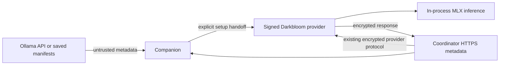

# Ollama companion security boundary

> Last updated: 2026-09-21 · commit `ce809b792`

Darkbloom Connect is a metadata and onboarding companion. It introduces no
inference proxy or alternative provider authorization. The existing
[encryption model](encryption.md) and [serving authorization](../../reference/provider-authorization.md)
remain authoritative.

## Context

An Ollama operator controls the local server, its files, diagnostics and caches.
App Attest on a connector cannot make an arbitrary Ollama process a trusted
plaintext recipient. The POC therefore uses Ollama only for discovery and
hands network setup to the existing signed Darkbloom provider. The companion
itself is outside the private-request execution path.

## Mechanism

## Invariants

1. **No Ollama inference calls.** `MetadataEndpoint` is a closed set of fixed
   URLs; `BoundedTransfer` constructs GET-only, body-free, credential-free
   requests, disables cookies/proxies, rejects every redirect, and bounds
   received bytes. There is no general URL, POST, upload, chat or generation
   API. Code: `experiments/ollama-connect/Sources/ConnectCore/BoundedHTTP.swift`.
2. **Inventory is not authority.** Ollama names and digests never select
   executables, manifests or command arguments. `CatalogPolicy` accepts only
   active text artifacts with valid IDs and hashes from the fixed coordinator
   endpoint. Advisory RAM/chip checks cannot override provider admission.
   Code: `OllamaDiscovery.swift`, `ModelCatalog.swift` in `ConnectCore`.
3. **Signed worker identity.** `WorkerIdentity.inspect` checks Apple's signing
   anchor, Darkbloom identifier/team, Developer ID certificate, hardened
   runtime and unsafe entitlement exclusions. Running-process verification
   checks the live code identity/hash and kernel process start time on both
   sides of the check. Code: `ConnectCore/WorkerIdentity.swift`.
4. **No local grant.** `ServingEvidence.evaluate` requires current local
   connection evidence and an HTTPS coordinator record matching the session
   and Secure Enclave public key. Missing/revoked/expired/mismatched records
   cannot show confirmed status. The UI expires its snapshot without waiting
   for a successful refresh. Public `online` and `serving` states are both
   admitted; unknown states are not. Code: `ConnectCore/ServingEvidence.swift`.
5. **No trust-policy changes.** The coordinator's existing backend and privacy
   checks still run at reservation and final handoff. The new regression test
   changes a previously authorized worker to an Ollama/proxy/unsafe posture
   immediately before write and requires zero frames on the wire. Code:
   `coordinator/registry/ollama_boundary_test.go`, `TestOllamaBridgeCannotInheritAppAttestServing`.
6. **Explicit setup.** `SetupAction` is a closed command set. The user sees and
   runs the signed CLI in Terminal; the script rechecks the signature and
   starts it with a minimal environment. Login uses a fixed-coordinator
   config, download/start use fixed coordinator arguments. No account token
   is read by the app. Code: `ConnectCore/SetupHandoff.swift`.

## Failure modes and qualification limits

| Condition | Behavior / remaining boundary |
|---|---|
| Fake Ollama reports a model or an authorization flag | Display-only inventory; cannot register capacity or become a command |
| Ollama redirects to another service | Reject, never follow or send credentials |
| Response streams past the byte limit | Cancel while receiving |
| Daemon file names a reused PID or unrelated process | Running-code/start-time validation fails |
| Local file claims App Attest but the coordinator disagrees | UI remains unconfirmed; local status cannot grant dispatch |
| Coordinator status is unavailable, stale or expired | Confirmation expires locally; coordinator independently governs actual serving |
| Ollama uses GGUF or another incompatible layout | No conversion/import; signed worker downloads a catalog artifact |
| Existing provider is running | Start controls are withheld; POC does not replace it |
| User starts another provider after the handoff check | Existing CLI lifecycle semantics apply; the POC does not add an atomic service-ownership API |
| App built locally | Ad hoc companion is not release-qualified or App Attest-authorized |
| Passing encrypted testbed inference | Demonstrates the real provider transport/model path under synthetic test trust; not an Apple qualification result |

This is a source-level, tested POC preserving the existing boundary, not a
claim of full security certification. It does not make stock Ollama a safe
network inference endpoint. Production distribution still needs review,
signed/notarized companion packaging, full first-install interaction testing,
and the provider release's existing physical App Attest qualification.

## Code map

All companion paths below are under `experiments/ollama-connect/`.

| Concern | Code |
|---|---|
| Discovery and safe local file reads | `Sources/ConnectCore/OllamaDiscovery.swift`, `SafeFile.swift` |
| Fixed network policy and response bounds | `Sources/ConnectCore/BoundedHTTP.swift` |
| Catalog and capability hints | `Sources/ConnectCore/ModelCatalog.swift` |
| Signatures, running process, status expiry | `Sources/ConnectCore/WorkerIdentity.swift`, `ServingEvidence.swift` |
| Explicit CLI handoff | `Sources/ConnectCore/SetupHandoff.swift` |
| Native UI and view rendering | `Sources/DarkbloomConnect/` |
| Adversarial policy tests | `Tests/ConnectCoreTests/`, `script/test_transport.py` |

## Related

- [Try the companion](../../provider/ollama-connect.md)
- [Provider authorization](../../reference/provider-authorization.md)
- [Identity binding](identity-binding.md)
