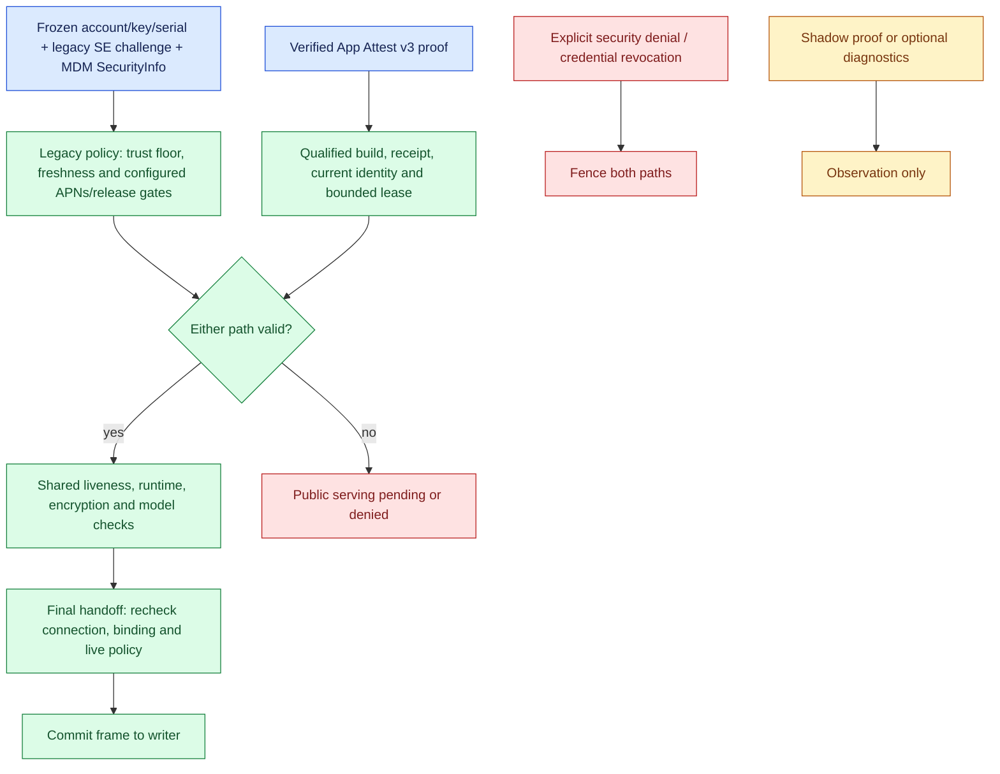

# Provider trust during MDM and App Attest coexistence

> Last updated: 2026-10-06

Darkbloom supports two independent provider authorization paths: legacy MDM/APNs verification and qualified App Attest. A connection can satisfy either or both. This explanation separates those paths from their shared dispatch checks and from claims neither path proves. The [authorization reference](../../reference/provider-authorization.md) owns configuration, deadlines and migration procedures.

## Context

A legacy `trust_level` is one piece of evidence, not the whole serving decision. An App Attest-only connection can retain `self_signed` while being authorized; `hardware` alone does not satisfy every legacy runtime, freshness and configured code-identity check. The coordinator evaluates these separately in `coordinator/registry/app_attest_authorization.go` (`providerLegacyServingAuthorizedLocked`, `providerAppAttestServingAuthorizedLocked`) and `coordinator/registry/attestation_policy.go` (`providerSupportsPrivateTextAuthorizationAtLocked`).

App Attest protocol names still contain `shadow` because observation and enforcement share the exchange. Observation alone grants no serving permission. `coordinator/appattest/service/config.go` (`ConfigFromEnvironment`) defaults shadow, serving and MDM removal off, with rollout at zero. `deploy/environments/prod.env` is a sanitized reference, explicitly not the live configuration; it retains MDM and the hardware trust floor. `deploy/gcp/prod/refresh-env.sh` preserves runtime settings. These files establish supported behavior and defaults, not current fleet activation. The sanitized fleet version floor is `0.9.5`; `coordinator/api/releases/owner.go` (`belowMinProviderVersion`) rejects a missing version whenever a floor is configured. This routing check is separate from App Attest protocol negotiation.

The coordinator now serves only App Attest protocol 3. Protocol 1/2 registrations receive no Apple-operation frames, and pre-v3 stored enrollments cannot resume. The former claimed-version gate is gone; the protocol capability selects the exchange, while verified code, qualification and shared routing policy still determine serving. Legacy MDM/APNs authorization remains implemented — removing old wire compatibility does not remove that independent path. Code: `coordinator/appattest/service/session.go` (`startAppAttestShadow`), `coordinator/internal/appattest/transcript/binding.go` (`Prepare`) and `coordinator/appattest/authorization.go` (`EvaluateAuthorization`).

## Mechanism

The upcoming [frozen legacy MDM policy](enrollment.md#frozen-legacy-authorization-cohort)
restricts the legacy MDM path to durable authenticated account/key/serial
membership frozen on the first upgraded startup after revocation replay.
`coordinator/internal/provider/legacymdm/policy.go` (`Policy.Initialize`, `Policy.RegistrationAllowed`, `Policy.ProviderAllowed`)
gates identity recovery, scheduling, live/late MDM and cached trust reuse; new
identities must qualify through App Attest. Unsupported OS versions do not
create a fallback. No grace period is chosen and no expiry is implemented.
Generic copied profiles may still enroll directly in MicroMDM; this policy
restricts coordinator authorization, not that direct enrollment.

Noncohort connections require qualified App Attest even on authenticated owner
self/prefer routes. `Provider.RequireAppAttestServingAuthorization` is a
per-connection gate enforced by shared routing and the final handoff; a relaxed
legacy `TrustNone` floor is not a fallback. Initialization validates enabled
production App Attest serving with full rollout before freezing and fails
startup on invalid configuration; see the [deployment prerequisites](../../operations/coordinator-deploy.md#frozen-legacy-mdm-cutover-prerequisites).

Legacy-only serving eligibility does not qualify a machine for base rewards.
Base rewards require current qualified App Attest authorization, including for a
machine that also has MDM evidence; existing economics guards still apply.
Inference/work earnings remain unchanged, and this does not claw back historical
rewards. See [billing](../billing.md) for the settlement policy.

The diagram describes public serving. Authenticated owner routing may relax the public trust floor and admit a private-only machine; it retains the common runtime/privacy/freshness and hard-denial gates. `coordinator/registry/owner_authorization.go` (`ProviderOwnerServingAuthorized`) and `coordinator/registry/inference_authorization.go` (`InferenceHandoff.Authorize`) enforce that separate policy.

| Evidence | Establishes | Does not establish | Code |
|---|---|---|---|
| Legacy SE-signed registration/status | Signature validity and binding of reported fields to the registered key | A self-signature alone does not independently certify key provenance or each reported fact | `coordinator/attestation/attestation.go` (`Verify`, `VerifyStatusSignature`) |
| MDM SecurityInfo | Legacy `hardware` grant when independently returned posture agrees with the signed blob | App Attest authorization or per-request computation correctness | `coordinator/internal/provider/deviceverification/mdm_verification.go` (`VerifyProviderViaMDM`) |
| Apple MDA chain | Separate device-bound `mda_verified` evidence | The legacy hardware grant itself | `coordinator/registry/provider_evidence.go` (`SetMDAProofIfHardwareBound`) |
| APNs code identity and legacy release evidence | Legacy application/endpoint evidence subject to configured enforcement policy | Continuous measurement of every instruction or model computation | `coordinator/registry/attestation_policy.go` (`codeAttestationEnforcedAtLocked`, `providerHoldsCurrentApplicationEvidenceLocked`) |
| App Attest enrollment/assertion | Verified credential, Mac access-policy and code evidence plus a signed current transcript | Authorization without qualification, receipt and live connection checks | `coordinator/appattest/verify.go` (`Verifier.Attestation`, `Verifier.Assertion`); `coordinator/appattest/authorization.go` (`EvaluateAuthorization`) |
| App Attest v3 hardware/status fields | App-origin claims bound to account, session, endpoint and verification key | Independent Apple certification of RAM, physical uniqueness or model execution | `provider-swift/Sources/ProviderAppAttest/ShadowProtocol.swift` (`clientHash`) |
| Public verification verdict | Coordinator observation of the applicable method at its source snapshot or final dispatch | A transferable grant or Apple-signed result receipt | `coordinator/registry/verification.go` (`ProviderVerificationAndAuthorization`); `coordinator/registry/inference_authorization.go` (`InferenceHandoff.Authorize`) |

## Invariants

1. **App Attest grants do not rewrite legacy evidence.** A current lease substitutes for specific legacy authorization requirements; it never sets `TrustHardware`, `MDAVerified` or `CodeAttested`. Common runtime/transport/privacy checks remain — `coordinator/registry/attestation_policy.go` (`providerSupportsPrivateTextAuthorizationAtLocked`).
2. **Selection is not final authorization.** Every inference handoff rechecks current connection, account/machine/endpoint binding and applicable policy after frame preparation and owner acknowledgment. Later invalidation fences subsequent handoffs but cannot recall committed frames — `coordinator/registry/inference_authorization.go` (`WriteInferenceTextDeferred`, `InferenceHandoff.Authorize`).
3. **Missing evidence and hard denial differ.** Expiry or a transient lookup/Apple failure cannot extend App Attest permission; independently valid legacy evidence can remain usable only for connections eligible for the legacy path. Noncohort connections cannot fall back to legacy evidence, including on owner routes. Explicit credential revocation and security denial fence matching live connections across both paths — `coordinator/appattest/service/authorizer.go` (`refresh`); `coordinator/registry/app_attest_authorization.go` (`providerLegacyServingAuthorizedLocked`, `RevokeAppAttestCredential`); `coordinator/registry/app_attest_denial.go` (`denyAppAttestProviderLocked`).
4. **Build publication is not qualification.** Serving requires current approved artifact/code identity, receipt and revocation evidence, with independent policy and qualification generation invalidation. Apple's truncated measurement must uniquely bind the durable full hash — `coordinator/appattest/service/build_qualifications.go` (`applyBuildQualification`); `coordinator/registry/app_attest_authorization.go` (`providerHasAppAttestAuthorizationLocked`).
For existing deployments only, `applyBuildQualification` can use configured exact build/code mappings for a full Apple measurement when no durable row exists and the qualification snapshot is fresh. Durable rows and revocation tombstones override this compatibility path; truncated measurements and new release publication require durable qualification.

5. **Legacy evidence cannot use the retired downgrade exceptions.** Every registration blob must meet `RegistrationAttestationMaxAge`, regardless of its claimed provider version. A challenge for an attested SE key requires a valid `status_signature`; missing SIP or Secure Boot status fails the challenge. These checks constrain signed claims and freshness, not independent physical measurement — `coordinator/api/provider/trust/attestation.go`, `coordinator/api/provider/trust/attestation.go`, `coordinator/internal/provider/challenge/challenge_verify.go` (`VerifyProviderAttestation`, `verifyChallengeResponse`).
6. **Onboarding is not permission.** New macOS 27+ setup skips new MDM enrollment and waits for App Attest. Existing profiles remain; removal needs a separate current decision and local user action — `provider-swift/Sources/ProviderCore/Auth/Enrollment.swift` (`EnrollmentService.enroll`); `provider-swift/Sources/darkbloom/UnenrollCommand+KeepServing.swift`.

## Failure modes and limits

| Failure or adversarial action | Consequence / residual risk | Threat-model entries |
|---|---|---|
| Reuse shadow output, enrollment success or a stale badge as authorization | Must remain observation; public and owner policy must remain distinct | `T-052`, `T-058` |
| Expire/revoke/replace a provider between selection and write | Final handoff rejects stale authorization; committed frames remain in flight | `T-053` |
| Revoke a qualified build or collide a truncated measurement | Fresh durable policy must reject stale/ambiguous approval | `T-054` |
| Reinstall, rotate credentials or inflate hardware claims | Known associations deduplicate rewards; they do not prove unique physical hardware or certified capacity | `T-055` |
| Compromise the running provider or substitute computation | Process memory/GPU remain the inference endpoint; neither path supplies a computation proof | `T-056` |
| Lose Apple/receipt availability after removing MDM | App Attest may become pending; no automatic relaxation of authorization | `T-023`, `T-057` |

Platform security, signed-artifact qualification and physical SIP/boot transitions need adversarial evidence on supported hardware. Synthetic tests establish code behavior, not resistance to every host compromise. Legacy trust-reuse timing premises likewise remain qualification assumptions. The [encryption explanation](encryption.md) owns the plaintext and key-lifetime model; attestation does not alter it.

## Code map

| Concern | Entry points |
|---|---|
| Shared authorization and owner exception | `coordinator/registry/attestation_policy.go`, `routing_eligibility.go`, `owner_authorization.go` |
| Proof and bounded authorization | `coordinator/appattest/verify.go`, `authorization.go`, `service/authorization_identity.go`, `service/authorizer.go` |
| Binding and final socket handoff | `coordinator/registry/inference_authorization.go`; `coordinator/internal/inference/providerwire/provider_frame_handoff.go` (`WriteDeferred`) |
| Provider endpoint custody and transcript | `provider-swift/Sources/ProviderCore/ProviderLoop+AppAttestShadow.swift`; `provider-swift/Sources/ProviderAppAttest/ShadowProtocol.swift` |
| Canonical risk register | [Threat model](../../threat-model.yaml), especially `TB-002`, `TB-009`, `TB-011` and `T-052`–`T-058` |

## Related

- [Provider attestation](attestation.md) — legacy evidence, independent App Attest policy and routing details.
- [Identity binding](identity-binding.md) — key custody and transcript bindings.
- [Serving authorization reference](../../reference/provider-authorization.md) — exact controls, deadlines and qualification.
- [MDM-optional rollout](../../operations/mdm-optional-rollout.md) — activation and removal procedure.
- [Hybrid trust review](../../reports/2026-09-27-hybrid-provider-trust-review.md) — scoped evidence and limits of this update.

## Account erasure cleanup

After durable scrub succeeds, `ForgetErasedKeys`
(`coordinator/api/provider/trust/erasure.go`) removes the erased account's
unshared keys from the trust-reuse cache and verification scheduler. Shared
keys remain until their last non-erased owner is scrubbed. The store also
removes that account's frozen legacy MDM cohort rows, preserving other owners'
membership. See [account erasure](../account-erasure.md).
