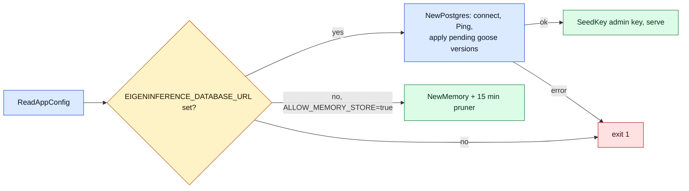

# Storage

> Last updated: 2026-10-04

What the coordinator persists, through which interface and in which backend;
then what a provider keeps on its own disk and in its Keychain. How the schema
changes is [schema lifecycle](schema-lifecycle.md). Read this to understand what survives a restart, what
does not, and which files an operator may touch. Configuration values are
listed once in [`../reference/configuration.md`](../reference/configuration.md);
the SSD cache file format is in
[`../reference/ssd-kv-cache.md`](../reference/ssd-kv-cache.md).

Promoted, non-retired model versions remain accepted during automatic weight
updates. `ModelRegistryRecord.ServingVersions` derives from existing
`model_versions.promoted_at` and `status`; no new schema migration is required.
The model cache invalidates on publication, promotion and explicit retirement.
Provider snapshots use immutable hidden revision directories selected by
`refs/main`; [revision storage and recovery](model-revisions.md) describes them.

Model versions also store the optional `hugging_face_artifact` as nullable JSONB
(`coordinator/store/postgres.go`). `SetModelVersion` replaces it and invalidates
the existing model read-through cache; [artifact schema](../reference/model-registry-format.md#hugging-face-download-artifact).

Attempt decision fields are additive columns and existing provider JSONB;
[prediction telemetry](../reference/prediction-decision-telemetry.md#storage-and-rollout)
defines migration, historical NULLs and the separately applied waterfall view.

App Attest maintenance marks abandoned pending submissions `interrupted` without accepting old assertions or changing counters. Enrollment contexts retain their protocol version so an upgrade does not reinterpret a cached proof. Historical receipt recovery appends new versions; credential revocations are durable and account-scoped. See `coordinator/store/app_attest_maintenance.go` and `coordinator/store/app_attest_readiness.go`. The additive `app_attest_key_rotations` table (`coordinator/store/app_attest_rotation.go`, created with the other App Attest DDL) records one coordinator-requested dead-key retirement per key with a `(machine_id, requested_at DESC)` index for rate limits; it is not a revocation.

The additive [App Attest inventory and evidence tables](../reference/app-attest-shadow.md#storage-and-complete-evidence-archive) retain stable machine mappings, session/OS history, complete proof bytes, receipt versions, and atomic verification results. They do not restore live authorization. The [MDM-optional path](../reference/provider-authorization.md#machine-identity-and-base-rewards) uses verified canonical identity for new base-floor settlement, while retaining original organic-earning keys and historical ledger rows.

Machine-session reconciliation uses a partial index over open sessions and bounded, row-locked batches to repair missed disconnect writes after contention or restart. Fresh inventory or provider-session heartbeats preserve liveness. Known closures retain their timestamp; inferred stale closures are labelled and can recover when fresh observations resume. Older observations and confirmed disconnects are fenced in `ObserveMachine`. See the [inventory lifecycle](../reference/app-attest-shadow.md#machine-inventory-and-identity) and `coordinator/store/machine_inventory_reconcile.go`.

Canonical history and reward queries use the existing inventory tables. The baseline adds the reverse-merge index `darkbloom_machines_merged_into` (`coordinator/store/schema/migrations/00001_baseline.sql`). `coordinator/store/postgres_machine_floor_settlement.go` serializes canonical/raw-session settlement with inventory merges, preventing duplicate same-epoch floors without rewriting existing balances. Serving leases remain in memory and are re-established after reconnect.

Provider `attestation_result` JSON additively retains `OSVersion` from the signed
registration blob (`coordinator/attestation/attestation.go`, `VerificationResult`).
Existing rows without it decode as unknown. This app-reported metadata supports
owner upgrade notices; it does not certify an OS or alter trust gates, and needs
no SQL migration.

The additive `app_attest_build_qualifications` table stores immutable signed-artifact approval, test evidence and server-attributed operator/time, plus permanent revocation tombstones. `coordinator/store/app_attest_builds_postgres.go` (`SetQualifiedRelease`) locks the same row used for revocation and atomically checks the exact identity before writing the active release. `store.As[AppAttestBuildStore]` unwraps the store decorator; qualification reads are deliberately uncached there. Service snapshots have a separate bounded lifetime, and stored approval never restores a live serving lease. See the [qualification runbook](../operations/app-attest-build-qualification.md).

## Context

The coordinator is a single Go process whose in-memory registry is rebuilt from
provider connections after every restart. Everything that must outlive a
process — accounts and keys, the money ledger, usage, the model catalog,
releases, provider trust decisions and telemetry — goes through one `Store`
value chosen at boot. Providers are the opposite: a `darkbloom` daemon keeps a
handful of small JSON files under `~/.darkbloom`, its weights in the Hugging
Face cache, an encrypted SSD prefix cache, and one key-encryption key in the
Keychain. Nothing prompt-derived is stored on either side.

## Mechanism

### The store interface

`Store` (`coordinator/store/interface.go`) is the union of thirteen embedded
domain interfaces. Most are declared in `coordinator/store/interface_domains.go`;
`RequestOutcomeStore` lives in `coordinator/store/request_outcomes.go`. Callers
depend on the narrow slice they need; both implementations satisfy all thirteen.

| Sub-interface | Owns |
|---|---|
| `APIKeyStore` | Consumer API keys: create, seed, validate, per-key limits and counts. |
| `UsageStore` | Usage events and settled payments plus the totals, time-series, geo and leaderboard aggregations behind `/v1/stats`. |
| `RequestOutcomeStore` | Versioned unsampled `request_outcomes`, unique on coordinator UUID, with bounded compact attempt evidence; see [incoming request accounting](request-accounting.md). |
| `TelemetryStore` | Routing-decision snapshots (`inference_routes`), rejection records and the profiler's `request_profiles`/`fleet_snapshots`; prompt-free by construction. |
| `LedgerStore` | The double-entry balance ledger; every amount is micro-USD. |
| `BillingStore` | Referrals, deposit sessions, per-account model prices and Stripe Connect withdrawals. |
| `ModelRegistryStore` | The manifest-backed model catalog and the public aliases that resolve to concrete builds. |
| `ReleaseStore` | Versioned provider binary releases and their hashes. |
| `UserStore` | Privy-linked consumer accounts, role, platform-fee override and Stripe Connect payout fields. |
| `DeviceAuthStore` | The RFC 8628-style device-code flow and the long-lived provider tokens it mints. |
| `InviteStore` | Invite codes and redemptions. |
| `ProviderEarningsStore` | Per-node earnings, payouts and the base-rewards settlement rows. |
| `ProviderStore` | Provider records and sessions, reputation, the APNs code-identity and trust-reuse caches, verification jobs and log reports. |

`ModelDemandStore` (`coordinator/store/model_demand.go`) is an optional capability,
not an embedded member of `Store`. Both backends implement it; callers discover
it through `store.As[store.ModelDemandStore]`, which unwraps decorators. It owns
compact, revision-aware public demand projections and hourly
per-model/consumer/outcome counters retained for 31 days; PostgreSQL aggregate
reads use bounded read-only transactions.

Telemetry *events* are not in the store at all: the coordinator emitter sends
them to Datadog only (see [`telemetry.md`](telemetry.md)).

### Two implementations and when each runs

| Backend | File | Selected when | Durability |
|---|---|---|---|
| `PostgresStore` | `coordinator/store/postgres.go` (+ `postgres_*.go`) | `EIGENINFERENCE_DATABASE_URL` is set | Durable; the only backend for dev and production. In production the database is Cloud SQL for PostgreSQL 17 in the `darkbloom-mainnet` project, with the read replica `d-inference-prod-pg17-ro`; it is outside the coordinator VM and its container, so a container swap or VM reboot cannot touch it ([`../operations/coordinator-deploy.md`](../operations/coordinator-deploy.md)). |
| `MemoryStore` | `coordinator/store/memory.go` | No DSN **and** `EIGENINFERENCE_ALLOW_MEMORY_STORE=true` | Process memory; everything is lost on exit. |

Selection is in `main` (`coordinator/cmd/coordinator/main.go`): with a DSN it
calls `store.NewPostgres` and exits 1 on any connect, ping or migration error;
without one it refuses to start unless the memory store is explicitly allowed
(`store.Config.Check`). The memory store is for tests and local hacking, not a
"simple deployment" — it has no fsync'd trust-reuse journal, no durable code
attestations, and the admin key exists only because `store.NewMemory` received
it in `store.Config`.

### Connecting to Postgres

`NewPostgres` parses the DSN with `pgxpool.ParseConfig` and overrides the pool
shape: at least 80 max connections, 10 minimum, 30 minute connection lifetime,
5 minute idle timeout, 30 second health check. The 80 floor exists because the
stats endpoint can hold connections for seconds while heartbeat upserts,
billing settlements and inference completions also need them. The DSN itself is
the only connection-level knob; there is no separate host/user/password set.

### Schema migrations

`NewPostgres` applies every pending goose migration before it returns; the
coordinator serves only after they all succeed. Each version runs once and is
recorded in `goose_db_version`. `coordinator/store/schema/schema.sql` is the
checked-in `pg_dump` of the schema that the migrations build; sqlc generates
the api_keys queries from it. The versions,
locks, timeouts, sqlc and failure modes are in
[schema lifecycle](schema-lifecycle.md); adding a migration is
[Add a database migration](../developer/database-migrations.md).

Legend: blue = step, amber = decision, green = serving, red = exit 1.

### Soft-deleted rows

A row in `users`, `api_keys`, `providers` or `provider_tokens` whose
`deleted_at` is set belongs to an erased account. Every read that returns a
live user, key, provider record or provider token filters
`deleted_at IS NULL`, in both `PostgresStore` and `MemoryStore` (the
`DeletedAt` fields, never serialized). That covers user lookups by account,
Privy ID, Stripe account and email; promotion claims; key authentication,
listing, lookup, update and rotation; provider token lookup; provider record,
MDA chain, account listing, restore (`GetProviderForRestore`) and machine
continuity history; usage-flow provider locations; and the machine-inventory
backfill. Writes and hard deletes do not filter. No code sets `deleted_at` yet;
account erasure will, and it must also invalidate the `CachedStore` user
cache. A Privy user ID is unique among live users only, so a person can sign up
again after erasure.

### Provider earnings and history

`RecordProviderEarning` and `CreditProviderAccount` maintain new summaries from
inserted earning rows, so duplicate non-empty job IDs never increment twice.
`base_reward` contributes money but zero inference count/tokens, matching floor
draw settlement and MemoryStore. The record-only method does not credit balances
or create ledger entries.

Provider history is recovered on demand after successful live SE attestation,
using `GetProviderForRestore` with the verified serial first, then SE key if
no serial record exists. Ordered partial indexes on each identity plus
`last_seen DESC, id DESC` select the newest prior session. Every currently registered session is excluded, and a returned row is checked
again for sessions arriving during lookup. Until history lookup/restoration
finishes, persisted rows omit the indexed serial and SE key, including late writes
from a registration that already disconnected. Provider-record and reputation persistence share a mutex, and pending reputation
writes are skipped. Completed records publish together with their reputation in
one Postgres transaction or MemoryStore lock (`UpsertProviderWithReputation`,
`coordinator/store/provider_record_write.go`), so an older zero snapshot cannot
overwrite the completed state and no completed identity appears without its
reputation. Registration retries history/reputation reads up to three times,
within one five-second deadline shared with `RestoreProviderStateContext`.
Verified identities still awaiting restoration fail `state_restoring` in routing,
capacity and model-loading gates; owner self-route cannot bypass it. Exhaustion
ends the new registration with WebSocket close code 1013 before account lookup,
MDM scheduling or duplicate-session eviction. Normal reconnect can retry against
preserved history. Missing legacy reputation is allowed; a failed read never
marks restoration complete. `NewServer` does not scan historical providers.
The existing `RestoreProviderState` trust cap and independent newest-nonempty-MDA
chain re-verification remain in force.
Store errors are logged and do not grant hardware trust. Reputation is still
loaded by the selected historical record ID. No store operation lists every
historical provider record.

### Table families

Roughly forty tables; grouped by what would be lost if the family vanished.

| Family | Tables | Notes |
|---|---|---|
| Identity and access | `api_keys`, `users`, `device_codes`, `provider_tokens`, `publishing_api_keys`, `invite_codes`, `invite_redemptions` | Keys are stored as hashes with a display prefix; `users` carries the Stripe Connect fields. |
| Money | `balances`, `ledger_entries`, `billing_sessions`, `model_prices`, `referrers`, `referrals`, `stripe_withdrawals`, `global_payout_recipients`, `global_payout_withdrawals`, `provider_earnings`, `earnings_summary`, `provider_payouts`, `provider_floor_draws`, `payments` (legacy) | The ledger is append-only; `balances` is the materialised view of it. `model_prices.cache_read_price` is nullable: `NULL` means the row sets no cache-read rate and billing derives one from `input_price` (`payments.RatesFor`). Semantics in [`billing.md`](billing.md). |
| Public model demand | `model_demand_requests`, `model_demand_hourly`, `model_demand_collection` | One compact projection per scoped coordinator UUID, hourly counters updated atomically by the `model_demand_rollup` trigger, and a persistent collection epoch; `coordinator/store/postgres_model_demand.go`. |
| Usage and routing telemetry | `usage`, `usage_totals`, `inference_routes`, `request_rejections`, `request_profiles`, `fleet_snapshots`, `request_outcomes` | Row per request, per dispatched attempt, per rejection, per profiled attempt, per fleet sample; `usage_totals` is a single-row counter seeded by `checkRetiredBackfills` (migration version 2) and incremented by `RecordUsage`. `usage.cached_tokens` (`INTEGER NOT NULL DEFAULT 0`) is the subset of `prompt_tokens` billed at the cache-read rate; rows written before the column existed read 0, which is what they were billed. It and `model_prices.cache_read_price` are added by plain `ALTER TABLE … ADD COLUMN IF NOT EXISTS` statements, not exception-swallowing `DO` blocks. Settlement reads and writes both columns, so if either cannot be added (a lock timeout, a missing privilege), startup fails rather than boot a coordinator that bills at the default rates and drops usage rows. |
| Provider fleet and trust | `providers`, `provider_reputation`, `provider_sessions`, `provider_trust_reuse`, `provider_verification_jobs`, `code_attestations`, `code_attest_push_budgets`, `provider_log_reports` | Trust reuse and code attestations are durable. `code_attestations.continuous_coverage_until` is compare-and-updated only for the exact original proof tuple; it never refreshes `attested_at` or inserts proof. This allows bounded same-process resume after a redeploy; see [`security/attestation.md`](security/attestation.md). `provider_log_reports.serial_number` is kept empty by trigger. |
| Models and releases | `model_registry`, `model_versions`, `model_version_files`, `model_active_versions`, `model_aliases`, `releases` | The catalog the registry syncs at boot; see [`model-registry.md`](model-registry.md). |
| Cache routing state | `cache_routing_holders`, `cache_routing_demand`, `cache_routing_meta` | Write-behind copy of the registry's in-memory exact prefix-cache holder index and observed-demand index, so a restart does not start from an empty index (`coordinator/store/cacheroutingstate_postgres.go`, `coordinator/store/cacheroutingstate/records.go`, `coordinator/registry/cachepersist/persister.go`). Holders are keyed by boundary key plus the provider's cache epoch (a UUID the provider mints per model SSD root and persists), never by connection-scoped provider ID; rows name a boundary by its keyed identifier (the HMAC output under the route key; the key material itself is never stored) and token count, plus the Ready fallback and measured stage costs; the provider-confirmed chain hash is not stored, and no prompt content is. Rows are pruned in 10,000-row batches every five minutes under the active routing TTL (the effective expiry is the earlier of the stored one and `updated_at` plus the TTL, indexed on both columns), so a longer past TTL cannot leave rows in the table after they stopped loading; rows stamped more than a minute ahead of the pruning clock (a previous instance's skew) are removed too, at boot and on every prune, so a current receipt is never outranked by a quarantined future timestamp. `cache_routing_meta` records a non-secret fingerprint of the cache-key generation (HMAC of the master key over every key-derivation label, the block contract and a persistence generation, `deriveCacheKeys`); nothing is written before a boot has recorded it; a boot under a different master key finds rows whose keys can never match a request again and empties both tables with unconditional bounded deletes, recording the new generation last, instead of restoring them (`cachepersist.Restore`, `ResetCacheRoutingState`). Loads apply the current TTL to each row's expiry before ordering and capping. Losing the tables costs minutes of hit rate, nothing else. |
| Bookkeeping | `schema_migrations` | Completion markers for one-shot data migrations. |

### Global Payouts state

Claims, result application and definitive-rejection records use one locked PostgreSQL mutation boundary (`coordinator/store/global_payouts_postgres.go`, `mutateGlobalPayout`). Operation-specific checks run under the withdrawal row lock; any refund ledger entry and payout update commit together. A no-op claim rolls back without changing the lease or dispatch count.

Payouts marked `manual_reconciliation_required` without an external payment ID are excluded from automatic scans and claims; their pending row and debit are retained. A verified external ID permits readback reconciliation to resume (`coordinator/store/global_payouts.go`, `GlobalPayout.RequiresManualReconciliation`).

Global Payouts uses separate recipient and withdrawal tables with immutable request data, persisted dispatch counts, definitive rejection records, an indexed quote expiry and a unique external-payment index. `GlobalPayoutStore` is accessed through `store.As` so decorators preserve the capability. These mutations do not write the cached users table. The baseline creates the payout tables and adds/backfills indexed quote expiry for an earlier Global Payouts schema (`coordinator/store/schema/migrations/00001_baseline.sql`). Cleanup locks and removes only expired, never-confirmed quotes in bounded batches; confirmed payout and ledger records are retained (`coordinator/store/global_payouts_maintenance.go`, `PruneExpiredGlobalPayoutQuotes`).

Quote invalidation is serialized with confirmation. An invalidation flag prevents an earlier request timestamp from admitting a canceled quote; an already-confirmed payout is returned unchanged for reconciliation (`coordinator/store/global_payouts_quote_expiry.go`, `ExpireGlobalPayoutQuote`).

### Retention and pruning

The store keeps most business rows forever; the loops that exist are narrow.

| Loop | Where | What it bounds |
|---|---|---|
| Model demand retention, hourly | `coordinator/api/profiler_fleet.go` (`pruneTelemetryOnce` → `PruneModelDemand`) | Compact request projections and hourly aggregates expire after `ModelDemandRetention = 31 * 24 * time.Hour`. PostgreSQL bounds each table's deletes by the requested batch size, using short transactions with 2 s lock timeouts; the partial cutoff hour is preserved and committed progress survives an error. Detailed ledger retention is unchanged. |
| Profiler retention sweep, hourly | `coordinator/api/profiler_fleet.go` (`StartProfilerLoops` → `PruneTelemetry`) | `request_outcomes` by receipt time, plus `request_profiles` and `fleet_snapshots` older than their retention windows ([telemetry-inventory](../reference/telemetry-inventory.md#coordinator-per-request-records-postgres)), in batches; runs even when the profiler is off. |
| Memory-store pruner, every 15 minutes | `coordinator/cmd/coordinator/main.go` (`memory_store_pruner`, `MemoryStore.Prune`) | Append-only history slices to `DefaultPruneMaxEntries` (100 000); memory store only. |
| Session reconciliation, once at boot | `coordinator/cmd/coordinator/main.go` (`CloseOpenProviderSessions`) | Closes `provider_sessions` rows whose last heartbeat is more than 3 minutes old, so a blue-green cutover does not truncate live sessions. |
| Read-cache janitor, every minute | `coordinator/api/server.go` (`StartReadCacheJanitor`) | In-process response cache, not a table. |

The existing nullable `request_rejections.could_have_served` column stores NULL
when counterfactual servability is not evaluated. Go reads it as `*bool`
(`coordinator/store/interface.go`, `RejectionRecord`); both stores preserve
unknown, false, and true. This requires no schema migration.

`usage`, `inference_routes`, `request_rejections` and `ledger_entries` have no
automatic retention. `DeleteExpiredDeviceCodes` exists on the interface but has
no scheduled caller.

### Provider-side local storage

| What | Where | Owner |
|---|---|---|
| Configuration | `~/.config/darkbloom/provider.toml` (legacy `~/.darkbloom/provider.toml` is still read) | `provider-swift/Sources/ProviderCore/Config/ProviderConfig.swift` |
| Device-auth token | `~/.darkbloom/auth_token` | `provider-swift/Sources/ProviderCore/Auth/DeviceAuth.swift` |
| Daemon state, PID, warm-model journal, watchdog state, KV-backend crash guard | `~/.darkbloom/daemon-state.json`, `provider.pid`, `loaded-models.json`, `watchdog-state.json`, `kv-backend-guard.json` | `provider-swift/Sources/ProviderCore/Service/` |
| Direct-mode token and discovery file | `~/.darkbloom/local_token`, `~/.darkbloom/local.json` | `provider-swift/Sources/ProviderCore/Server/LocalEndpoint.swift` |
| Logs | `~/.darkbloom/provider.log`, `~/.darkbloom/watchdog.log`; unified logging via `darkbloom logs` | `provider-swift/Sources/ProviderCore/Service/LaunchAgent.swift`, `WatchdogAgent.swift` |
| Binaries | `~/.darkbloom/Darkbloom.app`, symlinks in `~/.darkbloom/bin/` | `scripts/install.sh` |
| Model weights | `~/.cache/huggingface/hub` | `provider-swift/Sources/ProviderCore/Models/ModelDownloader.swift` |
| SSD prefix cache | `~/Library/Caches/darkbloom/kv3/<model>/` — encrypted blocks; default budget under [size and eviction rules](../reference/ssd-kv-cache.md#size-and-eviction-rules) | `provider-swift/Sources/ProviderCore/KVCacheSSD/SSDPrefixCacheFactory.swift`; format in [`../reference/ssd-kv-cache.md`](../reference/ssd-kv-cache.md) |
| KV key-encryption key | Keychain item, service `io.darkbloom.kv.kek.v1`, access group `SLDQ2GJ6TL.io.darkbloom.provider`, wrapped by a Secure Enclave key | `provider-swift/Sources/ProviderCore/KVCache/WrappedKEKStorage.swift`, `Security/PersistentEnclaveKey.swift` |
| Fan helper policy | `/Library/Application Support/Darkbloom/fan-policy.json`, `fan-session.json` | [`../provider/fan-control.md`](../provider/fan-control.md) |

Every file path in the first four rows can be moved with the `DARKBLOOM_*`
variables in [`../reference/configuration.md`](../reference/configuration.md).
Sealed request plaintext never reaches disk on a provider; the SSD cache holds
KV blocks under a per-model key, not tokens.

## Invariants

1. **A production coordinator never runs on the memory store.**
   `store.Config.Check` fails and `main` exits unless a DSN is present or the
   memory store is opted into by name (`coordinator/store/config.go`,
   `coordinator/cmd/coordinator/main.go`).
2. **Schema changes ship with the binary as numbered migrations,** and the
   process serves only after every pending version applies
   (`coordinator/store/postgres_migrations.go`); the migration invariants are
   in [schema lifecycle](schema-lifecycle.md#invariants).
3. **One-shot data migrations in the baseline commit their
   `schema_migrations` marker in the same statement or transaction as their
   update** (`coordinator/store/schema/migrations/00001_baseline.sql`).
4. **A soft-deleted row is never returned as live.** Reads of `users`,
   `api_keys`, `providers` and `provider_tokens` filter `deleted_at IS NULL`
   (`coordinator/store/soft_delete_reads_test.go` covers each read on both
   stores).
5. **Boot never holds a long lock on a hot table.** The
   `provider_earnings(job_id)` unique index is built `CONCURRENTLY`, only after
   a duplicate check, and skipped when already valid; the dedupe that violated
   this lives in `coordinator/store/migrations/dedupe_provider_earnings.sql` and
   is manual (`ensureProviderEarningsJobIndex`). The time index
   `idx_provider_earnings_created_at_brin` is also built `CONCURRENTLY`, with
   `autosummarize=on`; a valid index is retained and an interrupted invalid
   build fails startup pending operator repair. The table's
   `autovacuum_analyze_scale_factor` is `0.005` so planner statistics track
   ingestion (`ensureProviderEarningsWindowIndex`,
   `coordinator/store/postgres_earnings_window_index.go`).
6. **Money is micro-USD integers in an append-only ledger.** `LedgerStore`
   and `balances` never store floats; see
   [`billing.md#invariants`](billing.md#invariants).
7. **Nothing prompt-derived is persisted.** `TelemetryStore` rows carry token
   counts, timings and outcomes only; the `serial_number` column of
   `provider_log_reports` and the legacy `cache_affinity_key` column are kept
   empty by the triggers `clear_provider_log_report_serial` and
   `clear_legacy_cache_affinity_key`
   (`coordinator/store/schema/migrations/00001_baseline.sql`).
8. **Provider secrets never leave the Keychain in the clear.** The KV KEK is
   wrapped by a Secure Enclave key and the SSD cache is unreadable without it
   (`provider-swift/Sources/ProviderCore/KVCache/WrappedKEKStorage.swift`).

## Failure modes

| Symptom | Cause | Where to look |
|---|---|---|
| Coordinator exits 1 at boot with `store: run migrations` | A goose migration failed: a lock timeout, the advisory-lock wait, an invalid index, an out-of-order or duplicate version, or the retired-backfill guard | [Schema lifecycle failure modes](schema-lifecycle.md#failure-modes) and the [schema migration runbook](../operations/schema-migration.md#troubleshooting). |
| A coordinator built before goose fails to boot with a unique-violation on `idx_users_privy` | It replays its boot DDL, whose non-concurrent `CREATE UNIQUE INDEX IF NOT EXISTS idx_users_privy` fails once a soft-deleted and a live user share a Privy ID | Roll back only to images built with goose; see the [deployment rollback](../operations/coordinator-deploy.md#rollback). |
| `EIGENINFERENCE_DATABASE_URL is required in production` | No DSN and no memory-store opt-in | The environment file; see [`../operations/coordinator-deploy.md`](../operations/coordinator-deploy.md). |
| Billing or key state gone after a restart | The process ran on the memory store | Startup log line `using in-memory store`. |
| `/v1/stats` slow and pool saturated | Full scans on `usage` holding connections; the 80-connection floor is the mitigation, not a fix | `pg_stat_activity`; the read cache. |
| `request_waterfall` view missing after a fresh database | It is applied by hand, not at boot | `coordinator/store/migrations/request_waterfall.sql`. |
| Provider re-challenged after every coordinator deploy | Trust-reuse rows missing (memory store) or `provider_trust_reuse` revoked | [`security/attestation.md`](security/attestation.md). |
| Provider SSD cache empty after reboot | Budget clamp or block TTL ([size and eviction rules](../reference/ssd-kv-cache.md#size-and-eviction-rules)), or the KEK item missing | [`../reference/ssd-kv-cache.md`](../reference/ssd-kv-cache.md); `darkbloom doctor`. |

## Code map

| Concern | Location |
|---|---|
| Interface and record types | `coordinator/store/interface.go`, `coordinator/store/interface_domains.go` |
| Earnings rankings and startup time index | `coordinator/store/postgres_leaderboard.go` (`Leaderboard`), `coordinator/store/postgres_earnings_window_index.go` (`ensureProviderEarningsWindowIndex`), `coordinator/store/postgres_startup.go` (`ensureConcurrentIndex`) |
| Backend selection and validation | `coordinator/store/config.go`, `coordinator/cmd/coordinator/main.go` |
| Postgres pool | `coordinator/store/postgres.go` |
| Migrations | `coordinator/store/postgres_migrations.go`, `coordinator/store/schema/migrations/`, `coordinator/store/schema/schema.sql`; full map in [schema lifecycle](schema-lifecycle.md#code-map) |
| Generated queries (sqlc) | `coordinator/store/sqlc.yaml`, `coordinator/store/queries/`, `coordinator/store/storedb/`; api_keys in `coordinator/store/postgres_api_keys.go` |
| Provider identity and usage reads | `coordinator/store/postgres_provider_read.go` (`providerRecordColumns`, `scanProviderRecord`, `GetProviderRecord`); `coordinator/store/provider_restore.go` (`GetProviderForRestore`, using the same projection); `coordinator/store/postgres_usage_read.go` (`readUsageRecords`, `UsageRecords`); `coordinator/store/postgres_row.go` (`rowScanner`) |
| Domain files | `coordinator/store/postgres_model_registry.go`, `coordinator/store/postgres_base_rewards.go`, `coordinator/store/postgres_profiles.go`, `coordinator/store/route_telemetry.go`, `coordinator/store/usage_time_series.go`, `coordinator/store/apikey.go` |
| Memory backend | `coordinator/store/memory.go`, `coordinator/store/memory_base_rewards.go` |
| Manual SQL | `coordinator/store/migrations/` |
| Persistent-disk state outside Postgres (MicroMDM, journals) | `coordinator/deploy/start.sh`, `coordinator/api/trust_reuse_journal.go`, [`../operations/state-export.md`](../operations/state-export.md) |
| Provider files and Keychain | `provider-swift/Sources/ProviderCore/Config/ProviderConfig.swift`, `provider-swift/Sources/ProviderCore/Service/`, `provider-swift/Sources/ProviderCore/KVCacheSSD/`, `provider-swift/Sources/ProviderCore/KVCache/WrappedKEKStorage.swift` |

## Related

- [`../reference/configuration.md`](../reference/configuration.md) — `EIGENINFERENCE_DATABASE_URL`, `EIGENINFERENCE_ALLOW_MEMORY_STORE`, `USER_PERSISTENT_DATA_PATH` and the provider path overrides
- [`billing.md`](billing.md) — what the money tables mean
- [`telemetry.md`](telemetry.md) and [`system-profiler.md`](system-profiler.md) — what fills the telemetry tables
- [`model-registry.md`](model-registry.md) — the catalog tables
- [`security/attestation.md`](security/attestation.md) — the trust-reuse and code-attestation caches
- [`prefix-cache.md`](prefix-cache.md) and [`../reference/ssd-kv-cache.md`](../reference/ssd-kv-cache.md) — the provider's on-disk cache
- [`../operations/state-export.md`](../operations/state-export.md) — exporting the non-Postgres state on the persistent disk
- [`schema-lifecycle.md`](schema-lifecycle.md) — how the schema changes: goose versions, locks, timeouts
- [`../operations/coordinator-deploy.md`](../operations/coordinator-deploy.md) — where the DSN is set

## Model token grants

The baseline adds `model_token_promotions`, account/model keyed `model_token_grants`, durable `model_token_reservations`, and provider-account keyed `model_token_provider_carries`. The carry row retains a sub-micro-dollar payout remainder in `[0, 100000000)`; the additive table also works when upgrading an existing promotion schema. Promotion model IDs deliberately do not reference the model registry, allowing pre-launch setup. The promotion row serializes claims, enforces the maximum claim count and validates the user table’s authoritative account creation timestamp. Account/model uniqueness makes duplicate claims idempotent. Grant counters enforce nonnegative usage/reservations and prevent their sum from exceeding the grant. Reservation terminal state prevents duplicate spending, refunds and provider credit. Claim windows do not expire previously issued grants.

`coordinator/store/model_token_settlement_postgres.go` (`SettleModelTokenReservation`) updates grant usage, consumer money, fractional payout carry and provider earnings in one transaction, locking balance rows in account order before the carry row. `coordinator/store/model_token_earnings_postgres.go` (`carryModelTokenEarningPostgres`) updates the remainder; the reservation persists the credited whole-micro-dollar payout so replay returns the original result without accumulating fractions again. The optional backend capability is discovered through `store.As`; grants bypass the user/model read-through caches and no user/model invalidation is needed. Lease recovery is in `coordinator/store/model_token_leases.go` (`ReleaseStaleModelTokenReservations`). Operational details: [model token promotions](../operations/model-token-promotions.md).

### Stripe migration settlement

`StripeSettlementStore` (`coordinator/store/stripe_settlement.go`) is discovered
through `store.As`. `CompleteStripeCheckout` locks the local session and commits
the deposit and completion together. `RefundRejectedStripeWithdrawal` locks the
withdrawal, checks the shared refund ledger reference, and commits the credit and
flag together. A durable confirmed-rejection marker makes failed refund writes
retryable; unverified old rows remain for operator review. These methods do not
write cached user records.

`RemoveGlobalRecipient` resets the row to a new empty generation instead of
deleting it. The retained row fences routing to Global Payouts after unlink or
country-policy rollback and invalidates old unconfirmed quotes. Historical
withdrawals retain their immutable destination and source data. Legacy Connect
user IDs remain available for old payout events. The maintenance tool uses an
existing pool through `StripeSettlementForMaintenance` without startup migrations.

## Autopilot operation ledger

`coordinator/store/postgres_autopilot.go` (`RecordAutopilot`)
creates `autopilot_events`, keyed by `(command_id, phase)` with an indexed `at`
timestamp and a bounded typed JSON record. Insert retries are idempotent. The
ledger stores model/control metadata without prompts or free-form provider
errors. A command intent is persisted before dispatch; failed writes prevent new
changes and terminal observations remain queued for retry. Incomplete historical
phases remain unresolved evidence, not an inferred rollback. Reads use bounded
windows. Records currently have no automatic deletion; preservation and archive
policy can be added independently. `MemoryStore` provides equivalent test/dev
semantics without restart durability. See [Autopilot](model-autopilot.md).

`coordinator/registry/provider_lifecycle.go` (`disconnectProvider`) queues an
`uncertain` record for a pending operation before removing its provider state.
The normal ledger flush persists it outside registry/provider
locks and retains it for retry on database failure. A dropped connection is not
a confirmed failure, success or rollback; intended and actual residency must not
be conflated (`coordinator/registry/autopilot_events.go`, `flushAutopilotEvents`).

Shadow `proposed` phases form a decision ledger, not a per-tick time series. Their
stable SHA-256 identity covers the provider session, consent revision,
workload, reason, target, unload set and prior actual resident/selected state.
Capacity sequence, time and predicted benefit are excluded, so unchanged
decisions reuse the same key. Store idempotency retains the first record, including
its timestamp and benefit; distinct state, session or revision decisions remain
retained. Live command UUIDs are unchanged (`coordinator/registry/autopilot_events.go`,
`autopilotProposalID`; `RecordAutopilot`). This deduplication is not an
absolute database retention cap.

An unchanged decision can age outside the admin endpoint's recent-events window
while the current tick summary remains fresh. Proposals are not dispatched
commands, residency changes or live capacity evidence; see the
[API contract](../reference/api-contracts.md#experimental-model-autopilot).
