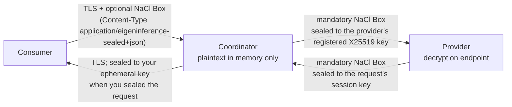

# Privacy expectations

> Last updated: 2026-09-03 · commit `5d400cf75`

What Darkbloom's coordinator and the serving provider can and cannot see when
you send an inference request. The mechanism — which key opens which hop, wire
formats, error codes, and the code that enforces each guarantee — lives in
[`../architecture/security/encryption.md`](../architecture/security/encryption.md);
this page is the consumer-facing summary and does not restate it.

## The statement

The provider is the decryption endpoint: the prompt and the completion are
plaintext inside the provider process, because in-process inference at native
speed requires it. The coordinator handles plaintext only in memory for the life
of one request (parsed for routing, cache affinity, and billing) and never logs
or stores it; the consumer → coordinator hop is TLS plus optional NaCl Box
sealing, and the coordinator → provider and provider → coordinator hops are
mandatory NaCl Box. The full per-party table is in
[`../architecture/security/encryption.md`](../architecture/security/encryption.md#what-each-party-can-observe);
code identity bounds *which* binary may act as the decryption endpoint.

Darkbloom is therefore **not** "the coordinator never sees plaintext". The
precise claim is that plaintext exists in the coordinator only in memory (the
production coordinator runs in a hardware-encrypted Confidential VM), is never
logged or retained, and is re-encrypted for the selected provider, which is
bound to an attested Secure Enclave identity
([`verification.md`](./verification.md)).

## Hop by hop

| Hop | What protects it | What you control |
|---|---|---|
| Consumer → coordinator | TLS always. Optionally seal the body to the coordinator's X25519 key from `GET /v1/encryption-key` and send it as `Content-Type: application/eigeninference-sealed+json`; the response comes back sealed to your ephemeral key with `X-Eigen-Sealed: true` | Whether to seal. Plaintext JSON on the same routes is accepted; the console's toggle defaults to off |
| Inside the coordinator | The body is opened in memory, parsed as JSON, re-marshalled and capped at 16 MiB, then sealed for exactly one provider. Nothing content-derived is logged or stored except keyed digests used for cache affinity; provider error text is reduced to a closed vocabulary; provider telemetry ingest is disabled (HTTP 410) | Nothing to configure |
| Coordinator → provider | A fresh X25519 session key pair per request seals the body to the provider's registered key, which is bound to its Secure Enclave attestation. Providers without a key, or failing any privacy gate, are never selected | Nothing to configure |
| Provider → coordinator | Every response chunk is sealed from the provider's static registered key to the request's session key; a plaintext or wrong-key chunk untrusts the provider and fails the request | Nothing to configure |

## What the coordinator can see

| Data | Visible to the coordinator? | Notes |
|---|---|---|
| Prompt and attached media | Yes, in memory for one request | Parsed for routing, cache affinity, and billing; never logged or stored |
| Completion text | Yes, in memory while relaying | Never logged or stored |
| Model, sampling parameters, `stream`, `max_tokens` | Yes | Stored as non-content request parameters |
| Token counts, latency, request and trace IDs, selected provider | Yes | Stored and logged; this is the billing and routing record |
| Your identity: API key hash, Privy DID, balance | Yes | Ledger and auth records |
| Provider identity and attestation state | Yes | Drives trust-based routing |

## What the coordinator cannot see

| Data | Why |
|---|---|
| Prompt or completion at rest | Never persisted; the only content-derived artifacts are keyed digests for cache routing |
| The provider's X25519 private key or Secure Enclave key | Live only in the provider process and the Secure Enclave |
| Your plaintext response after it leaves | When you sealed the request, the response is sealed to your ephemeral key before it is written |

## What the provider can see

By design the provider sees the plaintext prompt, the completion it generates,
and the model and sampling parameters. It does not see your API key or Privy
credentials, your balance, or any other consumer's prompts or responses. Which
provider gets your request is decided by the coordinator's routing gate
(`hardware` trust floor by default plus every privacy gate) — see
[`../architecture/security/attestation.md`](../architecture/security/attestation.md#routing-gate).

## Sender encryption is optional

`GET /v1/encryption-key` returns `503 encryption_unavailable` when the
coordinator has no configured key; in that deployment the consumer → coordinator
hop is TLS only. The coordinator → provider and provider → coordinator hops are
always sealed, regardless of whether you sealed your request.

## Logging policy

- Prompt and completion content is never written to logs or the store.
- Billing records hold token counts, model IDs, and costs, not text.
- Request logs hold metadata: model, token counts, latency, request and trace
  IDs, provider ID.
- The itemised list of what is retained and what is explicitly avoided, with
  the enforcing code, is in
  [`../architecture/security/encryption.md`](../architecture/security/encryption.md#what-the-coordinator-logs-and-retains).

## Related

- [`verification.md`](./verification.md) — reading the provider trust headers and the public attestation endpoint.
- [`../architecture/security/encryption.md`](../architecture/security/encryption.md) — canonical mechanism and privacy table.
- [`../reference/api-contracts.md`](../reference/api-contracts.md) — HTTP contract for the inference routes.
