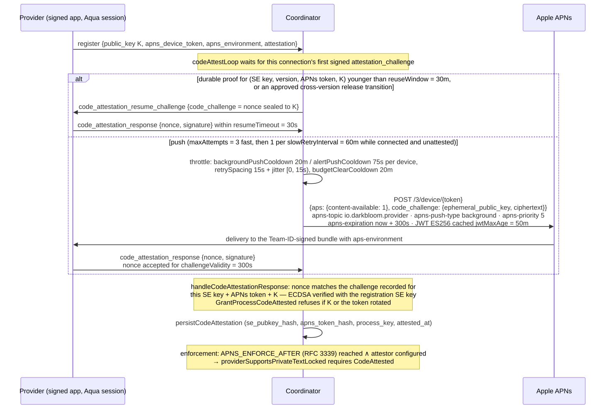
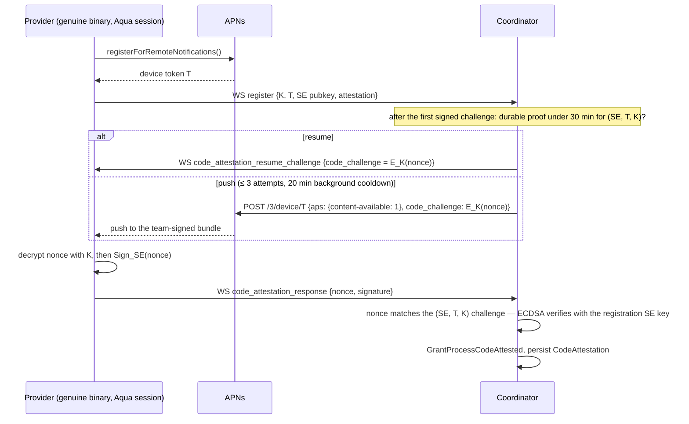

# APNs-based provider code-identity attestation

> Last updated: 2026-09-03 · commit `5d400cf75`

**Status:** Implemented (v0.6.0); as-built constants and behaviour below were
re-verified against the code on 2026-09-03. The living description is
[`../architecture/security/attestation.md`](../architecture/security/attestation.md#flag--apns-code-identity);
this record explains why the design looks the way it does.

## Context

In a permissionless network, the coordinator must be able to tell that a provider is running the genuine Darkbloom binary, not a fork that logs prompts. The attestation stack that existed before this decision proves the *device* and its SIP / Secure Boot posture (a Secure-Enclave-signed blob cross-checked against Apple's MDM `SecurityInfo`, with Apple Managed Device Attestation as an identity flag), but it does **not** prove which binary is running. A self-reported `binaryHash` cannot prove code identity, because the measurer is the potentially-malicious provider.

The canonical privacy model is unchanged by this decision: consumer→coordinator traffic is TLS plus optional NaCl Box; coordinator→provider traffic is a mandatory per-request NaCl Box to the provider's attested X25519 key; the coordinator decrypts bodies only in memory for routing and billing and does not log or retain prompt content; the provider remains the decryption endpoint. See [`../architecture/security/encryption.md`](../architecture/security/encryption.md).

## Decision

Add an APNs-delivered code-identity challenge whose proof is bound to the provider's Secure Enclave key, APNs device token, and process key `K`.

1. **Apple-gated channel.** Only a process that (a) is signed with our Developer ID, (b) carries our globally-unique App ID `io.darkbloom.provider`, and (c) is authorized by an Apple-signed provisioning profile with the `aps-environment` entitlement can receive a push for our topic. AMFI (`AppleMobileFileIntegrity`) enforces code signature, entitlements, and provisioning-profile validity at launch, so a modified or re-signed binary cannot register for our push topic.
2. **Encrypted challenge.** The coordinator pushes `E_K(nonce)` — a 32-byte nonce sealed to the provider's registered X25519 public key `K` with the same NaCl Box primitive used for inference bodies. `K` lives only in the provider's protected process memory. The push carries `aps: {"content-available": 1}` plus `code_challenge: {ephemeral_public_key, ciphertext}`; `apns-expiration` is now + 300 s (`challengeExpirySeconds`).
3. **WebSocket reply.** The provider decrypts the nonce with `K` and returns it with a Secure-Enclave P-256 signature over it (`Sign_SE(nonce)`) in `code_attestation_response`. The coordinator accepts the reply only if the nonce matches the outstanding challenge recorded for **this** SE key + APNs token + `K`, is unexpired (`challengeValidity` = 300 s) and unreplayed, and the signature verifies against the SE key bound at registration — never a key carried in the reply.
4. **Durable proof, per-connection re-proof.** A passing APNs round-trip is persisted as `CodeAttestation{se_pubkey, version, attested_at, apns_token, node_public_key, binary_hash}`. On a later connection, a proof younger than `reuseWindow` = 30 min for the same identity (or an approved cross-version release transition) authorises a **resume challenge**: a NaCl-sealed nonce sent over the WebSocket (`code_attestation_resume_challenge`, reply within `resumeTimeout` = 30 s) instead of an APNs push. Cached evidence only authorises the challenge; the `CodeAttested` flag is set by the live answer, and `GrantProcessCodeAttested` refuses if `K` or the APNs token rotated in between. (The original design kept the flag in memory per connection and re-pushed on every reconnect; that consumed the APNs background budget and stranded fleets after coordinator restarts.)
5. **Push budget.** APNs background pushes are rationed to roughly three per hour per device, so the throttle allows one background push per `backgroundPushCooldown` = 20 min (alert mode: `alertPushCooldown` = 75 s), `maxAttempts` = 3 per loop with `retrySpacing` = 15 s plus jitter in [0, 15 s), and lets a token rotation clear the budget at most once per `budgetClearCooldown` = 20 min. After three unanswered pushes the loop stops until the next reconnect; the flag simply stays false.
6. **Routing gate.** Private text traffic is gated at the single chokepoint `providerSupportsPrivateTextLocked`. Enforcement is a grace deadline: `SetCodeAttestationConfigured(true)` when an attestor exists and `SetCodeAttestationDeadline` from `APNS_ENFORCE_AFTER` (RFC 3339); `codeAttestationEnforcedLocked` is true only when both hold and the deadline has passed. Until then providers are challenged and coverage is measured, but nobody is derouted. Self-route relaxes the trust floor, not this gate.
7. **APNs mode.** The sender is dual-mode: `background` (default; `apns-push-type: background`, `apns-priority: 5`, silent, budget-throttled) and `alert` (`apns-priority: 10`, reliable but visible, `aps.alert = {title: "Darkbloom", body: "attestation"}`). Alert mode is safe only because the provider never requests `UNUserNotificationCenter` authorization, so the alert is not persisted to the Notification Center database.
8. **MDM remains required.** Code identity proves *which binary*, nothing about SIP or Secure Boot. The only working, non-circular SIP / Secure Boot proof is Apple's MDM `SecurityInfo`, which is the sole path to `hardware` trust; MDA rides the same channel as an identity flag. ACME `device-attest-01` never carried or verified the SIP OID and its leg was removed on 2026-07-03.

## Consequences

| Positive | Negative / Risk |
|---|---|
| Remotely-verifiable, non-self-reportable code identity with ~0 inference overhead. | Background push delivery is best-effort and budget-throttled (20 min cooldown, 3 attempts); unreliable delivery requires switching to alert mode. |
| No human allowlist required. | Requires an Apple-signed push provisioning profile, a `.p8` auth key, and CI assertions that the signed binary has no `get-task-allow`. |
| Fail-closed once enforced: un-attested providers are simply not routed private traffic. | Requires a logged-in macOS GUI session; headless or login-screen providers cannot receive APNs and are derouted once enforcement begins. |
| Durable proofs plus resume challenges keep reconnect storms off the APNs budget while still re-proving possession of `K` on every connection. | Does not prove exact cdhash/version; that gap is closed by reproducible builds plus a transparency log of blessed hashes (a release policy can approve cross-version transitions). |

## Relevant code paths

| Concern | Code path |
|---|---|
| APNs challenge builder + dual-mode sender, JWT (ES256, cached 50 min), expiry, hosts | `coordinator/apns/attestor.go` (`APNsPushAttestor.SendCodeChallenge`, `BuildCodeChallengePayload`, `challengeExpirySeconds`, `jwtMaxAge`, `Mode`) |
| Registration stores the token hash and starts the loop | `coordinator/api/provider.go` (`handleProviderWS`, `RegisterMessage.apns_device_token`) |
| Attestation loop, resume challenge, push, response verification | `coordinator/api/provider_codeattest.go` (`codeAttestLoop`, `codeAttestLoopForGeneration`, `sendCodeIdentityResumeChallenge`, `sendCodeIdentityChallenge`, `handleCodeAttestationResponse`) |
| Throttle constants, durable proofs, challenge bookkeeping | `coordinator/api/code_attest_throttle.go` (`newCodeAttestThrottle`, `reuseAttestation`, `matchChallengeForIdentity`, `persistCodeAttestation`) |
| Routing chokepoint and enforcement switch | `coordinator/registry/registry.go` (`providerSupportsPrivateTextLocked`, `codeAttestationEnforcedLocked`, `GrantProcessCodeAttested`) |
| Deadline parsing | `coordinator/cmd/coordinator/main.go` (`parseAPNsEnforceAfter`) |
| Wire messages | `coordinator/protocol/messages.go` (`RegisterMessage`, `CodeAttestationResumeChallenge`, `CodeAttestationResponseMessage`) |
| SE signature verification | `coordinator/attestation/attestation.go` (`VerifyChallengeSignature`) |
| Durable rows | `coordinator/store/interface.go` (`CodeAttestation`, `CodeAttestPushBudget`) |
| AppKit host / APNs delegate / no notification-authorisation invariant | `provider-swift/Sources/darkbloom/ProviderAppKitHost.swift` |
| Device-token bridge + early-push buffering | `provider-swift/Sources/ProviderCore/Apns/APNsBridge.swift` |
| Provider awaits token, decrypts and signs the challenge | `provider-swift/Sources/ProviderCore/ProviderLoop.swift` |
| Local readiness checks (`darkbloom doctor`) | `provider-swift/Sources/ProviderCore/Diagnostics/AttestationReadiness.swift` |
| Push entitlement | `provider-swift/entitlements.plist` (`com.apple.developer.aps-environment`) |
