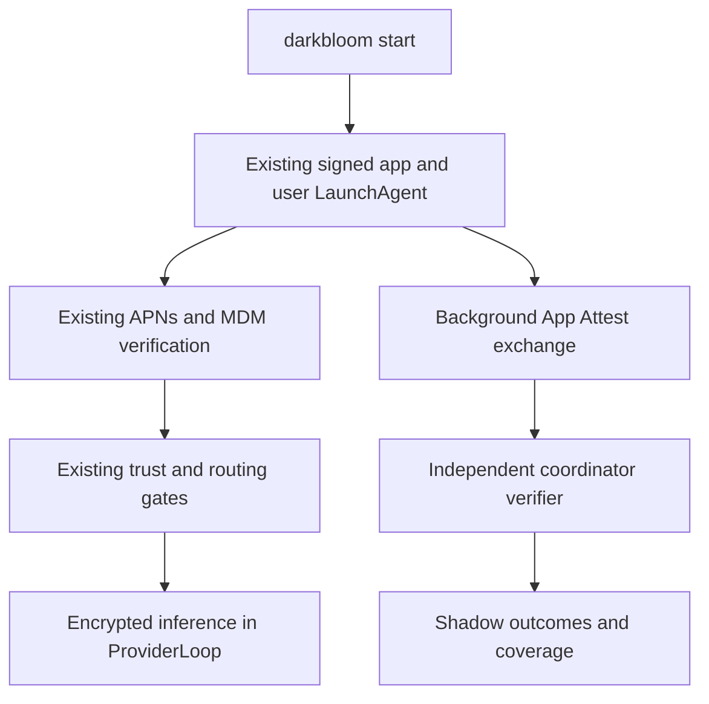

# App Attest shadow rollout alongside APNs and MDM

> Last updated: 2026-09-14 · commit `cc4847115`

Status: **In progress** — 2026-09-14 — [physical macOS 27 validation](../reports/2026-09-14-app-attest-macos27-validation.md) passes with a signed debug provider; final release-artifact and cohort qualification remain open.

The next release keeps APNs and MDM/MDA as its authoritative verification path. App Attest runs alongside that path in shadow mode: perform the real exchange, verify evidence on the coordinator, and record results without changing routing, trust, rewards, or supported OS versions.

## Release contract

- Worktree: `/Users/gaj/Documents/Builds/d-inference-app-attest`, branch `codex/app-attest-migration`.
- APNs registration, push entitlements, MDM enrollment, posture checks, trust reuse, and existing routing enforcement remain active.
- App Attest success grants no trust; failure, unsupported status, timeout, and missing observations remove no trust. There is no App Attest enforcement mode in this release.
- Network serving on existing supported macOS versions continues through the existing verification path. App Attest is attempted only where the real API reports support and the coordinator requests shadow work.
- Shadow network/crypto/storage work is bounded and runs outside the provider inference loop and coordinator WebSocket read loop. Its failures do not close the provider connection.
- Preserve CLI commands, user LaunchAgent behavior, canonical bundle identity, resources, installer, and updater. Add App Attest configuration alongside APNs; do not require a new app-launch mechanism merely to keep serving.
- Provider key/account associations and earnings remain under current rules. App Attest key rotation is not a new physical device or a rewards identity.

## Proposed flow

There is intentionally no edge from the shadow verifier to routing or trust mutation. Existing signed-process/decryption-key ownership must still be represented in the shadow transcript so a future migration does not test a weaker protocol.

## Implementation sequence

1. **Coordinator verifier and protocol.** Validate Apple's certificate chain, nonce, relying-party identity, environment, Mac ACL, fresh assertion, and increasing counter. Pin production roots; keep synthetic roots in tests. Negotiate protocol support so old providers never receive unknown frames. Bound work, payload sizes, outstanding challenges, timeouts, and retries.
2. **Provider shadow client.** Generate and persist an App Attest key only when requested. Perform key attestation once, then reuse the key for fresh connection assertions. Run asynchronously in the same process that owns the X25519 decryption key and MLX inference. Do not expose an arbitrary signing helper or accept caller-supplied inference keys. Report unsupported/error states without changing provider operation.
3. **Shadow observations.** Distinguish protocol not supported, service not supported, not attempted, timeout, Apple API failure, malformed/invalid proof, verified attestation, and verified assertion. Track cohort coverage and repeated sessions, not only successful responses. Correlate to coordinator-assigned provider/session identity and retain latency and current APNs/MDM comparison state. Never put raw certificates, receipts, tokens, or proof bodies into logs.
4. **Packaging coexistence.** Keep APNs grants and embedded profile requirements. Prepare App Attest environment/configuration and validate grants against the actual distribution profile. Do not invent private entitlements or ship an unauthorized entitlement. Check nested code signatures, Hardened Runtime, resource discovery, post-sign hashes, and update behavior using the real bundle, including legacy macOS launch/APNs/MDM regression checks with the updated profile. Unsupported packaging appears as shadow coverage failure, not a serving failure.
5. **Validation and release.** Prove with tests that all App Attest results leave trust/routing unchanged. Exercise API adapters with fakes, cryptography with signed test fixtures and Apple examples, and stores with concurrency/replay cases. Compile the real DeviceCheck adapter with available tools. Physical macOS 27 testing is a separate required acceptance step; this host is macOS 26.5.2 / Xcode 26.6.

## Data required before enforcement

Use connected providers as the denominator, segmented by OS version, provider build, hardware family, signing/distribution configuration, and launch mode where observable. Show legacy clients and unsupported devices explicitly. A missing report is not a success or proof of compromise. Provider-reported fields are diagnostic claims, distinct from server-verified evidence.

Measure enrollment and assertion success separately, including Apple errors, server verification failures, timeouts, persistence failures, observation drops, and latency. Check fresh installs, repeated reconnects, app updates, restart/reboot, sleep/wake, locked sessions, key loss/reinstall, and server restart. Compare successful and failed shadow sessions with the existing APNs/MDM verdicts without assuming those verdicts prove equivalence.

Before promotion, test hostile cases on a designated physical Mac: wrong identity/environment, app modification, swapped decryption keys, replay/concurrent sessions, and reuse of an old App Attest key after SIP/Full Security changes. Validate the exact required app metadata and distribution entitlements. Retaining the old chain while collecting data does not waive those checks.

Agree on minimum cohort coverage, observation duration, acceptable failure/latency rates, and unsupported-provider policy using actual fleet data. No automatic promotion based on an aggregate success rate. Older OS cohorts cannot become App Attest-supported through more observations.

## Later retirement (separate change)

After coverage and security evidence support enforcement, implement a reviewed cutover and only then delete APNs/MDM code, enrollment, profile tooling, infrastructure configuration, and obsolete fields. Resolve physical-device identity and hardware-tier/rewards assurance first: the documented App Attest payload does not supply an immutable serial or certified RAM inventory.

Removing runtime dependencies, withdrawing enrollment profiles on existing machines, and retiring live credentials/services are separate steps. Production actions remain governed by the [coordinator deployment runbook](../operations/coordinator-deploy.md). This release performs none of those retirements.

## Apple contract and evidence limits

Apple documents [app integration](https://developer.apple.com/documentation/devicecheck/establishing-your-app-s-integrity), [server validation](https://developer.apple.com/documentation/devicecheck/validating-apps-that-connect-to-your-server), and [validation examples](https://developer.apple.com/documentation/devicecheck/attestation-object-validation-guide). [Apple's macOS clarification](https://developer.apple.com/forums/thread/836329) restricts App Attest to full apps in a user context. Test the installed signed app; framework availability and an AppKit run loop alone do not establish eligibility.

App identity/version, client-signed model/hardware claims, and proof of inference correctness remain different things. The [privacy model](../architecture/security/encryption.md) still applies. A shadow pass is an observation, never a routing grant or a new privacy guarantee.

## Related

- [Current provider attestation](../architecture/security/attestation.md)
- [Provider identity binding](../architecture/security/identity-binding.md)
- [Existing APNs design](apns-code-attestation.md)
- [Provider release operations](../operations/provider-release.md)
