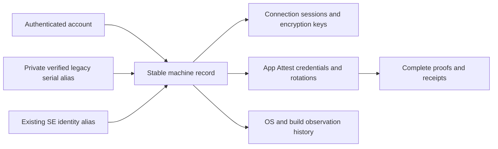

# App Attest release inventory, evidence archive, and machine identity

> Last updated: 2026-09-14 · commit `d90945f66`

Status: **In progress** — 2026-09-14 — machine inventory, stable identities, complete PostgreSQL proof/receipt archive, protocol 2 recovery/status, and private dashboard implemented in PR #995 for provider 0.9.3; final release qualification remains open. The [as-built reference](../reference/app-attest-shadow.md) describes the implementation. DeviceCheck is deferred.

The next coexistence release must measure unique machines and macOS 27 adoption,
and retain complete Apple attestations, receipts, and assertions. Keep APNs and
MDM authoritative while building that evidence. The
[physical Mac exchange](../reports/2026-09-14-app-attest-macos27-validation.md)
works; the [existing shadow reference](../reference/app-attest-shadow.md) describes
the narrower implementation currently in the draft.

## Release contract

- Preserve existing OS eligibility, APNs/MDM verification, routing, and payout rules.
- Add a stable machine record with a server-assigned opaque `machine_id` and
  authenticated account associations. Keep connection IDs and App Attest key IDs
  as separate identities with separate lifetimes.
- Count all observed providers in a stated time window, including older clients,
  unsupported OS versions, unconfigured apps, disabled shadow mode, and failures.
- Retain complete proof bytes for every attestation and assertion submitted
  through the negotiated, bounded protocol, including verification failures and
  replays. Retain initial and subsequently refreshed receipts. Do not substitute
  hashes or sampled successes for the requested evidence archive.
- Retain the rollout's evidence without introducing an automatic purge. Any later
  retention/deletion policy is a separate explicit decision.
- Keep raw proof data in private evidence storage. Ordinary logs contain indexed
  identifiers, outcomes, and timings. Inference request bodies and decrypted
  content do not belong in this archive.

## Why serial numbers are present today

The app already reads the serial locally; MDM is not the API needed to obtain it.
`provider-swift/Sources/ProviderCore/Security/AttestationBuilder.swift`
(`detectSerialNumber`) uses I/O Registry with a system-profiler fallback.
Its report and Apple's MDA certificate are different sources of evidence.

| Current use | Actual behavior and code |
|---|---|
| MDM device lookup | `coordinator/mdm/mdm.go` (`LookupDevice`, `VerifyProviderWithUDIDObserver`) resolves the enrolled device by serial. `coordinator/api/provider.go` (`verifyProviderAttestation`) warns that MDM verification cannot proceed without that serial in this path. |
| MDA proof association | `coordinator/api/provider.go` (`stageDurableMDAChain`) retrieves a cached chain by serial. `coordinator/registry/provider_evidence.go` (`SetMDAProofIfHardwareBound`) accepts an established SE-key binding or a matching serial; serial is not the only possible cryptographic binding. |
| Reconnect/history restoration | `coordinator/store/provider_restore.go` (`GetProviderForRestore`) finds prior state by serial first, then SE public key, excluding active sessions. |
| Duplicate connections | `coordinator/registry/provider_lifecycle.go` (`DisconnectDuplicatesBySerial`) evicts older connections reporting the same serial, preventing duplicate registrations from competing for one machine's resources. |
| Machine lists, counts, removal, and session history | `coordinator/api/me_handlers.go` (`recordIdentity`, `liveIdentity`) groups by serial with fallbacks. `RemoveProviderBySerial` and `DeleteProvidersBySerial` support removal. `admin-ui/src/lib/queries/providers.ts` (`listMachines`, `countMachines`) and related admin queries group historical rows by serial. |
| Failure history | `coordinator/registry/health_ejection.go` (`stableProviderIdentityLocked`) prefers serial, then SE key, then account when selecting the stable identity used by serving-health gates. A migration must not reset failure history. |
| Operational routing restrictions | `coordinator/registry/scheduler.go` (`providerMatchesAllowedSerial`) and `model_aliases.go` (`anyProviderCanServeAliasWithTraitsLocked`) support serial allowlists. |
| Accounting continuity | `provider_sessions` retains serials, but `coordinator/payments/baserewards/engine.go` (`uptimeByProviderKey`) groups uptime by provider key. `coordinator/registry/persistence.go` (`persistProviderNow`) records the X25519 provider key. Preserve existing ledger keys, intervals, balances, and associations; do not replace payout keys as a side effect of telemetry work. |

Do not infer that every stored or reported serial has been independently
corroborated by MDA. Record the identity evidence and its verification time.
Historical identity evidence may connect records without authorizing a current
serving session; live trust must still be established independently.

## Identity for this release

Use the verified legacy identity to establish machine mappings while MDM remains
available. Backfill eligible existing records and resolve new connections to the
same machine. Keep serials private as legacy aliases. A reported UUID or serial
alone must never attach an untrusted key to someone else's machine or history.

Keep provisional identities distinct when evidence is missing, and show their
counts explicitly. A later verified association can resolve them through an
audited alias/merge operation. Preserve original account, session, and evidence
attribution; a current ownership change must not expose another account's history.

Examples: twenty reconnects are one machine and twenty sessions; an approved key
rotation is one machine with two historical credentials; one account can own three
machines. App Attest key counts and ephemeral X25519 keys cannot serve as physical
machine counts. A machine record by itself grants no trust.

For this release, existing serial-based verification, duplicate handling, and
routing restrictions remain in force. New dashboards and evidence indexes use
`machine_id` with the legacy mapping. Migrate the remaining operational readers
incrementally, preserving failure/quarantine state and accounting history.

## Complete evidence archive

Keep a searchable metadata index and private storage for the exact submitted
proof bytes. Store the original proof field as well when base64 decoding fails.
Blob deduplication is allowed, but each submission and its outcome remain a
distinct audit record. Normal protocol size and rate bounds remain enforced;
oversized or refused input gets an explicit rejection/coverage record.

| Record | Required retained data |
|---|---|
| Initial attestation | Complete CBOR object, certificate chain, embedded receipt, credential ID, expected app/environment, associated machine/account/session, received time, and validation outcome. |
| Every assertion | Complete assertion bytes, key ID, expected challenge, canonical client data or exact transcript inputs, client-data hash, connection encryption public key, previous/received/accepted counters, received time, and outcome. |
| Every receipt version | Original and refreshed signed receipt bytes, associated credential, independently verified fields, renewal scheduling dates, fraud metric when present, and the server-request outcome. Never retain the bearer JWT or private signing key in an audit record. |
| Verification context | Protocol and verifier versions, coordinator build, policy version, trust-root identity, evaluated timestamps, rejection reasons, and the contemporaneous legacy comparison. |
| Coverage/lifecycle | Enrollment transaction ID, retries, acknowledgements, key replacement, disconnects, expiry, storage status, archive checksum, and missing/delayed evidence signals. |

Validate and persist through a durable ingestion/outbox path before acknowledging
acceptance; upload/batching can run asynchronously. If archival storage is
unavailable, pause new shadow work and expose the backlog/error. Never silently
discard accepted evidence or stall inference/legacy verification to wait for the
archive. An infrastructure failure remains observable; storage cannot promise
recording packets that the service never successfully receives.

Archive health must be measurable: received, durably recorded, archived, pending,
and failed counts must reconcile by event ID. Re-verification must use the captured
context and original evaluation time, rather than treating an old record as a new
live challenge or rejecting it solely because its certificate has since expired.

The current ten-minute assertion interval yields 144 scheduled assertions per
continuously connected machine per day, plus reconnects. Size and batch the archive
for that rate, including metadata and retries. Keep this work off the WebSocket
reader and provider inference actor.

## Adoption and health dashboard

Define current/24-hour/7-day windows explicitly. Provide distinct account counts,
verified machine counts, provisional identities, and session volumes separately.
For OS adoption, preserve observation time and source; show unknown and stale
values instead of silently dropping them.

The dashboard must distinguish:

1. All machines observed in the window, grouped by reported OS major/build,
   provider release, hardware family, and identity assurance.
2. Latest observed macOS 27+ versus ever observed on macOS 27+, including the first
   observed upgrade time and older/unknown cohorts.
3. Protocol-capable build, configured profile, API support, usable Keychain,
   enrollment attempt, verified attestation, and fresh verified assertion.
4. The proposed policy outcome (`eligible`, `ineligible`, or `unknown`) and its
   reasons, separate from cryptographic success.
5. Enrollment/assertion latency, errors, reconnect/retry/key churn, counter
   conflicts, missing metadata, legacy disagreement, and archive/receipt health.

Do not use only successful key rows, actively serving models, or App Attest
participants as the denominator. A disabled shadow flag must not disable basic
inventory observation. Logs/metrics complement the durable census and evidence
index; they are not the sole audit store. Keep high-cardinality machine/account
identifiers out of metric tags and use the private index for drill-down.

## Additional information to collect or investigate

| Source | Next step and evidence boundary |
|---|---|
| Apple fraud service | Implement independent receipt verification and server-side renewal, using the receipt trust root separately from the attestation root. Check identity, credential, challenge/client hash, creation time, type, and renewal dates. Apple's [fraud metric](https://developer.apple.com/documentation/devicecheck/assessing-fraud-risk) estimates attested keys for the app/device over the preceding 30 days; it is a risk signal rather than a permanent machine identifier. |
| App-generated signed status | Reuse existing OS/build, hardware, local serial, binary/runtime identity, and relevant configuration measurements. Bind their canonical values into assertions using [client data](https://developer.apple.com/documentation/devicecheck/establishing-your-app-s-integrity). The app supplies these claims; hashing them does not make Apple independently measure or certify them. Derive them locally and never expose arbitrary digest/identity signing to another process. |
| Additional Apple certificate extensions | Preserve all bytes. The captured certificate contains OS/build strings under extra tags, but their stable semantics are not established in our verifier. An enrollment certificate also must not be mistaken for a fresh OS observation after an upgrade. Do not generate new keys merely to refresh OS telemetry. |
| DeviceCheck's separate API | A signed user-session probe on the same macOS 27 Mac reports both `DCDevice.current.isSupported` and App Attest support as true; [captured result](../reports/evidence/2026-09-14-app-attest-macos27/devicecheck-availability.json). No token was generated or bit changed. Apple's [two-bit API](https://developer.apple.com/documentation/devicecheck/accessing-and-modifying-per-device-data) offers server-maintained device flags through an ephemeral token. Validate the token/server round trip and define any flag ownership/meaning before using it. It does not supply a general permanent device ID or a hardware inventory. |

The app can continue reading a serial after MDM is removed. A future App Attest
assertion can bind that report, and shadow mode can compare it with MDA's certified
serial. That is a useful possible migration path, with a different evidence source.
Test whether relevant local properties can be spoofed under the required security
conditions before using that report for security or reward deduplication. Do not
assume equivalence from matching benign samples.

Define a Mac-specific build policy from the signals actually available. The
observed absence of Apple's app-version/category extensions must remain explicit;
do not manufacture them from a client report. Evaluate any substitute based on
the app's internally derived, assertion-bound build identity and the approved
release catalog as a separate policy path, with tampering/update tests. Until
that policy is qualified, its prospective result remains unknown.

If serial collection is eventually removed too, persist a machine registration
and use authenticated recovery/transfer with credential revocation. Reinstall or
reset may then need explicit relinking. Without a trustworthy physical alias,
describe those counts as registered machine identities rather than claiming a
cryptographically guaranteed count of physical Macs.

## Remaining build sequence

1. **Machine inventory and aliases:** additive schema, migration/backfill,
   authenticated associations, provisional identities, OS observation history,
   and coverage for old and disabled clients.
2. **Complete archive and receipt ingestion:** exact bytes, validation context,
   durable ingestion/acknowledgement, independent receipt checks, private access,
   and storage-health accounting. Establish archival capture before fleet
   enrollment begins; discarded historical proofs cannot be reconstructed.
3. **Credential reliability and fraud renewal:** account-scoped Keychain records,
   recoverable enrollment acknowledgements, controlled rotation, aggregate retry
   budgets, operation timeouts, and receipt refresh jobs.
4. **Signed status and full prospective policy:** bind the necessary local claims,
   check approved builds, compare legacy evidence, and represent missing signals
   as unknown. Keep the decision observational.
5. **Dashboard and drill-down:** unique machines/accounts, OS adoption, stage
   conversion, failure reasons, complete evidence history, and archive/receipt
   health, using the durable read model.
6. **Release qualification:** final signed/notarized artifact, real inference,
   older-OS APNs/MDM regressions, installation/update/recovery, account changes,
   archive outage/load tests, and security-transition/reboot tests on a designated
   machine. Assert that shadow success, failure, and storage outage preserve the
   current serving and payout decisions.

Protocol additions must cover both Swift registration encoders as well as the
Go decoder and transcript. Keep receipt parsing, archive I/O, identity resolution,
and policy evaluation in separate modules. The future enforcement/deletion steps
remain in the [retirement design](app-attest-retirement.md); this release does
not perform them.
