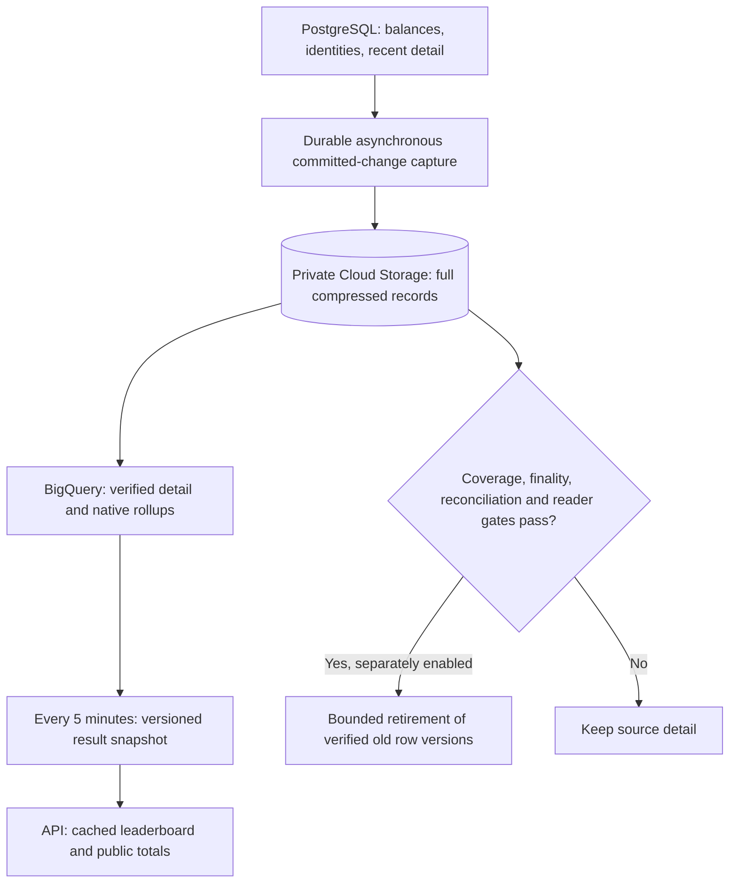

# Archived analytics and verified source retention

> Last updated: 2026-09-26 · commit `bcf5dcce9`

Status: In progress · 2026-09-26. Archive copying and SQL previews exist; continuous capture, native analytical rollups, product cutover and archive-aware source deletion are not implemented. This design prepares the stage after the [copy-only archive](../operations/accounting-history.md).

## Decision

Preserve full records in private compressed Cloud Storage. Use BigQuery for historical analysis and asynchronous analytics computation. Serve leaderboard and public totals from small, durable snapshots cached in the API, refreshed every **5 minutes**. Keep authoritative balances, settlement/refund identities and active workflows in PostgreSQL.

The draft [retention policy](../../scripts/telemetry_archive/retention-policy.proposed.json) records a **14-day target** for the nine archived detail tables, with deletion disabled. It is a design artifact, not runtime configuration. Every existing archive receipt still has `retention_eligible=false`. A completed snapshot plan alone cannot enable deletion.

## What is already built

- A separate worker copies five telemetry and four accounting tables, preserving full row JSON/type information in compressed Parquet, with immutable receipts/checkpoints and BigQuery views.
- Amounts remain exact integer micro-USD; count, hash, generation and exact accounting totals are verified before publication.
- The `analytics-preview` command in `scripts/telemetry_archive/src/telemetry_archive/analytics_preview.py` compiles or runs SELECT-only queries for leaderboard, network totals and hourly usage series. It pins an immutable catalog generation and labels all output as shadow/unqualified for serving or deletion.
- `scripts/telemetry_archive/src/telemetry_archive/analytics_sql.py` preserves the current work/base-reward/ledger-reward split, excludes ledger-only recipients from provider cohorts, includes anonymous earnings in network money totals, casts operands before summing and preserves rank tie-breaking. Half-open time windows end at an explicit `--as-of` timestamp.

## Ordered implementation and acceptance gates

| Step | Deliverable | Acceptance gate |
| --- | --- | --- |
| 1. Finish preservation | All nine frozen historical plans; exact reconciliation and published catalogs | Each plan has verified `complete=true`; report duplicate snapshots separately; quantify already-expired/unavailable history instead of claiming to recover it |
| 2. Continuous capture | Transactional outbox or CDC with commit-position handoff, replay and revisions | Concurrent backfill/live writes, late commits below max ID, corrections, deletes, process crash and replay preserve exact row versions without double counting |
| 3. Analytical projections | Native BigQuery detail/rollups partitioned by event date and clustered by account/model where measured useful | Incremental upserts of affected IDs/buckets; never add a refresh snapshot as another payment; exact sums/cohort membership compare with source at the same committed cut |
| 4. Public serving | Atomic versioned result snapshot for all 4 windows and 3 ranking metrics, plus network totals; API cache loads snapshot asynchronously | 5-minute target; publication only after complete coherent inputs, numerical validation and shadow parity; warm requests perform no historical scans; compare measured latency/cost |
| 5. Financial invariants | Compact, durable earning/refund/floor-settlement identity records and missing per-key/account rollups | Repeated job credit, refund or floor epoch after detail retirement is still exactly once; balance transitions remain atomic |
| 6. Archive-aware retention | Disabled-by-default coordinator policy and one bounded retirement worker | Every required gate below passes; dry-run first; explicit production enablement follows review |
| 7. Reclaim/resize | Space-reclamation plan and actual hot working-set measurement | Normal DELETE usually frees pages for reuse, not provisioned disk; evaluate physical compaction/partitioning and resizing separately |

The current archive maximum-ID cutoff is **not** a commit watermark. Select a CDC/outbox mechanism before promising a 5-minute source freshness SLA or automatic retention. Account records retain exact money; summaries supplement, rather than replace, the raw archive.

## Reader migration map

| Consumer / owning code | Current source | Preparation / dependency |
| --- | --- | --- |
| `PostgresStore.Leaderboard`, `coordinator/api/leaderboard.go` | Work/base `provider_earnings` plus reward `ledger_entries`; cache miss can trigger full aggregation | Shadow SQL now; later serve precomputed snapshots with existing pseudonymization at API boundary |
| `PostgresStore.NetworkTotals`, `coordinator/store/postgres_analytics.go` | Multiple earnings scans and provider-cohort reward join | Same snapshot generation/windows as leaderboard; keep anonymous earnings semantics |
| `UsageTimeSeries`, `coordinator/store/postgres.go` | Raw `usage` buckets | Hourly preview now; later minute/hour/day projections preserve exact rolling boundaries and current chart contract |
| `UsageLocationBuckets`, `UsageFlowBuckets` | Raw `usage`, provider/location join; `postgres_analytics_locations.go` and `postgres_analytics_flows.go` | Keep sum/count pairs for weighted coordinates and exact provider membership; choose explicit event-time versus current provider-location semantics before migrating |
| `AccountEarningsWindows`, `postgres_dashboard.go` | Last24h/7d `provider_earnings` | Compact account time buckets; keep private billing freshness independent from public analytics |
| `KeySpendSince`, key history, `postgres.go` | `usage` and key attribution | Preserve budget/spend enforcement and old detail paging before dropping usage history |
| Earnings/ledger history and recovery migrations | Detail plus `earnings_summary` and `usage_totals` | Archive-aware authenticated pagination; retain migration baselines; never silently truncate old history |

Existing open PRs overlap: [#1140](https://github.com/Layr-Labs/d-inference/pull/1140) fixes leaderboard query-error semantics; [#1144](https://github.com/Layr-Labs/d-inference/pull/1144) adds an all-time summary fast path. Integrate/rebase their applicable work before coordinator cutover. Review #1144's writer/backfill boundary for the current settlement implementation; do not accept approximate financial splits as an exact reconciliation gate.

## Snapshot serving contract

- Generate the four windows `24h`, `7d`, `30d`, `all` using the same `as_of` and consistent earnings/ledger capture watermark. Maintain source-version deduplication before aggregation. An event-date filter is not evidence of complete source coverage.
- Snapshot metadata: schema version, immutable catalog/rollup generation, commit watermark per input, `source_complete_through`, `as_of`, `generated_at`, checksum, and reconciliation report ID. Capture lag and computation age are distinct.
- Aim to refresh every 300s. Proposed source-age bound 600s and result-age bound 900s are initial rollout settings; label stale data and refuse expired/missing results with 503. Archive lag/error must retain the last acceptable snapshot, never manufacture an empty leaderboard. Do not silently trigger full-history PostgreSQL scans on a cache miss after cutover.
- Write all rankings (top 200 for each metric), network totals and metadata before atomically selecting one generation. API limits 1–200 slice this result; metric tie ordering remains account ID ascending. Raw account identifiers stay private and are pseudonymized by the API. No public bucket is needed.
- Validate results fit existing API signed-INT64 fields before publication. Compute sums with arbitrary precision/BIGNUMERIC; never truncate or float-round overflow. Token/job totals and money must preserve the same provider cohort semantics as the source.
- Daily-only aggregates cannot exactly reproduce arbitrary rolling 24h/7d/30d cutoffs or sum distinct provider counts across days. Use complete interior buckets plus exact boundary events, or fixed snapshot cutoffs with a documented as-of contract. Align all windows in the same snapshot.

## Retention gates

1. For each candidate range, establish durable capture of all committed inserts and corrections through a transaction/commit boundary. Revalidate the exact row versions under the source retirement transaction; a late update must make a row ineligible or enter the durable change feed atomically.
2. Verify object existence/generations, decodability, count/ID/hash and exact monetary totals, queryability, restore behavior and legal/operational holds. Keep independent integrity receipts; archive expiration remains unset.
3. Preserve source financial idempotency **before** deletion. `CreditProviderAccount` in `postgres_provider_credit.go` relies on `provider_earnings(job_id)`; `CreditWithdrawableOnce` in `postgres.go` relies on ledger account/type/reference; floor settlement in `postgres_machine_floor_settlement.go` relies on provider/epoch and canonical machine identities. TTL-expiring these fences would permit duplicate money movement.
4. Replace/bound every reader above, including migrations/recovery paths, and reconcile compact summaries. Active payments, withdrawals, unsettled refunds and current balances stay durable.
5. Replace the existing profiler sweeper with archive-aware eligibility as part of the coordinator change. Today `StartProfilerLoops` / `PruneTelemetry` prune profiles/outcomes at 14 days and fleet at 30 days without archive receipts; routes/rejections have no equivalent sweep. Model demand's 31-day projection cleanup is a separate policy.
6. Start dry-run only. Later enable one bounded deleter with progress checkpoints, statement/lock/runtime/row/WAL budgets, replica/load pause thresholds and resumable retries. Never execute `DELETE WHERE created_at < now()-14days` against these tables merely because an archive job succeeded.

## Verification before cutover

Test empty windows, base-reward-only accounts, ledger-only accounts, blank account IDs, negative corrections, ties, rank limits, large exact amounts, overlapping snapshots, boundary timestamps, late commits/updates, missing archives, stale snapshots, timeouts and restart/replay. Compare exact outputs at an identical source boundary; then measure p50/p95 latency, rows scanned, source CPU/I/O and bytes billed. Tiny-pilot query success is not production latency or full-history correctness evidence.

Google documents that external tables can be slower than native BigQuery tables: [external table limitations](https://docs.cloud.google.com/bigquery/docs/external-tables). Use [scheduled queries](https://docs.cloud.google.com/bigquery/docs/scheduling-queries) or an explicitly bounded worker to build frequently reused results after incremental projections exist; avoid rescanning the full archive every 5 minutes.
