# Bonsai 2 session trial: implementation and test plan

> Last updated: 2026-09-18 · commit `954f570d1`

Status: In progress · 2026-09-18 · Four implementation drafts; disabled until model qualification and operational enablement.

Give signed-in users a lifetime allowance of 5,000,000 Bonsai 2 input and output tokens. Use login-session authentication, preserve paid API-key behavior, and display an actionable error when the allowance is exhausted. No remaining-token display or quota polling endpoint is required.

## Product contract

| Decision | Proposed behavior |
|---|---|
| Eligibility | A successfully verified Privy session, the configured Bonsai 2 model, and chat-completions requests. Streaming and non-streaming both qualify. A scripted session request qualifies too; browser origin is not an authorization boundary. |
| Identity | Quota belongs to the coordinator account ID, not a JWT, browser, API key, machine, or individual model build. Existing and new accounts qualify. |
| Allowance | One lifetime 5,000,000-token allowance. No daily/monthly reset. Count provider-reported prompt plus completion tokens, including repeated conversation history and cached prompt tokens once. Thinking tokens already included in completion tokens are not counted again. |
| Models | Configure the actual public Bonsai 2 identifier and permitted resolved builds from the registry when model support lands. Match exact identities, never a name substring. Alias updates do not create fresh quota. Raw permitted builds share the same allowance. |
| Model pricing | Bonsai 2 input rate = Qwen 3.8 27B input rate / 10; Bonsai 2 output rate = Qwen 3.8 27B output rate / 10. Read the actual configured Qwen rates before setting Bonsai prices; do not substitute fallback constants. |
| Paid behavior | API-key requests and other models retain existing billing. An exhausted Bonsai session request fails even if the account has money. No automatic conversion to paid inference. |
| Providers | Free-trial tokens still generate real provider earnings at the Bonsai 2 pricing policy. Darkbloom funds the payout; the consumer pays zero. Credit the provider's withdrawable balance through the existing earnings and payout system, with subsidy expense recorded separately. Existing owned-machine free routing takes precedence and consumes no trial tokens. |
| Frontend | Ordinary chat uses a fresh login token. An explicitly adopted key remains selected and restricted until the user intentionally chooses Login session. Keep API-console/key-management behavior separate. No quota meter, token-remaining badge, or polling. Existing chat error rendering shows the specific error. |
| Initial scope | Text chat and the request features supported by Bonsai's registry entry. Reject unsupported shapes through existing validation; do not grant trial access to unsupported multimodal inputs. Responses/completions/messages endpoints remain on their existing billing paths. |

The lifetime window and input-plus-output counting continue the assumptions accepted during scoping. Bonsai's production registry identity remains an integration dependency: this checkout has no Bonsai registration to verify.

## Pricing and provider payment contract

The model price and the party paying it are separate decisions. Bonsai 2 has nonzero model prices; an eligible login session changes the payer to Darkbloom, not the value of the provider's work. Paid API requests use the same configured Bonsai base rates through the existing paid-billing path.

```text
bonsai_input_rate  = configured_qwen_3_8_27b_input_rate  / 10
bonsai_output_rate = configured_qwen_3_8_27b_output_rate / 10

trial_consumer_charge = 0
trial_provider_credit = provider payout for the actual usage at Bonsai rates
trial_funding_source  = Darkbloom subsidy
```

Use the existing database-backed model pricing (`coordinator/api/billing_handlers.go`, `handleAdminPricing`; `coordinator/payments/pricing.go`). Resolve the active Qwen public model to its actual billed build and capture the source input/output rates, units, and retrieval time. Configure Bonsai's rates from that snapshot at launch. Later Qwen changes do not automatically reprice Bonsai or in-flight requests; any repricing is an explicit configuration update. The public pricing endpoint was verified on 2026-09-18: `EigenLabs/Qwen3.8-27B-4bit-mtp` has input `150000` and output `2000000` micro-USD per million tokens. The derived Bonsai values are `15000` and `200000`, respectively ($0.015 input and $0.20 output per million). These are launch configuration values, not a claim that Bonsai pricing has been published.

Rates are currently integer micro-USD per million tokens. Validate division by ten is representable before configuration; never silently truncate to zero or claim an exact ratio after rounding. If the verified source rate needs finer precision, include that storage/arithmetic change explicitly before launch. Verify alias members and active provider-specific overrides resolve to the intended Bonsai rate; reconcile conflicting overrides before enablement rather than allowing a higher override to silently change the subsidy.

The 1/10 ratio applies separately to input and output token rates. Existing per-request minimums and currency rounding mean a short request's final settlement need not be exactly 1/10 of the corresponding Qwen request. Preserve the existing minimum-charge policy in this plan and test it explicitly; no global pricing-floor change is implied. Preserve the existing provider fee policy, so the trial discount never reduces a provider's credit relative to equivalent paid work under the same pricing and fee policy.

Provider earnings must be durable and withdrawable, not just a usage metric. The free-trial settlement calls the same transactional earning/balance primitives as paid inference, with a unique request identity preventing duplicate credit. Existing payout eligibility and withdrawal rules still apply. Test the payout path with its external payment boundary stubbed; this plan does not initiate real transfers or promise an external transfer before it completes.

## Error contract

Return HTTP 402 before streaming starts when settled allowance usage reaches the limit:

```json
{
  "error": {
    "type": "insufficient_quota",
    "code": "bonsai_trial_exhausted",
    "message": "Hey, you've used all 5 million free tokens for Bonsai 2. You can continue with a funded API key in the API Console."
  }
}
```

Use the existing error serializer. The client must recognize the code before its generic 402-to-buy-credits mapping, preserve the coordinator message, and show it for send and retry. Errors preserve the existing encrypted-response contract.

Do not claim the user exceeded 5 million tokens: rejection happens at the limit. Three other states need distinct messages:

| State | Status / code | Message |
|---|---|---|
| Other live requests hold enough tokens to prevent this request | 429 / `bonsai_trial_busy` | Your free Bonsai 2 allowance is currently reserved by another request. Wait for it to finish, then try again. |
| Some allowance remains, but this request's safe token bound cannot fit | 402 / `bonsai_trial_request_too_large` | This request exceeds your remaining free Bonsai 2 allowance. Try a shorter conversation or a smaller response. |
| Quota storage, settlement recovery, or campaign service is unavailable | 503 / `bonsai_trial_unavailable` | Free Bonsai 2 chat is temporarily unavailable. Please try again later. |

Do not automatically retry a generation after an ambiguous transport failure. A disabled trial rejects eligible session requests with the unavailable error rather than silently charging them. A restarted campaign keeps its existing campaign identity and usage.

## Current code and changes

| Area | Current evidence | Implementation |
|---|---|---|
| Browser credentials | `console-ui/src/hooks/useAuth.ts` (`provisionConsoleKey`) provisions keys; `console-ui/src/lib/http/proxy-client.ts` (`proxyHeaders`) reads the saved key. | Separate session identity from inference-key provisioning. Ordinary chat and its shared page components must not provision or wait for an API key. Audit all consumers before moving provisioning; preserve explicit API-key workflows and do not revoke saved keys. |
| Chat transport | `console-ui/src/hooks/useChatStream.ts` (`runStream`), `console-ui/src/lib/chat/stream.ts` (`streamChat`), `console-ui/src/app/api/chat/route.ts` (`POST`). | Obtain a fresh access token for each send/retry, pass it explicitly, and forward Authorization through the proxy. Do not read a saved API key in session mode. Reject ambiguous dual credentials, never fall back to a key after session failure, and preserve sealed bodies byte-for-byte. |
| Chat readiness | `console-ui/src/app/chat/page.tsx` (`ChatPage`) gates model loading, submit, and retry on `apiKeyReady`. | Gate ordinary chat on session readiness. Audit models, encryption-key, and shared chat dependencies so a fresh account with no key can complete the flow. |
| Auth and eligibility | `coordinator/api/server.go` (`requireAuth`) verifies Privy tokens and separately accepts API keys, admin keys, and provider tokens. | Stamp a typed verified auth kind in context. A missing API-key ID is not proof of session auth. Add a focused trial policy helper that checks auth kind, endpoint, campaign status, and resolved model identity. |
| Admission | `coordinator/api/consumer.go` (`handleChatCompletions`, `dispatchWithReserver`), `coordinator/api/inference_admission.go` (`reserveInferenceBalance`). | Acquire a durable token reservation before dispatch; eligible requests bypass consumer money reservations and provider-price top-ups only. Preserve existing routing, capacity, account RPM/TPM, and validation checks. |
| Lifecycle | `coordinator/registry/pending_request.go` (`PendingRequest`), `coordinator/api/settlement.go` (`holdForSettlement`), `coordinator/api/consumer.go` (`refundReservedBalance`). | Carry one logical trial reservation across sequential attempts and retries. Disable simultaneous speculative copies for sponsored requests. Add explicit release/settle handling even when ReservedMicroUSD is zero; existing money-refund early returns must not skip token cleanup. |
| Accounting | `coordinator/api/provider.go` (`handleCompleteAt`) calculates cost, settles the consumer, records usage, and credits providers. | Branch into a focused sponsored-settlement helper. Persist quota settlement, subsidy expense, consumer-zero usage, and provider credit atomically or via a durable idempotent transaction/outbox. Prefer one Postgres transaction for the trial branch. Do not route the request through the self-route zero-payout branch. |
| Persistence | `coordinator/store/interface_domains.go`, `coordinator/store/postgres.go`, `coordinator/store/memory.go`, `coordinator/store/cached.go`. | Add narrow trial store methods with Memory/Postgres parity and decorator support. Quota reads and writes bypass TTL caches. Reuse transaction-level earning/ledger helpers instead of duplicating financial logic. |
| Error rendering | `console-ui/src/lib/chat/stream.ts` (`chatErrorMessage`) rewrites all 402 responses. | Match trial codes first, preserve their text, and retain existing generic paid-balance behavior. No quota-display component. |

New files should separate trial policy, reservation lifecycle, store transactions, and settlement. Keep orchestrator changes small. No provider wire or Swift changes are expected for the promotion; Bonsai inference support is separate.

## Reservation and accounting design

Use a stable campaign identifier independent of model builds. Add an allowance row keyed by `(account_id, campaign_id)` with `used_tokens` and `reserved_tokens`, and request rows keyed by a coordinator-generated logical reservation ID. Request rows hold the account/campaign, reserved amount, durable lifecycle state, actual usage, serving attempt, provider payout, subsidy cost, and timestamps. Do not persist prompts or JWTs. Persist the admission-time eligibility/pricing policy needed to finish requests across config changes.

Reserve with a database transaction and row lock or conditional update enforcing `used_tokens + reserved_tokens + requested_reservation <= 5_000_000`. Create the first allowance row safely under concurrent requests. Store-level idempotency, not an in-process mutex alone, protects two coordinators sharing Postgres.

Reserve the ready registry model's entire enforced context length as the prompt bound, plus the enforced output bound. The existing byte-based estimate is not qualified as a strict tokenizer bound. This conservative choice can reject requests near the allowance boundary even when a shorter prompt would fit; reducing conversation length alone does not reduce the reservation. Qualify the actual Bonsai provider context enforcement before enablement. Normalize and validate output limits through the existing `ensureMaxTokensBound` path, including aliases, context constraints, multiplicity, and integer overflow. Reserve the prompt bound plus the enforced output bound. Actual terminal usage refunds the difference. Near the limit this can reject a request that might have fit with exact tokenization; use the request-too-large error, not the exhausted error. Exact prompt tokenization is a later refinement if this becomes material.

The normal invariant is `0 <= used_tokens + reserved_tokens <= limit`. Never clamp or under-record invalid provider usage to hide an overrun. Negative, overflowed, missing, or above-reservation reports enter an explicit unresolved state with their reservation retained and diagnostic logging; do not charge the consumer or create unvalidated provider earnings. Validating Bonsai's upper bound is an enablement requirement, not an assumption that tests can skip.

| Transition | Durable effect |
|---|---|
| Reserve | Atomically reserve quota and create request state. No consumer debit. |
| Dispatch | Mark dispatch intent durably before sending to a provider. Sequential retries reference the same logical reservation, and require proof the preceding attempt did no billable work. Simultaneous speculative copies are disabled. |
| Valid completion | The committed serving attempt atomically converts reservation to actual used tokens, writes zero consumer cost and separate subsidy cost, and credits the eligible provider once. |
| Failure before dispatch or a genuine provider terminal proving no work | Release the reservation once; no quota use or provider payout. Preserve existing failure semantics. |
| Consumer disconnect after output | Keep the reservation while awaiting the provider terminal; settle valid reported usage once, including partial generation. |
| Missing terminal after delivered output, crash after dispatch intent, or ambiguous DB result | Preserve unresolved durable state. Do not blindly refund and enable disconnect/restart quota bypass. A valid late completion may settle the retained hold; manual operational reconciliation requires durable evidence. There is no automated recovery worker or trial admin endpoint in this initial implementation. Unresolved holds cannot be released by the ordinary unused-release call. Unresolved holds may reduce availability but must not be reported as settled exhaustion. |
| Owned provider serves a prefer-owner request | Release the trial hold and use existing zero-cost self-route settlement; no trial subsidy or quota consumption. |

No reusable customer dollar credits or new sponsor-wallet product is needed. The sponsored transaction records the cost as a platform expense and creates the existing provider earning/balance entry using the pricing and payment contract above. Record no consumer spend, referral commission, or apparent paid consumer revenue for these requests. Financial reporting must distinguish subsidy expense from paid inference revenue. Quota use counts only the committed logical request, never speculative losers. Settled records remain authoritative after process restart; recovery and terminal processing share the same idempotency key.

Exclusive self-route continues to work after trial exhaustion. For prefer-owner requests, use a trial hold for public fallback; once exhausted, permit only owned-machine service or return the trial error, never fall back to paid public service. This preserves the existing owned-machine promise without bypassing the trial cap.

## Before and after

```mermaid
flowchart TD
  subgraph Before
    B1[ChatPage waits for apiKeyReady] --> B2[streamChat sends saved API key]
    B2 --> B3[requireAuth resolves account]
    B3 --> B4[reserveInferenceBalance debits user]
    B4 -->|No funds| B5[402 buy credits]
    B4 -->|Funds| B6[handleCompleteAt settles user and provider]
  end
  subgraph After
    A1[ChatPage ready with login session] --> A2[streamChat sends fresh JWT]
    A2 --> A3[requireAuth stamps verified session]
    A3 --> A4[Trial policy checks Bonsai and endpoint]
    A4 -->|Eligible| A5[Store reserves account token allowance]
    A5 -->|Exhausted| A6[402 bonsai_trial_exhausted shown verbatim]
    A5 -->|Admitted| A7[Dispatch with shared trial reservation]
    A7 --> A8[Sponsored settlement: quota and provider credit]
    A8 --> A9[Consumer pays zero; subsidy expense recorded]
    A4 -->|Other model or API key| A10[Existing paid billing]
  end
```



## Implementation sequence

1. **Policy, pricing, and error contract:** pin the campaign/model identities, derive Bonsai input/output rates from verified Qwen 3.8 27B prices divided by ten, and define the typed session-auth marker, endpoint eligibility, error codes, and feature switch. Write eligibility and pricing tests first.
2. **Store and quota:** schema, reserve/settle/release/recovery methods, database constraints, transaction-level provider-credit reuse, and Memory/Postgres contract tests. Update the disposable database harness's cleanup tables.
3. **Coordinator integration:** trial admission, zero-dollar reservation cleanup, retry/backup propagation, bounds validation, sponsored completion, cancellation, unresolved-state recovery, and existing-rate-limit preservation.
4. **Session chat:** split provisioning from login state, forward session credentials, fix readiness dependencies, and preserve trial errors in plaintext and encrypted responses. No meter or remaining-allowance API.
5. **Integration and review:** run the matrix below, inspect changed financial/reporting paths, and make a behavior-preserving modularity pass. Update API, configuration, billing, storage, consumer docs, and changelog with the implementation.

## Test specification

These 60 cases are implementation acceptance tests, not claims of tests already passing. Parameterize repeated cases for MemoryStore and PostgresStore, streaming and non-streaming, and encrypted/plaintext transport where relevant. Use the existing API billing harness and deterministic mock provider; use real Bonsai only for the final prompt-bound and serving smoke checks.

### Authentication and eligibility

| ID | Setup / action | Required assertions |
|---|---|---|
| A01 | Fresh session account, zero balance, Bonsai chat | Admitted; no key needed; no consumer debit. |
| A02 | Same account uses an API key | Normal pricing and spend/key restrictions apply; no trial mutation. |
| A03 | Valid session selects a different model | Normal paid behavior; Bonsai quota untouched. |
| A04 | Missing, expired, forged, or malformed JWT; admin and provider tokens | Invalid auth rejected; other valid credential types never gain trial eligibility. A token prefix or empty KeyID cannot authorize a trial. |
| A05 | Forge free/session/account/model headers or request fields | Eligibility derives only from verified identity and validated model; no spoofed subsidy. |
| A06 | Public alias, permitted raw build, approved fallback build, similarly named unrelated model | First three share one quota; unrelated model never qualifies. Revalidate fallback membership. |
| A07 | Rotate login token, log out/in, use another device, then another account | Same account keeps usage; separate account has independent quota. |
| A08 | Session calls chat, responses, completions, messages; disable/re-enable campaign | Only chat qualifies; disable never switches to paid; in-flight admitted requests settle; re-enable preserves usage. |

### Quota and concurrency

| ID | Setup / action | Required assertions |
|---|---|---|
| Q01 | New account receives two simultaneous first requests | Exactly one allowance row; both reservations obey the same cap. |
| Q02 | Used=4,999,900; hold=100; settle prompt=60/output=40 | Used becomes exactly 5,000,000; next request returns exact exhaustion code/message; no dispatch or money mutation. |
| Q03 | Used=4,999,900; safe requested hold=101; no pending holds | Request-too-large, not exhausted; no state change. A hold of 100 remains admissible. |
| Q04 | Reserve 1,000; settle prompt=200/output=100 | Used increases 300; reserved decreases 1,000; 700 becomes available. |
| Q05 | Available=1,000; two concurrent holds of 700 using independent DB connections | Exactly one accepted; other returns busy while hold is live; totals never exceed cap. |
| Q06 | Repeat reserve, settle, and release; race settle vs release | One legal terminal transition wins; no negative counters, duplicate payout, or reopened quota. |
| Q07 | Omit limits; use each supported limit alias; conflicting/invalid/huge limits and n | Effective provider bound matches reserved bound; invalid/overflow inputs rejected before reservation. |
| Q08 | Long histories, Unicode, system text, tool schemas, cached prompts, reasoning output | Bound covers supported Bonsai shapes; terminal prompt+completion counted once; cached/thinking subtotals not double-counted. |
| Q09 | DB restart, two coordinator instances, cache wrapper, DB fault/ambiguous commit | Durable counters survive; no TTL-cached admission; faults return unavailable and retry is idempotent. |

### Request lifecycle and recovery

| ID | Setup / action | Required assertions |
|---|---|---|
| L01 | Malformed or unsupported request, unknown model, rate-limit rejection | No trial reservation or provider payment. |
| L02 | Capacity rejection, queue timeout, dispatch/encryption/write failure before confirmed service | Safely unused reservation released exactly once; original failure preserved. Ambiguous dispatch retains hold. |
| L03 | Retry another provider before output | One logical reservation; only committed serving attempt settles. |
| L04 | Speculative winner and loser complete in either order | Winner counts once; loser/late frames cannot consume quota, release winner's hold, or create duplicate payout. |
| L05 | Cancel before dispatch | Hold released; no quota use or payout. |
| L06 | Disconnect after output; valid partial-usage terminal arrives | Actual usage and provider payout settle once; no blanket refund. |
| L07 | Missing terminal or coordinator restart after dispatch intent | Unresolved hold survives; no free reset, false exhausted message, or unverified earning; reconciliation releases only with evidence. |
| L08 | Completion races cancellation, expiry/recovery, duplicate terminal | One persistent result across all orderings; no duplicate credits or negative counters. |
| L09 | Negative/overflow/above-bound/missing usage; DB fails during settlement | No invalid usage or payout committed; retain recoverable hold; valid retry resolves once. Transaction rollback leaves all financial effects absent. |

### Billing and routing regressions

| ID | Setup / action | Required assertions |
|---|---|---|
| B01 | Trial success with zero and positive consumer balances | Balance and withdrawable funds unchanged; consumer cost zero. |
| B02 | Eligible linked provider serves trial | Bonsai pricing produces the same provider earning and withdrawable credit as equivalent paid work under the same pricing/fee policy; subsidy expense recorded; no fabricated consumer revenue. |
| B03 | Provider custom pricing and minimum charge | Trial never tops up consumer funds; subsidy and payout use documented price policy. |
| B04 | Repeat/recover settlement with referral account and nonzero fee override | Provider credited once; no trial referral payout or internal subsidy represented as paid-user fee revenue. |
| B05 | Paid API traffic on same Bonsai model/account | Existing reservation, refund, cost, per-key attribution, allowlist, and key spend limits unchanged. |
| B06 | Exhausted trial account has ample paid balance | Still returns exhausted; no paid fallback or consumer debit. |
| B07 | Exclusive self-route, prefer-owner hit, prefer-owner public fallback, exhaustion | Owned service stays free without quota use; public fallback consumes trial; exhausted public fallback fails. |
| B08 | Account RPM/TPM reached; no payout destination; provider failure | Existing limits and provider eligibility/failure rules still apply; zero consumer charge does not bypass them. |

### Model pricing and provider payment

| ID | Setup / action | Required assertions |
|---|---|---|
| P01 | Seed different Qwen input/output rates, each divisible by ten | Bonsai input equals input/10 and output equals output/10; no swapped rates, blended ratio, or fallback defaults. Use clearly synthetic rates, not claimed production prices. |
| P02 | Missing Qwen price/build, zero/negative rates, or division needing finer precision | Configuration validation fails explicitly; no silent default, zero-rate trial, or inaccurately advertised 1/10 ratio. |
| P03 | Input-only, output-only, mixed usage, zero usage, and tiny requests | Independent arithmetic matches Bonsai rates with existing minimum and currency-rounding rules; ratio assertions apply to rates rather than minimum-floored invoices. |
| P04 | Public alias/build fallback, conflicting provider override, price change while in flight | All enabled builds use the intended configured rates; override conflicts are caught; in-flight settlement uses its recorded policy; new Qwen prices do not silently alter Bonsai. |
| P05 | Same provider and usage through trial and equivalent paid path | Equal provider credit under the same pricing/fee policy; trial user debited zero; real earning and withdrawable balance entries present; subsidy expense reconciles; duplicate terminal cannot pay twice. |
| P06 | Withdraw eligible trial earnings through existing payout flow with external calls stubbed | Trial earnings are available to the normal payout flow; successful payout updates balances/status once; failed or retried payout preserves existing refund/idempotency rules. No real external transfer is made by the test. |

### Frontend and proxy

| ID | Setup / action | Required assertions |
|---|---|---|
| U01 | Fresh login, no saved key, mount entire chat page with shared components | Models load; send/retry enabled; no automatic key-creation request from any mounted component. |
| U02 | Send and retry with rotated/expired session token | Fresh token used; auth failure shown; no API-key fallback, key-expired provisioning loop, or ambiguous generation replay. |
| U03 | Saved unrelated key plus active login | An untracked legacy key is ignored by session chat; an explicitly adopted key remains selected until a deliberate session-mode switch. API console retains explicit key behavior. |
| U04 | Proxy receives JWT, API key, both, or neither | Single intended credential forwarded; dual credentials rejected; missing auth remains unauthorized. |
| U05 | Exhaustion, too-large, busy, unavailable, and ordinary insufficient-funds responses | Trial messages survive exact-code handling; generic paid 402 copy unchanged; send and retry both display errors. |
| U06 | Encrypted and plaintext request/response, SSE and non-streaming | Sealed bytes unchanged; error decrypts; content type/status preserved; busy Retry-After forwarded when available. |
| U07 | Logout/account switch during token acquisition or stream | Stale async work cannot send using the next account or display old private chat as new-account content; quota stays with authenticated account. |
| U08 | Successful stream, stop, retry, and exhaustion render | Existing streaming/stop/error UI works; no quota meter, remaining-token endpoint call, or polling introduced. |

### Regression and deployment checks

| ID | Setup / action | Required assertions |
|---|---|---|
| R01 | Empty database and existing populated database migrate | Tables/constraints created safely; existing balances/usage untouched; rerun is idempotent. |
| R02 | Existing API auth, billing, service-account, self-route, cancellation suites | All pass without changing expected paid behavior. |
| R03 | Existing store parity, earning deduplication, cached-store suites | Trial methods work through decorators; normal user/model invalidation remains correct. |
| R04 | Existing chat, proxy, auth, API-console, and encrypted-stream tests | Existing intentional key flows preserved; no session tokens in snippets/localStorage/logs. |
| R05 | Deterministic randomized reserve/settle/release schedules | Accounting invariants hold after every operation; use fixed seeds and barriers, not sleep-based races. |
| R06 | Real Bonsai tokenizer/template and bounded-generation fixtures | Measured prompt usage never exceeds tested safe bound; enforced output limit holds for supported shapes. This is mandatory before enablement. |
| R07 | Roll back/disable with live reservations and later re-enable | No automatic paid conversion, quota reset, stranded completed payout, or repeated settlement; schema rollback not required. |
| R08 | Inspect metrics and persisted trial rows | Exhausted/busy/unavailable/over-bound/unresolved/subsidy outcomes distinguishable; no prompts/JWTs or high-cardinality account tags in metrics. |

### End-to-end acceptance

| ID | Scenario | Required assertions |
|---|---|---|
| E01 | Sign in as new zero-balance user and chat with Bonsai through Next.js and coordinator | Successful response and provider credit; zero consumer debit; no API key minted. |
| E02 | Seed test account near quota and complete final permitted request | Next send and retry show exact 5-million-token exhaustion message before streaming; account balance unchanged. |
| E03 | Same account sends paid API-key request and a session request for another model | Both retain normal billing; neither resets/uses Bonsai trial quota. |
| E04 | Two browser sessions near limit, disconnect one, restart coordinator, reconcile | Combined quota bounded; durable recovery/idempotency demonstrated; no false exhaustion while tokens are merely held. |

## Verification and release

Place focused tests beside their owning modules, using names such as `TestBonsaiTrial_ConcurrentReservation`, `TestBonsaiTrial_SettlementAfterDisconnect`, and `TestBonsaiTrial_APIKeyRemainsPaid`. Reuse `coordinator/api/billing_settlement_test.go`, `coordinator/api/settlement_clientgone_test.go`, `coordinator/store/harness_test.go`, and `console-ui/src/components/chat/ChatWorkspace.test.tsx` as harness patterns, not as substitutes for new behavior coverage.

Run focused Go tests with the race detector against MemoryStore and a dedicated disposable Postgres database, including two independent store/server instances. The existing Postgres harness truncates tables: never use production, staging, or shared development databases. Explicitly fail the feature verification job if Postgres tests are skipped. Then run coordinator unit tests, UI Vitest, lint, typecheck/build, and docs checks. Exercise the Next.js-to-coordinator flow with a deterministic provider, followed by the Bonsai-specific integration smoke once model support exists. No full Swift suite is needed unless provider code changes.

Deploy behind a disabled campaign configuration; apply schema and coordinator support before switching chat authentication and enabling the offer. Verify the actual model IDs, provider availability, prompt bound, and accounting first. Enablement must preserve prior trial usage, including rollback/re-enable. Production deployment/configuration changes remain subject to the repository's operation-specific human approval rule. Draft PR preparation makes no deployment or production configuration changes.

Completion requires all 60 specified scenarios covered by executable tests or explicitly identified integration evidence, a reviewed migration and recovery path, verified Qwen reference prices and derived Bonsai rates, green relevant regressions, and documentation of any unresolved limitation. This document alone does not satisfy implementation completion.
