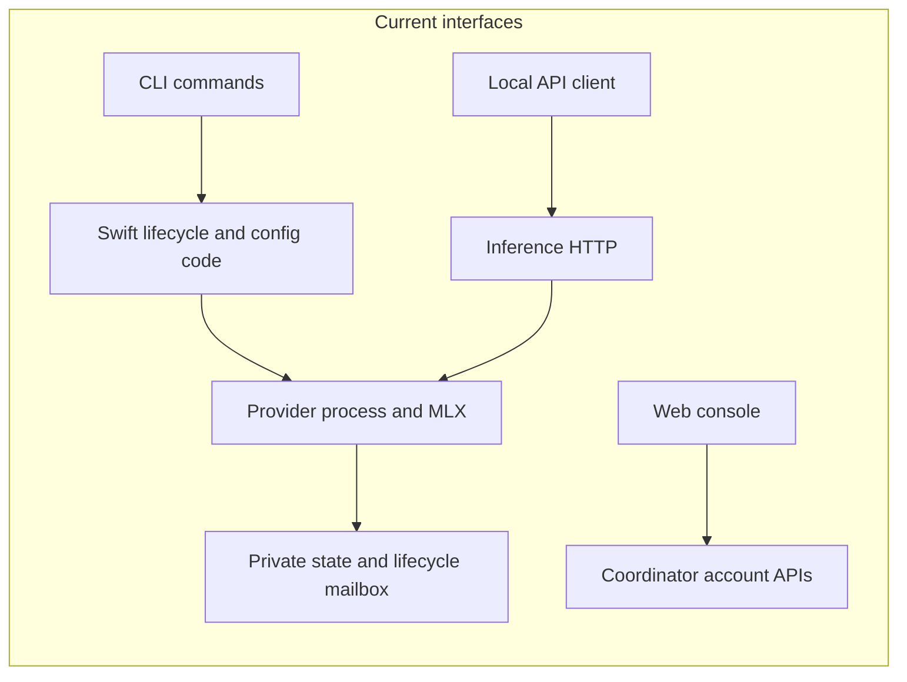
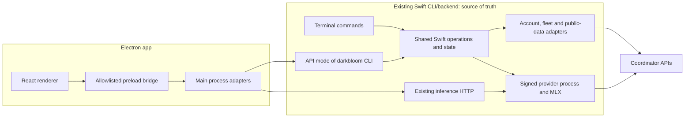

# Darkbloom macOS app implementation plan

> Last updated: 2026-10-01

Status: **In progress** — 2026-10-01 — Electron frontend and Swift CLI API implemented locally; release qualification remains open.

Build a fresh Electron frontend for the existing Swift CLI/backend. The CLI is
the backend and source of truth: it owns operations, state, validation, and
integration with the coordinator. Electron displays backend state and requests
changes through supported APIs. This plan defines the interface, delivery
order, and evidence required before the app is ready to distribute.

## 1. Product decisions and scope

The agreed product is a provider companion with local inference controls. The
[desktop prototype](https://darkbloom-desktop-ui.vercel.app/) supplies the feature
organization; the [landing page](https://www.darkbloom.ai/) supplies the brand.
The prototype's sample accounts, history, hardware, and simulated actions are
design references, not evidence that corresponding APIs exist.

| Decision | Plan |
|---|---|
| Platform | macOS on Apple Silicon first; establish the supported OS range from the signed runtime and Electron combination in milestone M0 |
| UI | Electron, React, TypeScript; packaged local frontend assets |
| Native engine | Existing Swift provider, MLX, memory policy, identity, and attestation |
| CLI/backend | Authoritative Swift implementation; existing CLI commands remain independently usable and expose the same operations to the app |
| Appearance | Landing typography, logo, dark surfaces, blue accent, spacing, and motion adapted for a desktop utility |
| Local ownership | One provider installation and one active provider owner per user; no second engine started by the GUI |
| Remote machines | Account-authorized snapshots in v1; local hardware controls apply only to This Mac |
| Distribution | Signed and notarized desktop app; provider artifacts retain their own identity and update rules |

### First release: all prototype screens

- Onboarding: runtime installation/detection, account linking, hardware/readiness
  checks, model selection, and first successful start.
- Home: this Mac's status, real operational activity, account earnings, and
  independently refreshed public network totals.
- My Macs: fleet overview, This Mac controls, remote snapshots, and explicit
  stale/unavailable states.
- Models: catalog, download/cancel/retry, storage, serving selection, and
  runtime-derived memory eligibility.
- Machine details: overview, diagnostics, supported settings, and cooling status.
- Studio: enable the authenticated local endpoint, show connection details, and
  verify local inference using the same loaded models where supported.
- Menu bar, notifications, update state, and recovery guidance.

The first release includes Leaderboard, Updates, Cooling, and the other prototype
screens. The user confirmed automatic app/backend updates, persistent menu-bar
access, provider independence from window closing, and remote status/earnings only.
Hardware-specific controls remain capability-gated, with native qualification
required before distributing them.

General-purpose agents, workspace tools, chat-history products, remote machine
commands, model-policy redesign, and new financial workflows are outside this
release. Billing and payout management can open the existing web console.

## 2. Verified starting point

Source was inspected at local master `1693685eefb6fe46745f13cfb8361188f95961d5`.
Rebase implementation branches and recheck the items below before changing them.

| Existing capability | Code and implication |
|---|---|
| Shared local inference HTTP | `provider-swift/Sources/ProviderCore/Server/LocalInferenceHTTP.swift`, `makeLocalInferenceApplication`: local-only and combined local/network serving share the HTTP implementation; combined serving reuses provider model slots |
| Local endpoint discovery | `provider-swift/Sources/ProviderCore/Server/LocalEndpoint.swift`, `LocalEndpoint`: discovery and bearer credentials already exist; these are inference credentials, not the new management contract |
| Provider supervision | `provider-swift/Sources/ProviderCore/Service/LaunchAgent.swift`, `LaunchAgent`: launchd manages the provider; an explicit stop persistently disables its automatic startup |
| Graceful lifecycle | `provider-swift/Sources/darkbloom/ServiceDrain.swift`, `ServiceDrain`: drain, process identity, updater exclusion, and coordinator acknowledgement precede replacement |
| Runtime state | `provider-swift/Sources/ProviderCore/Service/DaemonStateFile.swift`, `DaemonState`: process identity, observation time, trust, slots, capacity, and operations are already reported; missing fields have compatibility meaning |
| Model selection changes | `provider-swift/Sources/ProviderCore/Service/ProviderModelSwitch.swift`, `ProviderModelSwitchRequest`: changes bind to a process identity and have their own outcomes |
| Config serialization | `provider-swift/Sources/darkbloom/ConfigMutation.swift`, `withMutableConfig`: a stable sidecar lock and reload-under-lock prevent lost edits |
| Device linking | `provider-swift/Sources/ProviderCore/Auth/DeviceAuth.swift`, `AuthTokenStore`; `provider-swift/Sources/darkbloom/LoginCommand.swift`, `performTerminalDeviceLogin`: a browser-approved device flow persists the provider credential |
| Account and public data | `coordinator/api/server.go`, `routes`, `requireAuth`, `requirePrivyAuth`: earnings, fleet, account summary, leaderboard, and network totals have different authentication requirements |
| Signed runtime bundle | `.github/workflows/release-swift.yml`: `io.darkbloom.provider` is a provisioned `Darkbloom.app`; the main executable and bundle context matter to attestation |
| Canonical installation | `scripts/install.sh`, `commit_staged_app`: installs under `~/.darkbloom/Darkbloom.app` and maintains CLI symlinks |
| Cooling | [Fan-control reference](../provider/fan-control.md): an optional privileged Swift helper, signed peer checks, ownership recovery, and expiring provider activity leases already exist |
| Brand assets | `landing/src/app/globals.css`, `:root` and font faces; `landing/public/fonts/LICENSE.md`: exact tokens and PP Telegraf assets are present, with a separate proprietary font license |

The old [native app PR #645](https://github.com/Layr-Labs/d-inference/pull/645)
remains a source of lessons about bundle identity and local controls, not the
implementation base for this fresh Electron app. Its older source must be
reconciled with current lifecycle and attestation behavior before any reuse.
No existing Electron implementation was found in the inspected main checkout.

Related open work observed during planning includes
[launchd replacement #1315](https://github.com/Layr-Labs/d-inference/pull/1315),
[job terminology #1301](https://github.com/Layr-Labs/d-inference/pull/1301),
[readiness presentation #1242](https://github.com/Layr-Labs/d-inference/pull/1242),
and [machine self-routing #1308](https://github.com/Layr-Labs/d-inference/pull/1308).
These are integration checkpoints, not assumed merged dependencies.

## 3. Architecture and ownership

The existing `darkbloom` Swift backend exposes its operations through a local
API. Existing terminal commands and API handlers call the same Swift operation
code. The app does not become a provider manager, maintain a second configuration,
recalculate readiness, or take ownership of coordinator business logic.

For API availability when inference is stopped, add a lightweight API-serving
mode to the existing CLI binary, tentatively `darkbloom api serve`. This mode can
run as a user-scoped process independently of the inference workload. It is an
entry point into the CLI/backend, not a new backend product or replacement CLI.
It never constructs a second model engine. The CLI owns its discovery, launch,
recovery, and update behavior.

References below to the API process mean this mode of the existing Swift CLI.
There is no separate mandatory control executable or Electron-owned backend.





| Owner | Responsibilities |
|---|---|
| React renderer | Screens, accessible controls, formatting, transient UI state, chart presentation |
| Preload bridge | Typed, narrowly scoped requests and subscriptions; no generic shell, filesystem, URL fetch, or IPC forwarding |
| Electron main | Windows, menu bar, notifications, native dialogs, frontend update client, and a typed connection to the CLI/backend |
| Swift CLI/backend | Authoritative operations and state; config serialization, downloads, lifecycle, readiness, diagnostics, credentials, account/fleet/public-data adapters, and API serving |
| Swift provider | MLX, loaded models, admission, memory limits, accepted work, coordinator connection, identity and attestation |
| Coordinator | Account authorization, fleet records, accounting, public totals, and existing server-side policy |

### Avoid a second implementation of provider policy

Expose existing CLI functionality by extracting reusable Swift handlers only
where needed. Terminal commands retain argument parsing/output and their
independent usability; API handlers return typed results/progress from the same
implementation. Do not require every terminal command to call a new daemon.
Keep launchd, updater, config, and lifecycle locks shared across terminal and API
entry points so simultaneous callers cannot race outside API serialization.

The coordinator remains the authority for its ledger and remote account data.
The Swift backend fetches and interprets those records for the app; this does
not introduce a local accounting ledger. Electron formats results and handles
UI interactions, without duplicating eligibility, earnings, or serving policy.

The existing process-bound lifecycle mailbox can remain a private native adapter.
It does not become a public API for Electron or community clients. Any new live
model command must bind to the correct provider identity and validate on the
provider, including under concurrent coordinator-driven model changes.

Bootstrap commands are the narrow exception to calling a running service:
installation, discovery, and starting/recovering the CLI's API mode must work
when it is absent. Use supported machine-readable CLI/bootstrap commands with
fixed actions, validated paths, bounded output, and timeouts. Keep this adapter
small; it must not parse human-readable terminal output or implement a parallel
supervisor. Avoid recursive CLI-to-API-to-CLI invocation.

## 4. Local management contract

### Transport and trust

Use authenticated loopback HTTP/JSON plus SSE for management v1, using the
existing Swift HTTP stack. Bind only to `127.0.0.1` on an allocated port. Store
the endpoint, protocol version, instance identity, and a cryptographically random
management credential in an atomically written, user-owned discovery record.
The directory is private and the record is `0600` from creation.

The management credential is distinct from provider account credentials and
local inference keys. Electron main and the CLI read it; the renderer does not.
Validate discovery ownership and file type, reject symlinks where appropriate,
and cross-check the service process identity rather than trusting a reusable PID.
Rotate the management credential on service restart and reconnect through
discovery. This boundary protects against other users and browser callers; it
does not claim isolation from malicious code already running as the same user.

Management has no browser CORS allowance. Reject unexpected `Origin` and `Host`
values, authenticate before processing request bodies, and require JSON for
mutations. Enforce body, concurrency, event-buffer, and request-duration limits.
Generic proxying, arbitrary executable paths, and arbitrary file reads are not
management capabilities. A future Unix-domain-socket transport can use the same
contract; remote management is a separate authorization design.

### Proposed API groups

These routes are proposed additions, not existing endpoints. Publish their JSON
schemas and examples under `contracts/desktop-control/`, generate TypeScript
types, and validate Swift encoding/decoding against the same fixtures in CI.
Contract generation must be reproducible and check for uncommitted drift.

| Group | Proposed route | Required behavior |
|---|---|---|
| Discovery | `GET /control/v1/hello` | Protocol range, service/provider versions, service instance ID, runtime identity, and explicit capabilities |
| Snapshot | `GET /control/v1/state` | Revision, observation timestamps, runtime state, readiness, config revision, and current operations |
| Events | `GET /control/v1/events` | Ordered, bounded SSE stream with replay cursor and explicit resync |
| Provider | `POST /control/v1/provider/start`, `/stop`, `/restart` | Durable operation ID; native lifecycle rules, target identity, and bounded drain |
| Models | `GET /control/v1/models`; `POST /control/v1/models/plan`, `/download`, `/serving` | Catalog and installed state; native load/storage plan; validated desired serving set |
| Operations | `GET /control/v1/operations/{id}`; `POST /control/v1/operations/{id}/cancel` | Reconnectable progress; cancellation only at supported safe points |
| Settings | `GET`, `PATCH /control/v1/settings` | Schema-validated settings; expected revision; desired and effective values plus restart requirements |
| Device linking | `POST /control/v1/link/start`, `/cancel`; `GET /control/v1/link` | Browser URL/code, expiry, status; provider token stays native |
| App data | `GET /control/v1/account`, `/fleet`, `/network`; `POST /control/v1/account/sign-in`, `/sign-out` | Backend-owned account session, identity mapping, and scoped coordinator projections with separate freshness/error states |
| Diagnostics | `POST /control/v1/diagnostics`; `GET /control/v1/cooling` | Structured, bounded results with observation times and capability reasons |
| Studio | `GET`, `PATCH /control/v1/local-endpoint` | Enable/disable, mode, port, auth-required status, and effective configuration |

Explicit reveal/copy of an inference key is a separate user action; the key is
absent from normal snapshots, events, diagnostics, telemetry, and clipboard
history maintained by the app. Add update and privileged-cooling actions only
with their owning native workflows; do not overload settings PATCH to trigger
them.

### State, operations, and consistency

1. Keep service reachability, provider process state, network authorization,
   model readiness, and paid work as separate fields. A live process does not
   imply an available model or successful paid work.
2. Report unavailable and stale data explicitly. Missing optional fields are
   unknown; empty arrays are known empty. Include `observed_at`, source, and a
   freshness policy for each independently refreshed domain.
3. Identify every mutation with a client request ID and target installation.
   Repeated identical IDs return the same operation; reuse with different input
   is a conflict. Persist bounded operation/deduplication metadata before
   dispatching irreversible steps, and reconcile after a service crash.
4. Operations expose queued/running/succeeded/failed/cancelled/interrupted states,
   phase, measured progress where available, structured error code, and retry
   guidance. An HTTP disconnect never silently cancels provider work.
5. The initial snapshot and event cursor refer to the same revision. Events carry
   instance ID and monotonic sequence. On a replay gap or service restart, discard
   the old cursor and fetch a new snapshot. Slow consumers resync rather than
   creating unbounded memory growth. Coalesce high-frequency gauges.
6. Settings writes use expected revisions and the existing cross-process config
   lock; reread under lock, preserve unrelated keys, and return effective state.
   External config edits also invalidate the revision. A timeout is an unknown
   outcome until reconciled, not permission to overwrite a newer setting.
7. Model plans are advisory snapshots with a revision/expiry. The executing
   native handler revalidates memory, disk, current slots, and runtime ownership.
   It preserves the existing full-load estimates, activation reserve, KV budget,
   post-load checks, and provider/coordinator synchronization rules.
8. A provider's lifecycle or update operation excludes conflicting serving-set
   changes. Independent downloads may continue within explicit disk/concurrency
   budgets. Return a busy/conflict outcome rather than queueing obsolete intent.

The Swift backend holds model downloads and durable operation state, so closing
or crashing the GUI does not lose them. After an API-process crash, operations are
reconciled against actual files, runtime identity, and native operation status;
completed changes are not blindly replayed.

## 5. Lifecycle and installation

### Three distinct lifetimes

| User/system event | Required outcome |
|---|---|
| Close window | Hide the window; provider and accepted work continue |
| Quit desktop app | Exit Electron; provider, CLI API process, and native recovery remain independent |
| Stop provider | Native drain and acknowledgement, then persistent stop; a timeout remains visibly draining |
| Restart provider | Drain and restart the identified owner; preserve serving mode/configuration |
| Provider crash | Existing native watchdog policy owns recovery; Electron reconnects and displays state |
| CLI API-process crash | launchd restores the API process; the backend reconciles operations without starting a second provider |
| Sleep/wake | Connections resync; report observation gaps; native fan lease and runtime recovery retain ownership |
| Login/reboot | Respect persisted provider start/stop intent; GUI login preference is a separate choice |
| Remove desktop app | Does not implicitly uninstall the shared CLI, models, provider identity, or privileged helper |

The CLI's API-serving LaunchAgent uses its own label, tentatively
`io.darkbloom.control`, and a service lock prevents duplicates. Starting API mode
must never start inference as a side effect. Force-stop is an explicit separate
operation with an interruption warning; normal timeouts do not escalate to it.

### Bundle strategy to prove first

Use a distinct GUI bundle identity, tentatively `io.darkbloom.desktop`, installed
as `/Applications/Darkbloom.app`. Preserve the signed provider bundle identity
`io.darkbloom.provider` and its canonical user installation under
`~/.darkbloom/Darkbloom.app`. The identical display filename in different
locations must not cause discovery to select the GUI as the provider.

Ship or obtain a pinned, compatible, signed provider payload through the existing
artifact verification model. Install it into the canonical runtime location;
the active provider must not run from a transient download, mounted disk image,
or inside an Electron bundle that auto-update will replace. The exact payload
delivery method is selected in M0 after proving size and signing behavior.

Installation is user-scoped and should not require administrator access for
ordinary inference. Existing installations are discovered and reused after
identity/version checks; do not downgrade a compatible newer runtime or overwrite
user config, models, keys, or account links. Refuse ambiguous installations and
offer an explicit repair path. Installation and runtime update share the current
native update exclusion mechanism.

API mode runs from the existing signed CLI/backend bundle. If fresh installation
requires a small separately bundled installer, it gets only the entitlements it
needs; it does not inherit the provider's restricted entitlements by convenience.
Signed-package qualification must prove the actual provider's
keychain access, attestation, SwiftPM resources, MLX metallib, and optional fan
helper behavior after installation and update. See
[provider release operations](../operations/provider-release.md).

## 6. Account data and onboarding

### Account access stays in the CLI/backend

The desktop reuses the native device-code linking flow and provider credential.
Existing `GET /v1/me/providers` and `GET /v1/me/summary` remain Privy-only and are
not called with that credential. A dedicated `GET /v1/provider/desktop` projection
accepts an active provider token and returns only the owning account's fleet
status and earnings. Consumer API keys are rejected; revocation is checked before
cached responses; per-machine history is scoped to both account and earning key.

Swift owns credential storage, linking, unlinking, and coordinator access.
Electron displays the one-time code and opens the allowlisted verification URL.
It receives neither the provider token nor permission to call arbitrary remote
URLs. Account/payout administration opens the existing console in the system
browser. Local-only operation remains independent of account linking.

The native state identifies This Mac using its observed attestation identity;
unknown matches stay unknown. Remote snapshots carry no control endpoints and
omit underlying device keys. Public network totals load independently of the
account projection. A future product requiring interactive account mutations
needs its own scoped authorization design.

### Onboarding sequence

1. Welcome and inspect: identify hardware, runtime installation, effective
   configuration, and existing provider state without changing them.
2. Install or connect: verify the signed CLI/backend and its API mode; provide
   progress, cancellation before activation, and a repair result on failure.
3. Choose network contribution or local-only use. Local-only operation does not
   require an account or network enrollment.
4. For contribution, link the provider through the existing native device flow
   and display the actual coordinator authorization requirements and outcomes.
5. Select an eligible model using the registry and native storage/load plan;
   download through the Swift backend with progress and retry.
6. Start explicitly, show loading/authorization/readiness independently, and
   verify the selected mode works. An eligible idle Mac is a valid success;
   immediate paid traffic is not promised.

Closing onboarding and returning later resumes from observed state. Browser
denial, expired codes, unavailable catalog, insufficient disk, missing resources,
unsupported hardware, and offline network each have a specific recovery action.

## 7. Screen and data contract map

| Screen | Data/actions | Completion criterion |
|---|---|---|
| Home | CLI/backend snapshot/events, account earnings, and public totals | Each domain loads/fails independently; current work and historical earnings are labeled distinctly |
| My Macs | Authorized fleet projection; stable machine identity mapping | This Mac is identified by an API identity join, never name/chip/position; remote snapshots show observation time |
| This Mac overview | Native state, capacity, readiness and lifecycle operations | A stopped, starting, loading, blocked, draining, offline, or failed provider has a truthful status and next action |
| Models | Registry, installed files, native plan/download/serving operations | Downloaded, selected for serving, resident, and actively working remain distinct; failures reconcile without false success |
| Analysis | Defined local counters and available persisted history | Every number has a source/window; missing intervals stay gaps; no extrapolated request history from one snapshot |
| Cooling | Existing fan diagnostics/helper state; qualified native authorization | Fanless/unsupported, disabled, automatic, active, and error states remain distinct; inference works without the helper |
| Settings | Revisioned native settings and GUI-only preferences | Show desired/effective values; preserve concurrent CLI edits; explicitly report restart-required changes |
| Studio | Existing local endpoint and shared model runtime | Reveal/copy usable authenticated connection details; local-only and combined mode transitions preserve ownership |
| Leaderboard / Updates | Public leaderboard; release metadata | Bounded cached fetches and unavailable state; update eligibility reflects actual component versions |

### Details that require backend work or a deliberate fallback

- The prototype's per-request Receive/Read/Generate/Send animation needs measured
  lifecycle events. Start with available aggregate counters and active/idle
  state. Add bounded stage events only where the runtime observes them; omit
  artificial percentage completion and all prompt/completion content.
- A 24-hour activity chart requires explicit history storage or a historical
  API. For v1, a native rolling local aggregate may cover observed intervals;
  older/unobserved intervals remain missing. Cloud earnings history remains
  authoritative for paid work. Do not infer it from local completions.
- Model pinning is a runtime residency policy, not a UI checkbox. Expose it only
  when the backend reports and enforces the capability under memory pressure.
  Similarly, Autopilot presentation follows actual capability/consent/state,
  not the prototype's static “coming soon” label.
- The prototype's “free after cleanup” is a native plan with assumptions, not
  frontend reclaim credit. Do not independently subtract cache or weights from
  reported memory and authorize a load.
- Serving-set changes need documented behavior for an empty set, removal of
  active models, pinned models, and cancellation during drain. The existing
  model-switch request requires a nonempty set; an empty UI selection needs an
  explicit native operation or validation outcome.
- Use exact accounting units internally, including values beyond JavaScript's
  safe integer range. Apply currency formatting at display time. Account totals,
  per-machine earnings, requests, and inference attempts are not interchangeable.
- Opening payout/account management uses an allowlisted HTTPS console URL in the
  system browser. Desktop v1 does not expand financial permissions.

## 8. Design system and frontend structure

Reuse the landing assets and exact color/font definitions as the starting point:
PP Telegraf, black `#000`, ink `#070707`, surface `#121212`, white, and accent
`#0b41ff`. The landing's subtle borders, large clear type hierarchy, and restrained
motion guide the desktop expression. Use native window controls and keyboard
behavior, with a compact type scale and spacing appropriate to persistent tools.

Create a small shared brand-token/assets package only for values genuinely
shared by landing and desktop. Keep app-specific semantic tokens for inputs,
focus, disabled/error/warning/success states, tables, overlays, and charts.
Do not import the landing's global CSS or scroll-driven presentation into the
app. Check PP Telegraf's desktop-app redistribution rights before packaging its
font files; the repository's license notice alone is not that grant.

Start with dark appearance to match the landing; a complete light theme is a
later deliverable. Establish keyboard navigation, visible focus, VoiceOver
labels, text scaling, contrast, and reduced motion in the first component set.
State is never encoded only in color. Landing opacity values may need adjustment
for small, interactive desktop text.

Proposed layout (paths do not exist yet):

```text
desktop-app/
  src/main/          windows, tray, thin CLI bootstrap/API adapter, GUI updates
  src/preload/       explicit typed bridge and subscription cleanup
  src/renderer/
    app/             shell, routes, error boundaries
    features/        onboarding, home, machines, models, diagnostics, studio
    components/      shared accessible controls and data presentation
    theme/           desktop semantic tokens and component styling
  tests/             renderer, IPC, packaged-app and lifecycle integration
contracts/desktop-control/
  schemas/           versioned request, result, error and event definitions
  fixtures/          Swift and TypeScript compatibility examples
packages/brand/      narrowly shared tokens/assets, subject to licensing
provider-swift/Sources/
  ProviderCore/Management/  shared Swift operations and API handlers
  darkbloom/API/            API-serving command in the existing CLI binary
```

Use Vite to build the renderer and compile main/preload separately. Use Electron
Forge for packaging; prove the chosen pinned build integration in M0. Forge's
[Vite plugin](https://www.electronforge.io/config/plugins/vite) currently labels
its integration experimental, so pin versions and keep production packaging
replaceable with prebuilt assets. A desktop Next.js server is unnecessary.

Renderer server state comes from typed adapters with one subscription per
domain; store only transient selection/dialog state locally. Main owns the
connection to the CLI/backend and fans out its data to window/menu-bar UI.
Backend data stays authoritative after every mutation; optimistic UI is limited
to reversible presentation and is reconciled with the returned operation/state.
Use the same contract fixtures for a browser component harness so frontend work
can proceed while native operations are implemented. Mock mode is explicit and
cannot silently replace failed production data.

Production uses an app-specific local protocol, sandboxed/context-isolated
renderers, no Node integration, restrictive CSP, validated IPC senders and
payloads, and an allowlist for external navigation. Follow
[Electron's security guidance](https://www.electronjs.org/docs/latest/tutorial/security).
The bridge exposes named operations, not privileged APIs directly. Limit and
redact diagnostic export; exporting or submitting it is user initiated.

## 9. Delivery milestones and acceptance gates

Each milestone is split into reviewable PRs; this is not one large app PR.
Do a behavior-preserving modularity pass before closing each substantial stage.

| Milestone | Work | Exit evidence |
|---|---|---|
| M0 — resolve integration risks | Minimal Electron frontend; signed CLI bootstrap/discovery; distinct bundle identity; supported OS/build combination; backend account-auth spike; contract sketch | A packaged development app connects to the intended signed CLI/backend, preserves its resources and identity, and completes an isolated inference/attestation qualification where available; session design and payload strategy recorded |
| M1 — expose CLI/backend APIs | Reuse/extract lifecycle/config handlers; add CLI API mode, discovery/auth, hello/state/events and operations | Real local HTTP tests and CLI/app parity cover stop timeout, replay/resync, simultaneous commands, API-mode restart, and wrong/stale owner rejection; terminal commands also work without API mode running |
| M2 — first complete branded flow | Landing-derived shell and components; model catalog/plan/download/serving; onboarding through start/stop; Studio smoke | On a qualified Mac, install/connect → select/download → serve → make one real local request → stop gracefully; reopen app and CLI observe the same result |
| M3 — account and fleet | Add backend session/data adapters and This Mac identity mapping; wire Home/My Macs/earnings/public stats; scoped persisted activity | Isolated API tests prove account boundaries and correct aggregates; browser session expiry/revocation, partial outages, stale snapshots, and account mismatch work end to end; Electron consumes only CLI/backend results |
| M4 — operational completeness | Diagnostics, supported settings, menu bar, notifications, cooling path, leaderboard, release notes | Full user journeys, accessibility checks, unsupported capabilities, native authorization cancellation, and performance budgets pass |
| M5 — distribution qualification | Component updates, compatibility handling, installer/repair/uninstall documentation, signed/notarized artifacts | Fresh/existing installs, upgrade/rollback/recovery, reboot/sleep, Gatekeeper, attestation, CLI survival, and resource integrity pass on the supported OS/hardware matrix |

Critical path: **M0 → M1 → M2 → M3/M4 → M5**. After M0 fixes the contracts,
frontend component work and native handlers can be developed independently;
integration tests must reunite them at every milestone. M0's signed smoke
prevents packaging feasibility from being deferred until M5.

### First vertical-flow acceptance test

The first demonstration uses a disposable user/config/model directory and an
isolated coordinator/test account where network behavior is required. It must:

1. Open the packaged GUI and identify exactly which runtime it controls.
2. Read real stopped/running state and preserve an existing provider's intent.
3. Select an actually eligible test model, download with observed progress, and
   reconcile cancellation/retry without marking partial files complete.
4. Start/load through native operations and report why readiness is blocked if
   authorization or memory checks fail.
5. Complete a real local inference request, then gracefully stop after accepted
   work; verify CLI state and persistent stop behavior.
6. Close/reopen Electron mid-operation, reconnect after CLI API-process restart, and
   recover status without duplicate downloads or provider processes.

An interactive mockup, renderer build, or a passing HTTP mock does not satisfy
this gate. Real-machine attestation and package qualification are reported
separately when the required environment is unavailable.

## 10. Test and performance strategy

| Layer | Required tests |
|---|---|
| Contract | Swift/TypeScript fixtures, null/omitted fields, unknown additive fields, malformed writes, unsupported version/capability, structured errors |
| Native control | Real in-process HTTP service and temporary state; authentication, discovery file protection, request limits, idempotency, config races, event gaps and slow subscribers |
| Lifecycle | Existing native regression suites plus disposable launchd integration; stale/reused PID, busy updater, wrong installation, drain timeout, crash mid-operation, stop survives login |
| Renderer/bridge | Vitest/React interaction tests for forms and async outcomes; bridge sender/payload tests; reconnect, stale data, and accessibility assertions |
| Coordinator additions | Real in-process handlers and memory store, plus disposable Postgres for changed persistence; account isolation, session expiry/revocation, exact money/aggregate semantics |
| Packaged app | macOS Electron automation for actual preload/main/renderer; fresh and existing runtime, launch from Finder, CLI-only use, sleep/wake, crash/restart, upgrade and rollback |
| Hardware | Apple Silicon laptops/desktops, fanless and fan-equipped where cooling is supported, smallest supported RAM, and each supported OS boundary |

Tests never use production coordinators, databases, real user credentials, or
real personal model/config directories. Use existing repository test seams and
fixtures; signed real-hardware qualification is a distinct controlled run.
Create `make desktop-test`, `desktop-build`, and `desktop-package` targets and
CI jobs with pinned tools. Run focused Swift/Go tests for changed handlers and
the full required component checks before each contribution is finalized.

Measure release builds with separate figures for Electron's process tree,
the CLI API process, and provider. Proposed initial budgets to validate in M0/M2:

- Window usable within 2 seconds on the reference Mac with an existing runtime;
  model download/loading time is measured separately.
- Electron process-tree RSS below 300 MiB on an idle main screen and CLI API-process
  RSS below 75 MiB without loading model engines; report the actual distribution
  and revise budgets explicitly if a justified baseline exceeds them.
- Hidden GUI adds less than 1 percentage point of one CPU core averaged over
  five minutes; no continuous decorative animation or per-request polling.
- A/B the same warmed model and fixed request cohort with GUI closed, open, and
  hidden. Target under 3% median throughput regression and under 5% p95 TTFT
  regression across repeated runs, with variance reported. If measurement noise
  is larger, gather sufficient runs before claiming the budget passed.
- Ten CLI API-process restart/reconnect cycles show no growing subscriptions,
  unbounded event queues, duplicate operations, or provider processes.

These are proposed acceptance targets, not measured claims. Charts downsample;
streamed metrics coalesce; hidden screens stop rendering updates. Do not adjust
provider memory safeguards to make the GUI's overhead fit.

## 11. Updates, compatibility, and rollout

Frontend and provider versions are independent. Publish a compatibility manifest
listing supported control-protocol range, required capabilities, and verified
runtime payloads. Mismatches disable affected mutations with an actionable
upgrade message; a newer additive protocol does not automatically force a
provider restart.

The Electron updater replaces only the GUI. Swift's updater owns provider
drain, artifact verification, canonical installation, and rollback under its
existing lock. The backend update replaces the CLI's API-serving mode along with
the CLI binary; use the native bootstrap/update path so it does not terminate
halfway through updating itself. Reconnect clients through discovery after
rotation. Downloaded updates
can be prepared while serving; activation follows native lifecycle rules and
the user's existing update policy.

Preserve a last-known-working compatible combination and define recovery for
interrupted installation, incompatible rollback, and data-schema migration.
Do not silently downgrade the provider or roll back persisted state into a
schema an older component cannot read. New UI features are gated by capability,
not guessed from a version string alone. Electron's
[update](https://www.electronjs.org/docs/latest/tutorial/updates) and
[signing](https://www.electronjs.org/docs/latest/tutorial/code-signing) guides
describe the GUI mechanics; native provider release rules continue to apply.

Rollout proceeds through local development, signed internal artifacts, a small
opt-in cohort, then wider distribution. Record local tests, CI, signed-package
qualification, provider attestation, and live release status separately. Release
creation, publication, and production changes require their own explicit
authorization under repository policy; writing this plan authorizes none of them.

## 12. Decisions to close in M0

| Decision | Proposed default | How to close it |
|---|---|---|
| Runtime delivery | Canonical user installation, distinct GUI identity, pinned compatible provider artifact | Package/launch/update spike; record bundled-payload versus verified-download size and offline behavior |
| Desktop account authorization | Native device-code flow plus a narrow provider-token read projection | Prove account isolation, token revocation, and account-scoped history; keep interactive mutations in the web console |
| Support floor | Apple Silicon; choose common supported OS floor across Electron and qualified provider | Build and run signed artifacts at OS boundaries; do not infer runtime support from package declarations alone |
| Fonts and brand package | PP Telegraf and existing assets | Confirm app redistribution coverage and centralize only the covered shared assets/tokens |
| Cooling mutations | Native helper workflow; initially read-only if authorization is unqualified | Prove supported macOS authorization, signed-peer access, cancellation, and automatic fan recovery |
| Activity history | Bounded local aggregates for observed intervals; authoritative cloud earnings | Specify retention, gaps, units, and required backend history before chart implementation |

If a decision fails its spike, record the result and adjust the dependent
milestone before building that feature. A missing cloud capability does not
block local model operation; it does block claiming the cloud screen is complete.

## 13. Contribution and documentation plan

Use small signed PRs along the milestone boundaries and refresh related open
work before each series. Include before/after diagrams and concrete validation.
Preserve runtime, coordinator, and telemetry synchronization points from
`AGENTS.md`. Every nontrivial behavior change has a regression or integration
test that exercises the owning implementation.

As features land, create a desktop installation/use guide and canonical local
management API reference. Update the following existing homes in the same PRs:

| Change | Documentation |
|---|---|
| CLI/service commands and configuration | [CLI reference](../provider/cli-reference.md), [configuration](../reference/configuration.md) |
| New desktop account routes/session contracts | [API contracts](../reference/api-contracts.md), relevant security architecture and `threat-model.yaml` |
| Lifecycle, installation, updates | [Provider installation](../provider/installation.md), [provider release](../operations/provider-release.md), new desktop guide |
| Build/test/CI targets | [Build guide](../developer/build.md), [test guide](../developer/test.md) |
| New operational telemetry fields | [Telemetry schema](../reference/telemetry-schema.md), [telemetry architecture](../architecture/telemetry.md) |
| User-visible functionality | `CHANGELOG.md`, topic-specific Unreleased entries |

Run `make docs-impact-check BASE=origin/master` and `make docs-check` for every
implementation PR; use `scripts/docs-check.sh --all` while new docs are untracked.
After implementation, publish as-built ownership/contracts in their canonical
homes and update this record's status. This proposed plan is not an API guarantee
or a claim of shipment.
